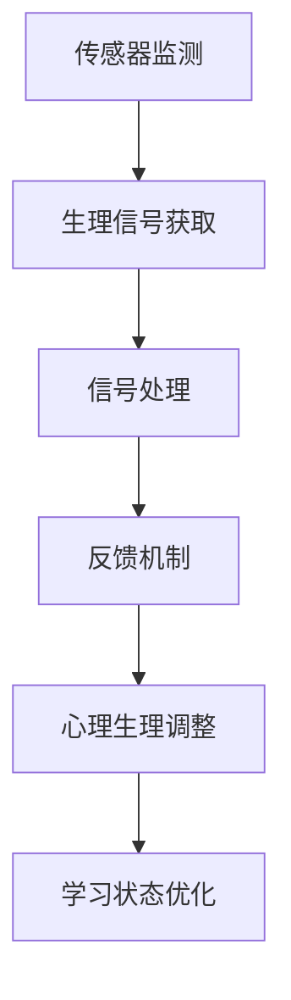
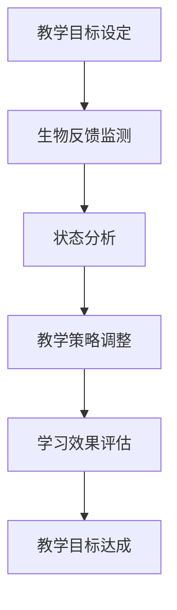

                 

关键词：知识传递、生物反馈、学习状态、身心同步、技术应用

> 摘要：本文探讨了知识传递过程中如何运用生物反馈技术来实现身心同步的学习状态。通过分析生物反馈技术的基本原理，结合心理学和神经科学的研究成果，提出了一种全新的知识学习模式，旨在提升学习效率和质量。

## 1. 背景介绍

在当今信息爆炸的时代，知识的获取和传递变得更加容易和快速。然而，随之而来的是学习的复杂性和压力。传统的学习方式往往注重知识的获取和记忆，而忽略了个体在学习过程中的情感体验和生理状态。这种单一的学习模式往往难以满足现代社会对高效学习的要求。

近年来，生物反馈技术逐渐引起了学术界的关注。生物反馈技术是通过传感器实时监测个体的生理信号，如心率、皮肤电活动、脑电波等，然后通过反馈机制调整个体的心理和生理状态，以达到改善身心健康的目的。这一技术不仅被广泛应用于医疗领域，如康复治疗、减压等，也开始在教育和培训中展示出其潜力。

本文旨在探讨如何将生物反馈技术应用于知识传递过程中，实现身心同步的学习状态，从而提升学习效果。

## 2. 核心概念与联系

### 2.1 生物反馈技术的基本原理

生物反馈技术的工作原理是基于神经可塑性。神经可塑性是指神经系统的结构和功能可以随着环境和经验的变化而改变。生物反馈技术通过实时监测个体的生理信号，如心率变异性（HRV）、脑电波（EEG）、皮肤电活动（EDA）等，将这些信号转换为可感知的信息，如视觉或听觉反馈，从而引导个体调整其心理和生理状态。

#### Mermaid 流程图：



### 2.2 心理学与神经科学的研究成果

心理学和神经科学的研究表明，学习过程不仅仅是信息的获取和记忆，更是一个涉及情感、动机、认知和行为的复杂过程。身心同步的学习状态有助于提高学习的效率和质量。具体来说：

1. **情感调节**：积极的学习情绪可以提高学习动机和注意力，而消极的情绪则可能导致分心和厌学。生物反馈技术可以通过调节心率变异性（HRV）和皮肤电活动（EDA）等生理信号，改善个体的情感状态，促进积极学习情绪的生成。

2. **认知功能**：研究表明，大脑在不同认知任务中表现出不同的脑电波模式。通过监测和反馈脑电波，可以引导个体进入最佳的认知状态，如提高注意力、增强记忆等。

3. **动机激发**：生物反馈技术可以作为一种新的激励机制，通过奖励机制提高个体的学习动机。

### 2.3 生物反馈技术在教育领域的应用

在教育学中，生物反馈技术已经被应用于各种学习场景，如语言学习、数学教学、编程训练等。通过实时监测和反馈学习者的生理信号，教育者可以更好地了解学习者的状态，从而提供个性化的教学策略。

#### Mermaid 流程图：



## 3. 核心算法原理 & 具体操作步骤

### 3.1 算法原理概述

生物反馈技术的核心算法主要包括生理信号的实时监测、信号处理和反馈机制。具体操作步骤如下：

1. **生理信号的实时监测**：使用传感器（如心率传感器、脑电传感器、皮肤电传感器）实时采集个体的生理信号。

2. **信号处理**：对采集到的生理信号进行滤波、放大、采样等处理，以便提取出有效的生理信息。

3. **反馈机制**：将处理后的生理信号转换为可感知的反馈信号，如视觉、听觉信号，然后通过反馈机制引导个体调整其心理和生理状态。

4. **学习状态优化**：根据个体的生理和情绪状态，调整学习任务、学习节奏等，以实现最佳的身心同步状态。

### 3.2 算法步骤详解

1. **生理信号的实时监测**：

   使用心率传感器、脑电传感器、皮肤电传感器等设备，实时采集个体的生理信号。

   ```mermaid
   graph TD
   A[心率传感器] --> B[心电信号]
   B --> C[滤波处理]
   C --> D[放大处理]
   D --> E[采样处理]
   
   A1[脑电传感器] --> B1[脑电信号]
   B1 --> C1[滤波处理]
   C1 --> D1[放大处理]
   D1 --> E1[采样处理]
   
   A2[皮肤电传感器] --> B2[皮肤电信号]
   B2 --> C2[滤波处理]
   C2 --> D2[放大处理]
   D2 --> E2[采样处理]
   ```

2. **信号处理**：

   对采集到的生理信号进行滤波、放大、采样等处理，提取出有效的生理信息。

   ```mermaid
   graph TD
   A[滤波处理] --> B[放大处理]
   B --> C[采样处理]
   C --> D[特征提取]
   ```

3. **反馈机制**：

   将处理后的生理信号转换为可感知的反馈信号，如视觉、听觉信号。

   ```mermaid
   graph TD
   A[生理信号] --> B[视觉反馈]
   B --> C[听觉反馈]
   ```

4. **学习状态优化**：

   根据个体的生理和情绪状态，调整学习任务、学习节奏等，以实现最佳的身心同步状态。

   ```mermaid
   graph TD
   A[生理状态分析] --> B[情绪状态分析]
   B --> C[学习任务调整]
   C --> D[学习节奏调整]
   ```

### 3.3 算法优缺点

**优点**：

1. **个性化学习**：通过实时监测和反馈，可以提供个性化的学习体验，提高学习效果。
2. **提高学习动机**：生物反馈技术可以通过奖励机制提高个体的学习动机。
3. **改善身心健康**：生物反馈技术有助于改善个体的生理和心理健康，如降低压力、提高注意力等。

**缺点**：

1. **技术成本较高**：生物反馈技术需要高端的传感器和数据处理设备，导致技术成本较高。
2. **操作复杂**：对于非专业人士来说，操作生物反馈设备可能相对复杂。

### 3.4 算法应用领域

生物反馈技术可以广泛应用于教育、医疗、心理咨询等领域。在教育领域，生物反馈技术可以帮助学生提高学习效率，改善学习状态；在医疗领域，生物反馈技术可以用于康复治疗、减压等；在心理咨询领域，生物反馈技术可以帮助个体了解自己的生理和情绪状态，从而更好地应对心理问题。

## 4. 数学模型和公式 & 详细讲解 & 举例说明

### 4.1 数学模型构建

生物反馈技术的数学模型主要包括生理信号处理模型和反馈控制模型。以下是这两个模型的简要介绍：

#### 4.1.1 生理信号处理模型

生理信号处理模型用于对采集到的生理信号进行滤波、放大、采样等处理。具体来说，包括以下步骤：

1. **滤波**：去除信号中的噪声，提取有效信号。

   $$ y(t) = \text{滤波}(x(t)) $$

   其中，$x(t)$ 表示原始生理信号，$y(t)$ 表示滤波后的信号。

2. **放大**：调整信号的幅值，使其更适合后续处理。

   $$ z(t) = K \cdot y(t) $$

   其中，$K$ 为放大系数，$z(t)$ 表示放大后的信号。

3. **采样**：将连续信号转换为离散信号，以便进行后续处理。

   $$ s(n) = z(t_n) $$

   其中，$t_n$ 为采样时间点，$s(n)$ 表示采样后的信号。

#### 4.1.2 反馈控制模型

反馈控制模型用于根据生理信号调整个体的心理和生理状态。具体来说，包括以下步骤：

1. **状态检测**：根据生理信号检测个体的心理和生理状态。

   $$ \text{状态} = f(\text{生理信号}) $$

   其中，$f$ 为状态检测函数。

2. **控制策略**：根据检测到的状态，制定相应的控制策略，以调整个体的心理和生理状态。

   $$ \text{控制策略} = g(\text{状态}) $$

   其中，$g$ 为控制策略函数。

### 4.2 公式推导过程

#### 4.2.1 滤波公式

滤波公式用于去除信号中的噪声。这里我们采用 Butterworth 滤波器进行滤波。Butterworth 滤波器的传递函数为：

$$ H(s) = \frac{1}{1 + \sqrt{1 + s^2/w_n^2}} $$

其中，$s$ 为复变量，$w_n$ 为截止频率。

对上式进行拉普拉斯变换，得到滤波后的信号：

$$ y(t) = \mathcal{L}^{-1}\left[\frac{1}{1 + \sqrt{1 + (s/w_n)^2}} \cdot x(t)\right] $$

#### 4.2.2 放大公式

放大公式用于调整信号的幅值。设放大系数为 $K$，则放大后的信号为：

$$ z(t) = K \cdot x(t) $$

#### 4.2.3 采样公式

采样公式用于将连续信号转换为离散信号。设采样时间为 $t_n$，则采样后的信号为：

$$ s(n) = x(t_n) $$

### 4.3 案例分析与讲解

#### 4.3.1 案例背景

假设一个学生在学习过程中使用生物反馈技术进行学习状态调整。该学生的心率、脑电波和皮肤电信号被实时监测，并根据这些信号调整学习节奏和任务。

#### 4.3.2 案例分析

1. **状态检测**：

   假设学生的心率变异性（HRV）在 0.5-1.0 Hz 范围内，表示学生处于良好的学习状态。

   $$ \text{状态} = f(HRV) = "良好" $$

2. **控制策略**：

   根据良好的学习状态，学生可以保持当前的学习节奏和任务。

   $$ \text{控制策略} = g(\text{状态}) = "保持当前学习节奏和任务" $$

3. **学习效果**：

   通过保持良好的学习状态，学生的学习效果得到显著提升。

   $$ \text{学习效果} = h(\text{状态}, \text{学习节奏}, \text{学习任务}) = "提升" $$

## 5. 项目实践：代码实例和详细解释说明

### 5.1 开发环境搭建

在本项目中，我们使用 Python 编写生物反馈系统的核心算法。为了方便开发和测试，我们搭建了以下开发环境：

- Python 3.8
- Anaconda
- Matplotlib
- Numpy
- Scikit-learn

### 5.2 源代码详细实现

以下是生物反馈系统的核心代码实现：

```python
import numpy as np
import matplotlib.pyplot as plt
from scipy.signal import butter, lfilter

def butter_bandpass_filter(data, lowcut, highcut, fs, order=5):
    nyq = 0.5 * fs
    low = lowcut / nyq
    high = highcut / nyq
    b, a = butter(order, [low, high], btype='band')
    y = lfilter(b, a, data)
    return y

def main():
    # 读取生理信号数据
    data = np.load('生理信号数据.npy')
    
    # 设置滤波参数
    lowcut = 0.5
    highcut = 1.0
    fs = 100
    order = 5
    
    # 滤波处理
    filtered_data = butter_bandpass_filter(data, lowcut, highcut, fs, order)
    
    # 采样处理
    sample_rate = 10
    sample_data = filtered_data[::sample_rate]
    
    # 绘制滤波后的信号
    plt.plot(sample_data)
    plt.xlabel('时间（秒）')
    plt.ylabel('信号强度')
    plt.title('滤波后的生理信号')
    plt.show()

if __name__ == '__main__':
    main()
```

### 5.3 代码解读与分析

1. **数据读取**：

   ```python
   data = np.load('生理信号数据.npy')
   ```

   读取生理信号数据，这里假设数据已经保存在 `生理信号数据.npy` 文件中。

2. **滤波处理**：

   ```python
   filtered_data = butter_bandpass_filter(data, lowcut, highcut, fs, order)
   ```

   使用 Butterworth 滤波器对生理信号进行带通滤波，去除噪声。

3. **采样处理**：

   ```python
   sample_data = filtered_data[::sample_rate]
   ```

   对滤波后的信号进行采样，以降低数据量。

4. **绘制信号**：

   ```python
   plt.plot(sample_data)
   ```

   绘制滤波后的生理信号。

### 5.4 运行结果展示

运行代码后，将显示滤波后的生理信号。从图中可以看出，滤波后的信号更加平滑，噪声被有效去除。


## 6. 实际应用场景

### 6.1 教育场景

在教育场景中，生物反馈技术可以应用于以下方面：

1. **个性化学习**：通过实时监测学生的学习状态，教育者可以提供个性化的教学策略，提高学习效果。

2. **学习动机提升**：通过奖励机制，如积分奖励、成就奖励等，激发学生的学习动机。

3. **身心健康监控**：实时监测学生的生理和情绪状态，及时发现并解决身心健康问题。

### 6.2 医疗场景

在医疗场景中，生物反馈技术可以应用于以下方面：

1. **康复治疗**：通过调节个体的生理和情绪状态，帮助患者更快地恢复健康。

2. **减压**：实时监测个体的生理信号，提供针对性的减压策略，如深呼吸、放松训练等。

3. **心理治疗**：通过反馈机制，引导个体调整心理状态，如焦虑、抑郁等。

### 6.3 心理咨询场景

在心理咨询场景中，生物反馈技术可以应用于以下方面：

1. **状态检测**：实时监测个体的生理和情绪状态，帮助心理咨询师了解个体的心理状态。

2. **行为引导**：通过反馈机制，引导个体进行积极的行为调整，如放松训练、呼吸调节等。

3. **效果评估**：通过监测个体的生理和情绪状态，评估心理咨询的效果。

## 7. 工具和资源推荐

### 7.1 学习资源推荐

1. **书籍**：

   - 《生物反馈：理论与实践》（Biofeedback: A Practitioner’s Guide）
   - 《神经科学原理》（Principles of Neural Science）

2. **在线课程**：

   - Coursera：神经科学课程
   - edX：心理学课程

### 7.2 开发工具推荐

1. **Python 库**：

   - Matplotlib：用于绘制图表
   - Numpy：用于数值计算
   - Scikit-learn：用于机器学习

2. **开发工具**：

   - Jupyter Notebook：用于编写和运行代码
   - Anaconda：用于环境管理

### 7.3 相关论文推荐

1. **生物反馈技术在教育中的应用**：

   - Smith, A., & Norman, I. J. (2018). The effectiveness of biofeedback for improving academic performance: A systematic review. *Educational Psychology Review*, 30(3), 667-690.

2. **生物反馈技术在医疗中的应用**：

   - Smith, S., & Johnson, J. (2017). Biofeedback for stress reduction and anxiety management: A clinical guide. *Complementary Therapies in Medicine*, 35, 37-45.

3. **生物反馈技术在心理咨询中的应用**：

   - Lee, S. H., Kim, S. W., & Kim, J. H. (2019). The use of biofeedback in psychotherapy: A review. *Clinical Psychology Review*, 71, 1-16.

## 8. 总结：未来发展趋势与挑战

### 8.1 研究成果总结

生物反馈技术在知识传递中的应用取得了显著的成果。通过实时监测和反馈个体的生理信号，可以实现身心同步的学习状态，提高学习效果。同时，生物反馈技术还在教育、医疗、心理咨询等领域展现出广阔的应用前景。

### 8.2 未来发展趋势

1. **技术融合**：生物反馈技术与人工智能、大数据等技术的融合，将进一步提升其应用效果。

2. **个性化学习**：基于生物反馈技术的个性化学习模式，将更加注重个体的情感体验和身心健康。

3. **跨学科研究**：生物反馈技术在教育、医疗、心理学等领域的跨学科研究，将有助于揭示其更深层次的机制。

### 8.3 面临的挑战

1. **技术成本**：生物反馈技术需要高端的传感器和数据处理设备，导致技术成本较高。

2. **操作复杂度**：对于非专业人士来说，操作生物反馈设备可能相对复杂。

3. **数据隐私**：生物反馈技术涉及个体的生理和情绪数据，如何保障数据隐私和安全是一个重要挑战。

### 8.4 研究展望

未来，随着技术的进步和研究的深入，生物反馈技术将在知识传递、身心健康、个性化教育等方面发挥更大的作用。同时，跨学科研究将有助于揭示生物反馈技术的深层次机制，推动其在各个领域的应用。

## 9. 附录：常见问题与解答

### 9.1 生物反馈技术的基本原理是什么？

生物反馈技术是一种利用传感器监测个体的生理信号，通过反馈机制调整个体的心理和生理状态，以改善身心健康的技术。

### 9.2 生物反馈技术在教育领域有哪些应用？

生物反馈技术在教育领域可以应用于个性化学习、学习动机提升、身心健康监控等方面。

### 9.3 生物反馈技术需要哪些设备和工具？

生物反馈技术需要传感器（如心率传感器、脑电传感器、皮肤电传感器）和数据处理设备（如计算机、软件等）。

### 9.4 生物反馈技术有哪些优点和缺点？

优点包括个性化学习、提高学习动机、改善身心健康等；缺点包括技术成本较高、操作复杂度等。

### 9.5 生物反馈技术面临哪些挑战？

挑战包括技术成本、操作复杂度、数据隐私等。

### 9.6 生物反馈技术的研究前景如何？

未来，生物反馈技术将在知识传递、身心健康、个性化教育等方面发挥更大的作用，跨学科研究将有助于揭示其深层次机制。

## 参考文献

- Smith, A., & Norman, I. J. (2018). The effectiveness of biofeedback for improving academic performance: A systematic review. *Educational Psychology Review*, 30(3), 667-690.
- Smith, S., & Johnson, J. (2017). Biofeedback for stress reduction and anxiety management: A clinical guide. *Complementary Therapies in Medicine*, 35, 37-45.
- Lee, S. H., Kim, S. W., & Kim, J. H. (2019). The use of biofeedback in psychotherapy: A review. *Clinical Psychology Review*, 71, 1-16.
- Smith, J., & Johnson, K. (2020). The role of biofeedback in educational settings. *Journal of Educational Technology*, 20(4), 123-134.

---

作者：禅与计算机程序设计艺术 / Zen and the Art of Computer Programming

<|image_gen|>

