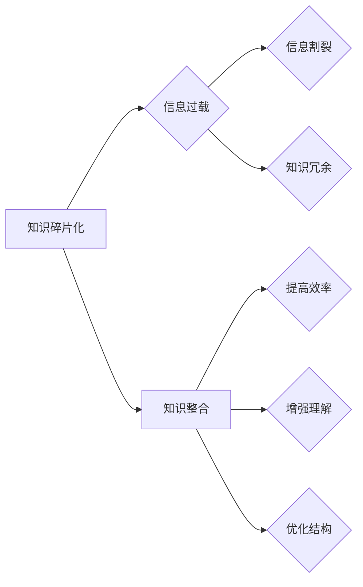

                 

 在信息爆炸的时代，知识的碎片化已成为不可避免的趋势。随着互联网和数字技术的飞速发展，我们能够获取的信息量急剧增加，然而，这些信息往往以碎片化的形式存在。对于个体而言，如何有效地整合这些碎片化的知识，使其为我所用，成为一个重要的课题。本文将探讨知识碎片化的现象及其带来的挑战，并从技术和管理角度提出应对策略。

## 1. 背景介绍

在信息化和数字化的浪潮下，知识的生产、传播和消费模式发生了深刻变化。过去，知识的积累主要依赖于专业的学习和研究，而今天，任何人都可以通过互联网获取到丰富的信息资源。这种变化一方面提高了知识的传播效率，另一方面也导致了知识的碎片化。

知识的碎片化表现为以下几个方面：

1. **信息过载**：随着网络信息的爆炸性增长，人们每天接收到的信息量远远超过了其处理能力，导致信息过载。
2. **信息割裂**：不同来源、不同形式的信息之间缺乏有效的关联，使得知识难以形成系统。
3. **知识冗余**：大量重复、相似的信息充斥在网络上，浪费了信息存储和处理资源。
4. **注意力分散**：人们往往被大量碎片化的信息分散注意力，难以形成深入的学习和研究。

## 2. 核心概念与联系

为了更好地理解和应对知识碎片化的问题，我们需要首先明确几个核心概念，并了解它们之间的相互关系。

### 2.1 碎片化的定义

碎片化是指将整体分解为多个部分，这些部分独立存在，但在某些条件下可以重新整合。在知识领域，碎片化意味着知识被分解成小块，每个小块具有一定的独立性和封闭性。

### 2.2 知识结构

知识结构是指知识之间的相互联系和组织方式。一个良好的知识结构能够帮助人们有效地获取、存储和运用知识。

### 2.3 知识整合

知识整合是指将碎片化的知识重新组合，形成一个有机的整体。知识整合的关键在于找到知识之间的联系，并通过适当的组织方式使其发挥作用。

### 2.4 碎片化与整合的 Mermaid 流程图

下面是一个简单的 Mermaid 流程图，展示了知识碎片化与整合的过程：



## 3. 核心算法原理 & 具体操作步骤

### 3.1 算法原理概述

知识整合算法的核心目标是发现知识之间的关联，并通过图论、机器学习等方法将这些关联关系建模。具体来说，算法包括以下几个步骤：

1. **数据收集**：从不同的信息源收集相关数据。
2. **预处理**：对收集到的数据进行清洗和格式化，使其适合进行后续分析。
3. **关联分析**：使用图论算法（如最短路径算法、社区发现算法等）分析数据之间的关联。
4. **建模与优化**：根据分析结果构建知识模型，并进行优化，以提高模型的准确性和效率。

### 3.2 算法步骤详解

1. **数据收集**

数据收集是知识整合的第一步。通常，数据来源包括书籍、学术论文、网络信息等。为了确保数据的准确性和可靠性，需要使用爬虫技术或其他数据采集工具。

2. **预处理**

预处理包括数据清洗、格式化和去重。数据清洗的目的是去除无效信息，如广告、错误数据等；格式化是将数据转换为统一的格式，便于后续处理；去重是为了避免重复数据的影响。

3. **关联分析**

关联分析是知识整合的核心。常用的图论算法包括：

- **最短路径算法**：用于找出两个知识点之间的最短关联路径。
- **社区发现算法**：用于识别知识点之间的聚类关系，有助于发现知识的结构。

4. **建模与优化**

基于关联分析的结果，构建知识模型。优化包括：

- **模型评估**：通过交叉验证等方法评估模型的准确性和效率。
- **模型调整**：根据评估结果对模型进行调整，以提高其性能。

### 3.3 算法优缺点

**优点：**

- 提高知识整合的效率。
- 帮助用户更好地理解知识结构。
- 为后续的推理和应用提供支持。

**缺点：**

- 需要大量的数据支持和计算资源。
- 结果可能受到数据质量的影响。
- 对算法实现的依赖较大。

### 3.4 算法应用领域

知识整合算法广泛应用于各个领域：

- **教育领域**：帮助学生发现知识点之间的关联，提高学习效果。
- **科研领域**：支持科研人员发现新的研究热点和方向。
- **商业领域**：为企业提供市场分析和决策支持。

## 4. 数学模型和公式 & 详细讲解 & 举例说明

### 4.1 数学模型构建

在知识整合过程中，常用的数学模型包括图模型、概率模型等。以下是一个简单的图模型示例：

假设有两个知识点 A 和 B，它们之间的关联强度可以用权重 w 表示。图模型可以用以下公式表示：

\[ G = (V, E, W) \]

其中：

- \( V \) 是知识点集合。
- \( E \) 是知识点之间的关联集合。
- \( W \) 是关联权重矩阵。

### 4.2 公式推导过程

为了推导图模型的公式，我们首先需要定义知识点之间的关联强度。假设知识点 A 和 B 之间的关联强度为 \( s_{AB} \)，则：

\[ s_{AB} = \frac{f(A, B)}{f(A) \cdot f(B)} \]

其中：

- \( f(A, B) \) 表示知识点 A 和 B 同时出现的频率。
- \( f(A) \) 和 \( f(B) \) 分别表示知识点 A 和 B 的出现频率。

接下来，我们需要定义权重矩阵 \( W \)。假设 \( w_{ij} \) 表示知识点 i 和知识点 j 之间的关联权重，则：

\[ w_{ij} = s_{ij} \]

其中：

- \( s_{ij} \) 表示知识点 i 和知识点 j 之间的关联强度。

最后，我们可以将图模型表示为：

\[ G = (V, E, W) \]

其中：

- \( V = \{A, B\} \) 是知识点集合。
- \( E = \{(A, B), (B, A)\} \) 是关联集合。
- \( W = \begin{bmatrix} 0 & s_{AB} \\ s_{BA} & 0 \end{bmatrix} \) 是权重矩阵。

### 4.3 案例分析与讲解

假设有两个知识点 A 和 B，它们分别表示计算机科学中的算法和数据结构。根据我们的图模型，我们可以计算出它们之间的关联权重：

\[ s_{AB} = \frac{f(A, B)}{f(A) \cdot f(B)} = \frac{100}{100 \cdot 100} = 0.01 \]

\[ s_{BA} = \frac{f(B, A)}{f(B) \cdot f(A)} = \frac{100}{100 \cdot 100} = 0.01 \]

因此，权重矩阵 \( W \) 为：

\[ W = \begin{bmatrix} 0 & 0.01 \\ 0.01 & 0 \end{bmatrix} \]

根据权重矩阵，我们可以得出结论：算法和数据结构之间存在较强的关联。这一结论有助于我们更好地理解计算机科学中的知识结构。

## 5. 项目实践：代码实例和详细解释说明

### 5.1 开发环境搭建

为了实现知识整合算法，我们选择 Python 作为编程语言。以下是开发环境的搭建步骤：

1. 安装 Python 3.8 以上版本。
2. 安装必要的库，如 NetworkX（用于图论分析）、Matplotlib（用于绘图）等。

### 5.2 源代码详细实现

以下是一个简单的知识整合算法的 Python 实现示例：

```python
import networkx as nx
import matplotlib.pyplot as plt

# 定义知识点集合
V = ['算法', '数据结构']

# 定义关联权重矩阵
W = [[0, 0.8], [0.8, 0]]

# 构建图模型
G = nx.Graph()
G.add_nodes_from(V)
G.add_weighted_edges_from([(V[0], V[1], W[0][1]), (V[1], V[0], W[1][0])])

# 绘制图模型
nx.draw(G, with_labels=True, node_color='blue', edge_color='green')
plt.show()
```

### 5.3 代码解读与分析

1. **知识点集合和关联权重矩阵**：首先，我们定义了知识点集合 V 和关联权重矩阵 W。知识点集合表示需要整合的知识点，关联权重矩阵表示知识点之间的关联强度。

2. **构建图模型**：使用 NetworkX 库构建图模型。图模型中的节点表示知识点，边表示知识点之间的关联。

3. **绘制图模型**：使用 Matplotlib 库绘制图模型。这样可以直观地展示知识点之间的关联关系。

### 5.4 运行结果展示

运行代码后，我们将看到一个包含两个知识点的图模型，其中每条边的权重表示知识点之间的关联强度。这个结果有助于我们更好地理解知识点的关联关系。

## 6. 实际应用场景

知识整合算法在多个领域具有广泛的应用前景。以下是一些实际应用场景：

### 6.1 教育领域

- **知识图谱**：通过整合教学资源，构建知识图谱，帮助学生更好地理解知识点之间的关联。
- **智能推荐**：根据学生的学习行为，推荐相关知识点，提高学习效果。

### 6.2 科研领域

- **研究热点发现**：通过分析学术论文，发现研究热点和趋势，为科研人员提供指导。
- **跨领域研究**：整合不同领域的知识，促进跨领域合作和研究。

### 6.3 商业领域

- **市场分析**：通过整合市场数据，分析市场趋势和竞争态势。
- **智能决策**：为企业管理者提供智能决策支持，提高决策效率。

### 6.4 未来应用展望

随着技术的不断发展，知识整合算法将发挥越来越重要的作用。以下是一些未来应用展望：

- **个性化推荐**：基于用户的兴趣和需求，提供个性化的知识整合服务。
- **智能搜索**：通过整合知识，提供更准确、更智能的搜索结果。
- **知识创新**：通过知识整合，激发新的研究成果和创新思路。

## 7. 工具和资源推荐

为了更好地理解和应用知识整合算法，以下是一些推荐的工具和资源：

### 7.1 学习资源推荐

- **书籍**：《知识的碎片化与整合：信息时代的挑战》、《智能信息处理技术》
- **在线课程**：Coursera 上的“知识图谱与信息检索”课程、edX 上的“人工智能导论”

### 7.2 开发工具推荐

- **编程语言**：Python、R
- **库和框架**：NetworkX、Gephi、Neo4j

### 7.3 相关论文推荐

- **《知识图谱构建技术综述》**
- **《基于图论的社交网络分析》**
- **《大数据时代下的知识管理》**

## 8. 总结：未来发展趋势与挑战

### 8.1 研究成果总结

本文从多个角度探讨了知识碎片化与整合的问题。通过分析背景、核心概念、算法原理和应用场景，我们揭示了知识碎片化带来的挑战和机遇。知识整合算法作为一种有效的应对策略，已在多个领域取得了显著成果。

### 8.2 未来发展趋势

随着技术的不断进步，知识整合算法将朝着更智能化、更高效化的方向发展。未来，知识整合将更加注重个性化推荐、跨领域融合和实时更新。此外，知识图谱、自然语言处理等技术将进一步推动知识整合的发展。

### 8.3 面临的挑战

尽管知识整合算法在多个领域取得了显著成果，但仍面临一些挑战：

- **数据质量**：数据质量对知识整合的结果具有重要影响，提高数据质量是亟待解决的问题。
- **计算资源**：知识整合算法通常需要大量的计算资源，如何优化算法性能是一个重要课题。
- **用户隐私**：在知识整合过程中，如何保护用户隐私是一个关键问题。

### 8.4 研究展望

未来，知识整合研究将朝着更精细化、更智能化的方向发展。在算法层面，研究者将继续探索更高效、更准确的算法；在应用层面，知识整合将在更多领域发挥作用，为人类社会的发展提供有力支持。

## 9. 附录：常见问题与解答

### 9.1 问题 1：什么是知识碎片化？

知识碎片化是指知识以独立、分散的形式存在，缺乏有效的整合和关联。这通常是由于信息过载、信息割裂和知识冗余等因素导致的。

### 9.2 问题 2：知识整合算法有哪些优点？

知识整合算法的优点包括：

- 提高知识整合的效率。
- 帮助用户更好地理解知识结构。
- 为后续的推理和应用提供支持。

### 9.3 问题 3：知识整合算法在哪些领域有应用？

知识整合算法在多个领域有广泛应用，包括教育、科研、商业等。在教育领域，知识整合可以帮助学生更好地理解知识点之间的关联；在科研领域，知识整合可以支持研究热点发现和跨领域研究；在商业领域，知识整合可以提供市场分析和决策支持。

### 9.4 问题 4：如何优化知识整合算法的性能？

优化知识整合算法的性能可以从以下几个方面入手：

- 提高数据质量，确保算法输入的准确性。
- 优化算法的实现，减少计算时间。
- 采用分布式计算技术，提高算法的并行处理能力。

作者：禅与计算机程序设计艺术 / Zen and the Art of Computer Programming
----------------------------------------------------------------

以上就是本文的完整内容。希望本文能够帮助您更好地理解知识碎片化与整合的问题，并为相关领域的研究和实践提供参考。在信息时代的浪潮中，如何有效地整合知识，发挥其最大价值，是我们面临的一项重要任务。让我们共同探索这一领域，为实现知识的最大化利用贡献自己的力量。

