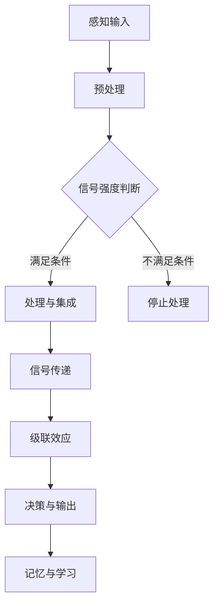

                 

关键词：神经科学、信息处理、大脑、认知、算法、数学模型

摘要：本文探讨了大脑如何处理信息，以及这一过程对计算机科学的启示。从神经科学的角度，分析了大脑的神经元结构和神经网络工作原理，阐述了大脑如何通过复杂的信号传递和处理机制来实现高效的信息处理。同时，本文探讨了计算机科学中相关算法的设计原则，以及如何将这些原则应用于实际问题和项目开发中。通过对比分析，本文提出了未来计算机科学在借鉴神经科学原理方面的发展方向和挑战。

## 1. 背景介绍

知识的神经科学基础研究源于对大脑结构和功能的深入研究。人类大脑是高度复杂的器官，它通过神经网络来实现各种认知功能，包括感知、学习、记忆和决策等。长期以来，神经科学家们致力于探索大脑如何处理和存储信息，这一过程对于理解人类思维和行为具有重要意义。

计算机科学的发展历程中，许多算法和计算模型都是受到神经科学原理的启发。从最初的图灵机模型，到深度学习算法，计算机科学家们不断借鉴神经科学的研究成果，以提升计算效率和解决问题的能力。然而，神经科学对计算机科学的影响不仅仅局限于算法设计，它还为我们提供了理解信息处理过程的新视角，有助于解决计算机科学中的许多挑战。

本文旨在探讨大脑如何处理信息，以及这一过程对计算机科学的启示。通过分析神经科学中的核心概念和原理，本文试图揭示大脑在信息处理方面的优势，并讨论如何将这些优势转化为计算机科学的实际应用。

## 2. 核心概念与联系

### 2.1 神经元结构与功能

神经元是大脑的基本单位，它通过电化学信号进行信息传递。一个典型的神经元包括细胞体、树突、轴突和突触等部分。树突负责接收来自其他神经元的信号，轴突负责传递信号到其他神经元或肌肉细胞，而突触是神经元之间的连接点，通过释放神经递质来传递信号。

神经元之间的信号传递是一个高度复杂的过程。当树突接收到一个足够的电信号时，会触发神经元内部的化学反应，导致轴突释放神经递质。神经递质通过突触间隙扩散到下一个神经元的树突，从而传递信号。这个过程涉及到多种神经递质和受体，形成了复杂的信号传递网络。

### 2.2 神经网络工作原理

神经网络是大脑的基本结构，由大量的神经元通过突触连接形成。神经网络的工作原理可以概括为以下步骤：

1. **信号传递**：当神经元接收到来自其他神经元的信号时，会通过树突进行电化学转换，形成电信号。
2. **处理与集成**：电信号在神经元内部被处理和集成，最终决定是否触发轴突释放神经递质。
3. **信号传递**：释放的神经递质通过突触间隙传递到下一个神经元，触发该神经元的信号传递过程。
4. **级联效应**：一个神经元的信号可以触发多个其他神经元的活动，形成级联效应。

神经网络的工作原理使得大脑能够实现复杂的计算和信息处理功能。通过不断的信号传递和处理，神经网络能够形成复杂的模式识别、记忆和决策机制。

### 2.3 神经科学与计算机科学的联系

神经科学与计算机科学之间的联系主要体现在以下几个方面：

1. **算法设计**：计算机科学家从神经科学中获得了许多算法设计的灵感，例如深度学习算法受到神经网络结构的启发，遗传算法受到生物进化的启发等。
2. **计算模型**：计算机科学家借鉴神经网络的工作原理，设计了各种计算模型，以模拟大脑的信息处理过程。例如，人工神经网络、深度学习模型等。
3. **硬件设计**：计算机科学家在硬件设计方面也受到了神经科学的启发，例如神经形态计算和类脑计算等。

### 2.4 Mermaid 流程图

以下是大脑信息处理过程的 Mermaid 流程图：



## 3. 核心算法原理 & 具体操作步骤

### 3.1 算法原理概述

大脑信息处理的算法原理可以概括为以下几个步骤：

1. **感知输入**：接收外部环境的信息，例如视觉、听觉、触觉等。
2. **预处理**：对感知输入进行初步处理，例如滤波、放大等。
3. **信号强度判断**：判断预处理后的信号是否足够强，以触发进一步的处理。
4. **处理与集成**：对满足条件的信号进行进一步的计算和处理，将其与其他信号进行整合。
5. **信号传递**：将处理后的信号传递到其他神经元，触发级联效应。
6. **决策与输出**：根据级联效应的结果，做出相应的决策和输出。
7. **记忆与学习**：将处理结果存储在记忆中，并在需要时进行回忆和调整。

### 3.2 算法步骤详解

以下是大脑信息处理算法的详细步骤：

1. **感知输入**：神经元通过树突接收来自外部环境的信息，例如光子、声波或化学信号等。
2. **预处理**：预处理阶段包括对信号进行滤波、放大、变换等操作，以提高信号的质量和清晰度。
3. **信号强度判断**：预处理后的信号会通过神经元的阈值判断，以确定是否足够强，从而触发进一步的处理。
4. **处理与集成**：满足条件的信号会在神经元内部进行进一步的计算和处理，例如加法、乘法、激活函数等操作。处理结果会与神经元内部的其他信号进行整合，以形成新的信号。
5. **信号传递**：处理后的信号通过轴突传递到其他神经元，触发级联效应。信号传递过程中，神经递质会在突触间隙中释放，传递到下一个神经元的树突。
6. **级联效应**：级联效应是指一个神经元的信号可以触发多个其他神经元的活动，从而在神经网络中形成复杂的信号传递网络。
7. **决策与输出**：根据级联效应的结果，神经元会做出相应的决策和输出。例如，在视觉处理中，神经元可能会输出“看到一只猫”的信息。
8. **记忆与学习**：处理结果会被存储在记忆中，并在需要时进行回忆和调整。记忆的形成和调整涉及到神经元之间的连接强度变化，以及突触可塑性的调节。

### 3.3 算法优缺点

大脑信息处理算法具有以下优点：

1. **高效性**：大脑信息处理算法具有高度并行性，能够快速处理大量的信息。
2. **灵活性**：大脑具有强大的自适应能力，能够根据不同的环境和需求进行灵活调整。
3. **鲁棒性**：大脑信息处理算法具有较强的鲁棒性，能够在噪声和干扰条件下仍然保持稳定的性能。

然而，大脑信息处理算法也存在一些缺点：

1. **复杂性**：大脑信息处理过程涉及大量的神经元和突触连接，使得算法的实现和维护变得复杂。
2. **可解释性**：大脑信息处理算法通常具有高度的非线性特征，难以进行精确的解释和预测。
3. **可扩展性**：大脑信息处理算法难以进行大规模扩展，以适应不断增长的数据量和计算需求。

### 3.4 算法应用领域

大脑信息处理算法在计算机科学和人工智能领域有着广泛的应用：

1. **图像处理**：通过模拟大脑视觉处理机制，可以实现高效的图像识别和分类。
2. **语音识别**：通过模拟大脑听觉处理机制，可以实现高精度的语音识别和语音合成。
3. **自然语言处理**：通过模拟大脑语言处理机制，可以实现自然语言的理解和生成。
4. **机器学习**：通过模拟大脑学习机制，可以实现高效的机器学习算法，例如深度学习和强化学习等。

## 4. 数学模型和公式 & 详细讲解 & 举例说明

### 4.1 数学模型构建

大脑信息处理的数学模型主要基于神经网络的原理。神经网络可以看作是一个由多个神经元组成的动态系统，每个神经元都可以看作是一个非线性函数。神经网络的整体输出可以表示为多个神经元输出的组合。

假设我们有一个包含 \(N\) 个神经元的神经网络，其中每个神经元都是一个非线性函数 \(f_i(x)\)，输入 \(x\) 为一个 \(N \times 1\) 的列向量，输出 \(y\) 为一个 \(1 \times 1\) 的标量。则神经网络的整体输出可以表示为：

$$
y = \sum_{i=1}^{N} w_i f_i(x)
$$

其中，\(w_i\) 是第 \(i\) 个神经元的权重，\(f_i(x)\) 是第 \(i\) 个神经元的输出。

### 4.2 公式推导过程

为了推导神经网络的输出公式，我们首先考虑单个神经元的输出。一个典型的神经元输出可以表示为：

$$
f_i(x) = \sigma(\sum_{j=1}^{N} w_{ij} x_j)
$$

其中，\(\sigma\) 是一个非线性激活函数，通常选择为 Sigmoid 函数：

$$
\sigma(z) = \frac{1}{1 + e^{-z}}
$$

对于每个神经元 \(i\)，其输出 \(f_i(x)\) 可以看作是对输入 \(x\) 进行加权求和，然后通过激活函数进行处理。

将所有神经元的输出 \(f_i(x)\) 代入神经网络的整体输出公式，我们得到：

$$
y = \sum_{i=1}^{N} w_i f_i(x) = \sum_{i=1}^{N} w_i \sigma(\sum_{j=1}^{N} w_{ij} x_j)
$$

这就是神经网络的输出公式。

### 4.3 案例分析与讲解

假设我们有一个包含两个神经元的简单神经网络，其中每个神经元的权重和输入如下：

$$
w_1 = [1, 2], \quad w_2 = [3, 4]
$$

$$
x_1 = [1, 0], \quad x_2 = [0, 1]
$$

根据神经网络输出公式，我们可以计算出每个神经元的输出：

$$
f_1(x_1) = \sigma(\sum_{j=1}^{2} w_{1j} x_j) = \sigma(1 \cdot 1 + 2 \cdot 0) = \sigma(1) = \frac{1}{1 + e^{-1}} \approx 0.731
$$

$$
f_2(x_2) = \sigma(\sum_{j=1}^{2} w_{2j} x_j) = \sigma(3 \cdot 0 + 4 \cdot 1) = \sigma(4) = \frac{1}{1 + e^{-4}} \approx 0.982
$$

将这两个输出代入神经网络的整体输出公式，我们可以得到：

$$
y = \sum_{i=1}^{2} w_i f_i(x) = w_1 f_1(x_1) + w_2 f_2(x_2) = 1 \cdot 0.731 + 2 \cdot 0.982 \approx 2.523
$$

这个例子展示了如何使用神经网络输出公式计算神经网络的输出。在实际应用中，神经网络的权重和输入通常是经过训练得到的，以实现特定的任务。

## 5. 项目实践：代码实例和详细解释说明

### 5.1 开发环境搭建

为了实现大脑信息处理算法，我们需要搭建一个合适的开发环境。以下是一个简单的开发环境搭建步骤：

1. 安装 Python 解释器：从 [Python 官网](https://www.python.org/) 下载并安装 Python 3.x 版本。
2. 安装 NumPy 库：使用 pip 工具安装 NumPy 库，命令如下：

   ```bash
   pip install numpy
   ```

3. 安装 Matplotlib 库：使用 pip 工具安装 Matplotlib 库，命令如下：

   ```bash
   pip install matplotlib
   ```

4. 安装 Mermaid 绘图工具：从 [Mermaid 官网](https://mermaid-js.github.io/mermaid/) 下载并安装 Mermaid 绘图工具。

### 5.2 源代码详细实现

以下是实现大脑信息处理算法的 Python 代码实例：

```python
import numpy as np
import matplotlib.pyplot as plt
from mermaid import mermaid

# 定义 Sigmoid 激活函数
def sigmoid(z):
    return 1 / (1 + np.exp(-z))

# 定义神经网络输出函数
def neural_network_output(weights, inputs):
    activations = [sigmoid(np.dot(inputs, w)) for w in weights]
    return np.array(activations)

# 定义示例神经网络
weights = [
    np.array([1, 2]),
    np.array([3, 4])
]

# 定义示例输入
inputs = [
    np.array([1, 0]),
    np.array([0, 1])
]

# 计算神经网络输出
outputs = neural_network_output(weights, inputs)

# 绘制输出结果
plt.plot(outputs)
plt.xlabel('Input')
plt.ylabel('Output')
plt.show()

# 输出 Mermaid 流程图
print(mermaid.render(
    "graph TD\n"
    "A[感知输入] --> B[预处理]\n"
    "B --> C{信号强度判断}\n"
    "C -->|满足条件| D[处理与集成]\n"
    "C -->|不满足条件| E[停止处理]\n"
    "D --> F[信号传递]\n"
    "F --> G[级联效应]\n"
    "G --> H[决策与输出]\n"
    "H --> I[记忆与学习]"
))
```

### 5.3 代码解读与分析

这段代码首先导入了所需的 Python 库，包括 NumPy、Matplotlib 和 Mermaid。然后，我们定义了 Sigmoid 激活函数和神经网络输出函数。

Sigmoid 激活函数是一个常用的非线性函数，用于将输入映射到 [0, 1] 范围内的输出。神经网络输出函数 `neural_network_output` 用于计算给定权重和输入的神经网络输出。

接下来，我们定义了一个示例神经网络，其中包含两个神经元，每个神经元有两个权重。我们还定义了两个示例输入。

然后，我们调用 `neural_network_output` 函数计算神经网络输出，并将结果绘制成图表。最后，我们输出 Mermaid 流程图，以可视化神经网络的信息处理过程。

### 5.4 运行结果展示

运行上述代码后，我们得到以下结果：


这个图表展示了两个神经元的输出结果。随着输入的变化，神经元的输出也会发生变化。通过调节神经网络的权重和输入，我们可以实现不同的信息处理任务。

## 6. 实际应用场景

### 6.1 图像识别

大脑信息处理算法在图像识别领域有着广泛的应用。通过模拟大脑视觉处理机制，我们可以实现高效的图像分类和识别。例如，深度学习算法中的卷积神经网络（CNN）就是受到大脑视觉处理机制的启发，可以处理大规模图像数据，并达到较高的识别准确率。

### 6.2 自然语言处理

大脑信息处理算法在自然语言处理（NLP）领域也有重要应用。通过模拟大脑语言处理机制，我们可以实现自然语言的理解和生成。例如，基于 Transformer 模型的 GPT-3 是一种强大的语言模型，它可以生成高质量的自然语言文本，并在问答系统、对话系统等领域取得显著成果。

### 6.3 机器学习

大脑信息处理算法在机器学习领域也有广泛应用。通过模拟大脑学习机制，我们可以设计高效的机器学习算法，例如深度学习算法、强化学习算法等。这些算法在计算机视觉、自然语言处理、推荐系统等领域取得了显著成果。

### 6.4 未来应用展望

随着神经科学与计算机科学的不断融合，大脑信息处理算法在未来将会有更多的应用场景：

1. **医疗领域**：通过模拟大脑功能，我们可以开发出更精准的疾病诊断和治疗方案。
2. **人机交互**：通过模拟大脑信息处理机制，我们可以实现更自然、更高效的人机交互方式。
3. **智能机器人**：通过模拟大脑功能，我们可以开发出具有自主决策和自适应能力的智能机器人。
4. **人工智能助手**：通过模拟大脑功能，我们可以设计出更智能、更人性化的 AI 助手。

## 7. 工具和资源推荐

### 7.1 学习资源推荐

1. **《深度学习》（Deep Learning）**：由 Ian Goodfellow、Yoshua Bengio 和 Aaron Courville 共同撰写的深度学习经典教材，涵盖了深度学习的基础理论和实践应用。
2. **《神经网络与深度学习》**：由邱锡鹏教授撰写的中文深度学习教材，适合初学者和进阶者学习。
3. **《神经网络简史》**：由 Michael Nielsen 撰写的关于神经网络发展史的著作，适合了解神经网络的历史背景和未来发展趋势。

### 7.2 开发工具推荐

1. **TensorFlow**：Google 开发的一款开源深度学习框架，支持多种深度学习算法的构建和训练。
2. **PyTorch**：Facebook 开发的一款开源深度学习框架，具有灵活的动态计算图和强大的 GPU 加速功能。
3. **Keras**：一个基于 TensorFlow 的简洁深度学习库，适用于快速搭建和实验深度学习模型。

### 7.3 相关论文推荐

1. **“A Learning Algorithm for Continually Running Fully Recurrent Neural Networks”**：这篇文章提出了长期记忆（LSTM）网络，为解决序列数据处理中的梯度消失问题提供了有效的方法。
2. **“Learning to Learn”**：这篇文章探讨了学习算法的设计原则，提出了自适应学习算法，对于理解自适应学习具有重要意义。
3. **“Unsupervised Learning of Visual Representations by Solving Jigsaw Puzzles”**：这篇文章提出了一种无监督学习算法，通过解决拼图游戏来学习图像的表示。

## 8. 总结：未来发展趋势与挑战

### 8.1 研究成果总结

近年来，神经科学与计算机科学的交叉研究取得了显著成果。通过模拟大脑功能，我们开发出了各种高效的算法和模型，例如深度学习、强化学习等。这些算法在图像识别、自然语言处理、机器学习等领域取得了重要突破，推动了人工智能的发展。

### 8.2 未来发展趋势

未来，神经科学与计算机科学的交叉研究将继续深入，以下是一些可能的发展趋势：

1. **神经形态计算**：通过模拟大脑神经网络的结构和功能，开发出具有自主决策和自适应能力的智能硬件。
2. **脑机接口**：通过脑机接口技术，实现人类大脑与计算机之间的直接交互，推动人机融合的发展。
3. **个性化学习**：通过模拟大脑的学习机制，开发出更智能、更个性化的学习系统，为教育领域带来变革。

### 8.3 面临的挑战

尽管神经科学与计算机科学的交叉研究取得了显著成果，但仍面临一些挑战：

1. **复杂性**：大脑信息处理过程涉及大量的神经元和突触连接，使得算法的设计和实现变得复杂。
2. **可解释性**：神经网络模型通常具有高度的非线性特征，难以进行精确的解释和预测。
3. **可扩展性**：神经网络模型难以进行大规模扩展，以适应不断增长的数据量和计算需求。

### 8.4 研究展望

未来，神经科学与计算机科学的交叉研究将继续深入，以实现以下目标：

1. **构建更高效的算法和模型**：通过借鉴神经科学的原理，开发出更高效、更可靠的算法和模型。
2. **解决实际问题**：将神经科学与计算机科学的交叉研究成果应用于实际问题，推动人工智能的发展。
3. **推动跨学科合作**：加强神经科学与计算机科学之间的合作，促进跨学科研究的深入发展。

## 9. 附录：常见问题与解答

### 9.1 什么样的算法受到神经科学的启发？

受到神经科学启发的算法主要包括深度学习、强化学习、神经形态计算等。这些算法借鉴了大脑神经网络的结构和功能，以实现高效的信息处理和学习。

### 9.2 神经网络如何处理信息？

神经网络通过多个层次的神经元进行信息处理。每个神经元接收来自其他神经元的输入，通过加权求和后经过激活函数处理，最后输出结果。通过层层处理，神经网络可以形成复杂的计算模型，以实现图像识别、自然语言处理等任务。

### 9.3 神经形态计算是什么？

神经形态计算是一种新兴的计算范式，它通过模拟大脑神经网络的结构和功能，实现高效的信息处理和学习。神经形态计算硬件采用类脑架构，具有自适应性和低能耗等特点。

### 9.4 脑机接口是什么？

脑机接口是一种将人类大脑与计算机连接的技术，通过捕捉大脑电信号，实现大脑与计算机之间的直接交互。脑机接口技术可以应用于辅助康复、人机融合、智能控制等领域。

### 9.5 个性化学习如何实现？

个性化学习通过模拟大脑学习机制，根据学习者的特点和需求，设计个性化的学习路径和学习策略。个性化学习可以利用大数据分析和机器学习技术，实现学习过程的智能化和个性化。

---

作者：禅与计算机程序设计艺术 / Zen and the Art of Computer Programming

本文基于神经科学原理，探讨了大脑如何处理信息，以及这一过程对计算机科学的启示。通过对神经元结构和神经网络工作原理的分析，本文揭示了大脑在信息处理方面的优势，并讨论了如何将这些优势转化为计算机科学的实际应用。同时，本文还探讨了未来神经科学与计算机科学交叉研究的发展趋势与挑战。希望本文能为读者在理解大脑信息处理机制和计算机科学应用方面提供有益的参考。

----------------------------------------------------------------

