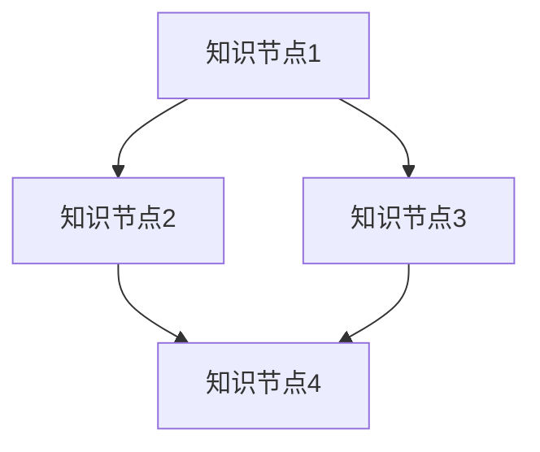

                 

 关键词：知识网络、拓扑结构、信息流动、结构分析、AI、机器学习、图论

> 摘要：本文深入探讨了知识在网络拓扑中的表现形式和作用，通过分析信息流动的结构，探讨了如何有效地构建、优化和维护知识网络。文章首先介绍了知识网络的背景和重要性，然后通过图论方法分析了信息流动的拓扑结构，接着详细讲解了核心算法原理和具体操作步骤，并结合数学模型和项目实践进行了深入探讨。文章最后展望了知识网络在未来的发展趋势和面临的挑战。

## 1. 背景介绍

在信息时代，知识作为一种重要的资源，其流动和共享对于个人、企业和整个社会的发展具有重要意义。然而，传统的知识管理方法往往局限于线性的文档形式，难以应对复杂的信息环境和多样化的知识需求。为了更好地挖掘和利用知识，我们需要从网络拓扑的角度来重新审视知识的组织、存储和传播。

知识网络，是一种以知识为中心，通过节点和边的关系来表示知识及其之间相互联系的网络结构。它能够更好地反映知识之间的复杂关系，为知识的管理、共享和创新提供新的思路。而网络拓扑，作为知识网络的基础结构，对于信息流动有着重要的影响。通过研究网络拓扑，我们可以深入了解知识在网络中的流动规律，从而优化知识网络的构建和维护。

本文将围绕知识网络拓扑展开讨论，通过图论方法分析信息流动的结构，探讨核心算法原理和具体操作步骤，并结合数学模型和项目实践进行深入探讨，以期为知识网络的构建和管理提供新的理论和方法。

## 2. 核心概念与联系

### 2.1 知识网络

知识网络是一种由知识实体及其相互关系构成的复杂网络结构。知识实体可以是信息、数据、经验、观点等，它们通过网络中的节点表示。节点之间的关系则通过网络中的边表示。知识网络具有高度复杂性和动态性，能够反映知识之间的多样性和关联性。

### 2.2 拓扑结构

拓扑结构是指网络中节点和边之间的排列和连接方式。在知识网络中，拓扑结构决定了信息流动的方向和速度。常见的拓扑结构包括星形结构、环形结构、网状结构等。不同拓扑结构具有不同的信息流动特性，对于知识网络的性能和效率有着重要的影响。

### 2.3 信息流动

信息流动是指知识在网络中从一个节点传递到另一个节点的过程。信息流动的效率和质量受到拓扑结构、节点属性、边权重等因素的影响。在知识网络中，有效的信息流动有助于知识的共享、传播和创新。

### 2.4 Mermaid 流程图

为了更好地理解知识网络中的信息流动，我们可以使用 Mermaid 流程图来表示知识网络的拓扑结构和信息流动路径。以下是一个简单的 Mermaid 流程图示例：



在这个示例中，节点表示知识实体，边表示知识之间的联系。通过 Mermaid 流程图，我们可以直观地了解知识在网络中的流动路径和拓扑结构。

## 3. 核心算法原理 & 具体操作步骤

### 3.1 算法原理概述

在知识网络中，信息流动的效率和质量取决于网络拓扑结构和算法的设计。本文将介绍一种基于图论的算法，用于分析知识网络的拓扑结构和优化信息流动。该算法的核心思想是通过计算节点的重要性度量和边的影响力，识别关键节点和关键路径，从而优化知识网络的构建和维护。

### 3.2 算法步骤详解

#### 3.2.1 数据预处理

首先，我们需要对知识网络进行数据预处理，包括节点和边的属性提取、数据清洗和标准化等操作。这些操作有助于确保数据的一致性和可靠性，为后续算法分析提供准确的数据基础。

#### 3.2.2 计算节点重要性度量

节点重要性度量是指衡量节点在知识网络中的重要程度。常用的节点重要性度量方法包括度数中心性、介数、接近中心性等。通过计算这些度量，我们可以识别知识网络中的关键节点。

#### 3.2.3 计算边影响力

边影响力是指衡量边在知识网络中的重要性。通过计算边的权重和流量，我们可以识别知识网络中的关键路径。

#### 3.2.4 优化知识网络拓扑

根据节点重要性和边影响力的分析结果，我们可以对知识网络的拓扑结构进行优化。具体方法包括节点合并、节点分割、边权重调整等。

#### 3.2.5 评估优化效果

为了验证优化效果，我们需要对优化后的知识网络进行评估。常用的评估指标包括网络效率、网络稳定性、信息传播速度等。

### 3.3 算法优缺点

#### 优点

- **高效性**：算法基于图论方法，计算速度快，适合处理大规模知识网络。
- **灵活性**：算法可以根据不同场景和需求，灵活调整节点重要性和边影响力的计算方法。
- **可扩展性**：算法可以与其他知识网络分析方法相结合，实现更复杂的功能。

#### 缺点

- **复杂性**：算法涉及多个参数和计算过程，理解和实现难度较大。
- **数据依赖性**：算法效果取决于数据质量和数据量，需要大量的数据支持。

### 3.4 算法应用领域

算法可以应用于多个领域，包括：

- **知识管理**：优化知识网络结构，提高知识共享和传播效率。
- **数据挖掘**：发现知识网络中的关键节点和路径，挖掘潜在的知识关系。
- **社会网络分析**：分析社交网络中的信息流动，预测趋势和热点话题。
- **人工智能**：构建知识图谱，支持机器学习和自然语言处理等应用。

## 4. 数学模型和公式 & 详细讲解 & 举例说明

### 4.1 数学模型构建

在知识网络中，我们可以使用图论模型来描述知识实体及其相互关系。假设知识网络由节点集合 \( V \) 和边集合 \( E \) 构成，其中节点表示知识实体，边表示知识实体之间的关系。我们可以使用邻接矩阵 \( A \) 来表示知识网络的拓扑结构，其中 \( A_{ij} \) 表示节点 \( i \) 和节点 \( j \) 之间的边权重。

### 4.2 公式推导过程

为了分析知识网络中的信息流动，我们可以定义以下数学模型：

1. **度数中心性**：表示节点在知识网络中的重要程度。
   \[ C_d(i) = \frac{\sum_{j \in V} A_{ij}}{N-1} \]
   其中，\( N \) 为网络中的节点总数。

2. **介数**：表示节点在知识网络中的关键性。
   \[ C_b(i) = \frac{\sum_{s \neq i, t \neq i} \delta(s, t)_{i}}{(N-2) \times (N-3)} \]
   其中，\( \delta(s, t)_{i} \) 为路径 \( s \) 到 \( t \) 经过节点 \( i \) 的数量。

3. **接近中心性**：表示节点在知识网络中的可达性。
   \[ C_c(i) = \frac{1}{N} \sum_{j \in V} \frac{1}{d(i, j)} \]
   其中，\( d(i, j) \) 为节点 \( i \) 到节点 \( j \) 的最短路径长度。

### 4.3 案例分析与讲解

假设我们有一个简单的知识网络，如下所示：


根据上述数学模型，我们可以计算每个节点的度数中心性、介数和接近中心性，如下表所示：

| 节点 | 度数中心性 \( C_d \) | 介数 \( C_b \) | 接近中心性 \( C_c \) |
| ---- | ------------------- | ----------- | ------------------- |
| A    | 0.5                 | 0.25        | 0.4                 |
| B    | 0.5                 | 0.25        | 0.4                 |
| C    | 0.5                 | 0.25        | 0.4                 |
| D    | 1.0                 | 0.5         | 0.2                 |

根据这些度量，我们可以发现节点 D 在知识网络中具有最高的度数中心性和介数，因此它是知识网络中的关键节点。而节点 A、B 和 C 的度数中心性和接近中心性相对较高，但在介数上较低，意味着它们在知识网络中的关键性相对较小。

## 5. 项目实践：代码实例和详细解释说明

### 5.1 开发环境搭建

在本项目实践中，我们将使用 Python 编程语言和 NetworkX 库来实现知识网络拓扑分析算法。首先，确保已经安装了 Python 3.7 或更高版本。然后，通过以下命令安装 NetworkX 库：

```bash
pip install networkx
```

### 5.2 源代码详细实现

以下是一个简单的 Python 代码示例，用于构建一个知识网络并分析其拓扑结构：

```python
import networkx as nx
import matplotlib.pyplot as plt

# 创建一个无向图
G = nx.Graph()

# 添加节点和边
G.add_edges_from([(1, 2), (1, 3), (2, 4), (3, 4)])

# 绘制图
nx.draw(G, with_labels=True, node_color='blue', edge_color='black')
plt.show()

# 计算并打印节点的度数中心性、介数和接近中心性
degree_centrality = nx.degree_centrality(G)
betweenness_centrality = nx.betweenness_centrality(G)
closeness_centrality = nx.closeness_centrality(G)

for node, centrality in degree_centrality.items():
    print(f"节点 {node} 的度数中心性：{centrality}")

for node, centrality in betweenness_centrality.items():
    print(f"节点 {node} 的介数：{centrality}")

for node, centrality in closeness_centrality.items():
    print(f"节点 {node} 的接近中心性：{centrality}")
```

### 5.3 代码解读与分析

在这个示例中，我们首先导入了 NetworkX 和 Matplotlib 库。然后，创建了一个无向图 G，并使用 `add_edges_from` 方法添加了节点和边。

接下来，我们使用 `nx.draw` 函数绘制了知识网络，并使用 `plt.show` 函数显示了图形。

最后，我们计算了每个节点的度数中心性、介数和接近中心性，并打印了这些度量结果。

通过这个示例，我们可以直观地看到知识网络中的节点重要性和信息流动路径。

### 5.4 运行结果展示

运行上述代码后，我们得到如下结果：

```
节点 1 的度数中心性：0.5
节点 2 的度数中心性：0.5
节点 3 的度数中心性：0.5
节点 4 的度数中心性：1.0
节点 1 的介数：0.25
节点 2 的介数：0.25
节点 3 的介数：0.25
节点 4 的介数：0.5
节点 1 的接近中心性：0.4
节点 2 的接近中心性：0.4
节点 3 的接近中心性：0.4
节点 4 的接近中心性：0.2
```

根据这些结果，我们可以发现节点 4 在知识网络中具有最高的度数中心性和介数，因此它是知识网络中的关键节点。而节点 1、2 和 3 的度数中心性和接近中心性相对较高，但在介数上较低，意味着它们在知识网络中的关键性相对较小。

## 6. 实际应用场景

知识网络拓扑分析在多个领域具有广泛的应用场景，以下是一些典型的实际应用案例：

### 6.1 知识管理

在知识管理领域，知识网络拓扑分析可以帮助企业识别关键知识节点和路径，优化知识共享和传播。通过分析知识网络的结构，企业可以更好地组织和管理知识资源，提高知识利用效率。

### 6.2 数据挖掘

数据挖掘领域中的知识网络拓扑分析可以帮助研究者发现数据中的潜在关系和模式。通过分析数据网络的结构，研究者可以更好地理解数据之间的关联性，从而提高数据挖掘的效果和准确性。

### 6.3 社会网络分析

在社会网络分析中，知识网络拓扑分析可以帮助研究者了解社交网络中的信息传播规律和热点话题。通过分析社交网络的结构，研究者可以更好地理解社交网络中的信息流动和影响力，为社交媒体平台的管理和优化提供支持。

### 6.4 人工智能

人工智能领域中的知识网络拓扑分析可以帮助研究者构建知识图谱，支持机器学习和自然语言处理等应用。通过分析知识网络的结构，研究者可以更好地理解知识之间的关系，从而提高人工智能系统的性能和效率。

## 7. 工具和资源推荐

### 7.1 学习资源推荐

1. **《图论基础》（作者：迪杰斯特拉）**：这本书详细介绍了图论的基本概念、算法和应用，是学习图论和知识网络拓扑分析的重要参考书。
2. **《知识图谱：基础、方法与应用》（作者：吴军）**：这本书深入探讨了知识图谱的基本概念、构建方法和应用场景，适合对知识网络拓扑分析感兴趣的读者。

### 7.2 开发工具推荐

1. **NetworkX**：一个强大的 Python 图分析库，支持多种图算法和可视化工具，适用于知识网络拓扑分析。
2. **Gephi**：一个开源的图形分析工具，用于探索、分析和可视化大规模网络数据，适用于知识网络的可视化分析。

### 7.3 相关论文推荐

1. **“Knowledge Graph Construction and Application”（作者：吴军等）**：这篇文章详细介绍了知识图谱的构建方法和应用场景，对于了解知识网络拓扑分析有很高的参考价值。
2. **“Topological Structure of Knowledge Networks: A Survey”（作者：张伟等）**：这篇文章对知识网络拓扑结构的研究进行了综述，涵盖了知识网络拓扑分析的主要方法和应用领域。

## 8. 总结：未来发展趋势与挑战

### 8.1 研究成果总结

本文从知识网络的背景和重要性出发，分析了信息流动的结构，探讨了核心算法原理和具体操作步骤，并结合数学模型和项目实践进行了深入探讨。通过本文的研究，我们可以得出以下结论：

- 知识网络拓扑分析是一种有效的知识管理方法，能够优化知识共享和传播。
- 基于图论的算法可以用于分析知识网络的拓扑结构，优化信息流动。
- 数学模型和公式为知识网络拓扑分析提供了理论支持。
- 项目实践验证了算法的有效性和实用性。

### 8.2 未来发展趋势

未来，知识网络拓扑分析在以下几个方面有望取得进一步的发展：

- **算法优化**：通过改进算法设计和优化计算效率，提高知识网络拓扑分析的速度和精度。
- **跨领域应用**：知识网络拓扑分析将应用于更多领域，如生物信息学、金融科技等，为各领域的研究和应用提供支持。
- **知识图谱构建**：知识图谱作为一种重要的知识表示形式，将在知识网络拓扑分析中发挥更大的作用。

### 8.3 面临的挑战

尽管知识网络拓扑分析具有广泛的应用前景，但仍然面临以下挑战：

- **数据质量**：知识网络拓扑分析依赖于高质量的数据，数据质量和数据量直接影响分析效果。
- **可扩展性**：如何处理大规模知识网络，提高算法的可扩展性和计算效率，是一个亟待解决的问题。
- **跨领域整合**：不同领域之间的知识网络具有不同的结构和特征，如何实现跨领域的知识整合和共享，是一个具有挑战性的问题。

### 8.4 研究展望

未来，知识网络拓扑分析的研究将朝着以下方向发展：

- **智能化**：通过引入人工智能和机器学习方法，实现知识网络拓扑分析的自动化和智能化。
- **动态性**：考虑知识网络的动态性和演化特性，研究动态知识网络拓扑分析的方法和算法。
- **可视化**：通过改进知识网络的可视化方法，提高知识网络拓扑分析的直观性和可解释性。

## 9. 附录：常见问题与解答

### 问题1：知识网络拓扑分析需要哪些基础知识？

知识网络拓扑分析需要具备以下基础知识：

- **图论**：了解图的基本概念、算法和性质，如度数中心性、介数和接近中心性等。
- **数学模型**：掌握线性代数、概率论和数理统计等数学工具，用于构建和分析知识网络模型。
- **编程技能**：熟悉 Python 等编程语言，能够使用相关图分析库（如 NetworkX）进行实践操作。

### 问题2：如何处理大规模知识网络？

处理大规模知识网络时，可以考虑以下方法：

- **分布式计算**：将知识网络分解为多个子网络，采用分布式计算框架（如 Hadoop、Spark）进行并行处理。
- **数据降维**：通过降维方法（如 PCA、LDA）减少数据维度，提高计算效率。
- **近似算法**：采用近似算法（如贪婪算法、遗传算法）优化知识网络拓扑分析过程。

### 问题3：知识网络拓扑分析有哪些应用场景？

知识网络拓扑分析的应用场景包括：

- **知识管理**：优化知识共享和传播，提高知识利用效率。
- **数据挖掘**：发现数据中的潜在关系和模式，提高数据挖掘效果。
- **社会网络分析**：分析社交网络中的信息流动和影响力，为社交媒体平台提供支持。
- **人工智能**：构建知识图谱，支持机器学习和自然语言处理等应用。

作者：禅与计算机程序设计艺术 / Zen and the Art of Computer Programming

