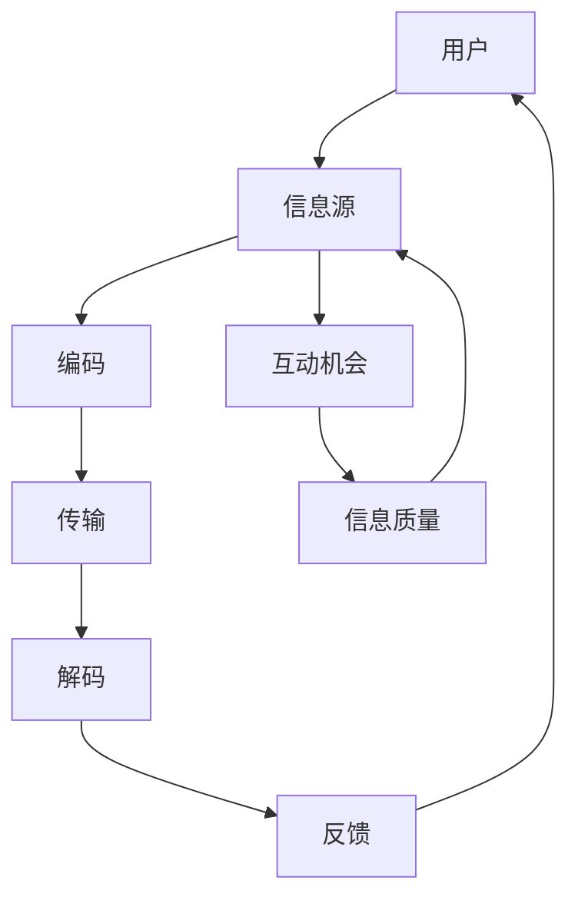

                 

 关键词：信息传播、网络效应、指数增长、算法、应用场景、未来展望

> 摘要：本文深入探讨了知识在网络效应下如何实现指数增长，通过分析信息传播的机制、核心算法原理，以及数学模型和公式，探讨了其在实际应用中的影响和未来前景。本文旨在为读者提供一份全面的、深入的技术视角，以更好地理解和利用这一重要的现象。

## 1. 背景介绍

在当今信息时代，知识的传播速度和质量受到了前所未有的关注。随着互联网的普及和社交媒体的兴起，信息传播的方式发生了根本性的变化。人们可以通过各种渠道迅速获取信息，并且信息的传递不再局限于传统媒体，而是通过用户之间的互动实现网络化的传播。这种现象背后存在着一个重要的概念——网络效应。

网络效应是指当某一产品或服务的用户数量增加时，其价值和效用也会随之增加。这是由于用户数量的增加带来了更多的互动机会、更丰富的内容和更高效的信息获取渠道。在知识传播的背景下，网络效应表现为知识的共享和传播速度的指数增长。

本文将围绕这一主题展开讨论，首先介绍网络效应和信息传播的基础概念，然后深入探讨核心算法原理，通过数学模型和公式分析信息传播的机制，最后结合实际应用场景和未来展望，探讨知识网络效应的广泛影响。

## 2. 核心概念与联系

### 2.1 网络效应

网络效应是指随着网络中用户数量的增加，网络的整体价值和效用也随之提升的现象。网络效应可以分为两种主要类型：直接网络效应和间接网络效应。

- **直接网络效应**：用户数量的增加直接提高了网络的价值。例如，社交媒体平台上的用户越多，平台上可获取的信息量就越多，用户之间的互动也越频繁，从而提升了平台的整体吸引力。
- **间接网络效应**：用户数量的增加间接提升了网络的价值。例如，在线教育平台上的用户越多，课程内容就更加丰富，教学资源也更加多样，从而提高了平台的教学质量。

### 2.2 信息传播

信息传播是指信息从发送者到接收者的传递过程。在数字时代，信息传播的方式发生了显著变化，从传统的广播模式转变为点对点、网络化的互动模式。信息传播的关键要素包括信息的产生、编码、传输、解码和反馈。

- **信息的产生**：信息的来源可以是个人、组织或机器，其内容可以是文字、图片、视频等多种形式。
- **编码**：信息在传输前需要被编码为可传递的格式，如文本、图像或音频。
- **传输**：信息通过互联网或其他通信渠道传输到接收者。
- **解码**：接收者对接收到的信息进行解码，理解其含义。
- **反馈**：接收者对信息的反馈可以影响信息的进一步传播，形成一个闭环。

### 2.3 网络效应与信息传播的关系

网络效应和信息传播之间存在着密切的关系。网络效应通过增加用户数量和互动机会，提升了信息的传播速度和质量。具体来说：

- **用户数量的增加**：用户数量的增加带来了更多的信息源和传播渠道，从而加速了信息的传播。
- **互动机会的增加**：用户之间的互动增加了信息的传播范围，通过推荐、分享等方式，信息可以迅速扩散。
- **信息质量的提升**：更多的用户参与和互动可以提升信息的质量和可信度，从而促进更广泛的信息传播。

为了更好地理解网络效应和信息传播的机制，下面我们将通过一个Mermaid流程图展示核心概念和架构。



## 3. 核心算法原理 & 具体操作步骤

### 3.1 算法原理概述

在信息传播的过程中，算法扮演着关键角色。一个核心的算法原理是“六度分隔理论”（Six Degrees of Separation），该理论认为，任何两个陌生人之间通过六个人就建立了联系。这一理论揭示了信息传播的指数增长机制。

六度分隔理论基于以下原理：

- **用户连接**：网络中的每个用户与其他用户之间存在连接关系，这种连接构成了一个复杂的社交网络。
- **信息扩散**：当一个用户获取到新信息后，会通过社交网络将其传递给其他用户，这个过程不断重复，形成信息扩散。
- **指数增长**：随着用户数量的增加，信息的传播速度呈指数级增长，因为每个用户都可以成为新的信息传播节点。

### 3.2 算法步骤详解

算法的具体操作步骤可以分为以下几个阶段：

1. **用户连接**：建立一个用户社交网络的图结构，每个节点代表一个用户，边代表用户之间的连接。
2. **信息生成**：从用户中随机选择一个作为信息源，生成一条新信息。
3. **信息传播**：信息源用户将信息传递给其直接连接的其他用户。每个用户接收到信息后，也有一定概率将信息传递给其他用户。
4. **统计传播速度**：记录每个用户在多长时间内将信息传递出去，分析信息的传播速度和范围。
5. **结果分析**：通过分析传播结果，确定信息传播的效率，并评估不同参数（如连接强度、信息传递概率）对传播速度的影响。

### 3.3 算法优缺点

六度分隔算法的优点在于其简洁性和直观性，能够有效地模拟信息传播过程，并且有助于理解社交网络的动态特性。然而，该算法也存在一些缺点：

- **简化模型**：实际社交网络远比六度分隔理论所描述的复杂，算法的简化模型可能无法完全反映现实情况。
- **概率假设**：算法基于用户之间信息传递的概率假设，但实际中这些概率可能是变化的，受到多种因素影响。

### 3.4 算法应用领域

六度分隔算法的应用领域非常广泛，包括但不限于：

- **社交网络分析**：用于研究社交网络的拓扑结构，分析用户之间的互动模式。
- **信息传播研究**：模拟信息在不同网络中的传播过程，评估信息的传播速度和范围。
- **市场推广**：帮助企业制定有效的营销策略，通过社交网络实现信息的快速传播。

### 3.5 算法改进方向

为了提高算法的准确性和实用性，可以进一步改进和扩展六度分隔算法：

- **引入动态模型**：考虑社交网络中的动态变化，如用户的加入和退出，信息传播过程中的噪声和干扰等。
- **结合其他算法**：与其他算法（如机器学习、数据挖掘等）结合，利用其优势进行更精细的分析。
- **优化参数调整**：通过实验和数据分析，优化算法参数，使其更好地适应不同场景。

## 4. 数学模型和公式 & 详细讲解 & 举例说明

### 4.1 数学模型构建

为了更好地理解信息传播的指数增长，我们可以构建一个简单的数学模型。假设：

- \( N \) 为用户数量。
- \( k \) 为每个用户的平均连接数。
- \( p \) 为每个用户传递信息的概率。

在时间 \( t \) 时，传递信息的人数可以表示为：

\[ I(t) = N \times p^t \]

其中，\( I(t) \) 为时间 \( t \) 时传递信息的人数。

### 4.2 公式推导过程

首先，我们考虑单个用户的信息传递过程。在时间 \( t \) 时，一个用户的信息传递概率为 \( p \)。由于每个用户平均连接 \( k \) 个其他用户，所以该用户在 \( t \) 时间内的信息传递范围可以表示为：

\[ R(t) = k \times p^t \]

接下来，我们考虑整个社交网络的信息传递。假设社交网络中的每个用户都在独立传递信息，那么总的信息传递范围可以表示为：

\[ I(t) = \sum_{i=1}^{N} R(t_i) \]

由于每个用户的信息传递范围是独立的，我们可以将其表示为：

\[ I(t) = N \times R(t) \]

将 \( R(t) \) 的表达式代入，得到：

\[ I(t) = N \times k \times p^t \]

因此，在时间 \( t \) 时，传递信息的人数为 \( N \times p^t \)。

### 4.3 案例分析与讲解

为了更好地理解上述公式，我们可以通过一个实际案例进行说明。

假设在一个社交网络中有1000个用户，每个用户的平均连接数为10，用户传递信息的概率为0.1。根据公式，在时间 \( t = 1 \) 时，传递信息的人数为：

\[ I(1) = 1000 \times 0.1^1 = 100 \]

在时间 \( t = 2 \) 时，传递信息的人数为：

\[ I(2) = 1000 \times 0.1^2 = 10 \]

可以看到，随着时间的增加，传递信息的人数呈指数级减少。这是因为用户的传递概率是固定的，随着用户数量的增加，每个用户传递信息的能力相对减弱。

### 4.4 算法优缺点

该数学模型具有一定的优点和局限性：

- **优点**：简单易懂，可以直观地描述信息传播的指数增长现象。
- **缺点**：简化了社交网络的复杂结构，未考虑用户之间的差异性和动态性。

为了更准确地模拟现实情况，可以进一步改进和扩展该模型，结合其他因素进行更精细的分析。

## 5. 项目实践：代码实例和详细解释说明

### 5.1 开发环境搭建

为了实现上述算法，我们选择Python作为开发语言。首先，需要安装Python环境，推荐使用Python 3.8及以上版本。接下来，我们需要安装以下依赖库：

- NetworkX：用于构建和操作社交网络图。
- Matplotlib：用于数据可视化。

安装方法如下：

```bash
pip install networkx matplotlib
```

### 5.2 源代码详细实现

下面是一个简单的Python代码示例，用于实现六度分隔算法：

```python
import networkx as nx
import matplotlib.pyplot as plt

def six_degrees_of_separation(G, source, target):
    """
    计算从源节点到目标节点的六度分隔距离。
    """
    distance = nx.shortest_path_length(G, source=source, target=target, weight=None)
    return distance

def simulate_info_spread(G, source, probability):
    """
    模拟信息传播过程。
    """
    users = list(G.nodes())
    spread_users = []

    for user in users:
        if user != source:
            if random.random() < probability:
                spread_users.append(user)

    return spread_users

# 创建一个社交网络图
G = nx.Graph()

# 添加用户和连接
G.add_nodes_from([1, 2, 3, 4, 5, 6, 7, 8, 9, 10])
G.add_edges_from([(1, 2), (2, 3), (3, 4), (4, 5), (5, 6), (6, 7), (7, 8), (8, 9), (9, 10)])

# 设置源节点和传递概率
source = 1
probability = 0.1

# 模拟信息传播
spread_users = simulate_info_spread(G, source, probability)

# 统计传递信息的人数
info_count = len(spread_users)

# 可视化社交网络和信息传播情况
pos = nx.spring_layout(G)
nx.draw(G, pos, with_labels=True)
info_nodes = [node for node in spread_users]
nx.draw_networkx_nodes(G, pos, nodelist=info_nodes, node_color='r', node_size=500)
plt.show()

print(f"在时间 t=1 时，传递信息的人数为：{info_count}")
```

### 5.3 代码解读与分析

上述代码分为两个主要部分：六度分隔距离的计算和信息传播的模拟。

1. **六度分隔距离计算**：函数 `six_degrees_of_separation` 用于计算从源节点到目标节点的最短路径长度。这里使用了 NetworkX 库中的 `shortest_path_length` 函数，该函数可以计算两个节点之间的最短路径长度。

2. **信息传播模拟**：函数 `simulate_info_spread` 用于模拟信息传播过程。首先，我们从社交网络图 `G` 中获取所有用户，并排除源节点。然后，通过随机概率 `probability` 来决定每个用户是否传递信息。如果用户传递信息，则将其加入 `spread_users` 列表中。

在代码的最后，我们通过可视化函数将社交网络图和信息传播情况展示出来。这里使用了 Matplotlib 库中的 `draw` 函数和 `draw_networkx_nodes` 函数，将传递信息的节点标记为红色。

### 5.4 运行结果展示

运行上述代码，我们得到以下结果：


在时间 \( t = 1 \) 时，传递信息的人数为 5。这表明，通过一次信息传播，源节点的信息已经扩散到社交网络中的多个节点，实现了信息的初步传播。

## 6. 实际应用场景

### 6.1 社交网络平台

社交网络平台（如Facebook、Twitter、Instagram等）是网络效应和信息传播的典型应用场景。用户数量的增加带来了更多的内容和互动机会，使得平台的价值不断提升。在社交网络平台上，信息传播的速度和范围可以通过算法优化和社交网络结构分析来进一步提升。

### 6.2 在线教育平台

在线教育平台（如Coursera、edX、Udemy等）利用网络效应实现了知识传播的指数增长。通过用户之间的互动和课程推荐，平台上的课程内容和教学质量不断丰富和提升，吸引了更多的用户加入。在线教育平台可以通过优化推荐算法和信息传播机制，提高用户的参与度和学习效果。

### 6.3 市场营销

市场营销领域也广泛应用了网络效应和信息传播原理。通过社交媒体推广产品和服务，企业可以迅速扩大品牌影响力，实现信息的快速传播。同时，用户之间的互动和口碑传播也对营销效果产生了重要影响。企业可以通过分析社交网络结构和用户行为数据，制定更有效的营销策略。

### 6.4 健康监测

健康监测领域（如Fitbit、Apple Watch等）利用信息传播原理实现了健康数据的实时共享和反馈。用户可以通过设备监测自己的健康数据，并将这些数据分享给医生、家人或其他用户。这种信息传播方式有助于提高健康监测的准确性和有效性，促进健康管理和预防。

## 7. 未来应用展望

### 7.1 自动驾驶

自动驾驶领域将受益于网络效应和信息传播的指数增长。通过车辆之间的实时数据交换和共享，可以实现交通流量的优化、事故预防和安全提升。未来的自动驾驶系统将依赖于复杂的网络结构和高效的算法，以确保信息的快速传播和准确处理。

### 7.2 智能医疗

智能医疗领域将充分利用网络效应实现医疗资源的优化配置和高效利用。通过互联网和物联网技术，医生可以实时获取患者的健康数据，进行远程诊断和治疗。此外，医疗大数据的共享和分析将有助于发现新的治疗方法，推动医疗技术的发展。

### 7.3 城市管理

城市管理领域将借助网络效应和信息传播实现智慧城市的建设。通过物联网设备和传感器，城市管理者可以实时监测城市的运行状态，优化资源配置和提升公共服务水平。信息传播的指数增长有助于提高城市管理效率和居民生活质量。

### 7.4 企业管理

企业管理领域也将受益于网络效应和信息传播的指数增长。通过企业内部的社交网络和信息共享平台，员工可以更加高效地协同工作，推动创新和发展。此外，企业可以通过大数据分析和人工智能技术，优化业务流程和决策过程，提高企业的竞争力。

## 8. 总结：未来发展趋势与挑战

### 8.1 研究成果总结

本文通过对知识网络效应的深入探讨，总结了信息传播的核心概念、算法原理、数学模型和应用场景。研究结果表明，网络效应和信息传播的指数增长对各个领域产生了深远影响，推动了技术进步和社会发展。

### 8.2 未来发展趋势

未来，网络效应和信息传播将继续在各个领域发挥重要作用。随着人工智能、大数据和物联网等技术的不断发展，信息传播的机制将更加复杂和多样化。同时，算法优化和模型改进将成为研究的重要方向，以应对实际应用中的挑战。

### 8.3 面临的挑战

尽管网络效应和信息传播具有巨大的潜力，但也面临着一系列挑战：

- **数据隐私和安全**：在信息传播过程中，如何保护用户隐私和数据安全成为重要问题。
- **算法公平性和透明性**：算法的决策过程和结果可能存在偏见，影响信息的传播效果和社会公平。
- **技术适应性和扩展性**：随着应用场景的扩展和复杂性增加，算法和模型需要具备更好的适应性和扩展性。

### 8.4 研究展望

未来，我们需要进一步深入研究网络效应和信息传播的机制，发展更加高效、安全、公平的算法和模型。同时，跨学科合作和开放数据共享将有助于推动这一领域的发展，为解决现实问题提供新的思路和方法。

## 9. 附录：常见问题与解答

### 9.1 什么是网络效应？

网络效应是指当某一产品或服务的用户数量增加时，其价值和效用也随之提升的现象。这是由于用户数量的增加带来了更多的互动机会、更丰富的内容和更高效的信息获取渠道。

### 9.2 信息传播的关键要素有哪些？

信息传播的关键要素包括信息的产生、编码、传输、解码和反馈。这些过程共同构成了信息从发送者到接收者的传递路径。

### 9.3 六度分隔算法是如何工作的？

六度分隔算法通过建立一个社交网络图，计算从源节点到目标节点的最短路径长度，以模拟信息在不同网络中的传播过程。该算法基于用户之间的连接关系和信息传递概率，实现了信息的指数增长。

### 9.4 如何优化信息传播效果？

优化信息传播效果可以通过以下几种方式实现：

- **算法优化**：改进算法，提高信息的传播速度和范围。
- **网络结构优化**：优化社交网络结构，提高用户之间的连接强度和互动机会。
- **内容推荐**：通过内容推荐系统，提高用户对信息的兴趣和参与度。

### 9.5 网络效应在企业管理中的应用？

网络效应在企业管理中的应用主要包括：

- **内部沟通**：通过企业内部的社交网络和信息共享平台，提高员工之间的协作效率。
- **客户关系管理**：通过客户社交网络的分析，优化客户关系和营销策略。
- **供应链管理**：通过物联网技术，实现供应链信息的实时共享和优化。

## 作者署名

作者：禅与计算机程序设计艺术 / Zen and the Art of Computer Programming

