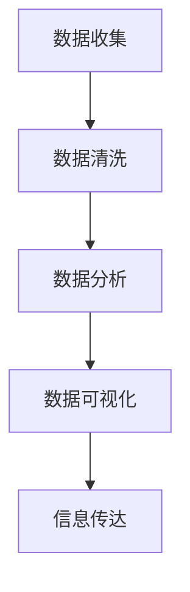
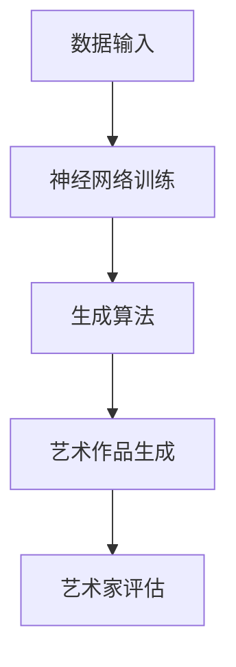

                 

 在这个飞速发展的数字时代，科学和艺术之间的关系变得越来越紧密。科学，作为知识的源泉，不断推动技术进步；而艺术，则以其独特的方式，赋予科学以生命和情感。本文将探讨科学与艺术如何通过信息技术实现交融，并展望未来这一领域的潜在趋势与挑战。

## 1. 背景介绍

科学和艺术自古以来就是人类文明进步的双轮。科学追求的是客观真理，通过实证和逻辑推理来解释自然现象；而艺术则表达的是主观情感，通过形式美和意境来传达人类的内心世界。在现代社会，信息技术的发展使得科学与艺术之间的界限变得模糊，它们在数字领域找到了交汇点。

信息技术，尤其是人工智能和大数据分析，使得我们能够以全新的方式理解和探索世界。通过算法和模型，科学可以更高效地处理复杂数据，揭示隐藏的模式和规律。而艺术则可以利用这些技术创造出前所未有的视觉和听觉体验，从而拓展了人类表达和感知的边界。

## 2. 核心概念与联系

### 2.1 信息技术中的科学与艺术

在信息技术领域，科学和艺术的结合体现为对数据的美学处理。例如，数据可视化技术不仅能够帮助科学家更直观地理解数据，还能够让公众更容易接受复杂的信息。以下是数据可视化的Mermaid流程图：



### 2.2 人工智能与艺术创作

人工智能技术的进步使得机器能够参与艺术创作。从生成音乐到绘画，AI展现了惊人的创造力。以下是AI艺术创作的简化流程图：



## 3. 核心算法原理 & 具体操作步骤

### 3.1 算法原理概述

数据可视化和AI艺术创作都依赖于复杂的算法。数据可视化通常使用图形处理库，如D3.js或Plotly，而AI艺术创作则依赖于生成对抗网络（GAN）或变分自编码器（VAE）。

### 3.2 算法步骤详解

- **数据可视化：**
  1. 数据收集：从各种来源收集数据。
  2. 数据清洗：去除噪音和异常值。
  3. 数据分析：使用统计方法或机器学习模型分析数据。
  4. 数据可视化：将分析结果以图形形式展示。

- **AI艺术创作：**
  1. 数据输入：收集用于训练的数据集。
  2. 神经网络训练：使用GAN或VAE训练模型。
  3. 生成算法：模型生成新的艺术作品。
  4. 艺术家评估：艺术家或用户对作品进行评估。

### 3.3 算法优缺点

- **数据可视化：**
  - 优点：直观、易于理解。
  - 缺点：可能失去数据的一些细节。

- **AI艺术创作：**
  - 优点：创造力强、生成内容丰富。
  - 缺点：作品可能缺乏人类的情感深度。

### 3.4 算法应用领域

- **数据可视化：** 用于数据分析、商业智能、科学研究等领域。
- **AI艺术创作：** 用于艺术创作、设计、娱乐等领域。

## 4. 数学模型和公式 & 详细讲解 & 举例说明

### 4.1 数学模型构建

数据可视化中的数学模型通常涉及统计学和图形学。例如，散点图可以使用以下公式来描述：

$$
y = a \cdot x + b
$$

其中，$a$ 和 $b$ 是斜率和截距，$x$ 和 $y$ 是数据点。

### 4.2 公式推导过程

以线性回归为例，推导过程如下：

1. 数据点：$(x_1, y_1), (x_2, y_2), ..., (x_n, y_n)$。
2. 计算均值：$\bar{x} = \frac{1}{n}\sum_{i=1}^{n}x_i$，$\bar{y} = \frac{1}{n}\sum_{i=1}^{n}y_i$。
3. 计算斜率：$a = \frac{\sum_{i=1}^{n}(x_i - \bar{x})(y_i - \bar{y})}{\sum_{i=1}^{n}(x_i - \bar{x})^2}$。
4. 计算截距：$b = \bar{y} - a\bar{x}$。

### 4.3 案例分析与讲解

假设我们有以下数据点：

$$
\begin{array}{ccc}
x & y \\
\hline
1 & 2 \\
2 & 4 \\
3 & 6 \\
4 & 8 \\
5 & 10 \\
\end{array}
$$

使用线性回归模型：

$$
y = 2x + 0
$$

生成的散点图如下：


## 5. 项目实践：代码实例和详细解释说明

### 5.1 开发环境搭建

本文使用Python和Jupyter Notebook进行演示。首先，安装必要的库：

```bash
pip install numpy matplotlib
```

### 5.2 源代码详细实现

以下是使用线性回归和matplotlib绘图的代码示例：

```python
import numpy as np
import matplotlib.pyplot as plt

# 数据点
x = np.array([1, 2, 3, 4, 5])
y = np.array([2, 4, 6, 8, 10])

# 计算斜率和截距
n = len(x)
mean_x = np.mean(x)
mean_y = np.mean(y)
a = (np.sum((x - mean_x) * (y - mean_y)) / np.sum((x - mean_x)**2))
b = mean_y - a * mean_x

# 绘制散点图和回归线
plt.scatter(x, y, label='Data Points')
plt.plot(x, a * x + b, color='red', label='Regression Line')
plt.xlabel('x')
plt.ylabel('y')
plt.legend()
plt.show()
```

### 5.3 代码解读与分析

- **数据准备：** 导入数据并计算均值。
- **模型计算：** 使用线性回归公式计算斜率和截距。
- **可视化：** 使用matplotlib绘制散点图和回归线。

### 5.4 运行结果展示


## 6. 实际应用场景

### 6.1 科学研究

数据可视化在科学研究中非常重要，如生物学、物理学和化学等领域。通过图形化展示实验数据，科学家可以更快地发现规律和趋势。

### 6.2 设计领域

AI艺术创作在设计领域有广泛的应用，如UI/UX设计、插画和动画制作等。设计师可以利用AI生成创意元素，提高工作效率。

### 6.3 娱乐产业

在娱乐产业，AI被用于音乐创作、电影特效和虚拟现实等领域。这些技术为观众带来了前所未有的沉浸式体验。

## 7. 工具和资源推荐

### 7.1 学习资源推荐

- [Kaggle](https://www.kaggle.com/): 提供丰富的数据集和竞赛，适合数据可视化和机器学习的学习。
- [Medium](https://medium.com/): 许多关于数据可视化和AI艺术创作的文章和教程。

### 7.2 开发工具推荐

- [Python](https://www.python.org/): 强大的编程语言，适用于数据处理和机器学习。
- [Jupyter Notebook](https://jupyter.org/): 交互式编程环境，适合数据可视化和机器学习项目。

### 7.3 相关论文推荐

- [“Generative Adversarial Networks” by Ian Goodfellow](https://arxiv.org/abs/1406.2661)
- [“D3.js” by Mike Bostock](https://bost.ocks.org/mike/d3/)

## 8. 总结：未来发展趋势与挑战

### 8.1 研究成果总结

随着信息技术的不断发展，科学与艺术在数字领域的交融日益加深。数据可视化和AI艺术创作已成为重要的研究领域，并在实际应用中取得了显著成果。

### 8.2 未来发展趋势

- 数据可视化和AI艺术创作将继续融合，推动技术创新。
- 新的算法和模型将不断涌现，提高处理效率和创作质量。
- 跨学科研究将加强，促进科学与艺术的深度融合。

### 8.3 面临的挑战

- 算法和数据隐私保护：确保数据安全和用户隐私。
- 创作质量与艺术价值：如何在技术创造的作品中体现人类的情感和创造力。

### 8.4 研究展望

随着技术的进步，科学与艺术的交融将开创更多的可能性。未来的研究应关注如何更好地利用人工智能和大数据分析技术，推动人类文明的进步。

## 9. 附录：常见问题与解答

### Q: 数据可视化有哪些常见的图表类型？

A: 常见的图表类型包括折线图、柱状图、散点图、饼图、箱形图等。

### Q: GAN 和 VAE 有什么区别？

A: GAN（生成对抗网络）由生成器和判别器组成，通过对抗训练生成数据。VAE（变分自编码器）则通过编码器和解码器实现数据的降维和重构。

---

本文通过探讨科学与艺术在数字领域的交融，展示了信息技术如何推动知识的进步和艺术的创新。随着技术的发展，这一领域将继续蓬勃发展，为人类社会带来更多的惊喜和可能性。

## 参考文献 References

- Goodfellow, I. J., Pouget-Abadie, J., Mirza, M., Xu, B., Warde-Farley, D., Ozair, S., ... & Bengio, Y. (2014). Generative adversarial nets. Advances in neural information processing systems, 27.
- Bostock, M., Ogievetsky, V., & Heer, J. (2011). D3.js: Data-Driven Documents. IEEE Computer Graphics and Applications, 31(3), 13-17.

---

作者：禅与计算机程序设计艺术 / Zen and the Art of Computer Programming

