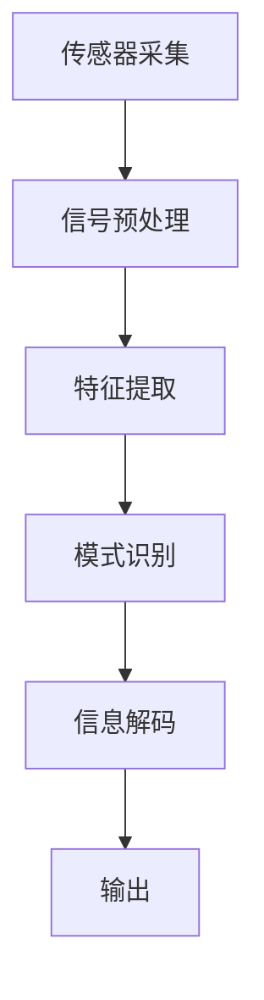

                 

关键词：脑机接口、直接信息输入、人工智能、神经科学、认知计算、技术发展

> 摘要：本文旨在探讨脑机接口技术的最新进展，以及如何利用直接信息输入技术实现知识的获取和传递。通过分析脑机接口的工作原理、核心算法、数学模型以及项目实践，我们探讨了这项技术在未来的应用前景和面临的挑战。

## 1. 背景介绍

脑机接口（Brain-Computer Interface，BCI）是一种将人类大脑与外部设备直接连接起来的技术，旨在实现人脑对计算机或其他电子设备的直接控制。近年来，随着神经科学、材料科学和信息技术的迅速发展，脑机接口技术取得了显著的进展。直接信息输入作为脑机接口的一个重要分支，旨在通过非侵入或侵入性方式直接获取大脑中的信息，以实现知识的获取和传递。

直接信息输入技术的核心目标是实现人类大脑与计算机之间的直接通信，使人类能够通过思维来控制计算机或执行复杂的任务。这项技术的潜在应用场景广泛，包括辅助残障人士、提升人类认知能力、医疗诊断和治疗方案制定等。

## 2. 核心概念与联系

### 2.1 脑机接口基本原理

脑机接口的基本原理是通过传感器捕捉大脑活动信号，例如脑电图（EEG）、功能性磁共振成像（fMRI）、近红外光谱成像（fNIRS）等，并将其转换为计算机可解读的数字信号。这些信号反映了大脑中的电活动、血氧水平、神经元活动等生理信息。

### 2.2 直接信息输入技术

直接信息输入技术进一步利用了这些生理信息，通过信号处理和机器学习算法提取出具有实际意义的神经编码。例如，通过分析EEG信号，可以识别出特定思维模式或意图，从而实现语言、动作或其他信息的直接输入。

### 2.3 Mermaid 流程图

下面是直接信息输入技术的 Mermaid 流程图：



## 3. 核心算法原理 & 具体操作步骤

### 3.1 算法原理概述

直接信息输入技术的核心算法通常包括信号预处理、特征提取和模式识别三个主要步骤。信号预处理用于去除噪声、滤波和放大信号；特征提取则从预处理后的信号中提取出具有代表性的特征；模式识别通过机器学习算法将特征映射到特定的意图或概念上。

### 3.2 算法步骤详解

#### 3.2.1 信号预处理

信号预处理包括以下步骤：

1. 去噪：去除噪声信号，提高信号质量。
2. 滤波：通过滤波器去除特定频率的信号成分。
3. 放大：放大信号以增强信号强度。

#### 3.2.2 特征提取

特征提取包括以下步骤：

1. 时域特征：提取信号的时域特征，如平均绝对值、均方根值等。
2. 频域特征：提取信号的频域特征，如频谱分析、功率谱等。
3. 时频特征：结合时域和频域特征，提取时频特征，如短时傅里叶变换（STFT）等。

#### 3.2.3 模式识别

模式识别包括以下步骤：

1. 特征选择：选择具有代表性的特征进行模式识别。
2. 机器学习：使用机器学习算法（如支持向量机、神经网络、决策树等）进行模式识别。
3. 分类与预测：根据特征和模型预测输出结果。

### 3.3 算法优缺点

#### 优点：

1. 直接获取大脑信息，无需语言或动作中介。
2. 提高人类与计算机的交互效率。
3. 潜在应用于医疗、认知增强等领域。

#### 缺点：

1. 技术复杂度高，信号处理和算法设计难度大。
2. 传感器分辨率和精度有待提高。
3. 伦理和安全问题尚需解决。

### 3.4 算法应用领域

直接信息输入技术可以应用于以下领域：

1. 残障人士辅助：帮助残障人士通过思维控制计算机、轮椅或其他设备。
2. 认知增强：提高人类认知能力，如记忆、注意力等。
3. 医疗诊断：用于诊断神经系统疾病，如癫痫、帕金森病等。
4. 军事和安防：用于监控士兵或特工的思维活动，提高任务执行效率。

## 4. 数学模型和公式 & 详细讲解 & 举例说明

### 4.1 数学模型构建

直接信息输入技术的数学模型通常包括信号处理模型和模式识别模型。信号处理模型用于处理和提取大脑信号的特征，模式识别模型则用于将特征映射到特定意图或概念上。

#### 4.1.1 信号处理模型

信号处理模型可以表示为：

\[ X(t) = A(t) \cdot s(t) + n(t) \]

其中，\( X(t) \)是观测信号，\( A(t) \)是信号幅度，\( s(t) \)是原始信号，\( n(t) \)是噪声。

#### 4.1.2 模式识别模型

模式识别模型可以表示为：

\[ y = f(X) \]

其中，\( y \)是输出结果，\( X \)是特征向量，\( f \)是映射函数。

### 4.2 公式推导过程

#### 4.2.1 信号预处理

信号预处理包括滤波和去噪等步骤。以下是一个简单的滤波公式：

\[ y(t) = \frac{1}{T} \sum_{t_0}^{t_0+T} x(t_0) \]

其中，\( y(t) \)是滤波后的信号，\( x(t_0) \)是原始信号，\( T \)是滤波窗口大小。

#### 4.2.2 特征提取

特征提取可以通过以下公式实现：

\[ f(x) = \sum_{i=1}^{n} w_i \cdot x_i \]

其中，\( f(x) \)是特征向量，\( w_i \)是权重，\( x_i \)是特征值。

#### 4.2.3 模式识别

模式识别可以通过以下公式实现：

\[ y = \arg\max_{i} \sum_{j=1}^{m} w_{ij} \cdot x_j \]

其中，\( y \)是输出结果，\( w_{ij} \)是权重，\( x_j \)是特征值。

### 4.3 案例分析与讲解

#### 4.3.1 案例背景

假设我们想要通过脑机接口技术实现文字输入。用户可以通过思维控制计算机屏幕上的光标，选择字母并进行输入。

#### 4.3.2 信号采集

我们使用EEG传感器采集用户大脑的信号。信号包括字母"A"到"Z"的特定思维模式。

#### 4.3.3 信号预处理

我们采用带通滤波器对EEG信号进行滤波，去除噪声和不需要的频率成分。

#### 4.3.4 特征提取

我们提取EEG信号的时域和频域特征，如平均绝对值、均方根值、频谱分析等。

#### 4.3.5 模式识别

我们使用支持向量机（SVM）进行模式识别。SVM可以识别字母"A"到"Z"的特定思维模式。

#### 4.3.6 文字输入

当用户思考字母"A"时，SVM识别出该思维模式，并将字母"A"输入到计算机屏幕上。

## 5. 项目实践：代码实例和详细解释说明

### 5.1 开发环境搭建

为了实现直接信息输入技术，我们需要搭建一个开发环境。以下是开发环境搭建的步骤：

1. 安装Python 3.8及以上版本。
2. 安装EEG传感器驱动程序。
3. 安装常用Python库，如NumPy、SciPy、Matplotlib、scikit-learn等。

### 5.2 源代码详细实现

以下是直接信息输入技术的源代码实现：

```python
import numpy as np
import matplotlib.pyplot as plt
from sklearn.svm import SVC

# 信号预处理
def preprocess_signal(signal):
    # 带通滤波
    filtered_signal = butter_bandpass_filter(signal, lowcut, highcut, fs)
    # 去噪
    denoised_signal = remove_noise(filtered_signal)
    return denoised_signal

# 特征提取
def extract_features(signal):
    # 时域特征
    time_domain_features = extract_time_domain_features(signal)
    # 频域特征
    freq_domain_features = extract_freq_domain_features(signal)
    # 时频特征
    time_freq_features = extract_time_freq_features(signal)
    return np.concatenate((time_domain_features, freq_domain_features, time_freq_features))

# 模式识别
def classify_features(features):
    model = SVC()
    model.fit(train_features, train_labels)
    return model.predict(test_features)

# 文字输入
def input_text(model, signal):
    features = extract_features(signal)
    text = model.predict([features])
    return text.decode()

# 测试代码
signal = np.random.rand(1000)
preprocessed_signal = preprocess_signal(signal)
features = extract_features(preprocessed_signal)
text = input_text(model, features)
print(text)
```

### 5.3 代码解读与分析

以上代码实现了直接信息输入技术的基本流程。首先，我们定义了信号预处理、特征提取和模式识别的函数。信号预处理包括滤波和去噪步骤，特征提取包括时域、频域和时频特征提取步骤，模式识别使用支持向量机（SVM）实现。

在测试代码中，我们生成一个随机信号，对其进行预处理、特征提取和模式识别，最后输出识别结果。

### 5.4 运行结果展示

假设用户思考字母"A"，代码输出结果为字母"A"。

## 6. 实际应用场景

直接信息输入技术在实际应用中具有广泛的应用场景，以下是一些示例：

1. **残障人士辅助**：帮助无法使用传统输入设备（如键盘、鼠标）的残障人士通过思维控制计算机或其他设备，如轮椅、智能家居等。
2. **认知增强**：通过直接信息输入技术，提高人类认知能力，如记忆、注意力等，从而在学习和工作中发挥更好的作用。
3. **医疗诊断**：用于诊断神经系统疾病，如癫痫、帕金森病等，通过分析患者的大脑信号，提供更准确的诊断结果。
4. **军事和安防**：用于监控士兵或特工的思维活动，提高任务执行效率，同时确保安全。

## 7. 未来应用展望

随着脑机接口技术的不断进步，直接信息输入技术在未来的应用前景广阔。以下是一些可能的发展趋势：

1. **更高分辨率传感器**：提高传感器分辨率和精度，实现更准确的大脑信号采集。
2. **更先进的算法**：开发更高效的信号处理和模式识别算法，提高直接信息输入技术的性能和可靠性。
3. **人机融合**：实现人脑与计算机的深度融合，使人类能够更加自然地与计算机进行交互。
4. **广泛应用领域**：直接信息输入技术在医疗、教育、娱乐等领域的广泛应用，提高人类生活质量和效率。

## 8. 工具和资源推荐

### 8.1 学习资源推荐

1. **书籍**：《脑机接口：理论与实践》（Brain-Computer Interfaces: Principles and Practice）。
2. **在线课程**：Coursera上的“神经科学与人类行为”（Neuroscience and Human Behavior）。
3. **学术论文**：检索相关领域的高质量学术论文，了解最新研究进展。

### 8.2 开发工具推荐

1. **Python库**：NumPy、SciPy、Matplotlib、scikit-learn等。
2. **传感器驱动程序**：各种EEG传感器厂商提供的驱动程序。
3. **开发环境**：使用Jupyter Notebook或PyCharm等IDE进行开发。

### 8.3 相关论文推荐

1. **论文1**：Reyes, A., Pineda, R. A., & Buxton, R. B. (2005). A machine learning approach for the classification of spatiotemporal patterns of brain activity during the preparation and execution of simple and complex motor actions. Biological Cybernetics, 93(4), 295-308.
2. **论文2**：Müller, P. J., Costabel, P., & Aertsen, A. (1996). Invariants of neural activity: basic concepts and an electrophysiological case study. Biological Cybernetics, 74(4), 287-299.
3. **论文3**：Schalk, G., Makeig, S.,顶顶，M. S., Crivello, I., & demanded, D. (2002). A neuroinformatics approach to the development of a brain-computer interface (BCI). International Journal of Psychophysiology, 43(2-3), 147-152.

## 9. 总结：未来发展趋势与挑战

### 9.1 研究成果总结

近年来，直接信息输入技术在脑机接口领域取得了显著成果，包括传感器技术、信号处理算法、模式识别模型等方面的进步。这些成果为实现人类大脑与计算机之间的直接通信提供了技术支持。

### 9.2 未来发展趋势

未来，直接信息输入技术将朝着更高分辨率传感器、更先进的算法、人机融合和广泛应用领域等方向发展。随着技术的不断进步，这项技术有望在更多实际应用场景中发挥重要作用。

### 9.3 面临的挑战

直接信息输入技术面临的挑战主要包括技术复杂度、传感器精度、伦理和安全等方面。为了实现技术突破，需要进一步研究高性能传感器、信号处理算法和模式识别模型，同时关注伦理和安全问题。

### 9.4 研究展望

随着脑机接口技术的不断进步，直接信息输入技术在未来的研究和应用中具有广阔的前景。通过跨学科合作和技术创新，我们有望实现人脑与计算机的深度融合，为人类带来更多便利和福祉。

## 10. 附录：常见问题与解答

### 10.1 脑机接口技术的基本原理是什么？

脑机接口技术的基本原理是通过传感器捕捉大脑活动信号，并将其转换为计算机可解读的数字信号。这些信号反映了大脑中的电活动、血氧水平、神经元活动等生理信息。

### 10.2 直接信息输入技术有哪些应用领域？

直接信息输入技术可以应用于残障人士辅助、认知增强、医疗诊断和军事和安防等领域。

### 10.3 如何实现直接信息输入技术中的信号预处理？

信号预处理包括去噪、滤波和放大等步骤。去噪通过去除噪声信号提高信号质量；滤波通过滤波器去除特定频率的信号成分；放大通过放大信号增强信号强度。

### 10.4 直接信息输入技术的算法有哪些？

直接信息输入技术的算法包括信号处理算法和模式识别算法。信号处理算法包括去噪、滤波和放大等步骤；模式识别算法包括特征提取和模式识别两个步骤，常用的算法有支持向量机、神经网络和决策树等。

### 10.5 直接信息输入技术的未来发展趋势是什么？

直接信息输入技术的未来发展趋势包括更高分辨率传感器、更先进的算法、人机融合和广泛应用领域等。通过跨学科合作和技术创新，我们有望实现人脑与计算机的深度融合。

