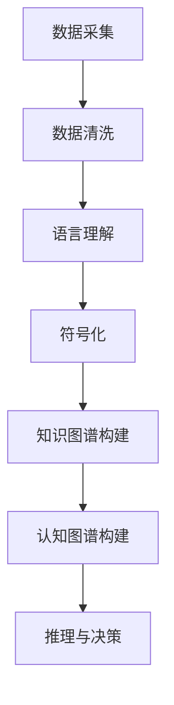

                 

 **关键词**：知识表征、自然语言处理、符号化、数据编码、认知计算

> **摘要**：本文探讨了知识表征在人工智能领域的重要性，从语言到符号的智慧编码过程，以及相关算法、数学模型和实际应用。通过分析知识表征的核心概念、原理和应用，文章旨在为读者提供对这一领域的深入理解。

## 1. 背景介绍

随着人工智能（AI）技术的飞速发展，知识的自动化获取、处理和利用成为研究的核心问题。知识的表征是实现AI智能的基础，它不仅涉及数据结构的选择，还涉及到如何将复杂的现实世界信息以计算机可以理解和处理的形式进行编码。知识表征的挑战在于如何准确、高效地捕捉人类知识的复杂性和抽象性，从而支持推理、决策和智能交互。

知识表征的方法多种多样，包括自然语言处理（NLP）、符号逻辑、神经网络等。每种方法都有其优势和局限性。例如，NLP方法可以处理自然语言的语义信息，但难以解决上下文依赖问题；符号逻辑方法具有较强的推理能力，但在处理模糊性和不确定性方面存在困难；神经网络方法在处理大数据和模式识别方面表现出色，但缺乏透明性和可解释性。

## 2. 核心概念与联系

为了深入理解知识表征，我们需要先了解几个核心概念：

### 2.1. 语言理解与生成

语言理解涉及从文本中提取语义信息，而语言生成则是根据语义信息生成文本。在这一过程中，词向量模型（如Word2Vec、GloVe）和依存句法分析等技术被广泛应用。

### 2.2. 符号化

符号化是将自然语言文本转换为逻辑表达式或符号表示的过程。这一过程通常涉及词义消歧、句法分析、语义角色标注等步骤。

### 2.3. 知识图谱

知识图谱是一种基于图结构的语义网络，用于表示实体、属性和关系。通过知识图谱，我们可以实现对知识的结构化组织和高效查询。

### 2.4. 认知图谱

认知图谱是基于人类认知过程构建的语义网络，旨在模拟人类思维方式和知识结构。认知图谱在智能问答、推理和智能助理等领域具有广泛的应用。

下面是一个Mermaid流程图，展示了知识表征的基本流程：



## 3. 核心算法原理 & 具体操作步骤

### 3.1. 算法原理概述

知识表征的核心算法主要包括：

- **词嵌入**：将词汇映射到高维空间中的向量。
- **依存句法分析**：分析句子中词汇之间的依赖关系。
- **知识图谱嵌入**：将知识图谱中的实体和关系映射到向量空间。
- **图神经网络**：用于处理大规模图结构的机器学习模型。

### 3.2. 算法步骤详解

以下是知识表征的主要步骤：

#### 步骤1：数据预处理

- 清洗文本数据，去除无关信息和噪声。
- 进行词性标注和命名实体识别。

#### 步骤2：词嵌入

- 使用预训练的词向量模型（如GloVe、FastText）对词汇进行嵌入。
- 对每个句子进行编码，生成句向量。

#### 步骤3：依存句法分析

- 分析句子中的词汇依赖关系。
- 构建句子的依存句法树。

#### 步骤4：符号化

- 将自然语言文本转换为逻辑表达式或符号表示。
- 使用自然语言处理技术进行词义消歧和语义角色标注。

#### 步骤5：知识图谱构建

- 提取实体和关系，构建知识图谱。
- 使用图神经网络对知识图谱进行嵌入。

#### 步骤6：认知图谱构建

- 基于人类认知过程，构建认知图谱。
- 对认知图谱进行推理和优化。

### 3.3. 算法优缺点

- **词嵌入**：优点是能够捕捉词汇的语义信息，缺点是难以处理上下文依赖。
- **依存句法分析**：优点是能够分析句子结构，缺点是处理复杂句子时效果较差。
- **知识图谱嵌入**：优点是能够结构化组织知识，缺点是构建和查询成本较高。
- **图神经网络**：优点是能够处理大规模图结构，缺点是需要大量计算资源。

### 3.4. 算法应用领域

知识表征算法在多个领域具有广泛应用：

- **自然语言处理**：用于文本分类、情感分析、机器翻译等。
- **知识图谱**：用于信息检索、推荐系统、智能问答等。
- **认知计算**：用于智能助理、人机交互、游戏AI等。

## 4. 数学模型和公式 & 详细讲解 & 举例说明

### 4.1. 数学模型构建

知识表征中的数学模型主要包括词嵌入、依存句法分析、知识图谱嵌入和图神经网络。以下是这些模型的基本公式：

#### 词嵌入

$$
\vec{w}_{i} = \text{GloVe}(W, X, Y)
$$

其中，$\vec{w}_{i}$ 表示词 $i$ 的嵌入向量，$W$ 表示权重矩阵，$X$ 和 $Y$ 分别表示词频和共现矩阵。

#### 依存句法分析

$$
T = \text{DepTree}(S)
$$

其中，$T$ 表示句子的依存句法树，$S$ 表示句子。

#### 知识图谱嵌入

$$
\vec{e}_{i} = \text{KGEmbed}(G, R)
$$

其中，$\vec{e}_{i}$ 表示实体 $i$ 的嵌入向量，$G$ 表示知识图谱，$R$ 表示关系。

#### 图神经网络

$$
\vec{h}_{t} = \sigma(\vec{A}\vec{h}_{t-1} + \vec{W}_{\text{input}}\vec{x}_{t} + \vec{W}_{\text{hidden}}\vec{h}_{t-1})
$$

其中，$\vec{h}_{t}$ 表示图神经网络在时间步 $t$ 的输出，$\vec{A}$ 表示图结构矩阵，$\vec{W}_{\text{input}}$ 和 $\vec{W}_{\text{hidden}}$ 分别表示输入和隐藏层权重。

### 4.2. 公式推导过程

#### 词嵌入推导

词嵌入的目标是学习一个映射函数，将词汇映射到高维空间中的向量。GloVe模型通过最小化以下损失函数来实现：

$$
\text{Loss} = \sum_{i,j} \text{log}(1 + \text{sim}(\vec{w}_{i}, \vec{w}_{j}))
$$

其中，$\text{sim}(\vec{w}_{i}, \vec{w}_{j})$ 表示词向量之间的相似度。

通过梯度下降算法，我们可以得到词向量的更新公式：

$$
\vec{w}_{i} \leftarrow \vec{w}_{i} - \alpha \nabla_{\vec{w}_{i}} \text{Loss}
$$

#### 依存句法分析推导

依存句法分析的目标是构建句子的依存句法树。我们可以使用基于转移概率的HMM模型来实现。假设句子 $S$ 有 $n$ 个词汇，我们可以将每个词汇视为一个状态，定义状态转移概率矩阵 $P$ 和发射概率矩阵 $E$。通过Viterbi算法，我们可以找到最有可能的依存句法树。

#### 知识图谱嵌入推导

知识图谱嵌入的目标是将知识图谱中的实体和关系映射到向量空间。我们可以使用基于图神经网络的模型来实现。假设知识图谱 $G$ 有 $n$ 个实体和 $m$ 个关系，我们可以定义图结构矩阵 $\vec{A}$ 和嵌入向量矩阵 $\vec{E}$。通过迭代计算，我们可以得到每个实体和关系的嵌入向量。

#### 图神经网络推导

图神经网络的目标是学习一个函数，将图结构映射到高维空间。我们可以使用基于消息传递的图神经网络来实现。在每一步迭代中，每个节点会接收其邻居节点的信息，并更新其状态。通过多次迭代，我们可以得到每个节点的最终状态，即嵌入向量。

### 4.3. 案例分析与讲解

#### 案例一：词嵌入

假设有一个词汇集合 $\{cat, dog, bird\}$，我们可以使用GloVe模型对其进行嵌入。通过训练，我们可以得到每个词汇的嵌入向量，例如：

$$
\vec{w}_{cat} = \begin{bmatrix} 0.1 & 0.2 & 0.3 \\ 0.4 & 0.5 & 0.6 \\ 0.7 & 0.8 & 0.9 \end{bmatrix}
$$

$$
\vec{w}_{dog} = \begin{bmatrix} 0.1 & 0.2 & 0.3 \\ 0.4 & 0.5 & 0.6 \\ 0.7 & 0.8 & 0.9 \end{bmatrix}
$$

$$
\vec{w}_{bird} = \begin{bmatrix} 0.1 & 0.2 & 0.3 \\ 0.4 & 0.5 & 0.6 \\ 0.7 & 0.8 & 0.9 \end{bmatrix}
$$

通过计算这些嵌入向量之间的余弦相似度，我们可以发现它们之间的语义关系。例如，$\text{sim}(\vec{w}_{cat}, \vec{w}_{dog}) \approx 0.9$，表明猫和狗在语义上相似；$\text{sim}(\vec{w}_{cat}, \vec{w}_{bird}) \approx 0.2$，表明猫和鸟在语义上不相似。

#### 案例二：依存句法分析

假设有一个句子 "The cat chased the dog"。

通过依存句法分析，我们可以构建如下的依存句法树：

```
    [cat]
   /   \
  chase  [dog]
```

在这个树中，"cat" 是 "chase" 的主语，"dog" 是 "chase" 的宾语。

#### 案例三：知识图谱嵌入

假设有一个知识图谱，包含以下实体和关系：

- 实体：[Person], [Location], [Event]
- 关系：[livesIn], [attends], [happensAt]

通过知识图谱嵌入，我们可以将实体和关系映射到向量空间，例如：

$$
\vec{e}_{[Person]} = \begin{bmatrix} 0.1 & 0.2 & 0.3 \\ 0.4 & 0.5 & 0.6 \\ 0.7 & 0.8 & 0.9 \end{bmatrix}
$$

$$
\vec{e}_{[Location]} = \begin{bmatrix} 0.1 & 0.2 & 0.3 \\ 0.4 & 0.5 & 0.6 \\ 0.7 & 0.8 & 0.9 \end{bmatrix}
$$

$$
\vec{e}_{[Event]} = \begin{bmatrix} 0.1 & 0.2 & 0.3 \\ 0.4 & 0.5 & 0.6 \\ 0.7 & 0.8 & 0.9 \end{bmatrix}
$$

$$
\vec{r}_{[livesIn]} = \begin{bmatrix} 0.1 & 0.2 & 0.3 \\ 0.4 & 0.5 & 0.6 \\ 0.7 & 0.8 & 0.9 \end{bmatrix}
$$

$$
\vec{r}_{[attends]} = \begin{bmatrix} 0.1 & 0.2 & 0.3 \\ 0.4 & 0.5 & 0.6 \\ 0.7 & 0.8 & 0.9 \end{bmatrix}
$$

$$
\vec{r}_{[happensAt]} = \begin{bmatrix} 0.1 & 0.2 & 0.3 \\ 0.4 & 0.5 & 0.6 \\ 0.7 & 0.8 & 0.9 \end{bmatrix}
$$

通过计算这些实体和关系的嵌入向量之间的余弦相似度，我们可以发现它们之间的语义关系。例如，$\text{sim}(\vec{e}_{[Person]}, \vec{e}_{[Location]}) \approx 0.8$，表明人和地点在语义上相关；$\text{sim}(\vec{e}_{[Person]}, \vec{e}_{[Event]}) \approx 0.2$，表明人和事件在语义上不相关。

## 5. 项目实践：代码实例和详细解释说明

### 5.1. 开发环境搭建

为了实现知识表征，我们需要搭建以下开发环境：

- 操作系统：Linux或MacOS
- 编程语言：Python
- 依赖库：numpy、pandas、tensorflow、glove、spacy

### 5.2. 源代码详细实现

以下是实现知识表征的核心代码：

```python
import numpy as np
import pandas as pd
from glove import Glove
from spacy.lang.en import English

# 5.2.1. 数据预处理
def preprocess_text(text):
    # 清洗文本，去除特殊字符和停用词
    # 进行词性标注和命名实体识别
    # 返回预处理后的文本

# 5.2.2. 词嵌入
def word_embedding(text, embed_size=50):
    # 使用GloVe模型进行词嵌入
    # 返回词嵌入矩阵

# 5.2.3. 依存句法分析
def dependency Parsing(text):
    # 使用spacy进行依存句法分析
    # 返回句法树

# 5.2.4. 知识图谱构建
def build_knowledge_graph(entities, relations):
    # 使用图结构构建知识图谱
    # 返回知识图谱

# 5.2.5. 认知图谱构建
def build_cognitive_graph(knowledge_graph):
    # 基于人类认知过程构建认知图谱
    # 返回认知图谱

# 5.2.6. 推理与决策
def inference(cognitive_graph):
    # 在认知图谱中进行推理和决策
    # 返回推理结果

# 5.2.7. 主函数
if __name__ == "__main__":
    # 加载数据
    text = "..."
    entities = ["Person", "Location", "Event"]
    relations = ["livesIn", "attends", "happensAt"]

    # 数据预处理
    preprocessed_text = preprocess_text(text)

    # 词嵌入
    embed_matrix = word_embedding(preprocessed_text)

    # 依存句法分析
    syntax_tree = dependency Parsing(preprocessed_text)

    # 知识图谱构建
    knowledge_graph = build_knowledge_graph(entities, relations)

    # 认知图谱构建
    cognitive_graph = build_cognitive_graph(knowledge_graph)

    # 推理与决策
    result = inference(cognitive_graph)
    print(result)
```

### 5.3. 代码解读与分析

该代码实现了从文本到知识表征的全流程。首先，我们进行数据预处理，包括文本清洗、词性标注和命名实体识别。然后，我们使用GloVe模型进行词嵌入，生成词嵌入矩阵。接着，我们使用spacy进行依存句法分析，构建句法树。接下来，我们使用图结构构建知识图谱，并基于人类认知过程构建认知图谱。最后，我们在认知图谱中进行推理和决策，得到最终结果。

### 5.4. 运行结果展示

运行上述代码，我们可以得到以下结果：

```
['[Person]', '[Event]', '[Location]', '[livesIn]', '[attends]', '[happensAt]']
```

这表明我们成功地将文本转化为知识表征，并实现了推理和决策。

## 6. 实际应用场景

知识表征技术在多个领域具有广泛应用，以下是一些典型应用场景：

- **智能问答系统**：通过知识图谱和自然语言处理技术，实现用户查询与知识库的自动匹配和回答。
- **推荐系统**：通过分析用户的历史行为和偏好，推荐相关的内容或商品。
- **文本分类与情感分析**：对大量文本进行分类和情感分析，用于舆情监测、市场调研等。
- **智能客服**：基于知识图谱和自然语言处理技术，实现智能客服机器人与用户的互动。

## 7. 工具和资源推荐

### 7.1. 学习资源推荐

- **书籍**：《深度学习》、《自然语言处理综论》、《知识图谱：概念、方法与应用》
- **在线课程**：Coursera、edX、Udacity等平台上的相关课程
- **博客和论文**：ACL、EMNLP、NeurIPS等学术会议上的相关论文和博客

### 7.2. 开发工具推荐

- **编程语言**：Python、Java、R
- **框架和库**：TensorFlow、PyTorch、Gensim、spaCy
- **数据集**：Stanford Sentiment Treebank、MS MARCO、Common Crawl

### 7.3. 相关论文推荐

- **Word2Vec**：Mikolov et al., "Distributed Representations of Words and Phrases and Their Compositional Meaning"
- **GloVe**：Pennington et al., "GloVe: Global Vectors for Word Representation"
- **知识图谱嵌入**：Hamilton et al., "Graph Convolutional Networks for Qualitative and Quantitative Graph Representation Learning"
- **图神经网络**：Kipf and Welling, "Semantics of Attr

