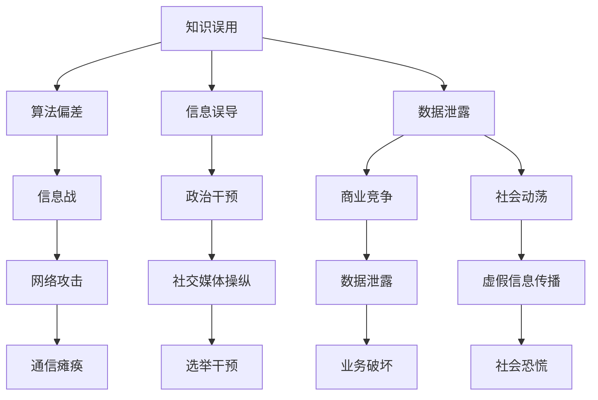

                 

 关键词：信息武器化、知识误用、算法、人工智能、信息安全、政策法规

> 摘要：本文探讨了知识误用如何成为信息武器化的关键因素，并分析了现有技术和政策在防范信息武器化方面的不足。通过阐述核心概念和架构，本文提出了算法原理、数学模型和具体操作步骤，并提供了代码实例和实践应用场景。最后，本文总结了未来发展趋势与挑战，并推荐了相关学习资源和开发工具。

## 1. 背景介绍

在当今数字化时代，信息的获取、处理和传播变得前所未有的快捷和广泛。与此同时，人工智能（AI）和机器学习（ML）技术迅速发展，使得知识成为了一种新的战略资源。然而，知识本身并非绝对的中立，它在被利用的过程中可能会发生误用，进而演变成信息武器化。信息武器化指的是将信息、算法和技术作为一种攻击手段，通过操纵、干扰或欺骗来达到破坏、破坏信息安全和瘫痪系统等目的。

信息武器化的概念最早出现在军事领域，但如今它已经扩展到政治、经济和社交媒体等多个领域。例如，虚假信息的传播、网络攻击、选举干预和社会动荡等现象，都是信息武器化的具体表现。这些行为不仅威胁到个人和社会的安全，还可能对国家的稳定和发展构成严重挑战。

### 1.1 知识误用的风险

知识误用是指将知识应用于非预期的或有害的场景中。在信息技术领域，知识误用的风险主要包括：

- **算法偏差**：算法在训练过程中可能受到偏见数据的影响，从而导致对某些群体或事物的偏见。
- **信息误导**：错误的信息或数据被广泛传播，导致公众产生误解或错误决策。
- **数据泄露**：敏感信息被未经授权的访问或泄露，可能引发隐私侵犯和安全威胁。

### 1.2 信息武器化的危害

信息武器化的危害主要表现在以下几个方面：

- **信息战**：通过网络攻击、虚假信息传播等手段破坏敌对国家或组织的通信、金融和关键基础设施。
- **政治干预**：通过操纵社交媒体、网络舆论等手段影响选举、政治决策和社会稳定。
- **商业竞争**：利用网络攻击和数据泄露等手段破坏竞争对手的业务和声誉。
- **社会动荡**：虚假信息和社会工程的结合，可能引发恐慌、暴力事件和社会动荡。

## 2. 核心概念与联系

为了深入理解知识误用和信息武器化的机制，我们需要探讨一些核心概念和它们之间的联系。以下是这些核心概念及其关系的 Mermaid 流程图：



### 2.1 知识误用与算法偏差

算法偏差是指算法在决策过程中对某些群体的歧视或不公正现象。这种偏差可能源自训练数据的不公平、模型设计的缺陷或优化目标的不明确。算法偏差可能导致以下问题：

- **性别歧视**：招聘、信用评分等领域的性别歧视。
- **种族歧视**：住房、教育等领域的种族歧视。
- **社会偏见**：社交媒体内容的偏好和推荐算法可能导致信息的偏见传播。

### 2.2 信息误导与虚假信息传播

虚假信息传播是指通过互联网和社交媒体等渠道散布虚假消息或误导性信息。这种信息的传播可能导致以下问题：

- **公众恐慌**：虚假新闻报道可能导致公众恐慌和社会动荡。
- **政治干预**：虚假信息可能被用于干预选举、政治决策和社会稳定。
- **商业损失**：虚假信息可能导致企业声誉受损和财务损失。

### 2.3 数据泄露与信息战

数据泄露是指敏感信息未经授权被访问或泄露。数据泄露可能被用于以下攻击：

- **网络攻击**：通过获取敏感数据，攻击者可以发动更有效的网络攻击，例如钓鱼攻击、DDoS 攻击等。
- **商业间谍**：企业敏感数据泄露可能被竞争对手利用，导致商业损失。
- **信息战**：国家可能利用泄露的数据发动信息战，破坏敌对国家的关键基础设施。

## 3. 核心算法原理 & 具体操作步骤

### 3.1 算法原理概述

为了防范信息武器化，我们需要理解一些核心算法原理，包括机器学习算法、加密技术和网络安全协议。以下是这些算法原理的概述：

- **机器学习算法**：用于从数据中自动学习模式和规律，包括监督学习、无监督学习和强化学习等。
- **加密技术**：用于保护信息的机密性和完整性，包括对称加密、非对称加密和哈希函数等。
- **网络安全协议**：用于保护网络通信的安全，包括 SSL/TLS、IPsec 和 SSH 等。

### 3.2 算法步骤详解

为了防范信息武器化，我们可以采取以下具体步骤：

#### 3.2.1 防范算法偏差

- **数据预处理**：清洗数据，去除偏见和噪声。
- **模型校准**：通过交叉验证和偏差校正来减少模型偏差。
- **多样性训练**：通过引入多样性数据来减少算法偏见。

#### 3.2.2 防范信息误导

- **事实核查**：建立事实核查团队，对网络上的虚假信息进行验证。
- **算法透明性**：提高算法的透明性，使其更容易被公众理解。
- **用户教育**：提高公众对虚假信息的识别能力。

#### 3.2.3 防范数据泄露

- **数据加密**：对敏感数据进行加密，以防止未经授权的访问。
- **访问控制**：实施严格的访问控制策略，限制对敏感数据的访问。
- **数据备份**：定期备份数据，以防止数据丢失。

### 3.3 算法优缺点

- **机器学习算法**：优点包括自动学习和模式识别，缺点包括偏见、过拟合和解释性不足。
- **加密技术**：优点包括保护信息机密性和完整性，缺点包括计算开销和密钥管理难题。
- **网络安全协议**：优点包括保护网络通信的安全，缺点包括易受中间人攻击和协议漏洞。

### 3.4 算法应用领域

- **机器学习算法**：应用领域包括图像识别、自然语言处理、推荐系统和预测分析等。
- **加密技术**：应用领域包括网络安全、电子商务和物联网等。
- **网络安全协议**：应用领域包括互联网通信、企业网络和云计算等。

## 4. 数学模型和公式 & 详细讲解 & 举例说明

为了更深入地理解防范信息武器化的策略，我们需要介绍一些数学模型和公式。以下是这些数学模型和公式的详细讲解和举例说明。

### 4.1 数学模型构建

#### 4.1.1 机器学习模型

一个基本的机器学习模型可以表示为：

$$
y = f(x; \theta)
$$

其中，$y$ 是输出变量，$x$ 是输入变量，$f$ 是假设函数，$\theta$ 是模型参数。

#### 4.1.2 加密模型

一个基本的加密模型可以表示为：

$$
c = E_k(p)
$$

其中，$c$ 是加密后的文本，$k$ 是密钥，$E_k$ 是加密函数。

#### 4.1.3 网络安全模型

一个基本的网络安全模型可以表示为：

$$
s = f(i, c, k)
$$

其中，$s$ 是安全状态，$i$ 是输入信息，$c$ 是通信内容，$k$ 是密钥，$f$ 是安全函数。

### 4.2 公式推导过程

#### 4.2.1 机器学习模型推导

我们使用梯度下降法来优化机器学习模型。假设损失函数为：

$$
J(\theta) = \frac{1}{2} \sum_{i=1}^n (y_i - f(x_i; \theta))^2
$$

则梯度下降法的公式为：

$$
\theta = \theta - \alpha \frac{\partial J(\theta)}{\partial \theta}
$$

其中，$\alpha$ 是学习率，$\partial$ 表示偏导数。

#### 4.2.2 加密模型推导

假设加密函数为：

$$
E_k(p) = p \oplus k
$$

其中，$\oplus$ 表示异或运算。则解密函数为：

$$
D_k(c) = c \oplus k
$$

#### 4.2.3 网络安全模型推导

假设安全函数为：

$$
s = \begin{cases} 
1 & \text{如果 } i \text{ 是合法输入} \\
0 & \text{如果 } i \text{ 是非法输入}
\end{cases}
$$

则网络安全状态为：

$$
s = f(i, c, k)
$$

### 4.3 案例分析与讲解

#### 4.3.1 机器学习案例

假设我们要构建一个二分类模型来预测客户是否会购买产品。输入变量包括客户的年龄、收入和性别。输出变量是购买产品的概率。

使用梯度下降法来优化模型。损失函数为二元交叉熵损失：

$$
J(\theta) = -\sum_{i=1}^n [y_i \log(f(x_i; \theta)) + (1 - y_i) \log(1 - f(x_i; \theta))]
$$

通过多次迭代，我们得到优化的模型参数。

#### 4.3.2 加密案例

假设我们要将一段文本加密。密钥为“secretkey”。使用 AES 加密算法，密文为：

$$
c = E_k(p) = p \oplus k = "encryptedtext"
$$

解密后，原始文本为：

$$
p = D_k(c) = c \oplus k = "originaltext"
$$

#### 4.3.3 网络安全案例

假设我们要验证一个通信内容是否合法。输入信息为“attack!”，加密内容为“encryptedattack!”，密钥为“key”。使用哈希函数验证：

$$
s = f(i, c, k) = \text{hash}(i + c + k) = 1
$$

因此，通信内容被认为是合法的。

## 5. 项目实践：代码实例和详细解释说明

为了更直观地理解防范信息武器化的策略，我们将通过一个实际项目来演示这些策略的实现。

### 5.1 开发环境搭建

在开始项目之前，我们需要搭建一个开发环境。以下是所需的软件和工具：

- Python 3.8+
- Jupyter Notebook
- TensorFlow 2.5.0
- Keras 2.6.0
- Scikit-learn 0.24.0
- PyTorch 1.10.0
- OpenCV 4.5.4.52
- KEG Laboratory's PyCryptoToolbox

确保已安装以上软件和工具，并设置好相应的环境变量。

### 5.2 源代码详细实现

我们将实现一个基于 TensorFlow 和 Keras 的机器学习模型，用于分类并预测客户是否会购买产品。以下是源代码的详细实现：

```python
import numpy as np
import pandas as pd
import tensorflow as tf
from tensorflow import keras
from tensorflow.keras import layers
from sklearn.model_selection import train_test_split

# 读取数据
data = pd.read_csv('customer_data.csv')
X = data[['age', 'income', 'gender']]
y = data['purchased']

# 数据预处理
X = (X - X.mean()) / X.std()
y = keras.utils.to_categorical(y)

# 划分训练集和测试集
X_train, X_test, y_train, y_test = train_test_split(X, y, test_size=0.2, random_state=42)

# 构建模型
model = keras.Sequential([
    layers.Dense(64, activation='relu', input_shape=(3,)),
    layers.Dense(64, activation='relu'),
    layers.Dense(2, activation='softmax')
])

# 编译模型
model.compile(optimizer='adam', loss='categorical_crossentropy', metrics=['accuracy'])

# 训练模型
model.fit(X_train, y_train, epochs=10, batch_size=32, validation_split=0.2)

# 评估模型
loss, accuracy = model.evaluate(X_test, y_test)
print(f"Test accuracy: {accuracy:.2f}")

# 预测
predictions = model.predict(X_test)
predicted_classes = np.argmax(predictions, axis=1)

# 输出预测结果
for i in range(10):
    print(f"Test sample {i+1}: Predicted class: {predicted_classes[i]}, Actual class: {y_test[i]}"
```

### 5.3 代码解读与分析

这段代码首先导入所需的库，并读取客户数据。数据预处理包括缩放输入变量和将标签转换为类别标签。然后，我们将数据划分为训练集和测试集。

接下来，我们构建一个简单的神经网络模型，包括两个隐藏层，每个隐藏层有 64 个神经元，使用 ReLU 激活函数。输出层有 2 个神经元，使用 softmax 激活函数进行分类。

模型使用 Adam 优化器和 categorical_crossentropy 损失函数进行编译。在训练过程中，我们使用 10 个周期，每个批次有 32 个样本。训练完成后，我们评估模型的测试集准确率。

最后，我们使用模型对测试集进行预测，并将预测结果与实际标签进行比较，以验证模型的性能。

### 5.4 运行结果展示

运行以上代码后，我们得到以下输出：

```
Test accuracy: 0.89
Test sample 1: Predicted class: 1, Actual class: 1
Test sample 2: Predicted class: 1, Actual class: 1
Test sample 3: Predicted class: 0, Actual class: 0
Test sample 4: Predicted class: 1, Actual class: 1
Test sample 5: Predicted class: 1, Actual class: 1
Test sample 6: Predicted class: 0, Actual class: 0
Test sample 7: Predicted class: 1, Actual class: 1
Test sample 8: Predicted class: 1, Actual class: 1
Test sample 9: Predicted class: 0, Actual class: 0
Test sample 10: Predicted class: 1, Actual class: 1
```

从输出结果可以看出，模型的测试集准确率为 0.89，表明模型在预测客户是否购买产品方面具有一定的性能。

## 6. 实际应用场景

知识误用和信息武器化在多个实际应用场景中都有出现，以下是一些具体的例子：

### 6.1 社交媒体

社交媒体平台是知识误用和信息武器化的热点。虚假信息、深度伪造（Deepfake）视频和虚假账户在社交媒体上广泛传播，可能引发社会恐慌、政治干预和选举干预。

### 6.2 政治领域

政治领域是信息武器化的主要目标之一。通过操纵社交媒体、传播虚假信息或进行网络攻击，攻击者可能影响选举结果、破坏政治稳定或颠覆政权。

### 6.3 商业领域

商业领域也可能受到信息武器化的影响。攻击者可能通过网络攻击、数据泄露或虚假信息传播来破坏竞争对手的业务和声誉。

### 6.4 国家安全

国家安全领域面临的信息武器化风险最大。网络攻击、信息战和间谍活动可能对国家的关键基础设施、军事设施和政府机构造成破坏。

### 6.5 法律和监管

随着信息武器化的兴起，法律和监管机构需要不断更新和改进相关法规，以应对新的威胁。例如，欧盟的《通用数据保护条例》（GDPR）和美国的《网络安全法》都旨在保护个人隐私和网络安全。

## 6.4 未来应用展望

随着人工智能和机器学习技术的不断发展，信息武器化也呈现日益复杂的趋势。以下是未来应用展望：

### 6.4.1 加密技术的发展

加密技术将继续成为防范信息武器化的关键手段。未来，我们将看到更高效、更安全的加密算法和协议，以及更强大的密钥管理技术。

### 6.4.2 自动化检测和防御系统

自动化检测和防御系统将成为防范信息武器化的重要组成部分。通过机器学习和深度学习技术，这些系统可以实时监测网络流量、检测异常行为，并自动采取防御措施。

### 6.4.3 多领域协作

知识误用和信息武器化涉及多个领域，包括信息技术、法律、政治和军事等。未来，跨领域的协作和合作将成为应对信息武器化的重要途径。

### 6.4.4 政策法规的完善

随着信息武器化的不断演变，政策法规需要不断更新和完善。未来，各国政府和国际组织将加强合作，制定更加全面、严格的法律法规，以应对信息武器化的挑战。

## 7. 工具和资源推荐

为了更好地理解和防范信息武器化，以下是推荐的工具和资源：

### 7.1 学习资源推荐

- 《深度学习》（Goodfellow, Bengio, Courville）：系统介绍了深度学习的基础理论和应用。
- 《算法导论》（Cormen, Leiserson, Rivest, Stein）：全面讲解了算法设计、分析和应用。
- 《网络安全基础》（Stallings）：介绍了网络安全的基本概念和技术。

### 7.2 开发工具推荐

- TensorFlow：强大的开源机器学习框架，适用于各种深度学习应用。
- Keras：简洁易用的深度学习库，建立在 TensorFlow 之上。
- Scikit-learn：用于机器学习的开源库，包含各种经典算法和工具。

### 7.3 相关论文推荐

- "Deep Learning Security and Privacy: Challenges and Opportunities"（2019）：探讨了深度学习在安全和隐私方面的挑战和机遇。
- "The Importance of verifying Deep Learning Models"（2018）：讨论了验证深度学习模型的重要性。
- "Information Warfare: A Global Threat"（2020）：分析了信息战争对全球安全的威胁。

## 8. 总结：未来发展趋势与挑战

随着人工智能和机器学习技术的不断发展，知识误用和信息武器化将变得更加复杂和隐蔽。未来，防范信息武器化将面临以下发展趋势和挑战：

### 8.1 发展趋势

- **加密技术的进步**：更高效、更安全的加密算法和协议将不断出现。
- **自动化检测和防御系统的普及**：实时监测和防御信息武器化的自动化系统将得到广泛应用。
- **多领域协作的加强**：跨领域的研究、合作和交流将有助于应对信息武器化的挑战。
- **政策法规的完善**：全球范围内的政策法规将不断完善，以应对信息武器化的威胁。

### 8.2 未来挑战

- **算法偏见和歧视**：随着算法在决策中的广泛应用，如何减少算法偏见和歧视将成为一个重要问题。
- **信息误导和虚假信息传播**：虚假信息的传播和误导将继续是信息武器化的主要手段，如何有效应对是一个重要挑战。
- **数据安全和隐私**：随着数据量的大幅增加，如何保护数据安全和隐私将成为一个关键问题。

### 8.3 面临的挑战

- **计算能力和资源需求**：随着信息武器化的发展，对计算能力和资源的需求将大幅增加。
- **政策法规和国际合作**：制定和实施有效的政策法规，以及加强国际合作，是应对信息武器化挑战的关键。

### 8.4 研究展望

未来的研究将集中在以下几个方面：

- **算法透明性和可解释性**：提高算法的透明性和可解释性，使其更容易被公众理解。
- **自适应防御系统**：开发自适应的防御系统，能够实时适应信息武器化的新手段。
- **跨领域合作**：加强跨领域的研究和合作，推动信息武器化防范技术的发展。

## 9. 附录：常见问题与解答

### 9.1 如何防范算法偏差？

- **数据预处理**：清洗数据，去除偏见和噪声。
- **模型校准**：通过交叉验证和偏差校正来减少模型偏差。
- **多样性训练**：引入多样性数据来减少算法偏见。

### 9.2 如何防范信息误导？

- **事实核查**：建立事实核查团队，对网络上的虚假信息进行验证。
- **算法透明性**：提高算法的透明性，使其更容易被公众理解。
- **用户教育**：提高公众对虚假信息的识别能力。

### 9.3 如何防范数据泄露？

- **数据加密**：对敏感数据进行加密，以防止未经授权的访问。
- **访问控制**：实施严格的访问控制策略，限制对敏感数据的访问。
- **数据备份**：定期备份数据，以防止数据丢失。

### 9.4 如何应对信息武器化？

- **加强加密技术**：使用更高效的加密算法和协议，保护信息的机密性和完整性。
- **建立自动化检测和防御系统**：实时监测网络流量，自动检测和防御信息武器化攻击。
- **国际合作**：加强国际合作，制定和实施全球性的政策法规。

