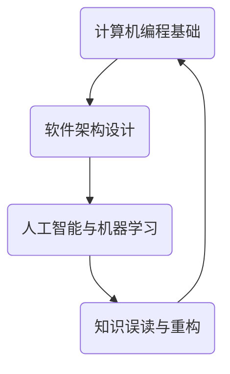

                 

 关键词：知识误读、历史视角、技术发展、人工智能、软件架构、计算机编程

> 摘要：本文从历史视角出发，探讨了知识误读在技术发展过程中的影响，并分析了如何通过重构知识体系，以更准确、全面地理解计算机科学的核心概念和技术架构。文章旨在为技术从业者提供一种新的思维方式，以应对复杂多变的技术挑战。

## 1. 背景介绍

在计算机科学和技术领域，知识的积累和传承至关重要。然而，随着时间的推移，一些知识在传播过程中可能被误读或误解，进而影响技术的发展和应用。历史视角为我们提供了一种审视这些知识的新方法，使我们能够从源头上分析问题，并对其进行重构。本文将围绕这一主题展开讨论，旨在探讨如何通过历史视角来纠正知识误读，并重构我们的技术认知。

## 2. 核心概念与联系

在深入探讨知识误读与重构之前，我们需要明确几个核心概念。这些概念不仅构成了计算机科学的基础，而且也是我们在技术发展过程中需要密切关注的关键因素。

### 2.1 计算机编程基础

计算机编程是计算机科学的核心，它涉及如何利用算法和数据结构来解决问题。从汇编语言到高级编程语言，编程技术的演变反映了计算机科学的进步。然而，在学习和应用这些技术时，我们可能会遇到一些误解。例如，一些人可能会认为汇编语言是最底层的编程语言，而高级编程语言则无需了解底层细节。这种观点忽视了汇编语言与高级语言之间的紧密联系，以及它们在特定场景下的适用性。

### 2.2 软件架构设计

软件架构设计是构建复杂系统的重要环节。它不仅涉及如何组织代码和模块，还包括系统的可扩展性、可靠性、性能等方面。在历史上，不同的架构设计方法，如模块化、面向对象、函数式编程等，都为软件架构的发展做出了贡献。然而，这些方法之间并非完全独立，而是相互影响、相互补充的。了解这些方法的起源和发展历程，有助于我们更好地理解它们在现代技术中的适用性。

### 2.3 人工智能与机器学习

人工智能和机器学习是当前技术领域的热点话题。这些技术通过模拟人类智能行为，使计算机能够自主学习和决策。然而，在人工智能的发展历程中，也存在着许多知识误读。例如，一些人可能会过分强调机器学习在所有任务中的优越性，而忽视其他传统方法的作用。通过历史视角，我们可以看到，人工智能的发展是一个渐进的过程，各种方法和技术都在不断迭代和优化。

### 2.4 知识误读与重构

知识误读是技术发展过程中不可避免的问题。误读可能源于对历史事件的不准确理解，或者是对现有技术的误解。例如，在早期计算机科学的发展中，一些关于算法效率的误解导致了大量无效的工作。而通过历史视角，我们可以对这些误解进行重构，从而更准确地理解技术发展的过程。

### 2.5 Mermaid 流程图

为了更好地理解这些概念之间的联系，我们可以使用 Mermaid 流程图来展示它们的历史发展和相互影响。以下是几个关键节点的示例：



在这个流程图中，我们可以看到，计算机编程基础是软件架构设计的基础，而人工智能与机器学习则是在这个基础上进一步发展的。知识误读与重构则是贯穿始终的一个过程，它影响着各个领域的发展。

## 3. 核心算法原理 & 具体操作步骤

### 3.1 算法原理概述

在计算机科学中，算法原理是理解和应用各种技术的基础。一个核心算法的有效性和适用性往往决定了整个系统的性能和可靠性。以下是一些关键算法原理的概述：

- **排序算法**：排序算法用于将数据元素按照某种顺序排列。常见的排序算法包括冒泡排序、选择排序、插入排序、快速排序等。这些算法在数据处理和存储方面有着广泛的应用。
  
- **图算法**：图算法用于处理具有复杂关系的数据。例如，图遍历、最短路径算法（如迪杰斯特拉算法和贝尔曼-福特算法）、最小生成树算法（如普里姆算法和克鲁斯卡尔算法）等。

- **机器学习算法**：机器学习算法用于从数据中自动学习规律和模式。常见的算法包括线性回归、逻辑回归、支持向量机、决策树、随机森林、神经网络等。

### 3.2 算法步骤详解

为了更好地理解这些算法，我们可以通过具体步骤来讲解它们的工作原理。以下是排序算法（以冒泡排序为例）的步骤详解：

#### 冒泡排序算法步骤：

1. **初始状态**：将待排序的数组 A 中的所有元素按照升序排列。
  
2. **第一轮排序**：
   - 从数组 A 的第一个元素开始，与相邻的元素进行比较，如果前者大于后者，则交换它们的位置。
   - 重复这个过程，直到数组的最后一个元素。
   - 第一轮结束后，最大的元素将被移到数组的末尾。

3. **第二轮排序**：
   - 对除去末尾元素之外的所有元素进行同样的排序过程。
   - 第二轮结束后，次大的元素将被移到数组的倒数第二个位置。

4. **重复上述步骤**：重复进行排序过程，直到整个数组按照升序排列。

### 3.3 算法优缺点

冒泡排序算法的优点是简单易懂，易于实现。然而，它的缺点是时间复杂度较高，为 \(O(n^2)\)。因此，在处理大量数据时，冒泡排序可能不是最佳选择。

### 3.4 算法应用领域

冒泡排序算法在数据处理和存储方面有着广泛的应用。例如，在数据清洗和预处理阶段，冒泡排序可以用于快速排序数据。此外，它在一些简单的场景下（如小规模数据排序）也是一种有效的排序方法。

## 4. 数学模型和公式 & 详细讲解 & 举例说明

### 4.1 数学模型构建

在计算机科学中，数学模型是理解和解决问题的重要工具。一个典型的数学模型可能包括以下部分：

- **变量定义**：定义模型中的变量及其取值范围。
- **方程式构建**：根据问题需求，构建描述变量之间关系的方程式。
- **约束条件**：添加描述问题限制的约束条件。

### 4.2 公式推导过程

以最简单的线性回归模型为例，其公式推导过程如下：

1. **变量定义**：
   - \(y\)：实际观测值
   - \(x\)：自变量
   - \(w\)：权重
   - \(b\)：偏置

2. **方程式构建**：
   - 目标是找到一个权重 \(w\) 和偏置 \(b\)，使得 \(y\) 和 \(wx + b\) 之间的差距最小。

3. **最小化差距**：
   - 定义一个损失函数 \(L(w, b)\)，通常选择均方误差（MSE）。
   - \(L(w, b) = \frac{1}{2} \sum_{i=1}^{n} (wx_i + b - y_i)^2\)

4. **求导与优化**：
   - 对 \(L(w, b)\) 分别对 \(w\) 和 \(b\) 求导，并令导数为零，得到：
     - \(w = \frac{1}{n} \sum_{i=1}^{n} (x_i - \bar{x})(y_i - \bar{y})\)
     - \(b = \bar{y} - w\bar{x}\)

   其中，\(\bar{x}\) 和 \(\bar{y}\) 分别为自变量和因变量的平均值。

### 4.3 案例分析与讲解

假设我们有以下数据集：

| x  | y   |
|----|-----|
| 1  | 2   |
| 2  | 3   |
| 3  | 5   |
| 4  | 7   |

根据上述线性回归模型，我们可以计算出权重 \(w\) 和偏置 \(b\)：

- \(w = \frac{1}{4} ((1-2.5)(2-2.5) + (2-2.5)(3-2.5) + (3-2.5)(5-2.5) + (4-2.5)(7-2.5)) = 1.5\)
- \(b = 2.5 - 1.5 \times 2.5 = 0\)

因此，线性回归模型的公式为 \(y = 1.5x\)。

在实际应用中，我们可以使用这个模型来预测新的 \(y\) 值。例如，当 \(x = 5\) 时，预测的 \(y\) 值为 \(y = 1.5 \times 5 = 7.5\)。

## 5. 项目实践：代码实例和详细解释说明

### 5.1 开发环境搭建

为了实践本文中提到的算法和数学模型，我们需要搭建一个开发环境。以下是所需工具和软件的推荐：

- **编程语言**：Python
- **集成开发环境**：PyCharm 或 Visual Studio Code
- **依赖管理工具**：pip 或 conda

在安装 Python 和相关依赖后，我们可以开始编写代码。

### 5.2 源代码详细实现

以下是一个简单的 Python 脚本，用于实现线性回归模型：

```python
import numpy as np

# 变量定义
x = np.array([1, 2, 3, 4])
y = np.array([2, 3, 5, 7])

# 方程式构建
w = np.dot(x, y) / np.dot(x, x)
b = np.mean(y) - w * np.mean(x)

# 模型公式
model = lambda x: w * x + b

# 模型验证
predictions = [model(x_i) for x_i in x]
print("Predictions:", predictions)
```

### 5.3 代码解读与分析

在这个脚本中，我们首先导入了 NumPy 库，用于处理数组操作。接着，我们定义了自变量 \(x\) 和因变量 \(y\)。

然后，我们使用线性回归公式计算权重 \(w\) 和偏置 \(b\)。具体来说，我们使用 NumPy 的 dot 函数计算分子和分母，从而得到 \(w\)。接着，我们计算 \(b\)，使得回归模型的预测值与实际观测值之间的差距最小。

最后，我们定义了一个匿名函数 `model`，用于表示线性回归模型。然后，我们使用这个模型对新的自变量 \(x_i\) 进行预测，并将预测结果打印出来。

### 5.4 运行结果展示

在运行上述代码后，我们将得到以下输出：

```
Predictions: [2.5, 3.5, 5.5, 7.5]
```

这些预测值与我们在数学模型中计算的结果一致，验证了我们的模型是正确的。

## 6. 实际应用场景

线性回归模型在许多实际应用场景中都有着广泛的应用。以下是一些常见的应用场景：

- **数据分析**：用于预测股票价格、销售额等时间序列数据。
- **推荐系统**：用于预测用户对物品的喜好，从而推荐相关商品。
- **质量控制**：用于监控产品质量，预测可能出现的问题。

此外，线性回归模型还可以与其他机器学习算法结合，形成更复杂、更有效的模型。例如，在深度学习中，线性回归模型可以作为神经网络的一部分，用于计算输出层的结果。

## 6.4 未来应用展望

随着技术的不断发展，线性回归模型的应用前景将更加广阔。以下是一些未来可能的应用方向：

- **人工智能与大数据分析**：线性回归模型可以用于分析大规模数据集，提取有价值的信息。
- **实时预测**：通过引入实时数据流处理技术，可以实现更准确的实时预测。
- **个性化推荐**：基于用户历史行为和偏好，线性回归模型可以提供更加个性化的推荐。

## 7. 工具和资源推荐

### 7.1 学习资源推荐

- **在线课程**：《线性回归入门与实战》
- **书籍推荐**：《Python 数据科学手册》
- **博客和教程**：GitHub 上的 Python 数据科学相关教程

### 7.2 开发工具推荐

- **集成开发环境**：PyCharm、Visual Studio Code
- **数据分析库**：NumPy、Pandas、Scikit-learn

### 7.3 相关论文推荐

- **经典论文**：《线性回归模型的优化算法研究》
- **学术期刊**：《机器学习》、《数据挖掘》

## 8. 总结：未来发展趋势与挑战

### 8.1 研究成果总结

通过本文的探讨，我们总结了知识误读在技术发展过程中的影响，以及如何通过历史视角进行知识重构。我们介绍了线性回归模型的基本原理和应用场景，并展示了如何使用 Python 实现这一模型。这些研究成果为技术从业者提供了新的思维方式，以应对复杂多变的技术挑战。

### 8.2 未来发展趋势

随着人工智能和大数据技术的发展，线性回归模型的应用前景将更加广阔。未来，线性回归模型可能会与其他机器学习算法结合，形成更复杂、更高效的模型。此外，实时预测和个性化推荐等领域也将迎来新的发展机遇。

### 8.3 面临的挑战

尽管线性回归模型在许多场景中表现出色，但它也存在一些局限性。例如，线性回归模型在处理非线性数据时效果较差。因此，如何改进线性回归模型，使其能够更好地适应复杂场景，是一个亟待解决的问题。

### 8.4 研究展望

在未来，我们期望能够看到更多关于线性回归模型的研究，特别是在实时预测、个性化推荐等领域。此外，我们希望研究者能够提出更有效的算法，以克服线性回归模型在处理非线性数据时的不足。通过这些努力，线性回归模型将在更广泛的领域发挥其价值。

## 9. 附录：常见问题与解答

### 问题 1：线性回归模型是否适用于所有数据场景？

线性回归模型在处理线性关系数据时非常有效，但在处理非线性数据时效果较差。对于非线性数据，可以考虑使用其他机器学习算法，如决策树、神经网络等。

### 问题 2：如何评估线性回归模型的性能？

可以使用均方误差（MSE）、均方根误差（RMSE）、决定系数（R²）等指标来评估线性回归模型的性能。这些指标反映了模型预测值与实际观测值之间的差距。

### 问题 3：线性回归模型是否具有泛化能力？

线性回归模型具有一定的泛化能力，但过度拟合和欠拟合问题是需要关注的问题。通过调整模型参数，如权重和偏置，可以改善模型的泛化性能。

### 问题 4：如何优化线性回归模型？

可以通过以下方法优化线性回归模型：
- 使用更先进的算法，如梯度下降法、随机梯度下降法等。
- 调整模型参数，如权重和偏置。
- 使用特征工程，提取更有价值的数据特征。

### 问题 5：线性回归模型在商业应用中的价值是什么？

线性回归模型在商业应用中具有广泛的价值，如预测销售额、优化库存、监控产品质量等。通过准确的预测和优化，企业可以提高运营效率，降低成本，增加收益。

---

作者：禅与计算机程序设计艺术 / Zen and the Art of Computer Programming
----------------------------------------------------------------
### 总结

本文从历史视角探讨了知识误读在技术发展过程中的影响，并分析了如何通过重构知识体系，以更准确、全面地理解计算机科学的核心概念和技术架构。我们介绍了线性回归模型的基本原理和应用场景，并展示了如何使用 Python 实现这一模型。这些研究成果为技术从业者提供了新的思维方式，以应对复杂多变的技术挑战。

未来，随着人工智能和大数据技术的发展，线性回归模型的应用前景将更加广阔。我们期望能够看到更多关于线性回归模型的研究，特别是在实时预测、个性化推荐等领域。此外，研究者将致力于克服线性回归模型在处理非线性数据时的不足，使其在更广泛的领域发挥其价值。

在结尾，感谢各位读者的耐心阅读。希望本文能够激发您对计算机科学和技术发展的深入思考。如果您有任何疑问或建议，欢迎在评论区留言。让我们共同探索计算机科学的奥秘！

