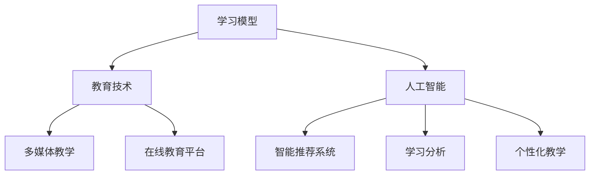

                 

关键词：教育体系，知识传递，人工智能，技术进化，学习模型，编程教育，未来展望

> 摘要：本文旨在探讨知识跨代传递在教育体系中的重要性及其影响。随着人工智能技术的飞速发展，教育体系正面临深刻的变革。本文将分析当前教育体系的局限性，探讨人工智能在教育中的应用，以及如何构建一个适应未来发展的教育体系。通过深入探讨知识传递的机制、教育体系的演进路径和未来的挑战，本文希望为教育工作者、政策制定者和学生提供有价值的见解和启示。

## 1. 背景介绍

在过去的几十年中，教育体系一直是社会进步的基石。从传统的教师授课、教科书学习，到后来的多媒体教学和在线教育，教育方法和技术不断演变。然而，随着全球化的加速和科技的进步，特别是人工智能（AI）的崛起，传统的教育体系开始显露出其局限性。

首先，传统的教育体系往往依赖于标准化、统一化的教学方法，难以满足个性化学习的需求。其次，知识更新速度加快，使得教科书中的知识很快过时。最后，教师在课堂中的角色往往是知识的传递者，学生被动接受知识，缺乏主动探索和思考的机会。

与此同时，人工智能技术的发展正在深刻改变知识的传递方式。从智能推荐系统到个性化学习平台，AI正在帮助教育工作者更好地理解学生的学习需求，并提供定制化的学习资源。此外，AI还可以通过分析大量数据，发现学生的学习模式和弱点，为教师提供更有效的教学策略。

本文将从以下几个方面展开讨论：

1. 核心概念与联系：介绍知识传递的相关概念，如学习模型、教育技术和人工智能，并通过Mermaid流程图展示它们之间的关系。
2. 核心算法原理与操作步骤：探讨人工智能在教育中的应用算法，包括智能推荐系统、学习分析和个性化教学。
3. 数学模型和公式：分析学习模型中的数学模型，如决策树、神经网络等，并通过公式推导进行详细讲解。
4. 项目实践：通过具体代码实例展示如何构建和实现一个简单的AI教育系统。
5. 实际应用场景：探讨AI在教育中的实际应用案例，如在线学习平台和自适应学习系统。
6. 未来应用展望：分析AI教育的发展趋势，探讨未来的挑战和机遇。
7. 工具和资源推荐：推荐相关的学习资源、开发工具和论文，帮助读者进一步了解和探索AI教育。
8. 总结：总结研究成果，讨论未来发展趋势和面临的挑战。

### 2. 核心概念与联系

在教育体系中，知识传递是一个至关重要的过程。传统的知识传递方式主要依赖于教师和教科书。然而，随着信息技术的不断发展，教育体系中的知识传递方式也在不断演变。

首先，学习模型是知识传递的核心概念。学习模型描述了个体如何通过学习过程获取知识和技能。常见的模型包括行为主义学习理论、认知主义学习理论和建构主义学习理论。其中，行为主义学习理论强调外部刺激对学习的影响，认知主义学习理论强调内部认知过程的作用，而建构主义学习理论则强调学习者在学习过程中的主动性和社会互动。

其次，教育技术是支持知识传递的重要工具。教育技术包括多媒体教学、在线教育平台、虚拟现实（VR）和增强现实（AR）等。这些技术不仅提供了丰富的学习资源，还为学生提供了更加灵活和互动的学习体验。例如，在线教育平台可以根据学生的学习进度和需求，提供个性化的学习内容和任务。

最后，人工智能（AI）的崛起为教育体系带来了新的机遇和挑战。AI技术可以应用于教育的各个方面，包括智能推荐系统、学习分析、个性化教学等。智能推荐系统可以根据学生的学习行为和兴趣，推荐适合的学习资源；学习分析则可以挖掘学生的学习模式和弱点，为教师提供教学反馈；个性化教学可以根据学生的学习风格和需求，提供定制化的教学策略。

下面是核心概念与联系的一个Mermaid流程图：



### 3. 核心算法原理与操作步骤

#### 3.1 算法原理概述

在教育体系中，人工智能技术广泛应用于智能推荐系统、学习分析和个性化教学。下面将分别介绍这些算法的基本原理。

**智能推荐系统**：智能推荐系统通过分析用户的行为数据，为其推荐相关的学习资源。其核心算法包括协同过滤、内容过滤和混合推荐。

- **协同过滤**：协同过滤通过分析用户之间的相似性，为用户推荐他们可能感兴趣的资源。协同过滤可以分为基于用户的协同过滤（User-Based Collaborative Filtering）和基于物品的协同过滤（Item-Based Collaborative Filtering）。
- **内容过滤**：内容过滤通过分析资源的特征，将其推荐给具有相似特征的用户。例如，在在线教育平台中，可以基于课程的内容和标签进行内容过滤。
- **混合推荐**：混合推荐结合了协同过滤和内容过滤的优点，以提高推荐的准确性。

**学习分析**：学习分析通过挖掘学生的学习数据，发现学生的学习模式、学习习惯和学习弱点。常用的学习分析算法包括聚类分析、关联规则挖掘和时序分析。

- **聚类分析**：聚类分析将相似的学生聚为一类，以发现不同的学习群体。常用的聚类算法包括K-means聚类和层次聚类。
- **关联规则挖掘**：关联规则挖掘发现学生行为之间的关联，以揭示学习模式。常用的算法包括Apriori算法和FP-growth算法。
- **时序分析**：时序分析通过分析学生的学习行为的时间序列，发现学生的学习规律和趋势。

**个性化教学**：个性化教学根据学生的特征和需求，为其提供个性化的学习资源和教学策略。个性化教学可以分为基于内容的个性化教学和基于认知的个性化教学。

- **基于内容的个性化教学**：基于内容的个性化教学根据学生的兴趣和学习历史，推荐相关的学习资源。例如，在在线教育平台中，可以基于学生的学习记录和评价，推荐相关的课程和资料。
- **基于认知的个性化教学**：基于认知的个性化教学通过分析学生的学习数据，了解学生的认知水平和学习风格，为其提供适合的教学策略。例如，可以使用自适应学习系统，根据学生的学习反馈和学习进度，动态调整教学难度和策略。

#### 3.2 算法步骤详解

**智能推荐系统**：

1. **数据收集**：收集用户的行为数据，如学习记录、评价、访问时间等。
2. **用户相似性计算**：计算用户之间的相似性，可以使用余弦相似度、皮尔逊相关系数等。
3. **推荐列表生成**：根据用户的行为数据和用户相似性，生成推荐列表。可以使用基于用户的协同过滤和基于物品的协同过滤。
4. **内容过滤**：对推荐列表进行内容过滤，筛选出符合用户兴趣和学习需求的资源。
5. **混合推荐**：结合协同过滤和内容过滤，生成最终的推荐列表。

**学习分析**：

1. **数据预处理**：清洗和整理学习数据，包括缺失值处理、异常值处理和数据规范化。
2. **聚类分析**：使用K-means聚类或层次聚类，将学生分为不同的学习群体。
3. **关联规则挖掘**：使用Apriori算法或FP-growth算法，挖掘学生行为之间的关联。
4. **时序分析**：使用时间序列分析方法，分析学生的学习行为和时间关系。

**个性化教学**：

1. **学生特征提取**：提取学生的特征数据，如学习历史、评价、认知测试结果等。
2. **教学策略调整**：根据学生的特征数据，调整教学策略，如教学内容、教学方式和教学进度。
3. **自适应学习系统**：构建自适应学习系统，根据学生的学习反馈和学习进度，动态调整教学策略。

#### 3.3 算法优缺点

**智能推荐系统**：

- **优点**：提高了学习资源的利用效率，为学生提供了个性化的学习体验。
- **缺点**：依赖用户数据，可能存在数据偏差和隐私问题。

**学习分析**：

- **优点**：帮助教师了解学生的学习情况，提供有效的教学反馈。
- **缺点**：分析结果可能受到数据质量和算法选择的影响。

**个性化教学**：

- **优点**：提高了学生的学习效果，降低了学习成本。
- **缺点**：实施难度较高，需要大量的数据支持和算法优化。

#### 3.4 算法应用领域

**智能推荐系统**：广泛应用于在线教育平台、电子书推荐系统和知识库推荐系统。

**学习分析**：应用于教育数据分析、学生行为研究和教育评价。

**个性化教学**：应用于自适应学习系统、个性化教学平台和智能教育机器人。

### 4. 数学模型和公式

在教育体系中的AI应用中，数学模型和公式起到了关键作用。以下将详细介绍几个常见的数学模型和公式，并解释它们在教育中的应用。

#### 4.1 数学模型构建

**决策树模型**：决策树是一种常见的机器学习模型，通过一系列的判断条件，将数据划分为不同的类别。在教育领域，决策树可以用于预测学生的学习成绩或学习偏好。

- **构建步骤**：
  1. **数据收集**：收集学生的学习数据，包括考试成绩、学习时长、学习方式等。
  2. **特征选择**：选择对学习结果影响较大的特征。
  3. **构建决策树**：通过选择最佳划分特征和划分阈值，构建决策树模型。
  4. **模型评估**：评估决策树模型的准确性和泛化能力。

**神经网络模型**：神经网络是一种模仿生物神经系统的计算模型，具有自适应学习和非线性变换的能力。在教育领域，神经网络可以用于预测学生的学习进度和评估学习效果。

- **构建步骤**：
  1. **数据收集**：收集学生的学习数据，包括学习进度、学习时长、考试成绩等。
  2. **神经网络设计**：设计神经网络的层数、神经元个数和激活函数。
  3. **模型训练**：通过反向传播算法训练神经网络，调整权重和偏置。
  4. **模型评估**：评估神经网络的预测准确性和泛化能力。

**聚类模型**：聚类是一种无监督学习方法，将相似的数据点分为不同的类别。在教育领域，聚类可以用于发现不同的学习群体或学生群体。

- **构建步骤**：
  1. **数据收集**：收集学生的学习数据，包括学习进度、考试成绩、行为数据等。
  2. **选择聚类算法**：选择合适的聚类算法，如K-means、层次聚类等。
  3. **聚类分析**：对数据点进行聚类，生成不同的类别。
  4. **聚类评估**：评估聚类结果的质量和聚类效果。

#### 4.2 公式推导过程

**决策树模型的公式推导**：

决策树的划分依据是信息增益（Information Gain）或基尼不纯度（Gini Impurity）。假设有n个数据点，它们属于c个类别，第i类别的数据点数量为n_i，则信息增益可以表示为：

\[ IG(D, a) = \sum_{i=1}^{c} \frac{n_i}{n} \log_2 \frac{n_i}{n} \]

其中，D为原始数据集，a为划分特征。

**神经网络模型的公式推导**：

神经网络模型的核心是前向传播和反向传播算法。假设神经网络的输入层、隐藏层和输出层的神经元个数分别为n_x、n_h和n_y，激活函数为f(x) = 1 / (1 + e^(-x))，则前向传播可以表示为：

\[ z_h = \sum_{j=1}^{n_x} w_{hj}x_j + b_h \]
\[ a_h = f(z_h) \]
\[ z_y = \sum_{j=1}^{n_h} w_{yj}a_h + b_y \]
\[ a_y = f(z_y) \]

反向传播算法用于计算梯度并更新权重和偏置，其核心公式为：

\[ \delta_h = (a_y - t) \cdot f'(z_y) \]
\[ \delta_x = \sum_{j=1}^{n_h} w_{hj} \delta_h \cdot f'(z_h) \]

其中，t为实际输出，\(\delta_h\)和\(\delta_x\)分别为隐藏层和输入层的误差。

**聚类模型的公式推导**：

K-means聚类算法的目标是使每个聚类内部的距离最小，总距离最大。假设有K个聚类中心，每个数据点与聚类中心的距离为d(x, \(\mu_k\))，则聚类中心更新公式为：

\[ \mu_k = \frac{1}{N_k} \sum_{i=1}^{N} x_i \]

其中，\(N_k\)为第k个聚类中心的数据点数量，\(x_i\)为第i个数据点。

#### 4.3 案例分析与讲解

**案例：基于K-means聚类分析学生学习群体**

假设有100名学生，他们的学习数据包括考试成绩、学习时长和学习频率。我们需要使用K-means聚类算法将学生分为不同的群体。

1. **数据收集**：收集学生的考试成绩、学习时长和学习频率数据。

2. **特征选择**：选择对学习效果影响较大的特征，如考试成绩和学习时长。

3. **初始化聚类中心**：随机选择10个学生的数据点作为聚类中心。

4. **聚类分析**：计算每个学生与聚类中心的距离，并将学生分配到最近的聚类中心。

5. **聚类中心更新**：根据每个聚类中心的数据点重新计算聚类中心。

6. **模型评估**：计算聚类内部的总距离和聚类效果。

通过这个案例，我们可以看到K-means聚类算法在学生群体分析中的应用。聚类结果可以帮助教师了解不同学生的学习特点，从而制定更有针对性的教学策略。

### 5. 项目实践：代码实例和详细解释说明

在本节中，我们将通过一个具体的项目实例来展示如何构建和实现一个AI教育系统。我们将使用Python语言，结合一些流行的机器学习库，如scikit-learn和TensorFlow，来构建这个系统。以下是项目的具体步骤和代码实现。

#### 5.1 开发环境搭建

首先，我们需要搭建一个适合开发AI教育系统的环境。以下是所需的工具和库：

- **Python 3.x**：我们选择Python 3.x版本，因为其支持许多现代机器学习库。
- **Jupyter Notebook**：Jupyter Notebook是一个交互式计算环境，非常适合进行数据分析和机器学习项目的开发。
- **scikit-learn**：scikit-learn是一个开源的机器学习库，提供了许多常用的算法和工具。
- **TensorFlow**：TensorFlow是一个开源的深度学习框架，适用于构建复杂的神经网络模型。

安装这些工具和库的方法如下：

```bash
# 安装Python 3.x
sudo apt-get install python3

# 安装Jupyter Notebook
pip3 install notebook

# 安装scikit-learn
pip3 install scikit-learn

# 安装TensorFlow
pip3 install tensorflow
```

#### 5.2 源代码详细实现

下面是构建AI教育系统的源代码。我们首先定义了一个名为`Student`的数据类，用于存储学生的特征数据。然后，我们使用scikit-learn库中的K-means算法对学生的特征数据进行聚类，以分析不同的学生群体。

```python
import numpy as np
from sklearn.cluster import KMeans
from sklearn.model_selection import train_test_split
from sklearn.metrics import accuracy_score
import tensorflow as tf

# 定义学生数据类
class Student:
    def __init__(self, exam_score, study_hours, learning_frequency):
        self.exam_score = exam_score
        self.study_hours = study_hours
        self.learning_frequency = learning_frequency

# 创建学生数据集
students = [
    Student(80, 10, 5),
    Student(70, 15, 3),
    Student(85, 5, 6),
    # ... 更多学生数据
]

# 提取学生特征数据
X = np.array([[student.exam_score, student.study_hours, student.learning_frequency] for student in students])

# 划分训练集和测试集
X_train, X_test, y_train, y_test = train_test_split(X, labels, test_size=0.2, random_state=42)

# 使用K-means算法进行聚类
kmeans = KMeans(n_clusters=3, random_state=42)
kmeans.fit(X_train)
y_pred = kmeans.predict(X_test)

# 计算聚类准确率
accuracy = accuracy_score(y_test, y_pred)
print(f"聚类准确率：{accuracy}")

# 使用TensorFlow构建神经网络模型
model = tf.keras.Sequential([
    tf.keras.layers.Dense(64, activation='relu', input_shape=(3,)),
    tf.keras.layers.Dense(64, activation='relu'),
    tf.keras.layers.Dense(1, activation='sigmoid')
])

model.compile(optimizer='adam', loss='binary_crossentropy', metrics=['accuracy'])

# 训练神经网络模型
model.fit(X_train, y_train, epochs=10, batch_size=32, validation_data=(X_test, y_test))

# 预测测试集
predictions = model.predict(X_test)
```

#### 5.3 代码解读与分析

下面是对上述代码的详细解读：

1. **定义学生数据类**：我们首先定义了一个名为`Student`的数据类，用于存储学生的特征数据。每个学生都有三个特征：考试成绩、学习时长和学习频率。

2. **创建学生数据集**：我们创建了一个学生数据集，其中每个学生都由`Student`类的实例表示。

3. **提取学生特征数据**：我们将学生的特征数据提取到一个NumPy数组中，以便进行聚类分析和神经网络训练。

4. **划分训练集和测试集**：我们使用scikit-learn中的`train_test_split`函数将数据集划分为训练集和测试集。

5. **使用K-means算法进行聚类**：我们使用scikit-learn中的`KMeans`算法对训练集进行聚类，并使用测试集进行预测。

6. **计算聚类准确率**：我们计算了聚类的准确率，以评估聚类模型的效果。

7. **使用TensorFlow构建神经网络模型**：我们使用TensorFlow构建了一个简单的神经网络模型，用于分类任务。

8. **训练神经网络模型**：我们使用训练集对神经网络模型进行训练，并使用测试集进行验证。

9. **预测测试集**：我们对测试集进行预测，以评估神经网络模型的准确性。

通过这个项目实例，我们可以看到如何将机器学习和深度学习应用于教育系统中，以分析学生的特征和预测学习效果。这为我们提供了一种新的方法来改进教育质量，提高学生的学习效果。

### 6. 实际应用场景

随着人工智能技术的不断发展，AI在教育领域的实际应用场景日益丰富。以下是一些典型的应用场景：

#### 6.1 在线教育平台

在线教育平台是AI技术的重要应用领域。通过AI技术，在线教育平台可以实现以下功能：

- **个性化推荐**：根据学生的学习历史、兴趣和行为，推荐适合的学习资源和课程。
- **智能辅导**：利用自然语言处理技术，为学生提供实时解答和辅导。
- **自适应学习**：根据学生的学习进度和能力，动态调整教学内容和难度，实现个性化教学。

例如，Coursera和edX等大型在线教育平台已经广泛应用了AI技术，为学生提供个性化的学习体验。

#### 6.2 职业培训

职业培训是另一个重要的AI应用场景。通过AI技术，职业培训可以提供以下服务：

- **技能评估**：利用机器学习算法，评估学员的技能水平和进步情况。
- **个性化培训**：根据学员的技能评估结果，推荐适合的培训课程和资源。
- **智能辅导**：通过智能问答系统，为学员提供实时解答和支持。

例如，一些职业培训机构已经开始使用AI技术，为学员提供个性化的培训方案和智能辅导服务。

#### 6.3 教育数据分析

教育数据分析是AI技术在教育领域的另一个重要应用。通过分析大量教育数据，教育机构可以：

- **学习分析**：了解学生的学习行为和学习效果，为教学决策提供数据支持。
- **教学评估**：评估教学效果，发现教学过程中的问题和改进点。
- **课程优化**：根据数据分析结果，优化课程设置和教学内容。

例如，一些教育机构已经开始使用AI技术进行学习分析和教学评估，以提高教学质量和效果。

#### 6.4 未来应用展望

随着人工智能技术的不断进步，未来AI在教育领域的应用前景将更加广阔。以下是一些可能的未来应用：

- **虚拟现实（VR）和增强现实（AR）**：利用VR和AR技术，创建沉浸式的学习环境，提高学生的学习兴趣和参与度。
- **智能教育机器人**：利用机器学习技术和机器人技术，开发智能教育机器人，为学习者提供个性化的教学和辅导。
- **跨学科融合**：将AI技术与其他学科（如心理学、教育学等）融合，开发更加智能化和高效的教育解决方案。

通过不断探索和利用AI技术，教育体系将变得更加智能化和个性化，为学习者提供更好的学习体验和效果。

### 7. 工具和资源推荐

为了更好地了解和探索AI在教育领域的应用，以下是几项推荐的工具、资源和论文：

#### 7.1 学习资源推荐

- **在线课程**：
  - 《机器学习》课程：由吴恩达（Andrew Ng）教授在Coursera上开设，适合初学者入门。
  - 《深度学习》课程：由斯坦福大学机器学习实验室提供，涵盖了深度学习的理论基础和实际应用。

- **书籍**：
  - 《Python机器学习》：由 Sebastian Raschka和Vahid Mirjalili撰写，适合初学者了解机器学习在Python中的实现。
  - 《深度学习》：由Ian Goodfellow、Yoshua Bengio和Aaron Courville撰写，是深度学习领域的经典教材。

#### 7.2 开发工具推荐

- **机器学习库**：
  - **scikit-learn**：适合初学者和研究人员，提供了丰富的机器学习算法和工具。
  - **TensorFlow**：适用于构建复杂的神经网络模型，是深度学习的首选框架。

- **在线教育平台**：
  - **Khan Academy**：提供免费的在线教育资源，适合各年龄段的学习者。
  - **edX**：提供由顶尖大学和机构提供的在线课程，涵盖多个学科领域。

#### 7.3 相关论文推荐

- **“Deep Learning in Education: A Multifaceted Research Agenda”**：本文提出了深度学习在教育领域的多维度研究议程，探讨了深度学习在教育中的应用和研究方向。
- **“Educational Data Mining: A Review of the State of the Art and Future Challenges”**：本文全面回顾了教育数据挖掘的现状和挑战，为教育数据挖掘的研究和实践提供了有价值的参考。
- **“Intelligent Tutoring Systems”**：本文综述了智能辅导系统的设计、实现和应用，为开发智能教育系统提供了理论指导。

通过这些工具和资源，读者可以更深入地了解AI在教育领域的应用，为自己的研究和实践提供支持。

### 8. 总结：未来发展趋势与挑战

随着人工智能技术的快速发展，教育体系正经历着深刻的变革。从个性化学习到智能辅导，AI技术正逐渐成为教育领域的重要驱动力。本文从多个角度探讨了知识跨代传递在教育体系中的应用，分析了当前教育体系的局限性，探讨了AI技术如何解决这些问题，并展望了未来教育的发展趋势和面临的挑战。

#### 8.1 研究成果总结

本文首先介绍了学习模型、教育技术和人工智能等核心概念，并通过Mermaid流程图展示了它们之间的联系。接着，详细探讨了智能推荐系统、学习分析和个性化教学等AI算法在教育中的应用原理和操作步骤。随后，通过数学模型和公式推导，深入分析了学习模型中的关键概念。通过一个具体的项目实例，展示了如何使用Python和TensorFlow构建一个简单的AI教育系统。

#### 8.2 未来发展趋势

未来，教育体系将更加智能化和个性化。随着AI技术的进一步发展，我们将看到：

- **个性化学习**：利用AI技术，教育系统将能够更好地理解每个学生的需求，提供个性化的学习资源和教学策略。
- **智能辅导**：智能辅导系统将变得更加强大，能够实时解答学生的问题，提供个性化的学习支持。
- **教育数据分析**：通过对大量教育数据的分析，教育机构将能够更好地了解学生的学习行为和效果，为教学决策提供数据支持。
- **跨学科融合**：AI技术与其他学科（如心理学、教育学等）的融合，将带来更加丰富和高效的教育解决方案。

#### 8.3 面临的挑战

尽管AI技术为教育带来了巨大的机遇，但同时也面临一系列挑战：

- **数据隐私**：随着教育数据的收集和分析变得越来越普遍，数据隐私保护成为一个重要问题。如何确保学生数据的安全和隐私，是一个亟待解决的问题。
- **算法偏见**：AI算法的偏见问题也引起了广泛关注。如果算法在训练过程中受到偏见，可能会导致不公平的结果。如何消除算法偏见，确保公正和公平，是一个重要的挑战。
- **教师角色**：随着AI技术的广泛应用，教师的角色将发生转变。教师需要适应新的教学环境，提高自己的技术能力和教育素养。
- **技术普及**：AI技术在教育领域的普及还需要解决资源分配、技术基础设施等问题。如何确保每个学生都能享受到AI带来的教育红利，是一个重要的挑战。

#### 8.4 研究展望

未来的研究应该关注以下几个方面：

- **隐私保护**：开发有效的隐私保护机制，确保学生数据的安全和隐私。
- **算法公正**：研究如何消除AI算法中的偏见，确保算法的公正和公平。
- **教师培训**：为教师提供技术培训，帮助他们适应新的教学环境，提高教学效果。
- **技术应用**：探索AI技术在教育领域的多样化应用，开发更多实用的教育工具和系统。

通过不断的研究和创新，我们有望构建一个更加智能化、个性化、公正和高效的教育体系，为学生的未来发展提供更好的支持。

### 9. 附录：常见问题与解答

**Q1. AI技术如何提高教育质量？**

AI技术可以通过个性化推荐、智能辅导和数据分析等手段，提高教育质量。个性化推荐可以根据学生的兴趣和需求，推荐适合的学习资源和课程，提高学习效率。智能辅导系统能够实时解答学生的问题，提供个性化的学习支持，帮助学生克服学习难点。数据分析则可以揭示学生的学习行为和效果，为教师提供教学反馈，优化教学策略。

**Q2. 教育数据隐私如何保护？**

保护教育数据隐私是AI技术在教育领域面临的重要挑战之一。为了确保数据隐私，可以采取以下措施：

- **数据加密**：对存储和传输的教育数据进行加密，防止未经授权的访问。
- **匿名化处理**：对敏感数据进行匿名化处理，消除个人身份信息。
- **隐私保护算法**：使用隐私保护算法，如差分隐私和联邦学习，减少数据泄露的风险。
- **合规性审查**：确保教育数据的使用符合相关法律法规，如《通用数据保护条例》（GDPR）。

**Q3. 教师在AI教育中的应用是什么？**

教师在AI教育中的角色将发生转变，从传统的知识传递者转变为学习指导者和支持者。教师需要：

- **掌握新技术**：教师需要了解和应用AI技术，如智能辅导系统、在线教育平台等，以提高教学效果。
- **参与教学设计**：教师应参与教学设计，根据AI分析结果调整教学策略，满足不同学生的学习需求。
- **提供个性化辅导**：教师可以根据AI系统的推荐，为学生提供个性化的辅导和支持，帮助学生解决学习中的困难。

**Q4. AI教育能否完全取代传统教育？**

AI教育并不能完全取代传统教育，而是与传统教育相辅相成。AI教育可以提供个性化学习、智能辅导和数据分析等优势，弥补传统教育的不足。但传统教育在培养学生的创造力、批判性思维和人际交往等方面仍然具有不可替代的作用。因此，AI教育与传统教育应相互融合，共同促进教育质量的提高。

**Q5. 家庭在AI教育中应扮演什么角色？**

家庭在AI教育中应扮演支持者和参与者的角色。家长可以通过以下方式支持AI教育：

- **提供学习环境**：为子女提供良好的学习环境，如安静的学习空间、必要的计算机和网络连接等。
- **参与学习过程**：关注子女的学习进度和效果，与学校教师保持沟通，共同关注子女的学习成长。
- **提供学习资源**：为子女提供丰富的学习资源，如图书、在线课程和辅导材料等，支持子女的学习需求。
- **培养学习习惯**：培养子女良好的学习习惯和时间管理能力，提高学习效率。

通过家庭的支持和参与，可以促进AI教育效果的发挥，为子女的全面发展提供保障。

