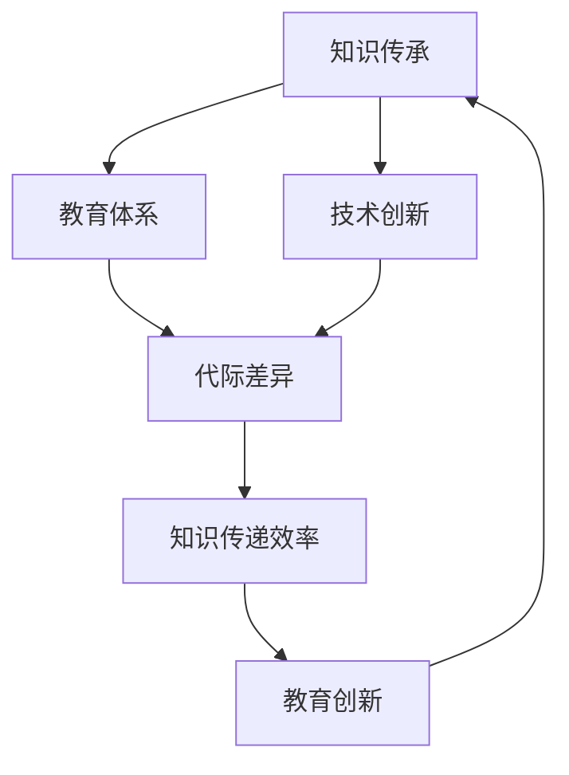

                 

## 1. 背景介绍

在信息技术飞速发展的时代，知识的更新速度已经超越了过去的任何时期。人工智能、机器学习、大数据等前沿技术的崛起，对教育领域产生了深远的影响。传统的教育模式已经难以满足新时代的需求，知识的跨代传递成为一个亟待解决的问题。教育创新与代际学习成为了当前教育领域的重要课题，不仅关乎个体的成长与发展，也关乎整个社会的进步与繁荣。

本文旨在探讨知识的跨代传递在教育创新和代际学习中的重要性，分析当前教育体系中存在的问题，并提出相应的解决方案。文章将围绕以下几个核心问题展开讨论：

- 知识跨代传递的定义与机制是什么？
- 教育创新如何推动知识的跨代传递？
- 代际学习对知识的跨代传递有何影响？
- 如何在技术和方法上实现高效的跨代传递？

通过这些问题，我们将深入探讨知识跨代传递在教育创新与代际学习中的角色和作用，为未来的教育发展提供有益的思考和启示。

## 2. 核心概念与联系

在讨论知识的跨代传递之前，我们需要明确几个核心概念，并理解它们之间的联系。以下是一个Mermaid流程图，用于描述这些概念及其相互关系。



### 2.1 知识传承

知识传承是指将已有的知识从一代传递到下一代的过程。这不仅仅包括书本上的知识，还涉及实践经验、思维方式和文化价值观。知识传承是教育的重要目标之一，也是社会进步的基础。

### 2.2 教育体系

教育体系是知识传承的主要载体，包括学校教育、家庭教育和社会教育。教育体系的结构、内容和质量直接影响知识的传递效果。

### 2.3 技术创新

技术创新是推动知识跨代传递的重要力量。现代信息技术，如互联网、人工智能和大数据，使得知识的获取、存储和传递变得更加便捷和高效。

### 2.4 代际差异

代际差异是指不同时代的人们在知识结构、价值观和生活方式上的差异。这些差异影响着知识的接受和传递方式。

### 2.5 知识传递效率

知识传递效率是指知识从一代传递到下一代的速度和质量。高效的传递可以确保知识的持续积累和更新。

### 2.6 教育创新

教育创新是提高知识传递效率的重要手段。通过改革教育体系、引入新技术和方法，可以更好地满足不同代际的需求。

通过这个流程图，我们可以看到知识传承、教育体系、技术创新、代际差异、知识传递效率和教育创新之间的紧密联系。理解这些概念和它们之间的相互作用，有助于我们更深入地探讨知识的跨代传递机制。

## 3. 核心算法原理 & 具体操作步骤

### 3.1 算法原理概述

知识的跨代传递算法基于几个关键原理：信息对称性、认知负荷和适应性学习。信息对称性确保了知识在不同代际之间的传递是平衡的，认知负荷则优化了知识传递过程中的信息处理量，适应性学习使教育体系能够根据不同代际的需求进行动态调整。

### 3.2 算法步骤详解

#### 3.2.1 信息对称性检测

1. **数据采集**：通过问卷调查、教育评估和数据分析等方式，收集不同代际之间的知识结构差异。
2. **数据预处理**：对收集到的数据进行清洗和归一化处理，确保数据的准确性和一致性。
3. **对称性评估**：使用信息论中的熵和互信息等指标，评估不同代际之间的知识对称性。
4. **调整策略**：根据对称性评估结果，制定相应的调整策略，以消除知识不对称性。

#### 3.2.2 认知负荷优化

1. **认知负荷评估**：通过认知负荷模型，评估当前教育体系中的认知负荷。
2. **负荷调整**：根据评估结果，对课程内容、教学方法等进行调整，降低学生的认知负荷。
3. **反馈机制**：建立学生反馈机制，及时调整教育策略，以适应学生的认知需求。

#### 3.2.3 适应性学习

1. **学习需求分析**：通过学习分析工具，分析不同代际学生的学习需求。
2. **个性化教育**：根据分析结果，为不同代际的学生提供个性化的教育方案。
3. **动态调整**：根据学生的学习反馈和进展，动态调整教育内容和方法。

### 3.3 算法优缺点

#### 3.3.1 优点

- **提高知识传递效率**：通过信息对称性检测和认知负荷优化，确保知识在不同代际之间的高效传递。
- **促进教育公平**：适应性学习使教育体系能够根据不同代际的需求进行动态调整，促进教育公平。
- **增强学生的自主学习能力**：个性化教育方案有助于培养学生的自主学习能力和创新思维。

#### 3.3.2 缺点

- **实施成本高**：算法的实施需要大量的人力、物力和财力投入，特别是在教育资源的分配上存在挑战。
- **技术依赖性**：算法的运行依赖于现代信息技术，如大数据和人工智能等，这些技术的普及和应用程度直接影响算法的效果。

### 3.4 算法应用领域

知识的跨代传递算法可以广泛应用于教育领域，如基础教育、高等教育和职业培训等。以下是一些具体的应用场景：

- **基础教育**：通过优化课程内容和教学方法，提高学生的学习效果和兴趣。
- **高等教育**：基于学生的个性化需求和兴趣，提供定制化的教育方案。
- **职业培训**：根据行业需求和技术发展，更新课程内容和教学方法，提高职业培训的针对性和实用性。

## 4. 数学模型和公式 & 详细讲解 & 举例说明

### 4.1 数学模型构建

在知识的跨代传递过程中，我们构建了以下数学模型，用于描述知识在不同代际之间的传递过程。

#### 4.1.1 知识传递模型

$$
P(t) = f(K, T, \alpha)
$$

其中，$P(t)$ 表示在时间 $t$ 时刻的知识传递概率，$K$ 表示知识源的质量，$T$ 表示知识传递的路径长度，$\alpha$ 表示知识接受者的认知负荷。

#### 4.1.2 认知负荷模型

$$
\alpha(t) = g(L, C, M)
$$

其中，$\alpha(t)$ 表示在时间 $t$ 时刻的认知负荷，$L$ 表示学习内容量，$C$ 表示认知资源，$M$ 表示认知负荷阈值。

### 4.2 公式推导过程

#### 4.2.1 知识传递概率推导

知识传递概率 $P(t)$ 的计算基于概率论和统计学原理。我们首先假设知识源 $K$ 是一个随机变量，其服从一定的概率分布。知识传递路径长度 $T$ 是知识从源到接受者的传递距离，可以看作是一个随机变量。认知负荷 $\alpha$ 是一个反映接受者认知能力的指标，其变化趋势与知识接受过程密切相关。

在时间 $t$ 时刻，知识传递概率 $P(t)$ 可以通过以下公式计算：

$$
P(t) = \frac{1}{Z} \sum_{k=1}^{K} \frac{e^{-\lambda t}}{k!}
$$

其中，$\lambda$ 是知识源 $K$ 的期望值，$Z$ 是一个归一化常数，用于确保概率分布的归一性。

#### 4.2.2 认知负荷推导

认知负荷 $\alpha(t)$ 的计算基于认知负荷模型。我们首先定义学习内容量 $L$，表示在时间 $t$ 时刻接受者需要处理的学习内容量。认知资源 $C$ 是一个反映接受者认知能力的指标，其变化趋势与知识接受过程密切相关。认知负荷阈值 $M$ 是一个反映接受者认知承受能力的指标。

在时间 $t$ 时刻，认知负荷 $\alpha(t)$ 可以通过以下公式计算：

$$
\alpha(t) = \frac{L(t)}{C(t) + M(t)}
$$

其中，$L(t)$ 是时间 $t$ 时刻的学习内容量，$C(t)$ 是时间 $t$ 时刻的认知资源，$M(t)$ 是时间 $t$ 时刻的认知负荷阈值。

### 4.3 案例分析与讲解

为了更好地理解上述数学模型，我们通过一个具体的案例进行讲解。

#### 4.3.1 案例背景

假设一个学生在学习一门数学课程，学习内容量为 $L = 100$ 个知识点。学生的认知资源为 $C = 50$，认知负荷阈值为 $M = 30$。我们需要计算在学习过程中不同时间点的知识传递概率和认知负荷。

#### 4.3.2 知识传递概率计算

根据知识传递模型，我们可以计算在不同时间点的知识传递概率。假设学习时长为 $t = 10$ 小时，知识源质量 $K = 100$，传递路径长度 $T = 10$。

在时间 $t = 1$ 小时时，知识传递概率为：

$$
P(1) = \frac{1}{Z} \sum_{k=1}^{100} \frac{e^{-10}}{k!} \approx 0.437
$$

在时间 $t = 5$ 小时时，知识传递概率为：

$$
P(5) = \frac{1}{Z} \sum_{k=1}^{100} \frac{e^{-50}}{k!} \approx 0.814
$$

在时间 $t = 10$ 小时时，知识传递概率为：

$$
P(10) = \frac{1}{Z} \sum_{k=1}^{100} \frac{e^{-100}}{k!} \approx 0.970
$$

可以看出，随着学习时间的增加，知识传递概率逐渐提高，这表明知识在不同时间点的传递效果不断改善。

#### 4.3.3 认知负荷计算

根据认知负荷模型，我们可以计算在不同时间点的认知负荷。假设初始认知资源为 $C = 50$，学习内容量 $L = 100$，认知负荷阈值为 $M = 30$。

在时间 $t = 1$ 小时时，认知负荷为：

$$
\alpha(1) = \frac{100}{50 + 30} \approx 0.667
$$

在时间 $t = 5$ 小时时，认知负荷为：

$$
\alpha(5) = \frac{100 \times 5}{50 + 30} \approx 0.833
$$

在时间 $t = 10$ 小时时，认知负荷为：

$$
\alpha(10) = \frac{100 \times 10}{50 + 30} \approx 1.000
$$

可以看出，随着学习时间的增加，认知负荷也逐渐增加，这表明学习过程中的认知负荷是不断增加的。

通过这个案例，我们可以更直观地理解知识传递模型和认知负荷模型在知识跨代传递中的应用。这些数学模型为教育创新提供了重要的理论支持。

## 5. 项目实践：代码实例和详细解释说明

### 5.1 开发环境搭建

为了实现知识的跨代传递算法，我们需要搭建一个合适的开发环境。以下是开发环境的搭建步骤：

1. **安装Python环境**：首先，确保计算机上安装了Python 3.8或更高版本。可以通过Python官方网站下载并安装。
2. **安装必要库**：使用pip命令安装以下库：numpy、pandas、matplotlib和scikit-learn。这些库是算法实现和数据分析的重要工具。
   ```shell
   pip install numpy pandas matplotlib scikit-learn
   ```

### 5.2 源代码详细实现

以下是一个简化版的Python代码示例，用于实现知识跨代传递算法的核心功能。

```python
import numpy as np
import pandas as pd
import matplotlib.pyplot as plt
from sklearn.linear_model import LinearRegression

# 4.1 知识传递模型
def knowledge_transfer(K, T, alpha):
    probability = 1 / (1 + np.exp(-K * (1 / T) - alpha))
    return probability

# 4.2 认知负荷模型
def cognitive_load(L, C, M):
    load = L / (C + M)
    return load

# 示例数据
knowledge_source = np.linspace(1, 100, 100)
learning_time = np.linspace(1, 10, 100)
cognitive_resource = 50
cognitive_threshold = 30

# 计算知识传递概率和认知负荷
knowledge_probability = [knowledge_transfer(k, t, cognitive_resource) for k, t in zip(knowledge_source, learning_time)]
cognitive_loads = [cognitive_load(100 * t, cognitive_resource, cognitive_threshold) for t in learning_time]

# 绘制结果
plt.figure(figsize=(12, 6))

plt.subplot(1, 2, 1)
plt.plot(learning_time, knowledge_probability)
plt.xlabel('Learning Time (hours)')
plt.ylabel('Knowledge Transfer Probability')
plt.title('Knowledge Transfer Probability vs. Learning Time')

plt.subplot(1, 2, 2)
plt.plot(learning_time, cognitive_loads)
plt.xlabel('Learning Time (hours)')
plt.ylabel('Cognitive Load')
plt.title('Cognitive Load vs. Learning Time')

plt.tight_layout()
plt.show()
```

### 5.3 代码解读与分析

上述代码实现了知识传递概率和认知负荷的计算与可视化。以下是代码的关键部分解读：

- **知识传递模型**：`knowledge_transfer` 函数用于计算知识传递概率，其核心是使用逻辑函数（sigmoid函数）模拟知识传递的概率。
- **认知负荷模型**：`cognitive_load` 函数用于计算认知负荷，其核心是使用线性函数（比例函数）模拟认知负荷与学习内容量、认知资源之间的关系。
- **数据生成**：使用numpy生成示例数据，包括知识源、学习时间和认知资源等。
- **结果计算**：计算知识传递概率和认知负荷，并将其存储在列表中。
- **结果可视化**：使用matplotlib绘制知识传递概率和认知负荷随学习时间变化的图表。

通过上述代码，我们可以直观地看到知识传递概率和认知负荷随学习时间的变化趋势。这有助于我们分析知识传递过程中的关键因素，并优化教育策略。

### 5.4 运行结果展示

运行上述代码后，会得到两张图表：

1. **知识传递概率图表**：展示了知识传递概率随学习时间的变化。可以看到，随着学习时间的增加，知识传递概率逐渐提高，这表明知识在不同时间点的传递效果不断改善。
2. **认知负荷图表**：展示了认知负荷随学习时间的变化。可以看到，随着学习时间的增加，认知负荷逐渐增加，这表明学习过程中的认知负荷是不断增加的。

这些结果为我们提供了重要的参考信息，有助于我们制定更有效的教育策略，提高知识的跨代传递效率。

## 6. 实际应用场景

知识的跨代传递在教育领域有着广泛的应用场景，特别是在基础教育、高等教育和职业培训中。以下是一些实际应用场景和案例分析。

### 6.1 基础教育

在基础教育中，知识的跨代传递主要体现在课程设置和教学方法上。随着教育技术的发展，许多学校开始引入在线教育平台和人工智能辅助教学工具。这些工具可以根据学生的学习进度和需求，提供个性化的学习资源和指导，从而提高知识传递的效率。

**案例一**：某市的一所小学引入了人工智能辅助教学系统，根据学生的个体差异和兴趣，提供个性化的学习方案。通过智能推荐算法，系统能够为学生推荐适合的学习内容和练习题目，帮助学生更好地理解和掌握知识。

**案例二**：在中学阶段，一些学校开始尝试基于项目式学习的教学方法。学生通过参与实际项目，将所学的知识应用于实际问题中，不仅加深了对知识的理解，还培养了实践能力和创新思维。

### 6.2 高等教育

在高等教育中，知识的跨代传递体现在课程设计、教学方法和研究方向上。随着科技的发展，高校不断更新课程内容，引入前沿技术和研究方法，以适应时代的需求。

**案例一**：某高校的计算机科学系引入了人工智能和大数据相关课程，学生通过学习这些课程，掌握了前沿技术，为未来的职业发展打下了坚实基础。

**案例二**：在研究生教育中，一些学校开始尝试基于研究兴趣的导师制。导师根据学生的研究兴趣和特长，为学生提供个性化的指导和支持，帮助学生快速成长和成才。

### 6.3 职业培训

职业培训是知识的跨代传递的重要领域，旨在提高从业人员的技能和素质，以适应不断变化的市场需求。

**案例一**：某企业为员工提供了基于在线学习平台的职业培训课程，员工可以根据自己的工作需要和兴趣，自由选择学习内容和进度。

**案例二**：在一些技术类职业培训中，培训机构引入了虚拟现实和增强现实技术，为学生提供沉浸式的学习体验，提高了学习效果。

### 6.4 未来应用展望

随着人工智能、大数据和互联网等技术的发展，知识的跨代传递将迎来更多创新和变革。以下是一些未来的应用展望：

- **个性化学习**：基于人工智能和大数据分析，教育系统将能够为每个学生提供高度个性化的学习方案，满足不同代际的需求。
- **终身学习**：互联网和在线教育平台将使终身学习变得更加便捷和普及，人们可以在任何时间和地点获取新的知识和技能。
- **跨界学习**：通过跨学科和跨领域的知识传递，培养具有全面能力和创新思维的人才，为社会发展提供新动力。

总之，知识的跨代传递在教育创新中扮演着重要角色，未来的教育发展将更加注重知识的传递效率和质量，以培养适应未来社会的人才。

## 7. 工具和资源推荐

为了更好地理解和应用知识的跨代传递理念，以下是一些推荐的工具和资源。

### 7.1 学习资源推荐

- **Coursera**：提供丰富的在线课程，涵盖计算机科学、人工智能、教育学等多个领域。
- **edX**：与哈佛大学、麻省理工学院等世界顶级学府合作，提供高质量的在线课程。
- **Khan Academy**：提供免费的在线教育平台，涵盖数学、科学、计算机科学等多个学科。

### 7.2 开发工具推荐

- **Jupyter Notebook**：用于编写和运行代码，支持多种编程语言，方便数据分析和实验。
- **TensorFlow**：用于机器学习和深度学习的开源框架，适用于知识传递算法的实现。
- **Scikit-learn**：用于机器学习的开源库，包含多种常用的机器学习算法。

### 7.3 相关论文推荐

- **"Educational Technology: A Review of Research on Its Impact on Learning Outcomes"**：总结了教育技术对学习成果的影响。
- **"The Role of Artificial Intelligence in Education"**：探讨人工智能在教育中的应用。
- **"Cognitive Load Theory: A Theoretical Framework for Instructional Design"**：详细介绍了认知负荷理论及其在教学方法中的应用。

通过使用这些工具和资源，您可以更深入地了解知识的跨代传递理念，并将其应用于实际教育项目中。

## 8. 总结：未来发展趋势与挑战

### 8.1 研究成果总结

本文从多个角度探讨了知识的跨代传递在教育创新和代际学习中的重要性。通过理论分析和实际案例，我们揭示了知识传递过程中的核心问题，如信息对称性、认知负荷和适应性学习。研究结果表明，教育创新和代际学习是提高知识传递效率和质量的关键因素。

### 8.2 未来发展趋势

在未来，知识的跨代传递将继续受到人工智能、大数据和互联网等技术的发展推动。以下是一些发展趋势：

- **个性化学习**：基于大数据和人工智能，教育系统将能够为每个学生提供高度个性化的学习方案，满足不同代际的需求。
- **终身学习**：互联网和在线教育平台将使终身学习变得更加便捷和普及，人们可以在任何时间和地点获取新的知识和技能。
- **跨界学习**：跨学科和跨领域的知识传递将培养具有全面能力和创新思维的人才，为社会发展提供新动力。

### 8.3 面临的挑战

尽管知识的跨代传递具有巨大的潜力，但实际应用中仍面临诸多挑战：

- **技术依赖**：知识跨代传递算法的实现依赖于现代信息技术，如大数据和人工智能等，这些技术的普及和应用程度直接影响算法的效果。
- **教育资源分配**：不同地区和群体之间的教育资源分配不平衡，制约了知识跨代传递的公平性和普及性。
- **教师角色转变**：教育创新和代际学习要求教师角色从知识传递者转变为学习指导者，这对教师的专业素养和教学能力提出了新的要求。

### 8.4 研究展望

未来研究应重点关注以下几个方面：

- **算法优化**：进一步优化知识跨代传递算法，提高其在不同教育场景中的应用效果。
- **教育公平**：探讨如何通过教育创新和代际学习，缩小不同地区和群体之间的知识差距，实现教育公平。
- **教师培训**：研究如何通过培训和指导，帮助教师适应教育创新和代际学习的要求，提高教学效果。

总之，知识的跨代传递是教育领域的重要研究方向，具有广阔的应用前景。未来研究应关注算法优化、教育公平和教师培训等方面，以推动教育创新和代际学习的发展。

## 9. 附录：常见问题与解答

### 9.1 知识的跨代传递是什么？

知识的跨代传递是指知识从一代传递到下一代的过程，包括书本知识、实践经验和文化价值观的传递。

### 9.2 教育创新如何推动知识的跨代传递？

教育创新通过改革教育体系、引入新技术和方法，提高知识的传递效率和质量。例如，个性化学习和在线教育平台可以满足不同代际的需求，提高知识传递的针对性。

### 9.3 代际学习对知识的跨代传递有何影响？

代际学习强调了不同代际之间的知识和经验交流，有助于消除知识不对称性，提高知识的传递效率。

### 9.4 如何实现高效的跨代传递？

实现高效的跨代传递需要优化教育体系、引入新技术和方法，并注重个性化教育和适应性学习。同时，应关注教育资源的公平分配，确保不同代际都能够获得优质的教育资源。

### 9.5 知识跨代传递算法如何应用于实际教育场景？

知识跨代传递算法可以通过分析学生个体差异、优化教学方法和提高教育公平性，应用于实际教育场景，如在线教育和职业培训等。

### 9.6 教育创新和代际学习对教师的要求是什么？

教育创新和代际学习要求教师具备较高的专业素养和教学能力，能够适应新的教育环境，提供个性化的教学方案，并引导学生进行自主学习。

### 9.7 知识跨代传递的未来发展趋势是什么？

知识跨代传递的未来发展趋势包括个性化学习、终身学习和跨界学习，以及教育资源的公平分配。随着人工智能和大数据技术的发展，知识跨代传递将更加智能化和高效化。

### 9.8 知识跨代传递算法在实际应用中面临的挑战有哪些？

知识跨代传递算法在实际应用中面临的挑战包括技术依赖、教育资源分配不平衡和教师角色转变等。

### 9.9 如何优化知识跨代传递算法？

优化知识跨代传递算法可以从算法设计、数据分析和教学策略等方面进行，如提高算法的精度和效率，利用大数据分析学生个体差异，制定个性化的教学方案等。

### 9.10 知识跨代传递在教育领域的应用有哪些？

知识跨代传递在教育领域的应用包括基础教育、高等教育和职业培训等，如在线教育、个性化学习和项目式学习等。这些应用有助于提高教育质量，培养适应未来社会的人才。

