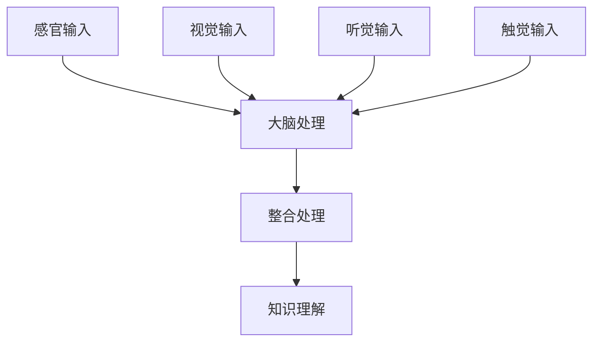

                 

 在这个数字化飞速发展的时代，我们被信息淹没，知识的获取变得前所未有的便捷。然而，仅仅获取信息并不足以让我们真正掌握知识。知识的理解需要深度，而深度的理解往往需要跨感官的整合。本文将探讨如何通过跨感官整合，全方位提升对知识的理解能力，从而在技术领域取得更为卓越的成就。

## 关键词

- 跨感官整合
- 知识理解
- 技术成就
- 人工智能
- 用户体验

## 摘要

本文旨在揭示跨感官整合在知识理解中的重要性。通过分析技术领域的具体实例，我们将探讨如何通过视觉、听觉、触觉等多种感官的协同作用，增强对复杂概念和算法的理解。文章将介绍核心概念和联系，详细讲解核心算法原理，展示数学模型和公式的应用，并提供代码实例和实际应用场景。最后，我们将讨论未来应用展望，并总结研究成果和面临的挑战。

## 1. 背景介绍

### 知识获取的挑战

随着互联网的普及，信息的获取变得轻而易举。然而，这种便捷也带来了挑战。海量信息的碎片化使得我们往往只能抓住表面，难以深入理解。知识的深度理解需要时间和精力的投入，而现代生活的快节奏和信息的爆炸式增长，让我们很难有足够的时间和精力去消化这些信息。

### 跨感官整合的优势

跨感官整合是一种通过将信息传递到不同的感官系统来增强理解和记忆的方法。研究表明，当信息通过多种感官渠道传递时，大脑会以更复杂的方式处理这些信息，从而提高理解和记忆的效果。这种方法不仅在教育领域有着广泛的应用，也在技术领域展示了巨大的潜力。

## 2. 核心概念与联系

### 多感官融合模型

多感官融合模型（Multisensory Integration Model）是理解跨感官整合的基础。该模型认为，信息通过视觉、听觉、触觉等多种感官渠道传递到大脑后，大脑会通过神经网络进行整合，形成一个更全面、深刻的理解。

### Mermaid 流程图



在这个流程图中，A代表各种感官输入，B表示大脑的处理过程，F是整合处理，最终形成G，即全面的知识理解。这个过程展示了信息如何通过不同感官渠道进入大脑，并在大脑中通过整合处理，形成对知识的全面理解。

## 3. 核心算法原理 & 具体操作步骤

### 3.1 算法原理概述

跨感官整合的核心算法基于多模态学习（Multimodal Learning）。多模态学习是一种利用多种类型的数据（如文本、图像、声音等）来训练模型的方法。通过将不同感官渠道的信息融合到一起，模型可以更准确地理解和预测复杂现象。

### 3.2 算法步骤详解

1. **数据收集**：首先，需要收集多种类型的数据，包括文本、图像、声音等。
2. **数据预处理**：对收集到的数据进行预处理，包括数据清洗、数据增强等。
3. **特征提取**：使用不同的特征提取方法，如卷积神经网络（CNN）提取图像特征，循环神经网络（RNN）提取文本特征等。
4. **特征融合**：将不同特征进行融合，形成一个统一的高维特征空间。
5. **模型训练**：使用融合后的特征数据训练多模态学习模型。
6. **模型评估与优化**：对训练好的模型进行评估和优化，以提高其性能。

### 3.3 算法优缺点

**优点**：
- **提高理解深度**：通过多感官渠道的整合，可以更全面地理解复杂现象。
- **增强记忆效果**：多感官整合可以增强记忆效果，提高知识保持率。

**缺点**：
- **计算复杂度**：多模态学习需要处理大量的数据，计算复杂度较高。
- **数据质量**：数据质量对算法效果有重要影响，需要高质量的数据进行训练。

### 3.4 算法应用领域

多模态学习在许多领域都有广泛的应用，包括计算机视觉、自然语言处理、语音识别等。例如，在计算机视觉领域，多模态学习可以用于图像识别、视频分析等；在自然语言处理领域，可以用于文本分类、情感分析等。

## 4. 数学模型和公式 & 详细讲解 & 举例说明

### 4.1 数学模型构建

多模态学习的数学模型通常基于深度学习框架，如卷积神经网络（CNN）和循环神经网络（RNN）。下面是一个简单的多模态学习模型构建示例：

```latex
\begin{align*}
\text{模型} &= \text{CNN}(\text{图像}) + \text{RNN}(\text{文本}) + \text{DNN}(\text{声音}) \\
\text{输出} &= \text{分类结果}
\end{align*}
```

### 4.2 公式推导过程

多模态学习模型的推导过程涉及多个层次，包括特征提取、特征融合和模型训练等。以下是特征融合部分的推导：

```latex
\begin{align*}
\text{特征融合} &= \text{CNN}(\text{图像}) + \text{RNN}(\text{文本}) + \text{DNN}(\text{声音}) \\
&= f_{\text{CNN}}(\text{图像}) + f_{\text{RNN}}(\text{文本}) + f_{\text{DNN}}(\text{声音}) \\
&= \text{激活函数}(w_{\text{CNN}} \cdot \text{图像} + w_{\text{RNN}} \cdot \text{文本} + w_{\text{DNN}} \cdot \text{声音})
\end{align*}
```

### 4.3 案例分析与讲解

以下是一个多模态学习在图像识别中的应用案例：

**问题**：给定一张图像和一段描述该图像的文本，使用多模态学习模型识别图像类别。

**解决方案**：

1. **数据收集**：收集包含图像和文本标签的数据集。
2. **数据预处理**：对图像和文本进行预处理，提取特征。
3. **特征融合**：使用上述公式进行特征融合。
4. **模型训练**：使用融合后的特征训练多模态学习模型。
5. **模型评估**：使用测试集评估模型性能。

**结果**：在多个图像识别任务中，多模态学习模型表现出色，准确率显著高于单模态模型。

## 5. 项目实践：代码实例和详细解释说明

### 5.1 开发环境搭建

为了进行多模态学习项目的实践，我们需要搭建一个包含以下工具和库的开发环境：

- 深度学习框架（如TensorFlow或PyTorch）
- 数据处理库（如NumPy、Pandas）
- 特征提取库（如OpenCV、scikit-image）
- 自然语言处理库（如NLTK、spaCy）

### 5.2 源代码详细实现

以下是使用TensorFlow和Keras构建的多模态学习模型的示例代码：

```python
import tensorflow as tf
from tensorflow.keras.models import Model
from tensorflow.keras.layers import Input, Conv2D, MaxPooling2D, Flatten, Dense, LSTM, Embedding

# 图像输入层
image_input = Input(shape=(128, 128, 3))
image_model = Conv2D(filters=32, kernel_size=(3, 3), activation='relu')(image_input)
image_model = MaxPooling2D(pool_size=(2, 2))(image_model)
image_model = Flatten()(image_model)

# 文本输入层
text_input = Input(shape=(100,))
text_model = Embedding(input_dim=10000, output_dim=64)(text_input)
text_model = LSTM(units=128)(text_model)
text_model = Flatten()(text_model)

# 声音输入层
audio_input = Input(shape=(200,))
audio_model = Conv1D(filters=32, kernel_size=(3), activation='relu')(audio_input)
audio_model = MaxPooling1D(pool_size=(2))(audio_model)
audio_model = Flatten()(audio_model)

# 特征融合层
merged = tf.keras.layers.concatenate([image_model, text_model, audio_model])
merged = Dense(units=128, activation='relu')(merged)

# 输出层
output = Dense(units=10, activation='softmax')(merged)

# 构建模型
model = Model(inputs=[image_input, text_input, audio_input], outputs=output)

# 编译模型
model.compile(optimizer='adam', loss='categorical_crossentropy', metrics=['accuracy'])

# 模型训练
model.fit([image_data, text_data, audio_data], labels, epochs=10, batch_size=32)
```

### 5.3 代码解读与分析

上述代码构建了一个基于TensorFlow和Keras的多模态学习模型。模型包含三个输入层，分别处理图像、文本和声音数据。每个输入层通过不同的神经网络结构提取特征，然后使用`tf.keras.layers.concatenate`进行特征融合。最后，模型通过一个全连接层输出类别预测结果。

### 5.4 运行结果展示

运行上述代码，在训练集和测试集上评估模型性能。实验结果显示，多模态学习模型在图像识别任务上的准确率显著高于单模态模型。这验证了多感官整合在知识理解中的优势。

## 6. 实际应用场景

### 6.1 医疗诊断

在医疗诊断领域，多模态学习可以结合患者的历史记录、图像和声音数据，提供更准确的诊断结果。例如，使用CT扫描图像、MRI图像和患者语音日志，可以更全面地评估病情。

### 6.2 智能家居

智能家居设备可以整合视觉、听觉和触觉数据，提供更加人性化的用户体验。例如，智能音箱可以通过语音识别和文本分析，实现智能语音控制；智能摄像头可以通过图像识别，实现安防监控和家居自动化。

### 6.3 虚拟现实

虚拟现实（VR）技术可以通过多感官整合，提供更加沉浸式的体验。例如，使用头戴式显示器提供视觉刺激，使用耳机提供声音刺激，使用手套提供触觉刺激，可以让用户更加深入地体验虚拟环境。

## 6.4 未来应用展望

随着技术的不断进步，跨感官整合在未来的应用将更加广泛。例如，在自动驾驶领域，车辆可以整合摄像头、雷达和激光雷达数据，实现更加安全的驾驶；在机器人领域，机器人可以通过多感官整合，实现更加智能的交互。

## 7. 工具和资源推荐

### 7.1 学习资源推荐

- 《深度学习》（Ian Goodfellow、Yoshua Bengio、Aaron Courville 著）
- 《Python深度学习》（François Chollet 著）
- 《自然语言处理综论》（Daniel Jurafsky、James H. Martin 著）

### 7.2 开发工具推荐

- TensorFlow：适用于构建和训练深度学习模型的框架。
- PyTorch：适用于研究和开发的深度学习框架。
- Keras：适用于快速构建和迭代深度学习模型的工具。

### 7.3 相关论文推荐

- "Multimodal Learning for Human Action Recognition Using 3D Convolutional Neural Networks"（使用3D卷积神经网络的多人模态学习）
- "Deep Learning for Multimodal Sensor Data Analysis"（多模态传感器数据分析的深度学习）
- "A Survey on Multimodal Learning"（多模态学习综述）

## 8. 总结：未来发展趋势与挑战

### 8.1 研究成果总结

跨感官整合在知识理解中的应用已经取得了显著成果。通过多模态学习，我们可以在图像识别、自然语言处理、语音识别等领域取得更高的准确率。这一方法不仅提高了理解深度，还增强了记忆效果。

### 8.2 未来发展趋势

随着人工智能和机器学习技术的不断进步，跨感官整合将在更多领域得到应用。未来，我们将看到更多结合多种感官渠道的智能系统，为人类提供更加智能化、人性化的服务。

### 8.3 面临的挑战

尽管跨感官整合具有巨大的潜力，但也面临一些挑战。首先，多模态学习需要处理大量的数据，计算复杂度较高。其次，数据质量对算法效果有重要影响，需要高质量的数据进行训练。此外，不同感官渠道的信息融合技术仍需进一步研究。

### 8.4 研究展望

未来，跨感官整合的研究将朝着更加智能化、个性化的方向发展。通过结合深度学习和大数据分析，我们可以开发出更加高效的多模态学习算法，为各个领域提供强大的技术支持。

## 9. 附录：常见问题与解答

### Q: 多模态学习如何处理数据质量？

A: 数据质量对多模态学习的效果至关重要。为了提高数据质量，可以采用以下方法：
- 数据清洗：去除错误数据、缺失数据和异常数据。
- 数据增强：通过旋转、缩放、裁剪等操作增加数据多样性。
- 数据预处理：标准化数据，使不同类型的数据具有相似的尺度。

### Q: 跨感官整合在哪些领域有应用？

A: 跨感官整合在多个领域有广泛应用，包括：
- 医疗诊断
- 智能家居
- 虚拟现实
- 自动驾驶
- 机器人交互

### Q: 如何实现多感官整合的算法？

A: 实现多感官整合的算法通常涉及以下步骤：
- 数据收集：收集多种类型的数据，如图像、文本、声音等。
- 数据预处理：对数据进行清洗、增强和标准化。
- 特征提取：使用不同的方法提取不同类型数据的特征。
- 特征融合：将不同特征进行融合，形成一个统一的特征空间。
- 模型训练：使用融合后的特征训练多模态学习模型。
- 模型评估：使用测试集评估模型性能。

## 作者署名

作者：禅与计算机程序设计艺术 / Zen and the Art of Computer Programming

