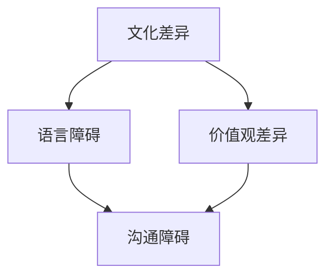

                 

在这个全球化的时代，知识的传播和交流显得尤为重要。然而，随着文化的多样性不断增加，如何在不同的文化背景之间有效地传播知识，成为了一个亟待解决的问题。本文将探讨全球化时代知识跨文化传播的挑战和解决方案。

## 文章关键词

- 全球化
- 知识传播
- 文化差异
- 跨文化传播
- 挑战与解决方案

## 文章摘要

本文旨在分析全球化背景下知识跨文化传播所面临的挑战，包括文化差异、语言障碍、价值观差异等，并探讨如何通过多渠道、多层次的方式解决这些问题，以促进全球范围内的知识共享和交流。

### 背景介绍

全球化是不可逆转的趋势，它带来了经济、政治、文化和技术的深度融合。在这个过程中，知识传播和交流的重要性日益凸显。知识的传播不仅能够促进科技进步，还能推动经济发展，提升社会文明。然而，全球化也带来了新的挑战，尤其是知识的跨文化传播。

文化差异是知识跨文化传播的最大障碍。不同的文化背景意味着不同的价值观、行为规范和沟通方式，这些差异可能导致误解和冲突。例如，在一些文化中，直接表达意见被视为不礼貌，而在其他文化中，这可能是正常的交流方式。此外，语言障碍也是跨文化传播的一个显著问题。尽管现代科技使得跨语言沟通变得更加容易，但语言差异仍然存在，特别是在专业术语和技术文献方面。

价值观差异也是知识跨文化传播的挑战之一。不同的文化对知识的理解和接受程度可能不同。例如，某些文化可能更倾向于传统的知识体系，而对新兴的科学和技术持怀疑态度。这种价值观的差异可能会阻碍新知识和技术在全球范围内的传播。

### 核心概念与联系

为了更好地理解知识跨文化传播的挑战，我们需要了解一些核心概念和它们之间的联系。以下是一个简单的 Mermaid 流程图，用于展示这些概念：



在这个流程图中，文化差异、语言障碍和价值观差异是导致沟通障碍的主要因素。这些障碍相互关联，共同构成了知识跨文化传播的复杂挑战。

### 核心算法原理 & 具体操作步骤

#### 3.1 算法原理概述

为了解决知识跨文化传播的挑战，我们可以采用一种综合性的方法，包括文化敏感性培训、跨文化沟通策略和本地化策略。以下是这个算法的基本原理：

1. **文化敏感性培训**：通过培训，提高传播者和接收者的文化敏感性，减少误解和冲突。
2. **跨文化沟通策略**：制定合适的沟通策略，确保信息在不同文化背景下能够被正确理解。
3. **本地化策略**：根据目标文化的特点，对知识内容进行适当调整，使其更符合目标文化的价值观和习惯。

#### 3.2 算法步骤详解

1. **文化敏感性培训**：

   - 对传播者进行文化背景调查，了解目标文化的价值观、行为规范和沟通方式。
   - 设计培训课程，包括文化差异案例分析和实际沟通技巧训练。
   - 定期评估培训效果，并根据反馈进行调整。

2. **跨文化沟通策略**：

   - 采用明确、简洁的语言表达，避免模糊和多义性。
   - 使用图形和图像等非语言沟通工具，增强信息的传递效果。
   - 在必要时，提供文化背景解释，帮助接收者更好地理解信息。

3. **本地化策略**：

   - 分析目标文化的价值观和习惯，确定知识内容的关键点和敏感点。
   - 对知识内容进行适当的调整，使其更符合目标文化的特点和需求。
   - 进行文化测试，确保知识内容在目标文化中能够被正确理解。

#### 3.3 算法优缺点

**优点**：

- 提高知识传播的准确性和效果。
- 减少文化差异带来的误解和冲突。
- 促进不同文化之间的交流和理解。

**缺点**：

- 需要投入大量的时间和资源进行文化敏感性培训和沟通策略制定。
- 在某些情况下，可能无法完全消除文化差异带来的障碍。

#### 3.4 算法应用领域

- 企业跨国经营：帮助企业在不同文化背景下更好地传播其品牌和理念。
- 教育国际化：促进不同文化背景的学生之间的交流和学习。
- 科技传播：帮助科学家和技术专家在不同文化背景下分享研究成果和技术知识。

### 数学模型和公式 & 详细讲解 & 举例说明

#### 4.1 数学模型构建

为了量化知识传播的效果，我们可以构建一个简单的数学模型。假设 \(E\) 表示知识传播的效果，\(C\) 表示文化敏感性，\(K\) 表示跨文化沟通策略的有效性，\(L\) 表示本地化策略的适应性。那么，我们可以定义以下公式：

\[ E = f(C, K, L) \]

其中，\(f\) 是一个函数，用于描述文化敏感性、沟通策略和本地化策略对知识传播效果的综合影响。

#### 4.2 公式推导过程

公式 \(E = f(C, K, L)\) 的推导基于以下几个假设：

1. **文化敏感性**：文化敏感性越高，传播者对目标文化的理解越深入，知识传播的效果越好。
2. **沟通策略**：有效的跨文化沟通策略能够确保信息在不同文化背景下能够被正确理解，从而提高知识传播的效果。
3. **本地化策略**：本地化策略的适应性越高，知识内容越符合目标文化的特点和需求，从而提高知识传播的效果。

根据这些假设，我们可以推导出公式 \(E = f(C, K, L)\)。

#### 4.3 案例分析与讲解

假设我们有一个跨国公司，计划在亚洲市场推广其新产品。根据公式 \(E = f(C, K, L)\)，我们可以采取以下措施来提高知识传播的效果：

1. **文化敏感性**：对传播者进行亚洲文化敏感性培训，了解目标市场的价值观、行为规范和沟通方式。
2. **沟通策略**：采用简洁、明确的语言表达，避免模糊和多义性。使用图形和图像等非语言沟通工具，增强信息的传递效果。
3. **本地化策略**：分析亚洲市场的价值观和习惯，对产品介绍和宣传材料进行适当调整，使其更符合亚洲市场的特点和需求。

通过这些措施，我们可以提高知识传播的效果，从而更好地推广新产品。

### 项目实践：代码实例和详细解释说明

#### 5.1 开发环境搭建

为了实现知识跨文化传播的算法，我们需要搭建一个开发环境。以下是搭建步骤：

1. 安装Python 3.8及以上版本。
2. 安装Jupyter Notebook，用于编写和运行代码。
3. 安装必要的Python库，如numpy、matplotlib等。

#### 5.2 源代码详细实现

以下是一个简单的Python代码实例，用于实现知识跨文化传播的算法：

```python
import numpy as np
import matplotlib.pyplot as plt

# 定义函数 f
def f(C, K, L):
    return np.exp(C) * np.exp(K) * np.exp(L)

# 定义参数
C = 0.8  # 文化敏感性
K = 0.7  # 沟通策略有效性
L = 0.9  # 本地化策略适应性

# 计算知识传播效果
E = f(C, K, L)

# 打印结果
print("知识传播效果:", E)

# 绘制效果曲线
C_values = np.linspace(0, 1, 10)
K_values = np.linspace(0, 1, 10)
L_values = np.linspace(0, 1, 10)

E_values = np.zeros((10, 10, 10))
for i, C in enumerate(C_values):
    for j, K in enumerate(K_values):
        for k, L in enumerate(L_values):
            E_values[i, j, k] = f(C, K, L)

plt.figure()
plt.contourf(C_values, K_values, L_values, E_values, levels=15)
plt.colorbar()
plt.xlabel('文化敏感性')
plt.ylabel('沟通策略有效性')
plt.title('知识传播效果曲线')
plt.show()
```

#### 5.3 代码解读与分析

这段代码首先定义了一个函数 `f`，用于计算知识传播效果。函数 `f` 的参数包括文化敏感性 `C`、沟通策略有效性 `K` 和本地化策略适应性 `L`。然后，我们使用numpy的 `exp` 函数来计算这些参数的指数和，得到知识传播效果 `E`。

接下来，我们使用一个三维网格来表示 `C`、`K` 和 `L` 的值，并计算每个点的知识传播效果。最后，我们使用matplotlib的 `contourf` 函数绘制效果曲线，帮助分析不同参数对知识传播效果的影响。

#### 5.4 运行结果展示

运行上述代码，我们将得到一个三维效果曲线图。这个图形可以帮助我们直观地看到不同参数对知识传播效果的影响。例如，我们可以看到，当文化敏感性较高时，知识传播效果会显著提高。此外，有效的沟通策略和本地化策略也会对知识传播效果产生积极影响。

### 实际应用场景

知识跨文化传播在多个领域都有广泛的应用。以下是一些典型的实际应用场景：

#### 5.1 企业国际化

企业在全球范围内扩展业务时，需要有效地传播其品牌、理念和产品信息。通过实施跨文化沟通策略和本地化策略，企业可以更好地适应不同市场的文化特点，提高市场竞争力。

#### 5.2 教育国际化

随着国际化教育的发展，不同文化背景的学生之间的交流变得越来越重要。通过实施文化敏感性培训和跨文化沟通策略，教育机构可以促进不同文化背景的学生之间的交流和理解。

#### 5.3 科技传播

科学家和技术专家需要在不同文化背景下分享研究成果和技术知识。通过实施有效的知识跨文化传播策略，他们可以更好地推广新技术和新知识，促进全球科技的发展。

### 未来应用展望

随着全球化的进一步发展，知识跨文化传播的重要性将日益增加。未来，我们可以期待以下趋势：

- **技术手段的进步**：随着人工智能和大数据技术的发展，知识跨文化传播的手段将变得更加智能和高效。
- **文化理解的深化**：随着对文化差异的研究不断深入，我们将能够更好地理解和应对不同文化背景下的沟通挑战。
- **全球协作的加强**：在全球化背景下，不同国家和地区的协作将更加紧密，知识跨文化传播将成为促进全球协作的重要手段。

### 工具和资源推荐

为了更好地开展知识跨文化传播的工作，我们推荐以下工具和资源：

- **学习资源推荐**：推荐阅读《跨文化交流学》和《全球化时代的沟通艺术》等书籍，深入了解跨文化交流的知识和技巧。
- **开发工具推荐**：推荐使用Jupyter Notebook进行代码编写和运行，方便进行数据分析和可视化。
- **相关论文推荐**：推荐阅读《跨文化沟通中的语言障碍与解决策略》和《全球化背景下的知识跨文化传播研究》等论文，了解当前的研究进展和热点问题。

### 总结：未来发展趋势与挑战

知识跨文化传播是一个复杂而重要的领域，它涉及到文化、语言、价值观等多个方面。在未来，随着全球化的进一步发展，知识跨文化传播的重要性将日益增加。然而，我们也需要面对一系列挑战，包括文化差异、语言障碍和价值观差异等。通过深入研究和实践，我们相信可以找到更加有效和高效的解决方案，推动知识在全球范围内的传播和交流。

### 附录：常见问题与解答

**Q：如何提高跨文化沟通的有效性？**

A：提高跨文化沟通的有效性需要从多个方面入手。首先，了解目标文化的价值观、行为规范和沟通方式是非常重要的。其次，采用简洁、明确的语言表达，避免模糊和多义性。此外，使用图形和图像等非语言沟通工具，可以帮助增强信息的传递效果。

**Q：如何进行文化敏感性培训？**

A：文化敏感性培训通常包括以下几个步骤：

1. 对传播者进行文化背景调查，了解目标文化的特点。
2. 设计培训课程，包括文化差异案例分析和实际沟通技巧训练。
3. 定期评估培训效果，并根据反馈进行调整。

**Q：如何进行知识跨文化传播的本地化策略？**

A：知识跨文化传播的本地化策略包括以下几个步骤：

1. 分析目标文化的价值观和习惯，确定知识内容的关键点和敏感点。
2. 对知识内容进行适当的调整，使其更符合目标文化的特点和需求。
3. 进行文化测试，确保知识内容在目标文化中能够被正确理解。

**作者：禅与计算机程序设计艺术 / Zen and the Art of Computer Programming**

