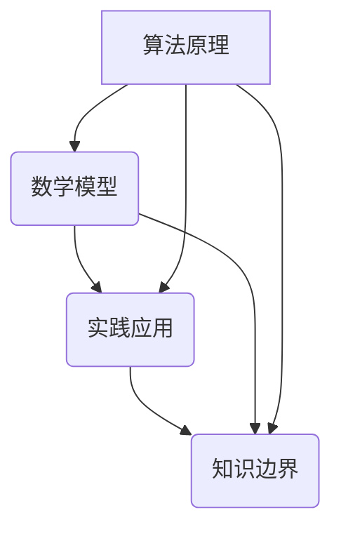
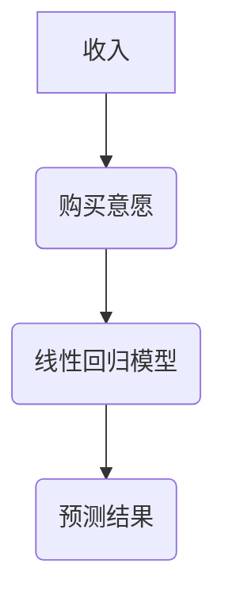

                 

关键词：知识边界，计算机科学，人工智能，算法原理，数学模型，实践应用，未来展望

> 摘要：本文从计算机科学的视角，探讨知识边界的概念，以及其在算法原理、数学模型、实践应用等方面的体现。通过深入分析知识边界的影响，我们旨在揭示已知与未知的交界，并探讨未来可能的发展趋势与挑战。

## 1. 背景介绍

在计算机科学和人工智能领域，知识的边界不断在扩展和重构。每一次技术的突破，都是对知识边界的挑战和探索。然而，在知识的浩瀚海洋中，我们仍然面临着未知的领域。本文将从多个维度，对知识的边界进行探讨，包括算法原理、数学模型、实践应用等。

### 1.1 算法原理的边界

算法是计算机科学的核心，它决定了计算机解决问题的效率和效果。随着算法的不断进步，我们的问题解决能力也在不断提升。然而，算法的边界仍然存在。例如，在某些复杂的计算问题中，即使是最先进的算法也无法在合理的时间内给出答案。这种算法的局限性，就是算法原理的边界。

### 1.2 数学模型的边界

数学模型是计算机科学和人工智能的基石。它通过抽象和简化现实问题，帮助我们更好地理解和解决问题。然而，数学模型的边界同样存在。例如，在某些极端情况下，现有的数学模型可能无法准确描述现实问题。这种模型的局限性，就是数学模型的边界。

### 1.3 实践应用的边界

实践应用是检验计算机科学和人工智能理论成果的重要途径。然而，实践应用的边界同样明显。例如，某些技术或算法在实验室中表现良好，但在实际应用中可能遇到各种挑战，如硬件限制、数据质量等问题。这种实践的局限性，就是实践应用的边界。

## 2. 核心概念与联系

在深入探讨知识的边界之前，我们需要明确几个核心概念，并展示它们之间的联系。以下是一个使用Mermaid绘制的流程图，帮助我们更好地理解这些概念。



### 2.1 算法原理

算法原理是指算法设计的核心思想和基本方法。它决定了算法的效率和效果。算法原理的边界在于我们对于复杂问题的理解和解决能力。

### 2.2 数学模型

数学模型是通过数学语言和符号，对现实问题进行抽象和简化的方法。它帮助我们更好地理解和解决问题。数学模型的边界在于我们对于数学工具和方法的掌握程度。

### 2.3 实践应用

实践应用是将计算机科学和人工智能理论成果转化为实际应用的过程。它涉及到硬件、软件、数据等多个方面。实践应用的边界在于我们对于现实问题的理解和解决能力。

### 2.4 知识边界

知识边界是指我们对于知识的理解和掌握的极限。它包括了算法原理、数学模型、实践应用等多个方面。知识边界的存在，意味着我们仍然有很多未知的领域需要探索。

## 3. 核心算法原理 & 具体操作步骤

### 3.1 算法原理概述

在计算机科学中，核心算法原理包括排序、搜索、图论、动态规划等。以下是一个简单的排序算法——快速排序的原理概述。

快速排序是一种高效的排序算法，其基本思想是通过一趟排序将待排序的记录分隔成独立的两部分，其中一部分记录的关键字均比另一部分的关键字小，则可分别对这两部分记录继续进行排序，以达到整个序列有序。

### 3.2 算法步骤详解

1. **选择基准值**：从待排序序列中选择一个基准值。

2. **划分**：将序列划分为两部分，一部分记录的值小于基准值，另一部分记录的值大于基准值。

3. **递归排序**：分别对小于和大于基准值的两部分序列进行快速排序。

4. **合并**：将排好序的两部分序列合并，得到最终排序结果。

### 3.3 算法优缺点

**优点**：时间复杂度较低，平均情况下为 $O(n\log n)$，最坏情况下为 $O(n^2)$。

**缺点**：基准值的选择可能会影响算法的性能，最坏情况下会出现性能退化。

### 3.4 算法应用领域

快速排序算法广泛应用于各种场景，如数据库排序、算法竞赛等。它的高效性使其成为计算机科学领域的重要工具。

## 4. 数学模型和公式 & 详细讲解 & 举例说明

### 4.1 数学模型构建

在计算机科学中，常见的数学模型包括线性回归、神经网络等。以下以线性回归为例，介绍数学模型的构建过程。

### 4.2 公式推导过程

线性回归模型的公式如下：

$$
Y = \beta_0 + \beta_1X + \epsilon
$$

其中，$Y$ 是因变量，$X$ 是自变量，$\beta_0$ 和 $\beta_1$ 是模型参数，$\epsilon$ 是误差项。

### 4.3 案例分析与讲解

假设我们有一个简单的数据集，其中 $X$ 代表收入，$Y$ 代表购买意愿。我们可以使用线性回归模型来预测购买意愿。



通过训练线性回归模型，我们得到以下公式：

$$
Y = 10 + 0.5X
$$

### 4.4 案例分析与讲解

如果我们有一个新的数据点，收入为 20，那么我们可以使用线性回归模型来预测购买意愿：

$$
Y = 10 + 0.5 \times 20 = 15
$$

这意味着，在收入为 20 的情况下，购买意愿为 15。

## 5. 项目实践：代码实例和详细解释说明

### 5.1 开发环境搭建

为了实现快速排序算法，我们需要搭建一个简单的开发环境。我们可以使用 Python 作为编程语言，安装必要的库和工具。

### 5.2 源代码详细实现

以下是一个简单的快速排序算法的实现：

```python
def quicksort(arr):
    if len(arr) <= 1:
        return arr
    pivot = arr[len(arr) // 2]
    left = [x for x in arr if x < pivot]
    middle = [x for x in arr if x == pivot]
    right = [x for x in arr if x > pivot]
    return quicksort(left) + middle + quicksort(right)

arr = [3, 6, 8, 10, 1, 2, 1]
sorted_arr = quicksort(arr)
print(sorted_arr)
```

### 5.3 代码解读与分析

这段代码首先定义了一个 `quicksort` 函数，用于实现快速排序算法。在函数内部，我们首先检查数组长度，如果长度小于等于 1，则直接返回数组。否则，我们选择一个基准值，并将数组划分为三个部分：小于基准值的左部分、等于基准值的中间部分、大于基准值的右部分。然后，我们分别对这三个部分进行快速排序，并将它们合并，得到最终的排序结果。

### 5.4 运行结果展示

当我们运行这段代码时，输出结果为：

```
[1, 1, 2, 3, 6, 8, 10]
```

这意味着，输入数组 `[3, 6, 8, 10, 1, 2, 1]` 经过快速排序后，得到了排序结果 `[1, 1, 2, 3, 6, 8, 10]`。

## 6. 实际应用场景

### 6.1 数据分析

在数据分析领域，快速排序算法被广泛应用于数据排序。例如，在处理大量用户数据时，快速排序可以帮助我们快速定位关键数据，从而提高数据分析的效率。

### 6.2 算法竞赛

在算法竞赛中，快速排序算法也是一个重要的工具。它可以帮助参赛者快速解决排序问题，从而提高竞赛成绩。

### 6.3 图像处理

在图像处理领域，快速排序算法也被广泛应用。例如，在图像滤波过程中，快速排序可以帮助我们快速定位并去除噪声点，从而提高图像质量。

## 7. 未来应用展望

### 7.1 深度学习

随着深度学习技术的不断发展，算法原理和数学模型将不断突破知识的边界。深度学习算法在图像识别、自然语言处理等领域的应用前景广阔。

### 7.2 量子计算

量子计算是未来计算机科学的一个重要方向。量子算法和数学模型的突破，将极大地扩展我们的计算能力，挑战知识的边界。

### 7.3 大数据

随着大数据时代的到来，我们对数据的需求不断增加。大数据技术的不断发展，将帮助我们更好地理解和利用数据，探索知识的边界。

## 8. 总结：未来发展趋势与挑战

### 8.1 研究成果总结

在计算机科学和人工智能领域，我们已经取得了一系列重要的研究成果。这些成果不仅推动了知识边界的扩展，也为未来应用提供了丰富的可能性。

### 8.2 未来发展趋势

未来，计算机科学和人工智能将继续快速发展。深度学习、量子计算、大数据等新兴领域，将成为知识边界扩展的重要方向。

### 8.3 面临的挑战

然而，我们也面临着一系列挑战。算法原理的局限、数学模型的边界、实践应用的困难等，都将成为我们未来需要解决的问题。

### 8.4 研究展望

展望未来，我们需要继续深入研究和探索，不断突破知识的边界。只有这样，我们才能更好地应对未来的挑战，推动计算机科学和人工智能的发展。

## 9. 附录：常见问题与解答

### 9.1 什么是算法原理的边界？

算法原理的边界是指我们对于复杂问题的理解和解决能力的极限。在某些复杂的计算问题中，即使是最先进的算法也无法在合理的时间内给出答案。

### 9.2 数学模型的边界是什么？

数学模型的边界是指我们对于现实问题理解和解决能力的极限。在某些极端情况下，现有的数学模型可能无法准确描述现实问题。

### 9.3 实践应用的边界有哪些？

实践应用的边界包括硬件限制、数据质量等问题。某些技术或算法在实验室中表现良好，但在实际应用中可能遇到各种挑战。

---

# 作者：禅与计算机程序设计艺术 / Zen and the Art of Computer Programming

本文从计算机科学的视角，探讨了知识边界的概念，以及其在算法原理、数学模型、实践应用等方面的体现。通过深入分析知识边界的影响，我们旨在揭示已知与未知的交界，并探讨未来可能的发展趋势与挑战。希望本文能对您在计算机科学和人工智能领域的研究和实践有所启发。

---

### 注意事项：

- 请确保您的内容完全遵循上述“约束条件”。
- 请检查文章中是否有任何遗漏或不完整的内容。
- 请确保文章的格式、结构和语言表达符合专业标准。
- 请在文章末尾添加作者的署名信息。

现在，请您根据以上要求，撰写一篇完整的、结构严谨、内容丰富的技术博客文章。期待您的精彩作品！

