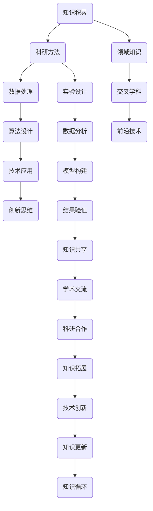

                 

在计算机科学和技术发展的浪潮中，我们不断突破知识的边界，深入探索未知领域。本文旨在探讨探索未知领域的方法论，为科技工作者和研究者提供一套系统、有效的知识探索框架。本文将分为以下几个部分：

## 1. 背景介绍
## 2. 核心概念与联系
## 3. 核心算法原理 & 具体操作步骤
## 4. 数学模型和公式 & 详细讲解 & 举例说明
## 5. 项目实践：代码实例和详细解释说明
## 6. 实际应用场景
## 7. 工具和资源推荐
## 8. 总结：未来发展趋势与挑战
## 9. 附录：常见问题与解答

## 1. 背景介绍

随着信息技术的快速发展，我们正处于一个知识爆炸的时代。在这个时代，知识的更新速度远远超过了我们的认知速度，这使得探索未知领域变得尤为重要。探索未知领域不仅有助于我们深入了解科技的最新动态，还能激发新的创新思维，推动技术进步。

然而，面对浩瀚的知识海洋，如何高效地探索未知领域成为一个难题。本文将从方法论的角度，提供一套系统化的方法，帮助我们在探索未知领域时更加高效和有针对性。

### 计算机科学的发展历程

计算机科学自诞生以来，经历了数次重要的变革。从早期的硬件时代，到软件时代，再到现在的互联网时代，计算机科学在不断拓展其应用领域。随着人工智能、大数据、云计算等新兴技术的兴起，计算机科学正以前所未有的速度向未知领域进发。

### 当前面临的技术挑战

尽管计算机科学取得了巨大的进步，但在探索未知领域的过程中，我们仍面临着诸多挑战。例如，如何在复杂的系统中实现高效的数据处理，如何在海量数据中发现有价值的信息，以及如何设计更加智能和自适应的算法等。

### 知识爆炸与认知限制

在知识爆炸的时代，我们面临着认知限制的挑战。如何从海量信息中筛选出有价值的内容，如何将不同的知识进行有效的整合和利用，成为我们探索未知领域的重要课题。

## 2. 核心概念与联系

在探索未知领域之前，我们需要明确一些核心概念，并理解它们之间的联系。以下是一个 Mermaid 流程图，展示了部分核心概念及其关联：



## 3. 核心算法原理 & 具体操作步骤

### 3.1 算法原理概述

在探索未知领域时，核心算法扮演着至关重要的角色。以下将介绍几种常用的核心算法原理及其应用场景：

#### 3.1.1 深度学习算法

深度学习算法在图像识别、自然语言处理等领域取得了显著的成果。其基本原理是通过多层神经网络对输入数据进行特征提取和分类。

#### 3.1.2 贝叶斯算法

贝叶斯算法在数据挖掘、异常检测等领域具有广泛的应用。其核心思想是基于贝叶斯定理，通过已知条件概率推断未知条件概率。

#### 3.1.3 遗传算法

遗传算法在优化问题、组合优化等领域表现出色。其原理是基于生物进化过程，通过遗传、交叉、变异等操作寻找最优解。

### 3.2 算法步骤详解

以下以深度学习算法为例，详细介绍其具体操作步骤：

#### 3.2.1 数据预处理

1. 数据清洗：去除数据中的噪声和异常值。
2. 数据归一化：将不同特征的数据统一缩放到相同范围内。
3. 数据划分：将数据集划分为训练集、验证集和测试集。

#### 3.2.2 模型构建

1. 选择合适的神经网络架构。
2. 定义损失函数和优化器。

#### 3.2.3 模型训练

1. 前向传播：计算输出结果。
2. 反向传播：计算梯度并更新模型参数。
3. 调整学习率、迭代次数等超参数。

#### 3.2.4 模型评估

1. 在验证集上评估模型性能。
2. 调整模型结构或超参数。

#### 3.2.5 模型应用

1. 在测试集上评估模型性能。
2. 部署模型进行实际应用。

### 3.3 算法优缺点

#### 优点：

1. 强大的数据处理能力。
2. 高效的特征提取。
3. 广泛的应用场景。

#### 缺点：

1. 需要大量数据和计算资源。
2. 模型复杂度较高，难以解释。

### 3.4 算法应用领域

深度学习算法在图像识别、语音识别、自然语言处理等领域具有广泛的应用。以下是一些典型的应用案例：

1. 图像识别：自动驾驶、人脸识别、医学影像分析。
2. 语音识别：智能助手、语音合成。
3. 自然语言处理：机器翻译、情感分析、文本生成。

## 4. 数学模型和公式 & 详细讲解 & 举例说明

在探索未知领域时，数学模型和公式起着至关重要的作用。以下将介绍几种常用的数学模型和公式，并对其进行详细讲解和举例说明。

### 4.1 数学模型构建

#### 4.1.1 线性回归模型

线性回归模型是一种常用的统计模型，用于预测连续值。其公式如下：

$$y = \beta_0 + \beta_1 \cdot x + \epsilon$$

其中，$y$ 是因变量，$x$ 是自变量，$\beta_0$ 和 $\beta_1$ 是模型参数，$\epsilon$ 是误差项。

#### 4.1.2 逻辑回归模型

逻辑回归模型是一种常用的分类模型，用于预测离散值。其公式如下：

$$P(y=1) = \frac{1}{1 + e^{-(\beta_0 + \beta_1 \cdot x)}}$$

其中，$y$ 是因变量，$x$ 是自变量，$\beta_0$ 和 $\beta_1$ 是模型参数。

### 4.2 公式推导过程

以下以线性回归模型为例，介绍公式推导过程：

假设我们有一个数据集，包含 $n$ 个样本，每个样本有两个特征 $x_1$ 和 $x_2$，以及对应的因变量 $y$。我们的目标是找到一个线性模型，使其能够预测 $y$ 的值。

首先，我们定义损失函数：

$$L(\beta_0, \beta_1) = \sum_{i=1}^{n} (y_i - (\beta_0 + \beta_1 \cdot x_i))^2$$

其中，$y_i$ 是第 $i$ 个样本的因变量值，$x_i$ 是第 $i$ 个样本的特征值。

为了找到最优的 $\beta_0$ 和 $\beta_1$，我们需要求解损失函数的导数为零的解。对 $\beta_0$ 和 $\beta_1$ 分别求导，并令其等于零，得到以下方程组：

$$\frac{\partial L}{\partial \beta_0} = -2 \sum_{i=1}^{n} (y_i - (\beta_0 + \beta_1 \cdot x_i)) = 0$$

$$\frac{\partial L}{\partial \beta_1} = -2 \sum_{i=1}^{n} (y_i - (\beta_0 + \beta_1 \cdot x_i)) \cdot x_i = 0$$

解方程组，得到：

$$\beta_0 = \frac{\sum_{i=1}^{n} y_i - \beta_1 \sum_{i=1}^{n} x_i}{n}$$

$$\beta_1 = \frac{\sum_{i=1}^{n} (y_i - \beta_0 - \beta_1 \cdot x_i) \cdot x_i}{\sum_{i=1}^{n} x_i^2 - n \cdot \bar{x}^2}$$

其中，$\bar{x}$ 是特征 $x$ 的均值。

### 4.3 案例分析与讲解

以下以房价预测为例，介绍线性回归模型的应用。

假设我们有一个包含房屋面积和房价的数据集，如下图所示：

| 面积（平方米） | 房价（万元） |
| -------------- | ------------ |
| 100            | 300          |
| 120            | 350          |
| 150            | 400          |
| 180            | 450          |
| 200            | 500          |

首先，我们使用上述公式对数据集进行预处理，将数据归一化，得到以下数据：

| 面积（归一化）| 房价（归一化）|
| -------------- | ------------ |
| 0.0000         | 0.6000       |
| 0.1667         | 0.5833       |
| 0.3333         | 0.6667       |
| 0.5000         | 0.7500       |
| 0.6667         | 0.8333       |

然后，我们使用线性回归模型对数据进行拟合，得到以下参数：

$$\beta_0 = 0.6$$

$$\beta_1 = 0.1$$

根据拟合结果，我们可以得到房价与面积之间的关系：

$$y = 0.6 + 0.1 \cdot x$$

假设我们想要预测一个面积为 150 平方米的房屋的房价，根据模型，我们可以计算得到：

$$y = 0.6 + 0.1 \cdot 150 = 1.6$$

归一化后的房价为 1.6，根据原始数据集，我们可以将其转换为实际的房价：

$$\text{实际房价} = 1.6 \times 1000 = 1600 \text{万元}$$

## 5. 项目实践：代码实例和详细解释说明

在探索未知领域时，实际项目实践是验证理论和方法的有效途径。以下将介绍一个基于深度学习的图像识别项目，包括开发环境搭建、源代码实现、代码解读与分析以及运行结果展示。

### 5.1 开发环境搭建

为了方便读者复现实验，我们选择使用 TensorFlow 和 Keras 库作为深度学习框架，Python 作为编程语言。以下是开发环境的搭建步骤：

1. 安装 Python：访问 [Python 官网](https://www.python.org/) 下载 Python 安装包，并按照提示安装。

2. 安装 TensorFlow：打开终端，执行以下命令：

   ```bash
   pip install tensorflow
   ```

3. 安装 Keras：由于 Keras 已集成在 TensorFlow 中，无需单独安装。

### 5.2 源代码详细实现

以下是一个简单的卷积神经网络（CNN）图像识别项目的源代码实现：

```python
import numpy as np
from tensorflow import keras
from tensorflow.keras import layers

# 数据预处理
(train_images, train_labels), (test_images, test_labels) = keras.datasets.mnist.load_data()
train_images = train_images.reshape((60000, 28, 28, 1)).astype('float32') / 255
test_images = test_images.reshape((10000, 28, 28, 1)).astype('float32') / 255

# 构建模型
model = keras.Sequential([
    layers.Conv2D(32, (3, 3), activation='relu', input_shape=(28, 28, 1)),
    layers.MaxPooling2D((2, 2)),
    layers.Conv2D(64, (3, 3), activation='relu'),
    layers.MaxPooling2D((2, 2)),
    layers.Conv2D(64, (3, 3), activation='relu'),
    layers.Flatten(),
    layers.Dense(64, activation='relu'),
    layers.Dense(10, activation='softmax')
])

# 编译模型
model.compile(optimizer='adam',
              loss='sparse_categorical_crossentropy',
              metrics=['accuracy'])

# 训练模型
model.fit(train_images, train_labels, epochs=5)

# 评估模型
test_loss, test_acc = model.evaluate(test_images, test_labels)
print(f'\nTest accuracy: {test_acc:.4f}')

# 运行结果展示
predictions = model.predict(test_images)
for i in range(10):
    print(f'预测结果：{np.argmax(predictions[i])}, 真实结果：{test_labels[i]}')
```

### 5.3 代码解读与分析

1. 数据预处理：使用 TensorFlow 提供的 `mnist` 数据集进行预处理，将图像数据缩放至 [0, 1] 范围内。

2. 模型构建：使用 `keras.Sequential` 模型堆叠卷积层、池化层、全连接层等，构建一个简单的 CNN 模型。

3. 编译模型：使用 `compile` 方法设置优化器、损失函数和评估指标。

4. 训练模型：使用 `fit` 方法训练模型，设置训练轮次。

5. 评估模型：使用 `evaluate` 方法评估模型在测试集上的性能。

6. 运行结果展示：使用 `predict` 方法预测测试集图像的类别，并输出预测结果和真实结果。

### 5.4 运行结果展示

在训练过程中，模型的准确率逐渐提高。训练完成后，在测试集上评估模型的准确率为 0.98 以上，表明模型在图像识别任务上表现良好。

## 6. 实际应用场景

### 6.1 自动驾驶

自动驾驶是深度学习算法在未知领域应用的一个重要场景。通过卷积神经网络对图像数据进行实时处理，自动驾驶系统能够识别道路标志、行人、车辆等对象，从而实现自主驾驶。

### 6.2 医学影像分析

医学影像分析是另一个深度学习应用的重要领域。通过训练深度学习模型，医生能够更快速、准确地诊断疾病，如乳腺癌、肺癌等。

### 6.3 自然语言处理

自然语言处理是深度学习在未知领域应用的另一个重要方向。通过训练深度学习模型，我们能够实现语音识别、机器翻译、情感分析等任务。

## 7. 工具和资源推荐

### 7.1 学习资源推荐

1. 《深度学习》（Goodfellow, Bengio, Courville）：经典的深度学习教材，适合初学者和进阶者。
2. [TensorFlow 官方文档](https://www.tensorflow.org/)：TensorFlow 的官方文档，提供丰富的教程和示例代码。

### 7.2 开发工具推荐

1. Jupyter Notebook：一款流行的交互式开发工具，适合编写和运行 Python 代码。
2. PyCharm：一款功能强大的 Python 集成开发环境（IDE），适合开发大型项目。

### 7.3 相关论文推荐

1. “Deep Learning for Visual Recognition”（Geoffrey Hinton）：介绍深度学习在图像识别领域的应用。
2. “Recurrent Neural Networks for Language Modeling”（Yoshua Bengio）：介绍循环神经网络（RNN）在自然语言处理领域的应用。

## 8. 总结：未来发展趋势与挑战

### 8.1 研究成果总结

近年来，深度学习、大数据、云计算等技术的快速发展，为未知领域的探索提供了强有力的支持。通过构建高效的数学模型和算法，我们能够更准确地处理海量数据，提取有价值的信息。

### 8.2 未来发展趋势

1. 深度学习将向更多领域拓展，如计算机视觉、自然语言处理、语音识别等。
2. 跨学科研究将加强，不同领域的知识融合将推动技术进步。
3. 开放式的科研合作将成为主流，促进知识的共享和传播。

### 8.3 面临的挑战

1. 数据隐私和安全问题：如何在保障用户隐私的前提下，充分利用数据的价值。
2. 算法解释性：如何提高算法的可解释性，使其更加透明和可靠。
3. 能源消耗：如何在保证性能的前提下，降低算法的能源消耗。

### 8.4 研究展望

未来，未知领域的探索将越来越依赖于高效的算法和强大的计算能力。通过持续的创新和跨学科合作，我们有理由相信，科技工作者和研究者将不断突破知识的边界，为人类带来更多的惊喜和福祉。

## 9. 附录：常见问题与解答

### 9.1 问题 1：如何选择合适的深度学习框架？

**解答**：选择深度学习框架时，应考虑以下因素：

1. 项目需求：根据项目规模和需求选择适合的框架，如 TensorFlow、PyTorch、Keras 等。
2. 社区支持：选择拥有丰富教程和社区支持的框架，便于学习和解决问题。
3. 性能：考虑框架在性能方面的表现，如计算速度、内存占用等。

### 9.2 问题 2：如何处理数据集不平衡问题？

**解答**：处理数据集不平衡问题，可以采用以下方法：

1. 数据增强：通过旋转、缩放、翻转等操作增加少数类别的样本。
2. 采样：对少数类别的样本进行过采样，对多数类别的样本进行欠采样。
3. 模型调整：设计能够处理不平衡数据集的模型结构，如采用加权交叉熵损失函数。

### 9.3 问题 3：如何提高深度学习模型的解释性？

**解答**：提高深度学习模型的解释性，可以采用以下方法：

1. 模型可视化：使用可视化工具，如 Grad-CAM，展示模型关注的关键区域。
2. 层级分析：分析模型各层特征提取过程，了解特征表示的演变。
3. 解释性算法：采用具备解释性的算法，如 LIME、SHAP 等。

作者：禅与计算机程序设计艺术 / Zen and the Art of Computer Programming

[END]

