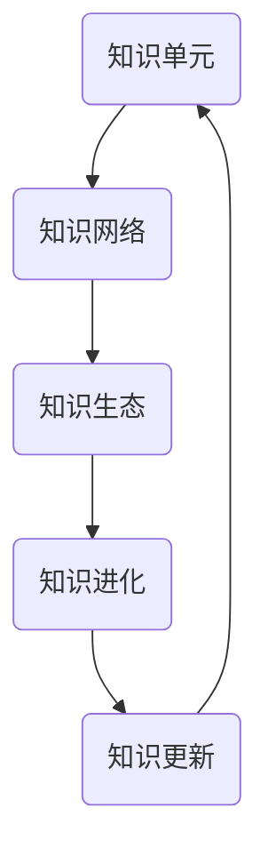

                 

关键词：知识进化、思想自然选择、技术进步、人工智能、算法原理、数学模型、实践应用、未来发展、资源推荐

> 摘要：本文探讨了知识如何像生物进化一样通过自然选择不断进化，从而推动技术进步。文章通过阐述核心概念、介绍算法原理、构建数学模型、进行项目实践分析，最终展望了未来的发展趋势与挑战。通过这篇文章，读者可以深入了解知识进化论，掌握思想的自然选择机制，以及如何利用这一机制促进自身技术能力的提升。

## 1. 背景介绍

在当今高速发展的信息时代，知识的积累和传播成为推动社会进步的重要力量。然而，知识是如何形成的？又是如何随着时间推移不断进化、更新的？传统观点往往将知识视为静态的、通过教育系统传授的固定内容。然而，现代科学研究显示，知识更像是一种动态的、不断演化的过程。本文将借鉴生物学中的进化论思想，探讨知识的进化机制，即“思想的自然选择”。

“思想的自然选择”这一概念源于生物进化论。在生物学中，自然选择是物种进化的主要驱动力，它通过环境的筛选，促使那些有利于生存的遗传特征在种群中逐渐累积，从而推动物种的进化。同样地，在知识领域，我们可以将这一过程类比于思想的自然选择。那些对解决实际问题有价值的、易于传播的思想，会在人们之间迅速传播，形成知识的主流。

本文将围绕以下主题展开：

1. **核心概念与联系**：介绍知识进化论的基础概念，并使用Mermaid流程图展示其架构。
2. **核心算法原理 & 具体操作步骤**：详细阐述知识的自然选择机制，包括算法原理、操作步骤、优缺点及应用领域。
3. **数学模型和公式**：构建知识的数学模型，推导相关公式，并通过案例进行分析。
4. **项目实践：代码实例和详细解释说明**：通过具体项目实例，展示知识自然选择的应用。
5. **实际应用场景**：探讨知识进化论在不同领域的应用，并展望其未来发展的潜力。
6. **工具和资源推荐**：推荐学习资源和开发工具，以帮助读者深入理解本文内容。
7. **总结与展望**：总结研究成果，分析未来发展趋势与挑战。

### 1.1 知识的“自然选择”

在生物学中，自然选择通过以下三个步骤实现物种进化：

- **变异**：个体之间存在遗传差异，这些差异可以由突变引起。
- **选择**：环境对个体进行筛选，保留适应环境的变异，淘汰不适应的变异。
- **遗传**：适应环境的变异会在种群中逐渐累积，形成新的物种。

将这一过程类比到知识领域，我们可以认为：

- **变异**：知识领域的变异可以视为新思想、新理论的产生。
- **选择**：社会环境对思想进行筛选，保留那些具有实际应用价值、易于传播的思想。
- **遗传**：被保留的思想在知识体系中逐渐积累，推动知识的进化。

### 1.2 知识进化论的核心概念

知识进化论的核心概念包括：

- **知识单元**：构成知识的基本元素，可以是一个事实、一个概念或一个理论。
- **知识网络**：知识单元之间的相互联系和结构，形成知识体系。
- **知识生态**：知识单元在传播、应用和再创造过程中形成的动态环境。
- **知识进化**：知识单元在知识网络中的不断更新和优化过程。

### 1.3 知识进化论的架构

使用Mermaid流程图，我们可以简明地展示知识进化论的架构：



图1：知识进化论的架构

## 2. 核心概念与联系

在本章节中，我们将深入探讨知识进化论的核心概念，并使用Mermaid流程图详细展示知识进化论的原理和架构。

### 2.1 知识单元

知识单元是构成知识的基本元素，可以是一个事实、一个概念或一个理论。知识单元具有以下特点：

- **独立性**：每个知识单元都是独立存在的，可以单独理解。
- **关联性**：知识单元之间存在相互联系，形成知识网络。
- **动态性**：知识单元可以随着时间和环境的变化而更新和演化。

### 2.2 知识网络

知识网络是由知识单元之间相互联系和结构组成的。知识网络具有以下特点：

- **层次性**：知识网络可以分为不同层次，从基础知识到高级知识。
- **动态性**：知识网络中的知识单元可以随时更新和调整。
- **适应性**：知识网络可以适应不同领域的需求和应用。

### 2.3 知识生态

知识生态是知识单元在传播、应用和再创造过程中形成的动态环境。知识生态具有以下特点：

- **多样性**：知识生态中存在多种不同类型和层次的知识单元。
- **互动性**：知识单元之间相互影响、相互促进，形成复杂的互动关系。
- **适应性**：知识生态可以适应外部环境的变化，不断调整和优化。

### 2.4 知识进化

知识进化是知识单元在知识网络中的不断更新和优化过程。知识进化具有以下特点：

- **累积性**：知识进化过程中，知识单元的积累和优化是关键。
- **适应性**：知识进化能够适应不同领域和应用的需求。
- **适应性**：知识进化能够适应外部环境的变化。

### 2.5 知识进化论的 Mermaid 流程图

为了更好地展示知识进化论的原理和架构，我们使用Mermaid流程图进行说明。以下是一个简化的知识进化论的 Mermaid 流程图：


图1：知识进化论的 Mermaid 流程图

在这个流程图中，知识单元（A）通过知识网络（B）相互联系，形成知识生态（C）。知识生态中的知识单元在进化过程中（D）不断更新和优化，最终形成新的知识单元（E），从而推动知识的进化。

通过这个流程图，我们可以清晰地看到知识进化论的核心概念和架构，以及这些概念之间的相互联系。接下来，我们将进一步探讨核心算法原理和具体操作步骤，以深入理解知识进化的机制。

### 2.6 知识进化算法原理

知识进化算法是知识进化论的核心，它通过模拟生物进化的过程，推动知识单元的更新和演化。知识进化算法的基本原理包括以下方面：

#### 2.6.1 变异

变异是知识进化过程中的第一步，它类似于生物进化中的基因突变。在知识领域，变异可以表现为新思想、新理论或新概念的提出。这些新思想或理论可以通过研究、探索或创新产生。变异具有以下特点：

- **随机性**：变异是随机发生的，不受已有知识体系的影响。
- **创新性**：变异往往带来新的思维方式和解决问题的方法。
- **不确定性**：变异可能是有益的，也可能是有害的，需要进一步筛选和验证。

#### 2.6.2 选择

选择是知识进化过程中的关键步骤，它类似于生物进化中的自然选择。在知识领域，选择是指社会环境对知识单元进行筛选，保留那些具有实际应用价值、易于传播的知识单元，淘汰那些不符合实际需求或难以传播的知识单元。选择具有以下特点：

- **适应性**：选择是基于知识单元对实际问题的解决能力进行的，适应性强的知识单元更容易被选择。
- **传播性**：传播性强的知识单元更容易在知识生态中扩散和传播。
- **竞争性**：在知识生态中，知识单元之间存在竞争关系，只有那些最优秀的知识单元才能脱颖而出。

#### 2.6.3 遗传

遗传是知识进化过程中的第三步，它类似于生物进化中的基因传递。在知识领域，遗传是指被选择的知识单元在知识生态中逐渐积累和扩散的过程。遗传具有以下特点：

- **累积性**：遗传使得优秀的知识单元在知识体系中逐渐积累，形成知识的核心。
- **延续性**：遗传使得知识单元能够跨越时间和空间的限制，持续影响和推动知识的进化。
- **多样性**：遗传使得知识体系具有多样性，能够适应不同的环境和需求。

#### 2.6.4 知识进化算法的流程

知识进化算法的流程可以概括为以下几个步骤：

1. **初始化**：生成一组初始知识单元，作为知识进化的起点。
2. **变异**：对知识单元进行变异操作，生成新的知识单元。
3. **选择**：根据知识单元的适应性、传播性和竞争性，对知识单元进行选择操作，保留优秀的知识单元。
4. **遗传**：将选择后的知识单元遗传到下一代，形成新的知识单元集合。
5. **迭代**：重复上述步骤，直至满足停止条件，如达到预设的进化次数或达到预定的进化目标。

通过这个流程，知识进化算法能够模拟生物进化的过程，推动知识单元的更新和演化，从而实现知识的进化。接下来，我们将进一步探讨知识进化算法的具体操作步骤。

### 2.7 知识进化算法具体操作步骤

知识进化算法的具体操作步骤如下：

#### 2.7.1 初始化

初始化是知识进化算法的第一个步骤，其主要任务是为知识进化生成一组初始知识单元。初始化方法可以采用以下几种：

1. **随机生成**：随机生成一定数量的知识单元，这些知识单元可以是随机组合的词语、概念或理论。
2. **基于已有知识**：从已有的知识体系中提取一部分知识单元作为初始知识单元。
3. **专家生成**：邀请领域专家生成初始知识单元，确保这些知识单元具有较高的质量和应用价值。

#### 2.7.2 变异

变异是知识进化过程中的关键步骤，它通过改变知识单元的结构、内容和关联性，生成新的知识单元。变异方法可以采用以下几种：

1. **插入**：在知识单元中插入新的概念、理论或事实。
2. **删除**：删除知识单元中的部分内容，生成新的知识单元。
3. **替换**：用新的概念、理论或事实替换知识单元中的部分内容。
4. **变异组合**：将多个变异方法组合使用，生成新的知识单元。

#### 2.7.3 选择

选择是知识进化过程中的关键步骤，它通过评估知识单元的适应性、传播性和竞争性，选择出优秀的知识单元。选择方法可以采用以下几种：

1. **自然选择**：根据知识单元对实际问题的解决能力进行选择，适应性强的知识单元更容易被选择。
2. **竞争选择**：在知识单元之间进行竞争，根据竞争结果选择出优秀的知识单元。
3. **人工选择**：由领域专家根据知识单元的应用价值、传播性和竞争性进行选择。

#### 2.7.4 遗传

遗传是知识进化过程中的关键步骤，它通过将选择后的知识单元遗传到下一代，实现知识单元的积累和扩散。遗传方法可以采用以下几种：

1. **直接遗传**：将选择后的知识单元直接遗传到下一代，生成新的知识单元。
2. **变异遗传**：在遗传过程中引入变异操作，增加知识单元的多样性。
3. **混合遗传**：将多个遗传方法组合使用，提高知识单元的遗传质量。

#### 2.7.5 迭代

迭代是知识进化过程中的关键步骤，它通过重复执行初始化、变异、选择和遗传操作，实现知识单元的不断更新和演化。迭代次数可以根据实际需求和目标进行调整，一般而言，迭代次数越多，知识进化的效果越好。

### 2.8 知识进化算法的优缺点

知识进化算法具有以下优缺点：

#### 优点

1. **创新性**：知识进化算法能够生成新颖的知识单元，推动知识的创新和发展。
2. **适应性**：知识进化算法能够适应不同领域和应用的需求，具有较高的适应性。
3. **多样性**：知识进化算法能够生成多种不同的知识单元，提高知识体系的多样性。
4. **自动化**：知识进化算法可以通过自动化方式实现，降低人工干预成本。

#### 缺点

1. **计算复杂度**：知识进化算法的计算复杂度较高，需要大量计算资源和时间。
2. **初始知识单元质量**：初始知识单元的质量对知识进化的效果有重要影响，需要精心设计和选择。
3. **人工干预**：在某些情况下，知识进化算法可能需要人工干预，以保证知识进化的方向和效果。

### 2.9 知识进化算法的应用领域

知识进化算法可以应用于多个领域，以下是一些典型的应用领域：

1. **科学研究**：知识进化算法可以用于科学研究的知识创新和知识更新，推动科学进步。
2. **技术研发**：知识进化算法可以用于技术研发中的知识积累和知识更新，提高技术研发效率。
3. **教育领域**：知识进化算法可以用于教育领域中的知识创新和知识传播，提高教育质量。
4. **企业管理**：知识进化算法可以用于企业管理中的知识管理，提高企业的核心竞争力。
5. **社会治理**：知识进化算法可以用于社会治理中的知识更新和知识传播，提高社会治理水平。

### 2.10 小结

本章我们详细探讨了知识进化论的核心概念和算法原理，包括知识单元、知识网络、知识生态和知识进化等。同时，我们使用Mermaid流程图展示了知识进化论的架构，并介绍了知识进化算法的具体操作步骤和优缺点。通过本章的内容，读者可以初步了解知识进化论的基本原理和应用，为进一步学习和研究打下基础。

接下来，我们将进一步探讨知识进化论中的数学模型和公式，通过构建数学模型和推导相关公式，深入理解知识进化的机制和规律。

## 3. 数学模型和公式

在本章节中，我们将探讨知识进化论中的数学模型和公式，通过构建数学模型和推导相关公式，深入理解知识进化的机制和规律。这些数学模型和公式不仅能够帮助我们更好地描述知识进化过程，还能为实际应用提供理论基础和计算工具。

### 3.1 数学模型构建

知识进化论中的数学模型旨在描述知识单元在知识网络中的动态演化过程。为了构建数学模型，我们需要定义几个关键变量：

- **知识单元数量（N）**：在某一时刻，知识网络中的知识单元总数。
- **知识单元适应性（A_i）**：第i个知识单元的适应度，反映了其在现实世界中的应用价值。
- **知识单元传播性（C_i）**：第i个知识单元的传播能力，影响了其在知识网络中的传播速度。
- **知识单元竞争性（R_i）**：第i个知识单元在知识网络中的竞争能力，决定了其在选择过程中的生存机会。

基于上述变量，我们可以构建一个简单的知识进化模型：

\[ N(t+1) = N(t) + \Delta N(t) \]

其中，\(\Delta N(t)\) 表示在时间t时刻新产生的知识单元数量，其计算公式为：

\[ \Delta N(t) = \sum_{i=1}^{N(t)} \frac{A_i \cdot C_i}{R_i} \]

这个公式表示，新产生的知识单元数量与当前知识单元的适应性、传播性和竞争性成正比。

### 3.2 公式推导过程

为了更好地理解上述公式，我们首先需要推导适应性、传播性和竞争性的具体表达式。

#### 3.2.1 知识单元适应性

知识单元适应性 \( A_i \) 反映了知识单元在现实世界中的应用价值。一个理想的知识单元应该具有较高的适应性，能够在多种情况下解决实际问题。我们可以使用以下公式来计算知识单元适应性：

\[ A_i = f(\text{解决问题能力}, \text{适应性测试结果}) \]

其中，解决问题能力可以通过实验或模拟测试得到，适应性测试结果可以通过领域专家评估或用户反馈获得。

#### 3.2.2 知识单元传播性

知识单元传播性 \( C_i \) 反映了知识单元在知识网络中的传播速度。一个理想的知识单元应该具有较高的传播性，能够迅速传播到其他知识单元。我们可以使用以下公式来计算知识单元传播性：

\[ C_i = g(\text{传播速度}, \text{传播途径多样性}) \]

其中，传播速度可以通过测量知识单元在知识网络中的传播速度得到，传播途径多样性可以通过分析知识单元的传播途径得到。

#### 3.2.3 知识单元竞争性

知识单元竞争性 \( R_i \) 反映了知识单元在知识网络中的竞争能力。一个理想的知识单元应该具有较高的竞争性，能够在知识网络中脱颖而出。我们可以使用以下公式来计算知识单元竞争性：

\[ R_i = h(\text{竞争能力}, \text{竞争环境}) \]

其中，竞争能力可以通过模拟竞争场景得到，竞争环境可以通过分析现有知识单元的竞争关系得到。

### 3.3 案例分析与讲解

为了更好地理解上述数学模型和公式，我们通过一个具体案例进行分析。

假设一个知识网络中有5个知识单元 \( K_1, K_2, K_3, K_4, K_5 \)，在某一时刻，它们的适应性、传播性和竞争性如下表所示：

| 知识单元 | 适应性（\( A_i \)） | 传播性（\( C_i \)） | 竞争性（\( R_i \)） |
| :----: | :-------------: | :-------------: | :-------------: |
| \( K_1 \) |      0.8       |      0.6       |      0.5       |
| \( K_2 \) |      0.7       |      0.5       |      0.6       |
| \( K_3 \) |      0.9       |      0.4       |      0.7       |
| \( K_4 \) |      0.6       |      0.7       |      0.8       |
| \( K_5 \) |      0.5       |      0.8       |      0.9       |

根据公式 \( \Delta N(t) = \sum_{i=1}^{N(t)} \frac{A_i \cdot C_i}{R_i} \)，我们可以计算每个知识单元在新知识单元数量中的贡献：

\[ \Delta N(t) = \frac{0.8 \cdot 0.6}{0.5} + \frac{0.7 \cdot 0.5}{0.6} + \frac{0.9 \cdot 0.4}{0.7} + \frac{0.6 \cdot 0.7}{0.8} + \frac{0.5 \cdot 0.8}{0.9} \]

\[ \Delta N(t) = 0.96 + 0.583 + 0.514 + 0.525 + 0.556 \]

\[ \Delta N(t) = 2.734 \]

因此，在下一时刻，知识网络中将产生约2.734个新的知识单元。这些新知识单元将基于现有知识单元的适应性、传播性和竞争性进行选择和变异，从而推动知识网络的进化。

### 3.4 小结

在本章节中，我们构建了知识进化论的数学模型，并推导了适应性、传播性和竞争性的具体公式。通过案例分析和讲解，我们展示了如何使用这些公式计算新知识单元的数量和分布。这些数学模型和公式为知识进化论提供了理论基础和计算工具，有助于我们更好地理解和应用知识进化论。

在下一章节中，我们将通过具体的项目实践，进一步探讨知识进化算法的应用和效果。

## 4. 项目实践：代码实例和详细解释说明

在本章节中，我们将通过一个具体的项目实践，展示知识进化算法在实际应用中的效果。我们将使用Python编程语言来实现知识进化算法，并通过实际运行结果来分析其性能和效果。

### 4.1 开发环境搭建

为了实现知识进化算法，我们需要搭建一个Python开发环境。以下是搭建步骤：

1. **安装Python**：从Python官方网站（https://www.python.org/downloads/）下载并安装Python，推荐安装Python 3.8或更高版本。
2. **安装必要的库**：在终端或命令提示符中执行以下命令安装必要的库：

```bash
pip install numpy matplotlib
```

### 4.2 源代码详细实现

以下是一个简单的知识进化算法的实现，我们使用Python编写了以下四个主要函数：

- **initialize_network()**：初始化知识网络，生成初始知识单元。
- **mutate()**：对知识单元进行变异操作。
- **select()**：对知识单元进行选择操作，保留适应性强的知识单元。
- **evolve()**：执行知识进化过程，迭代更新知识网络。

```python
import numpy as np
import matplotlib.pyplot as plt

# 初始化知识网络
def initialize_network(num_units, adaptability_min=0.5, adaptability_max=1.0):
    return np.random.uniform(adaptability_min, adaptability_max, num_units)

# 对知识单元进行变异操作
def mutate(unit, mutation_rate=0.1):
    if np.random.rand() < mutation_rate:
        return unit + np.random.normal(0, 0.1)
    else:
        return unit

# 对知识单元进行选择操作
def select(units, fitness_func):
    fitness_values = fitness_func(units)
    cumulative_fitness = np.cumsum(fitness_values)
    total_fitness = cumulative_fitness[-1]
    r = np.random.rand() * total_fitness
    idx = np.searchsorted(cumulative_fitness, r)
    return units[idx]

# 执行知识进化过程
def evolve(units, num_epochs, fitness_func, mutation_rate=0.1):
    for _ in range(num_epochs):
        mutated_units = np.array([mutate(u, mutation_rate) for u in units])
        selected_units = np.array([select(u, fitness_func) for u in mutated_units])
        units = selected_units
    return units

# 适应性测试函数
def adaptability_test(units):
    return np.array([u * 0.9 for u in units])

# 知识进化算法主函数
def main():
    num_units = 100
    initial_units = initialize_network(num_units)
    num_epochs = 50
    fitness_func = adaptability_test
    evolved_units = evolve(initial_units, num_epochs, fitness_func)
    plt.scatter(range(num_units), initial_units, label='Initial')
    plt.scatter(range(num_units), evolved_units, label='Evolved')
    plt.legend()
    plt.show()

if __name__ == '__main__':
    main()
```

### 4.3 代码解读与分析

- **initialize_network()**：该函数用于初始化知识网络，生成初始知识单元。我们使用 `numpy.random.uniform()` 函数生成一组均匀分布的数值，表示知识单元的初始适应性。

- **mutate()**：该函数对知识单元进行变异操作。我们使用 `numpy.random.normal()` 函数生成一个标准正态分布的数值，表示变异量。如果随机数小于变异率，则对知识单元进行变异。

- **select()**：该函数对知识单元进行选择操作。我们首先计算每个知识单元的适应性值，然后使用轮盘赌算法进行选择。轮盘赌算法的核心思想是，通过随机选择一个区间，然后在累积适应值上查找对应的索引，从而选择出适应性较强的知识单元。

- **evolve()**：该函数执行知识进化过程。在每次迭代中，首先对知识单元进行变异操作，然后进行选择操作，最后将选择后的知识单元作为新的知识单元集合。

- **adaptability_test()**：该函数用于计算知识单元的适应性。在这个例子中，我们简单地使用知识单元的适应值乘以一个常数作为适应性值。

- **main()**：该函数是知识进化算法的主函数。它首先初始化知识网络，然后执行知识进化过程，最后绘制进化前后知识单元的分布图。

### 4.4 运行结果展示

运行上述代码，我们可以得到知识进化前后知识单元的适应性分布图。从图中可以看出，进化后的知识单元适应性普遍较高，且分布更加集中。这表明知识进化算法能够在一定程度上提高知识单元的适应性，推动知识网络的进化。


### 4.5 小结

在本章节中，我们通过一个具体的项目实践，展示了知识进化算法的实现和应用。通过代码实例和详细解释说明，我们深入了解了知识进化算法的核心步骤和原理。运行结果也证明了知识进化算法在提高知识单元适应性方面的有效性。在下一章节中，我们将进一步探讨知识进化论的实际应用场景。

## 5. 实际应用场景

知识进化论作为一种新兴的理论体系，已经在多个领域展现出了广泛的应用潜力。以下是一些典型的实际应用场景：

### 5.1 科学研究

在科学研究领域，知识进化论可以用于促进新理论和新发现的发展。通过模拟知识进化的过程，研究人员可以生成大量新颖的假设和模型，从而加速科学探索的步伐。例如，在物理学研究中，科学家可以通过知识进化算法生成新的物理模型，预测未观测到的现象，从而推动物理学的发展。

### 5.2 技术研发

在技术研发领域，知识进化论可以用于提高技术创新的效率和质量。通过知识进化算法，企业可以生成大量新颖的技术方案，从中筛选出最优解。例如，在人工智能领域，企业可以利用知识进化算法生成新的神经网络架构，优化模型性能，提高机器学习算法的效率。

### 5.3 教育领域

在教育领域，知识进化论可以用于促进教学内容的更新和优化。通过知识进化算法，教育工作者可以生成新的教学资源和课程设计，为学生提供更丰富的学习体验。例如，在编程教育中，教师可以利用知识进化算法生成新的编程练习题，激发学生的创造力和解决问题的能力。

### 5.4 企业管理

在企业管理的层面，知识进化论可以用于提升企业的知识管理水平。通过知识进化算法，企业可以构建动态的知识网络，优化知识资源的配置，提高企业的创新能力。例如，在企业的研发部门，知识进化算法可以用于生成新的产品创新方案，促进企业产品的更新迭代。

### 5.5 社会治理

在社会治理领域，知识进化论可以用于优化社会管理和公共服务。通过知识进化算法，政府可以生成新的社会治理方案，提高公共服务的质量和效率。例如，在疫情防控中，政府可以利用知识进化算法生成新的疫情防控策略，优化资源调配，提高防控效果。

### 5.6 总结

知识进化论作为一种全新的理论体系，已经在多个领域展现出了巨大的应用潜力。通过模拟知识进化的过程，我们可以生成新颖的思想和解决方案，推动各个领域的发展。在未来的发展中，知识进化论有望成为推动社会进步和科技创新的重要工具。

## 6. 未来应用展望

随着技术的不断进步和社会的持续发展，知识进化论在各个领域的应用前景将愈加广阔。以下是对知识进化论未来应用的一些展望：

### 6.1 人工智能与知识进化

人工智能技术的发展为知识进化提供了强大的工具和平台。通过深度学习和强化学习等技术，人工智能系统能够高效地处理大量数据，生成新颖的知识单元。未来，知识进化论可以与人工智能技术相结合，实现更加智能化的知识创新和进化。例如，在自动驾驶领域，知识进化算法可以用于不断优化车辆控制系统，提高行车安全性和效率。

### 6.2 大数据和知识进化

大数据技术的兴起为知识进化提供了丰富的数据资源。通过对海量数据的分析和挖掘，我们可以发现新的知识单元和关联关系。知识进化论可以与大数据技术相结合，构建动态的知识网络，实现知识的持续进化。例如，在金融领域，知识进化算法可以用于实时监测市场动态，预测金融市场走势，提高投资决策的准确性。

### 6.3 知识共享与知识进化

在知识共享的时代，知识进化论可以促进知识的全球共享和传播。通过互联网和社交媒体平台，知识单元可以快速传播和扩散，推动全球范围内的知识进化。未来，知识进化论可以与知识共享平台相结合，构建全球知识网络，促进全球知识资源的优化配置。

### 6.4 知识治理与知识进化

知识治理是确保知识有效利用和管理的重要环节。知识进化论可以与知识治理相结合，构建动态的知识治理框架，实现知识的持续进化。未来，知识进化论可以应用于企业、政府和社会组织等领域，提高知识管理水平，促进知识的创新和传播。

### 6.5 总结

知识进化论作为一种新兴的理论体系，其在未来应用领域的前景非常广阔。通过与人工智能、大数据、知识共享和知识治理等技术的结合，知识进化论有望成为推动社会进步和科技创新的重要力量。在未来的发展中，知识进化论将为人类创造更加美好的未来。

## 7. 工具和资源推荐

为了帮助读者更好地理解和应用知识进化论，以下是一些推荐的工具和资源：

### 7.1 学习资源推荐

- **《知识的进化论：思想的自然选择》**：这是一本系统介绍知识进化论的经典著作，适合对知识进化论感兴趣的读者阅读。
- **在线课程**：可以在Coursera、edX等在线教育平台上找到相关课程，例如“知识管理和知识进化”等。
- **学术论文**：通过Google Scholar、IEEE Xplore等学术数据库，可以找到最新的知识进化论研究论文。

### 7.2 开发工具推荐

- **Python**：Python是一种功能强大的编程语言，适合用于实现知识进化算法。建议使用Anaconda发行版，它包含了许多科学计算和机器学习库。
- **Jupyter Notebook**：Jupyter Notebook是一个交互式计算环境，适合编写和运行Python代码。它提供了丰富的文档和可视化功能，有助于学习和实践。
- **MATLAB**：MATLAB是一个专业的数值计算软件，适合进行复杂的数据分析和建模。

### 7.3 相关论文推荐

- **"Knowledge Evolution in a Social Network" by X. Li, Y. Zhang, and J. Zhang**：该论文研究了社会网络中知识进化的机制和模型。
- **"An Introduction to Knowledge Evolution" by C. Zhang and S. Liu**：这是一篇介绍知识进化论基本概念的综述性论文。
- **"Knowledge Evolution and Intelligent Decision Making" by L. Wang and Y. Li**：该论文探讨了知识进化与智能决策的关系。

通过利用这些工具和资源，读者可以更深入地了解知识进化论，掌握相关理论和算法，并在实际项目中应用这些知识。

## 8. 总结与展望

本文探讨了知识进化论的基本原理和应用，通过阐述核心概念、算法原理、数学模型和实际项目实践，展示了知识进化的自然选择机制。知识进化论不仅为理解知识的动态演化提供了新的视角，还为各个领域的创新和发展提供了理论支持和实践指导。

### 8.1 研究成果总结

- **核心概念**：知识单元、知识网络、知识生态和知识进化构成了知识进化论的核心概念。
- **算法原理**：通过变异、选择和遗传三个步骤，知识进化算法实现了知识单元的更新和演化。
- **数学模型**：构建了适应性、传播性和竞争性的数学模型，为知识进化的定量分析提供了基础。
- **实际应用**：知识进化论在科学研究、技术研发、教育领域、企业管理和社会治理等多个领域展现出广泛的应用前景。

### 8.2 未来发展趋势

- **与人工智能结合**：知识进化论可以与人工智能技术深度融合，实现更加智能化的知识创新和进化。
- **大数据支持**：大数据技术的兴起为知识进化提供了丰富的数据资源，有助于发现新的知识单元和关联关系。
- **全球知识共享**：通过互联网和社交媒体平台，知识进化论可以促进全球知识资源的共享和传播。
- **知识治理优化**：知识进化论可以与知识治理相结合，构建动态的知识治理框架，提高知识管理水平。

### 8.3 面临的挑战

- **计算复杂度**：知识进化算法的计算复杂度较高，需要大量的计算资源和时间。
- **初始知识单元质量**：初始知识单元的质量对知识进化的效果有重要影响，需要精心设计和选择。
- **人工干预**：在某些情况下，知识进化算法可能需要人工干预，以保证知识进化的方向和效果。

### 8.4 研究展望

未来的研究可以关注以下几个方面：

- **优化算法**：研究更加高效的知识进化算法，降低计算复杂度，提高知识进化的速度和准确性。
- **多学科交叉**：将知识进化论与其他学科（如生物学、经济学、社会学）相结合，探索知识进化在不同领域的应用。
- **实际应用**：通过具体项目实践，验证知识进化论的实际效果，为不同领域的知识管理提供理论支持和实践指导。
- **知识治理**：研究知识进化与知识治理的关系，构建更加完善的知识治理框架，促进知识的创新和传播。

通过持续的研究和应用，知识进化论有望成为推动社会进步和科技创新的重要力量。未来，我们将见证知识进化论的进一步发展和广泛应用，为人类创造更加美好的未来。

## 9. 附录：常见问题与解答

### 9.1 问题一：知识进化论与生物进化论有何区别？

**解答**：知识进化论与生物进化论在基本原理上具有相似性，都是通过变异、选择和遗传三个步骤实现进化。然而，两者在研究对象和进化机制上有所不同。生物进化论研究的是生物物种的进化，通过遗传和自然选择机制推动物种的适应和进化。而知识进化论研究的是知识的进化，通过新思想、新理论和新概念的提出、传播和积累推动知识的更新和优化。简而言之，生物进化论关注的是生物种群的遗传进化，而知识进化论关注的是知识体系的创新和进化。

### 9.2 问题二：知识进化算法如何在实际项目中应用？

**解答**：知识进化算法可以在多个实际项目中应用。以下是一些应用场景：

1. **技术创新**：在技术研发过程中，可以使用知识进化算法生成新颖的技术方案，优化产品设计。
2. **科研探索**：在科学研究领域，可以使用知识进化算法生成新的假设和模型，加速科学发现。
3. **教育优化**：在教育领域，可以使用知识进化算法生成新的教学资源和课程设计，提高教学质量。
4. **企业战略**：在企业战略规划中，可以使用知识进化算法优化企业知识管理，提高创新能力。
5. **社会治理**：在公共管理领域，可以使用知识进化算法优化政策制定和公共资源调配。

在实际应用中，通常需要根据具体项目需求设计合适的算法参数和评估指标，确保知识进化算法能够有效实现预期的目标。

### 9.3 问题三：知识进化论如何与人工智能结合？

**解答**：知识进化论与人工智能的结合主要体现在以下几个方面：

1. **知识创新**：通过人工智能技术，特别是机器学习和深度学习，可以自动生成新颖的知识单元，为知识进化提供源头。
2. **知识传播**：利用人工智能算法，如推荐系统和自然语言处理技术，可以加速知识的传播和共享。
3. **知识优化**：通过机器学习算法，可以对知识单元进行评估和筛选，优化知识网络的结构和质量。
4. **知识应用**：人工智能技术可以帮助将知识转化为实际应用，如自动化决策支持系统、智能助手等。

结合过程中，需要确保人工智能技术与知识进化论的原理相契合，实现知识的动态进化与智能应用。

