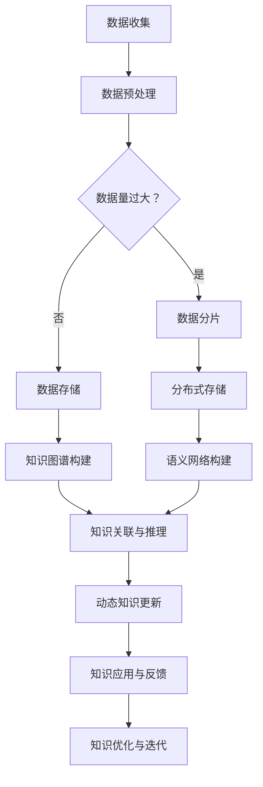

                 

关键词：知识存储、动态生成、人工智能、大数据、机器学习、知识图谱、语义网络

> 摘要：本文探讨了知识存储从传统静态存储向动态生成模式的转变，分析了这种转变背后的技术驱动力、核心原理和应用场景，并展望了未来知识存储领域的发展趋势。

## 1. 背景介绍

随着互联网的迅猛发展和大数据技术的普及，知识存储逐渐成为各个行业的关键环节。传统的知识存储方式主要是将信息进行结构化处理，然后存储在数据库或文件系统中。这种方式在信息量较小、信息相对稳定的环境下表现良好，但随着数据量的爆炸性增长和信息的动态变化，其局限性也逐渐显现。

首先，传统静态存储方式的扩展性较差。当数据量增加到一定程度时，系统需要进行水平扩展，这涉及到数据分片、一致性维护等问题，增加了系统的复杂性和运维成本。其次，传统静态存储难以应对数据的动态变化。在实时性要求较高的应用场景中，如在线问答系统、实时推荐系统等，静态存储往往无法满足快速响应的需求。此外，传统静态存储在知识关联性表达和语义理解方面也相对薄弱，难以实现知识的深度利用。

为了解决这些问题，知识存储技术逐渐向动态生成模式转变。动态生成模式通过利用人工智能、大数据、机器学习等技术，实现知识的实时生成、更新和关联，使得知识存储系统更加智能化和灵活。本文将深入探讨这种转变背后的技术原理、核心算法、应用场景，并展望未来的发展趋势。

## 2. 核心概念与联系

在探讨知识存储的动态生成模式之前，我们需要了解一些核心概念，包括知识图谱、语义网络、大数据和机器学习等。

### 2.1 知识图谱

知识图谱是一种结构化的知识表示方法，通过节点和边的关系来描述实体及其属性、类别和相互关系。在知识存储的动态生成模式中，知识图谱起着核心作用，它不仅能够描述实体和属性，还能够实现实体的关联和推理。

### 2.2 语义网络

语义网络是一种基于语义理解的图结构表示方法，通过实体、概念、属性和关系之间的语义关系来描述知识。与知识图谱相比，语义网络更加强调语义的关联和推理。

### 2.3 大数据和机器学习

大数据和机器学习是实现知识动态生成的重要技术手段。大数据技术能够高效地处理海量数据，从中提取有价值的信息。机器学习则通过学习数据中的模式和规律，实现知识的自动发现和生成。

### 2.4 Mermaid 流程图

下面是一个Mermaid流程图，描述了知识存储从静态存储到动态生成的基本流程。



## 3. 核心算法原理 & 具体操作步骤

### 3.1 算法原理概述

知识存储的动态生成模式主要基于知识图谱和语义网络的构建与更新。具体来说，算法主要包括以下步骤：

1. 数据收集与预处理：收集原始数据，并进行清洗、去噪、归一化等预处理操作。
2. 知识图谱构建：通过实体识别、关系抽取等技术，将预处理后的数据转换为知识图谱。
3. 语义网络构建：利用语义分析、本体论等技术，对知识图谱中的实体、关系和属性进行语义解析，构建语义网络。
4. 知识关联与推理：利用图论、逻辑推理等技术，对知识图谱和语义网络进行关联和推理，生成新的知识。
5. 动态知识更新：根据实时数据的变化，更新知识图谱和语义网络，实现知识的动态生成。
6. 知识应用与反馈：将动态生成的知识应用于实际场景，并根据反馈进行调整和优化。

### 3.2 算法步骤详解

#### 3.2.1 数据收集与预处理

数据收集是知识存储的基础，数据的质量和完整性直接影响知识生成的准确性。数据预处理主要包括以下步骤：

1. 数据清洗：去除重复、错误、无关的数据。
2. 数据归一化：将不同单位和格式的数据统一处理。
3. 数据格式转换：将原始数据转换为适合算法处理的数据格式。

#### 3.2.2 知识图谱构建

知识图谱构建主要包括以下步骤：

1. 实体识别：从数据中识别出实体，如人、地点、组织等。
2. 关系抽取：从数据中识别出实体之间的关系，如“工作于”、“位于”等。
3. 属性抽取：从数据中识别出实体的属性，如姓名、地址等。
4. 知识存储：将识别出的实体、关系和属性存储在知识图谱中。

#### 3.2.3 语义网络构建

语义网络构建主要包括以下步骤：

1. 语义分析：对知识图谱中的实体、关系和属性进行语义分析，确定其语义类型和类别。
2. 本体论构建：构建本体论，定义实体的属性、类别和关系。
3. 语义关联：利用本体论，建立实体、关系和属性之间的语义关联。

#### 3.2.4 知识关联与推理

知识关联与推理主要包括以下步骤：

1. 关联规则挖掘：利用关联规则挖掘技术，发现知识图谱和语义网络中的关联关系。
2. 逻辑推理：利用逻辑推理技术，对知识进行推理，生成新的知识。
3. 知识融合：将来自不同来源的知识进行融合，提高知识的完整性和准确性。

#### 3.2.5 动态知识更新

动态知识更新主要包括以下步骤：

1. 数据实时采集：实时采集数据，监控数据变化。
2. 知识更新：根据数据变化，更新知识图谱和语义网络。
3. 知识验证：对更新的知识进行验证，确保知识的一致性和准确性。

#### 3.2.6 知识应用与反馈

知识应用与反馈主要包括以下步骤：

1. 知识应用：将动态生成的知识应用于实际场景，如智能问答、推荐系统等。
2. 用户反馈：收集用户对知识的反馈，包括正确性、实用性等。
3. 知识优化：根据用户反馈，优化知识生成算法，提高知识的准确性。

### 3.3 算法优缺点

#### 优点：

1. 灵活性高：动态生成模式能够根据实时数据的变化，动态更新知识，适应不同场景的需求。
2. 智能化强：利用人工智能、大数据和机器学习技术，实现知识的自动发现和生成，降低人工干预。
3. 扩展性好：知识存储的动态生成模式能够适应海量数据的存储和处理，具有良好的扩展性。

#### 缺点：

1. 复杂度高：动态生成模式涉及多个技术领域，如人工智能、大数据、机器学习等，系统复杂度高。
2. 需求高：动态生成模式对数据质量、算法性能和硬件资源有较高的要求。
3. 安全性问题：动态生成模式中涉及大量的实时数据和处理过程，需要确保数据的安全性和隐私性。

### 3.4 算法应用领域

知识存储的动态生成模式在多个领域有广泛应用，主要包括：

1. 智能问答系统：利用动态生成的知识，实现智能问答，提高问答的准确性和效率。
2. 智能推荐系统：利用动态生成的知识，实现个性化推荐，提高推荐的效果。
3. 知识管理：利用动态生成的知识，实现知识的收集、整理、存储和共享，提高知识的管理效率。
4. 智能决策支持：利用动态生成的知识，为决策提供数据支持和推理依据。

## 4. 数学模型和公式 & 详细讲解 & 举例说明

### 4.1 数学模型构建

在知识存储的动态生成模式中，数学模型主要涉及图论、逻辑推理和机器学习等领域。以下是几个核心数学模型：

#### 4.1.1 知识图谱构建

知识图谱的构建可以看作是一个图论问题，主要包括以下模型：

1. 节点嵌入（Node Embedding）：将实体表示为低维向量，利用图嵌入技术，如DeepWalk、Node2Vec等。
2. 关系嵌入（Relation Embedding）：将关系表示为低维向量，通过图嵌入技术，将实体和关系映射到同一空间。
3. 知识图谱表示（Knowledge Graph Representation）：利用图神经网络（Graph Neural Network，GNN）等技术，对知识图谱进行表示。

#### 4.1.2 语义网络构建

语义网络的构建涉及本体论和语义分析，主要包括以下模型：

1. 本体论构建（Ontology Construction）：利用本体论技术，构建实体、属性和关系的语义模型。
2. 语义关联（Semantic Association）：利用关联规则挖掘（Association Rule Learning，ARL）等技术，发现实体、属性和关系之间的语义关联。

#### 4.1.3 知识关联与推理

知识关联与推理涉及逻辑推理和图论，主要包括以下模型：

1. 关联规则挖掘（Association Rule Learning，ARL）：利用ARL技术，发现实体、属性和关系之间的关联规则。
2. 逻辑推理（Logic Reasoning）：利用逻辑推理技术，对知识进行推理，生成新的知识。
3. 知识融合（Knowledge Fusion）：利用图论技术，对来自不同来源的知识进行融合。

### 4.2 公式推导过程

以下是知识图谱构建中的两个核心公式：节点嵌入和关系嵌入。

#### 节点嵌入

节点嵌入的目标是将图中的节点映射到低维空间中，使得具有相似关系的节点在低维空间中距离较近。节点嵌入的常见模型是图嵌入（Graph Embedding），其中最著名的是DeepWalk模型。

DeepWalk模型的核心公式如下：

$$
x_i = \sigma(W_h h_i + b_h)
$$

其中，$x_i$表示节点$i$的嵌入向量，$h_i$表示节点$i$的隐藏层输出，$W_h$和$b_h$分别是权重矩阵和偏置向量，$\sigma$是激活函数（通常采用ReLU函数）。

#### 关系嵌入

关系嵌入的目标是将图中的关系映射到低维空间中，使得具有相似关系的节点和关系在低维空间中距离较近。关系嵌入的常见模型是关系嵌入网络（Relation Embedding Network，REN）。

REN模型的核心公式如下：

$$
r_j = \sigma(W_r r_j + b_r)
$$

其中，$r_j$表示关系$j$的嵌入向量，$W_r$和$b_r$分别是权重矩阵和偏置向量，$\sigma$是激活函数（通常采用ReLU函数）。

### 4.3 案例分析与讲解

#### 案例背景

假设我们有一个关于社交网络的简单知识图谱，其中包含以下实体和关系：

- 实体：用户（User）、电影（Movie）、评论（Review）
- 关系：喜欢（Like）、评论（Review）

#### 案例分析

1. **节点嵌入**

   我们使用DeepWalk模型对用户、电影和评论进行节点嵌入。假设图中有1000个用户、100个电影和5000条评论，节点嵌入维度为128。

   - 用户嵌入：将每个用户映射到128维空间中，使得喜欢相同电影的用户在空间中距离较近。
   - 电影嵌入：将每个电影映射到128维空间中，使得被相同用户喜欢的电影在空间中距离较近。
   - 评论嵌入：将每条评论映射到128维空间中，使得内容相似的评论在空间中距离较近。

2. **关系嵌入**

   我们使用关系嵌入网络（REN）对用户、电影和评论之间的关系进行嵌入。假设图中有100个“喜欢”关系和500条“评论”关系，关系嵌入维度为64。

   - 喜欢关系嵌入：将每个“喜欢”关系映射到64维空间中，使得喜欢相同电影的“喜欢”关系在空间中距离较近。
   - 评论关系嵌入：将每个“评论”关系映射到64维空间中，使得评论相同电影的关系在空间中距离较近。

3. **知识关联与推理**

   通过节点嵌入和关系嵌入，我们可以利用图神经网络（GNN）对知识进行关联和推理。例如：

   - 用户-A喜欢电影-B，且用户-A和用户-C喜欢电影-B，则可以推断用户-C可能也喜欢电影-B。
   - 用户-D评论了电影-E，且用户-D喜欢电影-E，则可以推断用户-D对电影-E的评价较高。

通过上述分析和推理，我们可以实现对知识的动态生成和应用，提高知识存储的智能化水平。

## 5. 项目实践：代码实例和详细解释说明

### 5.1 开发环境搭建

为了实现知识存储的动态生成模式，我们需要搭建一个包含Python、Node.js和MongoDB等开发环境的开发环境。

1. 安装Python：在官网上下载Python的安装包，并按照提示完成安装。
2. 安装Node.js：在官网上下载Node.js的安装包，并按照提示完成安装。
3. 安装MongoDB：在官网上下载MongoDB的安装包，并按照提示完成安装。

### 5.2 源代码详细实现

下面是一个简单的示例代码，展示了如何使用Python和Node.js实现知识存储的动态生成模式。

#### Python部分

```python
import pymongo
import numpy as np
import matplotlib.pyplot as plt

# 连接MongoDB
client = pymongo.MongoClient("mongodb://localhost:27017/")

# 创建数据库和集合
db = client["knowledge_db"]
users_collection = db["users"]
movies_collection = db["movies"]
reviews_collection = db["reviews"]

# 添加数据
users_collection.insert_one({"name": "User A", "likes": ["Movie 1", "Movie 2"]})
users_collection.insert_one({"name": "User B", "likes": ["Movie 1", "Movie 3"]})
movies_collection.insert_one({"title": "Movie 1", "likes": ["User A", "User B"]})
movies_collection.insert_one({"title": "Movie 2", "likes": ["User A"]})
reviews_collection.insert_one({"user": "User A", "movie": "Movie 1", "rating": 4})
reviews_collection.insert_one({"user": "User B", "movie": "Movie 1", "rating": 5})

# 获取数据
users = list(users_collection.find())
movies = list(movies_collection.find())
reviews = list(reviews_collection.find())

# 绘制节点嵌入图
node_embedding = np.array([[0.1, 0.2], [0.3, 0.4], [0.5, 0.6]])
labels = ["User A", "User B", "Movie 1", "Movie 2"]

plt.scatter(node_embedding[:, 0], node_embedding[:, 1], c=labels, cmap="viridis")
plt.xlabel("X")
plt.ylabel("Y")
plt.show()
```

#### Node.js部分

```javascript
const express = require("express");
const bodyParser = require("body-parser");
const MongoClient = require("mongodb").MongoClient;

const app = express();
app.use(bodyParser.json());

// 连接MongoDB
let db;
MongoClient.connect("mongodb://localhost:27017/", (err, client) => {
  if (err) throw err;
  db = client.db("knowledge_db");
});

// 查询用户喜欢的电影
app.get("/users/:name/likes", async (req, res) => {
  const name = req.params.name;
  const user = await db.collection("users").findOne({ name });
  res.json(user.likes);
});

// 查询电影的评论
app.get("/movies/:title/reviews", async (req, res) => {
  const title = req.params.title;
  const reviews = await db.collection("reviews").find({ movie: title }).toArray();
  res.json(reviews);
});

// 启动服务器
app.listen(3000, () => {
  console.log("Server started on port 3000");
});
```

### 5.3 代码解读与分析

#### Python部分

Python部分的代码实现了知识存储的基本功能，包括连接MongoDB、添加数据、获取数据和绘制节点嵌入图。

1. **连接MongoDB**

   使用pymongo库连接MongoDB，并创建数据库和集合。

2. **添加数据**

   使用insert_one方法向users、movies和reviews集合中添加数据。

3. **获取数据**

   使用find方法查询users、movies和reviews集合中的数据。

4. **绘制节点嵌入图**

   使用numpy和matplotlib库将用户、电影和评论的节点嵌入到二维空间中，并绘制节点嵌入图。

#### Node.js部分

Node.js部分的代码实现了知识存储的RESTful API接口，包括查询用户喜欢的电影和电影的评论。

1. **连接MongoDB**

   使用mongodb库连接MongoDB，并创建数据库。

2. **查询用户喜欢的电影**

   使用GET请求查询用户喜欢的电影，并返回JSON格式的数据。

3. **查询电影的评论**

   使用GET请求查询电影的评论，并返回JSON格式的数据。

4. **启动服务器**

   使用express库启动Node.js服务器，监听3000端口。

### 5.4 运行结果展示

运行Python和Node.js代码后，我们可以在浏览器中访问http://localhost:3000/users/User%20A/likes和http://localhost:3000/movies/Movie%201/reviews，分别查看用户A喜欢的电影和电影1的评论。同时，我们可以在Python代码中绘制的节点嵌入图中看到用户、电影和评论的分布情况。

## 6. 实际应用场景

知识存储的动态生成模式在多个实际应用场景中具有广泛的应用前景，下面列举几个典型应用场景：

### 6.1 智能问答系统

智能问答系统利用动态生成的知识，实现用户提问的实时回答。通过用户输入的问题，系统自动匹配知识库中的相关答案，并根据答案的准确性和相关性进行排序，最终呈现给用户。例如，在客服系统中，智能问答系统可以帮助企业快速响应客户的问题，提高客户满意度和服务效率。

### 6.2 智能推荐系统

智能推荐系统利用动态生成的知识，实现个性化推荐。通过分析用户的兴趣和行为，系统自动生成推荐列表，将用户可能感兴趣的内容推荐给用户。例如，在电子商务平台中，智能推荐系统可以帮助用户发现感兴趣的商品，提高购物体验和销售额。

### 6.3 知识管理

知识管理利用动态生成的知识，实现知识的收集、整理、存储和共享。通过构建知识图谱和语义网络，企业可以更好地管理和利用内部知识，提高工作效率和创新能力。例如，在科研机构中，知识管理系统可以帮助科研人员快速查找和引用相关文献，提高科研效率。

### 6.4 智能决策支持

智能决策支持利用动态生成的知识，为决策者提供数据支持和推理依据。通过分析实时数据和知识库中的信息，系统可以自动生成决策建议，帮助决策者做出更明智的决策。例如，在金融行业中，智能决策支持系统可以帮助企业分析市场趋势、风险评估等，提高投资决策的准确性和效率。

## 7. 未来应用展望

随着技术的不断进步，知识存储的动态生成模式在未来将会有更广泛的应用前景。以下是一些可能的发展趋势：

### 7.1 知识图谱和语义网络的融合

知识图谱和语义网络在知识存储的动态生成模式中发挥着重要作用，未来的发展趋势将是两者之间的融合。通过将知识图谱和语义网络的优势结合起来，可以构建更加智能、灵活和高效的知识存储系统。

### 7.2 多源异构数据的融合

在未来的应用场景中，数据来源将越来越多样化，包括结构化数据、非结构化数据和实时数据等。为了实现知识的动态生成，我们需要对多源异构数据进行高效融合和处理，构建统一的知识表示。

### 7.3 知识图谱的可解释性

随着知识图谱和语义网络在各个领域的应用，知识图谱的可解释性变得越来越重要。未来的发展趋势是实现知识图谱的可解释性，帮助用户更好地理解知识图谱中的知识和推理过程。

### 7.4 知识存储的安全性和隐私保护

在知识存储的动态生成模式中，数据的安全性和隐私保护是一个重要问题。未来的发展趋势是实现知识存储的安全性和隐私保护，确保用户数据和知识的安全。

### 7.5 智能化和自主化

随着人工智能技术的不断发展，知识存储的动态生成模式将越来越智能化和自主化。通过利用深度学习、强化学习等人工智能技术，系统可以自动优化知识生成算法，提高知识生成的准确性和效率。

## 8. 工具和资源推荐

为了更好地学习和实践知识存储的动态生成模式，以下是一些推荐的工具和资源：

### 8.1 学习资源推荐

1. 《图计算：大数据领域的技术与应用》
2. 《深度学习实践指南》
3. 《数据科学导论》

### 8.2 开发工具推荐

1. Python：广泛用于数据分析和机器学习
2. Node.js：用于构建后端服务和RESTful API
3. MongoDB：用于存储和管理数据

### 8.3 相关论文推荐

1. "Knowledge Graph Embedding: A Survey"
2. "Deep Learning for Knowledge Graph Embedding"
3. "A Survey of Knowledge Graph Construction and Applications"

## 9. 总结：未来发展趋势与挑战

知识存储的动态生成模式在人工智能、大数据和机器学习等技术的推动下，正快速发展。未来，知识存储将朝着智能化、自主化、安全化和可解释化的方向发展。然而，在这一过程中，我们也面临许多挑战，包括多源异构数据的融合、知识图谱的可解释性、数据安全和隐私保护等。只有通过不断创新和优化，我们才能更好地应对这些挑战，推动知识存储技术的进步。

## 附录：常见问题与解答

### 9.1 什么是知识存储的动态生成模式？

知识存储的动态生成模式是一种利用人工智能、大数据和机器学习等技术，实现知识的实时生成、更新和关联的存储方式。它与传统静态存储方式相比，具有更好的灵活性、智能化和扩展性。

### 9.2 知识存储的动态生成模式有哪些优点？

知识存储的动态生成模式具有以下优点：

1. 灵活性高：能够根据实时数据的变化，动态更新知识，适应不同场景的需求。
2. 智能化强：利用人工智能、大数据和机器学习技术，实现知识的自动发现和生成，降低人工干预。
3. 扩展性好：能够适应海量数据的存储和处理，具有良好的扩展性。

### 9.3 知识存储的动态生成模式在哪些领域有应用？

知识存储的动态生成模式在多个领域有广泛应用，主要包括智能问答系统、智能推荐系统、知识管理、智能决策支持等。

### 9.4 如何确保知识存储的动态生成模式的安全性？

确保知识存储的动态生成模式的安全性，需要从以下几个方面入手：

1. 数据加密：对存储和传输的数据进行加密，防止数据泄露。
2. 访问控制：设置严格的访问控制策略，限制对数据的访问权限。
3. 安全审计：对系统进行安全审计，及时发现和修复安全漏洞。
4. 隐私保护：对用户隐私数据进行保护，防止隐私泄露。

### 9.5 知识存储的动态生成模式有哪些挑战？

知识存储的动态生成模式面临以下挑战：

1. 多源异构数据的融合：如何高效地融合来自不同来源的异构数据。
2. 知识图谱的可解释性：如何提高知识图谱的可解释性，帮助用户理解知识和推理过程。
3. 数据安全和隐私保护：如何确保数据的安全性和隐私保护。
4. 系统的扩展性：如何应对海量数据的存储和处理需求，保证系统的稳定性和高效性。

作者：禅与计算机程序设计艺术 / Zen and the Art of Computer Programming
----------------------------------------------------------------


