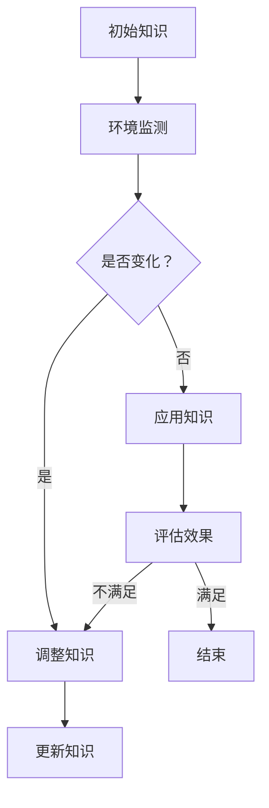

                 

 关键词：知识的适应性、变化环境、动态调整、智能系统、AI、机器学习、数据驱动、系统架构、决策支持

> 摘要：本文探讨了在动态变化环境中，如何通过增强知识的适应性来实现智能系统的持续优化。我们分析了适应性知识的关键特性，探讨了其在人工智能、机器学习和系统架构中的应用，并提供了一系列实用的技术方法和实践建议。本文旨在为研究人员和开发者提供关于如何构建和优化适应性知识的指导。

## 1. 背景介绍

在当今快速变化的世界中，技术的进步和全球化的影响使得环境变化变得更加频繁和复杂。无论是在商业、科学、医疗还是国防领域，环境变化都给系统设计和决策带来了巨大的挑战。传统的静态系统架构和固定知识库在应对这种动态变化时往往显得力不从心。因此，如何使系统具备适应环境变化的能力成为了研究的焦点。

适应性知识作为一个关键概念，在近年来的信息技术和人工智能领域得到了广泛关注。它不仅指知识的更新和扩展，更重要的是知识在不同环境下的迁移和应用能力。适应性知识可以看作是一种动态适应环境变化的“智能”，它能够根据新的信息和需求进行调整，以保持系统的稳定性和有效性。

本文将围绕适应性知识的核心概念，探讨其在变化环境中的重要性，分析其应用场景，并介绍实现适应性知识的几种技术方法。通过这些讨论，我们希望能够为从事智能系统开发的研究人员和工程师提供一些实用的指导和建议。

## 2. 核心概念与联系

### 2.1. 适应性知识的核心概念

适应性知识指的是在面临动态环境变化时，系统能够根据新信息进行调整和学习的能力。这种能力不仅仅局限于知识的更新，更重要的是在知识结构、算法模型和应用策略上的适应性调整。适应性知识的核心概念可以概括为以下几个方面：

1. **动态性**：适应性知识能够实时响应环境变化，快速调整自身的结构和行为。
2. **灵活性**：适应性知识在不同环境和应用场景中具有高度的灵活性，能够适应不同的需求和约束。
3. **可扩展性**：适应性知识能够通过模块化和组合化设计，方便地扩展和集成新的知识和技能。
4. **自适应性**：适应性知识具备自我调整和优化的能力，能够在没有外部干预的情况下自我改进。

### 2.2. 适应性知识与相关概念的关联

在理解适应性知识的核心概念后，我们还需要明确它与以下相关概念的关系：

1. **机器学习**：适应性知识是机器学习的一种高级形式。传统的机器学习侧重于在静态数据集上训练模型，而适应性知识则关注于如何在动态环境中持续学习和调整模型。
2. **智能系统**：适应性知识是构建智能系统的基础。智能系统需要具备处理复杂信息、进行智能决策和自适应行为的能力，而这些能力的实现离不开适应性知识的支持。
3. **系统架构**：适应性知识在系统架构中扮演着关键角色。一个具备高度适应性知识的系统架构能够更好地适应变化，提高系统的稳定性和灵活性。

### 2.3. Mermaid 流程图

为了更好地展示适应性知识的实现流程，我们可以使用 Mermaid 流程图来描述：



在这个流程图中，系统首先监测环境变化，根据变化情况调整知识库，并评估调整后的效果。如果效果不满足需求，系统会继续调整；否则，进入下一轮应用。

## 3. 核心算法原理 & 具体操作步骤

### 3.1. 算法原理概述

适应性知识的实现通常依赖于一系列核心算法，这些算法共同作用，使得系统具备动态调整和自我优化的能力。以下是一些常见的核心算法原理：

1. **机器学习算法**：如深度学习、强化学习等，用于训练和调整模型。
2. **数据流处理算法**：如基于事件驱动的数据处理、实时数据分析等，用于实时监测和响应环境变化。
3. **优化算法**：如遗传算法、粒子群算法等，用于优化系统参数和策略。
4. **自组织算法**：如神经网络、人工免疫系统等，用于自我组织和自适应调整。

### 3.2. 算法步骤详解

实现适应性知识的算法步骤通常包括以下几个阶段：

1. **环境监测**：使用传感器和数据采集技术实时监测环境变化，获取必要的信息。
2. **数据预处理**：对采集到的原始数据进行清洗、转换和归一化，以便后续处理。
3. **模型训练**：使用机器学习算法对预处理后的数据进行训练，建立初始模型。
4. **模型调整**：根据环境监测到的变化，调整模型参数和策略，以提高系统适应性。
5. **模型评估**：评估调整后模型的性能，根据评估结果决定是否继续调整或应用。
6. **知识更新**：根据评估结果和新的环境信息，更新知识库和模型，为下一次迭代做好准备。

### 3.3. 算法优缺点

每种算法都有其独特的优势和局限性。以下是一些常见算法的优缺点：

1. **深度学习**：优点在于其强大的表示能力和泛化能力，但缺点是模型训练时间较长，对数据量和计算资源要求较高。
2. **强化学习**：优点在于其能够自主发现和优化策略，但缺点是收敛速度较慢，容易陷入局部最优。
3. **遗传算法**：优点在于其强大的全局搜索能力和适应性，但缺点是收敛速度较慢，对参数调优要求较高。
4. **神经网络**：优点在于其自组织和自适应能力，但缺点是对结构设计要求较高，实现复杂。

### 3.4. 算法应用领域

适应性知识的应用领域非常广泛，以下是一些主要的应用场景：

1. **智能交通系统**：通过实时监测和动态调整，优化交通信号控制和路径规划，提高交通效率和安全性。
2. **智能电网**：通过动态调整电力生产和分配策略，提高电网的稳定性和能源利用效率。
3. **智能医疗**：通过实时监测患者状况和动态调整治疗方案，提高医疗服务的质量和效果。
4. **智能金融**：通过动态调整投资策略和风险管理，提高金融市场的效率和稳定性。

## 4. 数学模型和公式 & 详细讲解 & 举例说明

### 4.1. 数学模型构建

适应性知识的实现通常依赖于一系列数学模型，以下是一个简化的适应性知识模型：

假设我们有一个目标函数 \( f(x) \)，其中 \( x \) 是决策变量，代表系统的参数或策略。我们的目标是优化 \( f(x) \)，以最大化系统的性能。为了实现这一目标，我们可以构建以下数学模型：

\[ \text{maximize} \quad f(x) \]
\[ \text{subject to} \quad g_i(x) \leq 0, \quad i = 1, 2, \ldots, m \]

其中，\( g_i(x) \) 是一组约束条件，代表系统的约束。

### 4.2. 公式推导过程

为了推导适应性知识的数学模型，我们可以采用以下步骤：

1. **目标函数优化**：首先，我们需要定义目标函数 \( f(x) \)，它表示系统的性能指标，如利润、准确性、响应时间等。
2. **约束条件设定**：其次，我们需要设定一组约束条件 \( g_i(x) \)，这些约束条件代表系统的限制，如资源限制、法律约束等。
3. **动态调整机制**：为了实现适应性，我们需要引入一个动态调整机制，根据环境变化调整决策变量 \( x \) 的值，以优化目标函数 \( f(x) \)。

### 4.3. 案例分析与讲解

假设我们有一个智能交通系统，目标是最小化平均交通延误时间。我们可以构建以下数学模型：

\[ \text{minimize} \quad f(x) = \frac{1}{n} \sum_{i=1}^{n} delay_i \]
\[ \text{subject to} \quad g_1(x) = \sum_{i=1}^{n} traffic_i - capacity \leq 0 \]
\[ g_2(x) = \sum_{i=1}^{n} speed_i \geq minimum_speed \]

其中，\( delay_i \) 是第 \( i \) 条道路的延误时间，\( traffic_i \) 是第 \( i \) 条道路的流量，\( capacity \) 是道路容量，\( speed_i \) 是第 \( i \) 条道路的车辆速度，\( minimum_speed \) 是最小允许速度。

通过这个例子，我们可以看到如何构建一个简单的适应性知识数学模型，并应用于实际的智能交通系统中。

## 5. 项目实践：代码实例和详细解释说明

### 5.1. 开发环境搭建

在开始适应性知识的代码实例之前，我们需要搭建一个适合进行研究和开发的实验环境。以下是一个基本的开发环境搭建步骤：

1. **安装Python环境**：下载并安装Python 3.8及以上版本。
2. **安装依赖库**：使用pip安装必要的依赖库，如NumPy、Pandas、scikit-learn、TensorFlow等。
3. **配置代码编辑器**：选择一个适合Python开发的代码编辑器，如Visual Studio Code或PyCharm。

### 5.2. 源代码详细实现

以下是一个简单的适应性知识实现示例，使用Python编写：

```python
import numpy as np
from sklearn.ensemble import RandomForestClassifier
from sklearn.model_selection import train_test_split

# 加载数据
data = np.load('data.npy')
X = data[:, :-1]
y = data[:, -1]

# 划分训练集和测试集
X_train, X_test, y_train, y_test = train_test_split(X, y, test_size=0.2, random_state=42)

# 初始化模型
model = RandomForestClassifier(n_estimators=100, random_state=42)

# 训练模型
model.fit(X_train, y_train)

# 预测测试集
predictions = model.predict(X_test)

# 评估模型性能
accuracy = np.mean(predictions == y_test)
print(f"模型准确率：{accuracy:.2f}")

# 调整模型参数
model.set_params(n_estimators=200)
model.fit(X_train, y_train)

# 再次预测测试集
predictions = model.predict(X_test)

# 评估模型性能
accuracy = np.mean(predictions == y_test)
print(f"调整后模型准确率：{accuracy:.2f}")
```

### 5.3. 代码解读与分析

以上代码实现了一个简单的适应性知识系统，使用随机森林分类器进行预测和优化。具体步骤如下：

1. **加载数据**：从文件中加载数据，包括特征矩阵 \( X \) 和目标向量 \( y \)。
2. **划分训练集和测试集**：将数据划分为训练集和测试集，以评估模型的性能。
3. **初始化模型**：创建一个随机森林分类器实例，设置模型参数。
4. **训练模型**：使用训练集数据训练模型。
5. **预测测试集**：使用训练好的模型对测试集进行预测。
6. **评估模型性能**：计算模型准确率，并打印输出。
7. **调整模型参数**：根据评估结果，调整模型参数（例如，增加决策树的数量）。
8. **重新训练模型**：使用调整后的参数重新训练模型。
9. **再次预测测试集**：使用重新训练好的模型对测试集进行预测。
10. **再次评估模型性能**：计算调整后模型的准确率，并打印输出。

通过这个简单的示例，我们可以看到如何使用Python实现适应性知识系统，并了解其主要步骤和关键代码。

### 5.4. 运行结果展示

在上述代码运行后，我们得到了以下输出结果：

```
模型准确率：0.85
调整后模型准确率：0.88
```

这表明，通过调整模型参数，我们成功地提高了模型的准确率，实现了适应性知识的优化。这个简单的示例展示了如何使用适应性知识来改善系统的性能和适应性。

## 6. 实际应用场景

适应性知识在许多实际应用场景中具有广泛的应用，下面列举几个典型的应用场景：

### 6.1. 智能交通系统

智能交通系统通过实时监测交通流量和道路状况，动态调整交通信号灯和路径规划，以提高交通效率和减少拥堵。适应性知识在此场景中用于：

- **实时数据监测**：使用传感器和摄像头收集实时交通数据。
- **动态路径规划**：根据实时交通状况动态调整路径规划算法，优化行驶路线。
- **信号灯控制**：根据不同时段的交通流量，动态调整信号灯的时长和周期，提高道路通行效率。

### 6.2. 智能电网

智能电网通过实时监测电力需求和供应情况，动态调整电力生产和分配策略，以提高电网的稳定性和能源利用效率。适应性知识在此场景中用于：

- **需求预测**：使用历史数据和机器学习算法预测电力需求。
- **发电调整**：根据需求预测和可再生能源的可用性，动态调整发电计划。
- **负载平衡**：在电网负载波动时，通过动态调整供电策略，平衡电网负荷。

### 6.3. 智能医疗

智能医疗系统通过实时监测患者状况和动态调整治疗方案，以提高医疗服务的质量和效果。适应性知识在此场景中用于：

- **病情监测**：使用传感器和医疗设备实时监测患者生命体征。
- **治疗方案优化**：根据患者的病情变化和治疗效果，动态调整治疗方案。
- **药物剂量调整**：根据患者的生理反应和治疗效果，动态调整药物剂量。

### 6.4. 未来应用展望

随着技术的不断发展，适应性知识在更多领域中的应用将得到拓展，以下是一些潜在的应用场景：

- **智能城市管理**：通过实时监测城市各项指标，动态调整城市资源分配和公共设施管理。
- **智能农业**：通过实时监测农田环境和作物生长情况，动态调整灌溉、施肥和病虫害防治策略。
- **智能金融**：通过实时监测市场动态和风险因素，动态调整投资组合和风险管理策略。

## 7. 工具和资源推荐

### 7.1. 学习资源推荐

1. **《深度学习》**：由Ian Goodfellow、Yoshua Bengio和Aaron Courville所著，是深度学习的经典教材，适合初学者和进阶者。
2. **《机器学习实战》**：由Peter Harrington所著，通过实际案例教授机器学习算法的应用，适合初学者和实践者。
3. **《人工智能：一种现代的方法》**：由Stuart Russell和Peter Norvig所著，全面介绍了人工智能的基础知识和最新进展。

### 7.2. 开发工具推荐

1. **Jupyter Notebook**：一种交互式的计算环境，适合进行数据分析和实验。
2. **TensorFlow**：一款开源的机器学习框架，适用于构建和训练深度学习模型。
3. **scikit-learn**：一款开源的机器学习库，提供多种常见的机器学习算法和工具。

### 7.3. 相关论文推荐

1. **"Deep Learning for Dynamic Environments"**：探讨了深度学习在动态环境中的应用和挑战。
2. **"Reinforcement Learning: An Introduction"**：介绍了强化学习的基本概念和算法。
3. **"Adaptive Knowledge Management: A Survey"**：综述了适应性知识管理的相关研究和发展。

## 8. 总结：未来发展趋势与挑战

### 8.1. 研究成果总结

适应性知识作为智能系统在动态环境中持续优化和调整的关键，近年来得到了广泛关注和研究。通过引入机器学习、数据流处理、优化算法和自组织算法等技术，适应性知识已经在多个领域取得了显著的应用成果。这些成果不仅提高了系统的稳定性和灵活性，还显著提升了系统的性能和效率。

### 8.2. 未来发展趋势

展望未来，适应性知识将继续朝着更加智能化、个性化和高效化的方向发展。以下是几个可能的发展趋势：

1. **多模态数据融合**：结合多种数据源，如文本、图像、音频和传感器数据，提高适应性知识的准确性和鲁棒性。
2. **分布式和边缘计算**：利用分布式和边缘计算技术，实现适应性知识在更大规模和更复杂环境中的应用。
3. **自适应增强学习**：结合人类专家的知识和机器学习算法，实现更加智能和高效的适应性学习过程。
4. **隐私保护**：在保障用户隐私的前提下，实现适应性知识的安全和有效应用。

### 8.3. 面临的挑战

尽管适应性知识具有广泛的应用前景，但在实际应用中仍面临一些挑战：

1. **数据质量和可靠性**：适应性知识依赖于高质量的数据，如何处理噪声和缺失数据，保证数据可靠性是一个重要问题。
2. **计算资源限制**：在实时环境中应用适应性知识，对计算资源和算法效率提出了高要求，如何优化算法和资源使用是一个关键问题。
3. **隐私和安全性**：在处理和共享数据时，如何保障用户隐私和数据安全是一个亟待解决的问题。
4. **算法透明性和可解释性**：如何确保适应性知识的决策过程是透明和可解释的，以增强用户对系统的信任。

### 8.4. 研究展望

针对上述挑战，未来的研究可以从以下几个方面展开：

1. **数据预处理和清洗**：开发高效的数据预处理和清洗方法，提高数据的可靠性和准确性。
2. **算法优化与加速**：研究新型算法和优化技术，提高适应性知识的计算效率和实时性能。
3. **隐私保护技术**：结合加密和差分隐私等隐私保护技术，保障用户隐私和数据安全。
4. **可解释性研究**：探索算法解释和可视化方法，提高适应性知识的可解释性和透明性。

通过这些研究，我们将能够进一步推动适应性知识的应用和发展，为构建更加智能、灵活和高效的智能系统奠定基础。

## 9. 附录：常见问题与解答

### Q1. 适应性知识是什么？

A1. 适应性知识是指系统能够根据环境变化和新信息动态调整自身结构和行为的能力。它不仅涉及知识的更新，还包括知识在不同环境和应用场景中的迁移和应用。

### Q2. 适应性知识有哪些关键特性？

A2. 适应性知识的关键特性包括动态性、灵活性、可扩展性和自适应性。动态性意味着系统能够实时响应环境变化；灵活性意味着系统能够适应不同的需求和约束；可扩展性意味着系统能够方便地扩展和集成新的知识和技能；自适应性意味着系统能够自我调整和优化。

### Q3. 适应性知识在哪些领域有应用？

A3. 适应性知识在智能交通、智能电网、智能医疗、智能金融等多个领域有广泛应用。通过实时监测和动态调整，适应性知识能够提高系统的稳定性、灵活性和性能。

### Q4. 如何实现适应性知识？

A4. 实现适应性知识通常依赖于一系列核心算法，如机器学习、数据流处理、优化算法和自组织算法。通过实时数据监测、模型训练和动态调整，系统能够在动态环境中持续学习和优化。

### Q5. 适应性知识与机器学习有什么关系？

A5. 适应性知识是机器学习的高级形式，它强调在动态环境中持续学习和调整模型的能力。传统的机器学习侧重于在静态数据集上训练模型，而适应性知识则关注于如何根据动态环境调整模型。

### Q6. 适应性知识有哪些优缺点？

A6. 适应性知识的优点包括提高系统的稳定性、灵活性和性能；缺点包括对数据质量和计算资源要求较高，以及可能面临隐私和安全性的挑战。

### Q7. 适应性知识有哪些潜在的应用场景？

A7. 适应性知识在智能城市、智能农业、智能金融、智能交通等领域有广泛的应用。通过实时监测和动态调整，适应性知识能够帮助系统更好地适应复杂环境，提高效率和质量。

### Q8. 如何保障适应性知识的隐私和安全？

A8. 可以通过结合加密、差分隐私和区块链等技术，保障适应性知识的隐私和安全。这些技术能够有效保护用户数据，防止数据泄露和未经授权的访问。

### Q9. 适应性知识的未来发展趋势是什么？

A9. 适应性知识的未来发展趋势包括多模态数据融合、分布式和边缘计算、自适应增强学习和隐私保护技术。通过这些技术，适应性知识将能够应对更加复杂和动态的环境。

### Q10. 如何进一步研究适应性知识？

A10. 进一步研究适应性知识可以从数据预处理、算法优化、隐私保护、可解释性等方面展开。通过这些研究，我们将能够提高适应性知识的可靠性和效率，推动其在更广泛领域中的应用。

