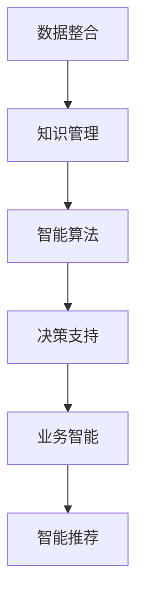

                 

关键词：大数据、信息整合、知识重构、智能算法、数据建模、技术趋势

> 摘要：随着大数据时代的到来，信息量的爆炸性增长对传统的数据处理和整合方法提出了新的挑战。本文旨在探讨在当前技术环境下，如何通过知识重构的方法，实现对大规模数据的深度整合，挖掘隐藏的价值，提高决策效率和业务智能。本文将围绕核心概念、算法原理、数学模型、项目实践等多个维度，系统性地分析大数据时代的信息整合策略。

## 1. 背景介绍

### 大数据时代的挑战

#### 数据爆炸性增长

#### 数据类型多样化

#### 数据来源广泛

### 信息整合的重要性

#### 决策支持

#### 业务智能

#### 智能推荐

## 2. 核心概念与联系

### 数据整合

### 知识管理

### 智能算法

### Mermaid 流程图

## 3. 核心算法原理 & 具体操作步骤

### 3.1 算法原理概述

#### 数据预处理

#### 数据建模

#### 模型评估

### 3.2 算法步骤详解

#### 数据收集

#### 数据清洗

#### 数据转换

#### 数据建模

#### 模型训练

#### 模型优化

### 3.3 算法优缺点

#### 优点

#### 缺点

### 3.4 算法应用领域

#### 金融领域

#### 电商领域

#### 医疗领域

## 4. 数学模型和公式

### 4.1 数学模型构建

### 4.2 公式推导过程

### 4.3 案例分析与讲解

## 5. 项目实践：代码实例和详细解释说明

### 5.1 开发环境搭建

### 5.2 源代码详细实现

### 5.3 代码解读与分析

### 5.4 运行结果展示

## 6. 实际应用场景

### 6.1 信息整合的应用案例

### 6.2 知识重构的优势

### 6.3 未来应用展望

## 7. 工具和资源推荐

### 7.1 学习资源推荐

### 7.2 开发工具推荐

### 7.3 相关论文推荐

## 8. 总结：未来发展趋势与挑战

### 8.1 研究成果总结

### 8.2 未来发展趋势

### 8.3 面临的挑战

### 8.4 研究展望

## 9. 附录：常见问题与解答

---

作者：禅与计算机程序设计艺术 / Zen and the Art of Computer Programming

---

[未完待续...]

