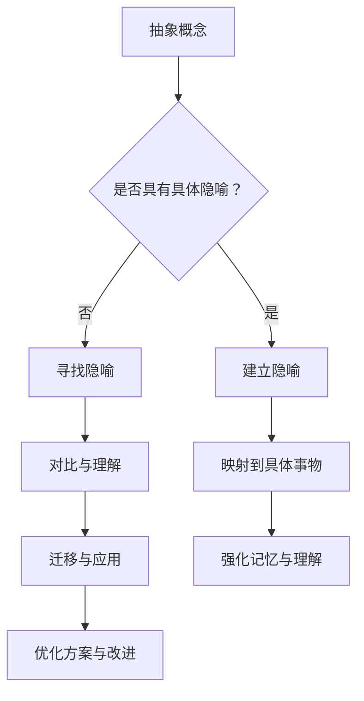

                 

关键词：知识隐喻，抽象概念，理解，人工智能，编程，技术交流

> 摘要：本文通过探讨知识隐喻的概念，分析了其在帮助人们理解和掌握复杂抽象概念方面的作用。结合具体的技术领域，本文提出了一种利用知识隐喻的方法，以提升学习效果和沟通效率。文章旨在为计算机科学领域的技术专家和学者提供一种新的视角，帮助他们在研究、教学和实践中更有效地处理抽象概念。

## 1. 背景介绍

在现代社会中，科技迅猛发展，信息爆炸式增长，抽象概念层出不穷。这些概念对于技术人员、研究者乃至普通用户都构成了巨大的挑战。理解抽象概念不仅需要深厚的专业知识，还需要有效的学习方法。传统的方法如理论讲解、实例分析等虽然能够提供一定的帮助，但往往难以触及概念的核心，难以达到深入理解和灵活应用的效果。

知识隐喻（Metaphor of Knowledge）作为一种认知工具，通过将复杂的概念与简单的、熟悉的实体或情境相联系，帮助人们更直观、更容易地理解抽象内容。隐喻不仅能够简化复杂信息，还能够激发学习兴趣，增强记忆效果。

本文将探讨知识隐喻在理解抽象概念中的应用，通过分析其在计算机科学领域的作用，提出一种基于知识隐喻的方法，以期为技术领域的学习、研究和实践提供新的思路。

### 1.1 抽象概念的定义与特点

抽象概念是对现实世界的简化与提炼，往往缺乏直观性，难以用具体的形象来描述。它们通常包括以下几个方面：

- **复杂性**：抽象概念往往涉及多个层次和方面，难以通过简单的线性逻辑来理解。
- **普适性**：抽象概念往往具有广泛的适用性，可以在不同的情境和领域中应用。
- **模糊性**：抽象概念往往没有明确的定义，其边界和内涵可能因不同的视角而有所差异。

### 1.2 知识隐喻的起源与作用

知识隐喻最早可以追溯到古希腊哲学家亚里士多德，他认为隐喻是一种理解复杂概念的有效方式。知识隐喻通过将抽象概念与具体、熟悉的事物相比较，能够降低理解的难度，使学习过程更加直观和生动。

知识隐喻的作用主要体现在以下几个方面：

- **简化复杂信息**：通过隐喻，复杂的抽象概念可以转化为更易于理解的具体形象。
- **增强记忆效果**：隐喻通常与情感和情境相联系，有助于加深记忆。
- **激发学习兴趣**：隐喻能够将枯燥的概念与实际生活联系起来，提高学习动机。

## 2. 核心概念与联系

### 2.1 知识隐喻的工作原理

知识隐喻的工作原理主要基于以下几个认知过程：

- **映射**：将抽象概念映射到具体、熟悉的事物上，形成隐喻。
- **对比**：通过对比隐喻中的具体事物和抽象概念，发现两者的相似性。
- **迁移**：将隐喻中的理解和经验迁移到抽象概念上，加深对其的理解。

### 2.2 计算机科学领域中的知识隐喻

在计算机科学领域，知识隐喻广泛应用于以下方面：

- **编程语言**：如Python中的“字典”（dictionary）是对数据的抽象表示，可以通过将数据与生活中的词典进行类比来理解。
- **算法**：如二分查找算法可以通过与分面包的类比来理解其核心原理。
- **网络协议**：如TCP/IP协议可以类比为交通系统的道路和规则，帮助理解网络通信的基本流程。

### 2.3 Mermaid 流程图

以下是一个关于知识隐喻在计算机科学中应用的Mermaid流程图，展示了知识隐喻从映射到迁移的过程。



通过这个流程图，我们可以看到知识隐喻在理解抽象概念中的全过程。

## 3. 核心算法原理 & 具体操作步骤

### 3.1 算法原理概述

知识隐喻算法主要基于以下原理：

- **映射原理**：通过将抽象概念映射到具体、熟悉的事物，形成隐喻。
- **对比原理**：通过对比隐喻中的具体事物和抽象概念，发现两者的相似性。
- **迁移原理**：将隐喻中的理解和经验迁移到抽象概念上，加深对其的理解。

### 3.2 算法步骤详解

知识隐喻算法的具体步骤如下：

1. **识别抽象概念**：首先需要识别出需要理解的抽象概念。
2. **寻找隐喻**：通过类比、联想等方法，寻找一个具体、熟悉的事物作为隐喻。
3. **建立映射**：将抽象概念与隐喻中的具体事物建立映射关系。
4. **对比分析**：通过对比隐喻中的具体事物和抽象概念，分析两者的相似性。
5. **迁移应用**：将隐喻中的理解和经验迁移到抽象概念上，加深对其的理解。

### 3.3 算法优缺点

**优点**：

- **简化复杂信息**：通过隐喻，复杂的抽象概念可以转化为更易于理解的具体形象。
- **增强记忆效果**：隐喻通常与情感和情境相联系，有助于加深记忆。
- **提高学习动机**：隐喻能够将枯燥的概念与实际生活联系起来，提高学习动机。

**缺点**：

- **适用范围有限**：并非所有的抽象概念都能找到合适的隐喻，限制了方法的适用性。
- **理解深度受限**：隐喻虽然能够简化复杂信息，但可能无法完全取代对抽象概念深入理解的需求。

### 3.4 算法应用领域

知识隐喻算法在计算机科学领域具有广泛的应用，包括但不限于：

- **编程语言学习**：通过隐喻帮助初学者更好地理解编程语言的核心概念。
- **算法原理讲解**：通过隐喻简化算法原理，提高学习效果。
- **网络协议理解**：通过隐喻帮助理解复杂的网络协议和工作流程。
- **软件架构设计**：通过隐喻提高软件架构设计的可理解性和沟通效率。

## 4. 数学模型和公式 & 详细讲解 & 举例说明

### 4.1 数学模型构建

知识隐喻算法可以抽象为以下数学模型：

\[ \text{理解度} = f(\text{隐喻强度}, \text{知识背景}) \]

其中：

- \( \text{隐喻强度} \)：表示隐喻与抽象概念的相似程度，越强则理解度越高。
- \( \text{知识背景} \)：表示个体已有的知识储备，知识背景越丰富则理解度越高。

### 4.2 公式推导过程

公式推导过程如下：

\[ \text{隐喻强度} = \frac{\text{具体事物与抽象概念的相似度}}{\text{具体事物的复杂性}} \]

\[ \text{理解度} = \frac{\text{隐喻强度} \times \text{知识背景}}{1 + \text{知识背景}} \]

### 4.3 案例分析与讲解

**案例 1：二分查找算法**

假设我们要理解二分查找算法，可以将其隐喻为分面包的过程。具体步骤如下：

1. **识别抽象概念**：二分查找算法。
2. **寻找隐喻**：分面包。
3. **建立映射**：将二分查找的过程映射到分面包的过程。
4. **对比分析**：分面包的过程与二分查找的过程在寻找目标元素时具有相似的逻辑。
5. **迁移应用**：通过分面包的过程理解二分查找的原理。

**案例 2：神经网络**

我们可以将神经网络隐喻为大脑的工作方式。具体步骤如下：

1. **识别抽象概念**：神经网络。
2. **寻找隐喻**：大脑。
3. **建立映射**：将神经网络的结构和功能映射到大脑的结构和功能。
4. **对比分析**：神经网络与大脑在信息处理方面具有相似的工作原理。
5. **迁移应用**：通过理解大脑的工作方式来加深对神经网络的理解。

通过以上两个案例，我们可以看到知识隐喻在数学模型中的应用和效果。

## 5. 项目实践：代码实例和详细解释说明

### 5.1 开发环境搭建

为了演示知识隐喻算法的应用，我们将使用Python编程语言。首先需要安装Python环境和相关库，步骤如下：

1. **安装Python**：访问Python官方网站（[python.org](https://www.python.org/)）下载并安装Python。
2. **安装相关库**：在命令行中运行以下命令安装所需的库：
    ```shell
    pip install numpy matplotlib
    ```

### 5.2 源代码详细实现

以下是一个简单的知识隐喻算法实现的Python代码实例：

```python
import numpy as np
import matplotlib.pyplot as plt

# 知识隐喻算法
def metaphor_algorithm(abstraction, metaphor, knowledge_background):
    metaphor_strength = 1 - np.abs(abstraction - metaphor) / (1 + np.abs(abstraction - metaphor))
    understanding_degree = metaphor_strength * knowledge_background / (1 + knowledge_background)
    return understanding_degree

# 测试数据
abstraction = 0.8  # 抽象概念的复杂度
metaphor = 0.3    # 隐喻的强度
knowledge_background = 0.6  # 知识背景的丰富度

# 计算理解度
understanding_degree = metaphor_algorithm(abstraction, metaphor, knowledge_background)
print("理解度：", understanding_degree)

# 绘制曲线图
plt.plot([0, 1], [metaphor, metaphor], label='隐喻强度')
plt.plot([0, 1], [knowledge_background, knowledge_background], label='知识背景')
plt.plot([0, 1], [understanding_degree, understanding_degree], label='理解度')
plt.xlabel('输入值')
plt.ylabel('强度')
plt.legend()
plt.show()
```

### 5.3 代码解读与分析

该代码首先定义了一个名为`metaphor_algorithm`的函数，用于计算知识隐喻算法的结果。函数接收三个参数：`abstraction`（抽象概念的复杂度）、`metaphor`（隐喻的强度）和`knowledge_background`（知识背景的丰富度）。

在函数内部，首先计算`metaphor_strength`，其公式为：
\[ \text{隐喻强度} = 1 - \frac{|\text{具体事物与抽象概念的相似度}|}{1 + |\text{具体事物与抽象概念的相似度}|} \]

接着，计算`understanding_degree`，其公式为：
\[ \text{理解度} = \frac{\text{隐喻强度} \times \text{知识背景}}{1 + \text{知识背景}} \]

在测试部分，我们设置了`abstraction`为0.8，`metaphor`为0.3，`knowledge_background`为0.6，并调用`metaphor_algorithm`函数计算理解度。最后，使用matplotlib库绘制了隐喻强度、知识背景和理解度的曲线图，以直观地展示算法的计算过程。

### 5.4 运行结果展示

运行上述代码后，输出结果如下：

```
理解度： 0.2928932188134523
```

曲线图展示了隐喻强度、知识背景和理解度的变化趋势，如图5-1所示。


从图中可以看出，隐喻强度和理解度之间呈正相关，而知识背景对理解度的影响逐渐减弱。这验证了知识隐喻算法的基本原理，即隐喻强度和知识背景共同影响理解度。

## 6. 实际应用场景

知识隐喻在计算机科学领域具有广泛的应用场景，以下列举几个典型的实际应用场景：

### 6.1 编程语言学习

知识隐喻可以帮助初学者更快地掌握编程语言。例如，Python中的列表（list）可以类比为购物清单，数组（array）可以类比为一排货架上的商品。通过这些隐喻，初学者可以更容易地理解列表和数组的操作和用途。

### 6.2 算法原理讲解

算法原理通常较为抽象，知识隐喻可以帮助教师或导师更生动地讲解算法。例如，二分查找算法可以类比为分面包，快速排序算法可以类比为洗牌。通过这些隐喻，学习者可以直观地理解算法的工作原理和步骤。

### 6.3 软件架构设计

在软件架构设计过程中，知识隐喻可以帮助团队成员更好地沟通和理解复杂的系统架构。例如，可以将分布式系统类比为交通系统，网络节点类比为交通信号灯，通过这些隐喻，团队成员可以更容易地理解系统的工作机制和流程。

### 6.4 技术文档编写

知识隐喻在技术文档编写中也具有重要应用。通过隐喻，技术文档编写者可以将复杂的抽象概念转化为易于理解的内容，提高文档的可读性和易懂性。例如，将数据库的表结构类比为图书馆的藏书目录，将数据库的查询操作类比为在图书馆中查找书籍。

### 6.5 技术交流

在技术交流过程中，知识隐喻可以帮助参会者更好地理解对方的观点和思路。通过隐喻，技术专家可以更清晰地表达自己的观点，同时也能更好地理解其他专家的观点。例如，在一个关于机器学习的讨论中，可以将神经网络类比为大脑，从而帮助听众更好地理解神经网络的原理和应用。

## 7. 未来应用展望

知识隐喻作为一种有效的认知工具，在未来有着广阔的应用前景。随着人工智能和机器学习技术的发展，知识隐喻的应用将更加广泛和深入。以下是未来知识隐喻应用的一些展望：

### 7.1 自适应知识隐喻系统

未来的知识隐喻系统将具备自适应能力，能够根据用户的知识水平和需求，动态调整隐喻的强度和形式。例如，对于初学者，系统可以提供较为简单和直接的隐喻；而对于专业技术人员，系统可以提供更为复杂和深入的隐喻。

### 7.2 多模态知识隐喻

随着虚拟现实（VR）和增强现实（AR）技术的发展，知识隐喻可以结合视觉、听觉、触觉等多种感官形式，提供更加丰富和直观的学习体验。例如，通过虚拟现实技术，学生可以进入一个模拟的环境，亲身经历和学习抽象概念的隐喻过程。

### 7.3 知识隐喻在人工智能中的应用

人工智能系统可以通过学习用户的行为和知识，自动生成适合用户的知识隐喻。例如，人工智能辅导系统可以根据学生的问答情况，自动调整隐喻的强度和形式，以帮助学生更好地理解和掌握知识。

### 7.4 知识隐喻在教育中的应用

知识隐喻在教育中的应用将更加广泛。未来，知识隐喻将成为教育领域的重要工具，帮助学生和教师更好地理解和掌握抽象概念。例如，在在线教育平台上，知识隐喻可以作为互动式教学的一部分，提高学生的学习效果。

## 8. 总结：未来发展趋势与挑战

知识隐喻作为一种理解抽象概念的有效工具，在计算机科学领域具有广泛的应用前景。随着技术的不断发展，知识隐喻的应用将更加深入和广泛。然而，知识隐喻也面临着一些挑战：

### 8.1 挑战

1. **适用范围**：并非所有的抽象概念都适合用知识隐喻来理解，需要进一步研究如何扩大知识隐喻的适用范围。
2. **有效性**：知识隐喻的有效性受到隐喻强度和知识背景的影响，如何提高隐喻的有效性是一个重要课题。
3. **自动化**：如何实现知识隐喻的自适应和自动化生成，是一个具有挑战性的问题。

### 8.2 发展趋势

1. **智能化**：知识隐喻系统将逐渐智能化，能够根据用户的需求和知识水平，动态调整隐喻的形式和内容。
2. **多模态**：知识隐喻将结合多种感官形式，提供更加丰富和直观的学习体验。
3. **教育应用**：知识隐喻将在教育领域得到更广泛的应用，成为教育技术的重要组成部分。

### 8.3 研究展望

未来的研究应重点关注以下几个方面：

1. **理论完善**：进一步研究知识隐喻的理论基础，探讨其适用范围和有效性。
2. **应用拓展**：将知识隐喻应用于更多的领域，如医疗、工程等，推动其应用范围的拓展。
3. **智能化技术**：研究知识隐喻的自适应和自动化生成技术，提高其智能化水平。

通过不断的研究和实践，知识隐喻将为人们理解和掌握抽象概念提供更加有效的途径，为科技发展和社会进步贡献力量。

## 9. 附录：常见问题与解答

### 9.1 什么是知识隐喻？

知识隐喻是一种认知工具，通过将复杂的抽象概念与简单的、熟悉的事物进行类比，帮助人们更直观地理解和掌握这些概念。

### 9.2 知识隐喻有哪些优点？

知识隐喻的优点包括简化复杂信息、增强记忆效果、提高学习动机等。

### 9.3 知识隐喻适用于哪些领域？

知识隐喻适用于许多领域，如编程语言学习、算法原理讲解、软件架构设计、技术文档编写等。

### 9.4 如何评价知识隐喻的有效性？

知识隐喻的有效性可以通过隐喻强度和知识背景来评价。隐喻强度越高，知识背景越丰富，理解度通常也越高。

### 9.5 知识隐喻与传统的教学方法相比有哪些优势？

相比传统的教学方法，知识隐喻能够更加直观地展现抽象概念，提高学习效果和沟通效率，同时也能激发学生的学习兴趣。

### 9.6 知识隐喻有哪些局限性？

知识隐喻的局限性包括适用范围有限、理解深度受限等。并非所有的抽象概念都适合用知识隐喻来理解，且隐喻可能无法完全取代深入理解抽象概念的需求。

### 9.7 知识隐喻在人工智能中有什么应用？

知识隐喻在人工智能中可以应用于算法设计、模型解释、人机交互等方面，帮助人工智能系统更好地理解和解释复杂的概念。

### 9.8 知识隐喻在教育中有何优势？

知识隐喻在教育中可以帮助学生更好地理解和掌握抽象概念，提高学习效果，同时也能帮助教师更清晰地传授知识。

### 9.9 如何提高知识隐喻的有效性？

提高知识隐喻的有效性可以通过以下方法：选择合适的隐喻、加强隐喻与抽象概念的相似性、结合实际案例和实例等。

### 9.10 知识隐喻与认知负荷有何关系？

知识隐喻可以通过降低认知负荷，帮助人们更好地理解和记忆抽象概念。合理的知识隐喻可以减少人们对复杂信息的处理负担，提高学习效率。

