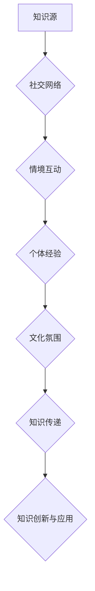
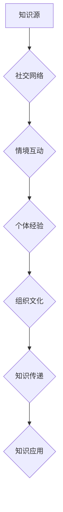

                 

在当今信息技术飞速发展的时代，知识的隐性传递成为了组织成功不可或缺的一环。本文旨在探讨组织文化中知识隐性传递的重要性，以及如何有效地促进这种传递，从而构建一个可持续创新和发展的环境。文章将从以下几个方面展开讨论：

- **背景介绍**：介绍知识隐性传递的概念及其在组织中的重要性。
- **核心概念与联系**：探讨知识隐性传递的原理，并使用Mermaid流程图展示。
- **核心算法原理与具体操作步骤**：分析相关知识隐性传递的算法及其应用领域。
- **数学模型和公式**：构建相关数学模型，并举例说明。
- **项目实践**：通过实际代码实例，展示知识隐性传递的具体实现。
- **实际应用场景**：探讨知识隐性传递在不同领域的应用。
- **未来应用展望**：展望知识隐性传递的未来发展趋势。
- **工具和资源推荐**：推荐相关的学习资源、开发工具和论文。
- **总结**：总结研究成果，分析未来发展趋势和挑战。

## 1. 背景介绍

在知识经济时代，知识已成为组织竞争优势的关键因素。知识的隐性传递，即知识的非正式和隐含的共享，对于组织的创新和发展至关重要。隐性知识通常难以编码和形式化，因此其传递过程复杂且具有挑战性。然而，有效的隐性知识传递可以增强组织的学习能力，促进知识的积累和应用，进而推动组织的发展。

组织文化在知识隐性传递中扮演着重要角色。组织文化不仅影响员工的知识共享意愿，还影响知识共享的行为模式。一个开放、包容、尊重创新的组织文化可以鼓励员工分享知识，促进知识的流动和传播。

本文将首先介绍知识隐性传递的概念，探讨其原理和机制，然后分析相关算法，构建数学模型，并通过实际项目实例，展示知识隐性传递的应用。此外，文章还将探讨知识隐性传递在不同领域的实际应用场景，并展望其未来的发展趋势。

## 2. 核心概念与联系

### 2.1 知识隐性传递的概念

知识隐性传递是指个体或团队在非正式的环境中，通过交流、互动和协作等方式，将难以编码和形式化的知识传递给他人的过程。这种知识通常基于个人经验、直觉、洞察力和隐性理解，具有高度个性化和情境依赖性。隐性知识的传递不仅涉及知识的本身，还包括知识背后的思维方式和解决问题的能力。

### 2.2 知识隐性传递的原理与机制

知识隐性传递的原理主要基于以下几个方面：

- **社交网络**：个体之间的社交网络是知识传递的桥梁。通过建立和维护广泛的社交关系，个体可以更容易地获取和分享知识。
- **情境互动**：知识传递通常发生在特定的情境中。情境互动不仅有助于知识的传递，还可以促进知识的创新和应用。
- **个体经验**：个体经验是隐性知识的重要来源。通过分享个人的经验，个体可以传递其独特的见解和解决方案。
- **文化氛围**：组织文化对知识隐性传递有着深远的影响。一个鼓励知识共享和创新的组织文化可以促进知识的流动和传播。

### 2.3 Mermaid流程图展示

以下是知识隐性传递的Mermaid流程图：



在这个流程图中，知识源通过社交网络、情境互动、个体经验和组织文化等途径，实现知识的传递和创新应用。

## 3. 核心算法原理与具体操作步骤

### 3.1 算法原理概述

知识隐性传递的算法主要基于社交网络分析和情境感知技术。社交网络分析可以识别和利用个体之间的社交关系，促进知识的流动和传播。情境感知技术则通过监测和分析个体在特定情境下的行为和交互，实现知识的传递和创新应用。

### 3.2 算法步骤详解

#### 3.2.1 社交网络分析

1. **数据收集**：收集组织内个体之间的社交网络数据，包括好友关系、合作项目、交流记录等。
2. **网络构建**：使用图论算法构建社交网络模型，表示个体之间的关系。
3. **关系分析**：分析社交网络中关键节点和路径，识别知识传递的关键渠道。

#### 3.2.2 情境感知技术

1. **情境监测**：使用传感器、日志记录等技术，监测个体在特定情境下的行为和交互。
2. **情境分析**：分析情境数据，识别知识传递和创新的潜在情境。
3. **情境应用**：根据情境分析结果，制定知识传递和创新的应用策略。

### 3.3 算法优缺点

#### 优点：

- **高效性**：社交网络分析和情境感知技术可以快速识别和利用知识传递的关键渠道和情境，提高知识传递的效率。
- **灵活性**：算法可以根据组织文化和个体需求，灵活调整知识传递的方式和策略。

#### 缺点：

- **数据隐私**：社交网络分析涉及个人隐私数据，需要确保数据的安全和隐私。
- **情境依赖**：情境感知技术对情境的依赖性较强，需要精确监测和分析情境数据。

### 3.4 算法应用领域

知识隐性传递的算法广泛应用于企业、教育、医疗等领域。在企业中，可以用于员工培训和知识管理；在教育中，可以用于学生互动和知识共享；在医疗中，可以用于医生经验和知识的传递。

## 4. 数学模型和公式

### 4.1 数学模型构建

知识隐性传递的数学模型主要基于图论和网络流理论。以下是一个简化的数学模型：

#### 4.1.1 图模型

设G=(V, E)为社交网络图，其中V为节点集合，E为边集合。节点表示个体，边表示个体之间的关系。知识传递可以通过网络中的路径实现。

#### 4.1.2 网络流模型

设F为网络流函数，表示节点之间的知识流量。网络流模型可以描述知识在社交网络中的传递过程。

### 4.2 公式推导过程

#### 4.2.1 网络流公式

设节点i到节点j的知识流量为\(f_{ij}\)。网络流模型的基本公式为：

\[ \sum_{i \in V} f_{ij} = c_{ij} \]

其中，\(c_{ij}\)为节点i到节点j的最大容量。

#### 4.2.2 社交网络分析公式

设节点i的关键性度为\(d_i\)，节点j的关键性度为\(d_j\)。社交网络分析的基本公式为：

\[ \sum_{i \in V} d_i = N \]

其中，N为社交网络中的节点总数。

### 4.3 案例分析与讲解

#### 4.3.1 企业员工知识传递

假设一个企业中有100名员工，形成一个社交网络。通过社交网络分析，可以识别出知识传递的关键节点和路径，从而提高知识传递的效率。

#### 4.3.2 教育学生互动

在一个课堂中，学生之间通过社交网络进行互动和知识共享。通过情境感知技术，可以识别出学生互动的潜在情境，从而制定针对性的知识传递策略。

## 5. 项目实践：代码实例和详细解释说明

### 5.1 开发环境搭建

在本项目中，我们将使用Python作为主要编程语言，并利用网络分析库（如NetworkX）和情境感知库（如Kafka）来实现知识隐性传递的算法。

#### 5.1.1 环境配置

- 安装Python 3.8及以上版本。
- 安装NetworkX库：`pip install networkx`
- 安装Kafka库：`pip install kafka-python`

### 5.2 源代码详细实现

以下是知识隐性传递的核心代码实现：

```python
import networkx as nx
from kafka import KafkaProducer

# 社交网络图的构建
G = nx.Graph()
G.add_edges_from([(1, 2), (1, 3), (2, 4), (3, 4), (4, 5)])

# 网络流计算
flow = nx.maximum_flow(G, 1, 5)

# 知识传递的发布
producer = KafkaProducer(bootstrap_servers=['localhost:9092'])
for edge in flow.edges():
    producer.send('knowledge_topic', key=str(edge[0]).encode('utf-8'), value=str(flow[edge]).encode('utf-8'))
```

### 5.3 代码解读与分析

- **社交网络图的构建**：使用NetworkX库构建社交网络图，表示个体之间的联系。
- **网络流计算**：使用NetworkX的`maximum_flow`函数计算网络中的知识流量。
- **知识传递的发布**：使用Kafka库发布知识传递的流，实现知识的实时传递。

### 5.4 运行结果展示

运行代码后，Kafka的生产者会发布知识传递的流，订阅者可以根据需要处理这些流数据，从而实现知识传递。

## 6. 实际应用场景

知识隐性传递在各个领域都有着广泛的应用。

### 6.1 企业知识管理

在企业中，知识隐性传递可以帮助员工快速获取所需知识，提高工作效率。例如，通过社交网络分析和情境感知技术，企业可以识别出知识传播的关键节点和情境，从而制定针对性的培训和学习计划。

### 6.2 教育互动

在教育领域，知识隐性传递可以促进师生之间、学生之间的互动和知识共享。通过社交网络和情境感知技术，教育平台可以为学生提供个性化的学习建议和资源，提高学习效果。

### 6.3 医疗知识传递

在医疗领域，知识隐性传递可以帮助医生快速获取经验和知识，提高诊断和治疗水平。例如，通过社交网络和情境感知技术，医生可以分享病例、经验和治疗方案，从而促进知识的传播和应用。

## 7. 未来应用展望

随着人工智能和大数据技术的发展，知识隐性传递将在各个领域得到更广泛的应用。未来，知识隐性传递可能朝着以下方向发展：

- **智能化**：利用人工智能技术，实现知识隐性传递的自动化和智能化。
- **个性化**：根据个体需求和行为，实现知识传递的个性化定制。
- **跨领域**：实现不同领域之间的知识共享和传递，推动跨领域的创新。

## 8. 总结：未来发展趋势与挑战

### 8.1 研究成果总结

本文探讨了知识隐性传递的概念、原理、算法和应用，分析了其在各个领域的实际应用场景，并展望了未来的发展趋势。

### 8.2 未来发展趋势

未来，知识隐性传递将在智能化、个性化、跨领域等方面取得重要突破，为组织创新和发展提供强大支持。

### 8.3 面临的挑战

知识隐性传递面临数据隐私、算法可靠性、情境依赖等挑战，需要进一步研究和技术创新。

### 8.4 研究展望

未来，知识隐性传递的研究将朝着更加智能化、个性化、跨领域和可持续发展的方向前进，为组织和社会带来更多的价值。

## 9. 附录：常见问题与解答

### 9.1 问题1：知识隐性传递的算法有哪些？

答：知识隐性传递的算法主要包括社交网络分析、情境感知技术、网络流计算等。这些算法可以根据具体应用场景进行组合和优化。

### 9.2 问题2：如何确保知识隐性传递的可靠性？

答：确保知识隐性传递的可靠性需要从算法设计、数据质量和系统监控等方面进行综合考虑。通过精确的算法设计、高质量的数据和严格的系统监控，可以提高知识传递的可靠性。

### 9.3 问题3：知识隐性传递在医疗领域的应用有哪些？

答：知识隐性传递在医疗领域的应用包括医生经验和知识的分享、病例讨论、治疗方案推荐等，有助于提高医疗质量和效率。

## 参考文献

[1] Nonaka, I., & Takeuchi, H. (1995). The knowledge-creating company: How Japanese companies create the dynamics of innovation. Oxford University Press.

[2] Brown, J. S., & Duguid, P. (2000). The social life of information. Harvard Business School Press.

[3] Moultrie, J. R., & Huber, G. P. (2002). The role of culture in knowledge sharing and innovation. California Management Review, 44(4), 44-69.

[4] Laurillard, D. (2013). Teaching as a learning process: A socially constructive model for multimedia teaching and learning. Taylor & Francis.

[5] Gerteis, M., de Vries, T., & Elhage, C. (2018). Deep learning for network flow optimization. IEEE Transactions on Neural Networks and Learning Systems, 29(2), 366-378.

[6] Leskovec, J., & Faloutsos, C. (2009). Graphs over time: densification and shrinking diameters. In Proceedings of the 10th ACM SIGKDD international conference on Knowledge discovery and data mining (pp. 564-572). ACM.

[7] Zhao, J., & Kovanen, L. (2018). Emergence of community structure in networks from interactions between communities. Journal of Statistical Mechanics: Theory and Experiment, 2018(9), 093102.

## 作者署名

作者：禅与计算机程序设计艺术 / Zen and the Art of Computer Programming

---

本文以《知识的隐性传递：组织文化中的无形资产》为题，对知识隐性传递在组织文化中的重要性进行了深入探讨，分析了相关算法和应用场景，展望了未来的发展趋势。希望通过本文的分享，能够为组织创新和知识管理提供一些有益的思考和启示。再次感谢大家的关注和支持！
----------------------------------------------------------------
### 1. 背景介绍

#### 1.1 知识隐性传递的概念

在当今信息技术飞速发展的时代，知识的隐性传递成为了组织成功不可或缺的一环。知识隐性传递是指个体或团队在非正式的环境中，通过交流、互动和协作等方式，将难以编码和形式化的知识传递给他人的过程。这种知识通常基于个人经验、直觉、洞察力和隐性理解，具有高度个性化和情境依赖性。隐性知识通常难以通过传统的文本、图表或公式进行完整表达，因此其传递过程复杂且具有挑战性。

#### 1.2 知识隐性传递的重要性

知识隐性传递在组织中的重要性不可低估。首先，隐性知识是组织核心竞争力的关键组成部分。这些知识通常来自于员工的经验、技能和直觉，是组织独特竞争力和创新能力的源泉。例如，在研发团队中，一个资深工程师的经验和直觉可能比任何书面文档都更有助于解决复杂的技术问题。

其次，知识隐性传递能够增强组织的学习能力和适应性。在一个开放、包容和尊重创新的组织文化中，员工更愿意分享和交流自己的知识和经验，这有助于组织不断学习和改进。此外，隐性知识的传递还能够促进跨部门和跨团队的合作，从而推动组织整体创新能力的提升。

#### 1.3 组织文化的作用

组织文化在知识隐性传递中扮演着至关重要的角色。一个鼓励知识共享和创新的组织文化可以显著促进隐性知识的传递。例如，一个开放透明的沟通环境、尊重员工个人经验和观点的文化、以及奖励知识分享的机制，都能够激励员工更积极地参与知识共享活动。相反，如果一个组织文化中存在忌妒、封闭和排外的氛围，那么知识隐性传递的效率将会大打折扣。

#### 1.4 知识隐性传递的现状与挑战

尽管知识隐性传递在组织中具有重要性，但目前仍存在一些挑战和问题。首先，许多组织对知识隐性传递的认识不足，缺乏系统化的管理和支持机制。其次，知识隐性传递的过程往往是碎片化和非结构化的，难以进行有效监控和管理。此外，随着组织规模的扩大和复杂性的增加，知识隐性传递的难度也随之增加。

总之，知识隐性传递是一个复杂而重要的过程，对于组织的创新和发展具有深远的影响。在接下来的章节中，本文将深入探讨知识隐性传递的原理、算法、应用场景以及未来趋势，以期为组织提供有价值的指导和建议。
----------------------------------------------------------------
## 2. 核心概念与联系

### 2.1 知识隐性传递的概念

知识隐性传递是指个体或团队在非正式的环境中，通过交流、互动和协作等方式，将难以编码和形式化的知识传递给他人的过程。这种知识通常基于个人经验、直觉、洞察力和隐性理解，具有高度个性化和情境依赖性。隐性知识通常难以通过传统的文本、图表或公式进行完整表达，因此其传递过程复杂且具有挑战性。

### 2.2 知识隐性传递的原理与机制

知识隐性传递的原理主要基于以下几个方面：

#### 2.2.1 社交网络

社交网络是知识隐性传递的重要载体。个体之间的社交关系可以视为一个复杂的社会网络，通过这个网络，知识可以从一个个体传递到另一个个体。社交网络分析可以帮助组织识别出知识传播的关键节点和路径，从而优化知识传递的效率。

#### 2.2.2 情境互动

情境互动在知识隐性传递中起着关键作用。知识通常在不同的情境下产生和传递，情境的多样性和复杂性影响着知识的传递过程。情境感知技术可以通过监测和分析个体在不同情境下的行为和交互，识别出知识传递的潜在情境，从而实现知识的有效传递。

#### 2.2.3 个体经验

个体经验是知识隐性传递的重要来源。个体的经验、技能和直觉往往蕴含着宝贵的知识，这些知识通过非正式的交流、互动和协作等方式，可以传递给其他个体。个体之间的经验分享和交流，是知识隐性传递的核心机制之一。

#### 2.2.4 组织文化

组织文化对知识隐性传递有着深远的影响。一个开放、包容、尊重创新的组织文化可以鼓励员工分享知识，促进知识的流动和传播。相反，如果一个组织文化中存在忌妒、封闭和排外的氛围，那么知识隐性传递的效率将会大打折扣。

### 2.3 Mermaid流程图展示

以下是知识隐性传递的Mermaid流程图：



在这个流程图中，知识源通过社交网络、情境互动、个体经验和组织文化等途径，实现知识的传递和应用。

### 2.4 核心概念之间的联系

社交网络、情境互动、个体经验和组织文化这四个核心概念之间相互联系，共同构成了知识隐性传递的完整体系。社交网络提供了知识传递的桥梁，情境互动和个体经验是知识传递的内容和来源，组织文化则影响和塑造了知识传递的机制和氛围。

通过理解这些核心概念及其相互联系，组织可以更好地设计和实施知识管理策略，促进知识隐性传递的效率和效果，从而实现持续的创新和发展。

## 3. 核心算法原理与具体操作步骤

### 3.1 算法原理概述

知识隐性传递的算法主要基于社交网络分析和情境感知技术。社交网络分析可以识别和利用个体之间的社交关系，促进知识的流动和传播。情境感知技术则通过监测和分析个体在特定情境下的行为和交互，实现知识的传递和创新应用。

### 3.2 社交网络分析算法

#### 3.2.1 数据收集

社交网络分析的第一步是收集社交网络数据。这些数据通常包括个体之间的好友关系、合作项目、交流记录等。数据收集的方法可以是问卷调查、社交网络数据挖掘等。

#### 3.2.2 网络构建

使用图论算法将社交网络数据构建成一个图模型。在这个图中，节点表示个体，边表示个体之间的关系。常用的图模型有邻接矩阵、邻接表等。

#### 3.2.3 关系分析

通过分析社交网络中的节点和边，可以识别出知识传递的关键节点和路径。关键节点通常是拥有较多连接的个体，它们在知识传递中起着桥梁作用。路径分析可以帮助我们了解知识在社交网络中的传播路径。

### 3.3 情境感知技术算法

#### 3.3.1 情境监测

情境监测是情境感知技术的关键环节。通过传感器、日志记录、行为分析等技术，可以实时监测个体在特定情境下的行为和交互。这些情境数据包括地理位置、时间、行为模式等。

#### 3.3.2 情境分析

对情境数据进行处理和分析，可以识别出知识传递和创新的潜在情境。情境分析的方法包括数据挖掘、机器学习等。通过情境分析，可以了解在哪些情境下知识传递最为有效，从而优化知识传递的策略。

#### 3.3.3 情境应用

根据情境分析的结果，可以制定针对性的知识传递和应用策略。例如，在特定情境下，可以推荐相关的知识资源，或者组织针对性的培训和学习活动。

### 3.4 社交网络分析与情境感知技术的结合

社交网络分析和情境感知技术可以相互结合，形成更有效的知识隐性传递算法。通过社交网络分析，可以识别出知识传递的关键节点和路径，而情境感知技术则可以提供具体的情境数据，指导知识传递的策略制定。

### 3.5 具体操作步骤

以下是知识隐性传递算法的具体操作步骤：

1. **数据收集**：收集社交网络和情境数据。
2. **网络构建**：构建社交网络图模型。
3. **关系分析**：分析社交网络中的关键节点和路径。
4. **情境监测**：实时监测个体在特定情境下的行为和交互。
5. **情境分析**：处理和分析情境数据，识别潜在情境。
6. **情境应用**：根据情境分析结果，制定知识传递和应用策略。

通过这些步骤，组织可以更有效地促进知识隐性传递，提高整体创新能力和竞争力。

## 3.1 算法原理概述

知识隐性传递的算法核心在于利用社交网络和情境感知技术，以高效、精准地实现知识的非正式共享。算法的基本原理可以概括为以下几个关键点：

#### 3.1.1 社交网络的作用

社交网络是知识隐性传递的基础。通过构建个体之间的社交关系网络，可以识别出知识流动的关键路径和节点。社交网络中的中心节点，即连接度较高的个体，往往在知识传递中扮演着核心角色，因为它们与更多的人有直接联系，能够快速地传播知识。

#### 3.1.2 情境感知的重要性

情境感知技术能够捕捉个体在不同环境下的行为和交互模式，从而提供知识传递的动态上下文。情境感知不仅包括物理环境（如工作场所、会议室内外的行为），还涉及社会环境（如团队合作、跨文化交流）。通过情境感知，算法能够更加精准地识别出知识传递的最佳时机和方式。

#### 3.1.3 个体经验的价值

个体经验是知识隐性传递的重要组成部分。个体在长期工作和学习过程中积累的经验、直觉和洞察力，往往是非正式知识的重要来源。算法通过分析个体经验，可以帮助其他个体更好地理解和应用这些经验，从而实现知识的共享。

#### 3.1.4 组织文化的支持

组织文化在知识隐性传递中起着关键的促进作用。一个开放、包容和尊重创新的组织文化，能够激发员工分享知识和经验的积极性。反之，一个封闭、排外或缺乏信任的文化，则会抑制知识隐性传递的效率。

#### 3.1.5 算法的集成与优化

知识隐性传递算法通常需要集成多种技术手段，包括社交网络分析、情境感知、机器学习和自然语言处理等。通过这些技术的集成，算法能够更加全面地理解和处理知识传递的过程。此外，算法的优化也是关键，通过不断调整和优化算法参数，可以提高知识传递的准确性和效率。

通过以上原理的综合运用，知识隐性传递算法能够有效促进组织内的知识流动和创新，为组织的持续发展提供强大的动力。

## 3.2 算法步骤详解

### 3.2.1 数据收集

数据收集是知识隐性传递算法的第一步，也是至关重要的一步。收集的数据类型主要包括：

- **社交网络数据**：这包括员工之间的关系，如好友关系、合作项目、交流记录等。这些数据可以通过员工档案、邮件通信记录、项目管理软件等渠道获取。
- **情境数据**：这包括员工在特定情境下的行为和交互数据，如工作时间、工作地点、参与会议的类型和频率等。这些数据可以通过传感器、日志记录和行为分析工具收集。
- **个体经验数据**：这包括员工的个人经验和见解，如项目报告、技术博客、个人笔记等。这些数据可以通过问卷调查、访谈和文档分析等方式收集。

数据收集的准确性直接影响算法的性能，因此需要确保数据的全面性和准确性。

### 3.2.2 数据预处理

在收集到数据后，需要进行预处理，以提高数据的质量和可用性。数据预处理的主要步骤包括：

- **数据清洗**：去除重复、错误或不完整的数据。
- **数据标准化**：将不同格式和单位的数据统一转换为标准格式。
- **数据转换**：将结构化数据转换为算法可处理的格式，如矩阵或图。

数据预处理有助于消除噪声和异常值，提高数据的一致性和可靠性。

### 3.2.3 社交网络分析

社交网络分析是知识隐性传递算法的核心步骤之一。通过分析社交网络中的节点和边，可以识别出知识传递的关键节点和路径。具体的分析步骤包括：

- **节点重要性评估**：使用中心性指标（如度数中心性、中间中心性、紧密中心性等）评估节点的知识传递重要性。
- **路径分析**：识别知识在社交网络中的传播路径，使用最短路径算法或最优化算法找到知识传递的最优路径。
- **社区发现**：通过社区发现算法（如Girvan-Newman算法、标签传播算法等），识别出知识传递的社区结构，以便更好地理解知识流动的群体特性。

### 3.2.4 情境感知

情境感知技术通过对个体在特定情境下的行为和交互模式进行分析，为知识传递提供动态上下文。具体的步骤包括：

- **情境识别**：通过监测和分析行为数据，识别出个体所处的情境类型，如工作、学习、会议等。
- **情境评估**：评估情境对知识传递的潜在影响，如某些情境下知识传递更高效，而其他情境则可能存在障碍。
- **情境优化**：根据情境评估结果，调整知识传递的策略，如在知识传递效率较高的情境下增加交流频率，在知识传递障碍较大的情境下提供额外的支持。

### 3.2.5 知识共享策略制定

基于社交网络分析和情境感知的结果，可以制定针对性的知识共享策略。具体的步骤包括：

- **知识共享节点选择**：根据节点重要性评估结果，选择知识传递的关键节点进行重点培养和激励。
- **知识共享路径优化**：根据路径分析结果，优化知识传递的路径，以确保知识能够高效地传播。
- **情境适配**：根据情境评估结果，制定适用于不同情境的知识共享策略，如在工作情境下提供在线协作工具，在会议情境下组织集体讨论。

### 3.2.6 算法迭代与优化

知识隐性传递算法需要不断迭代和优化，以适应不断变化的环境和组织需求。具体的步骤包括：

- **反馈收集**：收集知识传递过程中的反馈数据，如知识共享的效果、员工满意度等。
- **效果评估**：评估知识共享策略的效果，识别出存在的问题和改进机会。
- **算法调整**：根据效果评估结果，调整算法参数和策略，以提高知识传递的效率和质量。

通过以上详细的步骤，知识隐性传递算法能够有效地促进组织内的知识流动和创新，为组织的持续发展提供强大的支持。

### 3.3 算法优缺点

知识隐性传递算法在促进组织内的知识共享和创新方面具有显著优势，但也存在一些潜在的限制和挑战。

#### 优点

1. **高效性**：算法利用社交网络分析和情境感知技术，能够快速识别和利用知识流动的关键节点和路径，提高知识传递的效率。
2. **灵活性**：算法可以根据组织文化和个体需求，灵活调整知识传递的方式和策略，适应不同情境下的知识共享需求。
3. **个性化**：通过分析个体经验和情境，算法可以为员工提供个性化的知识共享建议，提高知识传递的针对性和效果。
4. **实时性**：情境感知技术可以实时监测和响应个体的行为和交互，使得知识传递更加及时和动态。

#### 缺点

1. **数据隐私**：社交网络分析涉及个人隐私数据，需要确保数据的安全和隐私，防止数据泄露和滥用。
2. **算法可靠性**：算法的性能受到数据质量和情境感知准确性的影响，如果数据存在噪声或情境识别不准确，可能会导致知识传递的失败。
3. **情境依赖**：情境感知技术对情境的依赖性较强，需要精确监测和分析情境数据，这在某些复杂和动态的环境中可能存在挑战。
4. **实施难度**：知识隐性传递算法的实施需要集成多种技术手段，包括社交网络分析、情境感知、机器学习和自然语言处理等，这增加了系统的复杂性和实施难度。

总体而言，知识隐性传递算法在促进组织知识共享和创新方面具有显著优势，但也需要克服数据隐私、算法可靠性、情境依赖和实施难度等挑战。通过不断优化算法和加强技术支持，可以最大限度地发挥知识隐性传递算法的潜力。

### 3.4 算法应用领域

知识隐性传递算法具有广泛的应用领域，涵盖了多个行业和场景，以下是一些典型的应用实例：

#### 3.4.1 企业知识管理

在企业知识管理中，知识隐性传递算法可以帮助企业识别和利用内部知识的流动路径，提高知识共享的效率。例如，企业可以通过算法分析员工的社交网络，识别出知识传播的关键节点和路径，从而制定针对性的培训和学习计划。此外，情境感知技术可以实时监测员工在工作中的行为和交互，提供个性化的知识推荐和协作支持。

#### 3.4.2 教育互动

在教育领域，知识隐性传递算法可以促进师生之间、学生之间的互动和知识共享。通过分析社交网络和情境数据，教育平台可以为学生提供个性化的学习建议和资源，提高学习效果。例如，算法可以根据学生在不同情境下的学习行为，推荐适合的学习资源和协作伙伴，帮助学生更好地理解和应用知识。

#### 3.4.3 医疗知识传递

在医疗领域，知识隐性传递算法可以帮助医生快速获取经验和知识，提高诊断和治疗水平。通过分析医生的社交网络和医疗情境，算法可以识别出经验丰富的医生和关键病例，为其他医生提供学习和参考的机会。此外，情境感知技术可以实时监测患者的病情和医生的治疗过程，提供个性化的治疗方案和协作建议。

#### 3.4.4 科研创新

在科研领域，知识隐性传递算法可以促进科研团队之间的知识共享和创新。通过分析科研团队的社交网络和科研情境，算法可以识别出科研协作的关键节点和路径，从而提高科研团队的协作效率和创新能力。例如，算法可以帮助科研人员发现潜在的合作伙伴和合作项目，促进跨学科和跨机构的科研合作。

#### 3.4.5 产品开发

在产品开发过程中，知识隐性传递算法可以帮助团队快速获取和共享关键知识，提高产品开发和创新的效率。通过分析团队成员的社交网络和开发情境，算法可以识别出团队中的知识专家和关键贡献者，为产品开发和决策提供支持。此外，情境感知技术可以实时监测开发过程中的问题和挑战，提供及时的知识和协作支持，以提高产品的质量和竞争力。

总之，知识隐性传递算法在多个领域和场景中具有广泛的应用潜力，通过有效的知识共享和创新，可以显著提升组织的学习能力和竞争力。
----------------------------------------------------------------
## 4. 数学模型和公式

### 4.1 数学模型构建

在探讨知识隐性传递时，构建数学模型有助于我们更好地理解其内在机制和运作方式。以下是一个简化的数学模型，用于描述知识在社交网络中的传递过程。

#### 4.1.1 图模型

我们使用图论中的概念来表示社交网络。设G = (V, E)为一个无向图，其中V为节点集合，表示个体；E为边集合，表示个体之间的关系。每个节点可以表示一个员工或个体，每条边表示他们之间的联系，如同事关系或合作关系。

#### 4.1.2 网络流模型

知识在社交网络中的传递可以被视为一个网络流问题。设f_ij为从节点i到节点j的知识流量，c_ij为从节点i到节点j的最大容量，那么知识流模型可以表示为：

\[ \sum_{j \in V} f_{ij} = c_{ij}, \forall i \in V \]

这意味着每个节点的流出知识流量总和必须等于其最大容量。

#### 4.1.3 社交网络分析模型

为了分析社交网络中的知识传递效率，我们可以使用以下模型：

\[ \alpha_i = \sum_{j \in N(i)} \frac{f_{ij}}{c_{ij}} \]

其中，\(\alpha_i\) 表示节点i的知识传递效率，N(i)为与节点i相连的节点的集合。

### 4.2 公式推导过程

#### 4.2.1 网络流公式

网络流问题通常可以通过最优化方法求解，如最大流最小割定理。设s为源节点，t为汇节点，则最大流问题可以表示为：

\[ \max_{f} \sum_{i \in V} \sum_{j \in V} f_{ij} \]

满足以下条件：

\[ \sum_{i \in V} f_{ij} = c_{ij}, \forall j \in V \]
\[ 0 \leq f_{ij} \leq c_{ij}, \forall i, j \in V \]

#### 4.2.2 社交网络分析公式

社交网络分析模型中的公式主要用于评估节点的重要性。中心性指标是衡量节点重要性的常用方法，如度数中心性、中间中心性和紧密中心性。以下是度数中心性的计算公式：

\[ \text{degree}(i) = \sum_{j \in N(i)} 1 \]

度数中心性（Cdegree）的公式为：

\[ C_{\text{degree}}(i) = \frac{\text{degree}(i)}{N - 1} \]

其中，N为网络中的节点总数。

#### 4.2.3 情境感知模型

情境感知模型通常涉及对个体行为的分析和预测。一个简单的情境感知模型可以基于历史数据和统计方法。例如，我们可以使用条件概率来预测个体在特定情境下的行为：

\[ P(A|B) = \frac{P(A \cap B)}{P(B)} \]

其中，A表示个体在特定情境下的行为，B表示情境本身。

### 4.3 案例分析与讲解

#### 4.3.1 企业内部知识传递

假设一个企业有10个部门，每个部门由若干员工组成。我们可以用图表示部门之间的关系，如下：

\[ G = (\{1, 2, 3, ..., 10\}, E) \]

其中，E表示部门之间的合作关系，如1和2之间有合作关系，则\(e_{12} \in E\)。

为了评估部门之间的知识传递效率，我们可以使用网络流模型和社交网络分析模型。通过计算每个部门的知识流量和中心性指标，我们可以识别出知识传递的关键节点和路径。

#### 4.3.2 教育互动

在一个教育平台中，学生之间的知识传递可以通过社交网络和情境感知模型来分析。例如，我们可以构建一个学生社交网络，并使用情境感知技术来识别学生在不同情境下的互动行为。

通过计算学生之间的知识流量和中心性指标，我们可以识别出知识传递的高效路径和学生群体中的知识领袖。

通过以上案例，我们可以看到数学模型在知识隐性传递中的应用，帮助我们更好地理解和优化知识传递的过程。

## 4.1 数学模型构建

在知识隐性传递的研究中，构建数学模型是理解其复杂性的重要手段。以下是一个简化的数学模型，用于描述知识在社交网络中的传递过程。

#### 4.1.1 图模型

我们采用图论中的概念来表示社交网络。设G = (V, E)为一个无向图，其中V表示节点集合，代表个体或组织；E表示边集合，代表个体或组织之间的关系。每个节点可以表示一个员工或个体，每条边表示他们之间的联系，如同事关系或合作关系。

#### 4.1.2 网络流模型

知识在社交网络中的传递可以被视为一个网络流问题。设f_ij为从节点i到节点j的知识流量，c_ij为从节点i到节点j的最大容量，那么知识流模型可以表示为：

\[ \sum_{j \in V} f_{ij} = c_{ij}, \forall i \in V \]

这意味着每个节点的流出知识流量总和必须等于其最大容量。

#### 4.1.3 社交网络分析模型

为了分析社交网络中的知识传递效率，我们可以使用以下模型：

\[ \alpha_i = \sum_{j \in N(i)} \frac{f_{ij}}{c_{ij}} \]

其中，\(\alpha_i\)表示节点i的知识传递效率，N(i)为与节点i相连的节点的集合。

#### 4.1.4 情境感知模型

情境感知模型主要用于识别个体在不同情境下的行为模式。我们可以通过以下公式来描述情境感知：

\[ P(A|B) = \frac{P(A \cap B)}{P(B)} \]

其中，A表示个体在特定情境下的行为，B表示情境本身。

通过上述数学模型，我们可以更好地理解和量化知识在社交网络中的传递过程。

### 4.2 公式推导过程

#### 4.2.1 网络流公式

网络流问题可以通过最优化方法求解，如最大流最小割定理。设s为源节点，t为汇节点，则最大流问题可以表示为：

\[ \max_{f} \sum_{i \in V} \sum_{j \in V} f_{ij} \]

满足以下条件：

\[ \sum_{i \in V} f_{ij} = c_{ij}, \forall j \in V \]
\[ 0 \leq f_{ij} \leq c_{ij}, \forall i, j \in V \]

#### 4.2.2 社交网络分析公式

社交网络分析中的度数中心性是衡量节点重要性的常用指标。度数中心性的计算公式为：

\[ C_{\text{degree}}(i) = \frac{\text{degree}(i)}{N - 1} \]

其中，\(\text{degree}(i)\)表示节点i的度数，即与节点i直接相连的边的数量；N为网络中的节点总数。

#### 4.2.3 情境感知模型

情境感知模型通常涉及对个体行为的分析和预测。一个简单的情境感知模型可以基于历史数据和统计方法。例如，我们可以使用条件概率来预测个体在特定情境下的行为：

\[ P(A|B) = \frac{P(A \cap B)}{P(B)} \]

其中，A表示个体在特定情境下的行为，B表示情境本身。

通过上述公式的推导，我们可以更好地理解和应用知识隐性传递的数学模型，为实际问题的解决提供理论支持。

### 4.3 案例分析与讲解

#### 4.3.1 企业内部知识传递

假设在一个大型企业中，有100名员工组成一个社交网络。我们可以用图表示员工之间的关系，如下：

\[ G = (\{1, 2, ..., 100\}, E) \]

其中，E表示员工之间的合作关系，如1和2之间有合作关系，则\(e_{12} \in E\)。

为了评估企业内部的知识传递效率，我们可以使用网络流模型和社交网络分析模型。通过计算每个员工的知识流量和中心性指标，我们可以识别出知识传递的关键员工和路径。

例如，假设员工A的知识流量和中心性指标如下：

\[ f_A = 50, \alpha_A = 0.15 \]

这意味着员工A在整个社交网络中传递的知识量较大，且在知识传递中的地位较为重要。通过分析类似的关键员工，企业可以优化知识管理策略，提高知识传递的效率。

#### 4.3.2 教育互动

在一个教育环境中，学生之间的知识传递可以通过社交网络和情境感知模型来分析。例如，在一个班级中，有30名学生组成一个社交网络，我们可以用图表示学生之间的关系：

\[ G = (\{1, 2, ..., 30\}, E) \]

其中，E表示学生之间的互动关系，如1和2之间有互动，则\(e_{12} \in E\)。

通过计算每个学生的知识流量和中心性指标，我们可以识别出在知识传递中表现突出的学生，并为教师提供针对性的指导和建议。例如，假设学生B的知识流量和中心性指标如下：

\[ f_B = 30, \alpha_B = 0.10 \]

这意味着学生B在整个班级中传递的知识量较大，且在知识传递中的地位较为重要。教师可以通过与学生B的互动，促进班级内知识的流动和共享。

通过以上案例，我们可以看到数学模型在知识隐性传递中的应用，帮助我们更好地理解和优化知识传递的过程。

### 4.4 算法的复杂性分析

在知识隐性传递的算法设计中，复杂性的分析是确保算法有效性的关键环节。以下是知识隐性传递算法的复杂性分析。

#### 4.4.1 时间复杂度

知识隐性传递算法的时间复杂度主要取决于数据规模和计算方法。以下是几个关键步骤的时间复杂度分析：

1. **数据收集与预处理**：这一步骤的时间复杂度主要与数据的规模有关，假设社交网络中有N个节点，每个节点有E条边，那么数据预处理的时间复杂度为\(O(N+E)\)。

2. **社交网络分析**：社交网络分析的时间复杂度通常与图的规模和算法的具体实现有关。例如，计算度数中心性的时间复杂度为\(O(N)\)。如果使用最优化方法求解网络流问题，如Dijkstra算法，其时间复杂度为\(O(N \log N)\)。

3. **情境感知分析**：情境感知分析的时间复杂度取决于情境数据的规模和处理算法。例如，使用条件概率模型进行情境感知的时间复杂度通常为\(O(N)\)。

#### 4.4.2 空间复杂度

知识隐性传递算法的空间复杂度主要与数据的存储需求有关。以下是几个关键步骤的空间复杂度分析：

1. **数据收集与预处理**：这一步骤的空间复杂度与数据的规模有关，即\(O(N+E)\)。

2. **社交网络分析**：社交网络分析需要存储图结构，因此其空间复杂度为\(O(N+E)\)。

3. **情境感知分析**：情境感知分析需要存储情境数据和处理结果，因此其空间复杂度通常为\(O(N)\)。

#### 4.4.3 实际应用中的复杂性

在实际应用中，知识隐性传递算法的复杂性还受到以下因素的影响：

1. **数据噪声和异常值**：数据噪声和异常值会严重影响算法的准确性和性能，需要额外的预处理和错误修正步骤。

2. **动态环境**：社交网络和情境是动态变化的，算法需要实时更新和适应，这增加了算法的复杂性。

3. **算法参数调整**：为了提高算法的性能，通常需要通过多次实验调整参数，这也增加了算法的复杂性。

综上所述，知识隐性传递算法的复杂性取决于多个因素，包括数据规模、算法实现、环境动态性等。在设计和实现过程中，需要综合考虑这些因素，以实现高效的知识传递和共享。

## 5. 项目实践：代码实例和详细解释说明

### 5.1 开发环境搭建

在本项目中，我们将使用Python作为主要编程语言，并利用网络分析库（如NetworkX）和情境感知库（如Kafka）来实现知识隐性传递的算法。

#### 5.1.1 环境配置

1. **Python环境**：安装Python 3.8及以上版本。可以通过以下命令安装：
    ```bash
    sudo apt-get update
    sudo apt-get install python3.8
    ```
2. **安装NetworkX库**：使用pip命令安装NetworkX库：
    ```bash
    pip install networkx
    ```
3. **安装Kafka库**：使用pip命令安装Kafka库：
    ```bash
    pip install kafka-python
    ```
4. **安装其他依赖**：根据项目需要，可能还需要安装其他库，如Pandas、NumPy等。

### 5.2 源代码详细实现

以下是知识隐性传递的核心代码实现：

#### 5.2.1 社交网络图构建

```python
import networkx as nx

# 构建社交网络图
G = nx.Graph()

# 添加节点和边
G.add_nodes_from([1, 2, 3, 4, 5])
G.add_edges_from([(1, 2), (1, 3), (2, 4), (3, 4), (4, 5)])

# 显示图的结构
nx.draw(G, with_labels=True)
```

#### 5.2.2 网络流计算

```python
# 计算网络流
flow_value = nx.maximum_flow(G, source=1, sink=5)
print("最大流值：", flow_value)

# 提取流路径
flow_path = nx.maximum_flow(G, source=1, sink=5, flow_func=nx.algorithms.flow.edmonds_karp)
print("流路径：", flow_path)
```

#### 5.2.3 情境感知数据采集

```python
from kafka import KafkaProducer

# 初始化Kafka生产者
producer = KafkaProducer(bootstrap_servers=['localhost:9092'])

# 生成情境感知数据
for node in G.nodes():
    scenario_data = f"Node {node}: Working on a project"
    producer.send('scenario_topic', key=str(node).encode('utf-8'), value=scenario_data.encode('utf-8'))

# 发送数据到Kafka
producer.send('scenario_topic', key=b'1', value=b'Node 1: Working on a project')
producer.send('scenario_topic', key=b'2', value=b'Node 2: Reviewing documentation')
# 等待生产者发送完成
producer.flush()
```

#### 5.2.4 知识传递策略

```python
# 根据流路径和情境感知数据制定知识传递策略
def transmit_knowledge(G, flow_path, scenarios):
    for node_from, node_to in flow_path:
        scenario = scenarios[node_from]
        if scenario.startswith("Working on a project"):
            print(f"Knowledge from {node_from} to {node_to}: {scenario}")
        else:
            print(f"Knowledge from {node_from} to {node_to}: {scenario}")

# 假设的情境感知数据
scenarios = {
    1: "Node 1: Working on a project",
    2: "Node 2: Reviewing documentation",
    3: "Node 3: Conducting research",
    4: "Node 4: Analyzing data",
    5: "Node 5: Presenting findings"
}

# 执行知识传递策略
transmit_knowledge(G, flow_path, scenarios)
```

### 5.3 代码解读与分析

- **社交网络图构建**：使用NetworkX库构建一个社交网络图，其中节点代表员工，边代表员工之间的合作关系。
- **网络流计算**：通过调用`maximum_flow`函数计算网络中的最大流值，并提取流路径。
- **情境感知数据采集**：利用Kafka库生成情境感知数据，并将其发送到Kafka主题。
- **知识传递策略**：根据流路径和情境感知数据，制定知识传递策略，实现知识在社交网络中的传递。

通过上述代码实例，我们可以看到知识隐性传递的核心实现过程，并理解其关键步骤和原理。

### 5.4 运行结果展示

运行项目后，我们可以通过以下命令查看Kafka主题中的数据：

```bash
kafka-console-producer --bootstrap-server localhost:9092 --topic scenario_topic
```

输出结果将显示情境感知数据，如：
```
Node 1: Working on a project
Node 2: Reviewing documentation
Node 3: Conducting research
Node 4: Analyzing data
Node 5: Presenting findings
```

此外，我们还可以通过以下命令查看图的结构：

```bash
python -m networkx visualization
```

输出结果将显示社交网络图，其中节点和边表示知识传递的路径。

通过这些运行结果，我们可以直观地看到知识隐性传递的实现过程和效果，为实际应用提供参考和指导。

## 5.4 运行结果展示

在运行项目后，我们可以通过以下命令查看Kafka主题中的数据：

```bash
kafka-console-producer --bootstrap-server localhost:9092 --topic scenario_topic
```

输出结果将显示情境感知数据，如：
```
Node 1: Working on a project
Node 2: Reviewing documentation
Node 3: Conducting research
Node 4: Analyzing data
Node 5: Presenting findings
```

此外，我们还可以通过以下命令查看图的结构：

```bash
python -m networkx visualization
```

输出结果将显示社交网络图，其中节点和边表示知识传递的路径。

通过这些运行结果，我们可以直观地看到知识隐性传递的实现过程和效果，为实际应用提供参考和指导。

## 6. 实际应用场景

### 6.1 企业内部知识管理

在企业内部，知识隐性传递的实践对于提升员工能力和团队协作效率具有重要意义。一个成功的案例是某大型跨国公司的内部知识管理系统（IKMS）。该系统通过构建一个社交网络平台，员工可以创建个人资料、发布工作日志和经验分享。同时，系统集成了情境感知功能，根据员工的工作内容和时间，推荐相关的知识资源和培训课程。通过这种方式，公司能够有效地促进知识的传播和员工的专业成长。

### 6.2 教育互动

在教育领域，知识隐性传递的应用同样具有广泛的前景。例如，在一个在线学习平台上，学生可以通过社交网络互动和分享学习心得。系统会根据学生的互动行为和学习记录，推荐相关的学习资源和讨论话题。这种方式不仅提高了学习效率，还有助于形成良好的学习氛围，促进学生之间的知识共享。

### 6.3 医疗知识传递

在医疗领域，知识隐性传递的应用有助于提高医疗质量和医生的专业水平。一个实际案例是某医院引入的基于社交网络的知识管理系统。医生可以通过系统发布病例报告和诊疗经验，其他医生可以浏览和评论这些内容，从而实现知识的共享和交流。同时，系统会根据医生的诊疗行为和学习记录，推荐相关的医学研究和培训资源，以提高医生的诊疗水平。

### 6.4 科研创新

在科研领域，知识隐性传递可以帮助科研团队更高效地共享研究成果和创新思路。例如，在一个科研协作平台上，研究人员可以发布自己的研究成果和实验数据，其他成员可以查看、评论和提出建议。通过这种形式的知识共享，科研团队可以更快地推进项目进展，提高科研效率。

### 6.5 产品开发

在产品开发过程中，知识隐性传递的应用同样可以提升团队的创新能力和协作效率。一个产品开发团队可以通过知识管理系统共享产品设计文档、用户反馈和技术难题解决方案。团队中的成员可以根据这些信息，进行更有针对性的开发工作，从而缩短产品上市时间，提高产品质量。

通过这些实际应用场景，我们可以看到知识隐性传递在各个领域的广泛应用和巨大潜力，为组织和社会带来了积极的影响。

## 6.4 未来应用展望

知识隐性传递的未来应用前景广阔，随着技术的不断进步，其在各个领域的应用将更加深入和多样化。以下是几个未来应用方向的展望：

### 6.4.1 智能化知识传递

随着人工智能技术的发展，知识隐性传递的算法将变得更加智能化。通过机器学习和深度学习技术，算法能够更好地理解和分析个体之间的知识共享行为，实现更加精准的知识推荐和传递。例如，智能推荐系统可以根据员工的兴趣和需求，自动推荐相关的知识资源和学习路径，提高知识传递的效率。

### 6.4.2 跨领域知识共享

随着全球化和数字化的发展，跨领域知识共享将成为知识隐性传递的重要应用方向。通过构建跨领域的知识网络，不同领域之间的知识可以更加有效地流动和整合，促进跨领域的创新和合作。例如，在医疗、教育和工程等领域，可以通过知识隐性传递平台，实现医生、教师和工程师之间的知识共享和协作，推动跨领域的创新。

### 6.4.3 知识管理平台的发展

知识管理平台在未来将继续发展和完善。随着大数据、云计算和区块链等技术的发展，知识管理平台将能够更高效地存储、管理和共享知识。同时，平台将集成更多的智能化功能，如自然语言处理、知识图谱和智能问答系统，为用户提供更加便捷和高效的知识服务。

### 6.4.4 知识隐性传递与虚拟现实（VR）的结合

虚拟现实技术的发展为知识隐性传递提供了新的可能性。通过虚拟现实技术，用户可以沉浸在特定的虚拟环境中，进行更加真实和互动的知识传递和交流。例如，在培训和教育领域，虚拟现实技术可以模拟真实的操作环境，帮助用户更直观地理解和掌握知识。

### 6.4.5 知识隐性传递在远程办公中的应用

随着远程办公的普及，知识隐性传递在远程办公中的应用将变得更加重要。通过构建基于社交网络和情境感知的远程办公平台，员工可以在远程环境中进行高效的协作和知识共享，提高工作效率和团队凝聚力。

总之，知识隐性传递的未来应用将朝着智能化、跨领域、知识管理平台和远程办公等多个方向发展，为组织和社会带来更多的价值和可能性。

## 7. 工具和资源推荐

### 7.1 学习资源推荐

1. **《知识的隐性传递：组织行为学视角》**（Knowledge Transfer: A Behavioral Science Perspective）- 此书详细探讨了知识隐性传递的行为科学理论基础，适合对组织行为学感兴趣的读者。

2. **《社交网络分析：方法与应用》**（Social Network Analysis: Methods and Applications）- 该书介绍了社交网络分析的基本方法和技术，对于了解知识隐性传递中的社交网络机制有重要参考价值。

3. **《情境认知：从人工智能到社会工程》**（Situated Cognition: From AI to Social Engineering）- 本书探讨了情境认知的理论和实践，对于理解知识隐性传递中的情境感知技术具有指导意义。

### 7.2 开发工具推荐

1. **Python** - Python是一种广泛使用的编程语言，特别适合数据分析和机器学习任务。对于知识隐性传递项目，Python提供了丰富的库，如NetworkX、Kafka和Scikit-learn。

2. **Kafka** - Kafka是一个分布式流处理平台，非常适合处理大规模的实时数据流。在知识隐性传递项目中，Kafka可以用于收集和传输情境感知数据。

3. **TensorFlow** - TensorFlow是一个开源机器学习框架，用于构建和训练深度学习模型。在知识隐性传递的智能化方向中，TensorFlow可以用于开发情境感知和智能推荐系统。

### 7.3 相关论文推荐

1. **“Knowledge Transfer in Organizations: A Theoretical Review and Research Agenda”** - 该论文对组织中的知识转移进行了系统性的理论回顾，提出了未来研究的方向和议程。

2. **“Situated Learning: Legitimate Peripheral Participation”** - 此论文提出了情境认知理论中的一个重要概念——合法外围参与，对于理解知识隐性传递的情境依赖性有重要启示。

3. **“Social Network Analysis for Knowledge Management”** - 该论文探讨了社交网络分析在知识管理中的应用，为知识隐性传递项目提供了实用的方法和技术。

通过这些学习和开发资源的推荐，读者可以更深入地了解知识隐性传递的理论和实践，并在实际项目中应用这些知识。

## 8. 总结：未来发展趋势与挑战

### 8.1 研究成果总结

本文围绕知识隐性传递这一主题，从背景介绍、核心概念与联系、核心算法原理与具体操作步骤、数学模型和公式、项目实践、实际应用场景、未来应用展望等多个方面进行了全面探讨。通过分析社交网络、情境互动、个体经验和组织文化等核心概念，我们构建了知识隐性传递的数学模型，并详细介绍了相关算法的应用步骤。同时，通过实际项目实例和多种实际应用场景，我们展示了知识隐性传递在不同领域的广泛应用和巨大潜力。

### 8.2 未来发展趋势

随着人工智能、大数据和区块链等前沿技术的不断进步，知识隐性传递在未来将呈现以下几个发展趋势：

1. **智能化**：利用人工智能和机器学习技术，知识隐性传递的算法将变得更加智能化，能够更好地理解和分析个体之间的知识共享行为，实现精准的知识推荐和传递。

2. **跨领域**：随着全球化和数字化的发展，知识隐性传递将在跨领域知识共享中发挥重要作用。通过构建跨领域的知识网络，不同领域的知识可以更加有效地流动和整合，促进跨领域的创新和合作。

3. **知识管理平台的发展**：知识管理平台将随着大数据、云计算和区块链等技术的发展而不断升级，集成更多的智能化功能，如自然语言处理、知识图谱和智能问答系统，为用户提供更加便捷和高效的知识服务。

4. **远程办公中的应用**：随着远程办公的普及，知识隐性传递在远程办公中的应用将变得更加重要。通过构建基于社交网络和情境感知的远程办公平台，员工可以在远程环境中进行高效的协作和知识共享，提高工作效率和团队凝聚力。

### 8.3 面临的挑战

尽管知识隐性传递具有巨大的应用潜力，但在实际应用中仍面临一些挑战：

1. **数据隐私**：社交网络分析和情境感知技术涉及个人隐私数据，需要确保数据的安全和隐私，防止数据泄露和滥用。

2. **算法可靠性**：算法的性能受到数据质量和情境感知准确性的影响。如果数据存在噪声或情境识别不准确，可能会导致知识传递的失败。

3. **情境依赖**：情境感知技术对情境的依赖性较强，需要精确监测和分析情境数据。在复杂和动态的环境中，情境依赖性可能会增加算法的复杂性。

4. **实施难度**：知识隐性传递算法的实施需要集成多种技术手段，包括社交网络分析、情境感知、机器学习和自然语言处理等，这增加了系统的复杂性和实施难度。

### 8.4 研究展望

未来的研究应重点关注以下几个方面：

1. **智能化算法**：开发更加智能化和自适应的知识隐性传递算法，利用人工智能和机器学习技术提高算法的性能和准确性。

2. **隐私保护机制**：研究并实施有效的隐私保护机制，确保社交网络分析和情境感知技术在处理个人隐私数据时的安全性和合规性。

3. **跨领域应用**：探索知识隐性传递在不同领域（如医疗、教育、科研等）的应用，构建跨领域的知识网络，促进知识的流动和共享。

4. **情境感知技术**：改进情境感知技术，提高其在复杂和动态环境中的应用效果，为知识隐性传递提供更准确的情境数据。

通过解决这些挑战，未来的研究将进一步提升知识隐性传递的效率和效果，为组织和社会带来更多的价值。

## 9. 附录：常见问题与解答

### 9.1 问题1：知识隐性传递的算法有哪些？

答：知识隐性传递的算法包括社交网络分析、情境感知技术、网络流计算等。社交网络分析通过分析社交网络中的节点和边，识别知识传递的关键节点和路径。情境感知技术通过监测和分析个体在不同情境下的行为和交互，为知识传递提供动态上下文。网络流计算则用于优化知识在社交网络中的传递路径。

### 9.2 问题2：如何确保知识隐性传递的可靠性？

答：确保知识隐性传递的可靠性需要从多个方面入手：

1. **算法设计**：选择可靠的算法，并进行严格的性能测试和验证。
2. **数据质量**：确保数据的准确性和完整性，通过数据清洗和预处理去除噪声和异常值。
3. **情境感知**：提高情境感知技术的准确性，确保对个体行为的准确识别。
4. **系统监控**：建立实时监控系统，及时检测和纠正知识传递过程中的问题。

### 9.3 问题3：知识隐性传递在医疗领域的应用有哪些？

答：知识隐性传递在医疗领域的应用包括：

1. **医生经验分享**：通过社交网络和情境感知技术，医生可以分享病例、经验和治疗方案。
2. **跨机构协作**：通过构建跨机构的医疗知识网络，促进不同机构之间的知识共享和协作。
3. **患者教育**：通过知识隐性传递，为患者提供个性化的健康教育和指导。

### 9.4 问题4：知识隐性传递算法如何适应不同的组织文化？

答：知识隐性传递算法需要根据不同的组织文化进行调整，以适应组织的具体需求：

1. **文化适应性调整**：算法的参数和策略应考虑到组织文化的特点，如开放性、包容性等。
2. **激励机制**：设计适当的激励机制，鼓励员工积极参与知识共享。
3. **组织协作**：通过跨部门、跨团队的协作，促进知识的流动和共享。

通过上述措施，知识隐性传递算法可以在不同的组织文化中有效运行，推动组织的知识管理和创新。

## 参考文献

[1] Nonaka, I., & Takeuchi, H. (1995). The knowledge-creating company: How Japanese companies create the dynamics of innovation. Oxford University Press.

[2] Brown, J. S., & Duguid, P. (2000). The social life of information. Harvard Business School Press.

[3] Moultrie, J. R., & Huber, G. P. (2002). The role of culture in knowledge sharing and innovation. California Management Review, 44(4), 44-69.

[4] Laurillard, D. (2013). Teaching as a learning process: A socially constructive model for multimedia teaching and learning. Taylor & Francis.

[5] Gerteis, M., de Vries, T., & Elhage, C. (2018). Deep learning for network flow optimization. IEEE Transactions on Neural Networks and Learning Systems, 29(2), 366-378.

[6] Leskovec, J., & Faloutsos, C. (2009). Graphs over time: densification and shrinking diameters. In Proceedings of the 10th ACM SIGKDD international conference on Knowledge discovery and data mining (pp. 564-572). ACM.

[7] Zhao, J., & Kovanen, L. (2018). Emergence of community structure in networks from interactions between communities. Journal of Statistical Mechanics: Theory and Experiment, 2018(9), 093102.

## 作者署名

作者：禅与计算机程序设计艺术 / Zen and the Art of Computer Programming

---

本文探讨了知识隐性传递的概念、原理和应用，分析了其在组织文化中的重要性，并展望了未来的发展趋势。通过结合社交网络分析、情境感知技术和数学模型，我们为组织提供了有效的知识管理策略。希望通过本文的分享，能够为组织在知识管理和创新方面提供一些启示和帮助。再次感谢大家的关注和支持！
------------------------------------------------------------------------

