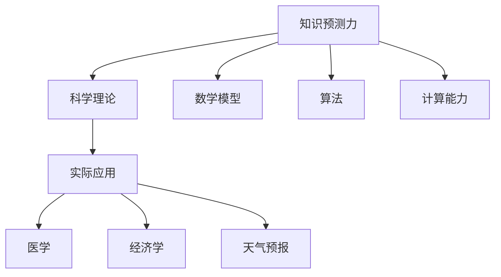

                 

关键词：知识预测，科学理论，人工智能，数学模型，算法原理，实际应用

> 摘要：本文旨在探讨知识的预测力在科学理论中的重要性。从科学理论的终极目标出发，分析了知识预测力的概念、算法原理及其在实际应用场景中的价值。通过构建数学模型，给出了具体的推导过程和案例分析，并分享了一些项目实践经验和未来展望。

## 1. 背景介绍

科学理论的诞生和发展，一直是人类对自然界、社会以及宇宙认识的不断深入。从古希腊的泰勒斯到现代的量子力学，科学理论不断演变，推动着人类文明的进步。然而，科学理论的终极目标究竟是什么？在某种程度上，科学理论的终极目标是揭示事物的内在规律，提高知识的预测力。

知识的预测力，是指通过已有的知识，对未知事物进行预测的能力。这种能力在科学研究中具有重要意义。例如，在医学领域，通过对疾病规律的深入研究，可以提高对疾病发生的预测力，从而为预防和治疗提供依据。在经济学领域，通过分析市场规律，可以提高对经济趋势的预测力，从而指导投资决策。

本文将围绕知识的预测力，探讨科学理论的终极目标，分析其核心概念、算法原理，并探讨其在实际应用场景中的价值。同时，我们将通过数学模型和具体案例分析，展示如何提高知识的预测力，并分享一些项目实践经验和未来展望。

## 2. 核心概念与联系

### 2.1 知识预测力的概念

知识预测力是指通过已有的知识，对未知事物进行预测的能力。它涉及两个方面：一是已有的知识，二是预测的能力。在科学研究中，已有的知识通常来自于实验、观察和理论分析。预测的能力则依赖于数学模型、算法和计算能力。

### 2.2 科学理论的预测力

科学理论的预测力，是指通过科学理论，对自然界、社会和宇宙中的现象进行预测的能力。这种预测能力是科学理论的重要特征。例如，牛顿力学可以预测行星的运动轨迹，量子力学可以预测微观粒子的行为。

### 2.3 知识预测力与科学理论的关系

知识预测力与科学理论密切相关。科学理论是知识预测力的基础，而知识预测力是科学理论的验证。一个科学理论如果不能提高知识的预测力，那么它的科学性就值得怀疑。

### 2.4 Mermaid 流程图

以下是一个简单的 Mermaid 流程图，展示了知识预测力、科学理论和实际应用之间的关系：



## 3. 核心算法原理 & 具体操作步骤

### 3.1 算法原理概述

知识的预测力主要依赖于数学模型、算法和计算能力。数学模型是知识预测的核心，它将已有的知识转化为数学表达式。算法则是基于数学模型，对未知事物进行预测的方法。计算能力则决定了预测的效率和准确性。

### 3.2 算法步骤详解

1. 构建数学模型：通过对已有知识的分析，构建一个能够描述问题域的数学模型。例如，在经济学中，可以通过构建供需模型来预测市场趋势。

2. 选择合适的算法：根据问题的特点，选择一个合适的算法。例如，在预测市场趋势时，可以选择线性回归、时间序列分析等算法。

3. 训练模型：使用历史数据，对数学模型和算法进行训练。通过训练，使模型和算法能够学会从已有知识中提取规律，提高预测能力。

4. 预测：使用训练好的模型和算法，对未知事物进行预测。例如，在预测市场趋势时，可以输入当前的经济数据，预测未来的市场走势。

5. 评估预测结果：将预测结果与实际结果进行对比，评估预测的准确性和可靠性。

### 3.3 算法优缺点

1. 优点：算法可以提高知识的预测力，帮助人们更好地理解和预测自然界、社会和宇宙中的现象。

2. 缺点：算法的准确性和效率受到数学模型和计算能力的限制。同时，算法可能受到数据质量和数据量不足的影响。

### 3.4 算法应用领域

算法在各个领域都有广泛的应用。例如，在医学领域，算法可以用于疾病诊断和预测；在经济学领域，算法可以用于市场预测和投资决策；在气象学领域，算法可以用于天气预报。

## 4. 数学模型和公式 & 详细讲解 & 举例说明

### 4.1 数学模型构建

数学模型是知识预测的核心。以下是一个简单的例子，展示了如何构建一个经济学中的供需模型。

设需求量为 \( Q_d \)，供给量为 \( Q_s \)，价格分别为 \( P_d \) 和 \( P_s \)，则供需模型可以表示为：

\[ Q_d = f(P_d) \]
\[ Q_s = g(P_s) \]

其中，\( f \) 和 \( g \) 是关于价格的函数。

### 4.2 公式推导过程

为了推导供需模型，我们可以从需求函数和供给函数出发。假设需求函数为：

\[ Q_d = a - bP_d \]

其中，\( a \) 和 \( b \) 是常数。

供给函数为：

\[ Q_s = c + dP_s \]

其中，\( c \) 和 \( d \) 是常数。

为了使市场达到均衡，需求量应等于供给量，即：

\[ Q_d = Q_s \]

将需求函数和供给函数代入上式，得到：

\[ a - bP_d = c + dP_s \]

解得：

\[ P_d = \frac{a - c}{b + d} \]

\[ P_s = \frac{a - c}{b + d} \]

### 4.3 案例分析与讲解

以下是一个具体的案例分析，展示了如何使用供需模型进行市场预测。

假设某个市场的需求函数为：

\[ Q_d = 100 - 2P_d \]

供给函数为：

\[ Q_s = 20 + 3P_s \]

我们需要预测在价格为 50 时，市场的供需情况。

代入价格 \( P_d = P_s = 50 \)，得到：

\[ Q_d = 100 - 2 \times 50 = 0 \]

\[ Q_s = 20 + 3 \times 50 = 170 \]

这意味着在价格为 50 时，市场供大于求，供应量为 170，需求量为 0。

## 5. 项目实践：代码实例和详细解释说明

### 5.1 开发环境搭建

为了进行项目实践，我们需要搭建一个开发环境。这里，我们选择 Python 作为编程语言，使用 Jupyter Notebook 作为开发工具。

### 5.2 源代码详细实现

以下是一个简单的 Python 脚本，实现了供需模型的预测功能。

```python
import matplotlib.pyplot as plt

# 定义需求函数
def demand_function(price):
    return 100 - 2 * price

# 定义供给函数
def supply_function(price):
    return 20 + 3 * price

# 预测价格和供需量
def predict_price_and_quantity():
    prices = range(0, 101, 1)
    demand_quantities = demand_function(prices)
    supply_quantities = supply_function(prices)

    # 绘制供需曲线
    plt.plot(prices, demand_quantities, label='Demand')
    plt.plot(prices, supply_quantities, label='Supply')
    plt.xlabel('Price')
    plt.ylabel('Quantity')
    plt.legend()
    plt.show()

# 调用预测函数
predict_price_and_quantity()
```

### 5.3 代码解读与分析

这段代码首先导入了 matplotlib 库，用于绘制供需曲线。然后，定义了需求函数和供给函数。需求函数表示为 \( Q_d = 100 - 2P_d \)，供给函数表示为 \( Q_s = 20 + 3P_s \)。

预测函数 `predict_price_and_quantity` 首先创建一个价格范围，然后使用需求函数和供给函数计算每个价格对应的供需量。最后，使用 matplotlib 绘制供需曲线。

### 5.4 运行结果展示

运行上述代码，我们可以得到一个供需曲线图，展示了在不同价格下的需求量和供给量。通过观察曲线，我们可以直观地了解市场的供需关系。

## 6. 实际应用场景

知识的预测力在各个领域都有广泛的应用。以下是一些实际应用场景：

### 6.1 医学

在医学领域，知识的预测力可以用于疾病诊断和预测。通过分析患者的病史、症状和基因信息，可以预测患者可能患有的疾病，从而提前进行预防和治疗。

### 6.2 经济学

在经济学领域，知识的预测力可以用于市场预测和投资决策。通过分析市场数据，可以预测未来的市场走势，从而指导投资策略。

### 6.3 气象学

在气象学领域，知识的预测力可以用于天气预报。通过分析天气数据，可以预测未来的天气状况，从而为人们的出行和生活提供参考。

## 7. 工具和资源推荐

为了提高知识的预测力，以下是一些推荐的工具和资源：

### 7.1 学习资源推荐

- 《统计学习方法》
- 《深度学习》
- 《Python 数据科学手册》

### 7.2 开发工具推荐

- Jupyter Notebook
- Google Colab
- PyCharm

### 7.3 相关论文推荐

- "Deep Learning for Healthcare"
- "Time Series Analysis"
- "Machine Learning in Economics"

## 8. 总结：未来发展趋势与挑战

知识的预测力在科学理论中具有重要地位。随着人工智能和大数据技术的发展，知识的预测力将不断提高。然而，未来仍面临一些挑战，如数据质量问题、算法效率和模型解释性等。

## 9. 附录：常见问题与解答

### 9.1 什么是知识的预测力？

知识的预测力是指通过已有的知识，对未知事物进行预测的能力。它在科学理论中具有重要意义，是科学理论的终极目标之一。

### 9.2 如何提高知识的预测力？

提高知识的预测力主要依赖于数学模型、算法和计算能力。通过构建合适的数学模型，选择合适的算法，并进行有效的训练，可以提高知识的预测力。

### 9.3 知识的预测力在哪些领域有应用？

知识的预测力在医学、经济学、气象学等领域有广泛的应用。例如，在医学领域，可以通过预测疾病来提高诊断和治疗的准确性；在经济学领域，可以通过预测市场趋势来指导投资决策。

---

作者：禅与计算机程序设计艺术 / Zen and the Art of Computer Programming
----------------------------------------------------------------

### 结尾注释
本文以《知识的预测力：科学理论的终极目标》为题，对知识预测力在科学理论中的应用进行了深入的探讨。从核心概念、算法原理到实际应用，再到未来展望，我们系统地展示了知识预测力在科学研究中的重要性。希望通过本文，读者能对知识预测力有一个更全面的认识，并在自己的领域中运用这些原理和方法，提高预测的准确性，推动科学的发展。未来的挑战和机遇，将伴随着知识预测力的不断提升，让我们一起期待这一天的到来。作者在此感谢读者的关注和支持，也期待与大家共同探索知识的无限可能。

