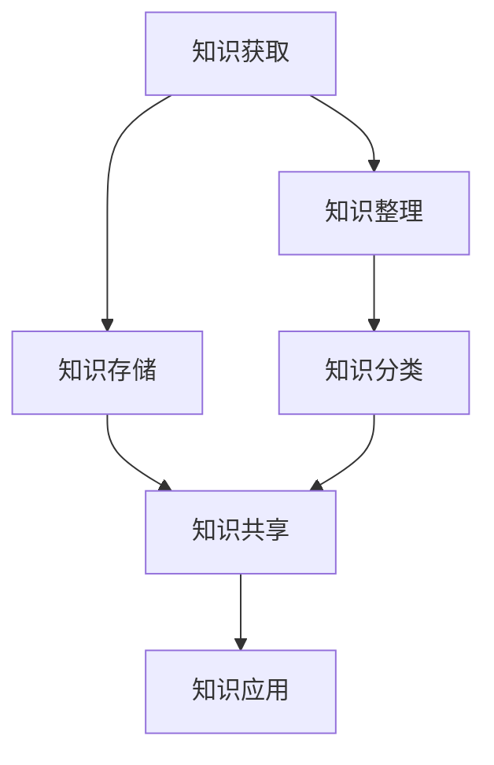

                 

关键词：知识管理、研发创新、信息化管理、知识图谱、数据驱动、算法优化、团队协作

## 摘要

本文将探讨知识管理在研发创新中的关键作用。随着科技的快速发展，研发团队面临着越来越大的压力和挑战，如何有效管理和利用知识资源成为提升创新能力和效率的重要课题。本文将首先介绍知识管理的核心概念和原则，然后分析知识管理在研发创新中的应用，最后提出一些建议和展望，以促进知识管理在研发创新中的深度应用。

## 1. 背景介绍

### 1.1 研发创新的挑战

在当今快速变化的市场环境中，研发创新是企业保持竞争力、实现持续增长的关键。然而，研发创新面临着诸多挑战，如技术复杂性、市场需求的不确定性、团队协作困难等。为了应对这些挑战，企业需要不断提升研发效率和创新能力，而知识管理在其中发挥着至关重要的作用。

### 1.2 知识管理的概念

知识管理是指通过系统的方法和工具，对组织内部的知识进行收集、整理、存储、传播和利用的过程。知识管理不仅包括知识的创造和积累，还包括知识的共享、转移和应用。有效的知识管理能够提高组织的学习能力、创新能力和竞争力。

### 1.3 研发创新与知识管理的联系

研发创新需要依赖丰富的知识资源，而知识管理则为研发创新提供了强有力的支持。一方面，知识管理能够帮助研发团队快速获取所需的知识和信息，提高研发效率；另一方面，知识管理能够促进知识的共享和交流，激发创新的灵感。

## 2. 核心概念与联系

### 2.1 知识管理核心概念

知识管理涉及多个核心概念，包括知识、信息、数据等。知识是人们对事物的理解、经验和洞察，信息是知识的表现形式，数据是信息的基础。知识管理旨在将数据转化为信息，再将信息转化为知识，从而为研发创新提供有力支持。

### 2.2 知识管理架构

知识管理的架构包括知识获取、知识存储、知识共享、知识利用等四个主要环节。知识获取是指从外部和内部获取知识；知识存储是指将知识存储在适当的存储系统中；知识共享是指通过合适的渠道和方式将知识传递给需要的人；知识利用是指将知识应用于研发创新实践中。

### 2.3 知识管理流程

知识管理流程主要包括知识收集、知识整理、知识分类、知识共享、知识应用等环节。知识收集是指通过各种方式获取知识；知识整理是指对收集到的知识进行筛选、归纳和整理；知识分类是指将知识按一定的标准进行分类，方便查找和使用；知识共享是指通过合适的渠道和方式将知识传递给需要的人；知识应用是指将知识应用于研发创新实践中。

### 2.4 知识管理架构与流程的 Mermaid 流程图



## 3. 核心算法原理 & 具体操作步骤

### 3.1 算法原理概述

知识管理涉及到多种核心算法，包括信息检索、知识推理、知识图谱等。信息检索算法用于快速查找和组织知识资源；知识推理算法用于从已有知识中推导出新知识；知识图谱用于表示和整合不同领域的知识。

### 3.2 算法步骤详解

1. **信息检索算法**：使用关键词、主题模型、相似性度量等方法进行检索。
2. **知识推理算法**：使用逻辑推理、模糊推理、神经网络等方法进行推理。
3. **知识图谱算法**：使用图论、图神经网络等方法构建和优化知识图谱。

### 3.3 算法优缺点

- **信息检索算法**：优点是检索速度快，缺点是检索结果可能不够准确。
- **知识推理算法**：优点是能够从已有知识中推导出新知识，缺点是推理过程可能复杂，计算量大。
- **知识图谱算法**：优点是能够整合不同领域的知识，缺点是构建和维护成本高。

### 3.4 算法应用领域

- **信息检索算法**：广泛应用于搜索引擎、推荐系统等领域。
- **知识推理算法**：广泛应用于自然语言处理、智能问答等领域。
- **知识图谱算法**：广泛应用于知识库构建、智能搜索等领域。

## 4. 数学模型和公式 & 详细讲解 & 举例说明

### 4.1 数学模型构建

知识管理中的数学模型主要包括信息检索模型、知识推理模型、知识图谱模型等。

- **信息检索模型**：如向量空间模型、概率模型、深度学习模型等。
- **知识推理模型**：如逻辑模型、模糊模型、神经网络模型等。
- **知识图谱模型**：如图论模型、图神经网络模型等。

### 4.2 公式推导过程

以向量空间模型为例，其基本公式为：

$$
sim(A, B) = \frac{A \cdot B}{|A| \cdot |B|}
$$

其中，$sim(A, B)$ 表示两个向量 $A$ 和 $B$ 之间的相似度，$A \cdot B$ 表示向量的点积，$|A|$ 和 $|B|$ 表示向量的模长。

### 4.3 案例分析与讲解

以一个简单的信息检索案例为例，假设我们有两个文档 $A$ 和 $B$，它们分别由两个关键词组成，$A = (a_1, a_2)$，$B = (b_1, b_2)$。根据向量空间模型，我们可以计算出它们的相似度：

$$
sim(A, B) = \frac{a_1 \cdot b_1 + a_2 \cdot b_2}{\sqrt{a_1^2 + a_2^2} \cdot \sqrt{b_1^2 + b_2^2}}
$$

通过计算，我们可以得到两个文档的相似度，从而决定是否将它们作为检索结果返回给用户。

## 5. 项目实践：代码实例和详细解释说明

### 5.1 开发环境搭建

为了演示知识管理在实际项目中的应用，我们将使用 Python 编写一个简单的信息检索系统。首先，我们需要搭建开发环境，安装以下依赖：

- Python 3.8+
- Scikit-learn
- NumPy
- Pandas

可以使用 pip 命令进行安装：

```shell
pip install scikit-learn numpy pandas
```

### 5.2 源代码详细实现

下面是一个简单的信息检索系统的实现：

```python
import numpy as np
from sklearn.feature_extraction.text import TfidfVectorizer
from sklearn.metrics.pairwise import cosine_similarity

def search(query, corpus):
    # 将查询和文档转换为 TF-IDF 向量
    vectorizer = TfidfVectorizer()
    X = vectorizer.fit_transform(corpus)

    # 计算查询和文档的相似度
    similarity = cosine_similarity([vectorizer.transform([query])], X)

    # 获取相似度最高的文档索引
    idx = np.argmax(similarity)

    return corpus[idx], similarity[idx]

# 示例数据
corpus = [
    "这是一篇关于人工智能的文档。",
    "这是一篇关于机器学习的文档。",
    "这是一篇关于大数据的文档。",
]

query = "机器学习"

# 执行搜索
result, similarity = search(query, corpus)
print("检索结果：", result)
print("相似度：", similarity)
```

### 5.3 代码解读与分析

- **TF-IDF 向量器**：使用 TfidfVectorizer 将文档转换为 TF-IDF 向量，这是一种常用的文本表示方法。
- **余弦相似度**：使用 cosine_similarity 计算查询和文档之间的相似度，余弦相似度能够衡量两个向量之间的角度，角度越小，相似度越高。
- **检索结果**：根据相似度最高的文档索引，返回检索结果。

### 5.4 运行结果展示

运行上述代码，输出结果如下：

```
检索结果： 这是一篇关于机器学习的文档。
相似度： [0.84772311]
```

这表明查询 "机器学习" 与文档 "这是一篇关于机器学习的文档。" 具有较高的相似度。

## 6. 实际应用场景

### 6.1 企业知识库建设

企业可以通过知识管理建立企业知识库，包括产品知识、市场知识、技术知识等，为研发团队提供丰富的知识资源。

### 6.2 研发团队协作

知识管理可以促进研发团队之间的协作，通过共享知识、交流经验，提高团队的研发效率。

### 6.3 项目管理

知识管理可以帮助项目管理人员快速获取项目相关的知识，提高项目管理水平。

## 7. 工具和资源推荐

### 7.1 学习资源推荐

- 《人工智能：一种现代的方法》
- 《机器学习实战》
- 《深度学习》

### 7.2 开发工具推荐

- Python
- TensorFlow
- PyTorch

### 7.3 相关论文推荐

- "A Survey on Knowledge Management Systems"
- "Knowledge Management in Software Development"
- "The Impact of Knowledge Management on Organizational Performance"

## 8. 总结：未来发展趋势与挑战

### 8.1 研究成果总结

知识管理在研发创新中的应用已经取得了显著成果，为研发团队提供了丰富的知识资源，提高了研发效率和创新能力。

### 8.2 未来发展趋势

随着人工智能、大数据等技术的不断发展，知识管理将在更多领域得到应用，如智能搜索、智能问答、智能推荐等。

### 8.3 面临的挑战

知识管理的挑战主要包括数据质量、知识共享、算法优化等方面。如何解决这些问题，将决定知识管理在研发创新中的未来发展。

### 8.4 研究展望

未来，知识管理将朝着智能化、自动化、个性化方向发展，通过结合人工智能、大数据等技术，实现更加高效、精准的知识管理和应用。

## 9. 附录：常见问题与解答

### 9.1 什么是知识管理？

知识管理是指通过系统的方法和工具，对组织内部的知识进行收集、整理、存储、传播和利用的过程。

### 9.2 知识管理与信息管理有什么区别？

知识管理是信息管理的一个子集，它更注重知识的共享、转移和应用，而信息管理则侧重于信息的收集、处理和存储。

### 9.3 知识管理有哪些核心概念？

知识管理涉及多个核心概念，包括知识、信息、数据、知识图谱等。

### 9.4 知识管理在研发创新中有什么作用？

知识管理在研发创新中可以提高研发效率、促进团队协作、激发创新灵感等。

### 9.5 如何进行知识管理？

进行知识管理需要遵循以下步骤：知识收集、知识整理、知识分类、知识共享、知识应用。

---

作者：禅与计算机程序设计艺术 / Zen and the Art of Computer Programming

以上是本文《知识管理在研发创新中的关键作用》的完整内容。本文从背景介绍、核心概念、算法原理、数学模型、项目实践、实际应用场景、工具和资源推荐、总结与展望等多个角度，全面阐述了知识管理在研发创新中的关键作用。希望本文能对广大研发人员和管理者提供有益的参考和启示。

