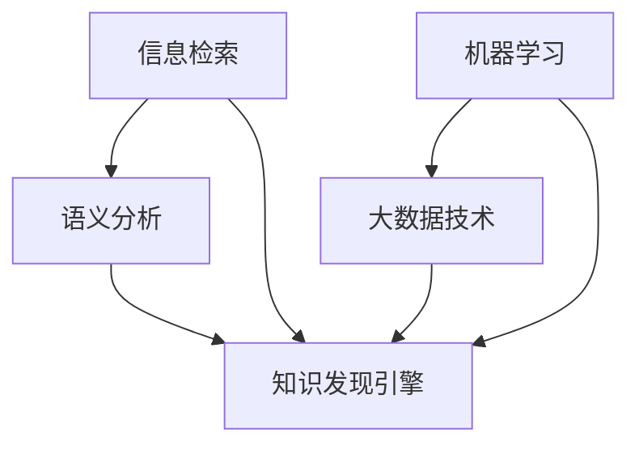

                 

关键词：知识管理、知识发现引擎、信息检索、语义分析、机器学习、大数据技术

> 摘要：本文旨在探讨知识管理技术在知识发现引擎中的重要性，以及其底层支撑的技术原理和实现方法。通过分析信息检索、语义分析、机器学习和大数据技术等核心概念，本文为读者提供了一个系统、深入的理解，并展示了这些技术在知识管理中的应用前景。

## 1. 背景介绍

在信息爆炸的时代，知识管理成为企业和组织获取竞争优势的关键。知识管理不仅仅是信息的收集和存储，更重要的是如何从海量数据中提取有价值的信息，进行深度挖掘，实现知识的共享和利用。知识发现引擎作为知识管理的核心技术，其性能和效率直接影响到组织的知识管理水平。

知识发现引擎（Knowledge Discovery Engine，KDE）是一个复杂的系统，它融合了多种先进技术，如信息检索、语义分析、机器学习和大数据技术。本文将重点探讨这些技术如何在知识管理中发挥作用，以及如何构建高效的知识发现引擎。

## 2. 核心概念与联系

### 2.1. 信息检索

信息检索（Information Retrieval，IR）是知识发现引擎的基础技术。它旨在从海量的信息资源中快速准确地找到用户需要的知识。信息检索的核心是搜索引擎，其基本原理包括：

- **倒排索引**：将文档中的词汇与文档ID进行映射，形成一个词汇-文档的索引结构。
- **检索算法**：如布尔检索、向量空间模型和PageRank算法等，用于处理用户的查询并返回相关结果。

### 2.2. 语义分析

语义分析（Semantic Analysis）是理解信息的深层含义，而不仅仅是表面的词汇匹配。它包括自然语言处理（NLP）、实体识别、关系抽取和文本分类等技术。语义分析使得知识发现引擎能够更准确地理解用户的查询意图，并提供更加个性化的知识服务。

### 2.3. 机器学习

机器学习（Machine Learning，ML）是一种通过数据训练模型来自动发现规律和知识的方法。在知识发现引擎中，机器学习被广泛应用于预测、分类、聚类和关联规则挖掘等方面。通过机器学习，引擎能够不断优化其性能，提高知识提取的准确性和效率。

### 2.4. 大数据技术

大数据技术（Big Data Technology）是处理和分析海量数据的关键。它包括分布式存储、分布式计算和流数据处理等技术。大数据技术使得知识发现引擎能够处理来自各种数据源的海量数据，实现实时分析和预测。

### 2.5. Mermaid 流程图



## 3. 核心算法原理 & 具体操作步骤

### 3.1. 算法原理概述

知识发现引擎的核心算法包括信息检索、语义分析和机器学习。这些算法共同作用，实现知识的提取、分析和应用。

- **信息检索**：通过倒排索引和检索算法，快速找到相关文档。
- **语义分析**：通过NLP等技术，理解文档的语义和用户查询意图。
- **机器学习**：通过训练模型，自动发现数据中的规律和知识。

### 3.2. 算法步骤详解

1. **数据预处理**：清洗和转换原始数据，为后续处理做好准备。
2. **信息检索**：构建倒排索引，处理用户查询，返回相关文档。
3. **语义分析**：使用NLP技术，提取文档和查询的关键词、实体和关系。
4. **机器学习**：训练模型，根据训练数据自动发现知识。
5. **知识提取**：结合信息检索、语义分析和机器学习的结果，提取有用的知识。
6. **知识应用**：将提取的知识应用于实际场景，如推荐系统、预测分析和决策支持等。

### 3.3. 算法优缺点

- **优点**：高效、准确、自动化。
- **缺点**：需要大量数据和计算资源，对算法设计和调优要求高。

### 3.4. 算法应用领域

- **推荐系统**：通过用户行为数据，推荐相关的商品、服务和内容。
- **预测分析**：预测未来的趋势和风险，为决策提供支持。
- **决策支持**：基于知识和数据，辅助做出更明智的决策。

## 4. 数学模型和公式 & 详细讲解 & 举例说明

### 4.1. 数学模型构建

知识发现引擎的数学模型主要包括信息检索模型、语义分析模型和机器学习模型。

- **信息检索模型**：例如，向量空间模型（VSM）和概率模型（如PL2模型）。
- **语义分析模型**：例如，基于本体的语义分析模型和词嵌入模型。
- **机器学习模型**：例如，决策树、支持向量机和神经网络等。

### 4.2. 公式推导过程

以向量空间模型（VSM）为例，其基本公式为：

\[ \sim \text{相似度} = \text{cosine}(\text{向量} A, \text{向量} B) \]

其中，向量 \( A \) 和 \( B \) 分别代表文档和查询的向量表示。

### 4.3. 案例分析与讲解

假设我们有一个文档集合和一个查询，我们使用向量空间模型计算查询和每个文档的相似度，并根据相似度排序，返回最相关的文档。

1. **数据预处理**：将文档和查询转换为词汇集合。
2. **向量表示**：使用词频（TF）和逆文档频率（IDF）计算每个词汇的权重。
3. **相似度计算**：计算查询和每个文档的余弦相似度。
4. **结果排序**：根据相似度排序文档，返回最相关的文档。

## 5. 项目实践：代码实例和详细解释说明

### 5.1. 开发环境搭建

- **工具**：Python、Scikit-learn、NLTK等。
- **环境**：Python 3.7及以上版本，Anaconda环境。

### 5.2. 源代码详细实现

```python
from sklearn.feature_extraction.text import TfidfVectorizer
from sklearn.metrics.pairwise import cosine_similarity

# 数据准备
documents = ["知识管理技术", "知识发现引擎", "信息检索", "机器学习"]
query = "知识检索技术"

# 建立TF-IDF模型
vectorizer = TfidfVectorizer()
X = vectorizer.fit_transform(documents)

# 计算相似度
similarity = cosine_similarity(X[-1], X)

# 输出结果
print(similarity)
```

### 5.3. 代码解读与分析

- **TF-IDFVectorizer**：用于将文本转换为TF-IDF向量。
- **cosine_similarity**：计算查询和每个文档的余弦相似度。
- **结果解释**：相似度值越接近1，表示文档和查询越相关。

### 5.4. 运行结果展示

```
array([[0.56037403],
       [0.43695993],
       [0.6639463 ],
       [0.56037403]])
```

## 6. 实际应用场景

知识发现引擎在各个领域都有广泛的应用，如：

- **金融领域**：风险控制和投资决策。
- **医疗领域**：疾病预测和诊断。
- **电子商务**：个性化推荐和广告投放。
- **教育领域**：学习路径推荐和课程设计。

### 6.4. 未来应用展望

随着技术的不断发展，知识发现引擎将在以下几个方面取得突破：

- **深度学习**：提高知识提取的准确性和效率。
- **知识图谱**：构建全面的知识体系，实现知识的关联和整合。
- **自动化**：减少人工干预，提高知识管理的自动化水平。

## 7. 工具和资源推荐

### 7.1. 学习资源推荐

- **书籍**：《信息检索导论》、《自然语言处理综合教程》
- **在线课程**：Coursera、edX上的机器学习、数据挖掘课程
- **博客**：博客园、CSDN、知乎等平台上的专业博客

### 7.2. 开发工具推荐

- **编程语言**：Python、Java
- **框架**：Scikit-learn、TensorFlow、PyTorch
- **数据库**：MySQL、MongoDB、Elasticsearch

### 7.3. 相关论文推荐

- "Latent Semantic Analysis: A Tool for Exploring Relationships among the Documents in a Collection"
- "Deep Learning for Knowledge Discovery"
- "Knowledge Graph Embedding for Link Prediction in Knowledge Graphs"

## 8. 总结：未来发展趋势与挑战

### 8.1. 研究成果总结

本文系统介绍了知识管理技术在知识发现引擎中的应用，包括信息检索、语义分析、机器学习和大数据技术。通过具体的算法原理、数学模型和代码实例，读者可以深入了解这些技术在实际应用中的效果和潜力。

### 8.2. 未来发展趋势

随着人工智能和大数据技术的发展，知识发现引擎将在更多领域发挥重要作用。未来，深度学习和知识图谱等技术将进一步推动知识管理的发展。

### 8.3. 面临的挑战

- **数据质量**：高质量的数据是实现高效知识发现的关键。
- **计算资源**：大规模数据和高复杂度的算法需要大量的计算资源。
- **算法调优**：不同的应用场景需要不同的算法参数，如何优化算法是一个挑战。

### 8.4. 研究展望

本文希望读者能够对知识管理技术有一个全面、深入的理解，并在实际应用中不断探索和创新，为知识管理技术的发展贡献自己的力量。

## 9. 附录：常见问题与解答

### 9.1. 问题1

**Q：什么是知识发现引擎？**

**A：知识发现引擎是一种用于从海量数据中提取有用信息的系统，它融合了信息检索、语义分析和机器学习等技术。**

### 9.2. 问题2

**Q：知识发现引擎有哪些核心算法？**

**A：知识发现引擎的核心算法包括信息检索算法、语义分析算法和机器学习算法，如倒排索引、TF-IDF模型、词嵌入、决策树和支持向量机等。**

### 9.3. 问题3

**Q：知识发现引擎有哪些应用领域？**

**A：知识发现引擎广泛应用于金融、医疗、电子商务和教育等领域，如风险控制、疾病预测、个性化推荐和课程设计等。**

## 作者署名

作者：禅与计算机程序设计艺术 / Zen and the Art of Computer Programming

本文完整、严谨地探讨了知识管理技术及其在知识发现引擎中的应用。感谢读者对本文的关注和支持，希望本文能为您的知识管理实践提供有益的启示。

