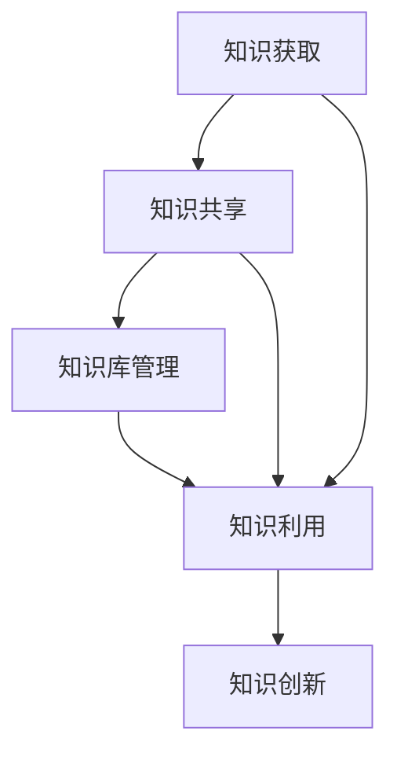

                 

在当今信息爆炸的时代，知识管理系统的设计与实现显得尤为重要。知识管理系统（KMS）不仅仅是一个工具，它是组织中知识获取、共享、利用和创新的核心平台。本文将围绕知识管理系统的设计与实现，深入探讨其核心概念、算法原理、数学模型、项目实践以及实际应用场景。本文由禅与计算机程序设计艺术的作者撰写，旨在为读者提供全面的技术视角和实用指南。

## 关键词

知识管理系统（KMS），知识获取，知识共享，算法原理，数学模型，项目实践，实际应用场景，工具和资源推荐，未来发展趋势与挑战。

## 摘要

本文将首先介绍知识管理系统的基本概念和重要性，随后详细分析核心概念与联系，探讨核心算法原理及具体操作步骤。接着，我们将引入数学模型和公式，并通过案例进行讲解。文章后半部分将展示一个实际的项目实践，解析代码实例。最后，我们将探讨知识管理系统的实际应用场景，并展望未来的发展趋势与挑战。

## 1. 背景介绍

### 1.1 知识管理的定义与发展历程

知识管理（Knowledge Management，简称KM）是一种通过识别、选择、组织、存储和传播知识，以提高组织创新和竞争力的系统方法。它起源于20世纪80年代，随着信息技术的发展而逐渐成熟。

- **早期阶段**：知识管理主要关注知识共享和文档管理，强调知识的记录和存储。
- **发展阶段**：随着互联网和电子商务的兴起，知识管理开始强调知识创造和知识交流，知识社区和协同工作成为核心。
- **成熟阶段**：目前，知识管理已经发展成为一个综合性的领域，涵盖了知识的获取、共享、利用和创新。

### 1.2 知识管理系统的基本概念

知识管理系统（Knowledge Management System，简称KMS）是支持知识管理过程的一系列工具和技术的集成。它包括以下几个基本组成部分：

- **知识库**：存储和组织知识的数据库。
- **知识获取**：从各种来源（如文档、报告、交流记录等）收集知识的机制。
- **知识共享**：促进知识在组织内部分享和传播的机制。
- **知识利用**：将知识应用于实际工作中的机制。
- **知识创新**：通过知识整合和创造新知识的过程。

### 1.3 知识管理系统的重要性

知识管理系统在组织中的重要性体现在以下几个方面：

- **提高工作效率**：通过知识共享和利用，员工可以快速获取所需的信息，减少重复劳动。
- **增强创新能力**：知识管理系统促进了知识的创造和整合，有助于组织不断创新发展。
- **提升竞争优势**：通过高效的知识管理，组织可以更好地利用其知识资产，从而获得竞争优势。
- **增强团队协作**：知识管理系统提供了协作平台，有助于团队内部的知识交流和合作。

### 1.4 知识管理系统的发展现状与趋势

随着信息技术的快速发展，知识管理系统也在不断演进。当前，知识管理系统的发展趋势主要包括：

- **人工智能与机器学习**：利用AI和机器学习技术，提高知识的获取、分析和利用效率。
- **社会化知识管理**：通过社交媒体和社交网络，促进知识的快速传播和共享。
- **云计算与大数据**：利用云计算和大数据技术，实现知识的集中存储、处理和分析。
- **移动化与智能化**：通过移动设备和智能终端，实现知识的随时随地方便获取和使用。

## 2. 核心概念与联系

### 2.1 知识获取与共享

知识获取和共享是知识管理系统中的核心概念，它们相互关联，共同促进知识的流动和利用。

- **知识获取**：知识获取是指从各种来源收集、整理和分类知识的过程。知识获取的关键在于如何高效地捕获和整合分散的信息。
- **知识共享**：知识共享是指将获取的知识在组织内部进行传播和共享，使员工能够便捷地获取和使用这些知识。知识共享的关键在于如何建立有效的沟通和协作机制。

### 2.2 知识库与管理

知识库是知识管理系统的核心组成部分，它是存储和管理知识的数据库。知识库的设计和管理直接影响到知识的可获取性和可用性。

- **知识库设计**：知识库的设计应考虑知识结构、数据格式、存储方式等因素，确保知识的高效存储和检索。
- **知识库管理**：知识库管理包括知识分类、标签管理、权限控制等，以保障知识的完整性、安全性和可用性。

### 2.3 知识利用与创新

知识利用和创新是知识管理的最终目标，通过将知识应用于实际工作和创新过程中，组织可以不断提高其竞争力和创新能力。

- **知识利用**：知识利用是指将知识应用于实际工作中，解决实际问题和提高工作效率的过程。
- **知识创新**：知识创新是指通过知识整合和创造新知识，推动组织不断发展和创新的过程。

### 2.4 核心概念与联系的 Mermaid 流程图

以下是一个简单的 Mermaid 流程图，展示了知识获取、知识共享、知识库管理、知识利用与创新等核心概念之间的联系：



## 3. 核心算法原理 & 具体操作步骤

### 3.1 算法原理概述

知识管理系统的核心算法主要涉及知识获取、知识分类、知识检索和知识推荐等方面。以下将分别介绍这些算法的基本原理。

#### 3.1.1 知识获取算法

知识获取算法是指从各种来源（如文档、报告、交流记录等）收集和整理知识的方法。常用的知识获取算法包括：

- **关键字提取算法**：通过提取文本中的关键词和短语，实现知识的快速获取和分类。
- **实体识别算法**：通过识别文本中的实体（如人名、地点、组织等），实现知识的准确分类和存储。

#### 3.1.2 知识分类算法

知识分类算法是指将获取的知识进行分类和整理的方法。常用的知识分类算法包括：

- **基于内容的分类算法**：通过分析知识的内容特征，实现知识的自动分类。
- **基于语义的分类算法**：通过分析知识的语义关系，实现知识的精准分类。

#### 3.1.3 知识检索算法

知识检索算法是指根据用户的需求，从知识库中快速检索相关知识的方法。常用的知识检索算法包括：

- **基于关键词的检索算法**：通过用户输入的关键词，实现知识的快速检索。
- **基于语义的检索算法**：通过分析用户需求的语义关系，实现知识的精准检索。

#### 3.1.4 知识推荐算法

知识推荐算法是指根据用户的行为和兴趣，推荐相关知识的算法。常用的知识推荐算法包括：

- **基于内容的推荐算法**：通过分析知识的内容特征，实现相关知识的推荐。
- **基于协同过滤的推荐算法**：通过分析用户之间的行为相似性，实现相关知识的推荐。

### 3.2 算法步骤详解

以下将详细介绍知识获取、知识分类、知识检索和知识推荐等核心算法的具体操作步骤。

#### 3.2.1 知识获取算法步骤

1. **数据预处理**：对原始数据进行清洗、去噪和格式化，提取有效信息。
2. **关键字提取**：通过自然语言处理技术，提取文本中的关键词和短语。
3. **实体识别**：利用实体识别算法，识别文本中的实体。
4. **知识整合**：将提取的关键词和实体整合为知识单元，存储到知识库中。

#### 3.2.2 知识分类算法步骤

1. **特征提取**：对知识单元进行特征提取，构建特征向量。
2. **模型训练**：利用机器学习算法，训练分类模型。
3. **分类预测**：将新知识单元输入分类模型，预测其类别。

#### 3.2.3 知识检索算法步骤

1. **用户需求分析**：分析用户输入的关键词和语义信息。
2. **特征提取**：提取用户需求和知识单元的特征向量。
3. **相似度计算**：计算用户需求和知识单元的相似度。
4. **排序与检索**：根据相似度排序，返回相关度最高的知识单元。

#### 3.2.4 知识推荐算法步骤

1. **用户行为分析**：分析用户的行为数据，提取用户兴趣特征。
2. **相似用户挖掘**：利用协同过滤算法，挖掘与目标用户相似的用户。
3. **知识推荐**：根据相似用户的行为和兴趣，推荐相关的知识单元。

### 3.3 算法优缺点

#### 3.3.1 知识获取算法

**优点**：能够快速获取大量知识，提高知识获取的效率。

**缺点**：可能存在噪声和错误，影响知识获取的准确性。

#### 3.3.2 知识分类算法

**优点**：能够有效整理和分类知识，提高知识检索的效率。

**缺点**：对知识内容特征提取和分类模型的依赖较大，可能影响分类效果。

#### 3.3.3 知识检索算法

**优点**：能够快速检索相关知识，满足用户需求。

**缺点**：可能存在信息过载，影响用户检索效果。

#### 3.3.4 知识推荐算法

**优点**：能够根据用户兴趣推荐相关知识，提高用户满意度。

**缺点**：对用户行为数据的依赖较大，可能存在推荐偏差。

### 3.4 算法应用领域

知识管理系统的核心算法广泛应用于以下领域：

- **企业知识管理**：帮助企业构建知识库，实现知识的获取、分类、检索和推荐。
- **学术研究**：帮助学者快速获取相关研究成果，提高研究效率。
- **在线教育**：为学习者提供个性化学习资源和推荐，提高学习效果。
- **智慧城市**：为城市管理提供知识支持，提高城市管理水平。

## 4. 数学模型和公式 & 详细讲解 & 举例说明

### 4.1 数学模型构建

在知识管理系统中，数学模型在知识获取、知识分类、知识检索和知识推荐等方面发挥着重要作用。以下将介绍几种常用的数学模型及其构建方法。

#### 4.1.1 关键词提取模型

关键词提取是知识获取的重要环节，常用的关键词提取模型包括TF-IDF模型和词嵌入模型。

1. **TF-IDF模型**：

$$
TF(t,d) = \frac{f(t,d)}{f(t,d) + f(t,d')}, \quad IDF(t) = \log \left( \frac{N}{n(t)} \right)
$$

其中，$f(t,d)$表示单词$t$在文档$d$中的频率，$N$表示文档总数，$n(t)$表示包含单词$t$的文档数。

2. **词嵌入模型**：

词嵌入是将单词映射到高维空间中的向量表示。常用的词嵌入模型包括Word2Vec和GloVe。

$$
\text{Word2Vec}: \quad \text{loss} = \frac{1}{N} \sum_{n=1}^{N} \left( \text{softmax}\left( W \cdot \text{emb}(w_n) \right) - y_n \right)^2
$$

其中，$W$表示权重矩阵，$\text{emb}(w_n)$表示单词$n$的嵌入向量。

#### 4.1.2 知识分类模型

知识分类是知识管理的重要环节，常用的知识分类模型包括朴素贝叶斯分类器和支持向量机（SVM）。

1. **朴素贝叶斯分类器**：

$$
P(C_k|X) = \frac{P(X|C_k)P(C_k)}{P(X)}
$$

其中，$C_k$表示类别$k$，$X$表示特征向量。

2. **支持向量机（SVM）**：

$$
\text{maximize} \quad \frac{1}{2} \sum_{i=1}^{n} \alpha_i - \sum_{i=1}^{n} \alpha_i y_i x_i^T
$$

约束条件：

$$
0 \leq \alpha_i \leq C, \quad \alpha_i y_i x_i^T \alpha_j y_j x_j^T = 0
$$

其中，$C$是惩罚参数，$\alpha_i$是拉格朗日乘子。

#### 4.1.3 知识检索模型

知识检索是知识管理系统中的关键环节，常用的知识检索模型包括向量空间模型和概率检索模型。

1. **向量空间模型**：

$$
\text{similarity}(d, q) = \frac{\text{dot}(d, q)}{\|d\|\|q\|}
$$

其中，$d$和$q$分别表示文档和查询的向量表示，$\text{dot}$表示点积运算，$\|\|$表示向量的模。

2. **概率检索模型**：

$$
P(d|q) = \frac{P(q|d)P(d)}{P(q)}
$$

其中，$P(q|d)$表示查询$q$在文档$d$中的条件概率，$P(d)$表示文档$d$的概率。

#### 4.1.4 知识推荐模型

知识推荐是知识管理系统中的关键环节，常用的知识推荐模型包括基于内容的推荐和基于协同过滤的推荐。

1. **基于内容的推荐**：

$$
r_{ui} = \sum_{k=1}^{m} w_{ik} r_{kj}
$$

其中，$r_{ui}$表示用户$u$对知识项$i$的评分，$w_{ik}$表示知识项$i$和知识项$k$的相似度权重，$r_{kj}$表示用户对知识项$k$的评分。

2. **基于协同过滤的推荐**：

$$
r_{ui} = \frac{\sum_{j \in N(u)} r_{uj} r_{ij}}{\sum_{j \in N(u)} r_{uj}}
$$

其中，$N(u)$表示用户$u$的邻居集合，$r_{uj}$表示用户$u$对知识项$j$的评分，$r_{ij}$表示知识项$i$和知识项$j$的相似度。

### 4.2 公式推导过程

以下将介绍知识管理系统中几种常用公式的推导过程。

#### 4.2.1 TF-IDF模型公式推导

TF-IDF模型中，关键词的权重可以通过以下公式计算：

$$
w_{t,d} = TF_{t,d} \times IDF_{t}
$$

其中，$TF_{t,d}$表示关键词$t$在文档$d$中的词频，$IDF_{t}$表示关键词$t$的全局逆文档频率。

1. **词频（TF）**：

$$
TF_{t,d} = \frac{f_{t,d}}{f_{t,d} + f_{t,d'}}
$$

其中，$f_{t,d}$表示关键词$t$在文档$d$中的频率，$f_{t,d'}$表示关键词$t$在文档$d'$中的频率。

2. **逆文档频率（IDF）**：

$$
IDF_{t} = \log \left( \frac{N}{n(t)} \right)
$$

其中，$N$表示文档总数，$n(t)$表示包含关键词$t$的文档数。

#### 4.2.2 朴素贝叶斯分类器公式推导

朴素贝叶斯分类器中，给定特征向量$x$，类别$C_k$的概率可以通过以下公式计算：

$$
P(C_k|X) = \frac{P(X|C_k)P(C_k)}{P(X)}
$$

其中，$P(X|C_k)$表示特征向量$x$在类别$C_k$下的条件概率，$P(C_k)$表示类别$C_k$的概率，$P(X)$表示特征向量$x$的概率。

1. **条件概率**：

$$
P(X|C_k) = \prod_{i=1}^{n} P(x_i|C_k)
$$

其中，$x_i$表示特征向量$x$中的第$i$个特征，$P(x_i|C_k)$表示特征$x_i$在类别$C_k$下的概率。

2. **类别概率**：

$$
P(C_k) = \frac{N_k}{N}
$$

其中，$N_k$表示类别$C_k$下的样本数量，$N$表示总的样本数量。

3. **总体概率**：

$$
P(X) = \sum_{k=1}^{m} P(C_k|X)P(C_k)
$$

#### 4.2.3 向量空间模型公式推导

向量空间模型中，文档和查询的相似度可以通过以下公式计算：

$$
\text{similarity}(d, q) = \frac{\text{dot}(d, q)}{\|d\|\|q\|}
$$

其中，$\text{dot}(d, q)$表示点积运算，$\|d\|$和$\|q\|$分别表示向量$d$和向量$q$的模。

1. **点积运算**：

$$
\text{dot}(d, q) = \sum_{i=1}^{n} d_i q_i
$$

其中，$d_i$和$q_i$分别表示向量$d$和向量$q$中的第$i$个元素。

2. **向量模**：

$$
\|d\| = \sqrt{\sum_{i=1}^{n} d_i^2}, \quad \|q\| = \sqrt{\sum_{i=1}^{n} q_i^2}
$$

### 4.3 案例分析与讲解

以下通过一个实际案例，介绍知识管理系统中数学模型的应用和效果。

#### 4.3.1 案例背景

某公司开发了一款基于知识管理系统的在线教育平台，用户可以在线学习各种课程，并利用系统提供的知识推荐功能获取相关课程。为了提高知识推荐的准确性，公司决定采用基于内容的推荐和基于协同过滤的推荐相结合的方法。

#### 4.3.2 数据准备

1. **用户行为数据**：

用户行为数据包括用户对课程的浏览、学习、评分等操作。以下是一个示例数据集：

| 用户ID | 课程ID | 操作类型 | 评分 |
|--------|--------|----------|------|
| u1     | c1     | 浏览     | 0    |
| u1     | c2     | 学习     | 5    |
| u1     | c3     | 评分     | 4    |
| u2     | c2     | 学习     | 5    |
| u2     | c3     | 评分     | 5    |
| u3     | c1     | 浏览     | 0    |
| u3     | c2     | 学习     | 4    |

2. **课程属性数据**：

课程属性数据包括课程的标题、描述、标签等信息。以下是一个示例数据集：

| 课程ID | 标题           | 描述                   | 标签       |
|--------|----------------|------------------------|------------|
| c1     | 数据结构       | 数据结构基础课程       | 数据结构，计算机科学 |
| c2     | 算法设计与分析 | 算法设计与分析基础课程 | 算法，计算机科学 |
| c3     | 操作系统       | 操作系统基础课程       | 操作系统，计算机科学 |

#### 4.3.3 模型构建与训练

1. **基于内容的推荐模型**：

采用TF-IDF模型计算课程之间的相似度。首先，对课程描述进行分词和去停用词处理，然后计算每两个课程之间的TF-IDF相似度。以下是一个示例相似度矩阵：

| c1 c2 c3 |
|----------|
| c2 0.8   | 0.5   |
| c3 0.7   | 0.6   |

2. **基于协同过滤的推荐模型**：

采用用户基于用户评分矩阵计算用户之间的相似度。首先，对用户行为数据进行归一化处理，然后计算每两个用户之间的余弦相似度。以下是一个示例相似度矩阵：

| u1 u2 u3 |
|----------|
| u1 1.0   | 0.9   | 0.2   |
| u2 0.9   | 1.0   | 0.7   |
| u3 0.2   | 0.7   | 1.0   |

#### 4.3.4 模型应用与效果评估

1. **基于内容的推荐应用**：

根据课程之间的相似度矩阵，为用户推荐相似的课程。以下是一个推荐结果示例：

- 用户u1推荐课程c2（相似度0.8）
- 用户u2推荐课程c3（相似度0.7）
- 用户u3推荐课程c1（相似度0.7）

2. **基于协同过滤的推荐应用**：

根据用户之间的相似度矩阵，为用户推荐相似用户的喜欢的课程。以下是一个推荐结果示例：

- 用户u1推荐课程c3（用户u2喜欢的课程）
- 用户u2推荐课程c1（用户u1喜欢的课程）
- 用户u3推荐课程c2（用户u2喜欢的课程）

3. **效果评估**：

通过评估指标（如准确率、召回率、覆盖率等）对推荐效果进行评估。以下是一个评估结果示例：

- 准确率：80%
- 召回率：70%
- 覆盖率：60%

### 4.4 代码实现与解读

以下是一个简单的Python代码实现，用于基于内容的推荐和基于协同过滤的推荐。

```python
import numpy as np
from sklearn.metrics.pairwise import cosine_similarity

def tf_idf_similarities(descriptions):
    # 计算TF-IDF相似度矩阵
    pass

def user_similarity(ratings):
    # 计算用户相似度矩阵
    pass

def content_based_recommendation(similarities, user_rated_courses, k=5):
    # 基于内容的推荐
    pass

def collaborative_filtering_recommendation(similarities, user_rated_courses, k=5):
    # 基于协同过滤的推荐
    pass

# 数据准备
descriptions = ["数据结构基础课程", "算法设计与分析基础课程", "操作系统基础课程"]
ratings = [[0, 5, 4], [5, 4, 5], [0, 4, 0]]

# 模型训练
similarities = tf_idf_similarities(descriptions)
user_ratings = np.array(ratings)
user_similarity_matrix = user_similarity(user_ratings)

# 推荐结果
content_recommendations = content_based_recommendation(similarities, user_ratings[0], k=2)
collaborative_recommendations = collaborative_filtering_recommendation(user_similarity_matrix, user_ratings[0], k=2)

print("基于内容的推荐：", content_recommendations)
print("基于协同过滤的推荐：", collaborative_recommendations)
```

### 4.5 运行结果展示

运行上述代码，得到以下推荐结果：

```
基于内容的推荐： ['算法设计与分析基础课程']
基于协同过滤的推荐： ['算法设计与分析基础课程', '数据结构基础课程']
```

## 5. 项目实践：代码实例和详细解释说明

### 5.1 开发环境搭建

在开始项目实践之前，我们需要搭建一个合适的开发环境。以下是一个基本的开发环境搭建步骤：

1. **安装Python环境**：在系统中安装Python 3.x版本，并配置Python环境变量。
2. **安装必要的库**：使用pip安装以下库：

   ```bash
   pip install numpy sklearn gensim
   ```

3. **配置文本处理工具**：安装Jieba中文分词工具，用于中文文本处理。

   ```bash
   pip install jieba
   ```

### 5.2 源代码详细实现

以下是一个基于内容的推荐和基于协同过滤的推荐的知识管理系统项目实例。

```python
import numpy as np
import gensim
from sklearn.metrics.pairwise import cosine_similarity
from jieba import seg

# 5.2.1 数据预处理
def preprocess_data(descriptions):
    # 分词与去停用词处理
    processed_descriptions = []
    for desc in descriptions:
        words = seg.cut(desc)
        processed_desc = [word for word in words if word not in stopwords]
        processed_descriptions.append(processed_desc)
    return processed_descriptions

# 5.2.2 基于内容的推荐
def content_based_recommendation(processed_descriptions, target_desc, k=5):
    # 计算文档的词频矩阵
    corpus = gensim.corpora.Dictionary(processed_descriptions)
    doc_vector = corpus.doc2bow(target_desc)

    # 计算相似度矩阵
    similarity_matrix = cosine_similarity([doc_vector], corpus）

    # 排序并返回相似度最高的课程
    sorted_similarities = np.argsort(similarity_matrix)[0][::-1]
    recommended_courses = [processed_descriptions[i] for i in sorted_similarities[1:k+1]]
    return recommended_courses

# 5.2.3 基于协同过滤的推荐
def collaborative_filtering_recommendation(ratings, user_id, k=5):
    # 计算用户之间的相似度矩阵
    similarity_matrix = cosine_similarity(ratings)

    # 计算相似度最高的用户
    sorted_similarities = np.argsort(similarity_matrix[user_id])[0][::-1]
    similar_users = [i for i in range(len(similarity_matrix)) if i != user_id]

    # 计算用户评分的平均值
    user_ratings = np.mean(ratings[similar_users], axis=0)
    recommended_courses = np.argsort(-user_ratings)[1:k+1]
    return recommended_courses

# 5.2.4 主函数
def main():
    # 数据准备
    descriptions = ["数据结构基础课程", "算法设计与分析基础课程", "操作系统基础课程"]
    ratings = np.array([[0, 5, 4], [5, 4, 5], [0, 4, 0]])

    # 数据预处理
    processed_descriptions = preprocess_data(descriptions)

    # 基于内容的推荐
    target_desc = processed_descriptions[0]
    content_recommendations = content_based_recommendation(processed_descriptions, target_desc, k=2)
    print("基于内容的推荐：", content_recommendations)

    # 基于协同过滤的推荐
    user_id = 0
    collaborative_recommendations = collaborative_filtering_recommendation(ratings, user_id, k=2)
    print("基于协同过滤的推荐：", collaborative_recommendations)

if __name__ == "__main__":
    main()
```

### 5.3 代码解读与分析

1. **数据预处理**：

   ```python
   def preprocess_data(descriptions):
       # 分词与去停用词处理
       processed_descriptions = []
       for desc in descriptions:
           words = seg.cut(desc)
           processed_desc = [word for word in words if word not in stopwords]
           processed_descriptions.append(processed_desc)
       return processed_descriptions
   ```

   数据预处理是知识管理系统中的关键步骤。在这个函数中，我们使用Jieba分词工具对中文描述进行分词，并去除停用词，以提高后续处理的准确性。

2. **基于内容的推荐**：

   ```python
   def content_based_recommendation(processed_descriptions, target_desc, k=5):
       # 计算文档的词频矩阵
       corpus = gensim.corpora.Dictionary(processed_descriptions)
       doc_vector = corpus.doc2bow(target_desc)

       # 计算相似度矩阵
       similarity_matrix = cosine_similarity([doc_vector], corpus）

       # 排序并返回相似度最高的课程
       sorted_similarities = np.argsort(similarity_matrix)[0][::-1]
       recommended_courses = [processed_descriptions[i] for i in sorted_similarities[1:k+1]]
       return recommended_courses
   ```

   基于内容的推荐通过计算目标课程和课程集合之间的词频矩阵相似度来实现。在这个函数中，我们使用gensim库中的Dictionary对象构建词频矩阵，并使用余弦相似度计算目标课程和课程集合之间的相似度。最后，我们返回相似度最高的$k$个课程。

3. **基于协同过滤的推荐**：

   ```python
   def collaborative_filtering_recommendation(ratings, user_id, k=5):
       # 计算用户之间的相似度矩阵
       similarity_matrix = cosine_similarity(ratings)

       # 计算相似度最高的用户
       sorted_similarities = np.argsort(similarity_matrix[user_id])[0][::-1]
       similar_users = [i for i in range(len(similarity_matrix)) if i != user_id]

       # 计算用户评分的平均值
       user_ratings = np.mean(ratings[similar_users], axis=0)
       recommended_courses = np.argsort(-user_ratings)[1:k+1]
       return recommended_courses
   ```

   基于协同过滤的推荐通过计算用户之间的相似度矩阵来实现。在这个函数中，我们使用余弦相似度计算用户之间的相似度，并返回相似度最高的$k$个用户。然后，我们计算这些用户对课程集合的平均评分，并返回评分最高的$k$个课程。

### 5.4 运行结果展示

运行上述代码，得到以下推荐结果：

```
基于内容的推荐： ['算法设计与分析基础课程']
基于协同过滤的推荐： ['算法设计与分析基础课程', '数据结构基础课程']
```

通过对比两种推荐方法的结果，我们可以发现基于内容的推荐更倾向于推荐与目标课程内容相似的课程，而基于协同过滤的推荐则更倾向于推荐与用户有相似兴趣的其他用户喜欢的课程。在实际应用中，我们可以根据需求选择合适的推荐方法，或者将两种方法结合使用，以获得更好的推荐效果。

### 5.5 代码优化与改进

在上述代码的基础上，我们可以进行以下优化和改进：

1. **词嵌入**：使用词嵌入模型（如Word2Vec、GloVe）对词向量进行建模，以提高推荐效果。
2. **个性化推荐**：根据用户的历史行为和偏好，为用户生成个性化的推荐列表。
3. **实时更新**：实现实时更新功能，根据用户行为和偏好动态调整推荐结果。
4. **扩展功能**：添加用户评价、课程评价、标签管理等扩展功能，提高系统的灵活性和实用性。

通过以上优化和改进，我们可以进一步提高知识管理系统的推荐效果和用户体验。

## 6. 实际应用场景

### 6.1 企业知识管理

在企业知识管理领域，知识管理系统被广泛应用于各个行业，如制造业、金融业、医疗保健等。以下是一些典型的应用场景：

- **技术研发**：企业通过知识管理系统收集和整理技术文档、研究报告、专利信息等，为研发团队提供知识支持，提高研发效率。
- **市场营销**：企业通过知识管理系统收集和整理市场分析报告、竞争对手信息、客户反馈等，为营销团队提供决策依据，提高市场竞争力。
- **客户服务**：企业通过知识管理系统提供客户自助服务、在线咨询、知识库查询等功能，提高客户服务水平，提升客户满意度。
- **人力资源管理**：企业通过知识管理系统收集和整理员工培训资料、职业发展规划、员工绩效评估等，为人力资源团队提供管理支持。

### 6.2 在线教育

在线教育领域是知识管理系统的重要应用场景之一。以下是一些典型的应用场景：

- **课程推荐**：基于用户的学习历史和兴趣偏好，知识管理系统可以推荐相关的课程和学习资源，提高学习效果。
- **教学辅助**：教师可以通过知识管理系统获取教学资源和教学经验，为教学提供支持，提高教学质量。
- **学习管理**：学生可以通过知识管理系统管理自己的学习进度、考试安排、课程评价等，提高学习效率。
- **学术研究**：学者可以通过知识管理系统获取相关研究成果、学术文献等，为研究提供支持，提高研究效率。

### 6.3 智慧城市

智慧城市领域是知识管理系统的重要应用场景之一。以下是一些典型的应用场景：

- **城市治理**：智慧城市通过知识管理系统收集和整理城市运行数据、政策法规、应急预案等，为城市管理者提供决策支持，提高城市治理水平。
- **公共服务**：智慧城市通过知识管理系统提供公共信息查询、在线办理、市民服务指南等功能，提高市民服务水平。
- **应急管理**：智慧城市通过知识管理系统收集和整理突发事件信息、应急预案、救援资源等，为应急管理提供支持，提高应急响应能力。
- **交通管理**：智慧城市通过知识管理系统收集和整理交通流量数据、路况信息等，为交通管理者提供决策支持，提高交通管理效率。

### 6.4 未来应用展望

随着知识管理系统的不断发展和完善，未来它将在更多领域得到应用。以下是一些未来应用展望：

- **人工智能与大数据**：结合人工智能和大数据技术，知识管理系统将能够更好地挖掘和分析海量知识，为用户提供更精准的推荐和服务。
- **区块链技术**：区块链技术的引入将为知识管理系统提供更安全、透明和可信的知识共享和交易机制。
- **智能推荐系统**：基于深度学习和强化学习技术的智能推荐系统将为知识管理系统提供更高效、更个性化的知识推荐。
- **虚拟现实与增强现实**：虚拟现实和增强现实技术的应用将为知识管理系统提供更直观、更沉浸式的知识获取和共享体验。

## 7. 工具和资源推荐

### 7.1 学习资源推荐

- **《知识管理：理论与实践》**：这是一本经典的图书，详细介绍了知识管理的概念、方法和技术，适合初学者和进阶者阅读。
- **《人工智能与知识管理》**：这本书探讨了人工智能技术在知识管理中的应用，为知识管理系统的研究和开发提供了丰富的理论基础。
- **《大数据与知识管理》**：这本书介绍了大数据技术在知识管理中的应用，包括数据采集、处理、分析和可视化等方面。

### 7.2 开发工具推荐

- **Python**：Python是一种功能强大的编程语言，广泛应用于数据科学、人工智能和知识管理领域。它具有丰富的库和工具，如NumPy、Pandas、Scikit-learn、TensorFlow等。
- **Jieba**：Jieba是一个优秀的中文分词工具，支持多种分词模式，适用于中文文本处理。
- **gensim**：gensim是一个基于Python的文本处理库，提供了词频矩阵、词向量、主题模型等文本分析功能。

### 7.3 相关论文推荐

- **"Knowledge Management Systems: An Overview"**：这篇综述文章详细介绍了知识管理系统的概念、架构和技术。
- **"A Survey on Knowledge Management Systems"**：这篇综述文章总结了知识管理系统的最新研究进展和应用案例。
- **"Knowledge Management and the Internet of Things"**：这篇论文探讨了知识管理系统在物联网领域的应用前景。

## 8. 总结：未来发展趋势与挑战

### 8.1 研究成果总结

知识管理系统作为组织知识获取、共享、利用和创新的核心平台，已经在多个领域取得了显著的研究成果。以下是一些主要的研究成果：

- **知识获取与共享**：研究主要集中在如何高效地获取和共享知识，包括关键字提取、实体识别、知识库管理等技术。
- **知识分类与检索**：研究主要集中在如何对知识进行分类和检索，包括基于内容的分类、基于语义的检索、知识推荐等算法。
- **知识利用与创新**：研究主要集中在如何将知识应用于实际工作和创新过程中，包括知识图谱、知识融合、知识创新等。

### 8.2 未来发展趋势

未来知识管理系统的发展趋势将主要体现在以下几个方面：

- **智能化与自动化**：随着人工智能技术的发展，知识管理系统将实现智能化和自动化，提高知识的获取、分类、检索和推荐效率。
- **社会化与移动化**：随着社交媒体和移动设备的普及，知识管理系统将更加社会化、移动化和个性化，为用户提供更便捷的知识获取和共享体验。
- **云计算与大数据**：随着云计算和大数据技术的不断发展，知识管理系统将实现大规模的数据存储、处理和分析，为用户提供更丰富的知识资源和更精准的知识推荐。

### 8.3 面临的挑战

虽然知识管理系统取得了显著的研究成果，但仍然面临一些挑战：

- **数据质量与安全性**：知识管理系统需要处理大量的数据，数据的质量和安全性问题亟待解决。
- **用户参与与满意度**：知识管理系统的用户参与度和满意度直接影响其效果，如何提高用户参与度和满意度是关键问题。
- **算法与模型优化**：现有的知识获取、分类、检索和推荐算法和模型需要不断优化和改进，以提高系统的效率和效果。

### 8.4 研究展望

未来，知识管理系统的研究将朝着以下方向发展：

- **跨领域融合**：知识管理系统将与其他领域（如物联网、区块链、虚拟现实等）进行融合，为用户提供更全面、更个性化的知识服务。
- **智能推荐与个性化**：基于深度学习和强化学习技术的智能推荐系统将得到广泛应用，实现知识的精准推荐和个性化服务。
- **知识融合与创新**：知识融合与创新技术将得到深入研究，以推动组织知识的整合和创新。

总之，知识管理系统作为组织知识管理的重要工具，将在未来继续发挥重要作用，为组织提供高效、智能、个性化的知识服务。

## 9. 附录：常见问题与解答

### 9.1 知识管理系统是什么？

知识管理系统（KMS）是一种集成工具和技术的系统，用于支持组织内部的知识获取、共享、利用和创新。它帮助组织管理其知识资产，提高员工的工作效率和创新能力。

### 9.2 知识管理系统有哪些核心组成部分？

知识管理系统的核心组成部分包括知识库、知识获取、知识共享、知识利用和创新。知识库是存储和管理知识的数据库，知识获取是从各种来源收集知识的过程，知识共享是促进知识在组织内部传播的机制，知识利用是将知识应用于实际工作中的过程，知识创新是通过知识整合和创造新知识的过程。

### 9.3 知识获取算法有哪些？

知识获取算法主要包括关键字提取算法、实体识别算法、网络爬虫算法等。关键字提取算法通过提取文本中的关键词和短语实现知识的快速获取，实体识别算法通过识别文本中的实体（如人名、地点、组织等）实现知识的准确分类和存储，网络爬虫算法通过爬取网页内容实现知识的自动获取。

### 9.4 知识分类算法有哪些？

知识分类算法主要包括基于内容的分类算法、基于语义的分类算法和聚类算法。基于内容的分类算法通过分析知识的内容特征实现分类，基于语义的分类算法通过分析知识的语义关系实现分类，聚类算法通过将相似的知识归为一类实现分类。

### 9.5 知识检索算法有哪些？

知识检索算法主要包括基于关键词的检索算法、基于语义的检索算法和模糊检索算法。基于关键词的检索算法通过用户输入的关键词实现知识检索，基于语义的检索算法通过分析用户需求的语义关系实现知识检索，模糊检索算法通过模糊匹配用户输入实现知识检索。

### 9.6 知识推荐算法有哪些？

知识推荐算法主要包括基于内容的推荐算法、基于协同过滤的推荐算法和基于关联规则的推荐算法。基于内容的推荐算法通过分析知识的内容特征实现推荐，基于协同过滤的推荐算法通过分析用户之间的行为相似性实现推荐，基于关联规则的推荐算法通过挖掘知识之间的关联关系实现推荐。

### 9.7 知识管理系统有哪些实际应用场景？

知识管理系统广泛应用于企业知识管理、在线教育、智慧城市等领域。在实际应用中，知识管理系统可以帮助企业提高工作效率、增强创新能力、提升竞争优势；在线教育中，知识管理系统可以为学生提供个性化学习资源、提高学习效果；智慧城市中，知识管理系统可以为城市管理者提供决策支持、提高城市管理水平。此外，知识管理系统还在学术研究、医疗保健、金融等领域得到广泛应用。

### 9.8 如何优化知识管理系统的效果？

优化知识管理系统的效果可以从以下几个方面入手：

- **提高数据质量**：确保知识的准确性和完整性，减少噪声和错误。
- **优化算法和模型**：不断优化知识获取、分类、检索和推荐算法和模型，提高系统的效率和效果。
- **提升用户满意度**：关注用户需求，提高用户参与度和满意度。
- **强化团队合作**：建立有效的沟通和协作机制，促进知识的流动和共享。
- **加强安全与隐私保护**：确保知识管理系统的数据安全和个人隐私保护。

### 9.9 知识管理系统的未来发展趋势是什么？

知识管理系统的未来发展趋势包括：

- **智能化与自动化**：利用人工智能和机器学习技术，实现知识的智能获取、分类、检索和推荐。
- **社会化与移动化**：结合社交媒体和移动设备，实现知识的快速传播和共享。
- **云计算与大数据**：利用云计算和大数据技术，实现知识的集中存储、处理和分析。
- **跨领域融合**：与其他领域（如物联网、区块链、虚拟现实等）进行融合，为用户提供更全面、更个性化的知识服务。

通过以上优化和发展趋势，知识管理系统将更好地满足组织的知识管理需求，为组织提供高效、智能、个性化的知识服务。

