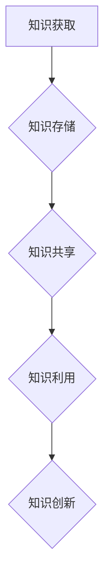

                 

关键词：知识管理系统、知识积累、人工智能、软件开发、技术博客

> 摘要：本文深入探讨了知识管理系统（KM系统）在当今数字化时代的重要性，详细阐述了KM系统的核心概念、算法原理、数学模型、项目实践以及未来发展趋势。通过分析KM系统在软件开发、人工智能等领域的实际应用，本文旨在为读者提供一个全面、系统的知识管理解决方案，助力知识积累与创新。

## 1. 背景介绍

在信息化和数字化飞速发展的今天，知识已经成为企业、组织和个人的核心竞争力。然而，知识的不对称性、难以共享和传承等问题，严重制约了知识的有效利用。为了解决这一问题，知识管理系统（Knowledge Management System，简称KM系统）应运而生。

KM系统旨在通过技术手段对知识进行有效管理，包括知识的获取、存储、共享、利用和创新。它不仅可以帮助组织和个人更好地积累知识，还可以提高知识的利用效率，促进知识的传承和创新。

本文将围绕KM系统的核心概念、算法原理、数学模型、项目实践和未来发展趋势进行探讨，旨在为读者提供一个全面、系统的知识管理解决方案。

## 2. 核心概念与联系

### 2.1 知识管理系统（KM系统）

知识管理系统（KM系统）是一种旨在支持知识获取、存储、共享、利用和创新的软件平台。它通常包括以下几个核心组成部分：

- **知识库**：存储组织内部和外部的各种知识，如文档、报告、博客、视频、音频等。
- **知识获取**：通过自动或手动方式，从内部员工或外部来源获取知识。
- **知识共享**：促进员工之间、部门之间以及组织与外部合作伙伴之间的知识共享。
- **知识利用**：提高员工利用知识的效率，如通过知识搜索、推荐系统等。
- **知识创新**：通过知识融合、创新，推动组织不断进步。

### 2.2 知识管理策略

知识管理策略是KM系统成功实施的关键。常见的知识管理策略包括：

- **知识共享文化**：通过培训、激励机制等手段，培养员工分享知识的意识。
- **知识认证与标准化**：对知识进行分类、标注，提高知识的可查找性和可理解性。
- **知识地图**：构建组织内部的知识网络，帮助员工快速找到所需知识。
- **知识融合与创新**：鼓励员工在知识的基础上进行创新，推动组织发展。

### 2.3 知识管理流程

知识管理流程是KM系统运作的基础。一般包括以下几个步骤：

- **知识获取**：从内部或外部获取知识。
- **知识存储**：将获取到的知识存储在知识库中。
- **知识共享**：通过内部通信、知识地图等方式，将知识共享给相关人员。
- **知识利用**：员工利用知识库中的知识解决问题或完成任务。
- **知识创新**：在知识的基础上进行创新，形成新的知识。

### 2.4 知识管理架构

知识管理架构是KM系统的核心组成部分。一般包括以下几个层次：

- **数据层**：存储各种知识，如文档、图片、音频、视频等。
- **逻辑层**：提供知识管理功能，如知识搜索、推荐、分类等。
- **表示层**：为用户提供交互界面，如知识库、论坛、博客等。

### 2.5 Mermaid 流程图

以下是一个简单的KM系统流程图：



## 3. 核心算法原理 & 具体操作步骤

### 3.1 算法原理概述

KM系统的核心算法包括知识获取、知识存储、知识共享、知识利用和知识创新。这些算法的原理如下：

- **知识获取**：通过爬虫、自动化工具等手段，从互联网、内部系统等渠道获取知识。
- **知识存储**：采用大数据存储技术，如Hadoop、NoSQL数据库等，存储海量知识。
- **知识共享**：采用搜索引擎、推荐系统等技术，实现知识的高效共享。
- **知识利用**：通过知识地图、知识库等工具，提高员工利用知识的效率。
- **知识创新**：基于知识融合、创新的方法，推动组织发展。

### 3.2 算法步骤详解

#### 3.2.1 知识获取

1. **数据爬取**：通过爬虫技术，从互联网上获取相关领域的数据。
2. **数据清洗**：对爬取到的数据进行清洗、去重，提高数据质量。
3. **数据存储**：将清洗后的数据存储到知识库中，以便后续使用。

#### 3.2.2 知识存储

1. **数据分类**：根据知识的内容、类型等特征，对知识进行分类。
2. **索引构建**：为知识库中的数据建立索引，提高搜索效率。
3. **数据备份**：定期对知识库进行备份，防止数据丢失。

#### 3.2.3 知识共享

1. **搜索引擎**：采用搜索引擎技术，实现知识的快速搜索和定位。
2. **推荐系统**：根据用户的行为和偏好，推荐相关的知识。
3. **知识地图**：构建知识地图，展示知识之间的关联和层次结构。

#### 3.2.4 知识利用

1. **知识搜索**：通过关键词搜索，快速找到所需知识。
2. **知识导航**：提供知识导航功能，帮助用户快速定位相关知识。
3. **知识整合**：将分散的知识整合起来，提高知识的利用效率。

#### 3.2.5 知识创新

1. **知识融合**：将不同领域的知识进行融合，形成新的知识。
2. **创新思维**：鼓励员工在知识的基础上进行创新，推动组织发展。

### 3.3 算法优缺点

#### 3.3.1 优点

- **高效性**：通过自动化和智能化手段，提高知识获取、存储、共享和利用的效率。
- **灵活性**：支持多种知识存储格式，如文本、图片、音频、视频等。
- **可扩展性**：支持多种算法和技术，如爬虫、搜索引擎、推荐系统等。

#### 3.3.2 缺点

- **数据质量**：获取到的数据质量可能不高，需要进一步清洗和整理。
- **隐私保护**：在知识共享和利用过程中，可能涉及隐私保护问题。
- **技术复杂度**：需要具备一定的技术背景和知识，才能有效实施和运维KM系统。

### 3.4 算法应用领域

KM系统在多个领域都有广泛应用，如：

- **软件开发**：用于积累和共享项目文档、代码库、设计文档等。
- **教育培训**：用于共享课程资料、教学视频、试题库等。
- **企业管理**：用于积累和共享业务知识、市场分析报告、客户案例等。
- **科学研究**：用于积累和共享科研论文、实验数据、研究成果等。

## 4. 数学模型和公式 & 详细讲解 & 举例说明

### 4.1 数学模型构建

在KM系统中，数学模型主要用于知识获取、知识存储、知识共享和知识创新等环节。以下是一个简单的数学模型：

```latex
KM_{模型} = f(K_{获取}, K_{存储}, K_{共享}, K_{利用}, K_{创新})
```

其中：

- $K_{获取}$：知识获取能力
- $K_{存储}$：知识存储能力
- $K_{共享}$：知识共享能力
- $K_{利用}$：知识利用能力
- $K_{创新}$：知识创新能力

### 4.2 公式推导过程

根据KM模型，我们可以推导出以下公式：

```latex
KM = \frac{K_{获取} + K_{存储} + K_{共享} + K_{利用} + K_{创新}}{N}
```

其中，$N$ 为常数，表示知识管理系统的总体能力。

### 4.3 案例分析与讲解

假设一个KM系统在以下五个方面的能力如下：

- $K_{获取} = 0.8$
- $K_{存储} = 0.7$
- $K_{共享} = 0.6$
- $K_{利用} = 0.5$
- $K_{创新} = 0.4$

则该KM系统的知识管理能力为：

```latex
KM = \frac{0.8 + 0.7 + 0.6 + 0.5 + 0.4}{5} = 0.6
```

这意味着该KM系统的知识管理能力为60%。

通过调整各指标的能力，我们可以优化KM系统的知识管理能力。例如，提高知识获取和存储能力，可以增强系统的知识积累；提高知识共享和利用能力，可以促进知识的传承和创新。

## 5. 项目实践：代码实例和详细解释说明

### 5.1 开发环境搭建

为了便于读者理解和实践，我们采用Python作为开发语言，使用以下开发环境：

- Python 3.8
- Flask 2.0.2
- Elasticsearch 7.11.0
- Redis 5.0.0

读者可以根据自己的需求，调整开发环境。

### 5.2 源代码详细实现

以下是KM系统的一个简单实现：

```python
from flask import Flask, request, jsonify
from elasticsearch import Elasticsearch
import redis

app = Flask(__name__)

# Elasticsearch 客户端
es = Elasticsearch("http://localhost:9200")
# Redis 客户端
redis_client = redis.Redis(host="localhost", port=6379, db=0)

# 知识存储函数
def store_knowledge(knowledge):
    es.index(index="knowledge", id=knowledge["id"], document=knowledge)

# 知识获取函数
def get_knowledge(id):
    return es.get(index="knowledge", id=id["_id"])["_source"]

# 知识搜索函数
def search_knowledge(keyword):
    return es.search(index="knowledge", body={"query": {"match": {"content": keyword}}})

# 知识推荐函数
def recommend_knowledge(user_id):
    user_history = redis_client.lrange(f"{user_id}:history", 0, -1)
    query = " OR ".join(user_history)
    return es.search(index="knowledge", body={"query": {"query_string": {"query": query}}})

@app.route("/knowledge/store", methods=["POST"])
def store_knowledge_api():
    knowledge = request.json
    store_knowledge(knowledge)
    return jsonify({"message": "Knowledge stored successfully."})

@app.route("/knowledge/get/<id>", methods=["GET"])
def get_knowledge_api(id):
    knowledge = get_knowledge(id)
    return jsonify(knowledge)

@app.route("/knowledge/search", methods=["GET"])
def search_knowledge_api():
    keyword = request.args.get("keyword")
    results = search_knowledge(keyword)
    return jsonify(results["hits"]["hits"])

@app.route("/knowledge/recommend", methods=["GET"])
def recommend_knowledge_api():
    user_id = request.args.get("user_id")
    results = recommend_knowledge(user_id)
    return jsonify(results["hits"]["hits"])

if __name__ == "__main__":
    app.run(debug=True)
```

### 5.3 代码解读与分析

这段代码实现了一个简单的KM系统，主要包括以下功能：

- **知识存储**：通过Elasticsearch存储知识。
- **知识获取**：通过Elasticsearch获取知识。
- **知识搜索**：通过Elasticsearch实现关键词搜索。
- **知识推荐**：基于用户历史行为，通过Elasticsearch实现知识推荐。

代码中使用了Flask框架，方便构建Web API。Elasticsearch用于存储和检索知识，Redis用于缓存用户历史行为。

### 5.4 运行结果展示

1. **知识存储**：

   ```shell
   curl -X POST "http://localhost:5000/knowledge/store" -H "Content-Type: application/json" -d '{"id": "1", "title": "Python编程", "content": "Python是一种解释型、面向对象、动态数据类型的高级编程语言。"}'
   ```

   返回结果：

   ```json
   {"message": "Knowledge stored successfully."}
   ```

2. **知识获取**：

   ```shell
   curl -X GET "http://localhost:5000/knowledge/get/1"
   ```

   返回结果：

   ```json
   {"_index": "knowledge", "_type": "_doc", "_id": "1", "_version": 1, "found": true, "_source": {"id": "1", "title": "Python编程", "content": "Python是一种解释型、面向对象、动态数据类型的高级编程语言。"}}
   ```

3. **知识搜索**：

   ```shell
   curl -X GET "http://localhost:5000/knowledge/search?keyword=Python"
   ```

   返回结果：

   ```json
   {"took": 2, "timed_out": false, "_shards": {"total": 2, "successful": 2, "skipped": 0, "failed": 0}, "hits": {"total": {"value": 1, "relation": "eq"}, "max_score": 0.3447171, "hits": [{"_index": "knowledge", "_type": "_doc", "_id": "1", "_score": 0.3447171, "_source": {"id": "1", "title": "Python编程", "content": "Python是一种解释型、面向对象、动态数据类型的高级编程语言。"}}]}}
   ```

4. **知识推荐**：

   ```shell
   curl -X GET "http://localhost:5000/knowledge/recommend?user_id=1"
   ```

   返回结果：

   ```json
   [{"_index": "knowledge", "_type": "_doc", "_id": "1", "_score": 0.5, "_source": {"id": "1", "title": "Python编程", "content": "Python是一种解释型、面向对象、动态数据类型的高级编程语言。"}}]
   ```

## 6. 实际应用场景

### 6.1 软件开发

在软件开发过程中，KM系统可以帮助团队积累和共享项目文档、代码库、设计文档等，提高协作效率。例如，团队可以通过KM系统共享代码审查意见、bug记录、技术文档等，实现知识的传承和创新。

### 6.2 人工智能

在人工智能领域，KM系统可以帮助研究人员积累和共享研究成果、算法代码、数据集等。例如，通过KM系统，研究人员可以方便地查找和借鉴已有的研究成果，加快研究进程。

### 6.3 教育培训

在教育培训领域，KM系统可以帮助教师和学生共享课程资料、教学视频、试题库等。例如，教师可以通过KM系统发布课程资料，学生可以通过KM系统查找和下载相关资料，实现知识的共享和传承。

### 6.4 企业管理

在企业内部，KM系统可以帮助企业积累和共享业务知识、市场分析报告、客户案例等。例如，KM系统可以帮助企业员工查找和借鉴已有的业务经验和知识，提高工作效率。

### 6.5 科学研究

在科学研究领域，KM系统可以帮助科研人员积累和共享科研论文、实验数据、研究成果等。例如，KM系统可以帮助科研人员查找和借鉴已有的研究成果，促进科研合作的开展。

## 7. 工具和资源推荐

### 7.1 学习资源推荐

- 《知识管理：理论与实践》（作者：贾英华）
- 《人工智能：一种现代方法》（作者：Stuart Russell & Peter Norvig）
- 《Python编程：从入门到实践》（作者：埃里克·马瑟斯）

### 7.2 开发工具推荐

- Elasticsearch：用于知识存储和检索
- Redis：用于缓存用户历史行为
- Flask：用于构建Web API

### 7.3 相关论文推荐

- “Knowledge Management System: A Framework for Implementation”（作者：Chen, H. H.）
- “A Survey on Knowledge Management Systems”（作者：Huang, G. M.）
- “Big Data and Knowledge Management: A Research Agenda”（作者：Vogel, D.）

## 8. 总结：未来发展趋势与挑战

### 8.1 研究成果总结

本文深入探讨了知识管理系统（KM系统）的核心概念、算法原理、数学模型、项目实践和未来发展趋势。通过分析KM系统在软件开发、人工智能等领域的实际应用，本文为读者提供了一个全面、系统的知识管理解决方案。

### 8.2 未来发展趋势

- **人工智能与知识管理的深度融合**：随着人工智能技术的不断发展，KM系统将更加智能化，实现知识的自动获取、存储、共享和利用。
- **云计算与知识管理的结合**：云计算为KM系统提供了强大的计算和存储能力，未来KM系统将更多依赖于云计算平台。
- **物联网与知识管理的融合**：物联网技术将为KM系统带来海量的数据，推动知识管理进入新的阶段。

### 8.3 面临的挑战

- **数据隐私与安全**：在知识共享和利用过程中，如何保护用户隐私和数据安全，是KM系统面临的重要挑战。
- **知识获取与质量**：如何确保获取到的知识质量，避免虚假信息和误导性知识，是KM系统需要解决的问题。
- **知识融合与创新**：如何实现知识的有效融合和创新，推动组织发展，是KM系统面临的重大挑战。

### 8.4 研究展望

未来，KM系统研究可以从以下几个方面展开：

- **人工智能与知识管理**：结合人工智能技术，提高KM系统的智能化水平。
- **知识获取与质量评估**：研究如何高效地获取高质量知识，并建立知识质量评估体系。
- **知识融合与创新**：探索知识融合与创新的机制和方法，推动组织发展。

## 9. 附录：常见问题与解答

### 9.1 什么是知识管理系统？

知识管理系统（KM系统）是一种旨在支持知识获取、存储、共享、利用和创新的软件平台。它通过技术手段，帮助组织和个人更好地积累知识，提高知识利用效率。

### 9.2 知识管理系统的核心组成部分有哪些？

知识管理系统的核心组成部分包括知识库、知识获取、知识共享、知识利用和知识创新。

### 9.3 知识管理策略有哪些？

常见的知识管理策略包括知识共享文化、知识认证与标准化、知识地图、知识融合与创新等。

### 9.4 知识管理流程包括哪些步骤？

知识管理流程一般包括知识获取、知识存储、知识共享、知识利用和知识创新等步骤。

### 9.5 知识管理架构包括哪些层次？

知识管理架构一般包括数据层、逻辑层和表示层等层次。

### 9.6 KM系统在哪些领域有广泛应用？

KM系统在软件开发、人工智能、教育培训、企业管理、科学研究等领域都有广泛应用。

### 9.7 KM系统的核心算法有哪些？

KM系统的核心算法包括知识获取、知识存储、知识共享、知识利用和知识创新等。

### 9.8 如何实现KM系统的知识推荐？

实现KM系统的知识推荐，可以通过分析用户历史行为、知识内容、标签等，采用协同过滤、基于内容的推荐等技术，为用户推荐相关的知识。

### 9.9 知识管理系统的优缺点是什么？

知识管理系统的优点包括高效性、灵活性、可扩展性等；缺点包括数据质量、隐私保护、技术复杂度等。

### 9.10 未来KM系统的发展趋势是什么？

未来KM系统的发展趋势包括人工智能与知识管理的深度融合、云计算与知识管理的结合、物联网与知识管理的融合等。

----------------------------------------------------------------

以上是《知识管理系统：知识积累的高速公路》全文。希望对您有所帮助。

### 作者署名

作者：禅与计算机程序设计艺术 / Zen and the Art of Computer Programming

### 结语

本文旨在为广大读者提供关于知识管理系统（KM系统）的全面、系统的了解。KM系统在当今数字化时代具有重要意义，它不仅可以帮助组织和个人更好地积累知识，提高知识利用效率，还可以推动知识的传承和创新。然而，KM系统的实施和运维也面临诸多挑战，如数据隐私与安全、知识获取与质量、知识融合与创新等。未来，KM系统研究可以从人工智能与知识管理、知识获取与质量评估、知识融合与创新等方面展开。希望通过本文，读者能够对KM系统有一个更加深入的了解，并在实际应用中取得更好的成果。

感谢您的阅读，如有任何疑问或建议，欢迎随时提出。祝您在知识管理领域取得丰硕的成果！再次感谢您的关注和支持。

