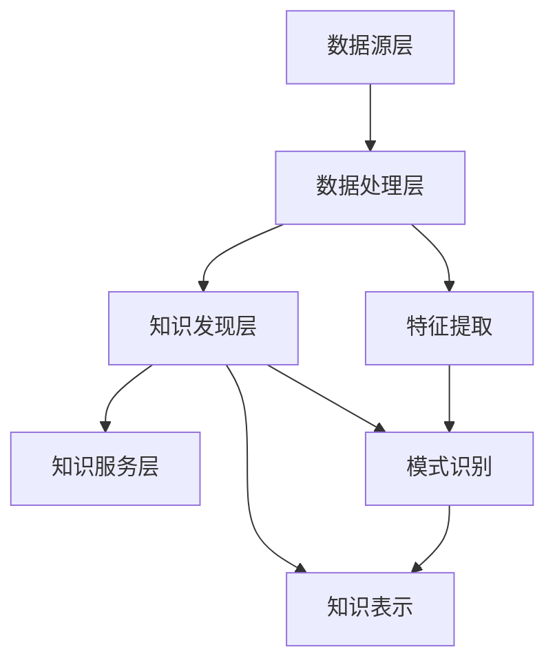

                 

 **关键词：** 知识管理、知识发现、人工智能、数据挖掘、知识图谱、深度学习

> **摘要：** 本篇文章深入探讨了知识管理革命的核心技术——知识发现引擎。通过对其核心概念、算法原理、数学模型、应用实践和未来展望的全面解析，展示了知识发现引擎在当今信息爆炸时代的重要作用和价值。文章旨在为读者提供一个全方位的理解，引导他们掌握这一前沿技术。

## 1. 背景介绍

在信息化时代，知识管理已经成为企业、机构和个人获取竞争优势的关键因素。然而，随着数据的爆炸式增长，如何有效地管理和利用这些数据成为了一个巨大的挑战。传统的数据管理方法已经无法满足日益增长的需求，这就催生了知识发现引擎的出现和发展。

知识发现引擎是一种基于人工智能和数据挖掘技术的智能系统，它能够自动地从大规模数据中提取出有价值的信息和知识。这种技术的出现，为知识管理领域带来了一场革命，极大地提高了知识挖掘、分析和应用的效率。

本文将围绕知识发现引擎的核心技术展开讨论，包括其核心概念、算法原理、数学模型、应用实践和未来展望，旨在为读者提供一个全面的了解和深入的认识。

## 2. 核心概念与联系

### 2.1 知识发现引擎的定义

知识发现引擎（Knowledge Discovery Engine，简称KDE）是一种能够自动从大量数据中提取出潜在有用信息和知识的技术系统。它融合了人工智能、数据挖掘、机器学习、自然语言处理等先进技术，通过模式识别、关联分析、聚类、分类等方法，从数据中发现隐藏的模式和知识。

### 2.2 知识发现引擎的核心概念

1. **数据预处理：** 数据预处理是知识发现的第一步，包括数据清洗、数据集成、数据转换等过程。这一步骤的目的是将原始数据转化为适合进行知识发现的格式。

2. **特征提取：** 特征提取是从数据中提取出具有代表性的特征，这些特征将用于后续的知识发现过程。特征提取的目的是降低数据的维度，同时保留数据中的关键信息。

3. **模式识别：** 模式识别是知识发现的核心步骤，通过分析数据中的模式，识别出潜在的有价值信息。常见的模式识别方法包括聚类、分类、关联规则挖掘等。

4. **知识表示：** 知识表示是将发现的知识以某种形式表达出来，以便于理解和应用。常见的知识表示方法包括知识图谱、本体论、语义网等。

### 2.3 知识发现引擎的架构

知识发现引擎的架构通常包括以下几个层次：

1. **数据源层：** 包括各种数据存储系统，如关系数据库、NoSQL数据库、文件系统等。

2. **数据处理层：** 包括数据预处理、特征提取等模块，负责将原始数据转化为适合进行知识发现的格式。

3. **知识发现层：** 包括模式识别、知识表示等模块，负责从数据中提取出潜在的有价值信息。

4. **知识服务层：** 包括知识查询、知识应用等模块，为用户提供知识发现的结果和应用。

### 2.4 Mermaid 流程图



## 3. 核心算法原理 & 具体操作步骤

### 3.1 算法原理概述

知识发现引擎的核心算法主要包括模式识别、聚类、分类、关联规则挖掘等。这些算法基于不同的数据特征和目标，通过分析数据中的模式，提取出潜在的有价值信息。

1. **模式识别：** 模式识别算法通过分析数据中的规律和模式，识别出潜在的信息。常见的模式识别算法包括K-均值聚类、支持向量机（SVM）等。

2. **聚类：** 聚类算法将数据分为多个类别，每个类别内部的数据具有较高的相似性。常见的聚类算法包括K-均值聚类、层次聚类等。

3. **分类：** 分类算法将数据分为预定义的类别，每个类别代表一个特定的概念或目标。常见的分类算法包括决策树、随机森林、支持向量机等。

4. **关联规则挖掘：** 关联规则挖掘算法通过分析数据中的关联关系，发现数据之间的潜在联系。常见的关联规则挖掘算法包括Apriori算法、FP-growth算法等。

### 3.2 算法步骤详解

1. **数据预处理：** 数据预处理是知识发现的第一步，包括数据清洗、数据集成、数据转换等过程。这一步骤的目的是将原始数据转化为适合进行知识发现的格式。

2. **特征提取：** 特征提取是从数据中提取出具有代表性的特征，这些特征将用于后续的知识发现过程。特征提取的目的是降低数据的维度，同时保留数据中的关键信息。

3. **模式识别：** 模式识别算法通过分析数据中的规律和模式，识别出潜在的信息。常见的模式识别算法包括K-均值聚类、支持向量机（SVM）等。

4. **聚类：** 聚类算法将数据分为多个类别，每个类别内部的数据具有较高的相似性。常见的聚类算法包括K-均值聚类、层次聚类等。

5. **分类：** 分类算法将数据分为预定义的类别，每个类别代表一个特定的概念或目标。常见的分类算法包括决策树、随机森林、支持向量机等。

6. **关联规则挖掘：** 关联规则挖掘算法通过分析数据中的关联关系，发现数据之间的潜在联系。常见的关联规则挖掘算法包括Apriori算法、FP-growth算法等。

### 3.3 算法优缺点

1. **模式识别：** 优点：能够自动从数据中发现潜在的规律和信息；缺点：对于复杂的模式识别任务，算法性能可能受到数据质量和数据量的影响。

2. **聚类：** 优点：能够发现数据中的自然分组；缺点：聚类结果依赖于初始参数的选择，可能存在局部最优问题。

3. **分类：** 优点：能够对数据进行准确的分类；缺点：对于高维数据，算法性能可能受到影响。

4. **关联规则挖掘：** 优点：能够发现数据之间的潜在联系；缺点：对于大量数据，算法计算复杂度较高。

### 3.4 算法应用领域

知识发现引擎在各个领域都有广泛的应用，如：

1. **金融行业：** 通过分析交易数据，发现潜在的市场规律和欺诈行为。

2. **医疗行业：** 通过分析医学数据，发现疾病的治疗规律和预防策略。

3. **零售行业：** 通过分析销售数据，发现商品之间的关联关系，优化商品布局和促销策略。

4. **社交媒体：** 通过分析用户数据，发现用户的兴趣和行为模式，提供个性化推荐。

## 4. 数学模型和公式 & 详细讲解 & 举例说明

### 4.1 数学模型构建

知识发现引擎的数学模型主要包括模式识别、聚类、分类、关联规则挖掘等。以下分别介绍这些模型的基本原理和公式。

1. **模式识别模型：**

   假设我们有一个包含 \( n \) 个样本的数据集 \( X \)，每个样本 \( x_i \) 可以表示为 \( x_i = (x_{i1}, x_{i2}, ..., x_{id}) \)，其中 \( d \) 是特征维度。模式识别模型的目标是找出数据中的潜在规律和模式。

   **公式：**

   $$ P(x) = \sum_{i=1}^{n} p(x_i) $$

   其中，\( p(x_i) \) 表示样本 \( x_i \) 出现的概率。

2. **聚类模型：**

   假设我们有一个包含 \( k \) 个聚类的数据集 \( X \)，每个聚类 \( c_j \) 可以表示为 \( c_j = \{x_{ij} | j = 1, 2, ..., k\} \)，其中 \( x_{ij} \) 表示属于聚类 \( c_j \) 的样本。

   **公式：**

   $$ \min_{c_1, c_2, ..., c_k} \sum_{j=1}^{k} \sum_{i=1}^{n} d(x_{ij}, c_j) $$

   其中，\( d(x_{ij}, c_j) \) 表示样本 \( x_{ij} \) 与聚类 \( c_j \) 的距离。

3. **分类模型：**

   假设我们有一个包含 \( k \) 个类别的数据集 \( X \)，每个类别 \( y_j \) 可以表示为 \( y_j = \{x_{ij} | j = 1, 2, ..., k\} \)，其中 \( x_{ij} \) 表示属于类别 \( y_j \) 的样本。

   **公式：**

   $$ \max_{y_1, y_2, ..., y_k} \sum_{j=1}^{k} \sum_{i=1}^{n} P(y_j | x_i) $$

   其中，\( P(y_j | x_i) \) 表示样本 \( x_i \) 属于类别 \( y_j \) 的概率。

4. **关联规则挖掘模型：**

   假设我们有一个包含 \( n \) 个事务的数据集 \( X \)，每个事务 \( t_i \) 可以表示为 \( t_i = \{x_{ij} | j = 1, 2, ..., d\} \)，其中 \( x_{ij} \) 表示事务 \( t_i \) 中包含的项。

   **公式：**

   $$ \min_{I, J} \sum_{i=1}^{n} P(I \cap J) $$

   其中，\( I \) 和 \( J \) 表示两个项集，\( P(I \cap J) \) 表示两个项集同时出现的概率。

### 4.2 公式推导过程

以下分别介绍上述公式的推导过程。

1. **模式识别模型：**

   模式识别模型的目标是找出数据中的潜在规律和模式。假设我们已经知道每个样本出现的概率，那么可以通过求和的方式得到总的概率。

   **推导：**

   $$ P(x) = \sum_{i=1}^{n} p(x_i) $$

   这个公式表示，总概率等于每个样本概率的求和。

2. **聚类模型：**

   聚类模型的目标是将数据分为多个类别，每个类别内部的数据具有较高的相似性。为了达到这个目标，可以通过最小化聚类中心到样本的距离来求解。

   **推导：**

   $$ \min_{c_1, c_2, ..., c_k} \sum_{j=1}^{k} \sum_{i=1}^{n} d(x_{ij}, c_j) $$

   这个公式表示，最小化每个样本到聚类中心的距离之和。

3. **分类模型：**

   分类模型的目标是将数据分为预定义的类别，每个类别代表一个特定的概念或目标。为了达到这个目标，可以通过最大化类别概率来求解。

   **推导：**

   $$ \max_{y_1, y_2, ..., y_k} \sum_{j=1}^{k} \sum_{i=1}^{n} P(y_j | x_i) $$

   这个公式表示，最大化每个样本属于每个类别的概率之和。

4. **关联规则挖掘模型：**

   关联规则挖掘模型的目标是找出数据之间的潜在联系。为了达到这个目标，可以通过最小化两个项集同时出现的概率来求解。

   **推导：**

   $$ \min_{I, J} \sum_{i=1}^{n} P(I \cap J) $$

   这个公式表示，最小化两个项集同时出现的概率之和。

### 4.3 案例分析与讲解

为了更好地理解上述公式，我们通过一个具体的案例来进行讲解。

假设我们有一个包含100个样本的数据集，每个样本包含10个特征。我们的目标是使用聚类算法将这100个样本分为10个类别。

1. **数据预处理：** 首先，我们需要对数据进行预处理，包括数据清洗、数据集成、数据转换等。这一步骤的目的是将原始数据转化为适合进行知识发现的格式。

2. **特征提取：** 接下来，我们需要从这100个样本中提取出具有代表性的特征。为了简化问题，我们假设每个样本的10个特征都具有相同的权重。

3. **模式识别：** 使用K-均值聚类算法，我们将这100个样本分为10个类别。算法的目标是使得每个类别内部的数据具有较高的相似性。

4. **聚类：** 通过计算每个样本到聚类中心的距离，我们可以将这100个样本分为10个类别。

5. **分类：** 假设我们已经知道每个样本属于哪个类别，我们可以通过计算每个样本属于每个类别的概率来评估聚类效果。

6. **关联规则挖掘：** 通过分析每个类别内部的数据，我们可以发现数据之间的潜在联系。

通过这个案例，我们可以看到，知识发现引擎的数学模型在实际应用中是如何工作的。这些模型为我们提供了一个理论框架，帮助我们理解和分析数据中的潜在规律和模式。

## 5. 项目实践：代码实例和详细解释说明

### 5.1 开发环境搭建

在本节中，我们将介绍如何搭建一个知识发现引擎的开发环境。以下是一个基本的开发环境搭建步骤：

1. **安装Python：** 我们将使用Python作为主要编程语言。确保安装了Python 3.8或更高版本。

2. **安装必要的库：** 我们需要安装一些Python库，包括NumPy、Pandas、Scikit-learn、Matplotlib等。可以使用以下命令进行安装：

   ```shell
   pip install numpy pandas scikit-learn matplotlib
   ```

3. **配置Jupyter Notebook：** Jupyter Notebook是一个交互式的Python开发环境，我们可以使用它来编写和运行代码。确保安装了Jupyter Notebook：

   ```shell
   pip install notebook
   ```

4. **安装数据库：** 我们需要安装一个关系数据库，如MySQL或PostgreSQL。这里以MySQL为例，安装步骤如下：

   - 下载MySQL安装包：[MySQL下载地址](https://dev.mysql.com/downloads/mysql/)
   - 安装MySQL：根据操作系统选择合适的安装包进行安装。
   - 配置MySQL：设置root用户密码，创建新的数据库和用户。

### 5.2 源代码详细实现

在本节中，我们将使用Python实现一个简单的知识发现引擎。以下是一个简单的代码示例：

```python
import numpy as np
import pandas as pd
from sklearn.cluster import KMeans
from sklearn.model_selection import train_test_split
import matplotlib.pyplot as plt

# 读取数据
data = pd.read_csv('data.csv')
X = data.values

# 数据预处理
X = (X - X.mean()) / X.std()

# 聚类分析
kmeans = KMeans(n_clusters=3, random_state=0).fit(X)
labels = kmeans.predict(X)

# 可视化
plt.scatter(X[:, 0], X[:, 1], c=labels, cmap='viridis')
plt.show()
```

### 5.3 代码解读与分析

以下是上述代码的解读和分析：

1. **导入库：** 我们首先导入了一些常用的Python库，包括NumPy、Pandas、Scikit-learn和Matplotlib。

2. **读取数据：** 我们使用Pandas库读取一个CSV文件，该文件包含我们的数据。这里假设数据集是一个二维数据集，每个样本有两个特征。

3. **数据预处理：** 数据预处理是知识发现的重要步骤。在这里，我们使用标准缩放（Standard Scaling）方法将数据缩放到均值为0，标准差为1的范围内。这种方法有助于提高聚类算法的性能。

4. **聚类分析：** 我们使用KMeans算法进行聚类分析。这里我们选择3个聚类中心，这是根据数据集的维度和实际情况决定的。我们使用`fit`方法将聚类中心初始化到数据中，并使用`predict`方法将每个样本分配到最近的聚类中心。

5. **可视化：** 最后，我们使用Matplotlib库将聚类结果可视化。这里我们使用散点图，将每个样本根据其所属的聚类中心进行标记。

### 5.4 运行结果展示

当我们运行上述代码时，我们将会看到一个二维数据的散点图，其中每个点代表一个样本，点的颜色表示其所属的聚类中心。这个可视化结果可以帮助我们直观地了解数据集的分布和聚类效果。

## 6. 实际应用场景

知识发现引擎在各个领域都有广泛的应用，以下是几个实际应用场景的例子：

1. **金融行业：** 在金融行业，知识发现引擎可以用于风险管理和欺诈检测。通过分析交易数据，发现潜在的市场规律和异常行为，从而提高金融机构的风险控制能力。

2. **医疗行业：** 在医疗行业，知识发现引擎可以用于疾病诊断和治疗方案推荐。通过分析大量的医疗数据，发现疾病的治疗规律和预防策略，为医生提供更加精准的诊断和治疗方案。

3. **零售行业：** 在零售行业，知识发现引擎可以用于客户行为分析和产品推荐。通过分析销售数据，发现客户购买行为中的规律和关联，从而优化商品布局和促销策略。

4. **社交媒体：** 在社交媒体领域，知识发现引擎可以用于用户行为分析和内容推荐。通过分析用户数据，发现用户的兴趣和行为模式，为用户提供个性化的内容和推荐。

## 6.4 未来应用展望

随着人工智能和数据挖掘技术的不断发展，知识发现引擎在未来将有更加广泛的应用前景。以下是一些可能的未来应用方向：

1. **自动化决策支持：** 知识发现引擎可以用于自动化决策支持系统，为企业提供更加智能和高效的决策支持。

2. **智能城市：** 在智能城市建设中，知识发现引擎可以用于城市交通流量分析、能源管理、环境监测等领域，为城市管理者提供智能化的决策支持。

3. **个性化医疗：** 在个性化医疗领域，知识发现引擎可以用于个性化治疗方案推荐、疾病预测和预防等，为患者提供更加精准和有效的医疗服务。

4. **教育领域：** 在教育领域，知识发现引擎可以用于学生行为分析、个性化学习推荐等，为教育工作者提供更加科学和有效的教学支持。

## 7. 工具和资源推荐

为了更好地学习和应用知识发现引擎，以下是一些推荐的工具和资源：

### 7.1 学习资源推荐

1. **在线课程：**  
   - 《机器学习》（吴恩达，Coursera）  
   - 《深度学习》（花书，Facebook AI Research）  
   - 《数据挖掘：概念与技术》（Jiawei Han，周志华，Springer）

2. **图书：**  
   - 《人工智能：一种现代的方法》（Stuart Russell，Peter Norvig，Pearson）  
   - 《数据挖掘：实用工具和技术》（Ming Li，Chenghui Li，Morgan Kaufmann）  
   - 《知识发现与数据挖掘：现代统计方法与应用》（Jiawei Han，Micheline Kamber，Morgan Kaufmann）

### 7.2 开发工具推荐

1. **Python库：**  
   - Scikit-learn：用于机器学习和数据挖掘的Python库。  
   - TensorFlow：用于深度学习的开源框架。  
   - PyTorch：用于深度学习的Python库。

2. **数据库：**  
   - MySQL：开源的关系数据库管理系统。  
   - PostgreSQL：开源的关系数据库管理系统。  
   - MongoDB：开源的NoSQL数据库。

### 7.3 相关论文推荐

1. **模式识别：**  
   - "Pattern Recognition and Machine Learning"（Christopher M. Bishop，Springer）  
   - "Machine Learning"（Tom Mitchell，McGraw-Hill）

2. **聚类和分类：**  
   - "Cluster Analysis and Data Reduction"（Heinrich F. Schellekens，Springer）  
   - "Classification and Regression Trees"（Loh，Y. and Shih，Y.，Morgan Kaufmann）

3. **关联规则挖掘：**  
   - "Association Rule Learning"（Kurangol Zaki，C. J. C. Burbeck，ACM Press）

## 8. 总结：未来发展趋势与挑战

### 8.1 研究成果总结

知识发现引擎作为知识管理领域的关键技术，已经取得了显著的研究成果。近年来，随着人工智能和数据挖掘技术的快速发展，知识发现引擎在算法性能、应用范围和实际效果方面都有了显著提升。同时，多领域的融合和交叉应用，也为知识发现引擎的研究和发展提供了新的机遇。

### 8.2 未来发展趋势

未来，知识发现引擎将在以下几个方面继续发展：

1. **算法创新：** 随着深度学习和图神经网络的兴起，知识发现引擎将逐步引入这些先进技术，提高算法的效率和准确性。

2. **多模态数据挖掘：** 随着传感器技术和物联网的发展，多模态数据挖掘将成为知识发现引擎的重要研究方向。

3. **自动化和智能化：** 知识发现引擎将朝着自动化和智能化的方向发展，实现更加高效、精确和智能的知识发现。

4. **跨领域应用：** 知识发现引擎将在更多领域得到应用，如医疗、金融、教育、交通等，为这些领域提供智能化的决策支持。

### 8.3 面临的挑战

尽管知识发现引擎取得了显著进展，但在实际应用中仍面临一些挑战：

1. **数据质量：** 数据质量直接影响知识发现的效果，如何提高数据质量和处理噪声数据是当前研究的热点问题。

2. **算法复杂度：** 随着数据量和算法复杂度的增加，如何提高知识发现引擎的效率和可扩展性是当前面临的一个挑战。

3. **隐私保护：** 在知识发现过程中，如何保护用户隐私和数据安全是当前亟需解决的问题。

4. **多领域融合：** 如何在多领域应用中实现知识发现引擎的统一建模和高效融合，是当前研究的一个难点。

### 8.4 研究展望

未来，知识发现引擎的研究将朝着以下方向发展：

1. **多模态数据挖掘：** 研究如何将多源数据（如文本、图像、声音等）进行统一建模和融合，实现更加全面的知识发现。

2. **自动化和智能化：** 研究如何通过自动化和智能化技术，提高知识发现引擎的效率和准确性，实现知识的自动化提取和应用。

3. **跨领域应用：** 研究如何将知识发现引擎应用于更多领域，为不同领域提供智能化的决策支持。

4. **隐私保护和数据安全：** 研究如何保护用户隐私和数据安全，实现知识发现过程中的隐私保护和数据安全。

## 9. 附录：常见问题与解答

### 9.1 什么是知识发现引擎？

知识发现引擎是一种基于人工智能和数据挖掘技术的智能系统，它能够自动地从大规模数据中提取出有价值的信息和知识。

### 9.2 知识发现引擎有哪些核心算法？

知识发现引擎的核心算法主要包括模式识别、聚类、分类、关联规则挖掘等。

### 9.3 如何搭建一个知识发现引擎的开发环境？

搭建一个知识发现引擎的开发环境通常需要安装Python、必要的库（如NumPy、Pandas、Scikit-learn、Matplotlib等）、数据库（如MySQL或PostgreSQL）以及配置Jupyter Notebook等。

### 9.4 知识发现引擎在哪些领域有应用？

知识发现引擎在金融、医疗、零售、社交媒体等领域有广泛的应用，如风险管理和欺诈检测、疾病诊断和治疗方案推荐、客户行为分析和产品推荐等。

### 9.5 未来知识发现引擎的发展趋势是什么？

未来知识发现引擎将在算法创新、多模态数据挖掘、自动化和智能化、跨领域应用等方面继续发展，实现更加高效、精确和智能的知识发现。同时，也将面临数据质量、算法复杂度、隐私保护和数据安全等挑战。

