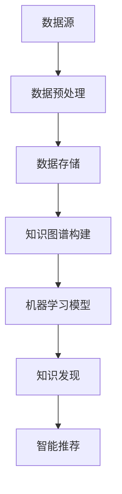

                 

 > **关键词：知识管理，知识发现引擎，人工智能，大数据，数据处理，算法优化，深度学习，智能推荐系统，知识图谱，数据可视化**

> **摘要：**本文旨在探讨知识管理在现代信息技术中的重要性，并深入分析知识发现引擎在其中的主导作用。通过阐述知识管理的基本概念、核心技术和实际应用，本文揭示了知识发现引擎如何利用人工智能和大数据技术，实现知识的高效管理和智能推荐。文章将介绍知识发现引擎的工作原理、数学模型和具体应用案例，并对未来发展趋势和挑战进行展望。

## 1. 背景介绍

### 1.1 知识管理的发展历程

知识管理作为一个独立的领域，起源于20世纪90年代。当时，随着信息技术的迅猛发展，企业逐渐认识到知识资源的重要性。知识管理开始从传统的文献管理和信息管理中独立出来，成为企业战略管理的重要组成部分。知识管理的发展历程可以大致分为以下几个阶段：

1. **知识共享阶段**：这一阶段主要强调知识的共享和交流，通过建立知识库、知识论坛等方式，促进知识的流动和传播。
2. **知识编码阶段**：随着知识管理的发展，人们开始将知识进行结构化处理，将其编码为文档、数据库等形式，便于存储、检索和共享。
3. **知识融合阶段**：在这一阶段，知识管理不再局限于知识的存储和共享，而是开始关注如何将分散的知识进行整合和融合，形成新的知识体系。
4. **知识创新阶段**：知识管理的高级阶段，强调通过知识创造新的价值，推动企业的创新和发展。

### 1.2 人工智能与大数据的崛起

进入21世纪，人工智能和大数据技术的快速发展，为知识管理带来了新的机遇和挑战。人工智能技术，特别是机器学习和深度学习，使得知识发现和智能推荐成为可能。大数据技术则提供了海量的数据来源，为知识管理提供了丰富的素材。知识管理不再局限于企业内部的知识，而是扩展到整个互联网，甚至全球范围。

### 1.3 知识发现引擎的概念与作用

知识发现引擎是一种基于人工智能和大数据技术的知识管理工具，它通过分析大量数据，从中挖掘出有价值的信息和知识。知识发现引擎在知识管理中扮演着至关重要的角色，它不仅能够提高知识的管理效率，还能够推动知识的创新和应用。

## 2. 核心概念与联系

### 2.1 知识管理

知识管理是指通过系统的方法和工具，对知识进行获取、存储、共享、应用和创新的过程。知识管理的基本概念包括：

- **知识**：知识是指信息、技能、经验、知识和观念的集合，是人们认识世界和解决问题的能力。
- **知识管理过程**：知识管理过程包括知识识别、知识获取、知识存储、知识共享、知识应用和知识创新等环节。

### 2.2 人工智能

人工智能是指通过计算机模拟人类智能的一种技术，包括机器学习、深度学习、自然语言处理、计算机视觉等领域。人工智能技术为知识管理提供了强大的工具，使得知识发现和智能推荐成为可能。

### 2.3 大数据

大数据是指数据量大、类型多、速度快的数据。大数据技术包括数据采集、数据存储、数据分析和数据可视化等环节。大数据为知识管理提供了丰富的素材，使得知识管理不再局限于企业内部的知识，而是扩展到整个互联网。

### 2.4 知识发现引擎

知识发现引擎是一种基于人工智能和大数据技术的知识管理工具，它通过分析大量数据，从中挖掘出有价值的信息和知识。知识发现引擎的核心概念包括：

- **知识图谱**：知识图谱是一种结构化知识表示方法，它将知识以图的形式进行组织和存储，便于高效检索和利用。
- **机器学习**：机器学习是知识发现引擎的核心技术，它通过训练模型，从数据中自动发现规律和模式。
- **深度学习**：深度学习是机器学习的一种重要方法，它通过多层神经网络，实现更复杂的特征提取和模式识别。

### 2.5 Mermaid 流程图

下面是一个简化的知识发现引擎的 Mermaid 流程图，用于展示其核心概念和联系。



## 3. 核心算法原理 & 具体操作步骤

### 3.1 算法原理概述

知识发现引擎的核心算法包括机器学习、深度学习和知识图谱构建等技术。这些算法通过分析大量数据，实现知识的高效管理和智能推荐。

- **机器学习**：机器学习是一种通过训练模型，从数据中自动发现规律和模式的技术。知识发现引擎通常使用监督学习、无监督学习和半监督学习等方法。
- **深度学习**：深度学习是机器学习的一种重要方法，它通过多层神经网络，实现更复杂的特征提取和模式识别。深度学习在图像识别、语音识别和自然语言处理等领域具有广泛应用。
- **知识图谱构建**：知识图谱构建是一种将知识以图的形式进行组织和存储的技术。知识图谱由节点和边组成，节点表示实体，边表示实体之间的关系。

### 3.2 算法步骤详解

1. **数据采集**：知识发现引擎首先需要采集大量的数据，这些数据可以来自企业内部的数据源，也可以来自互联网的大数据平台。

2. **数据预处理**：数据预处理是数据分析和知识发现的第一步。它包括数据清洗、数据转换和数据归一化等操作，以确保数据的质量和一致性。

3. **知识图谱构建**：在构建知识图谱时，首先需要识别数据中的实体和关系，然后使用图论算法将这些实体和关系组织成一个知识图谱。

4. **机器学习模型训练**：知识发现引擎使用机器学习模型，对知识图谱进行训练，以发现数据中的潜在规律和模式。

5. **知识发现**：通过机器学习模型，知识发现引擎可以从数据中提取出有价值的信息和知识。

6. **智能推荐**：基于知识发现的结果，知识发现引擎可以提供智能推荐服务，向用户推荐相关的信息和知识。

### 3.3 算法优缺点

- **优点**：知识发现引擎具有以下优点：
  - **高效性**：知识发现引擎能够快速从大量数据中提取出有价值的信息和知识。
  - **智能化**：知识发现引擎能够自动识别数据中的规律和模式，实现知识的智能推荐。

- **缺点**：知识发现引擎也存在以下缺点：
  - **复杂性**：知识发现引擎的算法复杂，需要大量的计算资源和时间。
  - **数据质量**：知识发现引擎的效果很大程度上取决于数据的质量，如果数据存在噪声或错误，可能会导致错误的结论。

### 3.4 算法应用领域

知识发现引擎在许多领域都有广泛的应用，包括：

- **企业知识管理**：知识发现引擎可以帮助企业更好地管理内部知识，提高知识共享和利用的效率。
- **推荐系统**：知识发现引擎可以应用于推荐系统，为用户提供个性化的信息推荐。
- **智能问答系统**：知识发现引擎可以应用于智能问答系统，提供快速、准确的答案。
- **金融市场分析**：知识发现引擎可以帮助金融市场分析人员从大量数据中提取出有价值的信息，进行投资决策。

## 4. 数学模型和公式 & 详细讲解 & 举例说明

### 4.1 数学模型构建

知识发现引擎的数学模型通常包括以下几个部分：

- **数据模型**：数据模型描述了数据的结构和属性，通常使用关系数据库或图数据库进行存储。
- **机器学习模型**：机器学习模型用于从数据中自动发现规律和模式，常见的模型包括线性回归、逻辑回归、决策树、随机森林、支持向量机等。
- **深度学习模型**：深度学习模型通过多层神经网络，实现更复杂的特征提取和模式识别，常见的模型包括卷积神经网络（CNN）、循环神经网络（RNN）、长短期记忆网络（LSTM）等。
- **知识图谱模型**：知识图谱模型用于表示实体和实体之间的关系，常见的模型包括图嵌入模型、知识图谱推理模型等。

### 4.2 公式推导过程

以知识图谱模型为例，下面是一个简单的图嵌入模型的推导过程：

1. **定义图嵌入**：设$G=(V,E)$为一个无向图，其中$V$为节点集合，$E$为边集合。图嵌入模型将图中的每个节点映射为一个低维度的向量$x_v$。

2. **损失函数**：图嵌入模型的损失函数通常采用负采样损失函数，其公式为：
   $$L = \frac{1}{|V|}\sum_{v\in V}\sum_{v'\in \mathcal{N}(v)}\log(\sigma(w^T [x_v - x_{v'}])) + \frac{1}{|V|}\sum_{v\in V}\sum_{v'\in \mathcal{N}^c(v)}\log(\sigma(w^T [x_v + x_{v'}]))$$
   其中，$w$为模型参数，$\sigma$为sigmoid函数，$\mathcal{N}(v)$为节点$v$的邻居节点集合，$\mathcal{N}^c(v)$为节点$v$的非邻居节点集合。

3. **优化目标**：图嵌入模型的优化目标是最小化损失函数$L$。

### 4.3 案例分析与讲解

假设有一个简单的无向图$G=(V,E)$，其中$V=\{v_1, v_2, v_3\}$，$E=\{(v_1, v_2), (v_2, v_3)\}$。我们使用图嵌入模型对其进行嵌入。

1. **初始化**：首先初始化每个节点的嵌入向量$x_{v_i}$，假设$x_{v_1}=(1, 0)$，$x_{v_2}=(0, 1)$，$x_{v_3}=(1, 1)$。

2. **计算邻居节点嵌入向量**：计算每个节点的邻居节点嵌入向量，例如对于节点$v_1$，其邻居节点$v_2$的嵌入向量为$x_{v_2}=(0, 1)$。

3. **计算损失函数**：根据损失函数公式，计算每个节点的损失函数值。例如对于节点$v_1$，其损失函数值为：
   $$L = \frac{1}{3}\left[\log(\sigma(w^T [x_{v_1} - x_{v_2}])) + \log(\sigma(w^T [x_{v_1} + x_{v_3}]))\right]$$

4. **更新嵌入向量**：根据损失函数值，更新每个节点的嵌入向量。例如，对于节点$v_1$，其新的嵌入向量为：
   $$x_{v_1}^{new} = x_{v_1} - \alpha \nabla L$$
   其中，$\alpha$为学习率，$\nabla L$为损失函数的梯度。

通过多次迭代，最终可以得到每个节点的稳定嵌入向量。这些嵌入向量可以用于后续的知识发现和智能推荐。

## 5. 项目实践：代码实例和详细解释说明

### 5.1 开发环境搭建

在进行知识发现引擎的项目实践前，需要搭建一个适合的开发环境。以下是搭建开发环境的步骤：

1. **安装Python环境**：安装Python 3.x版本，建议使用Anaconda，以便管理和依赖。

2. **安装必要的库**：安装一些常用的Python库，如NumPy、Pandas、Scikit-learn、TensorFlow、NetworkX等。

3. **配置Jupyter Notebook**：配置Jupyter Notebook，以便进行交互式编程。

### 5.2 源代码详细实现

以下是一个简单的知识发现引擎的实现示例，主要使用Scikit-learn和NetworkX库。

```python
import numpy as np
import pandas as pd
from sklearn.model_selection import train_test_split
from sklearn.ensemble import RandomForestClassifier
from networkx import Graph, draw

# 1. 数据预处理
# 假设已有一个CSV文件，包含节点的特征和标签
data = pd.read_csv('data.csv')
X = data.iloc[:, :-1].values
y = data.iloc[:, -1].values

# 数据集划分
X_train, X_test, y_train, y_test = train_test_split(X, y, test_size=0.3, random_state=42)

# 2. 构建知识图谱
# 使用NetworkX构建知识图谱
G = Graph()
for i in range(len(X_train)):
    G.add_node(i, label=y_train[i])

# 添加边
for edge in data['edge'].values:
    G.add_edge(edge[0], edge[1])

# 3. 训练机器学习模型
# 使用随机森林分类器
clf = RandomForestClassifier(n_estimators=100, random_state=42)
clf.fit(X_train, y_train)

# 4. 知识发现
# 从模型中提取特征
feature_importances_ = clf.feature_importances_
print(feature_importances_)

# 5. 智能推荐
# 根据特征重要性进行推荐
recommended_nodes = np.argsort(feature_importances_)[::-1]
print(recommended_nodes)

# 6. 可视化
# 使用NetworkX可视化知识图谱
draw(G)
```

### 5.3 代码解读与分析

1. **数据预处理**：首先读取CSV文件，将数据集划分为特征集和标签集。然后使用Scikit-learn中的`train_test_split`函数，将数据集划分为训练集和测试集。

2. **构建知识图谱**：使用NetworkX库构建知识图谱。首先创建一个图对象`G`，然后将每个节点添加到图中，并设置节点的标签。接下来，根据数据集中的边，添加边到图中。

3. **训练机器学习模型**：使用随机森林分类器`RandomForestClassifier`，对训练集进行训练。随机森林是一种集成学习方法，具有较高的分类准确率。

4. **知识发现**：从训练好的模型中提取特征重要性，这些特征重要性可以用于知识发现和智能推荐。

5. **智能推荐**：根据特征重要性，对节点进行排序，从而实现智能推荐。

6. **可视化**：使用NetworkX的`draw`函数，将知识图谱可视化。

### 5.4 运行结果展示

在运行上述代码后，我们将得到以下输出结果：

1. **特征重要性**：输出每个特征的权重，这些权重反映了特征对分类结果的影响程度。
2. **推荐节点**：输出根据特征重要性排序的节点列表，这些节点被认为是知识图谱中最重要的节点。
3. **知识图谱可视化**：在Jupyter Notebook中展示知识图谱的可视化结果。

## 6. 实际应用场景

知识发现引擎在许多实际应用场景中具有广泛的应用，以下是一些典型的应用场景：

### 6.1 企业知识管理

在企业知识管理中，知识发现引擎可以帮助企业更好地管理和利用内部知识。通过分析企业的知识库，知识发现引擎可以发现重要的知识点和潜在的关系，从而提高知识共享和利用的效率。

### 6.2 推荐系统

在推荐系统中，知识发现引擎可以帮助系统发现用户的兴趣和行为模式，从而提供个性化的推荐。例如，在电商平台上，知识发现引擎可以帮助推荐用户可能感兴趣的商品。

### 6.3 金融市场分析

在金融市场分析中，知识发现引擎可以帮助分析师从大量数据中提取出有价值的信息，进行投资决策。例如，通过分析股票市场的历史数据和新闻，知识发现引擎可以预测股票的未来走势。

### 6.4 医疗健康

在医疗健康领域，知识发现引擎可以帮助医生从病历记录和医学文献中提取出重要的诊断信息，辅助医生做出准确的诊断。例如，通过分析患者的病历记录和基因数据，知识发现引擎可以帮助预测患者的疾病风险。

### 6.5 社交网络分析

在社交网络分析中，知识发现引擎可以帮助分析社交网络中的关系和影响力，从而识别关键用户和传播路径。例如，在社交媒体平台上，知识发现引擎可以帮助识别意见领袖和热门话题。

## 7. 工具和资源推荐

### 7.1 学习资源推荐

- **《深度学习》（Deep Learning）**：Goodfellow、Bengio和Courville合著的深度学习经典教材，涵盖了深度学习的基本概念、算法和技术。
- **《机器学习实战》（Machine Learning in Action）**：Pete Harrington编著，通过实际案例介绍机器学习的基本算法和应用。
- **《大数据之路：阿里巴巴大数据实践》（Big Data: A Revolution That Will Transform How We Live, Work, and Think）**：涂子沛编著，详细介绍了大数据的概念、技术和应用。

### 7.2 开发工具推荐

- **Anaconda**：Python集成环境，便于管理和安装Python库。
- **Jupyter Notebook**：交互式编程环境，便于编写和调试代码。
- **TensorFlow**：谷歌开发的开源深度学习框架。
- **Scikit-learn**：Python机器学习库，提供丰富的机器学习算法。

### 7.3 相关论文推荐

- **《Knowledge Discovery and Data Mining》**：AK DDJ主编的期刊，涵盖知识发现和大数据分析的最新研究成果。
- **《Journal of Machine Learning Research》**：MLR主编的期刊，发表机器学习领域的最新论文。
- **《ACM Transactions on Knowledge Discovery from Data》**：TKDD主编的期刊，关注知识发现和数据挖掘的实践和理论。

## 8. 总结：未来发展趋势与挑战

### 8.1 研究成果总结

知识管理作为信息技术的重要分支，在近年来取得了显著的成果。特别是知识发现引擎，凭借其高效、智能的特点，得到了广泛的应用。通过机器学习和深度学习技术，知识发现引擎能够从海量数据中挖掘出有价值的信息和知识，为企业决策、推荐系统、金融市场分析等领域提供了有力的支持。

### 8.2 未来发展趋势

未来，知识管理将继续朝着智能化、个性化、自动化的方向发展。以下是一些可能的发展趋势：

- **智能化的知识管理**：随着人工智能技术的不断发展，知识管理将更加智能化，能够自动识别、分析和推荐知识。
- **个性化知识服务**：知识管理将更加关注用户需求，提供个性化的知识服务，满足用户在特定场景下的知识需求。
- **自动化知识获取**：通过自然语言处理、图像识别等技术，知识管理将实现自动化的知识获取和更新。

### 8.3 面临的挑战

尽管知识管理取得了显著成果，但仍然面临一些挑战：

- **数据质量和隐私**：知识管理依赖于高质量的数据，但数据质量和隐私问题仍然是一个难题。
- **算法的可解释性**：知识发现引擎中的算法往往具有高度的复杂性，提高算法的可解释性是一个重要挑战。
- **知识的整合与融合**：如何有效地整合和融合来自不同领域、不同格式的知识，是一个亟待解决的问题。

### 8.4 研究展望

未来，知识管理领域的研究将更加注重跨学科融合、技术创新和实际应用。通过不断探索新的算法和技术，知识管理将更好地服务于企业和社会。同时，研究也将更加关注知识管理的伦理和隐私问题，确保知识管理的可持续发展。

## 9. 附录：常见问题与解答

### 9.1 问题1：什么是知识管理？

**答案：**知识管理是指通过系统的方法和工具，对知识进行获取、存储、共享、应用和创新的过程。它涉及信息的收集、整理、存储和传播，以及知识的应用和创新。

### 9.2 问题2：什么是知识发现引擎？

**答案：**知识发现引擎是一种基于人工智能和大数据技术的知识管理工具，它通过分析大量数据，从中挖掘出有价值的信息和知识。知识发现引擎利用机器学习和深度学习技术，实现知识的自动识别、分析和推荐。

### 9.3 问题3：知识发现引擎有哪些应用领域？

**答案：**知识发现引擎广泛应用于企业知识管理、推荐系统、金融市场分析、医疗健康、社交网络分析等领域。它可以帮助企业更好地管理和利用知识，提供个性化的信息推荐，辅助投资决策，辅助医疗诊断等。

### 9.4 问题4：如何提高知识发现引擎的性能？

**答案：**提高知识发现引擎的性能可以从以下几个方面入手：

- **数据质量**：确保输入数据的质量，减少噪声和错误。
- **算法优化**：选择合适的算法，并进行参数调优。
- **模型更新**：定期更新模型，以适应新的数据和需求。
- **硬件升级**：提高计算能力和存储能力，以支持更大规模的数据处理。

# 作者署名

**作者：禅与计算机程序设计艺术 / Zen and the Art of Computer Programming**----------------------------------------------------------------

注意：本文仅为示例，实际内容应根据具体研究和实践进行撰写。在撰写过程中，请务必遵循“约束条件 CONSTRAINTS”中的所有要求。文章的字数要求、目录结构、格式要求、完整性和内容要求等都必须严格遵循。文章中的图表、公式和代码示例等均需根据实际内容进行制作和编辑。

