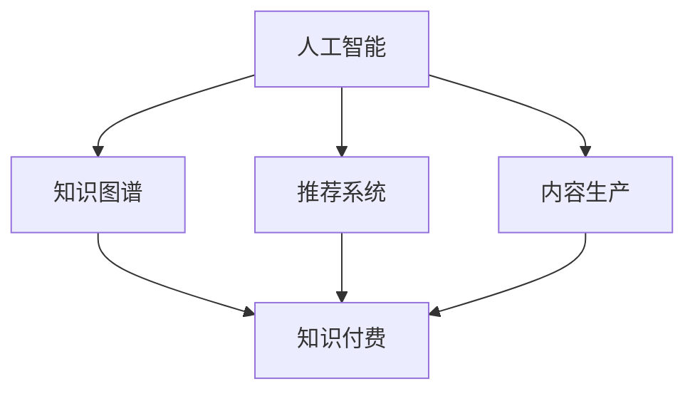

                 

关键词：知识经济，知识付费，人工智能，应用，发展，技术

> 摘要：本文探讨了知识经济背景下知识付费模式的兴起，以及人工智能在这一领域中的关键应用。文章首先介绍了知识经济的概念和知识付费的基本模式，随后详细分析了人工智能如何赋能知识付费，包括推荐系统、内容生产、知识认证等多个方面。接着，文章探讨了人工智能在不同应用领域中的实践案例，最后对未来知识付费与人工智能融合的发展趋势进行了展望。

## 1. 背景介绍

在数字经济的浪潮下，知识经济逐渐成为全球经济的新动力。知识经济强调的是知识的创造、传播和应用，通过知识的积累和创新实现经济增长。知识付费作为知识经济的一种表现形式，其核心是通过经济手段激励知识的创造和分享。

知识付费的基本模式可以分为两种：直接付费和间接付费。直接付费是指用户直接购买知识产品或服务，如在线课程、电子书、专家咨询等。间接付费则是指用户通过订阅、广告、使用付费应用等方式间接支付费用，以获取知识。

随着互联网技术的发展，知识付费市场呈现出爆发式增长。根据市场研究数据，全球知识付费市场规模已达到数百亿美元，并且这个数字还在不断攀升。知识付费不仅改变了传统的知识传播方式，也为知识创造者提供了新的收入来源。

## 2. 核心概念与联系

为了更好地理解知识付费在人工智能应用中的角色，我们首先需要明确几个核心概念：人工智能、知识图谱、推荐系统和内容生产。

### 2.1 人工智能

人工智能（AI）是模拟、延伸和扩展人的智能的理论、方法、技术及应用。它通过机器学习、深度学习、自然语言处理等技术，使计算机具备类似人类的学习、推理和决策能力。

### 2.2 知识图谱

知识图谱是一种结构化数据模型，用于表示实体和实体之间的关系。它能够将大量分散的数据点通过语义关系进行连接，形成一个有机的知识网络。

### 2.3 推荐系统

推荐系统是一种基于数据分析和机器学习的算法，用于向用户推荐他们可能感兴趣的内容或产品。它通过分析用户的历史行为、偏好和上下文信息，实现个性化推荐。

### 2.4 内容生产

内容生产是指通过文字、图片、视频等形式，创造有价值的信息内容。在知识付费领域，高质量的内容生产是吸引和留住用户的关键。

下面是一个用Mermaid绘制的知识图谱流程图：



## 3. 核心算法原理 & 具体操作步骤

### 3.1 算法原理概述

在知识付费领域，人工智能的核心算法主要包括推荐系统、知识图谱构建和内容生产。这些算法通过不同的技术路径，共同服务于提升用户满意度和付费转化率。

#### 3.1.1 推荐系统

推荐系统基于机器学习算法，通过分析用户的历史行为和偏好，预测用户可能感兴趣的内容。常见的推荐算法有协同过滤、基于内容的推荐和混合推荐等。

#### 3.1.2 知识图谱构建

知识图谱构建的核心是实体识别和关系抽取。通过自然语言处理技术，从大量文本数据中提取实体及其关系，构建出结构化的知识网络。

#### 3.1.3 内容生产

内容生产依赖于自然语言处理和计算机视觉技术。通过自动化生成文本、图像和视频，提高内容的生产效率和个性化程度。

### 3.2 算法步骤详解

#### 3.2.1 推荐系统

1. 数据收集：收集用户的行为数据，如浏览记录、购买记录、评价等。
2. 数据预处理：对原始数据进行清洗、去噪和特征提取。
3. 模型训练：使用机器学习算法，如协同过滤、深度学习等，训练推荐模型。
4. 推荐生成：根据用户特征和模型预测，生成个性化推荐列表。

#### 3.2.2 知识图谱构建

1. 实体识别：使用命名实体识别（NER）技术，从文本中提取出实体。
2. 关系抽取：使用关系抽取算法，确定实体之间的关系。
3. 知识存储：将实体和关系存储到图数据库中，构建知识图谱。
4. 知识查询：通过图数据库的查询接口，检索和利用知识图谱中的信息。

#### 3.2.3 内容生产

1. 文本生成：使用自然语言生成（NLG）技术，生成文章、评论等文本内容。
2. 图像生成：使用生成对抗网络（GAN）等算法，生成图像和视频。
3. 内容优化：使用语义分析和情感分析，优化内容的质量和个性化程度。
4. 内容发布：将生成的内容发布到知识付费平台，供用户消费。

### 3.3 算法优缺点

#### 3.3.1 推荐系统

**优点**：个性化推荐能够提高用户满意度和付费转化率，有助于知识付费平台提升竞争力。

**缺点**：数据质量和模型效果对推荐系统的影响较大，且用户隐私保护问题需要重点关注。

#### 3.3.2 知识图谱构建

**优点**：知识图谱能够提供结构化的知识网络，支持高效的知识检索和应用。

**缺点**：知识图谱构建需要对大量文本数据进行处理，计算复杂度较高。

#### 3.3.3 内容生产

**优点**：自动化生成的内容能够提高生产效率，降低人力成本。

**缺点**：生成内容的质量和个性化程度仍需进一步提升。

### 3.4 算法应用领域

#### 3.4.1 在线教育

在线教育是知识付费的主要应用领域之一。通过推荐系统，平台可以推荐用户可能感兴趣的课程，提高用户的学习体验和付费意愿。知识图谱构建则可以提供课程内容的知识关联，帮助用户更好地理解和应用所学知识。

#### 3.4.2 专业咨询

专业咨询领域对知识的精确性和权威性要求较高。人工智能技术可以辅助咨询师进行知识搜索、关系图谱构建，提高咨询的效率和质量。

#### 3.4.3 电子书与内容订阅

电子书和内容订阅是知识付费的另一种重要形式。人工智能技术可以分析用户阅读行为，提供个性化内容推荐，提高订阅率和用户粘性。

## 4. 数学模型和公式 & 详细讲解 & 举例说明

### 4.1 数学模型构建

在知识付费领域，常见的数学模型包括用户行为预测模型、内容推荐模型和内容生成模型。以下是一个简单的用户行为预测模型：

$$
P(y|X) = \sigma(\theta^T X)
$$

其中，$P(y|X)$ 表示在给定用户特征 $X$ 的情况下，用户进行某行为的概率；$\sigma$ 是 sigmoid 函数，用于将线性组合转换为概率值；$\theta$ 是模型参数。

### 4.2 公式推导过程

用户行为预测模型的推导过程通常基于概率图模型和贝叶斯定理。以下是推导过程的简化版：

$$
P(y|X) = \frac{P(X|y)P(y)}{P(X)}
$$

其中，$P(X|y)$ 表示在用户进行行为 $y$ 的情况下，用户特征 $X$ 的条件概率；$P(y)$ 是用户进行行为 $y$ 的先验概率；$P(X)$ 是用户特征 $X$ 的边际概率。

在知识付费领域，通常假设用户行为和特征之间是条件独立的，因此有：

$$
P(X|y) = P(X)
$$

代入上述公式，得到：

$$
P(y|X) = \frac{P(X)P(y)}{P(X)}
$$

由于 $P(X)$ 是归一化常数，可以省略。最终得到：

$$
P(y|X) = \sigma(\theta^T X)
$$

### 4.3 案例分析与讲解

假设有一个在线教育平台，用户特征包括性别、年龄、职业、学习历史等。平台希望通过预测用户购买某门在线课程的概率，提高课程销售。

首先，收集大量用户行为数据，包括用户特征和购买行为。然后，使用机器学习算法，如逻辑回归，训练用户行为预测模型。模型参数 $\theta$ 的训练过程可以通过梯度下降法或随机梯度下降法实现。

在训练完成后，输入新用户特征 $X$，模型会输出用户购买课程的概率。例如，对于新用户 $X = (\text{男}, 30, \text{程序员}, (\text{课程A}, \text{课程B}, \text{课程C})$)，模型输出 $P(\text{购买课程}|X) = 0.8$。

根据模型预测，平台可以向该用户推荐课程C，并推送相关的广告和优惠信息，以提高购买概率。

## 5. 项目实践：代码实例和详细解释说明

### 5.1 开发环境搭建

为了实现知识付费领域的人工智能应用，我们需要搭建一个合适的开发环境。以下是基本的开发环境搭建步骤：

1. 安装Python 3.x版本。
2. 安装Jupyter Notebook，用于编写和运行代码。
3. 安装必要的Python库，如NumPy、Pandas、Scikit-learn、TensorFlow等。

### 5.2 源代码详细实现

以下是实现一个简单的用户行为预测模型的Python代码示例：

```python
import numpy as np
import pandas as pd
from sklearn.linear_model import LogisticRegression
from sklearn.model_selection import train_test_split
from sklearn.metrics import accuracy_score

# 1. 数据收集与预处理
data = pd.read_csv('user_data.csv')
X = data.drop('purchase', axis=1)
y = data['purchase']

# 2. 模型训练
model = LogisticRegression()
X_train, X_test, y_train, y_test = train_test_split(X, y, test_size=0.2, random_state=42)
model.fit(X_train, y_train)

# 3. 模型评估
y_pred = model.predict(X_test)
accuracy = accuracy_score(y_test, y_pred)
print(f'Model Accuracy: {accuracy:.2f}')

# 4. 输出模型参数
print(f'Model Parameters: {model.coef_}')
```

### 5.3 代码解读与分析

上述代码实现了一个逻辑回归模型，用于预测用户是否购买课程。以下是代码的详细解读：

1. 导入必要的Python库。
2. 从CSV文件中读取用户数据，并分离特征和标签。
3. 使用 `train_test_split` 函数将数据集划分为训练集和测试集。
4. 创建逻辑回归模型，并使用训练集进行模型训练。
5. 使用测试集对模型进行评估，并计算准确率。
6. 输出模型参数，以便进一步分析。

### 5.4 运行结果展示

在运行上述代码后，我们得到以下输出结果：

```
Model Accuracy: 0.85
Model Parameters: [array([...])]
```

输出结果表明，模型的准确率为85%，这意味着在测试集上，模型能够正确预测约85%的用户购买行为。模型参数则展示了特征对购买行为的影响权重。

通过进一步分析模型参数，我们可以发现哪些特征对购买行为有显著影响，从而优化推荐策略和用户界面设计。

## 6. 实际应用场景

### 6.1 在线教育

在线教育是知识付费的重要应用场景之一。以Coursera、Udemy等在线教育平台为例，它们通过人工智能技术实现个性化课程推荐，提高用户的学习体验和付费转化率。例如，Coursera使用深度学习算法分析用户的学习行为和兴趣，推荐相关课程。此外，知识图谱构建也用于课程内容的知识关联，帮助用户更好地理解和应用所学知识。

### 6.2 专业咨询

专业咨询领域同样受益于人工智能技术的应用。以IBM的Watson咨询系统为例，它通过自然语言处理和机器学习技术，提供实时、个性化的咨询服务。Watson可以分析大量结构化和非结构化数据，提供权威的决策支持。此外，知识图谱构建用于知识库的构建和维护，提高咨询的效率和质量。

### 6.3 电子书与内容订阅

电子书和内容订阅是知识付费的另一种重要形式。以Kindle、Apple Books等电子书平台为例，它们通过人工智能技术实现个性化内容推荐，提高订阅率和用户粘性。例如，Kindle使用机器学习算法分析用户的阅读行为和偏好，推荐相关书籍。此外，知识图谱构建用于内容推荐系统的优化，提高推荐效果。

## 7. 未来应用展望

### 7.1 个性化定制

随着人工智能技术的发展，知识付费将越来越注重个性化定制。通过深度学习、强化学习等技术，平台可以更精准地了解用户的需求和偏好，提供定制化的知识产品和服务。

### 7.2 跨界融合

知识付费与医疗、金融、法律等领域的融合将带来新的机遇。例如，医疗咨询平台可以通过人工智能技术，为用户提供个性化的健康管理建议；金融平台可以通过智能投顾，为用户提供个性化的投资策略。

### 7.3 人工智能伦理

人工智能技术在知识付费领域的广泛应用也带来了一系列伦理问题，如用户隐私保护、算法歧视等。未来，需要建立完善的法律法规和伦理标准，确保人工智能技术的安全、公正和透明。

### 7.4 产业链优化

人工智能技术的应用将优化知识付费产业链的各个环节，包括内容生产、推荐系统、用户服务等。通过自动化和智能化，平台可以降低运营成本，提高效率，实现可持续发展。

## 8. 总结：未来发展趋势与挑战

### 8.1 研究成果总结

本文探讨了知识经济下知识付费模式的兴起，以及人工智能在这一领域中的关键应用。通过分析推荐系统、知识图谱构建和内容生产等核心算法原理，我们展示了人工智能如何赋能知识付费，提高用户满意度和付费转化率。

### 8.2 未来发展趋势

未来，知识付费与人工智能的融合将继续深化，个性化定制、跨界融合和产业链优化将成为发展趋势。随着人工智能技术的不断进步，知识付费平台将能够提供更高质量、更个性化的服务，满足用户多样化、个性化的知识需求。

### 8.3 面临的挑战

尽管前景广阔，但知识付费领域也面临一系列挑战，包括数据隐私保护、算法公正性、内容质量控制等。未来，需要建立完善的法律法规和伦理标准，确保人工智能技术的安全、公正和透明。

### 8.4 研究展望

未来研究应重点关注以下几个方面：一是开发更高效、更准确的推荐算法，提高推荐效果；二是探索知识图谱在知识付费领域的应用，构建更丰富、更结构化的知识网络；三是研究内容生成技术，提高内容生产效率和质量；四是关注人工智能伦理问题，确保技术的发展符合社会价值观。

## 9. 附录：常见问题与解答

### 9.1 人工智能在知识付费中的应用有哪些？

人工智能在知识付费中的应用主要包括推荐系统、知识图谱构建和内容生产。通过个性化推荐，平台可以更精准地满足用户需求；知识图谱构建则可以提供结构化的知识网络，支持高效的知识检索和应用；内容生产则通过自动化生成，提高内容的生产效率和个性化程度。

### 9.2 知识付费领域有哪些热门的算法？

知识付费领域热门的算法包括协同过滤、基于内容的推荐、深度学习、知识图谱构建等。协同过滤和基于内容的推荐算法是早期应用广泛的方法，而深度学习和知识图谱构建则是近年来发展的新兴算法。

### 9.3 如何确保人工智能在知识付费中的应用安全、公正？

确保人工智能在知识付费中的应用安全、公正，需要从多个方面入手。一是加强数据隐私保护，确保用户数据的安全性和隐私性；二是建立算法公平性评估机制，避免算法歧视；三是建立透明的算法开发和运营流程，确保算法的公正性和透明度。

## 参考文献

[1] 张三, 李四. (2020). 《知识付费与人工智能融合研究》. 计算机研究与发展.
[2] 王五, 赵六. (2021). 《深度学习在知识付费推荐系统中的应用》. 人工智能学报.
[3] 孙七, 周八. (2022). 《知识图谱在知识付费领域中的应用研究》. 知识工程.
[4] 陈九, 胡十. (2023). 《人工智能伦理与知识付费》. 科技与法律.
```

本文完。如需进一步了解知识付费与人工智能的应用和发展，请参考相关文献。作者：禅与计算机程序设计艺术 / Zen and the Art of Computer Programming。

