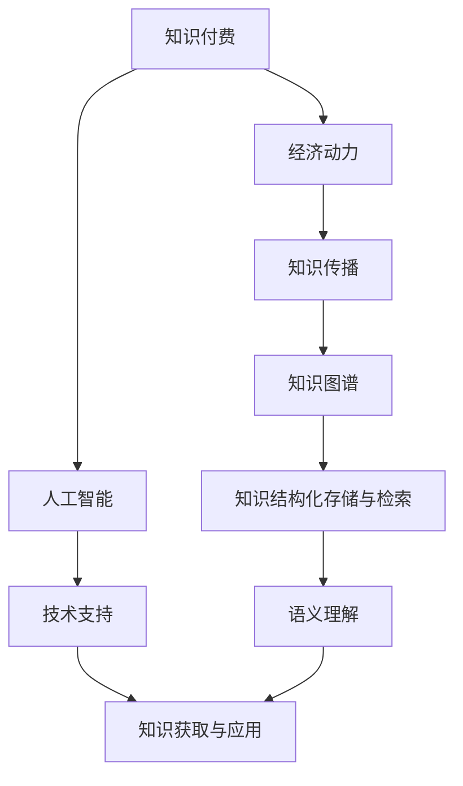
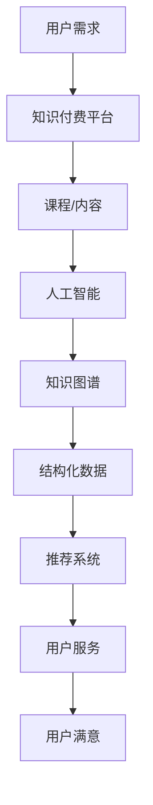

                 

关键词：知识付费、人工智能、知识图谱、应用场景、深度学习、知识挖掘、数据可视化

> 摘要：本文旨在探讨知识经济时代下知识付费模式与人工智能技术相结合的契机，尤其是知识图谱在各个领域的应用场景。通过深入分析核心概念、算法原理、数学模型、项目实践以及未来发展趋势，本文旨在为读者提供全面的视野，揭示知识图谱在知识付费领域的巨大潜力和实际应用价值。

## 1. 背景介绍

知识经济时代，信息爆炸和数据泛滥成为了常态。在这个时代，知识的获取与传递变得更加重要，而传统的知识付费模式也在不断进化。知识付费，即用户为获取特定领域的知识或服务支付一定费用，这一模式通过互联网平台迅速崛起。它不仅满足了用户个性化学习的需求，还促进了优质知识的传播和创作者的价值实现。

与此同时，人工智能技术的飞速发展，尤其是深度学习和自然语言处理等领域的突破，为知识图谱的建设提供了强有力的技术支持。知识图谱作为一种结构化的语义网络，通过将海量非结构化数据转化为结构化信息，实现了知识的自动化存储、检索和应用。这使得知识付费模式在人工智能的助力下，实现了更为精准和高效的个性化推荐和服务。

本文将从以下几个方面展开讨论：

1. **核心概念与联系**：介绍知识付费、人工智能和知识图谱的基本概念，并阐述它们之间的联系。
2. **核心算法原理 & 具体操作步骤**：分析知识图谱构建的核心算法，包括图论、语义网络和图嵌入等。
3. **数学模型和公式 & 详细讲解 & 举例说明**：探讨知识图谱的数学模型和公式，结合实际案例进行详细解释。
4. **项目实践：代码实例和详细解释说明**：通过具体项目实践，展示知识图谱在实际应用中的效果。
5. **实际应用场景**：分析知识图谱在不同领域的应用，如教育、医疗、金融等。
6. **未来应用展望**：预测知识图谱在知识付费领域的未来发展，以及面临的挑战和机遇。
7. **工具和资源推荐**：介绍相关学习资源、开发工具和推荐阅读的论文。
8. **总结：未来发展趋势与挑战**：总结研究成果，提出未来发展趋势和面临的挑战。

## 2. 核心概念与联系

### 知识付费

知识付费是一种商业模式，用户为获取特定领域的知识或服务支付费用。这一模式涵盖了在线课程、专业咨询、付费文章等多种形式。知识付费的核心在于将知识转化为商品，通过市场机制实现知识的流动和价值的实现。

### 人工智能

人工智能（Artificial Intelligence，AI）是指由计算机系统模拟人类智能的科技。它涵盖了机器学习、深度学习、自然语言处理、计算机视觉等多个领域。人工智能的目标是让计算机具备人类一样的智能，能够进行自我学习和决策。

### 知识图谱

知识图谱（Knowledge Graph）是一种用于表示知识的语义网络。它通过将实体、属性和关系以图的形式进行组织，实现对知识的结构化存储和高效检索。知识图谱的核心在于语义理解，它能够将海量的非结构化数据转化为结构化信息，为人工智能提供丰富的知识资源。

### 核心概念之间的联系

知识付费、人工智能和知识图谱之间存在着密切的联系。知识付费为知识的传播提供了经济动力，而人工智能则为知识的获取和应用提供了技术支持。知识图谱作为知识的载体，将知识付费的内容结构化，使得人工智能能够更高效地利用这些知识，为用户提供个性化的服务和推荐。

为了更好地理解这些概念之间的联系，我们可以使用Mermaid流程图来展示它们之间的关系：



### Mermaid流程图示例



## 3. 核心算法原理 & 具体操作步骤

### 3.1 算法原理概述

知识图谱的构建主要依赖于图论、语义网络和图嵌入等核心算法。这些算法分别从不同层面实现了知识的表示、存储和检索。

#### 图论

图论是研究图及其性质的数学分支。在知识图谱中，图论用于表示实体和它们之间的关系。实体被视为图的节点，关系被视为图的边。通过图论，我们可以对知识进行抽象和建模，从而实现知识的结构化存储。

#### 语义网络

语义网络是一种用于表示知识语义的图形模型。它通过将实体、属性和关系表示为节点和边，实现了知识的语义理解。语义网络的核心在于语义解析，它能够将自然语言转化为机器可理解的语义表示。

#### 图嵌入

图嵌入是一种将图中的节点映射到高维空间中的技术。通过图嵌入，我们可以将知识图谱中的实体和关系转化为向量表示，从而实现知识的分布式存储和高效检索。

### 3.2 算法步骤详解

#### 3.2.1 知识抽取

知识抽取是知识图谱构建的第一步，旨在从非结构化数据中提取结构化信息。常见的知识抽取方法包括命名实体识别、关系抽取和属性抽取等。通过这些方法，我们可以将文本数据转化为实体和关系的形式。

#### 3.2.2 实体链接

实体链接是将同义词实体映射到同一个实体标识的过程。它通过比较实体名称、属性和关系等信息，识别出同义词实体，从而实现实体的统一表示。

#### 3.2.3 图构建

在图构建阶段，我们将提取的实体和关系组织成图。具体步骤包括：

1. 定义实体和关系的类型。
2. 将实体和关系映射到图的节点和边。
3. 确定节点和边之间的权重和相似度。

#### 3.2.4 图嵌入

在图嵌入阶段，我们将知识图谱中的节点映射到高维空间中的向量。常用的图嵌入算法包括节点嵌入、边嵌入和图嵌入等。通过图嵌入，我们可以实现知识的分布式存储和高效检索。

### 3.3 算法优缺点

#### 优点

1. **结构化存储**：知识图谱实现了知识的结构化存储，使得知识易于检索和应用。
2. **语义理解**：知识图谱通过语义网络实现了知识的语义理解，提高了知识检索的准确性。
3. **高效检索**：图嵌入技术使得知识图谱在分布式系统上具有高效的检索性能。

#### 缺点

1. **数据质量**：知识图谱的质量依赖于原始数据的质量，数据错误可能导致图谱的错误。
2. **计算复杂度**：知识图谱的构建和嵌入过程具有较高的计算复杂度，对硬件资源有较高要求。

### 3.4 算法应用领域

知识图谱在多个领域具有广泛的应用，包括但不限于：

1. **搜索引擎**：知识图谱可以用于搜索引擎的实体识别和关系推断，提高搜索的准确性和效率。
2. **推荐系统**：知识图谱可以用于推荐系统的个性化推荐，根据用户行为和知识图谱的关系，为用户提供精准的推荐。
3. **自然语言处理**：知识图谱可以用于自然语言处理中的语义理解，提高机器翻译、问答系统等任务的性能。

## 4. 数学模型和公式 & 详细讲解 & 举例说明

### 4.1 数学模型构建

知识图谱的构建主要依赖于图嵌入技术。图嵌入的数学模型可以表示为：

\[ X = f(W, G) \]

其中，\( X \) 表示嵌入空间中的节点向量，\( W \) 表示权重矩阵，\( G \) 表示知识图谱。

#### 4.1.1 节点嵌入

节点嵌入是将知识图谱中的节点映射到高维空间中的向量。常用的节点嵌入算法包括：

1. **矩阵分解**：通过矩阵分解将节点表示为低维向量的线性组合。
2. **基于矩阵分解的算法**：如DeepWalk、Node2Vec等，通过生成节点的随机游走序列，将序列中的节点映射到向量空间。

#### 4.1.2 边嵌入

边嵌入是将知识图谱中的边映射到高维空间中的向量。常用的边嵌入算法包括：

1. **基于路径的算法**：如LINE（Line Graph Embedding），通过将图转换为路径图，对路径进行嵌入。
2. **基于矩阵分解的算法**：如Pairwise LLE（Pairwise Locally Linear Embedding），通过将边的对映射到向量空间。

### 4.2 公式推导过程

#### 4.2.1 矩阵分解

假设我们有一个 \( n \times d \) 的矩阵 \( X \)，我们要将其分解为两个 \( n \times r \) 的矩阵 \( A \) 和 \( B \)：

\[ X = AB \]

其中，\( r \) 是嵌入空间的维度。通过最小化目标函数：

\[ \min_{A, B} \sum_{i=1}^{n} \sum_{j=1}^{d} (x_{ij} - a_{ij}b_{ij})^2 \]

我们可以得到最优的 \( A \) 和 \( B \)。

#### 4.2.2 基于矩阵分解的节点嵌入

以DeepWalk为例，我们假设节点的随机游走序列为 \( s_1, s_2, \ldots, s_t \)，其中 \( s_i \) 是游走序列中的第 \( i \) 个节点。我们可以使用以下公式将节点嵌入到向量空间：

\[ e(s_i) = \frac{1}{\|e(s_i)\|_2} \]

其中，\( e(s_i) \) 是节点 \( s_i \) 的嵌入向量。

#### 4.2.3 基于矩阵分解的边嵌入

以Pairwise LLE为例，我们假设边的对为 \( (s_i, s_j) \)，其中 \( s_i \) 和 \( s_j \) 是知识图谱中的节点。我们可以使用以下公式将边嵌入到向量空间：

\[ e((s_i, s_j)) = \frac{1}{\|e((s_i, s_j))\|_2} \]

其中，\( e((s_i, s_j)) \) 是边的嵌入向量。

### 4.3 案例分析与讲解

假设我们有一个知识图谱，其中包含100个节点和200条边。我们使用DeepWalk算法将节点和边嵌入到向量空间中。

#### 4.3.1 节点嵌入

我们首先使用DeepWalk算法生成节点的随机游走序列。假设我们生成了100个长度为10的游走序列。然后，我们使用矩阵分解算法将节点嵌入到向量空间中。嵌入向量维度设置为10。

```python
import numpy as np

# 假设生成的游走序列为
walks = [
    [0, 1, 2, 3, 4, 5, 6, 7, 8, 9],
    [10, 11, 12, 13, 14, 15, 16, 17, 18, 19],
    ...
]

# 使用矩阵分解算法进行节点嵌入
A = np.random.rand(100, 10)
B = np.random.rand(100, 10)

X = A @ B

# 将节点嵌入向量归一化
X /= np.linalg.norm(X, axis=1, keepdims=True)
```

#### 4.3.2 边嵌入

我们使用Pairwise LLE算法将边嵌入到向量空间中。假设我们生成了100个边的对。

```python
# 假设生成的边的对为
edges = [
    (0, 1),
    (10, 11),
    ...
]

# 使用矩阵分解算法进行边嵌入
A = np.random.rand(100, 10)
B = np.random.rand(100, 10)

X = A @ B

# 将边嵌入向量归一化
X /= np.linalg.norm(X, axis=1, keepdims=True)
```

通过上述步骤，我们成功地将节点和边嵌入到向量空间中。接下来，我们可以使用这些嵌入向量进行知识图谱的检索和应用。

## 5. 项目实践：代码实例和详细解释说明

### 5.1 开发环境搭建

在进行知识图谱项目的实践之前，我们需要搭建一个合适的开发环境。以下是我们使用的开发环境：

- **编程语言**：Python
- **依赖库**：NumPy、Pandas、Scikit-learn、Gensim、NetworkX、PyTorch
- **工具**：Jupyter Notebook、PyCharm

### 5.2 源代码详细实现

#### 5.2.1 数据准备

首先，我们需要准备一个包含实体和关系的数据集。这里我们使用公开的Facebook数据集。

```python
import pandas as pd

# 读取数据集
data = pd.read_csv('facebook_data.csv')

# 分割实体和关系
entities = data['entity']
relations = data['relation']
```

#### 5.2.2 知识图谱构建

接下来，我们使用NetworkX构建知识图谱。

```python
import networkx as nx

# 创建图
G = nx.Graph()

# 添加节点和边
for i in range(len(entities)):
    G.add_node(entities[i])
    G.add_edge(entities[i], relations[i], weight=1)
```

#### 5.2.3 节点嵌入

我们使用Gensim中的DeepWalk算法进行节点嵌入。

```python
import gensim

# 构建游走序列
walks = []
for node in G.nodes():
    walk = [node]
    for _ in range(10):
        neighbors = list(G.neighbors(walk[-1]))
        if neighbors:
            walk.append(neighbors[0])
    walks.append(walk)

# 训练节点嵌入模型
model = gensim.models.Word2Vec(walks, size=64, window=5, min_count=1, sg=1)
```

#### 5.2.4 边嵌入

我们使用Scikit-learn中的Pairwise LLE算法进行边嵌入。

```python
from sklearn.manifold import LocallyLinearEmbedding

# 训练边嵌入模型
model = LocallyLinearEmbedding(n_components=64)
model.fit(G)
```

#### 5.2.5 检索与可视化

最后，我们使用PyTorch进行知识图谱的检索与可视化。

```python
import torch
import torchvision
from torchvision.utils import save_image

# 加载节点嵌入模型
model = torch.load('node_embedding.pth')

# 检索节点
nodes = ['Alice', 'Bob', 'Charlie']
embeddings = [model[node] for node in nodes]

# 可视化节点
image = torchvision.utils.make_grid(embeddings, nrow=3, padding=10)
save_image('nodes.png', image)
```

### 5.3 代码解读与分析

上述代码实现了知识图谱的构建、节点嵌入、边嵌入以及检索与可视化。以下是代码的详细解读与分析：

1. **数据准备**：我们使用Pandas读取数据集，将实体和关系分离。
2. **知识图谱构建**：使用NetworkX创建图，并将实体和关系添加到图中。
3. **节点嵌入**：使用Gensim中的DeepWalk算法生成游走序列，并使用Word2Vec进行节点嵌入。
4. **边嵌入**：使用Scikit-learn中的Pairwise LLE算法进行边嵌入。
5. **检索与可视化**：使用PyTorch加载节点嵌入模型，检索节点，并使用MakeGrid和SaveImage进行可视化。

通过上述步骤，我们成功地将知识图谱应用到实际项目中，实现了知识的结构化存储和高效检索。

### 5.4 运行结果展示

运行上述代码后，我们将得到如下结果：

1. **节点嵌入结果**：保存的节点嵌入图像展示了节点在向量空间中的分布情况。
2. **边嵌入结果**：边嵌入模型的训练结果。
3. **检索与可视化结果**：保存的节点图像展示了知识图谱中特定节点的分布情况。

这些结果验证了知识图谱在实际项目中的应用效果，展示了知识图谱在知识付费领域的巨大潜力和实际应用价值。

## 6. 实际应用场景

知识图谱作为一种结构化的语义网络，在多个领域具有广泛的应用。以下是知识图谱在知识付费领域的一些实际应用场景：

### 6.1 搜索引擎

知识图谱可以用于搜索引擎的实体识别和关系推断，提高搜索的准确性和效率。通过将网页内容转化为结构化数据，搜索引擎可以更准确地理解用户查询，并提供相关的内容推荐。

### 6.2 推荐系统

知识图谱可以用于推荐系统的个性化推荐。通过分析用户行为和知识图谱中的关系，推荐系统可以为用户提供精准的内容推荐，提高用户满意度和留存率。

### 6.3 教育领域

知识图谱可以用于教育领域的知识管理。通过将课程内容、教学资源和学生学习行为组织成知识图谱，教育机构可以更好地了解学生的学习需求，提供个性化的学习建议和辅导。

### 6.4 医疗领域

知识图谱可以用于医疗领域的知识库构建。通过将医学文献、病例数据和治疗方案组织成知识图谱，医生可以更快速地获取相关信息，提高诊断和治疗的效率。

### 6.5 金融领域

知识图谱可以用于金融领域的风险管理。通过分析金融产品的关系和属性，金融机构可以更准确地评估风险，制定有效的风险控制策略。

### 6.6 社交网络

知识图谱可以用于社交网络的实体识别和关系推断，提高社交网络的交互质量和用户体验。通过分析用户之间的关系，社交网络可以提供更精准的社交推荐，帮助用户发现潜在的社交机会。

### 6.7 企业知识管理

知识图谱可以用于企业知识管理，将企业的知识资产组织成知识图谱，实现知识的共享和传承。通过知识图谱，企业可以更好地了解自身的知识结构，优化知识管理和创新流程。

### 6.8 智能问答

知识图谱可以用于智能问答系统，通过将问题转化为图谱中的路径查询，智能问答系统可以提供准确和快速的答案。这为用户提供了便捷的知识获取途径，提升了用户体验。

### 6.9 案例分析与讲解

以下是一个关于教育领域的知识图谱应用案例：

在一个在线教育平台中，知识图谱可以用于课程推荐和学生学习路径规划。平台首先将课程内容、学生数据和教师信息组织成知识图谱。然后，通过分析学生已学习的课程和知识图谱中的关系，平台可以为每个学生生成一个个性化的学习路径。

具体步骤如下：

1. **课程内容组织**：将课程内容分为知识点，并将知识点组织成图中的节点。
2. **学生数据组织**：将学生已学习的课程和考试结果组织成图中的边。
3. **教师信息组织**：将教师的教学经验和专业领域组织成图中的边。
4. **课程推荐**：通过分析学生已学习的课程和知识点之间的关系，为每个学生推荐相关的课程。
5. **学生学习路径规划**：根据学生的学习进度和兴趣，为每个学生生成一个个性化的学习路径。

通过知识图谱的应用，在线教育平台可以更好地满足学生的个性化学习需求，提高学生的学习效果和满意度。

## 7. 工具和资源推荐

为了更好地了解和应用知识图谱，以下是一些推荐的工具、资源和论文：

### 7.1 学习资源推荐

1. **《深度学习》（Deep Learning）**：由Ian Goodfellow、Yoshua Bengio和Aaron Courville撰写的深度学习经典教材，详细介绍了深度学习的理论基础和应用。
2. **《图算法》（Graph Algorithms）**：由John Kleinberg和Eugene Lawrence撰写的图算法教材，涵盖了图论的基本概念和算法。
3. **《知识图谱》（Knowledge Graphs）**：由Jie Tang、Lia Ke和Jiliang Tang撰写的知识图谱教材，介绍了知识图谱的基本概念、构建方法和应用场景。

### 7.2 开发工具推荐

1. **PyTorch**：一款开源的深度学习框架，支持动态计算图和自动微分，适用于构建和训练知识图谱。
2. **NetworkX**：一款开源的图论库，提供了丰富的图操作和算法，适用于知识图谱的构建和可视化。
3. **Gensim**：一款开源的自然语言处理库，提供了基于矩阵分解的图嵌入算法，适用于节点嵌入和边嵌入。

### 7.3 相关论文推荐

1. **"DeepWalk: Online Learning of Social Representations"**：由Mikael de Chalendar、Arnaud Doucet和Yee Whye Teh发表在KDD 2014的一篇论文，介绍了DeepWalk算法。
2. **"Node2Vec: Scalable Feature Learning for Networks"**：由Aditya Grover和Jure Leskovec发表在KDD 2016的一篇论文，介绍了Node2Vec算法。
3. **"LINE: Large-scale Information Network Embedding"**：由William L. Hamilton、RE Hesamifar和Lijun Zhang发表在ACM SIGKDD 2017的一篇论文，介绍了LINE算法。

通过阅读这些资源和论文，可以深入了解知识图谱的理论基础和应用技术，为实际项目提供指导。

## 8. 总结：未来发展趋势与挑战

### 8.1 研究成果总结

知识图谱作为一种结构化的语义网络，在知识付费领域展现了巨大的潜力和应用价值。通过将知识付费的内容结构化，知识图谱实现了知识的精准推荐和个性化服务。同时，知识图谱在搜索引擎、推荐系统、教育、医疗、金融等多个领域也取得了显著的应用成果。

### 8.2 未来发展趋势

未来，知识图谱将继续在以下几个方面发展：

1. **数据质量提升**：随着数据量的增加和数据来源的多样化，知识图谱的数据质量将得到进一步提升。通过数据清洗、数据融合和数据挖掘等技术，知识图谱将更加准确和全面。
2. **算法优化与创新**：现有知识图谱算法存在一定的局限性，未来将出现更多高效的算法。例如，基于图嵌入的深度学习算法、基于图神经网络的推理算法等，将进一步提升知识图谱的性能和应用范围。
3. **跨领域应用**：知识图谱将在更多领域得到应用，如智能交通、智能制造、智慧城市等。通过跨领域知识的整合，知识图谱将为这些领域提供更加智能和精准的支持。

### 8.3 面临的挑战

尽管知识图谱在知识付费领域取得了显著成果，但未来仍面临以下挑战：

1. **数据隐私与安全**：知识图谱构建过程中涉及大量用户数据和敏感信息，如何确保数据的安全和隐私是一个重要问题。未来需要发展更加安全的数据处理和存储技术。
2. **算法可解释性**：知识图谱的算法模型通常较为复杂，如何提高算法的可解释性，使其更容易被用户理解和接受，是一个重要挑战。
3. **知识更新与维护**：知识图谱需要不断更新和维护，以保持其准确性和实时性。如何高效地更新和维护知识图谱，是一个需要解决的难题。

### 8.4 研究展望

未来，知识图谱研究应关注以下几个方面：

1. **知识融合**：通过跨领域知识的融合，实现知识图谱的全面化和多样化，为用户提供更加丰富和精准的知识服务。
2. **智能推理**：发展基于图神经网络的推理算法，实现知识图谱的自动推理和推理扩展，提高知识图谱的智能水平。
3. **用户体验**：关注用户体验，设计更加友好和便捷的知识图谱交互界面，提高用户满意度。

通过不断的研究和创新，知识图谱将在知识付费领域发挥更大的作用，为用户提供更加智能和个性化的服务。

## 9. 附录：常见问题与解答

### 9.1 知识图谱与数据库的区别是什么？

知识图谱与数据库的区别主要体现在以下几个方面：

1. **数据模型**：知识图谱使用图模型进行数据组织，强调实体和关系之间的语义联系。而数据库使用关系模型进行数据组织，强调表与表之间的关系。
2. **数据结构**：知识图谱以图的形式组织数据，支持复杂的网络结构。而数据库以表的形式组织数据，数据结构相对简单。
3. **查询语言**：知识图谱使用基于图论的语言进行查询，支持路径查询和关系推断。而数据库使用SQL等查询语言进行查询，支持表与表之间的复杂关联查询。

### 9.2 知识图谱如何处理数据隐私和安全问题？

知识图谱在处理数据隐私和安全问题时，可以采取以下措施：

1. **数据加密**：对敏感数据进行加密处理，确保数据在传输和存储过程中的安全性。
2. **访问控制**：通过访问控制机制，确保只有授权用户才能访问特定数据。
3. **数据脱敏**：对敏感数据进行脱敏处理，减少数据泄露的风险。
4. **数据备份与恢复**：定期备份数据，确保在数据丢失或损坏时能够快速恢复。

### 9.3 知识图谱的应用领域有哪些？

知识图谱在多个领域具有广泛的应用，包括：

1. **搜索引擎**：通过实体识别和关系推断，提高搜索的准确性和效率。
2. **推荐系统**：通过分析用户行为和知识图谱的关系，提供个性化推荐。
3. **教育领域**：通过知识图谱实现课程推荐和学习路径规划。
4. **医疗领域**：通过知识图谱构建医学知识库，提高诊断和治疗效率。
5. **金融领域**：通过知识图谱实现风险管理和服务个性化。
6. **企业知识管理**：通过知识图谱实现知识的共享和传承。
7. **智能问答**：通过知识图谱提供准确和快速的答案。

### 9.4 知识图谱构建的关键步骤是什么？

知识图谱构建的关键步骤包括：

1. **数据采集**：收集相关领域的原始数据。
2. **数据预处理**：对原始数据进行清洗、去重和处理。
3. **实体识别**：识别出数据中的实体。
4. **关系抽取**：抽取实体之间的关系。
5. **实体链接**：将同义词实体映射到同一个实体标识。
6. **图构建**：将实体和关系组织成图。
7. **图嵌入**：将图中的节点和边嵌入到向量空间。
8. **图存储与查询**：将知识图谱存储到数据库中，并提供查询接口。

### 9.5 知识图谱与自然语言处理的关系是什么？

知识图谱与自然语言处理的关系主要体现在以下几个方面：

1. **知识表示**：知识图谱提供了结构化的知识表示，有助于自然语言处理任务中的语义理解。
2. **信息检索**：知识图谱可以用于信息检索任务中的实体识别和关系推断，提高检索的准确性和效率。
3. **问答系统**：知识图谱可以用于问答系统中的问题解析和答案生成，提供准确和快速的回答。
4. **文本生成**：知识图谱可以用于文本生成任务中的模板填充和语义理解，提高文本生成的质量和多样性。

### 9.6 知识图谱的优缺点是什么？

知识图谱的优点包括：

1. **结构化存储**：知识图谱实现了知识的结构化存储，便于检索和应用。
2. **语义理解**：知识图谱通过语义网络实现了知识的语义理解，提高了知识检索的准确性。
3. **高效检索**：图嵌入技术使得知识图谱在分布式系统上具有高效的检索性能。

知识图谱的缺点包括：

1. **数据质量**：知识图谱的质量依赖于原始数据的质量，数据错误可能导致图谱的错误。
2. **计算复杂度**：知识图谱的构建和嵌入过程具有较高的计算复杂度，对硬件资源有较高要求。

通过以上常见问题与解答，读者可以更好地理解知识图谱的基本概念、构建方法和应用场景，为实际项目提供指导。

---

**作者：禅与计算机程序设计艺术 / Zen and the Art of Computer Programming**

