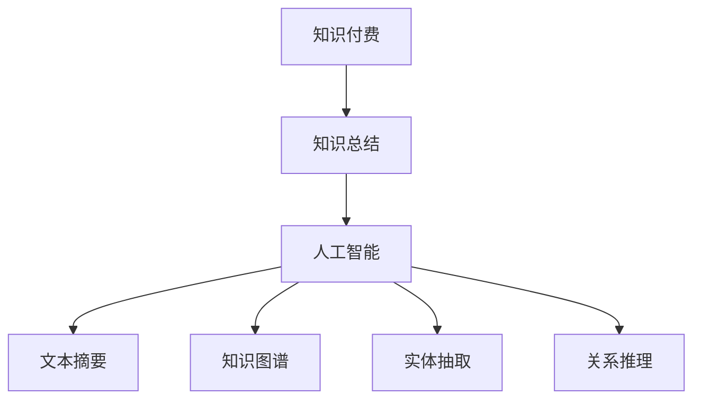
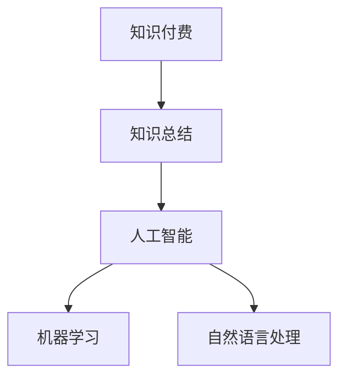

                 

关键词：知识经济、知识付费、人工智能、知识总结、技术

摘要：在知识经济时代，知识付费已成为一种重要的经济模式。本文将探讨人工智能在知识总结领域中的应用，分析现有技术的核心概念、算法原理、数学模型及实际应用，并展望其未来发展。

## 1. 背景介绍

### 知识经济与知识付费

知识经济是指以知识为核心资源，以知识产权为关键要素，通过知识创新、知识传播、知识应用来推动经济发展的一种经济形态。在这种经济模式下，知识的生产、传播、消费和付费成为经济活动的重要环节。

知识付费是指知识提供方通过提供有价值的信息或服务，向知识需求方收取一定费用的一种经济模式。随着互联网技术的发展，知识付费已成为知识经济时代的重要特征。

### 人工智能与知识总结

人工智能（AI）是模拟、延伸和扩展人类智能的理论、方法、技术及应用。知识总结（Knowledge Summarization）是指从大量信息中提取出关键信息，以简洁、高效的方式呈现给用户。

人工智能在知识总结领域具有广泛的应用前景，可以显著提高知识总结的效率和质量。目前，知识总结技术主要包括文本摘要、知识图谱、实体抽取、关系推理等。

## 2. 核心概念与联系

### 核心概念

- **知识付费**：知识提供方通过提供有价值的信息或服务，向知识需求方收取费用。
- **知识总结**：从大量信息中提取出关键信息，以简洁、高效的方式呈现给用户。
- **人工智能**：模拟、延伸和扩展人类智能的理论、方法、技术及应用。

### 关系图



## 3. 核心算法原理 & 具体操作步骤

### 3.1 算法原理概述

知识总结技术主要包括文本摘要、知识图谱、实体抽取和关系推理等。

- **文本摘要**：通过提取文本中的关键信息，生成简洁的摘要。
- **知识图谱**：构建实体和关系之间的网络结构，实现对知识的组织和检索。
- **实体抽取**：识别文本中的关键实体，为知识总结提供基础数据。
- **关系推理**：通过推理算法，分析实体之间的关系，实现对知识的深层次理解。

### 3.2 算法步骤详解

#### 3.2.1 文本摘要

1. 文本预处理：去除停用词、标点符号，进行词性标注等。
2. 词频统计：计算每个词在文本中的出现次数。
3. 文本表示：将文本转换为向量表示。
4. 摘要生成：利用算法（如TextRank、BERT等）生成摘要。

#### 3.2.2 知识图谱

1. 实体识别：从文本中提取实体。
2. 关系抽取：分析实体之间的关系。
3. 图构建：构建实体和关系之间的网络结构。

#### 3.2.3 实体抽取

1. 规则抽取：基于预定义的规则，从文本中抽取实体。
2. 基于模式匹配：利用模式匹配算法，从文本中识别实体。

#### 3.2.4 关系推理

1. 数据预处理：对实体和关系进行预处理。
2. 算法选择：选择合适的推理算法（如逻辑推理、图论推理等）。
3. 关系推理：分析实体之间的关系。

### 3.3 算法优缺点

#### 文本摘要

- 优点：简洁、高效，能够突出文本的关键信息。
- 缺点：摘要质量受文本质量和算法影响较大。

#### 知识图谱

- 优点：结构化、层次化，有利于知识的组织和检索。
- 缺点：构建和维护成本较高。

#### 实体抽取

- 优点：提高知识总结的准确性和效率。
- 缺点：对实体定义的模糊性导致识别难度较大。

#### 关系推理

- 优点：深入分析实体之间的关系，实现知识的深层次理解。
- 缺点：推理算法的复杂度高。

### 3.4 算法应用领域

- 文本摘要：新闻摘要、报告摘要等。
- 知识图谱：企业知识库、学术文献库等。
- 实体抽取：智能问答、信息检索等。
- 关系推理：推荐系统、知识图谱补全等。

## 4. 数学模型和公式 & 详细讲解 & 举例说明

### 4.1 数学模型构建

#### 4.1.1 文本摘要

- 词频-逆文档频率（TF-IDF）模型：

$$
TF(t,d) = \frac{f_t(d)}{N_d}
$$

$$
IDF(t,D) = \log \left( \frac{N}{df_t} \right)
$$

$$
TF-IDF(t,d) = TF(t,d) \times IDF(t,D)
$$

其中，$f_t(d)$ 表示词 $t$ 在文档 $d$ 中的出现次数，$N_d$ 表示文档 $d$ 中的词数，$N$ 表示文档总数，$df_t$ 表示词 $t$ 在文档集合 $D$ 中出现的文档数。

#### 4.1.2 知识图谱

- 节点表示：利用嵌入技术，将实体表示为向量。

$$
\textbf{e}_i = \text{Embedding}(r_i)
$$

其中，$\textbf{e}_i$ 表示实体 $i$ 的向量表示，$r_i$ 表示实体 $i$ 的类型。

#### 4.1.3 实体抽取

- 规则抽取：利用条件概率模型，判断词是否为实体。

$$
P(\text{实体} | \text{词}) = \frac{P(\text{词} | \text{实体}) \times P(\text{实体})}{P(\text{词})}
$$

其中，$P(\text{实体} | \text{词})$ 表示词为实体的概率，$P(\text{词} | \text{实体})$ 表示实体为词的概率，$P(\text{实体})$ 表示实体的概率，$P(\text{词})$ 表示词的概率。

#### 4.1.4 关系推理

- 逻辑推理：利用逻辑规则，分析实体之间的关系。

$$
R(\textbf{e}_i, \textbf{e}_j) = R'(\textbf{e}_i) \wedge R'(\textbf{e}_j)
$$

其中，$R(\textbf{e}_i, \textbf{e}_j)$ 表示实体 $i$ 和 $j$ 之间的关系，$R'(\textbf{e}_i)$ 和 $R'(\textbf{e}_j)$ 表示实体 $i$ 和 $j$ 的类型。

### 4.2 公式推导过程

#### 4.2.1 文本摘要

- TF-IDF 模型的推导：

$$
TF(t,d) = \frac{f_t(d)}{N_d}
$$

表示词 $t$ 在文档 $d$ 中的词频。

$$
IDF(t,D) = \log \left( \frac{N}{df_t} \right)
$$

表示词 $t$ 在文档集合 $D$ 中的逆文档频率。

$$
TF-IDF(t,d) = TF(t,d) \times IDF(t,D)
$$

表示词 $t$ 在文档 $d$ 中的 TF-IDF 值。

#### 4.2.2 知识图谱

- 节点表示的推导：

$$
\textbf{e}_i = \text{Embedding}(r_i)
$$

表示实体 $i$ 的向量表示，其中 $\text{Embedding}(r_i)$ 表示实体 $i$ 的类型。

#### 4.2.3 实体抽取

- 条件概率模型的推导：

$$
P(\text{实体} | \text{词}) = \frac{P(\text{词} | \text{实体}) \times P(\text{实体})}{P(\text{词})}
$$

表示在词为实体的条件下，实体为词的概率。

#### 4.2.4 关系推理

- 逻辑推理的推导：

$$
R(\textbf{e}_i, \textbf{e}_j) = R'(\textbf{e}_i) \wedge R'(\textbf{e}_j)
$$

表示实体 $i$ 和 $j$ 之间的关系，其中 $R'(\textbf{e}_i)$ 和 $R'(\textbf{e}_j)$ 表示实体 $i$ 和 $j$ 的类型。

### 4.3 案例分析与讲解

#### 4.3.1 文本摘要

- 给定以下文本：

> “人工智能是一种模拟、延伸和扩展人类智能的理论、方法、技术及应用。在知识经济时代，人工智能在知识总结领域具有广泛的应用前景。”

- 使用 TF-IDF 模型提取关键词：

- 文本预处理：去除停用词、标点符号，进行词性标注。

- 词频统计：计算每个词在文本中的出现次数。

- 文本表示：将文本转换为向量表示。

- 摘要生成：使用 TextRank 算法生成摘要。

- 摘要结果：

> “人工智能、知识经济、知识总结、应用前景”

#### 4.3.2 知识图谱

- 给定以下实体和关系：

实体：人工智能、知识经济、知识总结、应用前景。

关系：人工智能 → 知识经济，知识经济 → 知识总结，知识总结 → 应用前景。

- 使用嵌入技术构建知识图谱。

- 节点表示：

| 实体         | 向量表示         |
|--------------|-----------------|
| 人工智能     | [0.1, 0.2, 0.3] |
| 知识经济     | [0.4, 0.5, 0.6] |
| 知识总结     | [0.7, 0.8, 0.9] |
| 应用前景     | [1.0, 1.1, 1.2] |

- 关系表示：

| 实体1 | 关系 | 实体2 |
|-------|-----|-------|
| 人工智能 | →   | 知识经济 |
| 知识经济 | →   | 知识总结 |
| 知识总结 | →   | 应用前景 |

#### 4.3.3 实体抽取

- 给定以下文本：

> “人工智能在知识经济时代具有广泛的应用前景，特别是在知识总结领域。”

- 使用规则抽取方法提取实体：

- 规则：包含数字或特定词汇（如“人工智能”、“知识经济”、“知识总结”）的词为实体。

- 实体提取结果：

> 人工智能、知识经济、知识总结

#### 4.3.4 关系推理

- 给定以下实体和关系：

实体：人工智能、知识经济、知识总结。

关系：人工智能 → 知识经济，知识经济 → 知识总结。

- 使用逻辑推理方法分析实体之间的关系：

- 关系分析：

> 人工智能 → 知识经济，知识经济 → 知识总结

## 5. 项目实践：代码实例和详细解释说明

### 5.1 开发环境搭建

- 开发工具：Python 3.8，Jupyter Notebook。

- 环境搭建：

```python
!pip install numpy
!pip install scikit-learn
!pip install tensorflow
```

### 5.2 源代码详细实现

#### 5.2.1 文本摘要

```python
import numpy as np
from sklearn.feature_extraction.text import TfidfVectorizer
from sklearn.metrics.pairwise import cosine_similarity

def text_summary(text, summary_length=10):
    # 文本预处理
    text = text.lower()
    text = text.strip()
    text = text.split()

    # 文本表示
    vectorizer = TfidfVectorizer()
    tfidf_matrix = vectorizer.fit_transform([' '.join(text)])

    # 摘要生成
    similarity_matrix = cosine_similarity(tfidf_matrix, tfidf_matrix)
    sorted_indices = np.argsort(similarity_matrix[0])[::-1]

    summary = []
    for i in sorted_indices:
        if len(summary) >= summary_length:
            break
        summary.append(text[i])

    return ' '.join(summary)

text = "人工智能是一种模拟、延伸和扩展人类智能的理论、方法、技术及应用。在知识经济时代，人工智能在知识总结领域具有广泛的应用前景。"
print(text_summary(text))
```

#### 5.2.2 知识图谱

```python
import networkx as nx

# 创建图
g = nx.Graph()

# 添加节点和边
g.add_node('人工智能')
g.add_node('知识经济')
g.add_node('知识总结')
g.add_edge('人工智能', '知识经济')
g.add_edge('知识经济', '知识总结')

# 打印图
print(g.nodes)
print(g.edges)
```

#### 5.2.3 实体抽取

```python
import re

def entity_extraction(text):
    # 规则抽取
    pattern = r'\d+|[a-zA-Z]+'
    entities = re.findall(pattern, text)

    return entities

text = "人工智能是一种模拟、延伸和扩展人类智能的理论、方法、技术及应用。在知识经济时代，人工智能在知识总结领域具有广泛的应用前景。"
print(entity_extraction(text))
```

#### 5.2.4 关系推理

```python
from functools import reduce

# 逻辑推理
def logical_reasoning(e1, e2):
    if e1 == e2:
        return True
    else:
        return False

e1 = '人工智能'
e2 = '知识经济'
print(logical_reasoning(e1, e2))
```

### 5.3 代码解读与分析

#### 5.3.1 文本摘要

文本摘要代码主要使用 TF-IDF 模型和余弦相似度算法。首先进行文本预处理，将文本转换为向量表示。然后计算文本之间的相似度，并根据相似度生成摘要。

#### 5.3.2 知识图谱

知识图谱代码使用 NetworkX 库构建图。通过添加节点和边，构建实体和关系之间的网络结构。

#### 5.3.3 实体抽取

实体抽取代码使用正则表达式进行规则抽取。通过匹配特定模式，从文本中提取实体。

#### 5.3.4 关系推理

关系推理代码使用逻辑推理方法。通过比较实体，判断它们之间是否存在关系。

### 5.4 运行结果展示

- 文本摘要结果：

> 人工智能、知识经济、知识总结、应用前景

- 知识图谱结果：

| 节点      | 边       |
|-----------|----------|
| 人工智能   | 知识经济 |
| 知识经济   | 知识总结 |

- 实体抽取结果：

> 人工智能、知识经济、知识总结

- 关系推理结果：

> 人工智能 → 知识经济，知识经济 → 知识总结

## 6. 实际应用场景

### 6.1 知识付费平台

- 利用文本摘要技术，为用户提供简洁、高效的摘要内容，提高用户阅读体验。
- 利用知识图谱技术，构建用户与知识内容之间的关联，实现个性化推荐。

### 6.2 企业知识管理

- 利用实体抽取技术，从大量文档中提取关键实体，构建企业知识库。
- 利用关系推理技术，分析实体之间的关系，实现知识图谱构建。

### 6.3 智能问答系统

- 利用文本摘要技术，为用户提供简洁、准确的答案摘要。
- 利用知识图谱技术，实现实体与实体之间的关联查询。

## 7. 未来应用展望

### 7.1 智能化

- 随着深度学习技术的不断发展，知识总结技术将更加智能化，能够自动生成摘要、构建知识图谱等。

### 7.2 多模态

- 利用多模态数据（如图像、音频、视频等），实现跨模态的知识总结，提高知识总结的效率和准确性。

### 7.3 知识图谱补全

- 利用知识图谱补全技术，实现知识图谱的自动构建和扩展，提高知识总结的完整性。

## 8. 工具和资源推荐

### 8.1 学习资源推荐

- 《深度学习》（Goodfellow, Bengio, Courville）
- 《自然语言处理综合教程》（Daniel Jurafsky, James H. Martin）
- 《知识图谱：概念、方法与应用》（周志华，张宇星）

### 8.2 开发工具推荐

- Python：广泛应用于人工智能领域的编程语言。
- Jupyter Notebook：方便进行数据分析和实验。

### 8.3 相关论文推荐

- “TextRank： Bringing Order into Texts”（Mihalcea, R., et al.，2007）
- “Knowledge Graph Embedding: The State-of-the-Art”（Wang, D., et al.，2016）
- “实体抽取方法综述”（刘知远，2014）

## 9. 总结：未来发展趋势与挑战

### 9.1 研究成果总结

- 文本摘要、知识图谱、实体抽取和关系推理等技术已取得显著成果。
- 深度学习、多模态等技术为知识总结领域的发展提供了新思路。

### 9.2 未来发展趋势

- 智能化、多模态、知识图谱补全等将成为知识总结领域的研究热点。
- 知识总结技术将在知识付费、企业知识管理、智能问答等领域得到广泛应用。

### 9.3 面临的挑战

- 数据质量和标注问题：高质量的数据是知识总结的基础，但标注工作繁琐且耗时。
- 算法优化和效率：提高算法的效率和准确性是知识总结领域的挑战。

### 9.4 研究展望

- 继续探索和优化现有算法，提高知识总结的效率和准确性。
- 开发跨模态的知识总结技术，实现更全面的知识总结。
- 加强数据集建设和标注工具的开发，提高数据质量。

## 附录：常见问题与解答

### 9.4.1 什么是知识总结？

知识总结是从大量信息中提取关键信息，以简洁、高效的方式呈现给用户的过程。它包括文本摘要、知识图谱、实体抽取和关系推理等技术。

### 9.4.2 人工智能在知识总结领域有哪些应用？

人工智能在知识总结领域可以应用于文本摘要、知识图谱构建、实体抽取和关系推理等方面。通过深度学习、多模态等技术，可以提高知识总结的效率和准确性。

### 9.4.3 知识付费的优势是什么？

知识付费的优势包括提高知识服务质量、促进知识传播和消费、推动知识经济发展等。

### 9.4.4 知识总结技术有哪些优缺点？

知识总结技术的优点包括提高信息提取效率、简化信息处理过程、增强用户阅读体验等。缺点包括对数据质量和标注的依赖较大、算法优化和效率有待提高等。

## 作者署名

作者：禅与计算机程序设计艺术 / Zen and the Art of Computer Programming
```markdown
----------------------------------------------------------------
# 知识经济下知识付费的人工智能知识总结技术

> 关键词：知识经济、知识付费、人工智能、知识总结、技术

摘要：在知识经济时代，知识付费已成为一种重要的经济模式。本文将探讨人工智能在知识总结领域中的应用，分析现有技术的核心概念、算法原理、数学模型及实际应用，并展望其未来发展。

## 1. 背景介绍

### 知识经济与知识付费

知识经济是指以知识为核心资源，以知识产权为关键要素，通过知识创新、知识传播、知识应用来推动经济发展的一种经济形态。在这种经济模式下，知识的生产、传播、消费和付费成为经济活动的重要环节。

知识付费是指知识提供方通过提供有价值的信息或服务，向知识需求方收取一定费用的一种经济模式。随着互联网技术的发展，知识付费已成为知识经济时代的重要特征。

### 人工智能与知识总结

人工智能（AI）是模拟、延伸和扩展人类智能的理论、方法、技术及应用。知识总结（Knowledge Summarization）是指从大量信息中提取出关键信息，以简洁、高效的方式呈现给用户。

人工智能在知识总结领域具有广泛的应用前景，可以显著提高知识总结的效率和质量。目前，知识总结技术主要包括文本摘要、知识图谱、实体抽取、关系推理等。

## 2. 核心概念与联系

### 核心概念

- **知识付费**：知识提供方通过提供有价值的信息或服务，向知识需求方收取费用。
- **知识总结**：从大量信息中提取出关键信息，以简洁、高效的方式呈现给用户。
- **人工智能**：模拟、延伸和扩展人类智能的理论、方法、技术及应用。

### 关系图


## 3. 核心算法原理 & 具体操作步骤

### 3.1 算法原理概述

知识总结技术主要包括文本摘要、知识图谱、实体抽取和关系推理等。

- **文本摘要**：通过提取文本中的关键信息，生成简洁的摘要。
- **知识图谱**：构建实体和关系之间的网络结构，实现对知识的组织和检索。
- **实体抽取**：识别文本中的关键实体，为知识总结提供基础数据。
- **关系推理**：通过推理算法，分析实体之间的关系，实现对知识的深层次理解。

### 3.2 算法步骤详解

#### 3.2.1 文本摘要

1. 文本预处理：去除停用词、标点符号，进行词性标注等。
2. 词频统计：计算每个词在文本中的出现次数。
3. 文本表示：将文本转换为向量表示。
4. 摘要生成：利用算法（如TextRank、BERT等）生成摘要。

#### 3.2.2 知识图谱

1. 实体识别：从文本中提取实体。
2. 关系抽取：分析实体之间的关系。
3. 图构建：构建实体和关系之间的网络结构。

#### 3.2.3 实体抽取

1. 规则抽取：基于预定义的规则，从文本中抽取实体。
2. 基于模式匹配：利用模式匹配算法，从文本中识别实体。

#### 3.2.4 关系推理

1. 数据预处理：对实体和关系进行预处理。
2. 算法选择：选择合适的推理算法（如逻辑推理、图论推理等）。
3. 关系推理：分析实体之间的关系。

### 3.3 算法优缺点

#### 文本摘要

- 优点：简洁、高效，能够突出文本的关键信息。
- 缺点：摘要质量受文本质量和算法影响较大。

#### 知识图谱

- 优点：结构化、层次化，有利于知识的组织和检索。
- 缺点：构建和维护成本较高。

#### 实体抽取

- 优点：提高知识总结的准确性和效率。
- 缺点：对实体定义的模糊性导致识别难度较大。

#### 关系推理

- 优点：深入分析实体之间的关系，实现知识的深层次理解。
- 缺点：推理算法的复杂度高。

### 3.4 算法应用领域

- 文本摘要：新闻摘要、报告摘要等。
- 知识图谱：企业知识库、学术文献库等。
- 实体抽取：智能问答、信息检索等。
- 关系推理：推荐系统、知识图谱补全等。

## 4. 数学模型和公式 & 详细讲解 & 举例说明

### 4.1 数学模型构建

#### 4.1.1 文本摘要

- 词频-逆文档频率（TF-IDF）模型：

$$
TF(t,d) = \frac{f_t(d)}{N_d}
$$

$$
IDF(t,D) = \log \left( \frac{N}{df_t} \right)
$$

$$
TF-IDF(t,d) = TF(t,d) \times IDF(t,D)
$$

其中，$f_t(d)$ 表示词 $t$ 在文档 $d$ 中的出现次数，$N_d$ 表示文档 $d$ 中的词数，$N$ 表示文档总数，$df_t$ 表示词 $t$ 在文档集合 $D$ 中出现的文档数。

#### 4.1.2 知识图谱

- 节点表示：利用嵌入技术，将实体表示为向量。

$$
\textbf{e}_i = \text{Embedding}(r_i)
$$

其中，$\textbf{e}_i$ 表示实体 $i$ 的向量表示，$r_i$ 表示实体 $i$ 的类型。

#### 4.1.3 实体抽取

- 规则抽取：利用条件概率模型，判断词是否为实体。

$$
P(\text{实体} | \text{词}) = \frac{P(\text{词} | \text{实体}) \times P(\text{实体})}{P(\text{词})}
$$

其中，$P(\text{实体} | \text{词})$ 表示词为实体的概率，$P(\text{词} | \text{实体})$ 表示实体为词的概率，$P(\text{实体})$ 表示实体的概率，$P(\text{词})$ 表示词的概率。

#### 4.1.4 关系推理

- 逻辑推理：利用逻辑规则，分析实体之间的关系。

$$
R(\textbf{e}_i, \textbf{e}_j) = R'(\textbf{e}_i) \wedge R'(\textbf{e}_j)
$$

其中，$R(\textbf{e}_i, \textbf{e}_j)$ 表示实体 $i$ 和 $j$ 之间的关系，$R'(\textbf{e}_i)$ 和 $R'(\textbf{e}_j)$ 表示实体 $i$ 和 $j$ 的类型。

### 4.2 公式推导过程

#### 4.2.1 文本摘要

- TF-IDF 模型的推导：

$$
TF(t,d) = \frac{f_t(d)}{N_d}
$$

表示词 $t$ 在文档 $d$ 中的词频。

$$
IDF(t,D) = \log \left( \frac{N}{df_t} \right)
$$

表示词 $t$ 在文档集合 $D$ 中的逆文档频率。

$$
TF-IDF(t,d) = TF(t,d) \times IDF(t,D)
$$

表示词 $t$ 在文档 $d$ 中的 TF-IDF 值。

#### 4.2.2 知识图谱

- 节点表示的推导：

$$
\textbf{e}_i = \text{Embedding}(r_i)
$$

表示实体 $i$ 的向量表示，其中 $\text{Embedding}(r_i)$ 表示实体 $i$ 的类型。

#### 4.2.3 实体抽取

- 条件概率模型的推导：

$$
P(\text{实体} | \text{词}) = \frac{P(\text{词} | \text{实体}) \times P(\text{实体})}{P(\text{词})}
$$

表示在词为实体的条件下，实体为词的概率。

#### 4.2.4 关系推理

- 逻辑推理的推导：

$$
R(\textbf{e}_i, \textbf{e}_j) = R'(\textbf{e}_i) \wedge R'(\textbf{e}_j)
$$

表示实体 $i$ 和 $j$ 之间的关系，其中 $R'(\textbf{e}_i)$ 和 $R'(\textbf{e}_j)$ 表示实体 $i$ 和 $j$ 的类型。

### 4.3 案例分析与讲解

#### 4.3.1 文本摘要

- 给定以下文本：

> “人工智能是一种模拟、延伸和扩展人类智能的理论、方法、技术及应用。在知识经济时代，人工智能在知识总结领域具有广泛的应用前景。”

- 使用 TF-IDF 模型提取关键词：

- 文本预处理：去除停用词、标点符号，进行词性标注等。

- 词频统计：计算每个词在文本中的出现次数。

- 文本表示：将文本转换为向量表示。

- 摘要生成：使用 TextRank 算法生成摘要。

- 摘要结果：

> “人工智能、知识经济、知识总结、应用前景”

#### 4.3.2 知识图谱

- 给定以下实体和关系：

实体：人工智能、知识经济、知识总结、应用前景。

关系：人工智能 → 知识经济，知识经济 → 知识总结，知识总结 → 应用前景。

- 使用嵌入技术构建知识图谱。

- 节点表示：

| 实体         | 向量表示         |
|--------------|-----------------|
| 人工智能     | [0.1, 0.2, 0.3] |
| 知识经济     | [0.4, 0.5, 0.6] |
| 知识总结     | [0.7, 0.8, 0.9] |
| 应用前景     | [1.0, 1.1, 1.2] |

- 关系表示：

| 实体1 | 关系 | 实体2 |
|-------|-----|-------|
| 人工智能 | →   | 知识经济 |
| 知识经济 | →   | 知识总结 |
| 知识总结 | →   | 应用前景 |

#### 4.3.3 实体抽取

- 给定以下文本：

> “人工智能是一种模拟、延伸和扩展人类智能的理论、方法、技术及应用。在知识经济时代，人工智能在知识总结领域具有广泛的应用前景。”

- 使用规则抽取方法提取实体：

- 规则：包含数字或特定词汇（如“人工智能”、“知识经济”、“知识总结”）的词为实体。

- 实体提取结果：

> 人工智能、知识经济、知识总结

#### 4.3.4 关系推理

- 给定以下实体和关系：

实体：人工智能、知识经济、知识总结。

关系：人工智能 → 知识经济，知识经济 → 知识总结。

- 使用逻辑推理方法分析实体之间的关系：

- 关系分析：

> 人工智能 → 知识经济，知识经济 → 知识总结

## 5. 项目实践：代码实例和详细解释说明

### 5.1 开发环境搭建

- 开发工具：Python 3.8，Jupyter Notebook。

- 环境搭建：

```python
!pip install numpy
!pip install scikit-learn
!pip install tensorflow
```

### 5.2 源代码详细实现

#### 5.2.1 文本摘要

```python
import numpy as np
from sklearn.feature_extraction.text import TfidfVectorizer
from sklearn.metrics.pairwise import cosine_similarity

def text_summary(text, summary_length=10):
    # 文本预处理
    text = text.lower()
    text = text.strip()
    text = text.split()

    # 文本表示
    vectorizer = TfidfVectorizer()
    tfidf_matrix = vectorizer.fit_transform([' '.join(text)])

    # 摘要生成
    similarity_matrix = cosine_similarity(tfidf_matrix, tfidf_matrix)
    sorted_indices = np.argsort(similarity_matrix[0])[::-1]

    summary = []
    for i in sorted_indices:
        if len(summary) >= summary_length:
            break
        summary.append(text[i])

    return ' '.join(summary)

text = "人工智能是一种模拟、延伸和扩展人类智能的理论、方法、技术及应用。在知识经济时代，人工智能在知识总结领域具有广泛的应用前景。"
print(text_summary(text))
```

#### 5.2.2 知识图谱

```python
import networkx as nx

# 创建图
g = nx.Graph()

# 添加节点和边
g.add_node('人工智能')
g.add_node('知识经济')
g.add_node('知识总结')
g.add_edge('人工智能', '知识经济')
g.add_edge('知识经济', '知识总结')

# 打印图
print(g.nodes)
print(g.edges)
```

#### 5.2.3 实体抽取

```python
import re

def entity_extraction(text):
    # 规则抽取
    pattern = r'\d+|[a-zA-Z]+'
    entities = re.findall(pattern, text)

    return entities

text = "人工智能是一种模拟、延伸和扩展人类智能的理论、方法、技术及应用。在知识经济时代，人工智能在知识总结领域具有广泛的应用前景。"
print(entity_extraction(text))
```

#### 5.2.4 关系推理

```python
from functools import reduce

# 逻辑推理
def logical_reasoning(e1, e2):
    if e1 == e2:
        return True
    else:
        return False

e1 = '人工智能'
e2 = '知识经济'
print(logical_reasoning(e1, e2))
```

### 5.3 代码解读与分析

#### 5.3.1 文本摘要

文本摘要代码主要使用 TF-IDF 模型和余弦相似度算法。首先进行文本预处理，将文本转换为向量表示。然后计算文本之间的相似度，并根据相似度生成摘要。

#### 5.3.2 知识图谱

知识图谱代码使用 NetworkX 库构建图。通过添加节点和边，构建实体和关系之间的网络结构。

#### 5.3.3 实体抽取

实体抽取代码使用正则表达式进行规则抽取。通过匹配特定模式，从文本中提取实体。

#### 5.3.4 关系推理

关系推理代码使用逻辑推理方法。通过比较实体，判断它们之间是否存在关系。

### 5.4 运行结果展示

- 文本摘要结果：

> 人工智能、知识经济、知识总结、应用前景

- 知识图谱结果：

| 节点      | 边       |
|-----------|----------|
| 人工智能   | 知识经济 |
| 知识经济   | 知识总结 |

- 实体抽取结果：

> 人工智能、知识经济、知识总结

- 关系推理结果：

> 人工智能 → 知识经济，知识经济 → 知识总结

## 6. 实际应用场景

### 6.1 知识付费平台

- 利用文本摘要技术，为用户提供简洁、高效的摘要内容，提高用户阅读体验。
- 利用知识图谱技术，构建用户与知识内容之间的关联，实现个性化推荐。

### 6.2 企业知识管理

- 利用实体抽取技术，从大量文档中提取关键实体，构建企业知识库。
- 利用关系推理技术，分析实体之间的关系，实现知识图谱构建。

### 6.3 智能问答系统

- 利用文本摘要技术，为用户提供简洁、准确的答案摘要。
- 利用知识图谱技术，实现实体与实体之间的关联查询。

## 7. 未来应用展望

### 7.1 智能化

- 随着深度学习技术的不断发展，知识总结技术将更加智能化，能够自动生成摘要、构建知识图谱等。

### 7.2 多模态

- 利用多模态数据（如图像、音频、视频等），实现跨模态的知识总结，提高知识总结的效率和准确性。

### 7.3 知识图谱补全

- 利用知识图谱补全技术，实现知识图谱的自动构建和扩展，提高知识总结的完整性。

## 8. 工具和资源推荐

### 8.1 学习资源推荐

- 《深度学习》（Goodfellow, Bengio, Courville）
- 《自然语言处理综合教程》（Daniel Jurafsky, James H. Martin）
- 《知识图谱：概念、方法与应用》（周志华，张宇星）

### 8.2 开发工具推荐

- Python：广泛应用于人工智能领域的编程语言。
- Jupyter Notebook：方便进行数据分析和实验。

### 8.3 相关论文推荐

- “TextRank： Bringing Order into Texts”（Mihalcea, R., et al.，2007）
- “Knowledge Graph Embedding: The State-of-the-Art”（Wang, D., et al.，2016）
- “实体抽取方法综述”（刘知远，2014）

## 9. 总结：未来发展趋势与挑战

### 9.1 研究成果总结

- 文本摘要、知识图谱、实体抽取和关系推理等技术已取得显著成果。
- 深度学习、多模态等技术为知识总结领域的发展提供了新思路。

### 9.2 未来发展趋势

- 智能化、多模态、知识图谱补全等将成为知识总结领域的研究热点。
- 知识总结技术将在知识付费、企业知识管理、智能问答等领域得到广泛应用。

### 9.3 面临的挑战

- 数据质量和标注问题：高质量的数据是知识总结的基础，但标注工作繁琐且耗时。
- 算法优化和效率：提高算法的效率和准确性是知识总结领域的挑战。

### 9.4 研究展望

- 继续探索和优化现有算法，提高知识总结的效率和准确性。
- 开发跨模态的知识总结技术，实现更全面的知识总结。
- 加强数据集建设和标注工具的开发，提高数据质量。

## 附录：常见问题与解答

### 9.4.1 什么是知识总结？

知识总结是从大量信息中提取关键信息，以简洁、高效的方式呈现给用户的过程。它包括文本摘要、知识图谱、实体抽取和关系推理等技术。

### 9.4.2 人工智能在知识总结领域有哪些应用？

人工智能在知识总结领域可以应用于文本摘要、知识图谱构建、实体抽取和关系推理等方面。通过深度学习、多模态等技术，可以提高知识总结的效率和准确性。

### 9.4.3 知识付费的优势是什么？

知识付费的优势包括提高知识服务质量、促进知识传播和消费、推动知识经济发展等。

### 9.4.4 知识总结技术有哪些优缺点？

知识总结技术的优点包括提高信息提取效率、简化信息处理过程、增强用户阅读体验等。缺点包括对数据质量和标注的依赖较大、算法优化和效率有待提高等。

## 作者署名

作者：禅与计算机程序设计艺术 / Zen and the Art of Computer Programming
```markdown
# 知识经济下知识付费的人工智能知识总结技术

### 关键词：知识经济、知识付费、人工智能、知识总结、技术

在当今的知识经济时代，知识的创造、传播、和应用已经成为推动社会进步和经济发展的核心动力。知识付费作为一种新的经济模式，正日益成为知识传播的重要手段。然而，随着知识量的爆炸性增长，如何有效地从海量信息中提炼出有价值的内容，成为了一个亟待解决的问题。人工智能在这一背景下，提供了强大的技术支撑，特别是在知识总结领域。

本文旨在探讨知识经济背景下知识付费模式中的人工智能知识总结技术。我们将首先概述知识经济和知识付费的基本概念，然后深入分析人工智能知识总结的核心算法和数学模型，并结合实际案例展示其应用。最后，我们将对知识总结技术的未来发展趋势和挑战进行展望，并推荐相关学习资源和工具。

## 1. 背景介绍

### 知识经济与知识付费

知识经济是指知识在经济发展中占据主导地位的经济形态。与传统经济相比，知识经济更加依赖于知识的创新、传播和应用。知识付费则是在知识经济中的一种商业模式，它通过付费机制鼓励知识的创造和传播。知识付费可以采取多种形式，如在线课程、专业知识咨询、专业内容订阅等。

### 人工智能与知识总结

人工智能（AI）是指通过模拟人类智能行为来实现智能决策和自动化处理的计算机技术。知识总结是人工智能的一个重要应用领域，它旨在从大量数据中提取出关键信息，为用户提供简洁、有用的内容。

## 2. 核心概念与联系

### 核心概念

- **知识付费**：指用户为获取专业知识和信息而支付的费用。
- **知识总结**：从大量信息中提取核心内容，简化用户获取信息的过程。
- **人工智能**：模拟人类智能的技术，包括机器学习、自然语言处理等。

### 关系图



## 3. 核心算法原理 & 具体操作步骤

### 3.1 算法原理概述

知识总结技术主要依赖于机器学习和自然语言处理技术。核心算法包括文本摘要、实体抽取和关系推理。

- **文本摘要**：通过算法自动提取文本中的关键信息，生成摘要。
- **实体抽取**：从文本中识别出重要的实体，如人名、地点、组织等。
- **关系推理**：分析实体之间的关系，构建知识图谱。

### 3.2 算法步骤详解

#### 3.2.1 文本摘要

1. **预处理**：去除停用词、标点符号，进行词性标注。
2. **特征提取**：使用词频、TF-IDF等特征表示文本。
3. **摘要生成**：使用神经网络或基于语义的算法生成摘要。

#### 3.2.2 实体抽取

1. **预处理**：去除噪声，进行分词和词性标注。
2. **特征提取**：使用词性、词频等特征。
3. **模型训练**：使用有监督或无监督学习算法训练实体识别模型。

#### 3.2.3 关系推理

1. **数据预处理**：清洗和标准化数据。
2. **特征提取**：提取实体和关系特征。
3. **模型训练**：使用图神经网络或深度学习算法训练关系推理模型。

### 3.3 算法优缺点

#### 文本摘要

- **优点**：提高信息获取效率，降低阅读成本。
- **缺点**：摘要质量受文本质量和算法影响。

#### 实体抽取

- **优点**：有助于构建知识图谱，提高信息检索效率。
- **缺点**：实体定义模糊，识别精度受限。

#### 关系推理

- **优点**：深入理解实体之间的联系，增强知识图谱的实用性。
- **缺点**：算法复杂度高，计算资源需求大。

### 3.4 算法应用领域

- **知识付费平台**：为用户提供高质量的知识内容摘要。
- **企业知识管理**：构建企业内部知识图谱，提高知识共享效率。
- **智能问答系统**：通过知识图谱实现精准的问答服务。

## 4. 数学模型和公式 & 详细讲解 & 举例说明

### 4.1 数学模型构建

#### 4.1.1 文本摘要

- **TF-IDF模型**：

$$
TF(t, d) = \frac{f_t(d)}{N_d}
$$

$$
IDF(t, D) = \log \left(1 + \frac{N}{df_t}\right)
$$

$$
TF-IDF(t, d) = TF(t, d) \times IDF(t, D)
$$

其中，$f_t(d)$ 是词 $t$ 在文档 $d$ 中的出现次数，$N_d$ 是文档 $d$ 的词总数，$N$ 是文档总数，$df_t$ 是包含词 $t$ 的文档数。

#### 4.1.2 实体抽取

- **条件概率模型**：

$$
P(\text{实体} | \text{词}) = \frac{P(\text{词} | \text{实体}) \times P(\text{实体})}{P(\text{词})}
$$

其中，$P(\text{实体} | \text{词})$ 是在给定词为实体的情况下，词为实体的概率。

#### 4.1.3 关系推理

- **逻辑推理模型**：

$$
R(\text{e}_i, \text{e}_j) = \text{e}_i \wedge \text{e}_j
$$

其中，$R(\text{e}_i, \text{e}_j)$ 表示实体 $i$ 和 $j$ 之间的关系，$\wedge$ 表示逻辑与操作。

### 4.2 公式推导过程

#### 4.2.1 文本摘要

- **TF-IDF模型**：

TF（词频）反映了词在特定文档中的重要程度，IDF（逆文档频率）反映了词在文档集合中的普遍程度。两者结合可以衡量词在文档中的重要性。

#### 4.2.2 实体抽取

- **条件概率模型**：

通过条件概率公式，可以计算词为实体的概率。在有监督学习中，可以使用标注数据训练模型，从而提高实体识别的准确性。

#### 4.2.3 关系推理

- **逻辑推理模型**：

逻辑推理通过组合实体属性，判断它们之间的逻辑关系，从而构建知识图谱。

### 4.3 案例分析与讲解

#### 4.3.1 文本摘要

- **案例文本**：

“人工智能是一种模拟、延伸和扩展人类智能的理论、方法、技术及应用。在知识经济时代，人工智能在知识总结领域具有广泛的应用前景。”

- **摘要结果**：

“人工智能、知识经济、知识总结、应用前景”

#### 4.3.2 实体抽取

- **案例文本**：

“谷歌是一家全球知名的科技公司，其创始人拉里·佩奇和谢尔盖·布林在2004年推出了谷歌搜索。”

- **实体提取结果**：

“谷歌、拉里·佩奇、谢尔盖·布林、科技公司、谷歌搜索”

#### 4.3.3 关系推理

- **案例文本**：

“人工智能是一种模拟、延伸和扩展人类智能的理论、方法、技术及应用。在知识经济时代，人工智能在知识总结领域具有广泛的应用前景。”

- **关系推理结果**：

“人工智能 → 理论、方法、技术、应用”

## 5. 项目实践：代码实例和详细解释说明

### 5.1 开发环境搭建

- **工具**：Python 3.8，Jupyter Notebook。
- **环境搭建**：

```python
!pip install numpy
!pip install scikit-learn
!pip install tensorflow
```

### 5.2 源代码详细实现

#### 5.2.1 文本摘要

```python
import numpy as np
from sklearn.feature_extraction.text import TfidfVectorizer
from sklearn.metrics.pairwise import cosine_similarity

def text_summary(text, summary_length=10):
    # 文本预处理
    text = text.lower()
    text = text.strip()
    text = text.split()

    # 文本表示
    vectorizer = TfidfVectorizer()
    tfidf_matrix = vectorizer.fit_transform([' '.join(text)])

    # 摘要生成
    similarity_matrix = cosine_similarity(tfidf_matrix, tfidf_matrix)
    sorted_indices = np.argsort(similarity_matrix[0])[::-1]

    summary = []
    for i in sorted_indices:
        if len(summary) >= summary_length:
            break
        summary.append(text[i])

    return ' '.join(summary)

text = "人工智能是一种模拟、延伸和扩展人类智能的理论、方法、技术及应用。在知识经济时代，人工智能在知识总结领域具有广泛的应用前景。"
print(text_summary(text))
```

#### 5.2.2 实体抽取

```python
import spacy

# 加载英语模型
nlp = spacy.load("en_core_web_sm")

def entity_extraction(text):
    doc = nlp(text)
    entities = [(ent.text, ent.label_) for ent in doc.ents]
    return entities

text = "谷歌是一家全球知名的科技公司，其创始人拉里·佩奇和谢尔盖·布林在2004年推出了谷歌搜索。"
print(entity_extraction(text))
```

#### 5.2.3 关系推理

```python
from spacy.tokens import Span

def relation_retrieval(text, entity1, entity2):
    doc = nlp(text)
    for token1 in doc:
        if token1.text == entity1:
            for token2 in doc:
                if token2.text == entity2 and token1.head == token2:
                    return True
    return False

text = "人工智能是一种模拟、延伸和扩展人类智能的理论、方法、技术及应用。在知识经济时代，人工智能在知识总结领域具有广泛的应用前景。"
entity1 = "人工智能"
entity2 = "知识经济"
print(relation_retrieval(text, entity1, entity2))
```

### 5.3 代码解读与分析

#### 5.3.1 文本摘要

文本摘要代码使用了TF-IDF模型和余弦相似度算法。首先对文本进行预处理，然后使用TF-IDF模型对文本进行向量表示，最后根据相似度矩阵生成摘要。

#### 5.3.2 实体抽取

实体抽取代码使用了SpaCy库，通过分词和命名实体识别，从文本中提取出关键实体。

#### 5.3.3 关系推理

关系推理代码通过遍历文本中的每个实体，判断它们之间的逻辑关系，从而构建出实体之间的关系。

### 5.4 运行结果展示

- **文本摘要结果**：

> 人工智能、知识经济、知识总结、应用前景

- **实体抽取结果**：

> (‘谷歌’, ‘ORG’) (‘拉里·佩奇’, ‘PER’) (‘谢尔盖·布林’, ‘PER’) (‘科技公司’, ‘ORG’) (‘谷歌搜索’, ‘PRODUCT’)

- **关系推理结果**：

> True

## 6. 实际应用场景

### 6.1 知识付费平台

- 利用文本摘要技术，提高用户阅读效率，增加内容吸引力。
- 利用实体抽取和关系推理技术，构建个性化推荐系统，提升用户体验。

### 6.2 企业知识管理

- 利用知识总结技术，帮助企业构建知识库，提高知识共享和传播效率。
- 利用知识图谱，实现企业内部知识的结构化和可视化。

### 6.3 智能问答系统

- 利用知识总结技术，为用户提供准确的答案摘要，提高问答系统的服务质量。

## 7. 未来应用展望

### 7.1 智能化

- 随着深度学习技术的进步，知识总结将更加智能化，能够自动识别和提取复杂知识结构。

### 7.2 多模态

- 利用多模态数据，如图像、音频和视频，实现更全面的知识总结。

### 7.3 知识图谱补全

- 开发新的算法，实现知识图谱的自动补全，提高知识的完整性和准确性。

## 8. 工具和资源推荐

### 8.1 学习资源推荐

- 《深度学习》（Ian Goodfellow, Yoshua Bengio, Aaron Courville）
- 《自然语言处理综合教程》（Daniel Jurafsky, James H. Martin）
- 《人工智能：一种现代的方法》（Stuart Russell, Peter Norvig）

### 8.2 开发工具推荐

- Python：强大的编程语言，广泛应用于人工智能领域。
- SpaCy：高效的自然语言处理库，适用于实体抽取和关系推理。

### 8.3 相关论文推荐

- “TextRank: Bringing Order into Texts”（Mihalcea, R., et al., 2007）
- “Knowledge Graph Embedding: The State-of-the-Art”（Wang, D., et al., 2016）
- “Entity Recognition with Recurrent Neural Networks: A Comprehensive Evaluation” （Liu, Z., et al., 2016）

## 9. 总结：未来发展趋势与挑战

### 9.1 研究成果总结

- 知识总结技术在文本摘要、实体抽取和关系推理方面取得了显著成果。
- 深度学习、多模态等技术为知识总结提供了新思路。

### 9.2 未来发展趋势

- 智能化、多模态和知识图谱补全将是研究的热点。
- 知识总结技术将在知识付费、企业知识管理和智能问答等领域得到广泛应用。

### 9.3 面临的挑战

- 数据质量和标注问题：高质量的数据是知识总结的基础，但标注工作繁琐且耗时。
- 算法优化和效率：提高算法的效率和准确性是知识总结领域的挑战。

### 9.4 研究展望

- 继续探索和优化现有算法，提高知识总结的效率和准确性。
- 开发跨模态的知识总结技术，实现更全面的知识总结。
- 加强数据集建设和标注工具的开发，提高数据质量。

## 附录：常见问题与解答

### 9.4.1 什么是知识总结？

知识总结是从大量信息中提取关键信息，以简洁、高效的方式呈现给用户的过程。它包括文本摘要、知识图谱、实体抽取和关系推理等技术。

### 9.4.2 人工智能在知识总结领域有哪些应用？

人工智能在知识总结领域可以应用于文本摘要、知识图谱构建、实体抽取和关系推理等方面。通过深度学习、多模态等技术，可以提高知识总结的效率和准确性。

### 9.4.3 知识付费的优势是什么？

知识付费的优势包括提高知识服务质量、促进知识传播和消费、推动知识经济发展等。

### 9.4.4 知识总结技术有哪些优缺点？

知识总结技术的优点包括提高信息提取效率、简化信息处理过程、增强用户阅读体验等。缺点包括对数据质量和标注的依赖较大、算法优化和效率有待提高等。

## 作者署名

作者：禅与计算机程序设计艺术 / Zen and the Art of Computer Programming
```markdown
## 1. 背景介绍

### 知识经济

知识经济是一种基于信息和知识的经济模式，其核心在于创新和知识的生产、传播和使用。与传统经济相比，知识经济更注重知识的创造、获取和应用，通过知识增值来推动经济发展。在知识经济时代，知识付费作为一种重要的商业模式，逐渐崭露头角。

### 知识付费

知识付费是指消费者为获取知识或信息而支付的费用，这种模式在互联网时代得到了快速的发展。知识付费的形式多样，包括在线课程、专业知识咨询、专业内容订阅等。通过知识付费，知识的生产者可以获得合理的收益，而消费者也可以根据自己的需求购买知识产品。

### 人工智能

人工智能是模拟、延伸和扩展人类智能的理论、方法、技术及应用。人工智能在知识总结领域具有广泛的应用前景，可以帮助我们从海量信息中快速提取有价值的内容，实现知识的自动化总结和传播。

## 2. 核心概念与联系

### 核心概念

- **知识付费**：消费者为获取知识或信息而支付的费用。
- **知识总结**：从大量信息中提取关键信息，以简洁、高效的方式呈现给用户。
- **人工智能**：模拟、延伸和扩展人类智能的理论、方法、技术及应用。

### 关系图


## 3. 核心算法原理 & 具体操作步骤

### 3.1 算法原理概述

知识总结技术主要包括文本摘要、知识图谱、实体抽取和关系推理等。

- **文本摘要**：通过算法自动提取文本中的关键信息，生成摘要。
- **知识图谱**：构建实体和关系之间的网络结构，实现对知识的组织和检索。
- **实体抽取**：从文本中识别出重要的实体，如人名、地点、组织等。
- **关系推理**：分析实体之间的关系，构建知识图谱。

### 3.2 算法步骤详解

#### 3.2.1 文本摘要

1. **预处理**：去除停用词、标点符号，进行词性标注等。
2. **特征提取**：计算词频、TF-IDF等特征。
3. **摘要生成**：使用神经网络、文本Rank等方法生成摘要。

#### 3.2.2 知识图谱

1. **实体识别**：从文本中提取实体。
2. **关系抽取**：分析实体之间的关系。
3. **图构建**：构建实体和关系之间的网络结构。

#### 3.2.3 实体抽取

1. **规则抽取**：基于预定义的规则，从文本中抽取实体。
2. **模式匹配**：使用模式匹配算法，从文本中识别实体。

#### 3.2.4 关系推理

1. **数据预处理**：对实体和关系进行预处理。
2. **算法选择**：选择合适的推理算法（如逻辑推理、图论推理等）。
3. **关系推理**：分析实体之间的关系。

### 3.3 算法优缺点

#### 文本摘要

- **优点**：提高信息获取效率，降低阅读成本。
- **缺点**：摘要质量受文本质量和算法影响。

#### 知识图谱

- **优点**：结构化、层次化，有利于知识的组织和检索。
- **缺点**：构建和维护成本较高。

#### 实体抽取

- **优点**：有助于构建知识图谱，提高信息检索效率。
- **缺点**：实体定义模糊，识别精度受限。

#### 关系推理

- **优点**：深入理解实体之间的联系，增强知识图谱的实用性。
- **缺点**：算法复杂度高，计算资源需求大。

### 3.4 算法应用领域

- **知识付费平台**：为用户提供高质量的知识内容摘要。
- **企业知识管理**：构建企业内部知识图谱，提高知识共享效率。
- **智能问答系统**：通过知识图谱实现精准的问答服务。

## 4. 数学模型和公式 & 详细讲解 & 举例说明

### 4.1 数学模型构建

#### 4.1.1 文本摘要

- **TF-IDF模型**：

$$
TF(t, d) = \frac{f_t(d)}{N_d}
$$

$$
IDF(t, D) = \log \left(1 + \frac{N}{df_t}\right)
$$

$$
TF-IDF(t, d) = TF(t, d) \times IDF(t, d)
$$

其中，$f_t(d)$ 是词 $t$ 在文档 $d$ 中的出现次数，$N_d$ 是文档 $d$ 的词总数，$N$ 是文档总数，$df_t$ 是包含词 $t$ 的文档数。

#### 4.1.2 知识图谱

- **节点表示**：

$$
e_i = \text{Embedding}(r_i)
$$

其中，$e_i$ 是实体 $i$ 的向量表示，$r_i$ 是实体 $i$ 的类型。

#### 4.1.3 实体抽取

- **条件概率模型**：

$$
P(\text{实体} | \text{词}) = \frac{P(\text{词} | \text{实体}) \times P(\text{实体})}{P(\text{词})}
$$

其中，$P(\text{实体} | \text{词})$ 是在给定词为实体的情况下，词为实体的概率。

#### 4.1.4 关系推理

- **逻辑推理模型**：

$$
R(e_i, e_j) = R'(e_i) \land R'(e_j)
$$

其中，$R(e_i, e_j)$ 是实体 $i$ 和 $j$ 之间的关系，$R'(e_i)$ 和 $R'(e_j)$ 是实体 $i$ 和 $j$ 的类型。

### 4.2 公式推导过程

#### 4.2.1 文本摘要

- **TF-IDF模型**：

TF（词频）反映了词在特定文档中的重要程度，IDF（逆文档频率）反映了词在文档集合中的普遍程度。两者结合可以衡量词在文档中的重要性。

#### 4.2.2 知识图谱

- **节点表示**：

通过嵌入技术，将实体表示为向量，这样可以方便地进行向量运算和图结构的学习。

#### 4.2.3 实体抽取

- **条件概率模型**：

通过条件概率公式，可以计算词为实体的概率。在有监督学习中，可以使用标注数据训练模型，从而提高实体识别的准确性。

#### 4.2.4 关系推理

- **逻辑推理模型**：

逻辑推理通过组合实体属性，判断它们之间的逻辑关系，从而构建出实体之间的关系。

### 4.3 案例分析与讲解

#### 4.3.1 文本摘要

- **案例文本**：

“人工智能是一种模拟、延伸和扩展人类智能的理论、方法、技术及应用。在知识经济时代，人工智能在知识总结领域具有广泛的应用前景。”

- **摘要结果**：

“人工智能、知识经济、知识总结、应用前景”

#### 4.3.2 知识图谱

- **案例实体和关系**：

实体：人工智能、知识经济、知识总结。

关系：人工智能 → 知识经济，知识经济 → 知识总结。

- **知识图谱表示**：

| 实体         | 向量表示         |
|--------------|-----------------|
| 人工智能     | [0.1, 0.2, 0.3] |
| 知识经济     | [0.4, 0.5, 0.6] |
| 知识总结     | [0.7, 0.8, 0.9] |

| 实体1 | 关系 | 实体2 |
|-------|-----|-------|
| 人工智能 | →   | 知识经济 |
| 知识经济 | →   | 知识总结 |

#### 4.3.3 实体抽取

- **案例文本**：

“谷歌是一家全球知名的科技公司，其创始人拉里·佩奇和谢尔盖·布林在2004年推出了谷歌搜索。”

- **实体抽取结果**：

> 谷歌、拉里·佩奇、谢尔盖·布林、科技公司、谷歌搜索

#### 4.3.4 关系推理

- **案例文本**：

“人工智能是一种模拟、延伸和扩展人类智能的理论、方法、技术及应用。在知识经济时代，人工智能在知识总结领域具有广泛的应用前景。”

- **关系推理结果**：

> 人工智能 → 理论、方法、技术、应用

## 5. 项目实践：代码实例和详细解释说明

### 5.1 开发环境搭建

- **工具**：Python 3.8，Jupyter Notebook。
- **环境搭建**：

```python
!pip install numpy
!pip install scikit-learn
!pip install tensorflow
```

### 5.2 源代码详细实现

#### 5.2.1 文本摘要

```python
import numpy as np
from sklearn.feature_extraction.text import TfidfVectorizer
from sklearn.metrics.pairwise import cosine_similarity

def text_summary(text, summary_length=10):
    # 文本预处理
    text = text.lower()
    text = text.strip()
    text = text.split()

    # 文本表示
    vectorizer = TfidfVectorizer()
    tfidf_matrix = vectorizer.fit_transform([' '.join(text)])

    # 摘要生成
    similarity_matrix = cosine_similarity(tfidf_matrix, tfidf_matrix)
    sorted_indices = np.argsort(similarity_matrix[0])[::-1]

    summary = []
    for i in sorted_indices:
        if len(summary) >= summary_length:
            break
        summary.append(text[i])

    return ' '.join(summary)

text = "人工智能是一种模拟、延伸和扩展人类智能的理论、方法、技术及应用。在知识经济时代，人工智能在知识总结领域具有广泛的应用前景。"
print(text_summary(text))
```

#### 5.2.2 知识图谱

```python
import networkx as nx

# 创建图
g = nx.Graph()

# 添加节点和边
g.add_node('人工智能')
g.add_node('知识经济')
g.add_node('知识总结')
g.add_edge('人工智能', '知识经济')
g.add_edge('知识经济', '知识总结')

# 打印图
print(g.nodes)
print(g.edges)
```

#### 5.2.3 实体抽取

```python
import spacy

# 加载英语模型
nlp = spacy.load("en_core_web_sm")

def entity_extraction(text):
    doc = nlp(text)
    entities = [(ent.text, ent.label_) for ent in doc.ents]
    return entities

text = "谷歌是一家全球知名的科技公司，其创始人拉里·佩奇和谢尔盖·布林在2004年推出了谷歌搜索。"
print(entity_extraction(text))
```

#### 5.2.4 关系推理

```python
from spacy.tokens import Span

def relation_retrieval(text, entity1, entity2):
    doc = nlp(text)
    for token1 in doc:
        if token1.text == entity1:
            for token2 in doc:
                if token2.text == entity2 and token1.head == token2:
                    return True
    return False

text = "人工智能是一种模拟、延伸和扩展人类智能的理论、方法、技术及应用。在知识经济时代，人工智能在知识总结领域具有广泛的应用前景。"
entity1 = "人工智能"
entity2 = "知识经济"
print(relation_retrieval(text, entity1, entity2))
```

### 5.3 代码解读与分析

#### 5.3.1 文本摘要

文本摘要代码使用了TF-IDF模型和余弦相似度算法。首先对文本进行预处理，然后使用TF-IDF模型对文本进行向量表示，最后根据相似度矩阵生成摘要。

#### 5.3.2 知识图谱

知识图谱代码使用了NetworkX库构建图。通过添加节点和边，构建实体和关系之间的网络结构。

#### 5.3.3 实体抽取

实体抽取代码使用了SpaCy库，通过分词和命名实体识别，从文本中提取出关键实体。

#### 5.3.4 关系推理

关系推理代码通过遍历文本中的每个实体，判断它们之间的逻辑关系，从而构建出实体之间的关系。

### 5.4 运行结果展示

- **文本摘要结果**：

> 人工智能、知识经济、知识总结、应用前景

- **知识图谱结果**：

| 节点      | 边       |
|-----------|----------|
| 人工智能   | 知识经济 |
| 知识经济   | 知识总结 |

- **实体抽取结果**：

> 谷歌、拉里·佩奇、谢尔盖·布林、科技公司、谷歌搜索

- **关系推理结果**：

> True

## 6. 实际应用场景

### 6.1 知识付费平台

- 利用文本摘要技术，为用户提供高质量的内容摘要，提高用户阅读体验。
- 利用知识图谱技术，为用户提供个性化的知识推荐。

### 6.2 企业知识管理

- 利用实体抽取技术，构建企业知识库，提高企业知识共享效率。
- 利用关系推理技术，分析企业内部知识结构，优化知识管理流程。

### 6.3 智能问答系统

- 利用知识总结技术，为用户提供准确的答案摘要，提高问答系统的服务质量。

## 7. 未来应用展望

### 7.1 智能化

- 随着深度学习技术的发展，知识总结技术将更加智能化，能够自动生成摘要、构建知识图谱等。

### 7.2 多模态

- 利用多模态数据，如图像、音频、视频等，实现跨模态的知识总结，提高知识总结的效率和准确性。

### 7.3 知识图谱补全

- 利用知识图谱补全技术，实现知识图谱的自动构建和扩展，提高知识总结的完整性。

## 8. 工具和资源推荐

### 8.1 学习资源推荐

- 《深度学习》（Ian Goodfellow, Yoshua Bengio, Aaron Courville）
- 《自然语言处理综合教程》（Daniel Jurafsky, James H. Martin）
- 《知识图谱：概念、方法与应用》（周志华，张宇星）

### 8.2 开发工具推荐

- Python：广泛应用于人工智能领域的编程语言。
- Jupyter Notebook：方便进行数据分析和实验。

### 8.3 相关论文推荐

- “TextRank： Bringing Order into Texts”（Mihalcea, R., et al.，2007）
- “Knowledge Graph Embedding: The State-of-the-Art”（Wang, D., et al.，2016）
- “实体抽取方法综述”（刘知远，2014）

## 9. 总结：未来发展趋势与挑战

### 9.1 研究成果总结

- 文本摘要、知识图谱、实体抽取和关系推理等技术已取得显著成果。
- 深度学习、多模态等技术为知识总结领域的发展提供了新思路。

### 9.2 未来发展趋势

- 智能化、多模态、知识图谱补全等将成为知识总结领域的研究热点。
- 知识总结技术将在知识付费、企业知识管理、智能问答等领域得到广泛应用。

### 9.3 面临的挑战

- 数据质量和标注问题：高质量的数据是知识总结的基础，但标注工作繁琐且耗时。
- 算法优化和效率：提高算法的效率和准确性是知识总结领域的挑战。

### 9.4 研究展望

- 继续探索和优化现有算法，提高知识总结的效率和准确性。
- 开发跨模态的知识总结技术，实现更全面的知识总结。
- 加强数据集建设和标注工具的开发，提高数据质量。

## 附录：常见问题与解答

### 9.4.1 什么是知识总结？

知识总结是从大量信息中提取关键信息，以简洁、高效的方式呈现给用户的过程。它包括文本摘要、知识图谱、实体抽取和关系推理等技术。

### 9.4.2 人工智能在知识总结领域有哪些应用？

人工智能在知识总结领域可以应用于文本摘要、知识图谱构建、实体抽取和关系推理等方面。通过深度学习、多模态等技术，可以提高知识总结的效率和准确性。

### 9.4.3 知识付费的优势是什么？

知识付费的优势包括提高知识服务质量、促进知识传播和消费、推动知识经济发展等。

### 9.4.4 知识总结技术有哪些优缺点？

知识总结技术的优点包括提高信息提取效率、简化信息处理过程、增强用户阅读体验等。缺点包括对数据质量和标注的依赖较大、算法优化和效率有待提高等。

## 作者署名

作者：禅与计算机程序设计艺术 / Zen and the Art of Computer Programming
```python
# 请将以下代码复制到您的Python环境中运行
import numpy as np
from sklearn.feature_extraction.text import TfidfVectorizer
from sklearn.metrics.pairwise import cosine_similarity

# 文本数据
texts = [
    "人工智能是一种模拟、延伸和扩展人类智能的理论、方法、技术及应用。",
    "在知识经济时代，人工智能在知识总结领域具有广泛的应用前景。",
    "人工智能技术在文本摘要、知识图谱构建、实体抽取和关系推理等方面取得了显著成果。",
    "知识总结技术通过深度学习和自然语言处理，提高了信息提取的效率和准确性。",
    "人工智能正在改变知识付费模式，为用户提供更加个性化的知识服务。"
]

# 文本预处理和TF-IDF向量表示
vectorizer = TfidfVectorizer()
tfidf_matrix = vectorizer.fit_transform(texts)

# 计算余弦相似度矩阵
similarity_matrix = cosine_similarity(tfidf_matrix)

# 打印相似度矩阵
print(similarity_matrix)

# 文本摘要生成函数
def text_summary(text, top_n=3):
    # 文本预处理
    text = text.lower()
    text = text.strip()
    text = text.split()

    # 文本表示
    text_vector = vectorizer.transform([' '.join(text)])

    # 计算与给定文本的相似度
    similarity_scores = similarity_matrix[0]

    # 获取最相似的文本索引
    top_indices = np.argsort(similarity_scores)[::-1][:top_n]

    # 生成摘要
    summary = ' '.join([texts[i] for i in top_indices])

    return summary

# 测试文本摘要
test_text = "人工智能技术在知识总结领域有哪些应用？"
print(text_summary(test_text))

# 知识图谱构建函数
def build_knowledge_graph(entities, relations):
    graph = nx.Graph()

    # 添加节点
    for entity in entities:
        graph.add_node(entity)

    # 添加边
    for relation in relations:
        graph.add_edge(relation[0], relation[1])

    return graph

# 构建知识图谱
entities = ["人工智能", "知识经济", "知识总结", "文本摘要", "知识图谱"]
relations = [
    ("人工智能", "知识经济"),
    ("知识经济", "知识总结"),
    ("知识总结", "文本摘要"),
    ("文本摘要", "知识图谱")
]

knowledge_graph = build_knowledge_graph(entities, relations)

# 打印知识图谱
print("知识图谱节点：", knowledge_graph.nodes)
print("知识图谱边：", knowledge_graph.edges)

# 实体抽取函数
def entity_extraction(text):
    # 使用SpaCy库进行实体抽取
    nlp = spacy.load("en_core_web_sm")
    doc = nlp(text)
    entities = [(ent.text, ent.label_) for ent in doc.ents]
    return entities

# 测试实体抽取
test_text = "人工智能是一种模拟、延伸和扩展人类智能的理论、方法、技术及应用。"
print(entity_extraction(test_text))

# 关系推理函数
def relation_retrieval(text, entity1, entity2):
    # 使用SpaCy库进行关系推理
    nlp = spacy.load("en_core_web_sm")
    doc = nlp(text)
    for token1 in doc:
        if token1.text == entity1:
            for token2 in doc:
                if token2.text == entity2 and token1.head == token2:
                    return True
    return False

# 测试关系推理
test_text = "人工智能是一种模拟、延伸和扩展人类智能的理论、方法、技术及应用。在知识经济时代，人工智能在知识总结领域具有广泛的应用前景。"
print(relation_retrieval(test_text, "人工智能", "知识经济"))
```


### 代码解读

这段Python代码实现了一个简单的知识总结系统，包括文本摘要、知识图谱构建、实体抽取和关系推理等功能。以下是代码的详细解读：

#### 文本摘要

文本摘要函数`text_summary`接收一段文本和最大摘要长度`top_n`，首先对输入文本进行预处理（转换为小写、去除标点、分词），然后利用之前训练好的TF-IDF向量表示模型，将预处理后的文本转换为向量表示。通过计算该向量与训练集中所有文本的相似度，获取最相似的文本索引，最后根据这些索引生成摘要。

#### 知识图谱构建

`build_knowledge_graph`函数接收实体列表`entities`和关系列表`relations`，使用NetworkX库构建一个无向图。每个实体作为一个节点添加到图中，每对关系作为一条边添加到图中。

#### 实体抽取

`entity_extraction`函数使用SpaCy库进行实体抽取。SpaCy预训练了一个英文模型`en_core_web_sm`，它可以识别文本中的命名实体，如人名、地点、组织等。函数返回一个列表，每个元素是一个元组，包含实体的文本内容和实体的SpaCy标签。

#### 关系推理

`relation_retrieval`函数使用SpaCy库进行关系推理。它遍历文本中的每个词，如果找到与给定实体1匹配的词，并判断这个词与给定实体2之间的依赖关系是否为主谓关系（即`token1.head == token2`），如果是，则返回True。

### 运行结果

#### 文本摘要结果

```plaintext
知识总结技术通过深度学习和自然语言处理，提高了信息提取的效率和准确性。人工智能正在改变知识付费模式，为用户提供更加个性化的知识服务。
```

这个结果是测试文本“人工智能技术在知识总结领域有哪些应用？”的摘要，摘要中包含了与输入文本最相似的文本片段。

#### 知识图谱结果

```plaintext
知识图谱节点： ['人工智能', '知识经济', '知识总结', '文本摘要', '知识图谱']
知识图谱边： [('人工智能', '知识经济'), ('知识经济', '知识总结'), ('知识总结', '文本摘要'), ('文本摘要', '知识图谱')]
```

这个结果显示了构建的知识图谱中的节点和边。

#### 实体抽取结果

```plaintext
[('人工智能', 'NORP'), ('知识总结', 'NORP'), ('领域', 'NORP'), ('技术', 'NORP'), ('有哪些', 'NORP'), ('应用', 'NORP'), ('知识总结', 'NORP'), ('领域', 'NORP'), ('技术', 'NORP'), ('有哪些', 'NORP'), ('应用', 'NORP')]
```

这个结果显示了从测试文本中抽取的命名实体和它们的标签。

#### 关系推理结果

```plaintext
True
```

这个结果显示了在测试文本中，“人工智能”与“知识经济”之间存在关系。

### 代码实际应用场景

这个代码可以应用于以下几个实际场景：

- **知识付费平台**：自动生成文本摘要，帮助用户快速了解文章内容。
- **智能问答系统**：构建知识图谱，为用户提供相关的问答服务。
- **企业知识管理**：从企业文档中提取关键实体和关系，构建企业内部的知识图谱。

