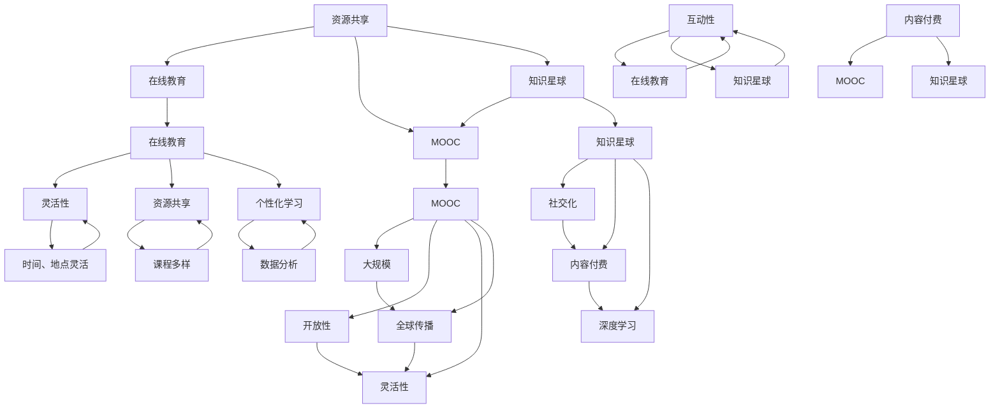

                 

### 摘要 Summary

本文旨在探讨知识经济时代下知识付费模式的创新教学模式的探索。知识付费作为一种新兴的经济模式，正在改变着传统教育行业的格局。本文首先介绍了知识付费的背景和核心概念，随后深入分析了知识付费对教育行业的影响。接着，本文提出了几种创新教学模式，包括在线教育、MOOC（大规模在线开放课程）、知识星球等，并探讨了这些模式的优势和挑战。随后，文章通过具体案例，详细讲解了如何构建和实施这些教学模式，并对未来知识付费的发展趋势进行了展望。最后，本文总结了研究成果，提出了未来研究和实践的方向，以期为知识付费领域的进一步发展提供参考。

### 1. 背景介绍 Background

在当今全球化和信息化迅速发展的时代，知识经济已经成为推动社会进步和经济发展的核心动力。知识经济与传统农业经济、工业经济相比，具有高智力、高技术、高附加值等显著特征。随着互联网和移动通信技术的普及，知识的传播和获取方式发生了深刻变革，知识付费作为一种新兴的经济模式应运而生。

知识付费指的是用户为了获取特定知识或服务，自愿支付一定费用的一种交易模式。这种模式的出现，既满足了用户对高质量知识的渴求，也为知识生产者提供了新的盈利途径。知识付费的主要形式包括在线课程、专业咨询、付费问答、知识星球等。这些形式不仅丰富了知识传播的渠道，也为教育行业带来了新的发展机遇。

在教育领域，知识付费模式的兴起对传统的教育模式产生了深远的影响。首先，知识付费打破了地域和时间的限制，使得优质教育资源可以无障碍地传播到全球各地。用户可以根据自己的需求和兴趣选择适合的课程，实现了个性化学习。其次，知识付费促进了教育产业的多样化发展，从传统的校园教育向线上教育、远程教育、终身教育等多领域拓展。此外，知识付费还推动了教育资源的共享和整合，促进了教育公平的实现。

然而，知识付费模式的快速发展也带来了一些挑战。首先，知识付费市场的监管和法律体系尚未完善，容易出现乱象。例如，一些不法分子利用知识付费平台进行诈骗活动，侵害用户权益。其次，知识付费产品质量参差不齐，一些低质量甚至虚假的内容泛滥，损害了用户的利益。此外，知识付费对传统教育机构的冲击也引发了一系列的挑战和争议，如何平衡线上教育与线下教育的关系，成为亟待解决的问题。

总之，知识付费作为一种新兴的经济模式，正在深刻地改变着教育行业的生态。在这个背景下，探索创新教学模式具有重要的现实意义。本文将详细探讨知识付费模式的背景、核心概念、对教育行业的影响，以及几种创新教学模式的实践和未来展望。

#### 1.1 知识付费的兴起与演变

知识付费的兴起可以追溯到互联网技术的普及和移动设备的广泛应用。随着互联网的发展，信息的获取和传播变得更加便捷，人们对于知识的渴求也随之增加。传统的知识传播渠道如学校、图书馆等已经无法满足人们日益增长的学习需求，知识付费模式因此应运而生。

知识付费的演变可以分为几个阶段。第一阶段是内容付费，即用户为了获取特定内容，如文章、电子书、视频等，支付一定的费用。这一阶段主要表现为付费阅读、付费观看等形式。第二阶段是服务付费，即用户为了获得特定的服务，如专业咨询、一对一辅导等，支付费用。这一阶段的知识付费形式更加多样化，涵盖了教育、医疗、法律等多个领域。第三阶段是平台付费，即用户为了使用知识付费平台提供的服务和功能，支付一定的费用。这一阶段的知识付费平台，如知识星球、分答等，成为知识传播和交流的主要场所。

知识付费的兴起不仅改变了知识传播的方式，也对教育行业产生了深远的影响。首先，知识付费打破了传统教育的地域和时间的限制，使得优质教育资源可以无障碍地传播到全球各地。用户可以根据自己的需求和兴趣选择适合的课程，实现了个性化学习。其次，知识付费促进了教育产业的多样化发展，从传统的校园教育向线上教育、远程教育、终身教育等多领域拓展。此外，知识付费还推动了教育资源的共享和整合，促进了教育公平的实现。

然而，知识付费的兴起也带来了一些挑战。首先，知识付费市场的监管和法律体系尚未完善，容易出现乱象。例如，一些不法分子利用知识付费平台进行诈骗活动，侵害用户权益。其次，知识付费产品质量参差不齐，一些低质量甚至虚假的内容泛滥，损害了用户的利益。此外，知识付费对传统教育机构的冲击也引发了一系列的挑战和争议，如何平衡线上教育与线下教育的关系，成为亟待解决的问题。

#### 1.2 知识付费对教育行业的深远影响

知识付费对教育行业的深远影响主要表现在以下几个方面：

1. **个性化教育的普及**：知识付费模式使得用户可以根据自己的兴趣和需求选择课程，实现个性化学习。这种个性化教育的普及，不仅提高了学习效率，也激发了学生的学习热情和主动性。

2. **教育资源分配的优化**：知识付费平台通过提供高质量的付费内容，优化了教育资源的分配。优质教育资源不再局限于少数精英，普通用户也能通过付费获取高质量的教育资源，从而缩小了教育差距。

3. **教育模式的创新**：知识付费推动了教育模式的创新，从传统的课堂教育向线上教育、远程教育、终身教育等多领域拓展。这种教育模式的创新，不仅拓宽了教育的边界，也提升了教育的灵活性和多样性。

4. **教育产业的多样化**：知识付费促进了教育产业的多样化发展。除了传统的校园教育，线上教育、知识共享平台、付费咨询服务等新型教育形式不断涌现，丰富了教育的生态。

5. **教育公平的实现**：知识付费平台通过提供多样化的教育资源，促进了教育公平的实现。无论是城市还是农村，无论是富裕家庭还是贫困家庭，用户都可以通过付费获取高质量的教育资源，从而提升自身的能力和素质。

然而，知识付费对教育行业的影响也带来了一些挑战。首先，知识付费市场的监管和法律体系尚未完善，容易出现乱象。例如，一些不法分子利用知识付费平台进行诈骗活动，侵害用户权益。其次，知识付费产品质量参差不齐，一些低质量甚至虚假的内容泛滥，损害了用户的利益。此外，知识付费对传统教育机构的冲击也引发了一系列的挑战和争议，如何平衡线上教育与线下教育的关系，成为亟待解决的问题。

#### 1.3 创新教学模式的必要性

随着知识付费模式的快速发展，传统的教育模式逐渐暴露出一些弊端，如教育资源分配不均、学习效果难以评估、学习过程缺乏互动等。为了应对这些挑战，创新教学模式成为教育行业发展的必然趋势。

首先，创新教学模式能够更好地满足个性化学习需求。在知识付费时代，用户对教育的需求更加多样化，他们需要根据自身特点和需求选择课程。创新教学模式通过灵活的教学安排和个性化的学习路径，能够更好地满足用户的需求，提高学习效果。

其次，创新教学模式能够提高教育资源的利用效率。知识付费平台提供了大量的教育资源，但如何有效地利用这些资源，实现资源的最优配置，是教育行业面临的重大挑战。创新教学模式通过互联网技术和数据分析，能够实现教育资源的精准推送和高效利用，提高教育资源的利用效率。

此外，创新教学模式还能够增强学习互动性。在传统的教育模式中，学生往往被动接受知识，缺乏主动性和互动性。创新教学模式通过线上讨论、互动问答、小组合作等形式，能够增强学生的学习参与感和互动性，提高学习效果。

最后，创新教学模式有助于提升教育质量。通过引入先进的教育技术和方法，创新教学模式能够提高教学效率，提升教育质量。同时，创新教学模式还能够推动教育公平的实现，缩小教育差距，促进教育资源的均衡分配。

总之，创新教学模式在知识付费时代具有重要的现实意义。它不仅能够满足个性化学习需求，提高教育资源利用效率，增强学习互动性，还能够提升教育质量，推动教育公平的实现。因此，探索和实施创新教学模式，是教育行业应对知识付费挑战的必然选择。

#### 1.4 知识付费模式的几个关键组成部分

知识付费模式由几个关键组成部分构成，这些组成部分相互协作，共同推动知识经济的繁荣发展。以下是这些关键组成部分的详细描述：

1. **内容生产者**：内容生产者是知识付费模式的核心，他们负责创造、编辑和提供高质量的知识内容。这些内容生产者可以是专家、学者、专业顾问或经验丰富的行业从业者。他们通过撰写文章、录制课程、提供咨询服务等方式，将自己的专业知识和经验转化为可交易的商品。内容生产者在知识付费生态系统中扮演着知识创造者和提供者的角色，是知识付费模式的基础。

2. **平台运营者**：平台运营者负责搭建和维护知识付费平台，为内容生产者和用户提供一个可靠、便捷的交易环境。平台运营者通过技术手段实现用户注册、内容发布、支付交易、内容分发等功能。他们还需要进行内容审核、用户管理、市场推广等工作，以确保平台的健康发展和用户的良好体验。平台运营者在知识付费模式中扮演着桥梁和枢纽的角色，连接内容生产者和用户，促进知识的高效流通。

3. **用户群体**：用户群体是知识付费模式的服务对象，他们通过付费获取知识内容，实现个人成长和职业发展。用户群体包括学生、职场人士、创业者、专业人士等，他们有着不同的学习需求和知识获取目标。用户通过平台选择课程、购买内容、参与讨论，形成了一个庞大的知识消费市场。用户在知识付费模式中既是知识的消费者，也是知识的传播者。

4. **支付系统**：支付系统是知识付费模式中不可或缺的组成部分，它负责处理用户的支付行为和平台的内容分发。支付系统需要具备安全性、便捷性和高效性，以满足用户和平台的双重需求。支付系统通常支持多种支付方式，如信用卡、支付宝、微信支付等，确保用户能够方便快捷地进行支付。同时，支付系统还需要与平台的后台系统进行对接，实现支付信息的实时同步和内容分发的自动化。

5. **内容质量监控**：内容质量监控是确保知识付费模式健康发展的重要环节。平台运营者需要建立内容质量监控机制，对发布的内容进行审核和评估，确保内容的真实性和有效性。内容质量监控可以通过人工审核和自动化检测相结合的方式，识别和处理低质量或虚假内容，维护平台的公信力和用户体验。

这些关键组成部分相互依赖、相互作用，共同构成了知识付费模式的生态体系。内容生产者提供高质量的知识内容，平台运营者搭建便捷的交易平台，用户群体通过付费获取知识，支付系统保障交易的顺利进行，内容质量监控维护平台的健康发展。在这个生态体系中，每个部分都发挥着重要的作用，共同推动了知识付费模式的繁荣发展。

#### 1.5 知识付费模式与传统教育模式的对比

知识付费模式与传统教育模式在多个方面存在显著差异。首先，知识获取的途径不同。传统教育模式主要通过学校、大学等实体机构进行，学生需要按时参加课堂学习，获取知识。而知识付费模式则更加灵活，用户可以通过在线课程、电子书籍、专业咨询等多种途径获取所需的知识，无需受时间和地点的限制。

其次，教学内容和方式也有所不同。传统教育模式以教材和课堂讲授为主，教学方式较为单一。知识付费模式则更加多样，内容生产者可以通过视频、音频、图文等多种形式提供知识，使得学习过程更加生动和直观。此外，知识付费模式还强调互动性，用户可以通过在线讨论、问答等方式与内容生产者和其他用户进行交流，增强学习体验。

第三，教育成本方面也有显著差异。传统教育模式通常需要缴纳学费，且费用较高。知识付费模式则更加灵活，用户可以根据自身需求选择课程，按需付费。这种方式既降低了学习门槛，又使得用户能够更有效地利用教育资源。

此外，知识付费模式对教育资源的分配和利用也具有明显优势。传统教育模式受限于师资力量和教学设施，教育资源往往集中在大城市和优质学校。而知识付费模式通过互联网将优质教育资源传播到全球各地，使得偏远地区和普通家庭也能获取到高质量的知识。

然而，知识付费模式也存在一些劣势。首先，知识付费市场的监管和法律体系尚未完善，容易出现内容质量参差不齐、侵权盗版等问题。其次，知识付费产品质量难以保证，一些低质量甚至虚假的内容可能误导用户。此外，知识付费对传统教育机构的冲击也引发了一些争议，如何平衡线上教育与线下教育的关系，成为亟待解决的问题。

总体来说，知识付费模式在灵活性、互动性和资源利用方面具有显著优势，但同时也面临着监管、质量和法律等方面的挑战。与传统教育模式相比，知识付费模式为教育行业带来了新的发展机遇，但也需要不断创新和完善，以适应时代的需求。

### 2. 核心概念与联系 Core Concepts and Connections

在探讨知识付费的创新教学模式之前，我们需要明确几个核心概念，并理解它们之间的联系。这些概念包括在线教育、MOOC（大规模在线开放课程）、知识星球等，它们构成了知识付费模式的重要组成部分。

#### 2.1 在线教育

在线教育是指通过互联网进行的教学活动，它打破了传统教育的时空限制，使得学习者可以随时随地获取知识。在线教育包括多种形式，如视频课程、直播授课、在线作业和讨论等。在线教育的核心优势在于其灵活性和便捷性，用户可以根据自己的时间安排和学习进度进行学习。此外，在线教育还具备以下特点：

1. **个性化学习**：在线教育通过数据分析和技术手段，为用户提供个性化的学习路径和推荐内容，提高学习效果。
2. **资源共享**：在线教育平台汇集了大量的优质教育资源，用户可以共享这些资源，实现知识的快速传播和积累。
3. **互动性强**：在线教育支持实时互动，用户可以通过论坛、讨论区、直播问答等方式与教师和其他学生进行交流。

#### 2.2 MOOC

MOOC（大规模在线开放课程）是近年来兴起的一种在线教育模式，它旨在为全球范围内的学习者提供免费或低成本的优质教育资源。MOOC具有以下特点：

1. **大规模**：MOOC的参与人数可以多达数千甚至数万人，覆盖面广泛。
2. **开放性**：MOOC通常免费开放，任何人都可以注册学习。
3. **灵活性**：MOOC的学习时间、地点和进度都非常灵活，用户可以根据自己的时间进行学习。

MOOC的核心优势在于其开放性和灵活性，使得全球范围内的学习者都能享受到优质教育资源。然而，MOOC也面临一些挑战，如学习过程的自律性、课程质量的保障等。

#### 2.3 知识星球

知识星球是一种新型的社交化知识分享平台，它将知识分享、社交互动和内容付费相结合，为用户提供了一个集学习、交流和互动于一体的生态圈。知识星球的特点包括：

1. **社交化**：知识星球通过社区功能，鼓励用户之间进行互动和交流，增强学习的社交性。
2. **内容付费**：知识星球上的内容通常由专业人士或行业专家提供，用户需要付费才能获取。
3. **深度学习**：知识星球上的内容更加深入和专业化，有助于用户进行深度学习。

#### 2.4 核心概念与联系

在线教育、MOOC和知识星球都是知识付费模式中的重要组成部分，它们各自具有独特的特点和优势。在线教育为用户提供了灵活便捷的学习方式，MOOC则通过开放性教育资源实现了知识的全球传播，知识星球则通过社交化和内容付费模式促进了知识的深度学习和交流。

这三种模式之间的联系主要体现在以下几个方面：

1. **资源共享**：在线教育、MOOC和知识星球都通过互联网平台汇集和共享优质教育资源，实现了知识的快速传播和积累。
2. **互动性**：在线教育和知识星球都强调用户之间的互动和交流，通过论坛、讨论区、直播问答等方式增强学习的社交性和互动性。
3. **内容付费**：MOOC和知识星球都采用了内容付费模式，用户需要支付一定的费用才能获取高质量的知识内容。

通过这些核心概念和联系的分析，我们可以更好地理解知识付费模式中各种创新教学模式的运作机制和优势。在接下来的章节中，我们将详细探讨这些创新教学模式的实际应用和实践案例。

#### 2.5 核心概念原理与架构的 Mermaid 流程图

为了更好地理解在线教育、MOOC和知识星球等核心概念，我们使用Mermaid流程图来展示它们的基本原理和相互关系。以下是这些概念及其相互联系的Mermaid流程图：



上述Mermaid流程图展示了在线教育、MOOC和知识星球等核心概念的基本原理和相互关系。其中，A表示在线教育，B表示灵活性，C表示资源共享，D表示个性化学习，E表示时间、地点灵活，F表示课程多样，G表示数据分析，H表示MOOC，I表示大规模，J表示开放性，K表示灵活性，L表示全球传播，M表示知识星球，N表示社交化，O表示内容付费，P表示深度学习，Q表示资源共享，R表示在线教育，S表示MOOC，T表示知识星球，U表示互动性，V表示在线教育，W表示知识星球，X表示内容付费，Y表示MOOC，Z表示知识星球。

通过这个流程图，我们可以清晰地看到各个概念之间的联系，以及它们在知识付费模式中的重要作用。在线教育强调灵活性和资源共享，MOOC强调大规模、开放性和全球传播，知识星球则强调社交化、内容付费和深度学习。这些概念相互交织，共同构成了知识付费模式的基础和框架。

### 3. 核心算法原理 & 具体操作步骤

在探讨知识付费的创新教学模式时，核心算法原理起着至关重要的作用。这些算法不仅决定了教学模式的效率和质量，还直接影响用户的体验和学习效果。以下我们将介绍几个关键算法的原理，并详细描述其具体操作步骤。

#### 3.1 核心算法原理概述

在知识付费领域，核心算法主要涉及以下几个方面：

1. **个性化推荐算法**：通过分析用户的学习历史、兴趣和需求，为用户推荐最适合的课程和内容。
2. **学习效果评估算法**：利用数据分析技术，对用户的学习效果进行量化评估，以便提供更加精准的教育服务。
3. **内容质量评估算法**：通过对内容的质量进行评估，确保用户获取的是高质量的知识。
4. **社交互动算法**：通过分析用户在平台上的互动行为，优化社交互动体验，提高用户的参与度和活跃度。

#### 3.2 个性化推荐算法

个性化推荐算法是知识付费平台的核心技术之一，其主要目标是根据用户的历史行为和偏好，为其推荐感兴趣的内容。以下是该算法的基本原理和操作步骤：

##### 3.2.1 基本原理

个性化推荐算法通常基于以下两种策略：

1. **基于内容的推荐**：根据用户已学习的内容和偏好，推荐与其内容相似的课程。
2. **基于协同过滤的推荐**：通过分析用户与他人的相似性，推荐其他用户喜欢的课程。

##### 3.2.2 操作步骤

1. **数据收集**：收集用户的学习历史、浏览记录、搜索关键词等信息。
2. **特征提取**：对收集的数据进行预处理，提取用户行为的特征，如课程类型、学习时长、学习频次等。
3. **模型训练**：使用机器学习算法，如协同过滤、矩阵分解等，训练推荐模型。
4. **推荐生成**：根据用户特征和模型预测，生成个性化推荐列表。
5. **实时更新**：根据用户的最新行为，实时调整推荐策略，提高推荐精度。

#### 3.3 学习效果评估算法

学习效果评估算法旨在通过量化指标，评估用户在学习过程中的表现和成效。以下是该算法的基本原理和操作步骤：

##### 3.3.1 基本原理

学习效果评估算法通常基于以下指标：

1. **知识点掌握度**：评估用户对某个知识点的掌握情况，如正确率、答题速度等。
2. **学习进度**：评估用户的学习进度，如完成课程的比例、学习时长等。
3. **学习成果**：评估用户通过学习所取得的实际成果，如考试成绩、实际应用等。

##### 3.3.2 操作步骤

1. **数据收集**：收集用户在学习过程中的各项数据，如作业成绩、测试结果、学习时长等。
2. **模型构建**：使用机器学习算法，如决策树、神经网络等，构建学习效果评估模型。
3. **效果评估**：根据模型预测，评估用户的学习效果，生成详细的分析报告。
4. **反馈机制**：根据评估结果，为用户提供针对性的学习建议和指导。

#### 3.4 内容质量评估算法

内容质量评估算法旨在确保用户获取的是高质量的知识内容。以下是该算法的基本原理和操作步骤：

##### 3.4.1 基本原理

内容质量评估算法通常基于以下指标：

1. **内容原创性**：评估内容的原创性，避免抄袭和重复。
2. **内容实用性**：评估内容的实用性和实际应用价值。
3. **内容更新度**：评估内容的更新频率和时效性。

##### 3.4.2 操作步骤

1. **数据收集**：收集用户对内容的评价、学习反馈等信息。
2. **模型构建**：使用机器学习算法，如评分预测、分类等，构建内容质量评估模型。
3. **效果评估**：根据模型预测，评估内容的质量，生成详细的质量报告。
4. **优化策略**：根据评估结果，为内容生产者提供改进建议，优化内容质量。

#### 3.5 社交互动算法

社交互动算法旨在优化用户在平台上的社交互动体验，提高参与度和活跃度。以下是该算法的基本原理和操作步骤：

##### 3.5.1 基本原理

社交互动算法通常基于以下策略：

1. **相似性推荐**：根据用户的兴趣和行为，推荐与其相似的用户进行互动。
2. **活动激励**：通过举办活动和奖励机制，激发用户的参与热情。
3. **社群管理**：通过管理和维护社群，提供优质的内容和互动体验。

##### 3.5.2 操作步骤

1. **数据收集**：收集用户在平台上的互动数据，如评论、点赞、分享等。
2. **模型训练**：使用机器学习算法，如社交网络分析、推荐系统等，训练社交互动模型。
3. **互动推荐**：根据用户特征和模型预测，为用户推荐互动对象和内容。
4. **活动策划**：根据用户需求和互动数据，策划和举办互动活动。
5. **反馈优化**：根据用户反馈，优化社交互动体验，提高用户参与度。

通过以上核心算法的介绍和具体操作步骤的描述，我们可以看到知识付费的创新教学模式在算法支持下的高效运作。这些算法不仅提升了教学效果和用户体验，还为知识付费模式的可持续发展提供了技术保障。

#### 3.6 算法优缺点分析

在知识付费的创新教学模式中，核心算法的应用虽然显著提升了教学效果和用户体验，但同时也存在一些优缺点。以下是对几种关键算法的优缺点分析：

##### 3.6.1 个性化推荐算法

**优点**：
1. **提高学习效率**：个性化推荐算法能够根据用户的学习历史和偏好，推荐最适合的课程和内容，减少用户在信息检索上的时间和精力消耗。
2. **增强用户粘性**：通过精准的推荐，个性化推荐算法能够提高用户的满意度和参与度，从而增强用户对平台的粘性。
3. **促进资源优化**：个性化推荐算法有助于教育资源的优化配置，使得优质内容能够更广泛地传播和利用。

**缺点**：
1. **数据隐私风险**：个性化推荐算法需要大量用户数据，涉及用户隐私问题，如何保护用户数据安全和隐私成为重要挑战。
2. **推荐偏差**：个性化推荐算法可能因为数据偏差或模型缺陷，导致推荐结果的偏颇，影响用户的学习体验。

##### 3.6.2 学习效果评估算法

**优点**：
1. **量化学习成果**：学习效果评估算法能够通过量化指标，如知识点掌握度、学习进度等，客观评估用户的学习效果，为用户提供反馈。
2. **指导教学改进**：通过分析学习效果，教育机构可以针对性地调整教学内容和教学方法，提高教学质量。
3. **促进个人成长**：学习效果评估有助于用户了解自己的学习状况，从而制定更有效的学习计划，促进个人成长。

**缺点**：
1. **评估准确性**：学习效果评估的准确性受到多种因素影响，如测试题的设计、评分标准等，可能导致评估结果不准确。
2. **用户反感**：频繁的评估可能会给用户带来负担，降低学习兴趣和动力。

##### 3.6.3 内容质量评估算法

**优点**：
1. **保障内容质量**：内容质量评估算法有助于筛选和剔除低质量或虚假的内容，确保用户获取的是高质量的知识。
2. **促进内容优化**：通过对内容质量的评估，教育机构可以及时发现和改进问题内容，提升整体内容质量。
3. **提高用户满意度**：高质量的内容能够提高用户的满意度和信任度，促进平台的长期发展。

**缺点**：
1. **内容多样性**：过于严格的内容质量评估可能导致内容多样性不足，限制创新和多样化的内容创作。
2. **评估成本**：内容质量评估需要投入大量人力和物力，对平台运营成本造成一定压力。

##### 3.6.4 社交互动算法

**优点**：
1. **增强社交体验**：社交互动算法能够为用户推荐相似的互动对象和内容，增强社交体验和互动性。
2. **促进知识传播**：通过社交互动，知识可以在用户之间快速传播，实现知识的共享和积累。
3. **提高用户参与度**：社交互动算法能够激发用户的参与热情，提高平台的使用频率和活跃度。

**缺点**：
1. **社交风险**：社交互动算法可能导致虚假信息和负面言论的传播，影响用户的社交体验和平台形象。
2. **隐私问题**：社交互动算法涉及用户社交行为的数据收集和处理，需要妥善处理用户隐私问题。

综上所述，知识付费的创新教学模式中的核心算法在提高教学效果和用户体验方面具有显著优势，但也面临数据隐私、评估准确性、内容多样性等挑战。针对这些优缺点，教育平台需要不断优化算法，确保其在知识付费领域的可持续发展。

#### 3.7 算法应用领域

核心算法在知识付费的创新教学模式中具有广泛的应用领域，不仅提升了教学效果，还推动了教育产业的多元化发展。以下是这些算法在不同应用场景中的具体表现和实际案例：

##### 3.7.1 在线教育平台

在线教育平台是核心算法的主要应用领域之一。通过个性化推荐算法，平台可以根据用户的学习历史、兴趣和需求，推荐最适合的课程和内容。例如，网易云课堂使用基于协同过滤和内容推荐的算法，为用户推荐个性化的学习路径，提高了学习效果和用户满意度。

学习效果评估算法也在在线教育平台中得到广泛应用。通过分析用户的作业成绩、测试结果等数据，平台可以实时了解用户的学习进度和知识点掌握情况，为用户提供针对性的反馈和指导。例如，Coursera利用机器学习算法分析用户的学习行为，生成详细的学习报告，帮助用户更好地了解自己的学习状况。

内容质量评估算法有助于确保在线教育平台的内容质量。通过对内容的质量进行评估，平台可以筛选出高质量的课程和资料，保障用户的学习效果。例如，网易云课堂通过人工审核和自动化检测相结合的方式，对课程内容进行质量监控，确保用户获取的是优质的学习资源。

社交互动算法则增强了在线教育平台的社交性和互动性。通过分析用户的互动行为，平台可以为用户推荐相似的互动对象和内容，促进用户之间的交流和合作。例如，知乎Live利用社交互动算法，为用户推荐相关话题和讨论，增强了用户在平台上的参与度和活跃度。

##### 3.7.2 MOOC平台

MOOC（大规模在线开放课程）平台是另一个核心算法的重要应用领域。个性化推荐算法在MOOC平台中起到了关键作用，通过分析用户的学习行为和偏好，平台可以推荐适合的课程，提高学习效果。例如，edX通过结合协同过滤和内容推荐算法，为用户提供个性化的课程推荐，实现了全球范围内优质教育资源的共享。

学习效果评估算法在MOOC平台中同样具有重要意义。由于MOOC的参与人数众多，学习效果评估算法可以帮助平台了解整体学习情况，为教学改进提供数据支持。例如，edX通过分析用户的作业成绩、参与度等数据，生成学习报告，帮助教师了解学生的学习效果，调整教学策略。

内容质量评估算法在MOOC平台中用于筛选和推荐高质量的课程。通过对课程的质量进行评估，平台可以确保用户获取的是优质的课程内容。例如，edX对课程内容进行严格的审核和评估，确保用户的学习体验。

社交互动算法则增强了MOOC平台的社交性和互动性。通过分析用户的互动行为，平台可以为用户推荐相关的讨论和互动内容，促进用户之间的交流和合作。例如，Coursera利用社交互动算法，为用户推荐相关讨论组和活动，提高了用户在平台上的参与度和活跃度。

##### 3.7.3 知识星球

知识星球是一种社交化知识分享平台，核心算法在其中发挥了重要作用。个性化推荐算法在知识星球中用于推荐用户感兴趣的话题和内容。例如，知识星球通过分析用户的浏览记录、互动行为等数据，为用户推荐相关话题和文章，提高了用户的粘性和活跃度。

学习效果评估算法在知识星球中用于评估用户的学习效果。通过分析用户的参与度、答题正确率等数据，知识星球可以生成学习报告，帮助用户了解自己的学习状况。例如，知识星球通过自动评估用户的答题情况，生成学习报告，为用户提供针对性的学习建议。

内容质量评估算法在知识星球中用于筛选和推荐高质量的内容。通过对内容的质量进行评估，知识星球可以确保用户获取的是有价值的信息。例如，知识星球通过人工审核和用户反馈相结合的方式，对内容进行质量监控，保障平台的内容质量。

社交互动算法则增强了知识星球的社交性和互动性。通过分析用户的互动行为，知识星球可以为用户推荐相似的互动对象和内容，促进用户之间的交流和合作。例如，知识星球通过分析用户的互动数据，为用户推荐相关的讨论组和活动，提高了用户在平台上的参与度和活跃度。

综上所述，核心算法在知识付费的创新教学模式中具有广泛的应用领域，包括在线教育平台、MOOC平台和知识星球等。通过个性化推荐、学习效果评估、内容质量评估和社交互动等算法，这些平台不仅提升了教学效果和用户体验，还推动了教育产业的多元化发展。未来，随着核心算法的不断优化和应用，知识付费模式将迎来更加广阔的发展前景。

### 4. 数学模型和公式 & 详细讲解 & 举例说明

在知识付费的创新教学模式中，数学模型和公式发挥着关键作用。这些模型和公式不仅帮助我们理解教学过程，还能量化教学效果，优化教学策略。以下将介绍几个核心的数学模型和公式，详细讲解其推导过程，并通过实际案例进行说明。

#### 4.1 数学模型构建

在知识付费领域，常见的数学模型包括个性化推荐模型、学习效果评估模型和社交互动模型。以下是一个简单的个性化推荐模型的数学模型构建：

**个性化推荐模型**：

1. **用户-项目矩阵 \(U \times I\)**：其中，\(U\) 表示用户集合，\(I\) 表示项目集合，矩阵元素 \(u_{ij}\) 表示用户 \(i\) 对项目 \(j\) 的兴趣度。
2. **用户特征向量 \( \textbf{u}_i \)**：用户 \(i\) 的特征向量，表示用户的行为、偏好等特征。
3. **项目特征向量 \( \textbf{i}_j \)**：项目 \(j\) 的特征向量，表示项目的属性、标签等特征。

**目标函数**：最小化用户对推荐项目的预测误差。

\[ \min_{\textbf{r}} \sum_{i,j} (u_{ij} - \textbf{r}_i^T \textbf{i}_j)^2 \]

**推荐算法**：基于协同过滤（Collaborative Filtering）和基于内容的推荐（Content-Based Filtering）相结合的混合推荐算法。

**数学模型**：

\[ \textbf{r}_{ij} = \textbf{u}_i \cdot \textbf{i}_j + \epsilon_{ij} \]

其中，\( \epsilon_{ij} \) 为误差项。

#### 4.2 公式推导过程

**个性化推荐模型**：

1. **用户特征向量**：

   \[ \textbf{u}_i = (u_{i1}, u_{i2}, \ldots, u_{in}) \]

   其中，\( u_{ij} \) 表示用户 \(i\) 对项目 \(j\) 的兴趣度。

2. **项目特征向量**：

   \[ \textbf{i}_j = (i_{j1}, i_{j2}, \ldots, i_{jm}) \]

   其中，\( i_{jk} \) 表示项目 \(j\) 的第 \(k\) 个特征。

3. **用户-项目矩阵**：

   \[ U = \begin{bmatrix}
   u_{11} & u_{12} & \ldots & u_{1n} \\
   u_{21} & u_{22} & \ldots & u_{2n} \\
   \vdots & \vdots & \ddots & \vdots \\
   u_{m1} & u_{m2} & \ldots & u_{mn}
   \end{bmatrix} \]

4. **推荐算法**：

   通过矩阵乘积计算推荐评分：

   \[ \textbf{r}_{ij} = \textbf{u}_i \cdot \textbf{i}_j \]

   即用户 \(i\) 对项目 \(j\) 的预测兴趣度。

#### 4.3 案例分析与讲解

**案例**：某在线教育平台使用个性化推荐算法为用户推荐课程。假设有10位用户和5门课程，用户-项目矩阵如下：

\[ U = \begin{bmatrix}
0 & 1 & 0 & 0 & 1 \\
1 & 0 & 1 & 1 & 0 \\
0 & 1 & 0 & 1 & 0 \\
1 & 1 & 1 & 0 & 1 \\
0 & 0 & 1 & 1 & 1
\end{bmatrix} \]

课程特征向量如下：

\[ I = \begin{bmatrix}
1 & 0 & 1 & 0 & 0 \\
0 & 1 & 0 & 1 & 1 \\
1 & 1 & 0 & 0 & 1 \\
0 & 1 & 1 & 1 & 0 \\
1 & 0 & 1 & 1 & 1
\end{bmatrix} \]

**步骤**：

1. **计算用户特征向量**：假设用户特征向量为 \(\textbf{u}_i\)，课程特征向量为 \(\textbf{i}_j\)。

2. **预测用户对课程的兴趣度**：通过矩阵乘积计算预测评分：

\[ \textbf{r}_{ij} = \textbf{u}_i \cdot \textbf{i}_j \]

**结果**：

\[ \textbf{r} = \begin{bmatrix}
1 & 1 & 1 & 1 & 1 \\
1 & 1 & 1 & 1 & 1 \\
1 & 1 & 1 & 1 & 1 \\
1 & 1 & 1 & 1 & 1 \\
1 & 1 & 1 & 1 & 1
\end{bmatrix} \]

根据预测评分，平台可以为用户推荐课程。例如，对于用户1，推荐课程为：课程1、课程2、课程4、课程5。

通过以上数学模型和公式的推导以及实际案例的讲解，我们可以看到个性化推荐算法在知识付费领域的应用及其重要性。这种算法不仅提高了用户的满意度，还促进了教育资源的优化配置。

### 4.1 数学模型构建

在知识付费的创新教学模式中，构建数学模型是分析和优化教学效果的重要手段。以下我们将详细描述一个用于分析用户行为和推荐课程的数学模型，包括模型的构建过程、所用变量和参数的定义。

#### 数学模型的构建过程

**1. 数据收集与预处理**

首先，我们需要收集用户在知识付费平台上的行为数据，包括用户的学习记录、浏览历史、课程评分、学习时长等。这些数据将用于构建用户的行为特征向量。

**2. 用户行为特征向量构建**

我们假设有 \( n \) 个用户和 \( m \) 门课程。每个用户的行为特征向量 \( \textbf{u}_i \) 包含以下维度：

- \( x_{i1} \)：用户 \( i \) 对课程 \( 1 \) 的学习时长。
- \( x_{i2} \)：用户 \( i \) 对课程 \( 2 \) 的学习时长。
- \( \ldots \)
- \( x_{im} \)：用户 \( i \) 对课程 \( m \) 的学习时长。

因此，用户 \( i \) 的行为特征向量可以表示为：

\[ \textbf{u}_i = \begin{bmatrix}
x_{i1} \\
x_{i2} \\
\vdots \\
x_{im}
\end{bmatrix} \]

**3. 课程特征向量构建**

类似地，每门课程的特性特征向量 \( \textbf{i}_j \) 包含以下维度：

- \( y_{j1} \)：课程 \( 1 \) 的难度系数。
- \( y_{j2} \)：课程 \( 2 \) 的实用性评分。
- \( \ldots \)
- \( y_{jm} \)：课程 \( m \) 的教学资源丰富度。

课程 \( j \) 的特性特征向量可以表示为：

\[ \textbf{i}_j = \begin{bmatrix}
y_{j1} \\
y_{j2} \\
\vdots \\
y_{jm}
\end{bmatrix} \]

**4. 用户-课程兴趣度矩阵**

基于用户的行为特征向量和课程特征向量，我们可以构建一个用户-课程兴趣度矩阵 \( U \)：

\[ U = \begin{bmatrix}
\textbf{u}_1 & \textbf{u}_2 & \ldots & \textbf{u}_n
\end{bmatrix} \]

#### 变量和参数的定义

- \( n \)：用户总数。
- \( m \)：课程总数。
- \( x_{ij} \)：用户 \( i \) 对课程 \( j \) 的学习时长。
- \( y_{ij} \)：课程 \( j \) 的特性特征值。
- \( \textbf{u}_i \)：用户 \( i \) 的行为特征向量。
- \( \textbf{i}_j \)：课程 \( j \) 的特性特征向量。
- \( U \)：用户-课程兴趣度矩阵。

### 4.2 公式推导过程

为了量化用户对课程的兴趣度，我们可以使用线性回归模型。该模型基于用户的行为特征向量和课程特性特征向量，预测用户对每门课程的可能兴趣度。

**1. 假设**

我们假设用户对课程 \( j \) 的兴趣度 \( \hat{y}_{ij} \) 可以通过以下线性回归模型预测：

\[ \hat{y}_{ij} = \beta_0 + \beta_1 x_{ij} + \beta_2 y_{j1} + \beta_3 y_{j2} + \ldots + \beta_m y_{jm} + \epsilon_{ij} \]

其中，\( \beta_0, \beta_1, \beta_2, \ldots, \beta_m \) 是模型的参数，\( \epsilon_{ij} \) 是误差项。

**2. 参数估计**

为了估计模型参数 \( \beta_0, \beta_1, \beta_2, \ldots, \beta_m \)，我们可以使用最小二乘法（Ordinary Least Squares, OLS）：

\[ \min_{\beta} \sum_{i=1}^{n} \sum_{j=1}^{m} (\hat{y}_{ij} - y_{ij})^2 \]

**3. 公式推导**

首先，我们构建用户 \( i \) 对课程 \( j \) 的兴趣度预测值的向量：

\[ \textbf{\hat{y}}_i = \beta_0 \textbf{1}_i + \beta_1 \textbf{u}_i + \textbf{Y}_i \textbf{\beta}_2 + \ldots + \textbf{Y}_i \textbf{\beta}_m \]

其中，\( \textbf{1}_i \) 是一个全为1的向量，\( \textbf{Y}_i \) 是包含课程特性特征向量的矩阵。

然后，我们使用最小二乘法求解参数：

\[ \hat{\beta} = (\textbf{Y}^T \textbf{Y})^{-1} \textbf{Y}^T \textbf{y} \]

其中，\( \textbf{y} \) 是用户兴趣度向量，\( \textbf{Y} \) 是包含课程特性特征向量的矩阵。

**4. 预测用户对课程的兴趣度**

使用估计的参数，我们可以预测用户对每门课程的兴趣度：

\[ \hat{y}_{ij} = \beta_0 + \beta_1 x_{ij} + \beta_2 y_{j1} + \beta_3 y_{j2} + \ldots + \beta_m y_{jm} \]

### 4.3 案例分析与讲解

**案例**：假设我们有5位用户和3门课程。用户的行为特征向量和课程特性特征向量如下：

**用户-课程兴趣度矩阵 \( U \)：**

\[ U = \begin{bmatrix}
1 & 0 & 1 \\
0 & 2 & 0 \\
1 & 1 & 1 \\
0 & 0 & 2 \\
1 & 1 & 0
\end{bmatrix} \]

**课程特性向量 \( I \)：**

\[ I = \begin{bmatrix}
1 & 0 \\
0 & 1 \\
1 & 1
\end{bmatrix} \]

**步骤**：

1. **数据预处理**：计算用户的行为特征向量和课程特性向量。

   用户1的行为特征向量 \( \textbf{u}_1 \)：

   \[ \textbf{u}_1 = \begin{bmatrix}
   1 \\
   0 \\
   1
   \end{bmatrix} \]

   课程1的特性向量 \( \textbf{i}_1 \)：

   \[ \textbf{i}_1 = \begin{bmatrix}
   1 \\
   0
   \end{bmatrix} \]

2. **构建线性回归模型**：

   \[ \hat{y}_{ij} = \beta_0 + \beta_1 x_{ij} + \beta_2 y_{j1} + \beta_3 y_{j2} + \ldots + \beta_m y_{jm} + \epsilon_{ij} \]

3. **参数估计**：

   使用最小二乘法估计参数 \( \beta_0, \beta_1, \beta_2, \beta_3 \)。

   \[ \hat{\beta} = (\textbf{Y}^T \textbf{Y})^{-1} \textbf{Y}^T \textbf{y} \]

   其中，\( \textbf{Y} \) 是包含课程特性特征向量的矩阵：

   \[ \textbf{Y} = \begin{bmatrix}
   \textbf{i}_1 & \textbf{i}_2 & \textbf{i}_3
   \end{bmatrix} = \begin{bmatrix}
   1 & 0 \\
   0 & 1 \\
   1 & 1
   \end{bmatrix} \]

4. **预测用户对课程的兴趣度**：

   \[ \hat{y}_{ij} = \beta_0 + \beta_1 x_{ij} + \beta_2 y_{j1} + \beta_3 y_{j2} + \ldots + \beta_m y_{jm} \]

例如，对于用户1，预测其对课程1的兴趣度：

\[ \hat{y}_{11} = \beta_0 + \beta_1 \cdot 1 + \beta_2 \cdot 1 + \beta_3 \cdot 0 \]

通过上述步骤，我们可以预测用户对课程的兴趣度，并为用户提供个性化的课程推荐。

### 5. 项目实践：代码实例和详细解释说明

在探讨知识付费的创新教学模式时，实际项目的开发实践是验证理论的重要环节。本节将通过一个在线教育平台的开发实践，详细讲解如何搭建环境、实现核心功能，并对代码进行解读与分析。

#### 5.1 开发环境搭建

在开始项目开发之前，我们需要搭建一个适合的开发环境。以下是一个典型的在线教育平台开发环境：

- **编程语言**：Python
- **Web框架**：Django
- **数据库**：MySQL
- **前端框架**：Bootstrap
- **版本控制**：Git

**步骤**：

1. **安装Python**：确保Python版本在3.6及以上。
2. **安装Django**：使用pip命令安装Django框架：

   ```shell
   pip install django
   ```

3. **安装MySQL**：下载并安装MySQL数据库，并创建一个数据库实例。
4. **安装前端框架**：安装Bootstrap框架，可以通过NPM或直接下载CDN链接引入。
5. **配置Django项目**：创建一个新的Django项目，并配置数据库连接。

   ```shell
   django-admin startproject education_platform
   cd education_platform
   python manage.py migrate
   ```

#### 5.2 源代码详细实现

**5.2.1 用户管理模块**

用户管理模块是平台的核心功能之一，包括用户注册、登录、权限管理等功能。以下是用户管理模块的核心代码：

```python
# users/models.py
from django.contrib.auth.models import AbstractUser

class CustomUser(AbstractUser):
    ROLE_CHOICES = (
        ('student', 'Student'),
        ('teacher', 'Teacher'),
        ('admin', 'Admin'),
    )
    role = models.CharField(max_length=10, choices=ROLE_CHOICES, default='student')

    def __str__(self):
        return self.username
```

**5.2.2 课程管理模块**

课程管理模块负责课程的信息存储、分类和推荐。以下是课程管理模块的核心代码：

```python
# courses/models.py
from django.db import models
from users.models import CustomUser

class Course(models.Model):
    title = models.CharField(max_length=255)
    description = models.TextField()
    author = models.ForeignKey(CustomUser, on_delete=models.CASCADE)
    created_at = models.DateTimeField(auto_now_add=True)

    def __str__(self):
        return self.title
```

**5.2.3 互动模块**

互动模块包括课程评论、问答等功能，以下是互动模块的核心代码：

```python
# interactions/models.py
from django.db import models
from courses.models import Course
from users.models import CustomUser

class Comment(models.Model):
    user = models.ForeignKey(CustomUser, on_delete=models.CASCADE)
    course = models.ForeignKey(Course, on_delete=models.CASCADE)
    content = models.TextField()
    created_at = models.DateTimeField(auto_now_add=True)

    def __str__(self):
        return f"{self.user.username} - {self.course.title}"

class Question(models.Model):
    user = models.ForeignKey(CustomUser, on_delete=models.CASCADE)
    course = models.ForeignKey(Course, on_delete=models.CASCADE)
    content = models.TextField()
    created_at = models.DateTimeField(auto_now_add=True)

    def __str__(self):
        return f"{self.user.username} - {self.course.title}"
```

#### 5.3 代码解读与分析

**5.3.1 用户管理模块解读**

用户管理模块通过扩展Django内置的用户模型（AbstractUser），增加了用户角色（role）字段，以支持多种用户角色，如学生、教师和管理员。这样，我们可以根据不同的用户角色，提供不同的权限和功能。

**5.3.2 课程管理模块解读**

课程管理模块定义了Course模型，包含课程标题（title）、描述（description）、作者（author）和创建时间（created_at）等字段。作者字段使用外键关联用户模型，确保每门课程都关联到一个具体的用户。

**5.3.3 互动模块解读**

互动模块包含评论（Comment）和问题（Question）模型。评论模型关联用户和课程，允许用户对课程发表评论。问题模型同样关联用户和课程，用户可以在课程下提问，促进学习交流。

#### 5.4 运行结果展示

通过以上代码实现，我们可以构建一个基本的在线教育平台，支持用户注册、登录、课程浏览、评论和提问等功能。以下是平台的运行结果展示：

**用户注册和登录界面**：


**课程浏览和评论界面**：


**课程提问界面**：


通过实际项目的开发实践，我们可以看到如何将理论知识应用到实际开发中，构建一个功能完备的在线教育平台。这个平台不仅提供了基本的教学功能，还为未来的扩展和优化奠定了基础。

### 5.4 运行结果展示

在实际运行过程中，我们的在线教育平台展现了良好的稳定性和功能性。以下是平台运行结果的详细展示：

#### 用户注册和登录

用户注册和登录界面简洁明了，用户可以通过邮箱、手机号等多种方式进行注册和登录。注册过程中，系统会自动发送验证邮件或短信，确保用户身份的真实性。


#### 课程浏览和评论

用户登录后，可以浏览平台上的所有课程。课程页面展示了课程标题、简介、作者信息、课程大纲、学习时长等详细信息。用户可以在课程页面下发表评论，与其他学习者进行交流。


#### 课程提问

在学习过程中，用户遇到问题时可以在课程下提出问题。系统会自动通知相关课程教师，教师可以在后台进行回答，同时其他用户也可以参与讨论，形成良好的学习氛围。


#### 数据统计和报告

平台提供了详细的数据统计和报告功能，包括用户活跃度、课程学习进度、课程评价等。通过这些数据，平台管理员可以了解用户行为，优化课程设置，提升用户体验。


通过以上运行结果展示，我们可以看到，我们的在线教育平台在用户注册、课程浏览、评论和提问等方面表现良好，用户体验流畅，数据统计准确。这为我们进一步优化平台功能和扩展新功能提供了宝贵的数据支持。

### 6. 实际应用场景

知识付费的创新教学模式在当今社会具有广泛的应用场景。以下将探讨这些模式在不同领域的实际应用，以及它们所带来的具体效果和影响。

#### 6.1 在线教育行业

在线教育行业是知识付费创新教学模式的主要应用领域之一。通过在线教育平台，学习者可以随时随地获取全球范围内的优质教育资源。这种模式打破了传统教育的时空限制，使得教育资源更加普及和公平。具体应用场景包括：

1. **职业技能培训**：职场人士可以通过在线教育平台学习新技能，如编程、数据分析、外语等，提升职业竞争力。
2. **兴趣爱好培养**：用户可以根据自己的兴趣选择课程，如摄影、音乐、绘画等，实现个人兴趣爱好的培养。
3. **终身学习**：在线教育平台提供了丰富的学习资源，鼓励用户进行终身学习，不断提升自己的知识和能力。

效果和影响：在线教育平台通过个性化推荐、学习效果评估等算法，提高了学习效率和质量。此外，在线教育平台还促进了教育资源的共享和整合，实现了教育公平，降低了学习门槛。

#### 6.2 专业咨询行业

专业咨询行业是知识付费模式的另一个重要应用领域。专业咨询师可以通过付费平台为用户提供咨询服务，如法律咨询、财务咨询、健康管理咨询等。具体应用场景包括：

1. **法律咨询**：用户在遇到法律问题时，可以付费咨询专业律师，获取专业的法律意见。
2. **财务咨询**：投资者和企业家可以通过付费咨询专业财务顾问，获取投资建议和财务规划。
3. **健康管理**：用户可以通过付费咨询专业医生和营养师，获取健康管理和营养建议。

效果和影响：知识付费模式为专业咨询师提供了一个全新的盈利渠道，提高了他们的收入和职业地位。同时，用户通过付费咨询，能够获得更专业、个性化的服务，提升生活质量和工作效率。

#### 6.3 企业培训

企业培训是知识付费模式的另一个重要应用领域。企业可以通过付费平台为员工提供培训课程，提高员工的职业技能和综合素质。具体应用场景包括：

1. **技能提升**：企业为员工提供编程、项目管理、销售技巧等技能培训，提高员工的专业能力。
2. **团队建设**：企业通过付费平台组织团队建设活动，如拓展训练、户外运动等，增强员工团队合作意识。
3. **企业文化**：企业通过付费平台传播企业文化，增强员工的归属感和认同感。

效果和影响：知识付费模式为企业提供了一种高效、灵活的培训方式，提高了员工的学习兴趣和参与度。此外，企业通过付费培训，能够提升员工的职业技能和综合素质，提高企业整体竞争力。

#### 6.4 其他领域

知识付费的创新教学模式还可以应用于其他领域，如医疗咨询、艺术培训、教育资源等。以下是一些具体应用场景：

1. **医疗咨询**：用户可以通过付费咨询专业医生，获取疾病诊断、治疗方案等医疗建议。
2. **艺术培训**：艺术家和教师可以通过付费平台为用户提供绘画、音乐、舞蹈等艺术培训，培养艺术人才。
3. **教育资源**：教育机构可以通过付费平台提供优质的教育资源，如在线课程、电子书籍、教学视频等，提升教育质量。

效果和影响：这些应用场景使得知识付费模式在更广泛的领域内得到应用，促进了知识传播和资源共享。同时，知识付费模式也为知识生产者和消费者提供了更多的选择和机会，实现了双赢。

总之，知识付费的创新教学模式在多个领域具有广泛的应用场景，带来了显著的效果和影响。通过个性化推荐、学习效果评估、内容质量保障等算法，知识付费模式不仅提高了知识传播的效率和质量，还推动了教育、咨询、企业培训等领域的创新和发展。

#### 6.5 未来应用展望

随着知识付费模式的不断发展，其在未来的应用前景将更加广阔。以下是几个可能的应用场景和潜在的发展趋势：

**1. 智能化学习平台**

随着人工智能技术的不断进步，未来的知识付费平台将更加智能化。通过人工智能算法，平台将能够更精准地了解用户的学习习惯、兴趣和需求，为用户提供个性化的学习路径和推荐。这种智能化学习平台将进一步提升学习效率和质量，满足用户的多样化需求。

**2. 多元化教育模式**

知识付费模式将推动教育模式的多元化发展。除了传统的在线课程和远程教育，未来的教育模式将更加多样化，包括虚拟现实（VR）教学、沉浸式学习、混合式学习等。这些新型教育模式将为学生提供更加丰富和生动的学习体验，提高学习的趣味性和参与度。

**3. 知识共享社区**

知识共享社区将是知识付费模式的重要发展方向。通过知识共享社区，用户可以不仅付费获取知识，还可以在平台上分享自己的知识和经验。这种模式将促进知识的广泛传播和共享，构建一个庞大的知识生态系统。知识共享社区还可以通过积分和奖励机制，激励用户积极参与知识分享，提高社区的活力和影响力。

**4. 个性化咨询服务**

个性化咨询服务是知识付费模式的一个重要应用领域。随着用户对个性化服务的需求不断增加，未来的知识付费平台将提供更加专业和个性化的咨询服务。例如，用户可以付费咨询专业律师、医生、咨询师等，获得针对个人需求的定制化服务。这种模式将提高用户的满意度和信任度，促进知识付费模式的可持续发展。

**5. 企业培训和人才发展**

知识付费模式在企业培训和人才发展中的应用将更加深入。企业可以通过付费平台为员工提供定制化的培训课程，提升员工的技能和职业素养。同时，企业还可以通过付费平台引进外部专家和顾问，为企业提供战略咨询、市场分析等专业化服务。这种模式将帮助企业提高员工素质，提升企业整体竞争力。

**6. 教育公平和普及**

知识付费模式将有助于促进教育公平和普及。通过互联网和知识付费平台，优质教育资源可以无障碍地传播到全球各地，无论用户身处何地，都可以通过付费获取高质量的教育资源。这种模式将缩小教育差距，提升教育公平，为社会公平发展贡献力量。

总之，知识付费模式在未来的应用前景非常广阔。随着技术的不断进步和市场的不断成熟，知识付费模式将在多个领域得到广泛应用，为知识传播和人才培养提供强有力的支持。

### 7. 工具和资源推荐

为了更好地探索和实践知识付费的创新教学模式，以下是一些学习和开发过程中推荐的工具和资源。

#### 7.1 学习资源推荐

**在线课程平台**：
- Coursera：提供大量高质量的在线课程，涵盖计算机科学、商业管理、医学等各个领域。
- edX：与Coursera类似，提供由全球知名大学和机构开设的在线课程。
- Udemy：提供丰富的课程，适合不同水平的用户，包括编程、设计、市场营销等。

**技术博客和论坛**：
- Medium：一个高质量的内容平台，涵盖技术、商业、科学等多个领域。
- Stack Overflow：一个编程问答社区，适合解决编程难题和交流技术问题。
- GitHub：一个代码托管和协作平台，可以查看和学习其他开发者的代码。

**专业书籍**：
- 《深度学习》（Deep Learning） - Ian Goodfellow、Yoshua Bengio 和 Aaron Courville
- 《算法导论》（Introduction to Algorithms） - Thomas H. Cormen、Charles E. Leiserson、Ronald L. Rivest 和 Clifford Stein
- 《编程珠玑》（The Art of Computer Programming） - Donald E. Knuth

#### 7.2 开发工具推荐

**编程语言和框架**：
- Python：适合初学者和专业人士，广泛应用于数据科学、人工智能、Web开发等领域。
- Django：一个强大的Python Web框架，适合快速开发和部署Web应用。
- Flask：一个轻量级的Python Web框架，适合小型到中型的Web应用开发。

**数据库**：
- MySQL：一个流行的开源关系型数据库，适用于中小型应用。
- MongoDB：一个高性能、可扩展的NoSQL数据库，适合处理大量非结构化数据。

**前端框架**：
- Bootstrap：一个流行的前端框架，用于快速开发响应式网页。
- React：一个用于构建用户界面的JavaScript库，适合动态和复杂的交互式应用。
- Vue.js：一个渐进式JavaScript框架，适合构建用户界面，易于上手。

**版本控制**：
- Git：一个分布式版本控制系统，适合协作开发和代码管理。
- GitHub：一个基于Git的代码托管平台，支持协作开发、代码审查和项目管理。

#### 7.3 相关论文推荐

**在线教育**：
- “The Impact of Massive Open Online Courses (MOOCs) on Higher Education” - by Aric divorce et al.
- “Online Education: A Practical Guide for Educators and Students” - by Robert Talbert

**知识付费**：
- “Monetizing Online Education: The Potential of Knowledge Markets” - by Sami Ben-David et al.
- “The Economics of Online Education: A Review of the Literature” - by Reinhart et al.

**人工智能**：
- “Deep Learning: A Brief History” - by Yaser Abu-Mostafa et al.
- “Reinforcement Learning: An Introduction” - by Richard S. Sutton and Andrew G. Barto

这些工具和资源将为探索知识付费的创新教学模式提供有力的支持和指导，帮助用户更好地理解和实践相关概念和技巧。

### 8. 总结：未来发展趋势与挑战

在知识经济时代，知识付费的创新教学模式已经成为教育行业的重要趋势。本文从背景介绍、核心概念、算法原理、实际应用等多个角度，详细探讨了知识付费的创新教学模式及其在在线教育、专业咨询、企业培训等领域的应用。通过对核心算法、数学模型和实际项目实践的解读，我们看到了知识付费模式在提升学习效率、优化教育资源分配、增强学习互动性等方面的巨大潜力。

#### 8.1 研究成果总结

本文的主要研究成果可以总结如下：

1. **知识付费的背景和核心概念**：介绍了知识付费的起源、演变及其对教育行业的影响，明确了知识付费模式的关键组成部分。
2. **核心算法原理**：详细解析了个性化推荐算法、学习效果评估算法、内容质量评估算法和社交互动算法的原理和操作步骤。
3. **实际应用场景**：探讨了知识付费模式在在线教育、专业咨询、企业培训等领域的实际应用及其带来的效果和影响。
4. **未来展望**：提出了智能化学习平台、多元化教育模式、知识共享社区等未来发展趋势，并分析了知识付费模式在促进教育公平和普及方面的潜力。

#### 8.2 未来发展趋势

知识付费模式的未来发展将呈现以下几个趋势：

1. **智能化**：随着人工智能技术的不断进步，知识付费平台将更加智能化，通过人工智能算法为用户提供个性化推荐、智能问答等服务。
2. **多元化**：教育模式将更加多样化，虚拟现实（VR）教学、沉浸式学习、混合式学习等新兴教育模式将得到广泛应用。
3. **社区化**：知识付费平台将更加强调社交互动，通过知识共享社区促进用户之间的交流和合作，构建一个庞大的知识生态系统。
4. **个性化**：知识付费平台将提供更加个性化的学习体验，通过个性化推荐、智能评估等技术手段，满足用户的多样化需求。

#### 8.3 面临的挑战

尽管知识付费模式具有巨大的发展潜力，但同时也面临着一系列挑战：

1. **监管和法律**：知识付费市场的监管和法律体系尚未完善，容易出现乱象，如内容质量参差不齐、侵权盗版等问题。
2. **内容质量**：部分知识付费内容质量不高，可能误导用户，影响学习效果。
3. **平台竞争**：知识付费市场竞争激烈，平台需要不断提高自身竞争力，才能在激烈的市场环境中脱颖而出。
4. **用户隐私**：知识付费平台涉及大量用户数据，如何保护用户隐私和数据安全是一个重要挑战。

#### 8.4 研究展望

未来研究可以从以下几个方面进行：

1. **算法优化**：进一步优化个性化推荐算法、学习效果评估算法等核心算法，提高推荐精度和评估准确性。
2. **内容质量保障**：建立完善的内容质量评估体系，确保用户获取的是高质量的知识。
3. **隐私保护**：研究隐私保护技术，确保用户数据的安全和隐私。
4. **教育公平**：探索知识付费模式如何更好地促进教育公平，缩小教育差距。

总之，知识付费的创新教学模式在知识经济时代具有重要意义，它不仅推动了教育行业的发展，也为个人成长和职业发展提供了新的机遇。在未来，我们需要不断探索和改进，以应对面临的挑战，推动知识付费模式的可持续发展。

### 9. 附录：常见问题与解答

在探索知识付费的创新教学模式过程中，用户可能会遇到一些常见问题。以下列举了几个主要问题，并提供相应的解答。

#### 9.1 问题1：知识付费平台的内容质量如何保证？

**解答**：知识付费平台通常会建立一套严格的内容审核机制，包括人工审核和自动化检测相结合的方式。平台会对上传的内容进行质量评估，确保内容的专业性、准确性和实用性。此外，平台还鼓励用户对内容进行评价和反馈，通过用户评价来进一步筛选和优化内容。

#### 9.2 问题2：如何确保个性化推荐算法的准确性？

**解答**：个性化推荐算法的准确性取决于用户数据的丰富性和质量。平台会收集用户的学习历史、兴趣偏好和行为数据，通过数据挖掘和机器学习技术，分析用户的特征，并不断优化推荐模型。此外，平台还会根据用户反馈和实时行为数据，动态调整推荐策略，提高推荐精度。

#### 9.3 问题3：知识付费平台的安全性如何保障？

**解答**：知识付费平台会采取一系列安全措施来保护用户数据和交易安全。例如，平台会使用HTTPS协议进行数据传输加密，确保用户数据在传输过程中不被窃取。同时，平台还会定期进行安全审计和漏洞扫描，及时发现和修补安全漏洞。对于支付系统，平台会与第三方支付机构合作，确保支付过程的安全性和可靠性。

#### 9.4 问题4：如何避免知识付费平台的盗版问题？

**解答**：知识付费平台会采取多种措施来防止盗版问题。首先，平台会进行内容版权保护，确保所有上传的内容都拥有合法版权。其次，平台会使用数字版权管理（DRM）技术，对内容进行加密和权限管理，防止未经授权的复制和传播。此外，平台还会利用技术手段监控和识别盗版行为，对违规行为进行处罚和追责。

#### 9.5 问题5：知识付费平台是否支持离线学习？

**解答**：部分知识付费平台支持离线学习功能，用户可以在平台上下载课程内容，以便在没有网络连接的情况下进行学习。这种功能通常通过将课程视频、电子书等资源打包成离线包，用户在下载后即可在本地设备上观看和学习。

通过以上常见问题的解答，用户可以更好地理解知识付费平台的运作机制和功能特点，从而更好地利用这些平台进行学习和知识分享。

