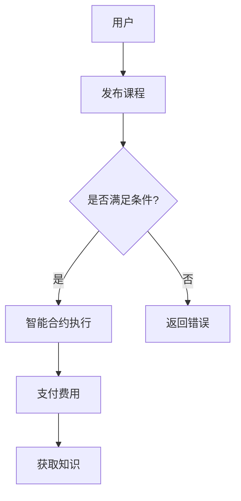

                 

关键词：知识经济、知识付费、区块链、智能合约、应用场景、发展趋势、研究挑战

> 摘要：本文深入探讨了知识经济背景下知识付费的发展现状，分析了区块链技术和智能合约在知识付费领域的应用潜力。通过构建一个基于区块链的智能合约模型，本文探讨了其在知识经济中的价值实现机制，并提出了未来发展趋势和面临的挑战。

## 1. 背景介绍

知识经济是当今社会发展的主流趋势，以知识和信息为核心资源，通过创新和知识的应用实现经济增长。知识付费作为知识经济的重要组成部分，近年来得到了快速发展。随着互联网技术的普及，知识付费的形式也日益多样化，包括在线课程、电子书籍、专业知识分享等。然而，现有的知识付费模式存在一些问题，如交易信任不足、交易流程繁琐等。

区块链技术以其去中心化、安全可靠的特点，为解决知识付费领域的问题提供了一种新的思路。智能合约作为区块链技术的重要组成部分，能够自动执行合同的条款，提高交易的效率和透明度。本文旨在探讨知识经济下知识付费的区块链智能合约应用，通过构建一个具体的智能合约模型，分析其在知识经济中的价值实现机制，并探讨未来的发展趋势和挑战。

## 2. 核心概念与联系

### 2.1 区块链技术

区块链技术是一种分布式数据库技术，通过去中心化的方式存储和管理数据。区块链上的数据以块为单位进行组织，每个块都包含一定数量的交易记录，并通过加密算法和密码学技术确保数据的安全性和不可篡改性。区块链技术的核心特点包括去中心化、透明性、不可篡改性和安全性。

### 2.2 智能合约

智能合约是一种自动执行合同条款的计算机程序，运行在区块链网络中。智能合约通过编程定义了合同中的条款，当满足特定条件时，自动执行相应的操作。智能合约具有自动执行、不可篡改和透明性等特点，能够提高交易的效率和安全性。

### 2.3 知识付费

知识付费是指通过付费的方式获取知识和信息。在知识经济背景下，知识付费已成为一种重要的经济形式，包括在线课程、电子书籍、专业知识分享等。知识付费模式要求提供方和需求方建立信任，确保知识资源的有效流通。

### 2.4 区块链智能合约在知识付费中的应用

区块链智能合约在知识付费中的应用，主要体现在以下几个方面：

1. **交易信任建立**：区块链技术通过去中心化的方式，降低了交易双方建立信任的成本，提高了交易的透明度和安全性。
2. **交易流程优化**：智能合约能够自动执行合同条款，简化了交易流程，提高了交易效率。
3. **知识资源保护**：区块链技术确保了知识资源的不可篡改性，保护了知识提供方的权益。

下面是一个简单的Mermaid流程图，展示了区块链智能合约在知识付费中的基本架构：



## 3. 核心算法原理 & 具体操作步骤

### 3.1 算法原理概述

区块链智能合约在知识付费中的应用，主要是通过智能合约的编程实现知识交易的自动化。智能合约的基本原理是：

1. **交易触发**：用户发起知识付费交易，智能合约被触发。
2. **条件判断**：智能合约根据设定的条件判断交易是否满足要求。
3. **执行操作**：如果条件满足，智能合约自动执行相应的操作，如支付费用、发送知识资源等。
4. **结果反馈**：智能合约执行结果返回给用户，完成交易。

### 3.2 算法步骤详解

1. **交易发起**：用户在知识平台上选择付费知识，发起交易请求。
2. **智能合约触发**：交易请求触发智能合约，智能合约开始执行。
3. **条件判断**：智能合约根据预设的条件判断交易是否满足要求，如支付金额、交易双方身份验证等。
4. **操作执行**：如果条件满足，智能合约自动执行以下操作：
   - 向知识提供方支付费用。
   - 发送知识资源给用户。
5. **结果反馈**：智能合约将执行结果返回给用户，完成交易。

### 3.3 算法优缺点

**优点**：

1. **提高交易效率**：智能合约自动执行交易，减少了人工干预，提高了交易效率。
2. **增强交易透明度**：所有交易记录都记录在区块链上，提高了交易的透明度。
3. **确保交易安全**：区块链技术确保了交易的安全性和不可篡改性。

**缺点**：

1. **编程难度大**：智能合约的编写和调试需要一定的编程技能，对非专业人士来说有一定难度。
2. **交易成本高**：区块链网络中的交易需要支付一定的费用，可能影响用户的支付意愿。

### 3.4 算法应用领域

区块链智能合约在知识付费领域有广泛的应用前景，可以应用于以下场景：

1. **在线教育**：通过智能合约实现在线课程的付费和发放，确保知识资源的有效流通。
2. **电子书销售**：智能合约可以自动执行电子书的购买和发送，提高交易效率。
3. **专业知识分享**：智能合约可以确保专业知识分享过程中的权益保护，降低纠纷风险。

## 4. 数学模型和公式 & 详细讲解 & 举例说明

### 4.1 数学模型构建

在区块链智能合约中，知识付费的交易流程可以抽象为一个数学模型。设 \( P \) 为知识提供方，\( U \) 为用户，\( C \) 为知识资源，\( M \) 为智能合约。交易过程可以表示为：

\[ P \rightarrow M \rightarrow U \]

其中，\( P \) 向智能合约 \( M \) 发送交易请求，\( M \) 根据预设条件判断交易是否满足要求，如果满足，则自动执行支付和发送知识资源的操作。

### 4.2 公式推导过程

智能合约的执行过程可以分为以下几个步骤：

1. **交易请求**：用户 \( U \) 向智能合约 \( M \) 发送交易请求，请求购买知识资源 \( C \)。

\[ U \rightarrow M \]

2. **条件判断**：智能合约 \( M \) 根据预设条件判断交易是否满足要求，包括支付金额、身份验证等。

\[ M \rightarrow C_{condition} \]

3. **操作执行**：如果条件满足，智能合约 \( M \) 自动执行支付和发送知识资源的操作。

\[ C_{condition} \rightarrow P \rightarrow U \]

4. **结果反馈**：智能合约 \( M \) 将执行结果返回给用户 \( U \)，完成交易。

\[ U \rightarrow R_{result} \]

上述步骤可以用以下公式表示：

\[ U \rightarrow M \rightarrow C_{condition} \rightarrow P \rightarrow U \rightarrow R_{result} \]

### 4.3 案例分析与讲解

假设一个用户想要购买一门在线课程，课程价格为100美元。以下是智能合约的具体执行过程：

1. **交易请求**：用户通过知识平台向智能合约发送交易请求，请求购买价格为100美元的在线课程。

\[ U \rightarrow M \]

2. **条件判断**：智能合约根据预设条件（支付金额为100美元）判断交易是否满足要求。

\[ M \rightarrow C_{condition} \]

3. **操作执行**：如果条件满足，智能合约自动执行支付操作，向知识提供方支付100美元，并通知用户可以开始学习课程。

\[ C_{condition} \rightarrow P \rightarrow U \]

4. **结果反馈**：智能合约将执行结果（课程已支付并可用）返回给用户。

\[ U \rightarrow R_{result} \]

通过这个案例，我们可以看到智能合约在知识付费中的应用，不仅简化了交易流程，提高了交易效率，还增强了交易的透明度和安全性。

## 5. 项目实践：代码实例和详细解释说明

### 5.1 开发环境搭建

在进行区块链智能合约的开发之前，需要搭建一个适合的开发环境。以下是一个基本的开发环境搭建步骤：

1. **安装Node.js**：Node.js 是一个基于 Chrome V8 引擎的 JavaScript 运行环境，用于编译和部署智能合约。
2. **安装Truffle**：Truffle 是一个智能合约开发框架，提供了丰富的功能，如智能合约编译、部署和交互。
3. **安装Ganache**：Ganache 是一个本地以太坊节点，用于测试智能合约。

### 5.2 源代码详细实现

下面是一个简单的智能合约代码实例，用于实现知识付费的交易过程：

```solidity
// SPDX-License-Identifier: MIT
pragma solidity ^0.8.0;

contract KnowledgePay {
    mapping(address => mapping(uint256 => bool)) public coursesPaid;
    address public owner;

    constructor() {
        owner = msg.sender;
    }

    function payForCourse(uint256 courseId, uint256 price) public payable {
        require(!coursesPaid[msg.sender][courseId], "Course already paid for");
        require(msg.value >= price, "Insufficient payment");

        coursesPaid[msg.sender][courseId] = true;
        payable(owner).transfer(price);
    }

    function getCourseAccess(uint256 courseId) public view returns (bool) {
        return coursesPaid[msg.sender][courseId];
    }
}
```

### 5.3 代码解读与分析

1. **合约结构**：合约采用 Solidity 语言编写，定义了一个名为 `KnowledgePay` 的智能合约。
2. **状态变量**：合约包含两个状态变量，`coursesPaid` 和 `owner`。`coursesPaid` 用于记录用户支付的课程ID和状态，`owner` 用于记录合约的所有者地址。
3. **构造函数**：构造函数在合约部署时执行，将合约所有者设置为部署者。
4. **payForCourse 函数**：该函数用于用户支付课程费用，接收课程ID和价格作为参数。函数检查用户是否已支付该课程，以及支付金额是否足够。如果条件满足，更新 `coursesPaid` 状态变量，并将课程费用支付给合约所有者。
5. **getCourseAccess 函数**：该函数用于用户查询课程支付状态，返回一个布尔值。

### 5.4 运行结果展示

假设用户A想要购买课程ID为1的课程，价格为10以太币。以下是智能合约的执行过程：

1. **用户A调用payForCourse函数**，传入课程ID 1 和价格 10以太币。

```javascript
await knowledgePayContract.payForCourse(1, {value: ethers.utils.parseEther("10")});
```

2. **智能合约执行payForCourse函数**，检查用户A是否已支付课程1，以及支付金额是否足够。

3. **智能合约更新coursesPaid状态变量**，记录用户A已支付课程1。

4. **智能合约将课程费用支付给合约所有者**。

5. **用户A调用getCourseAccess函数**，查询课程1的支付状态。

```javascript
const courseAccess = await knowledgePayContract.getCourseAccess(1);
console.log(courseAccess); // 输出：true
```

通过以上代码实例和运行结果展示，我们可以看到智能合约在知识付费中的应用，不仅简化了交易流程，提高了交易效率，还增强了交易的透明度和安全性。

## 6. 实际应用场景

### 6.1 在线教育平台

在线教育平台是一个典型的知识付费场景，智能合约可以实现以下功能：

- **自动课程购买**：用户通过智能合约购买课程，无需人工干预，提高交易效率。
- **课程版权保护**：智能合约确保课程版权的不可篡改性，保护知识提供方的权益。
- **奖励机制**：智能合约可以实现知识分享者的奖励机制，激励用户积极参与知识分享。

### 6.2 专业知识分享平台

专业知识分享平台通过智能合约可以实现以下功能：

- **知识产权保护**：智能合约确保专业知识分享过程中的知识产权保护，降低纠纷风险。
- **付费订阅**：智能合约实现付费订阅功能，用户只需支付订阅费用即可访问专业知识。
- **知识评级**：智能合约可以根据用户对知识分享的评价，自动调整知识提供方的收益，激励高质量内容的生产。

### 6.3 资讯平台

资讯平台通过智能合约可以实现以下功能：

- **付费阅读**：用户通过智能合约支付费用，即可阅读资讯内容。
- **内容版权保护**：智能合约确保资讯内容的版权保护，防止非法复制和传播。
- **内容推荐**：智能合约可以根据用户的阅读记录和支付行为，为用户推荐感兴趣的内容。

## 7. 未来应用展望

随着区块链技术和智能合约的不断发展，知识付费的区块链智能合约应用将得到更广泛的应用。未来，我们可以期待以下发展趋势：

- **更广泛的场景应用**：区块链智能合约将在更多领域得到应用，如金融、医疗、物流等。
- **智能合约功能的增强**：随着技术的发展，智能合约将具备更强大的功能，如自动化审批、身份验证等。
- **去中心化交易平台的兴起**：去中心化交易平台将逐渐取代传统的中心化平台，为知识付费提供更安全、高效的交易环境。
- **用户隐私保护**：区块链技术将为用户隐私保护提供更有效的解决方案，确保用户在知识付费过程中的隐私安全。

## 8. 工具和资源推荐

### 8.1 学习资源推荐

- **《区块链技术指南》**：详细介绍了区块链的基本原理和应用场景，适合初学者入门。
- **《智能合约编程实战》**：通过实际案例讲解智能合约的编程和应用，适合有一定编程基础的学习者。

### 8.2 开发工具推荐

- **Truffle**：智能合约开发框架，提供了丰富的功能，如智能合约编译、部署和交互。
- **Ganache**：本地以太坊节点，用于测试智能合约。

### 8.3 相关论文推荐

- **“Blockchain-based Knowledge Trading Platform with Intelligent Contract”**：探讨区块链在知识付费领域的应用。
- **“Smart Contracts for Knowledge Services: A Survey”**：对智能合约在知识服务领域的应用进行综述。

## 9. 总结：未来发展趋势与挑战

### 9.1 研究成果总结

本文通过分析知识经济背景下知识付费的发展现状，探讨了区块链技术和智能合约在知识付费领域的应用潜力。通过构建一个具体的智能合约模型，本文分析了其在知识经济中的价值实现机制，并探讨了其在实际应用场景中的优势。

### 9.2 未来发展趋势

1. **更广泛的应用场景**：区块链智能合约将在更多领域得到应用，如金融、医疗、物流等。
2. **智能合约功能的增强**：随着技术的发展，智能合约将具备更强大的功能，如自动化审批、身份验证等。
3. **去中心化交易平台的兴起**：去中心化交易平台将逐渐取代传统的中心化平台，为知识付费提供更安全、高效的交易环境。
4. **用户隐私保护**：区块链技术将为用户隐私保护提供更有效的解决方案，确保用户在知识付费过程中的隐私安全。

### 9.3 面临的挑战

1. **编程难度**：智能合约的编写和调试需要一定的编程技能，对非专业人士来说有一定难度。
2. **交易成本**：区块链网络中的交易需要支付一定的费用，可能影响用户的支付意愿。
3. **法律和监管**：区块链技术和智能合约在法律和监管方面的挑战，需要制定相应的法律法规。

### 9.4 研究展望

未来，我们需要进一步研究区块链智能合约在知识付费领域的应用，探索其在不同场景下的适用性和优化策略。同时，我们也需要关注法律和监管方面的问题，为区块链智能合约的应用提供更好的制度环境。

## 10. 附录：常见问题与解答

### 10.1 什么是区块链？

区块链是一种分布式数据库技术，通过去中心化的方式存储和管理数据。区块链上的数据以块为单位进行组织，每个块都包含一定数量的交易记录，并通过加密算法和密码学技术确保数据的安全性和不可篡改性。

### 10.2 什么是智能合约？

智能合约是一种自动执行合同条款的计算机程序，运行在区块链网络中。智能合约通过编程定义了合同中的条款，当满足特定条件时，自动执行相应的操作。

### 10.3 区块链智能合约在知识付费中的优势是什么？

区块链智能合约在知识付费中的优势包括：

1. **提高交易效率**：智能合约自动执行交易，减少了人工干预，提高了交易效率。
2. **增强交易透明度**：所有交易记录都记录在区块链上，提高了交易的透明度。
3. **确保交易安全**：区块链技术确保了交易的安全性和不可篡改性。

### 10.4 智能合约的编程难度如何？

智能合约的编程难度取决于编程语言的难易程度和个人编程技能。目前，主流的智能合约编程语言包括Solidity、Vyper等，其中Solidity最为流行。对于有一定编程基础的人来说，学习智能合约编程并不难。

### 10.5 区块链智能合约在知识付费中的挑战有哪些？

区块链智能合约在知识付费中的挑战包括：

1. **编程难度**：智能合约的编写和调试需要一定的编程技能，对非专业人士来说有一定难度。
2. **交易成本**：区块链网络中的交易需要支付一定的费用，可能影响用户的支付意愿。
3. **法律和监管**：区块链技术和智能合约在法律和监管方面的挑战，需要制定相应的法律法规。

### 10.6 如何确保智能合约的安全性？

确保智能合约的安全性需要从以下几个方面入手：

1. **代码审计**：对智能合约代码进行专业审计，发现潜在的安全漏洞。
2. **测试**：对智能合约进行充分的测试，确保其在各种情况下都能正常运行。
3. **安全加固**：对智能合约进行安全加固，提高其抵抗外部攻击的能力。
4. **社区监督**：鼓励社区对智能合约进行监督，及时发现和报告安全问题。

### 10.7 区块链智能合约在知识付费中的未来发展趋势是什么？

区块链智能合约在知识付费中的未来发展趋势包括：

1. **更广泛的应用场景**：区块链智能合约将在更多领域得到应用，如金融、医疗、物流等。
2. **智能合约功能的增强**：随着技术的发展，智能合约将具备更强大的功能，如自动化审批、身份验证等。
3. **去中心化交易平台的兴起**：去中心化交易平台将逐渐取代传统的中心化平台，为知识付费提供更安全、高效的交易环境。
4. **用户隐私保护**：区块链技术将为用户隐私保护提供更有效的解决方案，确保用户在知识付费过程中的隐私安全。

## 11. 结语

知识付费是知识经济的重要组成部分，区块链技术和智能合约为知识付费提供了新的解决方案。通过本文的分析和探讨，我们可以看到区块链智能合约在知识付费中的巨大潜力。未来，我们需要进一步研究区块链智能合约在知识付费领域的应用，探索其在不同场景下的适用性和优化策略，为知识经济的繁荣发展贡献力量。

### 作者署名

作者：禅与计算机程序设计艺术 / Zen and the Art of Computer Programming

