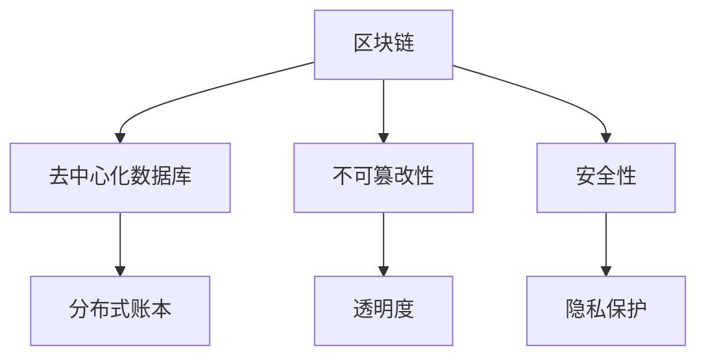
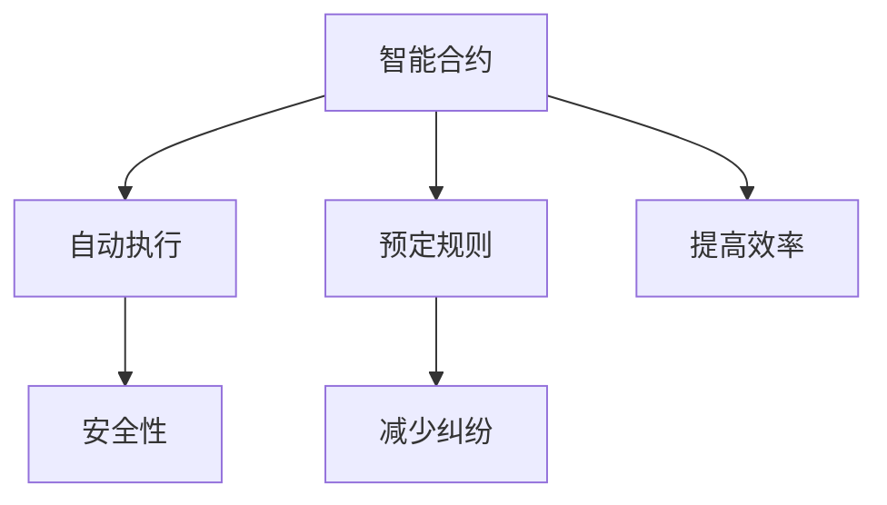

                 

 关键词：知识经济，知识付费，区块链，智能合约，课程发布

> 摘要：本文探讨了知识经济时代下，知识付费模式的发展，以及区块链技术如何通过智能合约实现课程发布的变革。文章首先介绍了知识经济的背景和知识付费的概念，接着深入剖析了区块链技术和智能合约的基本原理，最后通过实际案例展示了区块链智能合约在知识付费领域的应用。

## 1. 背景介绍

### 1.1 知识经济概述

知识经济是以知识为核心资源，以知识的生产、分配、使用和传播为主要内容的经济形态。它不同于传统的物质经济，强调知识在经济发展中的主导地位。随着信息技术的迅猛发展，知识经济已经成为全球经济的重要组成部分。

### 1.2 知识付费的概念

知识付费是指个人或企业为了获取特定的知识或技能，向知识提供者支付一定费用的一种商业模式。在知识经济时代，知识付费已经成为一种重要的盈利手段，不仅满足了用户对知识的渴求，也激发了知识生产者的积极性。

## 2. 核心概念与联系

### 2.1 区块链技术

区块链是一种去中心化的分布式数据库技术，通过密码学确保数据的不可篡改性和安全性。每个区块都包含一定数量的交易记录，这些区块按照时间顺序串联成链，形成区块链。



### 2.2 智能合约

智能合约是运行在区块链上的程序，它根据预先设定的规则自动执行合约条款。智能合约实现了合约条款的自动化执行，提高了交易的效率和安全性。



### 2.3 区块链智能合约与知识付费

区块链智能合约在知识付费领域的应用主要体现在以下几个方面：

- **透明度**：智能合约的执行过程公开透明，用户可以随时查看课程发布的细节。
- **安全性**：智能合约的不可篡改性确保了知识付费的安全，减少了欺诈和作弊的风险。
- **效率**：智能合约的自动化执行提高了知识付费的效率，减少了交易的中介环节。

## 3. 核心算法原理 & 具体操作步骤

### 3.1 算法原理概述

区块链智能合约的核心算法是基于密码学的加密算法和分布式一致性算法。智能合约通过加密算法确保数据的安全性和隐私性，通过分布式一致性算法实现去中心化的数据处理。

### 3.2 算法步骤详解

#### 步骤1：创建课程信息

课程发布者使用智能合约创建课程信息，包括课程名称、课程内容、授课时间、学费等。

#### 步骤2：发布课程信息

课程发布者通过智能合约将课程信息发布到区块链上，确保课程信息的公开透明。

#### 步骤3：支付学费

学生通过智能合约支付学费，智能合约自动记录学费支付情况。

#### 步骤4：课程学习

学生根据课程信息开始学习，智能合约记录学生的学习进度。

#### 步骤5：课程评价

学生完成课程学习后，对课程进行评价，智能合约记录评价结果。

### 3.3 算法优缺点

#### 优点：

- **透明度**：智能合约的执行过程公开透明，用户可以随时查看课程发布的细节。
- **安全性**：智能合约的不可篡改性确保了知识付费的安全，减少了欺诈和作弊的风险。
- **效率**：智能合约的自动化执行提高了知识付费的效率，减少了交易的中介环节。

#### 缺点：

- **复杂性**：智能合约的编写和使用相对复杂，需要一定的技术背景。
- **性能**：区块链的性能相对较低，无法满足高频交易的场景。

### 3.4 算法应用领域

区块链智能合约在知识付费领域的应用主要体现在在线教育、远程办公、知识产权保护等领域。

## 4. 数学模型和公式 & 详细讲解 & 举例说明

### 4.1 数学模型构建

区块链智能合约的数学模型主要包括加密算法模型和分布式一致性算法模型。

#### 加密算法模型：

- **非对称加密**：加密算法模型，如RSA算法。
- **哈希算法**：将数据转换为一串固定长度的字符串，如SHA-256算法。

#### 分布式一致性算法模型：

- **PBFT算法**：实用拜占庭容错算法，保证分布式系统的数据一致性。

### 4.2 公式推导过程

#### 非对称加密算法：

- **加密过程**：\(C = E(P, K_{公})\)
- **解密过程**：\(P = D(C, K_{私})\)

#### 哈希算法：

- **哈希函数**：\(H(P) = \text{SHA-256}(P)\)

#### 分布式一致性算法：

- **一致性条件**：每个节点计算的结果与其它节点的一致。

### 4.3 案例分析与讲解

#### 案例一：在线教育

使用区块链智能合约实现在线教育的知识付费模式，包括课程发布、学费支付、课程学习、课程评价等环节。

#### 案例二：知识产权保护

使用区块链智能合约实现知识产权的保护，包括作品发布、授权许可、侵权监测等环节。

## 5. 项目实践：代码实例和详细解释说明

### 5.1 开发环境搭建

- **区块链平台**：使用Ethereum平台。
- **开发工具**：使用Truffle框架进行智能合约开发。

### 5.2 源代码详细实现

```solidity
// SPDX-License-Identifier: MIT
pragma solidity ^0.8.0;

contract Course {
    struct CourseInfo {
        string name;
        string content;
        uint256 duration;
        uint256 tuition;
    }

    mapping(address => CourseInfo) public courses;
    mapping(address => uint256) public tuitionPaid;

    function createCourse(string memory name, string memory content, uint256 duration, uint256 tuition) public {
        courses[msg.sender] = CourseInfo(name, content, duration, tuition);
    }

    function payTuition() public payable {
        require(tuitionPaid[msg.sender] == 0, "Tuition already paid");
        tuitionPaid[msg.sender] = msg.value;
    }

    function startLearning() public {
        require(tuitionPaid[msg.sender] > 0, "Tuition not paid");
        // 开始学习逻辑
    }

    function evaluateCourse() public {
        // 课程评价逻辑
    }
}
```

### 5.3 代码解读与分析

- **CourseInfo 结构**：定义了课程的基本信息。
- **courses 和 tuitionPaid 映射**：存储课程信息和学费支付状态。
- **createCourse 函数**：创建课程信息。
- **payTuition 函数**：支付学费。
- **startLearning 函数**：开始学习。
- **evaluateCourse 函数**：课程评价。

### 5.4 运行结果展示

通过Truffle框架部署智能合约到Ethereum网络，然后通过前端接口进行课程发布、学费支付、课程学习、课程评价等操作。

## 6. 实际应用场景

### 6.1 在线教育

区块链智能合约可以用于在线教育的知识付费模式，提高课程发布和学费支付的安全性和透明度。

### 6.2 远程办公

区块链智能合约可以用于远程办公的技能认证和薪资支付，确保工作的真实性和效率。

### 6.3 知识产权保护

区块链智能合约可以用于知识产权的保护，确保作品的真实性和合法性。

## 7. 未来应用展望

随着区块链技术的不断发展，智能合约在知识付费领域的应用将更加广泛，未来有望实现更加智能化、个性化的知识付费模式。

## 8. 工具和资源推荐

### 8.1 学习资源推荐

- **《区块链技术指南》**：全面介绍了区块链的基本原理和应用。
- **《智能合约开发实战》**：详细讲解了智能合约的开发过程。

### 8.2 开发工具推荐

- **Truffle**：用于智能合约开发的框架。
- **Ethereum**：用于部署和运行智能合约的平台。

### 8.3 相关论文推荐

- **"区块链技术：原理与应用"**：对区块链技术进行了深入的研究。
- **"智能合约的安全性问题与解决方案"**：探讨了智能合约的安全性问题。

## 9. 总结：未来发展趋势与挑战

### 9.1 研究成果总结

本文介绍了知识经济时代下知识付费的发展，以及区块链智能合约在知识付费领域的应用。通过实际案例，展示了区块链智能合约在提高知识付费的安全性和透明度方面的优势。

### 9.2 未来发展趋势

随着区块链技术的不断发展，智能合约在知识付费领域的应用将更加广泛，未来有望实现更加智能化、个性化的知识付费模式。

### 9.3 面临的挑战

- **技术复杂性**：智能合约的编写和使用需要一定的技术背景。
- **性能优化**：区块链的性能需要进一步提高，以满足大规模交易的场景。

### 9.4 研究展望

未来，我们需要进一步研究智能合约在知识付费领域的应用，优化智能合约的性能，提高其安全性，为知识付费模式的创新发展提供技术支持。

## 10. 附录：常见问题与解答

### 10.1 什么是区块链？

区块链是一种去中心化的分布式数据库技术，通过密码学确保数据的不可篡改性和安全性。

### 10.2 什么是智能合约？

智能合约是运行在区块链上的程序，根据预先设定的规则自动执行合约条款。

### 10.3 区块链智能合约在知识付费领域的应用有哪些？

区块链智能合约在知识付费领域的应用包括课程发布、学费支付、课程学习、课程评价等环节，提高知识付费的安全性和透明度。

## 作者署名

作者：禅与计算机程序设计艺术 / Zen and the Art of Computer Programming
----------------------------------------------------------------

