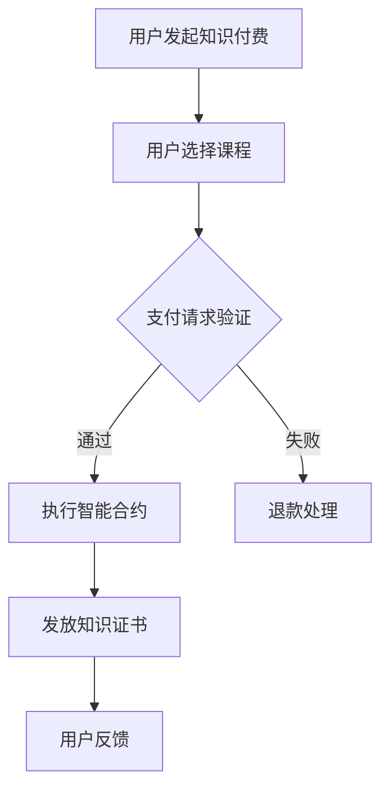

                 

关键词：知识付费、区块链、智能合约、教育技术、知识经济

> 摘要：随着知识经济的蓬勃发展，知识付费逐渐成为市场需求的一部分。本文将探讨如何在知识经济背景下，利用区块链技术构建智能合约课程发布平台，提升知识付费的透明度、安全性和效率。

## 1. 背景介绍

在知识经济时代，知识和信息成为了重要的生产要素，知识付费作为新兴商业模式，正在不断改变传统教育和信息传播的生态。传统的知识付费模式存在着信息不对称、交易信任问题以及中心化平台的高额费用等问题。区块链技术作为一种分布式账本技术，具备去中心化、不可篡改和可溯源等特点，能够有效解决上述问题，为知识付费提供新的解决方案。

## 2. 核心概念与联系

### 2.1 区块链基本原理

区块链是一个分布式数据库系统，它通过加密算法和共识机制，确保数据的安全性和完整性。区块链由多个区块组成，每个区块包含了若干笔交易记录。这些区块按照时间顺序链接在一起，形成了一个不可篡改的链式结构。

### 2.2 智能合约

智能合约是基于区块链技术的自动执行合约。它通过计算机程序代码实现，当满足预定的条件时，自动执行合约条款。智能合约可以自动化执行交易、合同等过程，无需人工干预。

### 2.3 知识付费与区块链的联系

知识付费与区块链技术的结合，可以实现以下目标：

- **去中心化平台**：打破传统中心化平台垄断，建立去中心化的知识付费生态系统。
- **透明度和可追溯性**：区块链记录所有交易信息，确保知识付费的透明度和可追溯性。
- **安全性和隐私保护**：通过加密算法和共识机制，确保交易的安全性和用户的隐私保护。
- **高效交易**：通过智能合约自动化执行交易，提高交易效率。

### 2.4 Mermaid 流程图



## 3. 核心算法原理 & 具体操作步骤

### 3.1 算法原理概述

智能合约的算法原理基于区块链的共识机制和加密算法。当用户选择课程并支付请求验证通过时，智能合约会自动执行，将资金转移至课程提供者的账户，并发送知识证书给用户。

### 3.2 算法步骤详解

1. **用户发起支付请求**：用户选择课程并点击支付按钮，系统生成支付请求。
2. **支付请求验证**：系统将支付请求发送至区块链网络，区块链节点进行验证。
3. **执行智能合约**：验证通过后，智能合约执行，将资金转移至课程提供者的账户，并发送知识证书给用户。
4. **交易记录**：所有交易信息被记录在区块链上，确保透明度和可追溯性。

### 3.3 算法优缺点

#### 优点：

- **去中心化**：去除了传统中心化平台的垄断，实现了知识付费的公平性。
- **安全性和隐私保护**：通过加密算法和共识机制，确保交易的安全性和用户的隐私保护。
- **高效性**：智能合约自动化执行，提高了交易效率。

#### 缺点：

- **技术门槛**：区块链技术较为复杂，需要较高的技术门槛。
- **初期成本**：构建区块链智能合约平台需要投入较大成本。

### 3.4 算法应用领域

智能合约在知识付费领域的应用，可以推广到在线教育、远程医疗、版权交易等多个领域。

## 4. 数学模型和公式 & 详细讲解 & 举例说明

### 4.1 数学模型构建

智能合约的数学模型主要包括以下几个方面：

- **用户支付金额**：设为\(P\)。
- **课程价格**：设为\(C\)。
- **手续费**：设为\(F\)。
- **实际支付金额**：\(P - F\)。

### 4.2 公式推导过程

智能合约的计算公式为：

\[ P - F = C + R \]

其中，\(R\)为课程提供者的收益。

### 4.3 案例分析与讲解

假设某用户支付100元购买一门课程，手续费为10元。课程价格为90元。根据公式，用户实际支付90元，课程提供者获得80元收益。

## 5. 项目实践：代码实例和详细解释说明

### 5.1 开发环境搭建

在开发区块链智能合约课程发布平台前，需要搭建以下开发环境：

- **Node.js**：用于构建后端服务。
- **Truffle**：用于智能合约的编译、部署和测试。
- **Ganache**：用于本地测试区块链。

### 5.2 源代码详细实现

以下是智能合约的简单示例代码：

```solidity
pragma solidity ^0.8.0;

contract KnowledgePayment {
    address public courseProvider;
    mapping(address => uint256) public balance;

    constructor() {
        courseProvider = msg.sender;
    }

    function payForCourse() external payable {
        require(msg.value == 100, "支付金额错误");
        balance[courseProvider] += msg.value;
    }

    function refund() external {
        require(balance[msg.sender] > 0, "无退款金额");
        payable(msg.sender).transfer(balance[msg.sender]);
        balance[msg.sender] = 0;
    }
}
```

### 5.3 代码解读与分析

该智能合约实现了以下功能：

- **支付课程费用**：用户调用`payForCourse`函数支付课程费用。
- **退款处理**：用户调用`refund`函数申请退款。

### 5.4 运行结果展示

假设用户支付100元，课程提供者地址为`0x123...`。调用`payForCourse`函数后，区块链上会记录用户支付的信息。

## 6. 实际应用场景

### 6.1 在线教育

利用区块链智能合约，可以构建去中心化的在线教育平台，提高课程的透明度和可信度。

### 6.2 版权交易

智能合约可以用于版权交易，确保版权信息的准确性和交易的不可篡改性。

### 6.3 远程医疗

在远程医疗服务中，智能合约可以用于支付医疗服务费用，并记录病历信息。

## 7. 未来应用展望

随着区块链技术的不断成熟，智能合约在知识付费领域的应用将越来越广泛。未来，我们可以期待更多去中心化的应用场景，为知识经济提供更高效、更安全的解决方案。

## 8. 总结：未来发展趋势与挑战

### 8.1 研究成果总结

本文探讨了知识付费与区块链智能合约的结合，展示了其在去中心化、安全性和效率方面的优势。

### 8.2 未来发展趋势

未来，区块链智能合约将在更多领域得到应用，为知识经济提供更多可能性。

### 8.3 面临的挑战

- **技术门槛**：区块链技术较为复杂，需要大量技术储备。
- **用户接受度**：需要提高用户对区块链技术的认知和接受度。

### 8.4 研究展望

未来，我们将继续探索区块链在知识经济中的应用，为教育和信息传播领域带来更多创新。

## 9. 附录：常见问题与解答

### 问题1：区块链智能合约的安全性如何保证？

解答：区块链智能合约的安全性主要通过以下方式保证：

- **加密算法**：使用非对称加密算法保护交易信息。
- **共识机制**：通过共识机制确保区块链的一致性和安全性。
- **智能合约审计**：对智能合约进行审计，确保其安全性。

----------------------------------------------------------------

作者：禅与计算机程序设计艺术 / Zen and the Art of Computer Programming


