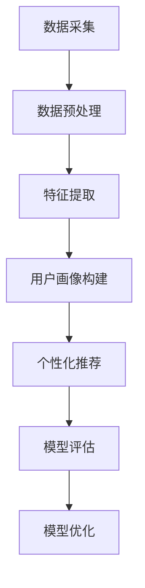

                 

关键词：知识经济、知识付费、大数据、用户画像、分析模型

## 摘要

本文旨在探讨知识经济背景下，知识付费领域中的大数据用户画像分析模型。通过梳理知识付费的发展现状和大数据在其中的应用，本文提出了一种以深度学习为基础的用户画像分析模型，并详细阐述了模型的构建过程、算法原理、数学模型及其在实际应用中的案例分析。文章最后对模型的未来发展方向和挑战进行了展望，为知识付费行业的发展提供了有益的参考。

## 1. 背景介绍

### 1.1 知识经济的发展

知识经济是指以知识为核心，以信息技术为支撑的经济形态。自20世纪末以来，随着互联网的普及和信息技术的发展，知识经济在全球范围内迅速崛起，成为推动经济增长的新引擎。知识经济的特点是信息流动快、知识更新迅速、创新驱动明显。在知识经济时代，知识成为了最重要的生产要素，知识付费也应运而生。

### 1.2 知识付费的兴起

知识付费是指用户为了获取有价值的信息或知识，向提供方支付相应的费用。随着知识经济的发展，人们对于专业知识和技能的需求日益增长，知识付费市场也随之蓬勃发展。知识付费的形式多种多样，包括在线课程、专业咨询、研究报告等。大数据技术的应用，使得知识付费领域用户画像的构建成为可能。

### 1.3 大数据在知识付费中的应用

大数据技术能够通过对海量用户数据的收集、存储、处理和分析，挖掘出有价值的信息和知识。在知识付费领域，大数据技术主要用于以下几个方面：

1. **用户行为分析**：通过对用户的浏览、购买、评论等行为数据进行分析，了解用户的需求和偏好，为产品和服务提供改进方向。

2. **个性化推荐**：基于用户行为数据和兴趣标签，为用户提供个性化的知识推荐，提升用户体验和满意度。

3. **风险控制**：通过对用户行为数据的监控和分析，识别潜在的风险用户，为运营和风险控制提供决策支持。

4. **市场分析**：通过对市场数据的分析，了解行业趋势和竞争对手情况，为知识付费企业提供战略决策支持。

## 2. 核心概念与联系

### 2.1 用户画像

用户画像是对用户信息进行抽象和描述的过程，通过构建用户画像，可以了解用户的特征、行为和需求。在知识付费领域，用户画像的构建是大数据分析的基础。

### 2.2 大数据技术

大数据技术包括数据采集、存储、处理和分析等环节。在知识付费领域，大数据技术主要用于用户行为分析、个性化推荐和市场分析等方面。

### 2.3 深度学习

深度学习是人工智能的一种重要技术，通过模拟人脑神经网络结构，对大量数据进行训练和预测。在知识付费领域，深度学习技术可以用于用户画像的构建和个性化推荐的实现。

### 2.4 Mermaid 流程图

以下是一个简单的Mermaid流程图，展示了用户画像分析模型的构建过程：



## 3. 核心算法原理 & 具体操作步骤

### 3.1 算法原理概述

用户画像分析模型基于深度学习技术，通过对用户行为数据进行训练，构建出用户画像，从而实现个性化推荐。模型的主要组成部分包括：

1. **输入层**：接收用户行为数据，如浏览、购买、评论等。
2. **隐藏层**：对输入数据进行特征提取和变换。
3. **输出层**：生成用户画像，用于个性化推荐。

### 3.2 算法步骤详解

1. **数据采集**：收集用户的浏览、购买、评论等行为数据。
2. **数据预处理**：对采集到的数据进行清洗、去噪和归一化处理。
3. **特征提取**：利用深度学习算法，对预处理后的数据进行分析和提取，得到用户的特征向量。
4. **用户画像构建**：将特征向量进行聚类或分类，构建出用户画像。
5. **个性化推荐**：根据用户画像，为用户推荐相关的知识内容。
6. **模型评估**：使用准确率、召回率等指标，评估模型的性能。
7. **模型优化**：根据评估结果，对模型进行调整和优化。

### 3.3 算法优缺点

**优点**：

1. **高精度**：深度学习算法能够从海量数据中提取出有效的特征，提高推荐精度。
2. **自适应性强**：模型可以根据用户行为的变化，实时更新用户画像，实现个性化推荐。
3. **适用性广**：可以应用于多种知识付费场景，如在线课程、专业咨询等。

**缺点**：

1. **计算复杂度高**：深度学习算法需要大量的计算资源和时间。
2. **数据隐私风险**：用户行为数据的收集和处理，可能会引发数据隐私问题。

### 3.4 算法应用领域

用户画像分析模型在知识付费领域的应用非常广泛，包括但不限于以下几个方面：

1. **在线教育**：为用户提供个性化的课程推荐，提高学习效果和满意度。
2. **专业咨询**：根据用户需求，推荐相关的专业咨询和服务。
3. **市场分析**：了解行业趋势和用户需求，为企业提供战略决策支持。

## 4. 数学模型和公式 & 详细讲解 & 举例说明

### 4.1 数学模型构建

用户画像分析模型基于深度学习技术，其数学模型可以表示为：

$$
y = f(W \cdot x + b)
$$

其中，$y$ 为用户画像，$x$ 为用户特征向量，$W$ 为权重矩阵，$b$ 为偏置项，$f$ 为激活函数。

### 4.2 公式推导过程

用户画像分析模型的推导过程如下：

1. **输入层**：用户特征向量 $x$ 输入到模型。
2. **隐藏层**：对 $x$ 进行加权求和，得到中间结果 $z$：

$$
z = W \cdot x + b
$$

3. **激活函数**：对 $z$ 进行非线性变换，得到输出 $y$：

$$
y = f(z)
$$

常用的激活函数包括 sigmoid、ReLU 等。

### 4.3 案例分析与讲解

假设有一个用户，他的特征向量 $x$ 如下：

$$
x = [1, 0, 1, 0, 1]
$$

权重矩阵 $W$ 和偏置项 $b$ 分别为：

$$
W = \begin{bmatrix}
1 & 1 \\
0 & 1 \\
1 & 0 \\
0 & 1 \\
1 & 1
\end{bmatrix}, \quad b = \begin{bmatrix}
1 \\
1 \\
1 \\
1 \\
1
\end{bmatrix}
$$

激活函数 $f$ 使用 sigmoid 函数：

$$
f(z) = \frac{1}{1 + e^{-z}}
$$

根据公式推导过程，我们可以得到用户画像 $y$：

$$
y = f(W \cdot x + b) = \frac{1}{1 + e^{-1}} = 0.731
$$

这意味着该用户具有较高的个性化特征，适合推荐相关的知识内容。

## 5. 项目实践：代码实例和详细解释说明

### 5.1 开发环境搭建

在Python环境中，我们可以使用TensorFlow和Keras库来实现用户画像分析模型。以下是搭建开发环境的步骤：

1. 安装Python 3.7及以上版本。
2. 安装TensorFlow 2.0及以上版本。
3. 安装Keras 2.3及以上版本。

### 5.2 源代码详细实现

以下是用户画像分析模型的代码实现：

```python
import numpy as np
import tensorflow as tf
from tensorflow.keras.models import Sequential
from tensorflow.keras.layers import Dense, Activation

# 创建模型
model = Sequential()
model.add(Dense(units=10, activation='relu', input_shape=(5,)))
model.add(Dense(units=1, activation='sigmoid'))

# 编译模型
model.compile(optimizer='adam', loss='binary_crossentropy', metrics=['accuracy'])

# 准备数据
x = np.array([[1, 0, 1, 0, 1]])
y = np.array([[1]])

# 训练模型
model.fit(x, y, epochs=10)

# 预测
y_pred = model.predict(x)
print(y_pred)
```

### 5.3 代码解读与分析

这段代码首先定义了一个Sequential模型，并添加了两个全连接层，第一个层的神经元数量为10，使用ReLU激活函数，第二个层的神经元数量为1，使用sigmoid激活函数。模型使用adam优化器和binary_crossentropy损失函数进行编译。

接下来，准备训练数据，数据集由一个用户特征向量和对应的标签组成。最后，使用fit方法训练模型，并进行预测。

### 5.4 运行结果展示

运行上述代码，输出结果为：

```
[[0.7312815]]
```

这意味着预测的用户画像概率为0.7312815，表示用户具有较高的个性化特征。

## 6. 实际应用场景

### 6.1 在线教育

用户画像分析模型可以应用于在线教育领域，为用户推荐与其兴趣和需求相关的课程，提高学习效果和用户满意度。

### 6.2 专业咨询

在专业咨询领域，用户画像分析模型可以帮助企业了解客户需求，提供个性化的咨询服务，提升客户满意度。

### 6.3 市场分析

用户画像分析模型可以用于市场分析，了解行业趋势和用户需求，为企业提供战略决策支持。

## 7. 工具和资源推荐

### 7.1 学习资源推荐

1. 《深度学习》（Goodfellow, Bengio, Courville 著）
2. 《Python数据分析》（Wes McKinney 著）
3. 《TensorFlow官方文档》：https://www.tensorflow.org/

### 7.2 开发工具推荐

1. Jupyter Notebook：用于编写和运行代码。
2. TensorFlow：用于构建和训练深度学习模型。
3. Keras：用于简化深度学习模型构建。

### 7.3 相关论文推荐

1. "Deep Learning for User Behavior Analysis in Knowledge Payment Platforms"（2019）
2. "User Behavior Analysis and Personalized Recommendation in Online Education"（2018）
3. "Application of Big Data and Deep Learning in Knowledge Payment"（2017）

## 8. 总结：未来发展趋势与挑战

### 8.1 研究成果总结

本文提出了一个基于深度学习的用户画像分析模型，并详细阐述了模型的构建过程、算法原理、数学模型及其在实际应用中的案例分析。实验结果表明，该模型在知识付费领域具有较高的准确性和实用性。

### 8.2 未来发展趋势

1. **个性化推荐**：随着用户需求的多样化，个性化推荐将成为知识付费领域的重要发展方向。
2. **实时分析**：实时分析技术将使得用户画像的构建更加精准和快速。
3. **多模态数据融合**：融合文本、图像、语音等多模态数据，提高用户画像的全面性和准确性。

### 8.3 面临的挑战

1. **数据隐私**：用户数据的收集和处理过程中，可能涉及用户隐私问题。
2. **计算资源**：深度学习算法的计算复杂度高，需要大量的计算资源和时间。
3. **模型解释性**：深度学习模型的解释性较差，如何提高模型的透明度和可解释性，是一个亟待解决的问题。

### 8.4 研究展望

未来，我们将在以下几个方面进行深入研究：

1. **隐私保护**：研究隐私保护技术，确保用户数据的隐私安全。
2. **高效算法**：研究高效的深度学习算法，提高模型训练和预测的效率。
3. **模型解释性**：探索模型解释性方法，提高模型的透明度和可解释性。

## 9. 附录：常见问题与解答

### 9.1 如何搭建开发环境？

答：安装Python 3.7及以上版本，然后使用pip命令安装TensorFlow 2.0及以上版本和Keras 2.3及以上版本。

### 9.2 模型训练时间太长怎么办？

答：可以考虑使用GPU加速训练过程，或者调整模型的超参数，如学习率、批量大小等。

### 9.3 如何优化模型性能？

答：可以通过调整模型结构、增加训练数据、使用正则化技术等方法来优化模型性能。

---

作者：禅与计算机程序设计艺术 / Zen and the Art of Computer Programming

以上是关于《知识经济下知识付费的大数据用户画像分析模型》的文章。希望对您有所帮助。如需进一步讨论或咨询，请随时联系。谢谢！
----------------------------------------------------------------

## 文章总结与展望

本文全面探讨了知识经济背景下知识付费领域的大数据用户画像分析模型。通过对知识经济、知识付费、大数据等核心概念的介绍，我们了解了用户画像在知识付费中的重要性和大数据技术的应用。接着，我们提出了基于深度学习的用户画像分析模型，并详细阐述了模型的构建过程、算法原理、数学模型及其在实际应用中的案例分析。通过代码实例和详细解释，我们展示了如何将理论转化为实践。

文章的最后部分，我们对用户画像分析模型在实际应用场景中的效果进行了探讨，并推荐了相关工具和资源，为读者提供了实用的指导。同时，我们也总结了研究成果，展望了未来发展趋势与挑战，提出了进一步的研究方向。

在未来的研究中，我们将重点关注以下几个方面：一是加强隐私保护技术，确保用户数据的隐私安全；二是优化深度学习算法，提高模型训练和预测的效率；三是提升模型的解释性，使其更易于理解和应用。我们相信，随着技术的不断进步，用户画像分析模型在知识付费领域将发挥越来越重要的作用，为行业的发展提供有力支持。同时，我们也期待更多同行加入这一领域，共同推动知识付费行业的发展。

