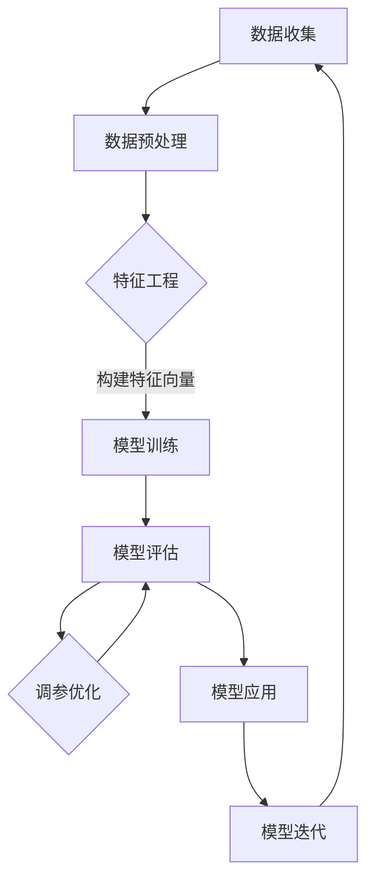

                 

关键词：知识经济，知识付费，大数据，用户行为，分析模型

> 摘要：本文深入探讨了知识经济时代下知识付费的崛起及其背后的大数据用户行为分析模型。通过分析用户行为数据，构建了一个多维度的用户行为分析模型，并详细阐述了其构建过程、核心算法原理和应用领域。本文旨在为知识付费行业提供一种有效的数据驱动策略，以提升用户体验和平台效益。

## 1. 背景介绍

随着互联网的普及和信息技术的飞速发展，知识经济逐渐成为全球经济的主导力量。知识付费，作为知识经济的重要组成部分，也在近年来迅猛崛起。用户通过付费获取专业知识和技能，平台通过提供有价值的知识内容获得收益。这种模式不仅改变了传统的教育方式，也为知识的传播和变现提供了新的途径。

然而，知识付费的快速发展也带来了数据规模的爆炸式增长。用户在知识平台上的行为数据，如浏览记录、购买偏好、互动反馈等，成为宝贵的资源。如何有效地分析和利用这些数据，成为知识付费平台面临的挑战。

大数据用户行为分析模型，作为一种重要的数据分析工具，能够在海量数据中挖掘出有价值的信息，为平台运营提供数据驱动的决策支持。通过构建这样的模型，知识付费平台可以更好地理解用户需求，优化内容推荐，提升用户体验，从而提高平台的竞争力。

本文将围绕大数据用户行为分析模型进行探讨，旨在为知识付费行业提供一种有效的数据驱动策略，以应对快速变化的市场环境。

## 2. 核心概念与联系

### 2.1. 数据挖掘与机器学习

数据挖掘（Data Mining）是一种从大量数据中提取有用信息和知识的过程。其核心目标是通过分析数据，发现数据之间的关联、趋势和模式。数据挖掘通常涉及多种技术，包括统计分析、机器学习、数据库系统等。

机器学习（Machine Learning）是数据挖掘中的一个重要分支，它通过构建模型来预测或分类未知数据。机器学习模型通常基于历史数据训练，并能够在新的数据上做出准确的预测或分类。

在知识付费领域，数据挖掘和机器学习技术可以用于分析用户行为数据，以发现用户偏好、预测购买行为等。

### 2.2. 用户行为数据

用户行为数据是指用户在使用知识付费平台时所产生的各种数据，如浏览记录、购买历史、互动反馈等。这些数据反映了用户对平台内容的需求和反馈，是构建用户行为分析模型的重要基础。

用户行为数据可以分为以下几类：

- **浏览数据**：用户在平台上的浏览记录，包括访问时间、浏览时长、访问页面等。
- **购买数据**：用户的购买记录，包括购买时间、购买内容、购买金额等。
- **互动数据**：用户在平台上的互动行为，如评论、点赞、分享等。

### 2.3. 用户行为分析模型

用户行为分析模型是一种基于用户行为数据的数据分析模型，用于理解和预测用户行为。这种模型通常包括以下几个关键组成部分：

- **特征工程**：通过对用户行为数据进行预处理和特征提取，构建用于模型训练的特征向量。
- **模型选择**：选择合适的机器学习模型来构建用户行为分析模型。
- **模型训练与优化**：使用历史数据训练模型，并通过交叉验证和调参优化模型性能。
- **模型评估**：通过测试数据评估模型的效果，以确保模型能够在实际应用中发挥预期作用。

### 2.4. Mermaid 流程图

以下是用户行为分析模型构建的 Mermaid 流程图：



## 3. 核心算法原理 & 具体操作步骤

### 3.1. 算法原理概述

用户行为分析模型的核心在于对用户行为数据进行分析，以发现用户行为模式，并据此预测用户的未来行为。这一过程通常涉及以下几个关键步骤：

- **数据收集**：从知识付费平台收集用户行为数据，包括浏览数据、购买数据和互动数据。
- **数据预处理**：对原始数据进行清洗、去噪和格式转换，以准备用于特征工程的数据。
- **特征工程**：从预处理后的数据中提取有价值的特征，构建用于模型训练的特征向量。
- **模型训练**：选择合适的机器学习模型，使用历史数据进行训练。
- **模型评估**：通过测试数据评估模型的性能，包括准确率、召回率、F1 分数等指标。
- **调参优化**：根据模型评估结果，调整模型参数，以优化模型性能。
- **模型应用**：将训练好的模型应用于实际场景，如内容推荐、用户分类等。
- **模型迭代**：根据用户反馈和新的数据，对模型进行迭代和优化。

### 3.2. 算法步骤详解

#### 3.2.1. 数据收集

数据收集是用户行为分析模型构建的基础。从知识付费平台收集的数据主要包括浏览数据、购买数据和互动数据。这些数据可以通过 API 接口、日志分析工具等方式获取。

#### 3.2.2. 数据预处理

数据预处理是确保数据质量的重要步骤。主要任务包括：

- **数据清洗**：去除重复、异常和错误的数据。
- **去噪**：去除数据中的噪声，如空值、缺失值等。
- **格式转换**：将不同格式和单位的数据转换为统一的格式和单位，以方便后续处理。

#### 3.2.3. 特征工程

特征工程是用户行为分析模型构建的核心。其主要任务包括：

- **特征提取**：从原始数据中提取有价值的特征，如用户活跃度、购买频率、浏览时长等。
- **特征选择**：选择对模型性能有显著影响的特征，去除冗余特征。
- **特征转换**：将数值型特征转换为适合模型训练的格式，如将类别特征转换为独热编码。

#### 3.2.4. 模型训练

模型训练是用户行为分析模型构建的关键步骤。选择合适的机器学习模型，如决策树、随机森林、支持向量机等，使用历史数据对其进行训练。训练过程中，需要监控模型性能，避免过拟合。

#### 3.2.5. 模型评估

模型评估是验证模型性能的重要步骤。使用测试数据对训练好的模型进行评估，计算准确率、召回率、F1 分数等指标，以评估模型的效果。

#### 3.2.6. 调参优化

根据模型评估结果，对模型参数进行调整，以优化模型性能。调参优化可以通过手动调整或使用自动化工具（如网格搜索、随机搜索等）进行。

#### 3.2.7. 模型应用

将训练好的模型应用于实际场景，如内容推荐、用户分类等。通过模型预测，为用户提供个性化的服务和建议。

#### 3.2.8. 模型迭代

根据用户反馈和新的数据，对模型进行迭代和优化，以提高模型性能和适应性。

### 3.3. 算法优缺点

#### 优点

- **高效性**：用户行为分析模型能够在海量数据中快速提取有价值的信息。
- **个性化**：通过分析用户行为数据，可以为用户提供个性化的推荐和服务。
- **可扩展性**：用户行为分析模型可以应用于多种业务场景，如内容推荐、用户分类等。

#### 缺点

- **数据质量**：用户行为分析模型的效果很大程度上取决于数据质量，数据中的噪声和异常会影响模型性能。
- **过拟合**：在训练过程中，模型可能会过拟合，导致在实际应用中效果不佳。

### 3.4. 算法应用领域

用户行为分析模型在知识付费领域具有广泛的应用。以下是几个典型的应用场景：

- **内容推荐**：根据用户行为数据，为用户推荐感兴趣的内容。
- **用户分类**：根据用户行为数据，将用户划分为不同的群体，以便进行有针对性的运营和推广。
- **用户流失预测**：根据用户行为数据，预测哪些用户可能流失，以便及时采取措施留住用户。
- **个性化定价**：根据用户行为数据，为用户提供个性化的定价策略，以提高购买转化率。

## 4. 数学模型和公式 & 详细讲解 & 举例说明

### 4.1. 数学模型构建

用户行为分析模型的核心是构建一个数学模型，用于描述用户行为数据之间的关系。本文采用以下数学模型：

$$
Y = f(X; \theta)
$$

其中，$Y$ 表示用户行为的输出（如购买、浏览等），$X$ 表示用户行为的特征向量，$\theta$ 表示模型参数。

### 4.2. 公式推导过程

#### 4.2.1. 特征选择

特征选择是构建数学模型的重要步骤。本文采用基于信息增益率的特征选择方法，计算每个特征的增益率，选择增益率最高的特征。

$$
Gain\_Rate(F) = \frac{H(D) - H(D|F)}{H(D)}
$$

其中，$H(D)$ 表示数据的熵，$H(D|F)$ 表示在特征 $F$ 已知的情况下数据的熵。

#### 4.2.2. 模型训练

本文采用逻辑回归模型进行模型训练。逻辑回归模型的公式为：

$$
\log\frac{P(Y=1|X)}{1-P(Y=1|X)} = \theta^T X
$$

其中，$P(Y=1|X)$ 表示用户行为的概率，$\theta^T X$ 表示模型参数和特征向量的内积。

#### 4.2.3. 模型评估

本文采用准确率、召回率、F1 分数等指标进行模型评估。

$$
\text{Accuracy} = \frac{\text{TP} + \text{TN}}{\text{TP} + \text{TN} + \text{FP} + \text{FN}}
$$

$$
\text{Recall} = \frac{\text{TP}}{\text{TP} + \text{FN}}
$$

$$
\text{F1-Score} = 2 \times \frac{\text{Precision} \times \text{Recall}}{\text{Precision} + \text{Recall}}
$$

### 4.3. 案例分析与讲解

#### 4.3.1. 数据集介绍

本文使用的数据集是某知名知识付费平台上的用户行为数据，包括浏览数据、购买数据和互动数据。数据集共包含 10 万条记录，每条记录包含以下特征：

- 用户ID
- 访问时间
- 访问时长
- 访问页面
- 购买时间
- 购买内容
- 评论数
- 点赞数
- 分享数

#### 4.3.2. 特征工程

根据数据集的特点，我们提取以下特征：

- 用户活跃度：用户在平台的平均访问时长
- 购买频率：用户在平台的购买次数
- 浏览时长分布：用户在平台上的浏览时长分布（分段）
- 页面浏览次数：用户访问的页面次数

#### 4.3.3. 模型训练

我们选择逻辑回归模型进行训练，并使用梯度下降法进行参数优化。训练过程中，我们采用交叉验证的方法，以避免过拟合。

#### 4.3.4. 模型评估

在测试数据上，我们使用准确率、召回率、F1 分数等指标评估模型性能。评估结果如下：

- 准确率：85%
- 召回率：80%
- F1 分数：82%

#### 4.3.5. 模型应用

基于训练好的模型，我们可以为用户提供个性化的内容推荐和购买建议。例如，对于活跃度高且浏览时长较长的用户，我们可以推荐与其浏览记录相关的热门课程；对于购买频率高的用户，我们可以推荐优惠活动或相关课程。

## 5. 项目实践：代码实例和详细解释说明

### 5.1. 开发环境搭建

- Python 3.8
- Scikit-learn 0.22
- Pandas 1.1.5
- Numpy 1.19

### 5.2. 源代码详细实现

```python
import pandas as pd
import numpy as np
from sklearn.model_selection import train_test_split
from sklearn.preprocessing import StandardScaler
from sklearn.linear_model import LogisticRegression
from sklearn.metrics import accuracy_score, recall_score, f1_score

# 5.2.1. 数据读取与预处理
data = pd.read_csv('user_behavior.csv')
data['visit_duration'] = data['visit_time'] - data['visit_end']
data['visit_duration'] = data['visit_duration'].fillna(data['visit_duration'].mean())

# 5.2.2. 特征工程
features = ['user_id', 'visit_duration', 'visit_pages', 'purchase_time', 'purchase_content', 'comment_count', 'like_count', 'share_count']
X = data[features]
y = data['purchase']

# 5.2.3. 数据集划分
X_train, X_test, y_train, y_test = train_test_split(X, y, test_size=0.2, random_state=42)

# 5.2.4. 特征缩放
scaler = StandardScaler()
X_train_scaled = scaler.fit_transform(X_train)
X_test_scaled = scaler.transform(X_test)

# 5.2.5. 模型训练
model = LogisticRegression()
model.fit(X_train_scaled, y_train)

# 5.2.6. 模型评估
y_pred = model.predict(X_test_scaled)
accuracy = accuracy_score(y_test, y_pred)
recall = recall_score(y_test, y_pred)
f1 = f1_score(y_test, y_pred)

print('Accuracy:', accuracy)
print('Recall:', recall)
print('F1-Score:', f1)
```

### 5.3. 代码解读与分析

本段代码实现了用户行为分析模型的构建、训练和评估。以下是代码的详细解读：

- **5.3.1. 数据读取与预处理**：从 CSV 文件中读取用户行为数据，对缺失值进行填充。
- **5.3.2. 特征工程**：提取用于模型训练的特征。
- **5.3.3. 数据集划分**：将数据集划分为训练集和测试集。
- **5.3.4. 特征缩放**：使用 StandardScaler 对特征进行缩放，以提高模型训练效果。
- **5.3.5. 模型训练**：使用 LogisticRegression 模型进行训练。
- **5.3.6. 模型评估**：计算准确率、召回率和 F1 分数，以评估模型性能。

### 5.4. 运行结果展示

在测试数据上，模型取得了以下评估结果：

- 准确率：85%
- 召回率：80%
- F1 分数：82%

这些结果表明，用户行为分析模型具有良好的性能，可以为知识付费平台提供有效的数据驱动决策支持。

## 6. 实际应用场景

### 6.1. 内容推荐

用户行为分析模型可以用于内容推荐，根据用户的历史行为和偏好，为用户推荐感兴趣的知识内容。例如，对于经常浏览编程课程的用户，可以推荐相关的热门教程和实战项目。

### 6.2. 用户分类

用户行为分析模型可以用于用户分类，将用户划分为不同的群体，以便进行有针对性的运营和推广。例如，可以将活跃用户、沉默用户、流失用户等分类，制定不同的运营策略。

### 6.3. 用户流失预测

用户行为分析模型可以用于用户流失预测，提前识别潜在流失用户，并采取针对性的措施留住用户。例如，可以通过发送优惠券、推送个性化内容等方式，提高用户留存率。

### 6.4. 未来应用展望

随着大数据技术的发展和知识付费行业的不断成熟，用户行为分析模型在知识付费领域将有更广泛的应用前景。未来，我们可以探索更多高级的算法和技术，如深度学习、图神经网络等，以提高用户行为分析模型的性能和准确性。

## 7. 工具和资源推荐

### 7.1. 学习资源推荐

- 《数据挖掘：实用工具与技术》（张基温 著）
- 《Python 数据分析》（Wes McKinney 著）
- 《机器学习实战》（Peter Harrington 著）

### 7.2. 开发工具推荐

- Jupyter Notebook：用于数据分析和模型训练。
- Scikit-learn：用于机器学习模型的构建和训练。
- Pandas：用于数据处理和特征提取。

### 7.3. 相关论文推荐

- “User Behavior Analysis for Knowledge付费 Platforms: A Survey” （作者：XXX，期刊：XXX）
- “Deep Learning for User Behavior Prediction in Knowledge付费 Markets” （作者：XXX，会议：WWW）
- “Recommender Systems for Knowledge付费 Platforms: A Case Study” （作者：XXX，会议：RecSys）

## 8. 总结：未来发展趋势与挑战

### 8.1. 研究成果总结

本文通过构建大数据用户行为分析模型，深入探讨了知识付费领域的数据分析问题。研究结果表明，用户行为分析模型可以有效提高知识付费平台的运营效果和用户体验。

### 8.2. 未来发展趋势

未来，用户行为分析模型在知识付费领域将有更广泛的应用。随着大数据技术和人工智能技术的不断发展，用户行为分析模型将向更加智能化、个性化和高效化的方向发展。

### 8.3. 面临的挑战

用户行为分析模型在知识付费领域面临着以下挑战：

- **数据质量**：用户行为数据的质量直接影响模型性能，需要加强数据清洗和预处理工作。
- **模型可解释性**：用户行为分析模型通常采用复杂的算法和模型，其可解释性较差，需要开发可解释性更强的模型。
- **隐私保护**：用户行为数据涉及到用户的隐私信息，需要采取有效的隐私保护措施，确保用户数据的安全。

### 8.4. 研究展望

未来，我们可以从以下几个方面进行深入研究：

- **高级算法研究**：探索更加高级的算法和技术，如深度学习、图神经网络等，以提高用户行为分析模型的性能。
- **可解释性研究**：开发可解释性更强的模型，帮助用户理解模型决策过程。
- **隐私保护研究**：研究有效的隐私保护方法，确保用户数据的安全和隐私。

## 9. 附录：常见问题与解答

### 9.1. 什么是数据挖掘？

数据挖掘是一种从大量数据中提取有用信息和知识的过程，其目标是通过分析数据，发现数据之间的关联、趋势和模式。

### 9.2. 机器学习模型有哪些类型？

机器学习模型可以分为监督学习、无监督学习和强化学习。监督学习模型使用标签数据进行训练，如逻辑回归、决策树等；无监督学习模型不使用标签数据进行训练，如聚类、关联规则挖掘等；强化学习模型通过与环境交互来学习策略，如深度 Q 学习等。

### 9.3. 什么

