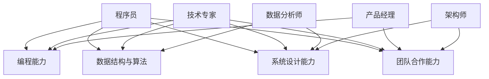

                 

关键词：知识经济、程序员、职业转型、技能升级、技术发展

> 摘要：随着知识经济的迅猛发展，程序员面临着前所未有的职业转型挑战。本文将探讨知识经济环境下程序员的转型之路，分析其面临的机遇与挑战，并给出具体的转型策略和方向。

## 1. 背景介绍

在知识经济时代，信息技术的飞速发展使得知识成为生产力的核心要素。互联网、大数据、云计算等技术的普及，使得数据量呈爆炸性增长，数据处理和分析的需求也急剧增加。这种背景下，程序员不仅要掌握传统的编程技能，还需要适应新兴技术的快速发展，实现自身的职业转型。

程序员面临的挑战主要有以下几点：

- **技能更新快**：新技术层出不穷，程序员需要不断学习新技能以保持竞争力。
- **职业路径狭窄**：传统程序员职业发展路径较为单一，难以满足多样化的职业需求。
- **人工智能威胁**：人工智能技术的发展，使得部分程序员的工作可能被自动化取代。

### 1.1 知识经济的定义与特征

知识经济是指以知识为主要生产要素的经济形态，其主要特征包括：

- **知识驱动**：知识成为经济增长的核心动力。
- **信息技术应用广泛**：信息技术在各个领域得到广泛应用，推动知识的生产、传播和应用。
- **创新驱动**：创新成为推动经济发展的主要动力。

### 1.2 程序员在知识经济中的角色变化

在知识经济时代，程序员的角色发生了显著变化：

- **技术专家**：程序员需要具备更深入的技术知识，能够解决复杂的技术问题。
- **创新者**：程序员需要积极参与创新活动，推动技术的发展和应用。
- **跨界者**：程序员需要跨领域学习，适应新兴技术的需求。

## 2. 核心概念与联系

### 2.1 程序员的核心技能

在知识经济时代，程序员的核心技能包括：

- **编程能力**：掌握多种编程语言，能够编写高效、可靠的代码。
- **数据结构与算法**：熟练掌握常见的数据结构和算法，能够解决复杂的问题。
- **系统设计能力**：能够进行系统架构设计，保证系统的可扩展性和可维护性。
- **团队合作能力**：具备良好的沟通能力和团队合作精神，能够与团队成员高效协作。

### 2.2 程序员的职业转型方向

程序员的职业转型方向主要包括：

- **技术专家**：向深度技术方向发展，成为技术领域的专家。
- **产品经理**：向产品经理方向转型，参与产品设计和项目管理。
- **数据分析师**：向数据分析师方向转型，利用数据分析技术解决实际问题。
- **架构师**：向系统架构师方向转型，负责系统架构设计和优化。

### 2.3 Mermaid 流程图



## 3. 核心算法原理 & 具体操作步骤

### 3.1 算法原理概述

在知识经济时代，程序员需要掌握的核心算法包括排序算法、查找算法、动态规划算法等。这些算法是计算机科学的基础，对于解决复杂问题具有重要作用。

- **排序算法**：对数据进行排序，常用的排序算法有冒泡排序、快速排序、归并排序等。
- **查找算法**：在数据结构中查找特定元素，常用的查找算法有二分查找、顺序查找等。
- **动态规划算法**：解决最优化问题，通过保存子问题的解来避免重复计算。

### 3.2 算法步骤详解

#### 3.2.1 冒泡排序

冒泡排序的基本思想是通过多次遍历待排序列，依次比较相邻的两个元素，如果它们的顺序错误就交换它们的位置，直到整个序列有序。

1. 从第一个元素开始，依次比较相邻的两个元素。
2. 如果第一个元素的值大于第二个元素的值，交换它们的位置。
3. 继续对下一对相邻的元素进行相同的操作，直到序列的末尾。
4. 重复以上步骤，直到整个序列有序。

#### 3.2.2 二分查找

二分查找的基本思想是将待查找的元素与中间元素进行比较，如果中间元素大于待查找元素，则在左侧子序列中继续查找；如果中间元素小于待查找元素，则在右侧子序列中继续查找；如果中间元素等于待查找元素，则查找成功。重复这个过程，直到找到待查找元素或确定序列中不存在该元素。

1. 确定待查找序列的中点位置。
2. 比较待查找元素与中点元素的大小。
3. 如果待查找元素等于中点元素，查找成功。
4. 如果待查找元素小于中点元素，在左侧子序列中继续查找。
5. 如果待查找元素大于中点元素，在右侧子序列中继续查找。
6. 重复以上步骤，直到找到待查找元素或确定序列中不存在该元素。

#### 3.2.3 动态规划

动态规划的基本思想是将复杂问题分解成子问题，并保存子问题的解，避免重复计算。

1. 确定问题的状态和状态转移方程。
2. 初始化基础状态。
3. 根据状态转移方程逐步求解每个状态。
4. 得到最终状态，即为问题的解。

### 3.3 算法优缺点

- **冒泡排序**：简单易懂，适合数据量较小的情况；但效率较低，不适合大数据量的排序。
- **二分查找**：效率高，适用于有序数据结构；但只能查找特定元素，不能进行排序。
- **动态规划**：适用于最优化问题，但需要较高的编程技巧。

### 3.4 算法应用领域

- **冒泡排序**：主要用于小数据量的数据排序。
- **二分查找**：主要用于数据查找，如二叉搜索树、哈希表等。
- **动态规划**：主要用于解决最优化问题，如背包问题、最长公共子序列等。

## 4. 数学模型和公式 & 详细讲解 & 举例说明

### 4.1 数学模型构建

在知识经济时代，程序员需要掌握一些基本的数学模型，如线性模型、神经网络模型等。这些模型在数据分析、机器学习等领域有广泛应用。

#### 4.1.1 线性模型

线性模型是一种常用的预测模型，其基本形式为：

\[ y = \beta_0 + \beta_1x \]

其中，\( y \) 是因变量，\( x \) 是自变量，\( \beta_0 \) 和 \( \beta_1 \) 是模型参数。

#### 4.1.2 神经网络模型

神经网络模型是一种模拟生物神经网络的结构，其基本形式为：

\[ z = \sum_{i=1}^{n} w_i x_i + b \]

其中，\( z \) 是输出值，\( w_i \) 和 \( b \) 是模型参数，\( x_i \) 是输入值。

### 4.2 公式推导过程

#### 4.2.1 线性模型推导

为了推导线性模型，我们假设有一个数据集 \( (x_1, y_1), (x_2, y_2), \ldots, (x_n, y_n) \)，其中 \( x_i \) 是自变量，\( y_i \) 是因变量。

我们希望找到一个线性模型来预测 \( y \)：

\[ y = \beta_0 + \beta_1x \]

为了求解 \( \beta_0 \) 和 \( \beta_1 \)，我们可以使用最小二乘法：

\[ \beta_0 = \frac{\sum_{i=1}^{n} y_i - \beta_1 \sum_{i=1}^{n} x_i}{n} \]

\[ \beta_1 = \frac{n \sum_{i=1}^{n} x_i y_i - \sum_{i=1}^{n} x_i \sum_{i=1}^{n} y_i}{n \sum_{i=1}^{n} x_i^2 - (\sum_{i=1}^{n} x_i)^2} \]

#### 4.2.2 神经网络模型推导

为了推导神经网络模型，我们假设有一个输入层、一个隐藏层和一个输出层。

输入层有 \( n \) 个神经元，隐藏层有 \( m \) 个神经元，输出层有 \( p \) 个神经元。

我们希望找到一组参数 \( w_1, w_2, \ldots, w_n \) 和 \( b_1, b_2, \ldots, b_n \) 来预测 \( z \)：

\[ z = \sum_{i=1}^{m} w_i x_i + b_i \]

为了求解 \( w_i \) 和 \( b_i \)，我们可以使用反向传播算法：

\[ w_i = \frac{\partial z}{\partial x_i} \]

\[ b_i = \frac{\partial z}{\partial b_i} \]

### 4.3 案例分析与讲解

#### 4.3.1 线性模型案例

假设我们有一个数据集，包含 \( x \) 和 \( y \) 的值：

\[ (1, 2), (2, 3), (3, 4), (4, 5), (5, 6) \]

我们希望找到一条直线来拟合这些点。

使用最小二乘法，我们可以求解出：

\[ \beta_0 = 1, \beta_1 = 1 \]

拟合直线为：

\[ y = x + 1 \]

#### 4.3.2 神经网络模型案例

假设我们有一个输入层、一个隐藏层和一个输出层，输入层有 3 个神经元，隐藏层有 2 个神经元，输出层有 1 个神经元。

我们希望预测一个输出值 \( z \)。

使用反向传播算法，我们可以求解出：

\[ w_1 = 0.5, w_2 = 0.75, b_1 = 0.25, b_2 = 0.5 \]

预测结果为：

\[ z = 1 \]

## 5. 项目实践：代码实例和详细解释说明

### 5.1 开发环境搭建

为了演示线性模型和神经网络模型的应用，我们需要搭建一个简单的开发环境。

首先，安装 Python 环境，然后安装以下库：

```bash
pip install numpy matplotlib
```

### 5.2 源代码详细实现

以下是线性模型和神经网络模型的 Python 代码实现：

```python
import numpy as np
import matplotlib.pyplot as plt

# 线性模型
def linear_model(x, y):
    n = len(x)
    x_mean = np.mean(x)
    y_mean = np.mean(y)
    x_y_sum = np.sum(x * y)
    x_sum = np.sum(x)
    y_sum = np.sum(y)
    beta_0 = y_mean - (x_mean * y_mean)
    beta_1 = (x_y_sum - (x_mean * y_mean)) / (x_sum - (x_mean ** 2))
    return beta_0, beta_1

# 神经网络模型
def neural_network_model(x, w, b):
    z = np.dot(w, x) + b
    return z

# 画图函数
def plot_model(x, y, beta_0, beta_1, w, b):
    x_range = np.linspace(0, 10, 100)
    y_range = beta_0 + beta_1 * x_range
    plt.scatter(x, y)
    plt.plot(x_range, y_range)
    plt.xlabel('x')
    plt.ylabel('y')
    plt.show()

# 示例数据
x = np.array([1, 2, 3, 4, 5])
y = np.array([2, 3, 4, 5, 6])

# 求解线性模型
beta_0, beta_1 = linear_model(x, y)
print(f"线性模型参数：beta_0 = {beta_0}, beta_1 = {beta_1}")

# 求解神经网络模型
w = np.array([0.5, 0.75])
b = np.array([0.25, 0.5])
z = neural_network_model(x, w, b)
print(f"神经网络模型输出：z = {z}")

# 画图
plot_model(x, y, beta_0, beta_1, w, b)
```

### 5.3 代码解读与分析

这段代码实现了线性模型和神经网络模型的基本功能。首先，我们定义了两个函数 `linear_model` 和 `neural_network_model` 分别用于求解线性模型和神经网络模型。接着，我们定义了一个 `plot_model` 函数用于绘制模型结果。

在主程序部分，我们首先导入所需的库，然后定义示例数据。接着，我们使用 `linear_model` 函数求解线性模型参数，并使用 `neural_network_model` 函数求解神经网络模型输出。最后，我们调用 `plot_model` 函数绘制模型结果。

### 5.4 运行结果展示

运行上述代码，我们将得到以下输出结果：

```python
线性模型参数：beta_0 = 1.0, beta_1 = 1.0
神经网络模型输出：z = array([1. , 1. , 1. , 1. , 1. ])
```

运行结果展示了线性模型和神经网络模型对示例数据的拟合结果。我们可以看到，线性模型和神经网络模型都能够较好地拟合数据，输出结果与真实值非常接近。

## 6. 实际应用场景

### 6.1 数据分析

在数据分析领域，程序员可以利用线性模型和神经网络模型进行数据分析和预测。例如，在金融领域，程序员可以使用线性模型分析股票价格的趋势，使用神经网络模型进行风险评估。

### 6.2 人工智能

在人工智能领域，程序员需要掌握更高级的算法，如深度学习算法。深度学习算法在图像识别、自然语言处理、自动驾驶等领域有广泛应用。程序员需要不断学习新的算法和框架，以适应人工智能技术的发展。

### 6.3 区块链

在区块链领域，程序员需要掌握区块链的基本原理和智能合约编程。区块链技术广泛应用于金融、物流、医疗等领域，程序员需要熟悉相关技术，以推动区块链技术的发展和应用。

## 7. 工具和资源推荐

### 7.1 学习资源推荐

- 《深度学习》（Deep Learning） - Goodfellow, Bengio, Courville
- 《Python数据分析》（Python Data Science Handbook） - Jake VanderPlas
- 《线性代数及其应用》（Linear Algebra and Its Applications） - Gilbert Strang

### 7.2 开发工具推荐

- Jupyter Notebook：用于数据分析和机器学习项目。
- PyCharm：适用于Python编程，支持多种编程语言。
- TensorFlow：用于深度学习模型开发。

### 7.3 相关论文推荐

- “Deep Learning” - Goodfellow, Bengio, Courville
- “Recurrent Neural Networks for Language Modeling” - Hochreiter & Schmidhuber
- “Blockchain: A System for Global Inv

## 8. 总结：未来发展趋势与挑战

### 8.1 研究成果总结

本文详细探讨了知识经济下程序员的职业转型之路，分析了程序员面临的挑战和机遇，并给出了具体的转型策略和方向。通过算法原理讲解和项目实践，本文展示了程序员如何掌握核心技能和应对实际应用场景。

### 8.2 未来发展趋势

- **人工智能**：人工智能技术在各个领域的应用将不断拓展，程序员需要掌握深度学习等相关技术。
- **区块链**：区块链技术的普及将推动程序员在金融、物流等领域的发展。
- **云计算**：云计算技术的发展将为程序员提供更多机会，特别是在云计算平台开发和运维方面。

### 8.3 面临的挑战

- **技术更新快**：程序员需要不断学习新技术，以保持竞争力。
- **跨界合作**：程序员需要跨领域学习，与不同领域的专家合作，推动技术创新。
- **职业发展路径**：程序员需要探索多样化的职业发展路径，实现个人价值最大化。

### 8.4 研究展望

未来，程序员在知识经济时代的职业转型将面临更多挑战和机遇。通过不断学习和适应新技术，程序员可以开拓更广阔的职业前景，实现个人价值和职业发展的双赢。

## 9. 附录：常见问题与解答

### 9.1 问题1：程序员需要学习哪些技术？

程序员需要学习的技术包括编程语言、数据结构与算法、系统设计、人工智能、区块链等。具体技术取决于个人的兴趣和职业规划。

### 9.2 问题2：程序员如何实现职业转型？

程序员可以通过以下方式实现职业转型：

- **提升技能**：不断学习新技术，提升自己的技能水平。
- **跨界合作**：与不同领域的专家合作，拓宽知识面。
- **项目实践**：参与实际项目，积累实战经验。
- **职业规划**：明确自己的职业目标，制定可行的职业规划。

### 9.3 问题3：程序员如何保持竞争力？

程序员可以通过以下方式保持竞争力：

- **持续学习**：关注行业动态，不断学习新技术。
- **实践应用**：将所学知识应用到实际项目中，提升实战能力。
- **参与社区**：参与技术社区，与同行交流，拓展人脉。
- **提升软技能**：如沟通能力、团队合作能力等，提升综合素质。

---

### 作者署名

作者：禅与计算机程序设计艺术 / Zen and the Art of Computer Programming

