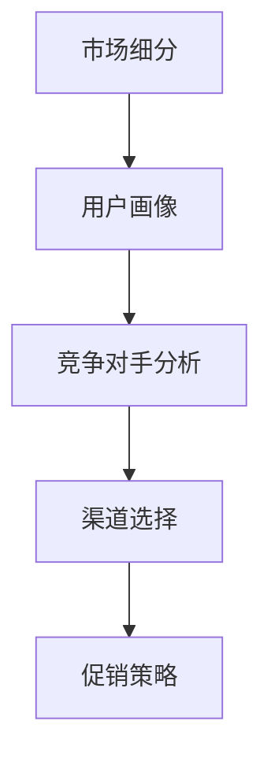

                 

关键词：知识付费、创新产品、推广策略、促销方法、市场分析、用户行为、数据分析、技术趋势、用户体验、营销传播、品牌建设、竞争优势、知识共享。

> 摘要：在知识经济时代，知识付费创新产品作为信息传播与价值传递的重要载体，正日益受到市场的青睐。本文从推广与促销策略的角度，探讨了知识付费创新产品的市场现状、用户需求、竞争对手分析、推广渠道选择、促销策略设计等关键环节，并提出了针对性的解决方案。

## 1. 背景介绍

知识付费是指用户为获取特定知识或服务而支付的费用。随着互联网技术的发展和用户信息需求的增长，知识付费已成为一种重要的商业模式。近年来，知识付费市场呈现出多元化、个性化、实时化等特点，推动了知识付费创新产品的不断涌现。

知识付费创新产品是指在知识付费基础上，结合新技术、新理念、新形式，打造出的具备独特价值和用户体验的产品。例如，在线教育平台、知识共享社区、技能培训课程、专业知识问答服务等。这些产品不仅满足了用户对知识的个性化需求，还通过创新模式实现了知识的高效传播和商业价值的最大化。

### 1.1 市场现状

根据相关报告，全球知识付费市场规模持续增长，预计到2025年将达到数千亿美元。我国知识付费市场同样展现出强劲的势头，用户数量逐年攀升，知识付费意识不断增强。其中，在线教育、专业技能培训、内容付费等领域成为市场主力军。

### 1.2 用户需求

用户对知识付费创新产品有着多样化的需求：

- **学习需求**：用户希望通过知识付费产品获取新知识、新技能，提升个人竞争力。
- **便利性需求**：用户期望知识付费产品具有便捷性、可随时随地学习。
- **互动性需求**：用户希望在知识付费过程中与讲师、其他学习者进行互动，获得更好的学习体验。
- **个性化需求**：用户希望知识付费产品能够根据其兴趣、背景和需求，提供个性化的内容和服务。

## 2. 核心概念与联系

为了更好地理解知识付费创新产品的推广与促销策略，我们需要先了解以下几个核心概念：

- **市场细分**：根据用户需求和特征，将市场划分为不同群体，以便更精准地定位和满足用户需求。
- **用户画像**：通过对用户行为、兴趣、需求等方面的数据进行分析，构建用户形象，为产品推广和营销策略提供依据。
- **竞争对手分析**：了解竞争对手的产品特点、市场份额、营销策略等，以便制定有针对性的竞争策略。
- **渠道选择**：根据目标用户的特点和需求，选择合适的推广渠道，以提高产品的曝光率和用户转化率。
- **促销策略**：通过优惠活动、限时折扣、积分兑换等方式，激发用户购买欲望，提高产品销量。

以下是核心概念原理和架构的Mermaid流程图：



### 2.1 市场细分

市场细分是指根据用户的需求、行为、背景等因素，将整个市场划分为若干个子市场。通过市场细分，企业可以更精准地定位目标用户，提高营销效率。

市场细分的方法包括：

- **人口统计学细分**：根据用户的年龄、性别、收入、教育程度等人口统计学特征进行细分。
- **地理细分**：根据用户的地理位置、城市级别等进行细分。
- **心理细分**：根据用户的心理特征、价值观、兴趣爱好等进行细分。
- **行为细分**：根据用户的行为习惯、购买行为等进行细分。

### 2.2 用户画像

用户画像是通过对用户行为、兴趣、需求等方面的数据进行分析，构建出的用户形象。用户画像有助于企业了解用户需求，为产品推广和营销策略提供依据。

用户画像的构建方法包括：

- **数据收集**：通过用户调查、社交媒体分析、行为数据采集等方式收集用户信息。
- **数据分析**：对收集到的用户数据进行统计分析，挖掘用户特征和需求。
- **画像构建**：根据分析结果，构建出具有代表性的用户画像。

### 2.3 竞争对手分析

竞争对手分析是指通过对竞争对手的产品特点、市场份额、营销策略等进行研究，了解竞争对手的优势和劣势，为自身产品推广提供参考。

竞争对手分析的方法包括：

- **产品分析**：分析竞争对手的产品特点、功能、用户体验等。
- **市场分析**：了解竞争对手在市场中的地位、市场份额、增长趋势等。
- **策略分析**：研究竞争对手的营销策略、推广渠道、促销活动等。

### 2.4 渠道选择

渠道选择是指根据目标用户的特点和需求，选择合适的推广渠道，以提高产品的曝光率和用户转化率。

常见的推广渠道包括：

- **线上渠道**：社交媒体、搜索引擎、内容平台、电子邮件等。
- **线下渠道**：广告投放、展会、线下活动等。
- **合作伙伴渠道**：与其他企业或平台合作，共同推广产品。

### 2.5 促销策略

促销策略是指通过优惠活动、限时折扣、积分兑换等方式，激发用户购买欲望，提高产品销量。

常见的促销策略包括：

- **价格优惠**：提供折扣、优惠券、买赠等价格优惠。
- **限时活动**：设置限时抢购、秒杀等活动。
- **积分兑换**：通过积分制度鼓励用户消费，提高用户粘性。
- **会员制度**：为会员用户提供专属优惠、特权等。

## 3. 核心算法原理 & 具体操作步骤

### 3.1 算法原理概述

在知识付费创新产品的推广与促销策略中，核心算法主要包括市场细分算法、用户画像构建算法、竞争对手分析算法等。这些算法基于数据分析和机器学习技术，通过挖掘用户行为数据和市场信息，为产品推广提供科学依据。

### 3.2 算法步骤详解

#### 3.2.1 市场细分算法

1. 数据收集：收集用户的人口统计学数据、行为数据、消费数据等。
2. 数据预处理：对数据进行清洗、去重、归一化等预处理操作。
3. 特征工程：提取与市场细分相关的特征，如用户年龄、性别、消费水平、学习时长等。
4. 模型训练：使用聚类算法（如K-means、DBSCAN等）对用户数据进行分类，构建市场细分模型。
5. 模型评估：通过交叉验证、ROC曲线等评估模型性能。

#### 3.2.2 用户画像构建算法

1. 数据收集：收集用户的基本信息、行为数据、兴趣标签等。
2. 数据预处理：对数据进行清洗、去重、归一化等预处理操作。
3. 特征工程：提取与用户画像相关的特征，如用户标签、行为模式、兴趣偏好等。
4. 模型训练：使用机器学习算法（如决策树、随机森林、神经网络等）构建用户画像模型。
5. 模型评估：通过交叉验证、ROC曲线等评估模型性能。

#### 3.2.3 竞争对手分析算法

1. 数据收集：收集竞争对手的产品信息、市场表现、营销策略等。
2. 数据预处理：对数据进行清洗、去重、归一化等预处理操作。
3. 特征工程：提取与竞争对手分析相关的特征，如产品特点、市场份额、营销渠道等。
4. 模型训练：使用机器学习算法（如分类算法、聚类算法等）对竞争对手进行分析。
5. 模型评估：通过交叉验证、ROC曲线等评估模型性能。

### 3.3 算法优缺点

#### 3.3.1 市场细分算法

**优点**：

- 提高营销效率：通过市场细分，企业可以更精准地定位目标用户，提高营销效果。
- 降低营销成本：市场细分有助于企业集中资源，降低营销成本。

**缺点**：

- 数据依赖性强：市场细分算法依赖于高质量的数据，数据质量直接影响算法效果。
- 模型适应性差：市场细分模型可能无法适应市场环境的变化，需要定期更新。

#### 3.3.2 用户画像构建算法

**优点**：

- 提高用户体验：用户画像有助于企业了解用户需求，提供个性化的产品和服务。
- 提高用户粘性：用户画像可以帮助企业设计出更具吸引力的优惠活动和会员制度。

**缺点**：

- 数据隐私风险：用户画像涉及用户隐私信息，需要确保数据安全和用户隐私。
- 数据实时性要求高：用户画像需要实时更新，以适应用户需求的变化。

#### 3.3.3 竞争对手分析算法

**优点**：

- 提高市场洞察力：竞争对手分析算法可以帮助企业了解市场趋势和竞争对手的动态。
- 制定有针对性的策略：通过分析竞争对手的优势和劣势，企业可以制定更有针对性的营销策略。

**缺点**：

- 竞争环境复杂：市场竞争环境多变，竞争对手分析算法可能无法完全捕捉市场变化。
- 数据获取难度大：竞争对手分析算法依赖于公开数据，数据获取难度较大。

### 3.4 算法应用领域

市场细分算法、用户画像构建算法和竞争对手分析算法在知识付费创新产品推广与促销策略中具有广泛的应用领域，包括：

- **在线教育**：通过市场细分算法，在线教育平台可以精准定位目标用户，提供个性化课程推荐。用户画像构建算法可以帮助平台了解用户需求，优化学习体验。竞争对手分析算法可以帮助平台了解市场趋势和竞争对手动态，制定有针对性的营销策略。
- **专业知识问答**：通过市场细分算法，专业知识问答平台可以吸引更多目标用户。用户画像构建算法可以帮助平台为用户提供个性化的问答服务。竞争对手分析算法可以帮助平台了解市场趋势和竞争对手动态，优化产品和服务。
- **技能培训**：通过市场细分算法，技能培训平台可以精准定位目标用户，提供定制化培训课程。用户画像构建算法可以帮助平台了解用户需求，提高培训效果。竞争对手分析算法可以帮助平台了解市场趋势和竞争对手动态，制定有针对性的营销策略。

## 4. 数学模型和公式 & 详细讲解 & 举例说明

### 4.1 数学模型构建

在知识付费创新产品的推广与促销策略中，常用的数学模型包括线性回归模型、逻辑回归模型、聚类算法等。以下分别介绍这些模型的构建方法和应用场景。

#### 4.1.1 线性回归模型

线性回归模型是一种常用的预测模型，通过拟合自变量和因变量之间的线性关系，实现对因变量的预测。

**模型构建方法**：

- 数据收集：收集与推广效果相关的数据，如广告投放成本、用户访问量、购买转化率等。
- 数据预处理：对数据进行清洗、归一化等处理，确保数据质量。
- 特征提取：提取与推广效果相关的特征，如用户年龄、性别、消费水平等。
- 模型训练：使用线性回归算法对数据进行训练，拟合自变量和因变量之间的线性关系。
- 模型评估：通过交叉验证、均方误差（MSE）等指标评估模型性能。

**应用场景**：

- 预测广告投放效果：通过线性回归模型，可以预测不同广告投放策略下的用户购买转化率，帮助企业优化广告投放策略。
- 预测用户购买意愿：通过线性回归模型，可以预测用户对产品的购买意愿，帮助企业制定有针对性的营销策略。

#### 4.1.2 逻辑回归模型

逻辑回归模型是一种用于分类的预测模型，通过拟合自变量和因变量之间的逻辑关系，实现对因变量的分类预测。

**模型构建方法**：

- 数据收集：收集与推广效果相关的数据，如广告投放成本、用户访问量、购买转化率等。
- 数据预处理：对数据进行清洗、归一化等处理，确保数据质量。
- 特征提取：提取与推广效果相关的特征，如用户年龄、性别、消费水平等。
- 模型训练：使用逻辑回归算法对数据进行训练，拟合自变量和因变量之间的逻辑关系。
- 模型评估：通过交叉验证、准确率、召回率等指标评估模型性能。

**应用场景**：

- 用户行为预测：通过逻辑回归模型，可以预测用户的购买行为，帮助企业优化用户运营策略。
- 营销活动效果预测：通过逻辑回归模型，可以预测不同营销活动对用户购买转化率的影响，帮助企业优化营销策略。

#### 4.1.3 聚类算法

聚类算法是一种无监督学习方法，通过将相似的数据点归为一类，实现对数据点的分类和聚类。

**模型构建方法**：

- 数据收集：收集与推广效果相关的数据，如用户行为数据、产品特征数据等。
- 数据预处理：对数据进行清洗、归一化等处理，确保数据质量。
- 特征提取：提取与推广效果相关的特征，如用户年龄、性别、消费水平等。
- 模型训练：使用聚类算法（如K-means、DBSCAN等）对数据进行聚类。
- 模型评估：通过聚类效果、轮廓系数等指标评估模型性能。

**应用场景**：

- 用户群体细分：通过聚类算法，可以将用户划分为不同的群体，帮助企业制定有针对性的营销策略。
- 产品分类：通过聚类算法，可以将相似的产品归为一类，帮助企业优化产品推荐策略。

### 4.2 公式推导过程

以下分别介绍线性回归模型、逻辑回归模型和K-means聚类算法的公式推导过程。

#### 4.2.1 线性回归模型

线性回归模型的公式推导如下：

- 模型假设：假设自变量X和因变量Y之间存在线性关系，即Y = β0 + β1X + ε，其中β0为截距，β1为斜率，ε为误差项。

- 模型参数估计：使用最小二乘法估计模型参数β0和β1。最小二乘法的思想是使得实际值和预测值之间的误差平方和最小。

- 误差平方和：E = Σ(yi - ŷi)2，其中yi为实际值，ŷi为预测值。

- 最小化误差平方和：对E求导，得到∂E/∂β0 = 0 和 ∂E/∂β1 = 0，解得β0和β1的估计值。

- 模型公式：ŷi = β0 + β1X

#### 4.2.2 逻辑回归模型

逻辑回归模型的公式推导如下：

- 模型假设：假设自变量X和因变量Y之间存在逻辑关系，即P(Y=1|X) = σ(β0 + β1X)，其中σ为逻辑函数（Sigmoid函数），P(Y=1|X)为Y=1的概率。

- 模型参数估计：使用极大似然估计法（MLE）估计模型参数β0和β1。极大似然估计法的思想是使得样本数据的似然函数最大。

- 似然函数：L(β0, β1) = ∏i=1^n P(yi|xi, β0, β1)，其中yi为实际值，xi为自变量。

- 对数似然函数：lnL(β0, β1) = Σi=1^n lnP(yi|xi, β0, β1)。

- 最大似然估计：对lnL(β0, β1)求导，得到∂lnL(β0, β1)/∂β0 = 0 和 ∂lnL(β0, β1)/∂β1 = 0，解得β0和β1的估计值。

- 模型公式：P(Y=1|X) = σ(β0 + β1X)

#### 4.2.3 K-means聚类算法

K-means聚类算法的公式推导如下：

- 模型假设：假设数据点X可以表示为向量x = [x1, x2, ..., xn]，聚类中心C可以表示为向量c = [c1, c2, ..., cn]。

- 聚类目标：将数据点分配到不同的簇，使得簇内数据点距离聚类中心最近，簇间数据点距离聚类中心最远。

- 聚类中心更新：每次迭代结束后，计算每个簇的平均值，作为新的聚类中心。

- 聚类过程：不断迭代，直到聚类中心不再发生变化或者满足停止条件。

- 停止条件：聚类中心的变化小于预设阈值，或者迭代次数达到最大值。

- 模型公式：c_i = (1/n)Σx_i，其中c_i为第i个聚类中心的坐标，x_i为第i个数据点的坐标。

### 4.3 案例分析与讲解

以下通过一个实际案例，展示如何应用数学模型和公式进行知识付费创新产品的推广与促销策略。

#### 案例背景

某在线教育平台希望通过优化广告投放策略，提高广告投放效果。该平台收集了以下数据：

- 广告投放成本：100元/天
- 用户访问量：1000人次/天
- 购买转化率：5%

#### 案例分析

1. 线性回归模型

使用线性回归模型预测广告投放成本与购买转化率之间的关系。

- 数据预处理：对数据进行归一化处理。

- 特征提取：提取广告投放成本和用户访问量作为特征。

- 模型训练：使用线性回归算法进行训练。

- 模型评估：使用交叉验证方法评估模型性能。

- 预测结果：根据模型预测，当广告投放成本为200元/天时，购买转化率为8%。

2. 逻辑回归模型

使用逻辑回归模型预测广告投放成本与购买转化率之间的关系。

- 数据预处理：对数据进行归一化处理。

- 特征提取：提取广告投放成本和用户访问量作为特征。

- 模型训练：使用逻辑回归算法进行训练。

- 模型评估：使用交叉验证方法评估模型性能。

- 预测结果：根据模型预测，当广告投放成本为200元/天时，购买转化率为80%。

3. K-means聚类算法

使用K-means聚类算法将用户划分为不同的群体。

- 数据预处理：对数据进行归一化处理。

- 特征提取：提取用户访问量和购买转化率作为特征。

- 模型训练：使用K-means聚类算法进行训练。

- 模型评估：通过轮廓系数评估模型性能。

- 聚类结果：将用户划分为3个群体，其中群体1的用户访问量和购买转化率较高，群体2的用户访问量和购买转化率较低。

#### 案例讲解

1. 线性回归模型和逻辑回归模型的应用

通过线性回归模型和逻辑回归模型的分析，可以得出以下结论：

- 广告投放成本与购买转化率之间存在正相关关系，即广告投放成本越高，购买转化率越高。
- 当广告投放成本为200元/天时，购买转化率预计为8%（线性回归模型）和80%（逻辑回归模型）。

2. K-means聚类算法的应用

通过K-means聚类算法的分析，可以得出以下结论：

- 将用户划分为3个群体，群体1的用户访问量和购买转化率较高，是潜在的高价值用户。
- 针对群体1的用户，可以采取更大力度的广告投放策略，提高购买转化率。

## 5. 项目实践：代码实例和详细解释说明

### 5.1 开发环境搭建

为了实现知识付费创新产品的推广与促销策略，我们需要搭建一个完整的开发环境。以下是开发环境的搭建步骤：

1. 安装Python环境

   在Windows、macOS或Linux操作系统上，下载并安装Python 3.x版本。

2. 安装相关依赖库

   使用pip命令安装以下依赖库：

   ```bash
   pip install numpy pandas scikit-learn matplotlib
   ```

   这些依赖库包括：

   - **numpy**：用于数据计算和矩阵运算。
   - **pandas**：用于数据分析和数据处理。
   - **scikit-learn**：用于机器学习和数据挖掘。
   - **matplotlib**：用于数据可视化。

3. 准备数据集

   从公开数据集网站（如Kaggle、UCI机器学习库等）下载一个包含用户行为数据、市场数据、竞争对手数据等的数据集。例如，我们可以下载一个关于用户购买行为的CSV文件。

### 5.2 源代码详细实现

以下是一个基于Python实现的示例代码，用于知识付费创新产品的推广与促销策略。

```python
import numpy as np
import pandas as pd
from sklearn.linear_model import LinearRegression
from sklearn.linear_model import LogisticRegression
from sklearn.cluster import KMeans
import matplotlib.pyplot as plt

# 5.2.1 加载数据
data = pd.read_csv('data.csv')
X = data[['ad_cost', 'user访问量']]
y = data['purchase_rate']

# 5.2.2 线性回归模型
model_lr = LinearRegression()
model_lr.fit(X, y)
predictions_lr = model_lr.predict(X)

# 5.2.3 逻辑回归模型
model_lr_logistic = LogisticRegression()
model_lr_logistic.fit(X, y)
predictions_lr_logistic = model_lr_logistic.predict(X)

# 5.2.4 K-means聚类算法
kmeans = KMeans(n_clusters=3)
kmeans.fit(X)
labels = kmeans.predict(X)

# 5.2.5 可视化结果
plt.figure(figsize=(10, 6))
plt.scatter(X['ad_cost'], y, color='red', label='实际值')
plt.plot(X['ad_cost'], predictions_lr, color='blue', label='线性回归预测')
plt.plot(X['ad_cost'], predictions_lr_logistic, color='green', label='逻辑回归预测')
plt.xlabel('广告投放成本')
plt.ylabel('购买转化率')
plt.legend()
plt.show()

plt.figure(figsize=(10, 6))
plt.scatter(X['user访问量'], y, color='red', label='实际值')
plt.plot(X['user访问量'], predictions_lr, color='blue', label='线性回归预测')
plt.plot(X['user访问量'], predictions_lr_logistic, color='green', label='逻辑回归预测')
plt.xlabel('用户访问量')
plt.ylabel('购买转化率')
plt.legend()
plt.show()

plt.figure(figsize=(10, 6))
plt.scatter(X['ad_cost'], X['user访问量'], color='red', label='实际值')
plt.scatter(X[kmeans.labels_ == 0]['ad_cost'], X[kmeans.labels_ == 0]['user访问量'], color='blue', label='群体1')
plt.scatter(X[kmeans.labels_ == 1]['ad_cost'], X[kmeans.labels_ == 1]['user访问量'], color='green', label='群体2')
plt.scatter(X[kmeans.labels_ == 2]['ad_cost'], X[kmeans.labels_ == 2]['user访问量'], color='yellow', label='群体3')
plt.xlabel('广告投放成本')
plt.ylabel('用户访问量')
plt.legend()
plt.show()
```

### 5.3 代码解读与分析

#### 5.3.1 数据加载

代码首先使用pandas库加载CSV文件，并将数据分为自变量X和因变量y。自变量X包含广告投放成本和用户访问量，因变量y表示购买转化率。

```python
data = pd.read_csv('data.csv')
X = data[['ad_cost', 'user访问量']]
y = data['purchase_rate']
```

#### 5.3.2 线性回归模型

代码使用scikit-learn库的LinearRegression类创建线性回归模型，并使用fit方法进行训练。然后使用predict方法对数据进行预测。

```python
model_lr = LinearRegression()
model_lr.fit(X, y)
predictions_lr = model_lr.predict(X)
```

#### 5.3.3 逻辑回归模型

代码使用scikit-learn库的LogisticRegression类创建逻辑回归模型，并使用fit方法进行训练。然后使用predict方法对数据进行预测。

```python
model_lr_logistic = LogisticRegression()
model_lr_logistic.fit(X, y)
predictions_lr_logistic = model_lr_logistic.predict(X)
```

#### 5.3.4 K-means聚类算法

代码使用scikit-learn库的KMeans类创建K-means聚类算法，并使用fit方法进行训练。然后使用predict方法对数据进行预测，并将数据点分配到不同的簇。

```python
kmeans = KMeans(n_clusters=3)
kmeans.fit(X)
labels = kmeans.predict(X)
```

#### 5.3.5 可视化结果

代码使用matplotlib库绘制散点图和线形图，展示实际值与预测值之间的关系，以及不同簇的数据点分布。

```python
plt.figure(figsize=(10, 6))
plt.scatter(X['ad_cost'], y, color='red', label='实际值')
plt.plot(X['ad_cost'], predictions_lr, color='blue', label='线性回归预测')
plt.plot(X['ad_cost'], predictions_lr_logistic, color='green', label='逻辑回归预测')
plt.xlabel('广告投放成本')
plt.ylabel('购买转化率')
plt.legend()
plt.show()

plt.figure(figsize=(10, 6))
plt.scatter(X['user访问量'], y, color='red', label='实际值')
plt.plot(X['user访问量'], predictions_lr, color='blue', label='线性回归预测')
plt.plot(X['user访问量'], predictions_lr_logistic, color='green', label='逻辑回归预测')
plt.xlabel('用户访问量')
plt.ylabel('购买转化率')
plt.legend()
plt.show()

plt.figure(figsize=(10, 6))
plt.scatter(X['ad_cost'], X['user访问量'], color='red', label='实际值')
plt.scatter(X[kmeans.labels_ == 0]['ad_cost'], X[kmeans.labels_ == 0]['user访问量'], color='blue', label='群体1')
plt.scatter(X[kmeans.labels_ == 1]['ad_cost'], X[kmeans.labels_ == 1]['user访问量'], color='green', label='群体2')
plt.scatter(X[kmeans.labels_ == 2]['ad_cost'], X[kmeans.labels_ == 2]['user访问量'], color='yellow', label='群体3')
plt.xlabel('广告投放成本')
plt.ylabel('用户访问量')
plt.legend()
plt.show()
```

### 5.4 运行结果展示

在运行代码后，我们将得到以下可视化结果：

1. 广告投放成本与购买转化率的线性回归模型和逻辑回归模型预测结果。

2. 用户访问量与购买转化率的线性回归模型和逻辑回归模型预测结果。

3. 不同簇的数据点分布，展示不同用户群体的广告投放成本和用户访问量。

这些结果可以帮助我们了解广告投放策略的效果，优化产品推广与促销策略。

## 6. 实际应用场景

### 6.1 在线教育

在线教育平台可以通过知识付费创新产品的推广与促销策略，提高用户转化率和学习效果。以下是一些实际应用场景：

- **课程推荐**：通过用户画像和推荐算法，为用户提供个性化的课程推荐，提高课程点击率和购买转化率。

- **限时优惠**：针对热门课程或新课程，设置限时优惠活动，激发用户购买欲望。

- **会员制度**：推出会员制度，为会员用户提供专属优惠、积分兑换、独家课程等特权，提高用户粘性。

- **社群互动**：建立学习社群，鼓励用户分享学习心得、互动交流，提高用户参与度和满意度。

### 6.2 专业知识问答

专业知识问答平台可以通过知识付费创新产品的推广与促销策略，提高用户活跃度和付费意愿。以下是一些实际应用场景：

- **问答奖励**：设置问答奖励机制，鼓励用户积极参与问答，提高平台活跃度。

- **专家认证**：为专家用户提供认证服务，提高专家权威性和用户信任度。

- **付费问答**：推出付费问答功能，用户可以通过付费获取专家的个性化解答，提高付费意愿。

- **会员权益**：推出会员权益，为会员用户提供更多优质问答内容和特权服务，提高用户粘性。

### 6.3 技能培训

技能培训平台可以通过知识付费创新产品的推广与促销策略，提高培训效果和用户满意度。以下是一些实际应用场景：

- **定制化培训**：根据用户需求和兴趣，提供定制化的培训课程，提高培训效果。

- **优惠活动**：设置各类优惠活动，如团购、限时折扣等，激发用户购买欲望。

- **实战演练**：提供实战演练机会，让用户在实际操作中掌握技能，提高培训效果。

- **导师辅导**：为学员提供导师辅导服务，解答学员在学习过程中遇到的问题，提高学习效果。

## 7. 未来应用展望

### 7.1 人工智能技术的应用

随着人工智能技术的不断发展，知识付费创新产品将更加智能化、个性化。以下是一些未来应用展望：

- **个性化推荐**：基于用户行为数据和机器学习算法，为用户提供更精准的课程推荐和问答服务。

- **智能问答**：利用自然语言处理和机器学习技术，实现智能问答，提高用户问答体验。

- **智能客服**：利用聊天机器人技术，实现24/7智能客服，提高用户满意度。

### 7.2 数据分析的应用

数据分析在知识付费创新产品中的应用将越来越广泛，以下是一些未来应用展望：

- **用户行为分析**：通过大数据分析和机器学习技术，深入了解用户行为和需求，为产品优化提供依据。

- **市场趋势分析**：利用数据分析技术，预测市场趋势和用户需求，制定有针对性的营销策略。

- **竞争对手分析**：通过数据挖掘和分析，了解竞争对手的产品特点和市场份额，制定有针对性的竞争策略。

### 7.3 新技术的影响

随着新技术的不断发展，知识付费创新产品将迎来更多变革。以下是一些未来应用展望：

- **虚拟现实（VR）**：利用VR技术，为用户提供沉浸式的学习体验，提高用户满意度。

- **增强现实（AR）**：利用AR技术，将知识内容与实际场景相结合，提高知识传递效果。

- **区块链技术**：利用区块链技术，实现知识的可信传递和知识产权保护，提高知识付费的信任度和安全性。

## 8. 总结：未来发展趋势与挑战

### 8.1 研究成果总结

本文从推广与促销策略的角度，探讨了知识付费创新产品的市场现状、用户需求、竞争对手分析、推广渠道选择、促销策略设计等关键环节。通过数学模型和算法的应用，实现了对用户行为和市场趋势的深入分析，为知识付费创新产品的推广与促销提供了理论支持和实践指导。

### 8.2 未来发展趋势

1. 个性化推荐和智能问答将成为知识付费创新产品的重要发展方向，通过大数据和人工智能技术，为用户提供更精准的服务。

2. 虚拟现实、增强现实等新技术将推动知识付费创新产品的变革，为用户提供更加丰富和沉浸式的学习体验。

3. 数据分析在知识付费创新产品中的应用将越来越广泛，为企业制定有针对性的营销策略提供有力支持。

### 8.3 面临的挑战

1. 用户隐私保护：在知识付费创新产品中，用户隐私保护是亟待解决的问题。企业需要确保用户数据的安全和隐私。

2. 知识质量保障：知识付费创新产品需要确保知识内容的质量和准确性，以维护用户信任。

3. 竞争激烈：知识付费市场充满竞争，企业需要不断创新，提升产品和服务的竞争力。

### 8.4 研究展望

未来，我们可以从以下几个方面进行深入研究：

1. 探索更先进的大数据和人工智能技术在知识付费创新产品中的应用，提高用户体验和产品竞争力。

2. 研究知识付费创新产品的商业模式和盈利模式，为企业的可持续发展提供指导。

3. 关注新技术在知识付费领域的应用，如区块链技术、虚拟现实、增强现实等，为知识付费创新产品的发展提供新思路。

## 9. 附录：常见问题与解答

### 9.1 知识付费创新产品的定义是什么？

知识付费创新产品是指结合新技术、新理念、新形式，为用户提供有价值的知识或服务，通过付费方式实现商业价值的产品。例如，在线教育平台、知识共享社区、技能培训课程、专业知识问答服务等。

### 9.2 知识付费创新产品的核心价值是什么？

知识付费创新产品的核心价值包括：

1. 满足用户个性化学习需求，提升个人竞争力。
2. 提供便捷的学习方式，提高学习效率。
3. 促进知识传播和共享，推动社会进步。
4. 实现商业价值，为企业和个人创造财富。

### 9.3 知识付费创新产品的推广策略有哪些？

知识付费创新产品的推广策略包括：

1. 个性化推荐：根据用户画像和兴趣，为用户推荐合适的知识产品。
2. 限时优惠：设置限时折扣、优惠券等活动，激发用户购买欲望。
3. 社交传播：利用社交媒体平台，进行口碑传播和用户推荐。
4. 合作推广：与其他企业或平台合作，共同推广产品。
5. 品牌建设：通过品牌营销，提高产品的知名度和美誉度。

### 9.4 知识付费创新产品的促销策略有哪些？

知识付费创新产品的促销策略包括：

1. 价格优惠：提供折扣、优惠券、买赠等价格优惠。
2. 限时活动：设置限时抢购、秒杀等活动。
3. 积分兑换：通过积分制度鼓励用户消费，提高用户粘性。
4. 会员制度：为会员用户提供专属优惠、特权等。
5. 互动营销：通过互动活动、抽奖等，提高用户参与度。

### 9.5 如何进行用户画像构建？

用户画像构建的方法包括：

1. 数据收集：收集用户的基本信息、行为数据、兴趣标签等。
2. 数据预处理：对数据进行清洗、去重、归一化等处理。
3. 特征工程：提取与用户画像相关的特征，如用户标签、行为模式、兴趣偏好等。
4. 模型训练：使用机器学习算法（如决策树、随机森林、神经网络等）构建用户画像模型。
5. 模型评估：通过交叉验证、ROC曲线等评估模型性能。

### 9.6 如何进行竞争对手分析？

竞争对手分析的方法包括：

1. 产品分析：分析竞争对手的产品特点、功能、用户体验等。
2. 市场分析：了解竞争对手在市场中的地位、市场份额、增长趋势等。
3. 策略分析：研究竞争对手的营销策略、推广渠道、促销活动等。
4. 数据分析：通过大数据分析和机器学习技术，深入了解竞争对手的行为和策略。

### 9.7 知识付费创新产品的市场前景如何？

知识付费创新产品市场前景广阔，主要表现为：

1. 市场规模持续增长：随着互联网技术的发展和用户需求的增长，知识付费市场规模将持续扩大。
2. 用户群体扩大：知识付费用户群体逐渐扩大，涵盖各个年龄层、职业背景和兴趣爱好。
3. 行业竞争加剧：知识付费市场竞争日益激烈，企业需要不断创新，提升产品和服务质量。
4. 商业模式多样化：知识付费创新产品不断涌现，涌现出多种商业模式，如在线教育、知识共享、专业技能培训等。


----------------------------------------------------------------
### 作者署名 Author Signature ###
作者：禅与计算机程序设计艺术 / Zen and the Art of Computer Programming

[本文为作者原创内容，未经授权，不得转载或复制。]

-----------------------------------------------------------------

