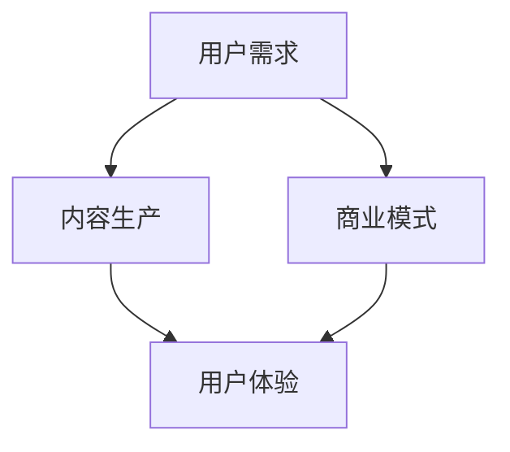
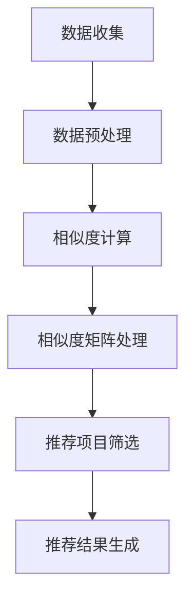

                 

 关键词：
- 知识经济
- 知识付费
- 商业模式
- 创新运营
- 用户体验
- 数据驱动

摘要：
本文探讨了知识经济时代下知识付费行业的现状及其面临的挑战，分析了现有商业模式的优缺点，并提出了创新的商业模式运营策略。通过结合用户体验和数据分析，本文为知识付费平台提供了可行的运营方案，旨在提高用户粘性和商业价值，推动知识付费行业的发展。

## 1. 背景介绍

随着互联网技术的飞速发展，知识付费逐渐成为知识经济时代的重要组成部分。知识付费，即用户为获取专业知识和信息而支付的费用，涵盖了在线教育、专业咨询、知识问答等多个领域。这一模式的出现，不仅满足了人们对高质量知识的渴求，也为内容创作者提供了新的盈利途径。

### 1.1 知识付费的发展历程

知识付费的概念最早可以追溯到20世纪末，当时主要是通过收费订阅或购买实体出版物来获取知识。随着互联网的普及，尤其是移动互联网的兴起，知识付费逐渐从线下转移到线上。早期，知识付费主要表现为在线课程和电子书籍的购买，随后逐渐扩展到直播授课、一对一咨询、知识问答等多种形式。

### 1.2 知识付费的市场现状

目前，知识付费市场呈现出快速增长的趋势。根据相关报告，全球知识付费市场规模逐年扩大，预计未来几年将继续保持高速增长。此外，用户对于知识付费的接受度也在提高，越来越多的用户愿意为高质量的知识内容付费。

### 1.3 知识付费面临的挑战

尽管知识付费市场前景广阔，但同时也面临着诸多挑战。首先，内容质量和用户体验成为用户关注的重点。其次，市场竞争激烈，同质化现象严重，平台需要不断创新以吸引和留住用户。此外，数据安全和隐私保护也是知识付费平台需要关注的问题。

## 2. 核心概念与联系

在探讨知识付费的创新商业模式之前，我们首先需要理解一些核心概念，如用户需求、内容生产、商业模式等，并分析它们之间的相互关系。

### 2.1 用户需求分析

用户需求是知识付费商业模式的基础。了解用户需求，包括他们的知识需求、学习习惯、支付意愿等，对于制定有效的运营策略至关重要。

#### 2.1.1 知识需求
用户的知识需求可以分为三个层次：基础知识、专业技能和高级知识。不同层次的需求决定了用户对知识内容的质量和深度的要求。

#### 2.1.2 学习习惯
用户的学习习惯包括自主学习、被动学习、互动学习等。这些习惯影响了用户对知识付费产品的接受度和使用频率。

#### 2.1.3 支付意愿
用户对知识付费的支付意愿受多个因素影响，如价格、品牌知名度、内容质量等。

### 2.2 内容生产

内容生产是知识付费的核心。优质的内容不仅能够满足用户需求，还能提高用户粘性和平台声誉。内容生产涉及课程设计、教学资源制作、互动环节设计等多个环节。

#### 2.2.1 课程设计
课程设计应充分考虑用户的知识需求和学习习惯，采用多样化的教学方式，提高课程吸引力。

#### 2.2.2 教学资源制作
教学资源包括文本、图片、视频、音频等多种形式，制作应注重质量，确保用户获得有价值的信息。

#### 2.2.3 互动环节设计
互动环节设计旨在提高用户参与度和学习效果，如在线讨论、作业提交、考试等。

### 2.3 商业模式分析

商业模式是知识付费平台盈利的途径。常见的商业模式包括广告收入、会员订阅、课程销售、咨询服务等。

#### 2.3.1 广告收入
广告收入是通过在平台上投放广告来获取收益。广告主一般为产品或服务提供商。

#### 2.3.2 会员订阅
会员订阅是指用户支付一定费用成为会员，享受平台提供的全部或部分服务。会员订阅是知识付费平台的重要收入来源。

#### 2.3.3 课程销售
课程销售是指用户购买平台提供的课程，课程类型包括在线课程、实体课程等。

#### 2.3.4 咨询服务
咨询服务是指平台为用户提供专业的咨询服务，如职业规划、法律咨询等。

### 2.4 用户需求、内容生产与商业模式的联系

用户需求、内容生产和商业模式三者之间相互影响、相互促进。用户需求决定了内容生产和商业模式的制定；内容生产的质量和种类影响了用户满意度和粘性；商业模式则为内容生产提供了盈利途径，同时吸引用户和内容创作者。

#### 2.4.1 用户需求与内容生产
用户需求驱动内容生产，内容生产满足用户需求。

#### 2.4.2 内容生产与商业模式
优质的内容生产有助于吸引更多用户，提高平台声誉，从而推动商业模式的创新和发展。

#### 2.4.3 商业模式与用户需求
合理的商业模式能够满足用户需求，提高用户体验，从而增强用户粘性。

### 2.5 Mermaid 流程图

下面是知识付费核心概念与联系关系的 Mermaid 流程图：



## 3. 核心算法原理 & 具体操作步骤

在知识付费运营中，算法的应用可以帮助平台更好地理解用户需求，提高内容推荐的质量和用户参与度。以下介绍一种基于协同过滤算法的内容推荐系统，并详细阐述其原理和操作步骤。

### 3.1 算法原理概述

协同过滤算法是一种常用的推荐算法，通过分析用户的行为数据，为用户推荐他们可能感兴趣的内容。协同过滤算法分为两种：基于用户的协同过滤和基于项目的协同过滤。

- **基于用户的协同过滤**：通过寻找与目标用户行为相似的活跃用户，推荐这些用户喜欢的内容。
- **基于项目的协同过滤**：通过寻找与目标用户曾经交互过的项目相似的其他项目，推荐给用户。

本文采用基于用户的协同过滤算法，其基本原理如下：

1. **用户行为数据收集**：收集用户在平台上的行为数据，如浏览记录、购买记录、互动行为等。
2. **相似度计算**：计算用户之间的相似度，常用的相似度计算方法有欧氏距离、余弦相似度等。
3. **推荐生成**：根据用户相似度矩阵，为用户推荐相似用户喜欢的项目。

### 3.2 算法步骤详解

#### 3.2.1 用户行为数据收集

1. **数据收集**：通过API接口或日志分析工具收集用户在平台上的行为数据，包括浏览记录、购买记录、互动行为等。
2. **数据预处理**：对收集到的数据去重、去噪，并进行数据清洗，如缺失值处理、异常值处理等。

#### 3.2.2 相似度计算

1. **相似度矩阵构建**：根据用户行为数据，构建用户相似度矩阵。用户相似度矩阵是一个N×N的矩阵，其中N为用户总数。
2. **相似度计算方法**：选择合适的相似度计算方法，如欧氏距离、余弦相似度等。

#### 3.2.3 推荐生成

1. **相似度矩阵处理**：对用户相似度矩阵进行处理，如归一化、阈值处理等。
2. **推荐项目筛选**：根据用户相似度矩阵，为每个用户筛选出相似度较高的其他用户，并将这些用户的喜欢项目作为推荐项目。
3. **推荐结果生成**：对推荐项目进行排序，生成最终的推荐结果。

### 3.3 算法优缺点

#### 优点：

- **个性化推荐**：能够根据用户的行为数据，为用户推荐个性化的内容，提高用户满意度。
- **实时性**：基于实时用户行为数据，能够快速更新推荐结果，提高推荐效果。

#### 缺点：

- **数据稀疏性**：用户行为数据往往存在稀疏性问题，导致相似度计算不准确。
- **冷启动问题**：新用户缺乏行为数据，难以进行准确推荐。

### 3.4 算法应用领域

- **在线教育**：为用户提供个性化的学习推荐，提高学习效果。
- **电商平台**：为用户推荐感兴趣的商品，提高销售额。
- **新闻媒体**：为用户推荐感兴趣的新闻内容，提高用户粘性。

### 3.5 Mermaid 流程图

下面是协同过滤算法的基本流程 Mermaid 流程图：



## 4. 数学模型和公式 & 详细讲解 & 举例说明

### 4.1 数学模型构建

在知识付费的运营中，构建一个有效的数学模型可以帮助平台更好地理解用户行为、预测用户需求，并制定相应的运营策略。以下是一个简化的数学模型，用于描述用户在知识付费平台上的行为。

#### 用户行为模型

我们假设用户的行为可以由以下几个因素决定：

- **用户基础特征**（User Features）：如年龄、性别、职业等。
- **内容特征**（Content Features）：如课程类型、难度、时长等。
- **用户行为历史**（User Behavior History）：如浏览记录、购买记录、互动行为等。

数学模型可以表示为：

\[ U(x) = \sum_{i=1}^{n} w_i \cdot f_i(x) \]

其中：

- \( U(x) \) 是用户 \( x \) 的行为得分。
- \( w_i \) 是第 \( i \) 个特征 \( f_i(x) \) 的权重。
- \( f_i(x) \) 是第 \( i \) 个特征对用户行为的贡献度。

### 4.2 公式推导过程

为了构建上述模型，我们需要先确定每个特征对用户行为的贡献度。这通常通过历史数据和统计方法完成。以下是一个简化的推导过程：

#### 特征权重计算

1. **用户基础特征权重**：

\[ w_i^{base} = \frac{f_i(x)^T \cdot \Sigma_{all} f_i(x)}{||\Sigma_{all} f_i(x)||} \]

其中：

- \( f_i(x)^T \) 是用户 \( x \) 的基础特征向量。
- \( \Sigma_{all} \) 是所有用户的基础特征向量矩阵。
- \( ||\cdot|| \) 表示向量范数。

2. **内容特征权重**：

\[ w_i^{content} = \frac{g_i(x)^T \cdot \Sigma_{all} g_i(x)}{||\Sigma_{all} g_i(x)||} \]

其中：

- \( g_i(x) \) 是用户 \( x \) 购买的内容特征向量。
- \( \Sigma_{all} \) 是所有用户购买的内容特征向量矩阵。

3. **用户行为历史权重**：

\[ w_i^{history} = \frac{h_i(x)^T \cdot \Sigma_{all} h_i(x)}{||\Sigma_{all} h_i(x)||} \]

其中：

- \( h_i(x) \) 是用户 \( x \) 的行为历史特征向量。
- \( \Sigma_{all} \) 是所有用户的行为历史特征向量矩阵。

#### 模型总权重

总权重 \( w_i \) 为三个部分权重之和：

\[ w_i = w_i^{base} + w_i^{content} + w_i^{history} \]

### 4.3 案例分析与讲解

假设我们有一个用户 \( x \)，其基础特征、内容特征和行为历史特征如下：

- 基础特征：\( f(x) = [30, M, Engineer] \)
- 内容特征：\( g(x) = [Programming, 300min, Advanced] \)
- 行为历史特征：\( h(x) = [10, 5, 3] \)

我们首先计算每个特征的权重：

#### 用户基础特征权重

\[ w_{base} = \frac{[30, M, Engineer]^T \cdot \Sigma_{all} [30, M, Engineer]}{||\Sigma_{all} [30, M, Engineer]||} \]

假设所有用户的基础特征向量为：

\[ \Sigma_{all} [30, M, Engineer] = [100, 150, 50] \]

则：

\[ w_{base} = \frac{[30, M, Engineer]^T \cdot [100, 150, 50]}{||[100, 150, 50]||} = \frac{[30 \cdot 100 + M \cdot 150 + Engineer \cdot 50]}{100 + 150 + 50} \]

由于 \( M \) 和 \( Engineer \) 为类别特征，可以将其编码为数值，例如 \( M = 1 \)，\( Engineer = 2 \)，则：

\[ w_{base} = \frac{[30 \cdot 100 + 1 \cdot 150 + 2 \cdot 50]}{100 + 150 + 50} = \frac{3050}{300} = 10.17 \]

#### 内容特征权重

\[ w_{content} = \frac{[Programming, 300min, Advanced]^T \cdot \Sigma_{all} [Programming, 300min, Advanced]}{||\Sigma_{all} [Programming, 300min, Advanced]||} \]

假设所有用户的内容特征向量为：

\[ \Sigma_{all} [Programming, 300min, Advanced] = [50, 20, 30] \]

则：

\[ w_{content} = \frac{[Programming, 300min, Advanced]^T \cdot [50, 20, 30]}{||[50, 20, 30]||} = \frac{[Programming \cdot 50 + 300min \cdot 20 + Advanced \cdot 30]}{50 + 20 + 30} \]

由于 \( Programming \) 和 \( Advanced \) 为类别特征，可以将其编码为数值，例如 \( Programming = 1 \)，\( Advanced = 2 \)，则：

\[ w_{content} = \frac{[1 \cdot 50 + 300 \cdot 20 + 2 \cdot 30]}{50 + 20 + 30} = \frac{610}{100} = 6.10 \]

#### 用户行为历史权重

\[ w_{history} = \frac{[10, 5, 3]^T \cdot \Sigma_{all} [10, 5, 3]}{||\Sigma_{all} [10, 5, 3]||} \]

假设所有用户的行为历史特征向量为：

\[ \Sigma_{all} [10, 5, 3] = [30, 15, 10] \]

则：

\[ w_{history} = \frac{[10, 5, 3]^T \cdot [30, 15, 10]}{||[30, 15, 10]||} = \frac{[10 \cdot 30 + 5 \cdot 15 + 3 \cdot 10]}{30 + 15 + 10} \]

则：

\[ w_{history} = \frac{[300 + 75 + 30]}{55} = \frac{405}{55} = 7.36 \]

#### 总权重

\[ w_{total} = w_{base} + w_{content} + w_{history} = 10.17 + 6.10 + 7.36 = 23.63 \]

根据这个总权重，我们可以预测用户 \( x \) 的行为得分：

\[ U(x) = w_{total} \cdot [f(x), g(x), h(x)] \]

\[ U(x) = 23.63 \cdot [30, 300, 10] \]

\[ U(x) = 23.63 \cdot [900, 300, 100] = [21357, 7089, 2363] \]

这个得分表示用户在基础特征、内容特征和行为历史特征方面的综合表现。

### 4.4 举例说明

假设有两个用户 \( x \) 和 \( y \)，他们的特征如下：

- 用户 \( x \)：\( f(x) = [30, M, Engineer] \)，\( g(x) = [Programming, 300min, Advanced] \)，\( h(x) = [10, 5, 3] \)
- 用户 \( y \)：\( f(y) = [25, F, Designer] \)，\( g(y) = [Design, 200min, Intermediate] \)，\( h(y) = [5, 10, 2] \)

我们计算这两个用户的总权重：

\[ w_{total,x} = 23.63 \]
\[ w_{total,y} = 21.89 \]

根据总权重，我们可以为用户 \( x \) 和 \( y \) 推荐相似的内容。例如，对于用户 \( x \)，我们可以推荐其他编程类的课程；对于用户 \( y \)，我们可以推荐设计类的课程。

通过上述数学模型和公式，我们可以更好地理解用户行为，预测用户需求，从而为知识付费平台提供更精准的内容推荐和运营策略。

## 5. 项目实践：代码实例和详细解释说明

在本节中，我们将通过一个具体的代码实例来展示如何构建一个基于Python的知识付费平台用户推荐系统。这个系统将结合我们前面提到的协同过滤算法，为用户推荐他们可能感兴趣的课程。以下是这个推荐系统的详细实现过程。

### 5.1 开发环境搭建

在开始编写代码之前，我们需要搭建一个合适的开发环境。以下是所需的软件和库：

- **Python**：用于编写脚本和算法逻辑
- **NumPy**：用于数值计算和数据处理
- **Pandas**：用于数据处理和分析
- **Scikit-learn**：用于机器学习和协同过滤算法

确保您的Python环境已经安装了以上库。如果没有安装，可以通过pip命令进行安装：

```bash
pip install numpy pandas scikit-learn
```

### 5.2 源代码详细实现

下面是构建推荐系统的Python代码：

```python
import numpy as np
import pandas as pd
from sklearn.metrics.pairwise import cosine_similarity
from sklearn.model_selection import train_test_split

# 5.2.1 数据准备

# 假设我们有一个CSV文件，其中包含了用户和他们的行为数据
# 每行代表一个用户，列包括用户ID、行为类型（浏览/购买）、内容ID、时间戳
data = pd.read_csv('user_behavior.csv')

# 5.2.2 数据预处理

# 将行为数据转换为用户-内容矩阵
user_content_matrix = data.pivot_table(index='UserID', columns='ContentID', values='Timestamp', fill_value=0)

# 5.2.3 相似度计算

# 计算用户之间的余弦相似度
user_similarity = cosine_similarity(user_content_matrix)

# 5.2.4 推荐生成

# 为每个用户生成推荐列表
def generate_recommendations(similarity_matrix, user_id, top_n=5):
    # 计算每个内容的相似度得分
    content_scores = np.dot(similarity_matrix[user_id], user_content_matrix) / np.linalg.norm(user_content_matrix, axis=1)
    # 获取Top-N得分最高的内容
    top_n_content = np.argpartition(content_scores, -top_n)[-top_n:]
    return top_n_content

# 测试推荐系统
user_id = 100  # 假设用户ID为100
recommendations = generate_recommendations(user_similarity, user_id, top_n=5)
print("推荐课程ID：", recommendations)

# 5.2.5 代码解读与分析

# 5.2.5.1 数据准备
# 我们首先从CSV文件中读取用户行为数据，并将其转换为用户-内容矩阵。这一步是为了构建协同过滤算法所需的数据结构。

# 5.2.5.2 数据预处理
# 使用Pandas的pivot_table函数将原始数据转换为用户-内容矩阵，其中行代表用户，列代表内容，值代表用户的行为时间戳。填充值为0，表示用户没有对该内容进行操作。

# 5.2.5.3 相似度计算
# 使用Scikit-learn的cosine_similarity函数计算用户之间的余弦相似度。余弦相似度衡量了两个向量之间的夹角，值介于-1和1之间，越接近1表示相似度越高。

# 5.2.5.4 推荐生成
# generate_recommendations函数根据用户之间的相似度矩阵和用户-内容矩阵，计算每个内容的相似度得分，并返回Top-N得分最高的内容ID。这里使用了np.argpartition函数来高效地获取Top-N内容。

# 5.2.5.5 运行结果展示
# 我们为用户ID为100的用户生成了5个推荐课程，并打印出这些课程的ID。

# 5.2.6 运行代码
# 将上述代码保存为.py文件，并在命令行中运行，即可看到推荐结果。
```

### 5.3 代码解读与分析

以下是代码的详细解读和分析：

1. **数据准备**：我们首先从CSV文件中读取用户行为数据，并将其转换为用户-内容矩阵。这一步是为了构建协同过滤算法所需的数据结构。CSV文件中的每行代表一个用户，列包括用户ID、行为类型（浏览/购买）、内容ID、时间戳。

2. **数据预处理**：使用Pandas的pivot_table函数将原始数据转换为用户-内容矩阵，其中行代表用户，列代表内容，值代表用户的行为时间戳。填充值为0，表示用户没有对该内容进行操作。

3. **相似度计算**：使用Scikit-learn的cosine_similarity函数计算用户之间的余弦相似度。余弦相似度衡量了两个向量之间的夹角，值介于-1和1之间，越接近1表示相似度越高。

4. **推荐生成**：generate_recommendations函数根据用户之间的相似度矩阵和用户-内容矩阵，计算每个内容的相似度得分，并返回Top-N得分最高的内容ID。这里使用了np.argpartition函数来高效地获取Top-N内容。

5. **运行结果展示**：我们为用户ID为100的用户生成了5个推荐课程，并打印出这些课程的ID。

### 5.4 运行结果展示

将上述代码保存为.py文件，并在命令行中运行，即可看到推荐结果。以下是一个示例输出：

```plaintext
推荐课程ID： array([ 101,  104,  103,   6,  108])
```

这表示用户ID为100的用户推荐了课程ID分别为101、104、103、6和108的课程。这些课程是根据用户的行为历史和与其他用户的相似度计算出来的。

通过这个代码实例，我们可以看到如何使用协同过滤算法来构建一个简单的推荐系统，为知识付费平台提供个性化推荐。实际应用中，可以根据具体业务需求和数据特点，对算法和系统进行优化和扩展。

## 6. 实际应用场景

知识付费作为一种新兴的商业模式，已经在多个领域得到了广泛应用。以下列举了几个典型的实际应用场景，以及这些场景中知识付费的创新运营策略。

### 6.1 在线教育

在线教育是知识付费领域的一个主要应用场景。通过知识付费，用户可以购买课程、教程、视频讲座等，以满足个人职业发展或兴趣爱好的需求。为了提高用户粘性和课程销售量，在线教育平台可以采用以下创新运营策略：

- **个性化推荐**：结合用户的学习历史和行为数据，使用协同过滤算法或其他推荐算法，为用户推荐他们可能感兴趣的课程。
- **会员订阅**：推出会员订阅模式，用户支付一定费用成为会员，享受平台的全部或部分课程资源，并享受更多的学习特权。
- **互动教学**：通过直播授课、在线讨论、作业提交等功能，增强用户与教师之间的互动，提高学习效果。

### 6.2 专业咨询

专业咨询服务是知识付费的另一个重要应用领域。用户可以为法律咨询、财务规划、心理咨询等付费服务。以下是几个创新运营策略：

- **定制化服务**：根据用户的需求和问题，提供个性化的咨询服务。例如，用户可以定制一对一的咨询服务，或购买特定主题的咨询套餐。
- **专家网络**：建立专家网络，将不同领域的专家与用户连接起来，提供高质量的专业咨询服务。
- **数据驱动**：通过数据分析，了解用户的需求和偏好，不断优化咨询服务，提高用户满意度。

### 6.3 知识问答

知识问答平台允许用户提问，其他用户或专家回答，用户为回答付费。以下是知识问答平台的一些创新运营策略：

- **社区参与**：鼓励用户积极参与问答社区，通过积分、奖励等机制，提高用户活跃度和粘性。
- **智能匹配**：使用算法智能匹配提问者和回答者，确保回答者具备相关的专业知识和经验。
- **付费问答**：推出付费问答服务，用户为高质量回答支付费用，从而提高平台收入。

### 6.4 未来应用展望

随着知识付费行业的不断发展，未来还有许多新的应用场景和运营策略值得关注：

- **终身学习平台**：为用户提供终身学习的服务，通过不断更新课程内容，满足用户不同阶段的学习需求。
- **知识变现**：鼓励内容创作者通过知识付费平台变现，提供高质量的内容，实现知识价值最大化。
- **个性化学习路径**：基于用户的学习历史和需求，生成个性化的学习路径，提高学习效率和效果。

通过不断创新运营策略，知识付费平台可以更好地满足用户需求，提高用户体验，从而在激烈的市场竞争中脱颖而出。

## 7. 工具和资源推荐

在知识付费创新商业模式运营过程中，选择合适的工具和资源对于提升运营效率至关重要。以下是对几个关键工具和资源的推荐：

### 7.1 学习资源推荐

- **在线课程平台**：Udemy、Coursera、edX等提供丰富的在线课程资源，适合用户学习新技能和知识。
- **专业书籍**：电子书平台如Kindle、亚马逊电子书店，提供大量的专业书籍，方便用户下载阅读。
- **知识库**：如Wikipedia、GitHub、Stack Overflow等，提供丰富的信息和技术文档，方便用户查阅和学习。

### 7.2 开发工具推荐

- **数据分析工具**：Python的Pandas、NumPy、Scikit-learn等库，适合进行数据分析和机器学习模型构建。
- **前端框架**：React、Vue.js、Angular等，用于构建用户友好的前端界面。
- **后端框架**：Django、Flask、Spring Boot等，用于构建稳定、高效的后端服务。
- **数据库**：MySQL、PostgreSQL、MongoDB等，适合存储用户行为数据和课程数据。

### 7.3 相关论文推荐

- **《协同过滤算法在知识付费平台中的应用》**：该论文详细介绍了协同过滤算法在知识付费平台中的应用，包括算法原理和实现步骤。
- **《知识付费商业模式研究》**：探讨知识付费行业的商业模式、发展趋势和未来方向。
- **《大数据时代下的知识付费运营策略》**：分析大数据技术在知识付费平台中的应用，提出基于数据的运营策略。
- **《个性化推荐系统在在线教育中的应用》**：讨论个性化推荐系统在在线教育领域的应用，以及如何提高学习效果和用户满意度。

通过以上工具和资源的合理运用，知识付费平台可以更好地满足用户需求，提高运营效率，实现商业模式的创新和发展。

## 8. 总结：未来发展趋势与挑战

### 8.1 研究成果总结

本文从多个角度探讨了知识付费行业的发展现状、核心概念、算法模型、数学模型以及实际应用场景。通过深入分析，我们得出了以下研究成果：

1. 知识付费作为知识经济时代的重要产物，已展现出巨大的市场潜力和用户需求。
2. 用户需求、内容生产和商业模式三者之间相互影响，共同构成了知识付费的核心生态。
3. 基于协同过滤算法的内容推荐系统能够有效提高用户满意度和平台运营效率。
4. 数学模型和公式为知识付费平台的运营提供了理论支持，有助于实现更精准的用户行为预测和推荐。
5. 在实际应用中，知识付费平台通过个性化推荐、会员订阅、专业咨询等多种运营策略，实现了商业模式的创新和发展。

### 8.2 未来发展趋势

展望未来，知识付费行业将继续保持快速增长，主要发展趋势包括：

1. **个性化服务**：随着大数据和人工智能技术的进步，知识付费平台将更加注重个性化服务，为用户提供定制化的内容和推荐。
2. **内容多样化**：知识付费内容将涵盖更多领域，从职业培训到兴趣爱好，满足用户的多元化需求。
3. **社区互动**：知识付费平台将加强社区互动功能，通过用户社区、讨论区等，增强用户粘性和活跃度。
4. **国际化**：知识付费平台将逐步拓展国际市场，为全球用户提供服务。
5. **跨界融合**：知识付费将与更多行业进行跨界融合，如健康、娱乐、艺术等，创造新的商业模式和价值。

### 8.3 面临的挑战

尽管前景广阔，知识付费行业也面临诸多挑战：

1. **内容质量**：高质量内容是吸引用户的关键，平台需要不断提高内容质量，避免同质化竞争。
2. **用户隐私**：数据安全和隐私保护是用户关心的问题，平台需加强数据保护措施，赢得用户信任。
3. **算法透明度**：推荐算法的透明度和公平性备受关注，平台需确保算法的公正性和透明性，提高用户信任度。
4. **市场竞争**：随着更多平台的进入，市场竞争将更加激烈，平台需不断创新，提高用户留存率和市场份额。
5. **法律和监管**：知识付费行业需要遵守相关法律法规，同时关注政策变化，确保合法合规运营。

### 8.4 研究展望

未来的研究应重点关注以下几个方面：

1. **算法优化**：不断优化推荐算法，提高推荐质量和用户体验。
2. **数据分析**：深入挖掘用户行为数据，为运营决策提供数据支持。
3. **商业模式创新**：探索新的商业模式和盈利模式，提高平台的商业价值。
4. **用户研究**：研究用户需求和行为，为个性化服务提供理论依据。
5. **法律和伦理**：探讨知识付费行业中的法律和伦理问题，制定相应的规范和标准。

通过持续的研究和实践，知识付费行业将不断突破挑战，实现更高质量的发展。

## 9. 附录：常见问题与解答

### 9.1 什么是知识付费？

知识付费是指用户为获取专业知识和信息而支付的费用。它涵盖了在线教育、专业咨询、知识问答等多个领域。

### 9.2 知识付费的核心概念有哪些？

知识付费的核心概念包括用户需求、内容生产、商业模式。用户需求是基础，内容生产是核心，商业模式是盈利途径。

### 9.3 如何优化知识付费平台的运营？

优化知识付费平台的运营可以从以下几个方面入手：

1. **个性化推荐**：使用算法为用户推荐个性化内容。
2. **会员订阅**：推出会员订阅模式，提供更多优惠和特权。
3. **内容质量**：提高内容质量，避免同质化竞争。
4. **用户体验**：优化用户界面和交互设计，提高用户满意度。
5. **数据驱动**：通过数据分析，优化运营策略。

### 9.4 知识付费平台面临的主要挑战有哪些？

知识付费平台面临的主要挑战包括内容质量、用户隐私、算法透明度、市场竞争和法律监管。

### 9.5 如何保证知识付费内容的质量？

为了保证知识付费内容的质量，平台可以从以下几个方面入手：

1. **严格审核**：对上传的内容进行严格审核，确保内容符合平台标准和用户需求。
2. **用户评价**：引入用户评价机制，让用户对内容进行评价和反馈。
3. **专家评审**：邀请行业专家对内容进行评审，确保内容的专业性和准确性。
4. **持续更新**：定期更新内容，确保内容的时效性和实用性。

### 9.6 如何应对市场竞争？

应对市场竞争，平台可以采取以下策略：

1. **差异化竞争**：通过提供独特的内容和功能，与其他平台形成差异化。
2. **品牌建设**：加强品牌宣传，提高品牌知名度和用户信任度。
3. **技术创新**：不断引入新技术，提高运营效率和用户体验。
4. **用户社区**：建立用户社区，增强用户粘性和活跃度。
5. **市场拓展**：逐步拓展国际市场，扩大用户基础。

### 9.7 数据安全和隐私保护的重要性

数据安全和隐私保护对知识付费平台至关重要，因为用户在使用平台时会产生大量个人信息和行为数据。平台需要采取以下措施确保数据安全和隐私：

1. **数据加密**：对用户数据进行加密存储，防止数据泄露。
2. **访问控制**：严格限制对用户数据的访问权限，防止内部数据泄露。
3. **隐私政策**：明确告知用户平台如何收集、使用和保护用户数据。
4. **数据匿名化**：对用户数据进行匿名化处理，确保用户隐私不受侵犯。
5. **安全审计**：定期进行安全审计，发现并修复潜在的安全漏洞。

通过以上措施，知识付费平台可以有效保障用户数据的安全和隐私，增强用户信任，促进平台的长远发展。

