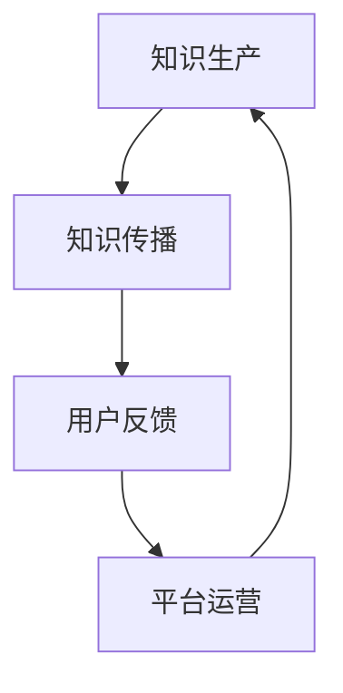

                 

 > **关键词：知识经济，知识付费，商业生态，创新**

> **摘要：本文从知识经济时代背景出发，探讨知识付费的创新商业生态构建。通过分析核心概念、算法原理、数学模型、项目实践和实际应用，本文旨在为行业提供一套系统的理论框架和实战指南。**

## 1. 背景介绍

### 1.1 知识经济的兴起

知识经济是指以知识和信息为主要生产要素，通过知识创新和知识管理来推动经济增长和社会进步的经济形态。与传统农业经济和工业经济相比，知识经济具有高附加值、高创新性和高可持续性的特点。

随着互联网技术的发展，信息传播速度大幅提高，知识获取成本不断降低，知识经济逐渐成为全球经济的主要驱动力量。知识付费作为知识经济的重要组成部分，其发展态势也日益强劲。

### 1.2 知识付费的定义

知识付费是指个人或企业为获取特定知识或技能而支付的费用。这种付费方式通常以在线课程、专业咨询、研究报告等形式存在。知识付费的核心在于价值的传递，即知识提供方通过专业的知识和技能，为需求方创造价值。

### 1.3 知识付费的发展历程

知识付费的发展经历了从线下到线上的转变。早期的知识付费主要依赖于实体书店、培训班等形式，随着互联网的普及，在线教育、知识共享平台等逐渐兴起，知识付费的市场规模不断扩大。

## 2. 核心概念与联系

### 2.1 知识付费模式

知识付费模式主要包括以下几种：

1. **在线课程**：通过互联网平台，为学习者提供系统化的课程内容。
2. **专业咨询**：专家为企业或个人提供专业的咨询服务。
3. **知识共享**：平台汇集各种知识资源，用户通过付费获取所需信息。
4. **知识库**：为用户提供丰富的知识资料库，用户按需付费。

### 2.2 商业生态构建

知识付费的商业生态构建涉及多个环节：

1. **知识生产**：专家或机构生产高质量的知识内容。
2. **知识传播**：通过各种渠道将知识内容传播给用户。
3. **用户反馈**：用户对知识内容进行评价和反馈，为知识生产提供改进方向。
4. **平台运营**：平台为知识生产者和消费者提供服务平台，实现商业闭环。

### 2.3 Mermaid 流程图

以下是一个简化的知识付费商业生态构建的 Mermaid 流程图：



## 3. 核心算法原理 & 具体操作步骤

### 3.1 算法原理概述

知识付费商业生态的构建需要借助数据分析和机器学习等技术，对用户行为、知识质量、市场趋势等进行深入分析，从而实现精准推荐、个性化定制等功能。

### 3.2 算法步骤详解

1. **数据收集**：通过多种渠道收集用户行为数据、知识内容数据、市场趋势数据等。
2. **数据预处理**：对收集到的数据进行清洗、去噪、归一化等处理，确保数据质量。
3. **特征提取**：从预处理后的数据中提取关键特征，为后续建模提供基础。
4. **模型训练**：利用机器学习算法，对提取的特征进行训练，构建预测模型。
5. **模型评估**：通过交叉验证、A/B测试等方法评估模型性能，调整模型参数。
6. **模型部署**：将训练好的模型部署到线上平台，实现实时推荐和个性化服务。

### 3.3 算法优缺点

**优点**：

- **高效性**：利用数据分析和机器学习技术，实现快速、准确的推荐和服务。
- **个性化**：根据用户行为和需求，提供个性化的知识内容和服务。
- **智能化**：通过持续学习和优化，不断提升知识付费平台的服务质量。

**缺点**：

- **数据隐私**：在数据收集和处理过程中，需要保护用户隐私。
- **算法偏见**：模型训练过程中可能引入算法偏见，影响推荐结果。

### 3.4 算法应用领域

知识付费算法广泛应用于在线教育、专业咨询、知识共享等领域，为用户提供高效、个性化的知识服务。

## 4. 数学模型和公式 & 详细讲解 & 举例说明

### 4.1 数学模型构建

知识付费商业生态的构建可以借助线性回归、决策树、支持向量机等数学模型。以下以线性回归为例进行说明。

### 4.2 公式推导过程

线性回归模型的基本公式为：

$$ y = \beta_0 + \beta_1 \cdot x $$

其中，$y$ 为预测值，$x$ 为输入特征，$\beta_0$ 和 $\beta_1$ 分别为模型的参数。

### 4.3 案例分析与讲解

假设我们想预测用户对某在线课程的评价分数，输入特征包括课程难度、时长、评分等。通过线性回归模型，我们可以得到以下预测公式：

$$ \text{评价分数} = \beta_0 + \beta_1 \cdot (\text{课程难度}) + \beta_2 \cdot (\text{课程时长}) + \beta_3 \cdot (\text{评分}) $$

通过训练数据和模型参数，我们可以预测新用户的评价分数，从而为课程推荐提供依据。

## 5. 项目实践：代码实例和详细解释说明

### 5.1 开发环境搭建

本文采用 Python 作为编程语言，使用 Scikit-learn 库实现线性回归模型。

### 5.2 源代码详细实现

以下为线性回归模型的实现代码：

```python
from sklearn.linear_model import LinearRegression
from sklearn.model_selection import train_test_split
from sklearn.metrics import mean_squared_error

# 加载数据
X, y = load_data()

# 划分训练集和测试集
X_train, X_test, y_train, y_test = train_test_split(X, y, test_size=0.2, random_state=42)

# 训练模型
model = LinearRegression()
model.fit(X_train, y_train)

# 预测测试集
y_pred = model.predict(X_test)

# 评估模型
mse = mean_squared_error(y_test, y_pred)
print("均方误差：", mse)
```

### 5.3 代码解读与分析

1. **加载数据**：从数据文件中加载数据集。
2. **划分训练集和测试集**：将数据集划分为训练集和测试集，用于模型训练和评估。
3. **训练模型**：使用线性回归模型对训练集数据进行训练。
4. **预测测试集**：使用训练好的模型对测试集数据进行预测。
5. **评估模型**：计算预测误差，评估模型性能。

## 6. 实际应用场景

知识付费在在线教育、专业咨询、知识共享等领域有广泛的应用。以下为一些实际应用场景：

- **在线教育**：通过知识付费平台，为学生提供个性化课程推荐，提高学习效果。
- **专业咨询**：为企业提供专业咨询服务，助力企业创新发展。
- **知识共享**：为用户提供丰富的知识资源，实现知识共享与传播。

## 7. 工具和资源推荐

### 7.1 学习资源推荐

- **书籍**：《机器学习实战》、《Python机器学习》
- **在线课程**：Coursera、Udacity、edX等平台上的相关课程

### 7.2 开发工具推荐

- **Python**：Python是一种易于学习和使用的编程语言，适合初学者。
- **Scikit-learn**：Scikit-learn是一个开源的机器学习库，适合进行数据分析和模型训练。

### 7.3 相关论文推荐

- **《知识付费：现状、问题与未来趋势》**：探讨知识付费的发展现状和未来趋势。
- **《基于机器学习的知识付费平台推荐系统》**：介绍知识付费平台推荐系统的构建方法。

## 8. 总结：未来发展趋势与挑战

### 8.1 研究成果总结

本文从知识经济时代背景出发，探讨了知识付费的创新商业生态构建，分析了核心概念、算法原理、数学模型和实际应用场景，为行业提供了系统的理论框架和实战指南。

### 8.2 未来发展趋势

- **个性化推荐**：随着人工智能技术的发展，知识付费平台的个性化推荐能力将不断提高。
- **智能服务**：知识付费平台将结合大数据、云计算等技术，提供更智能、高效的服务。

### 8.3 面临的挑战

- **数据隐私**：在知识付费过程中，如何保护用户隐私是一个重要挑战。
- **算法偏见**：机器学习算法可能引入算法偏见，影响知识推荐的质量。

### 8.4 研究展望

未来研究应重点关注以下几个方面：

- **数据隐私保护**：研究如何在知识付费过程中保护用户隐私。
- **算法优化**：通过改进算法，提高知识推荐的准确性和效率。
- **跨平台整合**：整合多种知识付费平台，实现资源的共享与互补。

## 9. 附录：常见问题与解答

### 9.1 知识付费平台如何盈利？

知识付费平台主要通过以下方式盈利：

- **订阅费**：用户按月或按年订阅平台服务。
- **课程销售**：平台销售课程或知识产品。
- **广告收入**：平台通过广告获得收入。
- **增值服务**：提供个性化咨询、知识库等增值服务。

### 9.2 知识付费平台如何提升用户体验？

知识付费平台可以从以下几个方面提升用户体验：

- **个性化推荐**：根据用户行为和需求，提供个性化的知识内容。
- **课程质量**：提供高质量、实用的课程内容。
- **用户互动**：鼓励用户参与讨论、评价，提高知识传播效果。
- **服务便捷**：优化平台界面和操作流程，提高用户使用体验。

## 作者署名

作者：禅与计算机程序设计艺术 / Zen and the Art of Computer Programming
----------------------------------------------------------------

以上就是本文的完整内容，希望对您在知识付费领域的研究和实践有所启发。在未来的知识经济时代，知识付费将发挥越来越重要的作用，为个人和企业创造更多价值。

