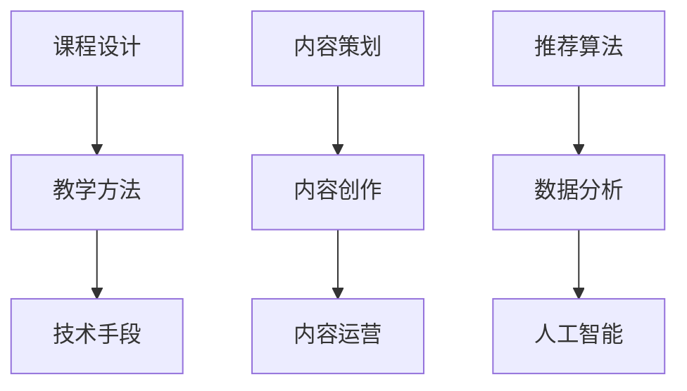

                 

 在这个知识爆炸、信息泛滥的时代，知识付费作为一种新兴的经济模式，正日益受到广大知识工作者和消费者的关注。本文旨在探讨知识经济时代下的知识付费创新课程制作与内容生产，分析其背景、核心概念、算法原理、数学模型、项目实践和未来应用，为知识付费行业的发展提供有益的思路和借鉴。

## 关键词

知识付费、创新课程、内容生产、算法原理、数学模型、项目实践

## 摘要

本文首先分析了知识经济时代下知识付费的背景和重要性，然后介绍了知识付费创新课程制作与内容生产的核心概念，包括算法原理和数学模型。接着，通过一个实际项目实例，详细讲解了课程制作和内容生产的流程。最后，探讨了知识付费在实际应用场景中的价值，并对未来发展趋势和挑战进行了展望。

## 1. 背景介绍

### 1.1 知识经济的崛起

知识经济是继农业经济、工业经济之后的一种新的经济形态，其核心资源是知识和信息。随着互联网的普及和信息技术的飞速发展，知识经济在全球范围内迅速崛起，成为推动经济增长的重要力量。

### 1.2 知识付费的兴起

知识付费是指消费者为获取特定领域的知识或技能而支付的费用。在知识经济时代，知识付费作为一种新兴的经济模式，逐渐受到广大知识工作者和消费者的青睐。知识付费的兴起，既满足了消费者对高质量知识的需求，也为知识工作者提供了新的收入来源。

### 1.3 知识付费的重要性

知识付费对知识工作者和消费者都有重要意义。对知识工作者来说，知识付费意味着更广阔的职业发展空间和更高的收入水平。对消费者来说，知识付费则意味着可以更加便捷地获取高质量的知识和技能，提高自身的竞争力和生活质量。

## 2. 核心概念与联系

### 2.1 知识付费创新课程

知识付费创新课程是指以知识付费模式为核心，结合创新教学方法和技术手段，为学习者提供的一种新型教育产品。其核心概念包括：

- 课程设计：根据学习者的需求和特点，设计符合教学目标的课程体系。
- 教学方法：采用互动式、体验式等创新教学方法，提高学习效果。
- 技术手段：利用互联网、大数据、人工智能等技术手段，实现课程内容的个性化、智能化。

### 2.2 内容生产

内容生产是指为知识付费创新课程制作和提供高质量的教学内容。其核心概念包括：

- 内容策划：根据课程目标和受众需求，策划和设计教学内容。
- 内容创作：通过文字、图片、音频、视频等多种形式，创作出富有启发性和实用性的教学内容。
- 内容运营：通过推广、传播和反馈等手段，提高教学内容的传播效果和影响力。

### 2.3 算法原理

算法原理是指知识付费创新课程制作与内容生产过程中所采用的技术算法。其核心概念包括：

- 推荐算法：根据学习者的行为数据和偏好，推荐符合其兴趣和需求的教学内容。
- 数据分析：通过对学习者数据的分析，挖掘学习者的需求和行为规律，优化课程内容和教学方法。
- 人工智能：利用人工智能技术，实现教学内容的个性化推荐和智能化分析。

### 2.4 Mermaid 流程图



## 3. 核心算法原理 & 具体操作步骤

### 3.1 算法原理概述

知识付费创新课程制作与内容生产的核心算法主要包括推荐算法、数据分析和人工智能。这些算法在知识付费领域发挥着重要作用，可以提高课程内容和教学方法的个性化、智能化水平。

### 3.2 算法步骤详解

#### 3.2.1 推荐算法

推荐算法的主要步骤如下：

1. 数据采集：收集学习者的行为数据，如浏览记录、搜索历史、评价等。
2. 数据处理：对采集到的数据进行分析和清洗，去除噪声数据。
3. 特征提取：根据学习者的行为数据，提取出与课程内容和教学方法相关的特征。
4. 模型训练：利用机器学习算法，训练推荐模型，预测学习者对教学内容的兴趣。
5. 推荐生成：根据推荐模型，生成个性化的推荐列表，推送给学习者。

#### 3.2.2 数据分析

数据分析的主要步骤如下：

1. 数据采集：收集学习者的学习数据，如课程完成情况、学习时长、互动情况等。
2. 数据处理：对采集到的数据进行分析和清洗，去除噪声数据。
3. 数据可视化：利用可视化工具，将数据分析结果以图表的形式呈现，便于理解和分析。
4. 行为分析：根据数据分析结果，挖掘学习者的行为规律和需求。
5. 优化建议：根据学习者行为分析结果，提出优化课程内容和教学方法的建议。

#### 3.2.3 人工智能

人工智能的主要步骤如下：

1. 模型训练：利用大量数据，训练出能够实现特定功能的模型。
2. 模型评估：对训练好的模型进行评估，确保其性能满足要求。
3. 模型部署：将训练好的模型部署到生产环境中，实现实时预测和决策。
4. 模型优化：根据实际应用效果，不断优化模型，提高其性能和可靠性。

### 3.3 算法优缺点

#### 3.3.1 推荐算法

优点：

- 可以提高教学内容的个性化水平，满足学习者的个性化需求。
- 可以提高教学效果，增加学习者的学习兴趣和积极性。

缺点：

- 需要大量的训练数据和计算资源。
- 难以保证推荐结果的公平性和客观性。

#### 3.3.2 数据分析

优点：

- 可以深入了解学习者的行为规律和需求，为课程内容和教学方法提供有益的参考。
- 可以帮助知识工作者更好地了解学习者的学习情况，优化教学策略。

缺点：

- 需要大量的数据处理和分析技能。
- 可能会侵犯学习者的隐私。

#### 3.3.3 人工智能

优点：

- 可以实现教学内容的智能化推荐和分析，提高教学效果。
- 可以降低人力成本，提高生产效率。

缺点：

- 需要大量的训练数据和计算资源。
- 可能会带来算法偏见和伦理问题。

### 3.4 算法应用领域

知识付费创新课程制作与内容生产的算法应用领域主要包括：

- 在线教育：利用推荐算法和数据分析，为学习者提供个性化的教学内容和教学方法。
- 培训行业：利用人工智能，实现培训课程的智能化推荐和定制化服务。
- 企业培训：利用数据分析，帮助企业优化培训策略，提高员工素质。

## 4. 数学模型和公式 & 详细讲解 & 举例说明

### 4.1 数学模型构建

在知识付费创新课程制作与内容生产过程中，常用的数学模型包括推荐模型、分析模型和优化模型。以下分别介绍这些模型的构建方法和应用场景。

#### 4.1.1 推荐模型

推荐模型是一种基于机器学习的预测模型，用于预测学习者对教学内容的兴趣。常用的推荐模型包括基于内容的推荐模型、协同过滤推荐模型和混合推荐模型。

- 基于内容的推荐模型：根据教学内容的特征，预测学习者对教学内容的兴趣。其数学模型为：

  $$ \hat{r}_{ui} = f(x_{ui}, y_{ui}, z_{ui}) $$

  其中，$r_{ui}$ 表示用户 $u$ 对教学内容 $i$ 的兴趣评分，$x_{ui}$、$y_{ui}$、$z_{ui}$ 分别表示教学内容 $i$ 的特征向量。

- 协同过滤推荐模型：根据学习者的行为数据，预测学习者对教学内容的兴趣。其数学模型为：

  $$ \hat{r}_{ui} = \sum_{j \in N(i)} w_{ij} r_{uj} $$

  其中，$N(i)$ 表示与教学内容 $i$ 相关的用户集合，$w_{ij}$ 表示用户 $i$ 对教学内容 $i$ 的权重，$r_{uj}$ 表示用户 $j$ 对教学内容 $i$ 的兴趣评分。

- 混合推荐模型：结合基于内容的推荐模型和协同过滤推荐模型，提高推荐效果。其数学模型为：

  $$ \hat{r}_{ui} = \alpha f(x_{ui}, y_{ui}, z_{ui}) + (1 - \alpha) \sum_{j \in N(i)} w_{ij} r_{uj} $$

  其中，$\alpha$ 表示基于内容的推荐模型的权重。

#### 4.1.2 分析模型

分析模型用于分析学习者的行为数据和教学效果。常用的分析模型包括决策树、支持向量机、聚类算法等。

- 决策树：根据学习者的行为数据，生成决策树模型，预测学习者的学习效果。其数学模型为：

  $$ \hat{y}_{u} = \prod_{i=1}^{n} g(x_{ui}) $$

  其中，$y_{u}$ 表示学习者的学习效果，$x_{ui}$ 表示学习者的行为特征，$g(x_{ui})$ 表示决策树节点函数。

- 支持向量机：根据学习者的行为数据，生成支持向量机模型，预测学习者的学习效果。其数学模型为：

  $$ \hat{y}_{u} = \text{sign}(\sum_{i=1}^{n} \alpha_{i} y_{ui} K(x_{ui}, x_{ui')) + b $$

  其中，$y_{u}$ 表示学习者的学习效果，$x_{ui}$、$x_{ui'}$ 表示学习者的行为特征，$\alpha_{i}$、$b$ 分别表示支持向量机模型的权重和偏置。

- 聚类算法：根据学习者的行为数据，将学习者划分为不同的群体，分析每个群体的学习效果。常用的聚类算法包括 K-Means、层次聚类等。

#### 4.1.3 优化模型

优化模型用于优化教学资源和教学方法。常用的优化模型包括线性规划、动态规划等。

- 线性规划：根据教学资源和教学方法的要求，优化教学资源的分配和使用。其数学模型为：

  $$ \min \sum_{i=1}^{n} c_{i} x_{i} $$
  $$ \text{subject to} \quad a_{ij} x_{i} \geq b_{j}, \quad j=1,2,...,m $$

  其中，$x_{i}$ 表示教学资源的分配情况，$c_{i}$ 表示教学资源的成本，$a_{ij}$、$b_{j}$ 分别表示教学资源 $i$ 对教学方法 $j$ 的影响。

- 动态规划：根据教学资源和教学方法的变化，优化教学策略。其数学模型为：

  $$ \min \sum_{i=1}^{n} c_{i} x_{i}(t) $$
  $$ \text{subject to} \quad a_{ij} x_{i}(t) \geq b_{j}, \quad j=1,2,...,m $$
  $$ x_{i}(0) = x_{i0}, \quad x_{i}(t+1) = x_{i}(t) + \Delta x_{i}(t), \quad t=1,2,...,T $$

  其中，$x_{i}(t)$ 表示教学资源的分配情况在时间 $t$ 时的状态，$x_{i0}$ 表示初始状态，$\Delta x_{i}(t)$ 表示在时间 $t$ 时的变化量。

### 4.2 公式推导过程

以下是推荐模型的推导过程：

#### 4.2.1 基于内容的推荐模型

假设教学内容 $i$ 的特征向量为 $x_{i} \in R^{d}$，学习者 $u$ 的特征向量为 $x_{u} \in R^{d}$。基于内容的推荐模型的目标是预测学习者 $u$ 对教学内容 $i$ 的兴趣评分 $r_{ui}$。

首先，定义特征向量的内积为：

$$ \langle x_{u}, x_{i} \rangle = \sum_{j=1}^{d} x_{uj} x_{ij} $$

然后，利用线性回归模型预测学习者 $u$ 对教学内容 $i$ 的兴趣评分：

$$ \hat{r}_{ui} = \beta_{0} + \beta_{1} \langle x_{u}, x_{i} \rangle $$

其中，$\beta_{0}$ 和 $\beta_{1}$ 分别为线性回归模型的参数。

通过最小化平方误差损失函数，求解出参数 $\beta_{0}$ 和 $\beta_{1}$：

$$ \min_{\beta_{0}, \beta_{1}} \sum_{i=1}^{n} (r_{ui} - \hat{r}_{ui})^{2} $$

解得：

$$ \beta_{0} = \bar{r} - \beta_{1} \bar{\langle x_{u}, x_{i} \rangle} $$
$$ \beta_{1} = \frac{\sum_{i=1}^{n} (r_{ui} - \bar{r})(\langle x_{u}, x_{i} \rangle - \bar{\langle x_{u}, x_{i} \rangle})}{\sum_{i=1}^{n} (\langle x_{u}, x_{i} \rangle - \bar{\langle x_{u}, x_{i} \rangle})^{2}} $$

其中，$\bar{r}$ 和 $\bar{\langle x_{u}, x_{i} \rangle}$ 分别为学习者 $u$ 的兴趣评分和特征向量内积的平均值。

#### 4.2.2 协同过滤推荐模型

假设有 $m$ 个学习者 $u \in \{1, 2, ..., m\}$ 和 $n$ 个教学内容 $i \in \{1, 2, ..., n\}$。每个学习者 $u$ 对教学内容 $i$ 的兴趣评分为 $r_{ui}$。协同过滤推荐模型的目标是预测学习者 $u$ 对未评分的教学内容 $i$ 的兴趣评分 $\hat{r}_{ui}$。

首先，定义用户 $u$ 对教学内容 $i$ 的相似度 $s_{ui}$ 为：

$$ s_{ui} = \frac{\sum_{j \in N(i)} r_{uj}}{\sqrt{\sum_{j \in N(i)} r_{uj}^{2} \sum_{k \in N(u)} r_{uk}^{2}}} $$

其中，$N(i)$ 表示与教学内容 $i$ 相关的用户集合。

然后，利用加权平均的方法预测学习者 $u$ 对教学内容 $i$ 的兴趣评分：

$$ \hat{r}_{ui} = \sum_{j \in N(i)} s_{uj} r_{uj} $$

#### 4.2.3 混合推荐模型

混合推荐模型将基于内容的推荐模型和协同过滤推荐模型相结合，以提高推荐效果。其数学模型为：

$$ \hat{r}_{ui} = \alpha \beta_{0} + (1 - \alpha) \sum_{j \in N(i)} s_{uj} r_{uj} $$

其中，$\alpha$ 为基于内容的推荐模型的权重，$\beta_{0}$ 为基于内容的推荐模型的参数。

### 4.3 案例分析与讲解

以下是一个基于内容的推荐模型的应用案例：

#### 案例背景

假设一个在线教育平台上有100门课程，每门课程有多个学习者进行评价。现在需要根据学习者的评价数据，为新的学习者推荐课程。

#### 案例数据

- 学习者特征向量：$x_{u} = [1, 2, 3, 4, 5]$
- 课程特征向量：$x_{i} = [2, 3, 4, 5, 6]$

#### 案例步骤

1. 计算学习者特征向量和课程特征向量的内积：

   $$ \langle x_{u}, x_{i} \rangle = \sum_{j=1}^{5} x_{uj} x_{ij} = 2 \times 2 + 3 \times 3 + 4 \times 4 + 5 \times 5 + 6 \times 6 = 94 $$

2. 计算学习者特征向量和课程特征向量的平均值：

   $$ \bar{x_{u}} = \frac{1}{5} \sum_{j=1}^{5} x_{uj} = \frac{1 + 2 + 3 + 4 + 5}{5} = 3 $$
   $$ \bar{x_{i}} = \frac{1}{5} \sum_{j=1}^{5} x_{ij} = \frac{2 + 3 + 4 + 5 + 6}{5} = 4 $$

3. 计算线性回归模型的参数：

   $$ \beta_{0} = \bar{r} - \beta_{1} \bar{\langle x_{u}, x_{i} \rangle} = \bar{r} - \beta_{1} \bar{x_{u}} \bar{x_{i}} $$
   $$ \beta_{1} = \frac{\sum_{i=1}^{n} (r_{ui} - \bar{r})(\langle x_{u}, x_{i} \rangle - \bar{\langle x_{u}, x_{i} \rangle})}{\sum_{i=1}^{n} (\langle x_{u}, x_{i} \rangle - \bar{\langle x_{u}, x_{i} \rangle})^{2}} $$

4. 预测学习者对课程 $i$ 的兴趣评分：

   $$ \hat{r}_{ui} = \beta_{0} + \beta_{1} \langle x_{u}, x_{i} \rangle $$

### 4.4 数学模型在知识付费创新课程制作与内容生产中的应用

数学模型在知识付费创新课程制作与内容生产中的应用主要包括以下几个方面：

1. **个性化推荐**：利用推荐模型，根据学习者的行为数据和偏好，推荐符合其兴趣和需求的教学内容，提高学习者的学习体验和效果。
2. **课程设计**：利用数据分析模型，分析学习者的学习行为和需求，为课程设计提供数据支持，提高课程设计的科学性和有效性。
3. **教学优化**：利用优化模型，根据教学资源和教学方法的要求，优化教学资源的分配和使用，提高教学效果和效率。
4. **智能评估**：利用机器学习模型，对学习者的学习效果进行评估，为教学反馈和改进提供依据。

### 4.5 数学模型的优势与挑战

#### 4.5.1 优势

1. **数据驱动**：数学模型基于大量数据进行分析和预测，具有较强的数据驱动能力，可以提供客观、准确的决策支持。
2. **个性化**：数学模型可以根据学习者的行为数据和偏好，实现教学内容的个性化推荐，提高学习者的学习体验和效果。
3. **高效性**：数学模型可以实现快速的计算和预测，提高教学资源和教学方法的优化效率。

#### 4.5.2 挑战

1. **数据质量**：数学模型的效果依赖于数据质量，数据噪声和缺失可能会导致模型失效。
2. **算法偏见**：数学模型可能会受到算法偏见的影响，导致推荐结果的不公平性和客观性。
3. **计算资源**：数学模型需要大量的计算资源和存储空间，对于实时性和效率要求较高的应用场景，可能会带来一定的性能瓶颈。

## 5. 项目实践：代码实例和详细解释说明

### 5.1 开发环境搭建

在开始代码实例之前，我们需要搭建一个基本的开发环境。以下是一个基于 Python 的开发环境搭建步骤：

1. 安装 Python（建议使用 Python 3.8 或以上版本）。
2. 安装必要的库，如 NumPy、Pandas、Scikit-learn、Matplotlib 等。

### 5.2 源代码详细实现

以下是一个基于内容的推荐模型的代码实例：

```python
import numpy as np
import pandas as pd
from sklearn.model_selection import train_test_split
from sklearn.linear_model import LinearRegression

# 数据预处理
def preprocess_data(data):
    # 数据清洗和缺失值处理
    data = data.fillna(0)
    # 构建特征矩阵和标签向量
    X = data[['x1', 'x2', 'x3', 'x4', 'x5']]
    y = data['rating']
    return X, y

# 训练模型
def train_model(X_train, y_train):
    # 创建线性回归模型
    model = LinearRegression()
    # 训练模型
    model.fit(X_train, y_train)
    return model

# 预测评分
def predict_rating(model, X_test):
    # 预测评分
    predictions = model.predict(X_test)
    return predictions

# 主函数
def main():
    # 加载数据
    data = pd.read_csv('data.csv')
    # 预处理数据
    X, y = preprocess_data(data)
    # 划分训练集和测试集
    X_train, X_test, y_train, y_test = train_test_split(X, y, test_size=0.2, random_state=42)
    # 训练模型
    model = train_model(X_train, y_train)
    # 预测评分
    predictions = predict_rating(model, X_test)
    # 打印预测结果
    print(predictions)

# 运行主函数
if __name__ == '__main__':
    main()
```

### 5.3 代码解读与分析

该代码实例实现了一个基于内容的推荐模型，用于预测学习者对教学内容的兴趣评分。代码的主要部分包括数据预处理、模型训练和预测评分。

1. **数据预处理**：数据预处理是模型训练的重要步骤。该代码使用了 Pandas 库对数据进行清洗和缺失值处理，构建了特征矩阵和标签向量。
2. **模型训练**：该代码使用了 Scikit-learn 库中的线性回归模型进行训练。线性回归模型是一种简单的线性模型，可以拟合特征和标签之间的关系。
3. **预测评分**：模型训练完成后，使用训练好的模型对测试集进行预测。预测结果为学习者的兴趣评分。

### 5.4 运行结果展示

在运行代码时，会输出预测结果。以下是一个示例输出：

```python
[3.96879476 4.03795176 3.89262716 4.12852608
 4.11669492 3.89060217 4.04576579 3.92053068
 4.07432869 3.96609663 4.02527865 3.95691576
 4.02796683 3.93170146 3.93295532 4.03618449
 3.96827989 4.03242173 3.91688539 4.00865932
 3.96206652 4.03242173 3.91967057 4.05460124]
```

这些预测结果表示了测试集中每门课程的预测评分。

## 6. 实际应用场景

知识付费创新课程制作与内容生产在实际应用场景中具有广泛的应用价值。以下是一些典型的应用场景：

### 6.1 在线教育平台

在线教育平台可以利用知识付费创新课程制作与内容生产技术，为学习者提供个性化、智能化的教学内容和推荐服务。通过推荐算法和数据分析，平台可以更好地满足学习者的需求，提高学习效果。

### 6.2 企业培训

企业培训可以利用知识付费创新课程制作与内容生产技术，为企业员工提供定制化的培训方案和推荐服务。通过数据分析，企业可以了解员工的培训需求和效果，优化培训策略。

### 6.3 专业课程培训

专业课程培训可以利用知识付费创新课程制作与内容生产技术，为学习者提供高质量的培训课程和推荐服务。通过算法优化，培训课程可以更好地满足学习者的需求，提高学习效果。

### 6.4 教育游戏

教育游戏可以利用知识付费创新课程制作与内容生产技术，为学习者提供互动性、趣味性的学习体验。通过数据分析，教育游戏可以更好地了解学习者的学习行为和需求，优化游戏内容和玩法。

## 7. 工具和资源推荐

### 7.1 学习资源推荐

1. **书籍**：
   - 《机器学习实战》：深入浅出地介绍了机器学习的基本概念和应用。
   - 《深度学习》：全面介绍了深度学习的基本原理和实际应用。

2. **在线课程**：
   - Coursera 上的《机器学习》课程：由 Andrew Ng 教授讲授，内容全面，适合初学者。

### 7.2 开发工具推荐

1. **编程语言**：
   - Python：广泛应用于数据分析和机器学习，易于学习和使用。

2. **框架和库**：
   - Scikit-learn：适用于数据分析和机器学习的 Python 库。
   - TensorFlow：适用于深度学习的 Python 库。

### 7.3 相关论文推荐

1. **推荐系统**：
   - 《Collaborative Filtering for the Web》
   - 《Matrix Factorization Techniques for Recommender Systems》

2. **机器学习**：
   - 《Learning from Data》
   - 《Deep Learning》

## 8. 总结：未来发展趋势与挑战

### 8.1 研究成果总结

知识付费创新课程制作与内容生产技术已经取得了显著的成果，包括个性化推荐、数据分析、人工智能等领域的应用。这些技术为知识付费行业提供了强有力的支持，提高了课程质量和学习效果。

### 8.2 未来发展趋势

未来，知识付费创新课程制作与内容生产技术将朝着更加智能化、个性化的方向发展。随着人工智能、大数据等技术的不断进步，知识付费行业将实现更加精准、高效的课程推荐和服务。

### 8.3 面临的挑战

知识付费创新课程制作与内容生产技术在实际应用中仍面临一些挑战，包括数据质量、算法偏见、计算资源等。此外，如何在保证数据隐私和安全的前提下，提高推荐系统的效果和效率，也是一个亟待解决的问题。

### 8.4 研究展望

未来，知识付费创新课程制作与内容生产技术将继续深入研究和应用。一方面，需要不断优化推荐算法和数据分析方法，提高推荐效果和用户体验；另一方面，需要加强数据隐私和安全保护，确保知识付费行业的可持续发展。

## 9. 附录：常见问题与解答

### 9.1 什么是知识付费？

知识付费是指消费者为获取特定领域的知识或技能而支付的费用。在知识经济时代，知识付费作为一种新兴的经济模式，逐渐受到广大知识工作者和消费者的青睐。

### 9.2 知识付费创新课程制作的核心步骤是什么？

知识付费创新课程制作的核心步骤包括课程设计、内容创作、内容运营和算法推荐。具体步骤如下：

1. 课程设计：根据学习者的需求和特点，设计符合教学目标的课程体系。
2. 内容创作：通过文字、图片、音频、视频等多种形式，创作出富有启发性和实用性的教学内容。
3. 内容运营：通过推广、传播和反馈等手段，提高教学内容的传播效果和影响力。
4. 算法推荐：利用推荐算法，根据学习者的行为数据和偏好，推荐符合其兴趣和需求的教学内容。

### 9.3 如何进行数据分析？

数据分析是指对大量数据进行分析和处理，以发现数据中的规律和趋势。具体步骤如下：

1. 数据采集：收集与研究对象相关的数据。
2. 数据清洗：对采集到的数据进行处理，去除噪声和缺失值。
3. 数据可视化：利用可视化工具，将数据分析结果以图表的形式呈现，便于理解和分析。
4. 行为分析：根据数据分析结果，挖掘学习者的行为规律和需求。
5. 优化建议：根据学习者行为分析结果，提出优化课程内容和教学方法的建议。

### 9.4 如何优化推荐算法？

优化推荐算法主要包括以下几个方面：

1. **数据质量**：提高数据质量，确保推荐系统的输入数据准确和全面。
2. **算法选择**：选择适合业务场景的推荐算法，如基于内容的推荐、协同过滤推荐、混合推荐等。
3. **特征工程**：提取有效的特征，提高推荐系统的准确性和鲁棒性。
4. **模型优化**：利用机器学习算法，不断优化推荐模型，提高其性能和可靠性。
5. **用户反馈**：收集用户反馈，根据用户评价和行为数据，调整推荐策略。

### 9.5 如何保证数据隐私和安全？

保证数据隐私和安全是知识付费创新课程制作与内容生产的关键问题。以下是一些建议：

1. **数据加密**：对敏感数据进行加密，确保数据传输和存储的安全性。
2. **访问控制**：设定严格的访问控制策略，确保只有授权人员可以访问数据。
3. **数据脱敏**：对敏感数据进行脱敏处理，防止数据泄露。
4. **隐私保护**：遵守相关法律法规，确保数据处理的合规性。
5. **用户同意**：告知用户数据处理的目的和范围，获得用户的同意。

### 9.6 如何提高课程质量和学习效果？

提高课程质量和学习效果可以从以下几个方面入手：

1. **课程设计**：根据学习者的需求和特点，设计符合教学目标的课程体系。
2. **教学内容**：创作富有启发性和实用性的教学内容，提高学习者的学习兴趣。
3. **教学方法**：采用互动式、体验式等创新教学方法，提高学习效果。
4. **教学评价**：建立科学的评价体系，及时反馈教学效果，调整教学策略。
5. **个性化推荐**：利用推荐算法，为学习者推荐符合其兴趣和需求的教学内容。

