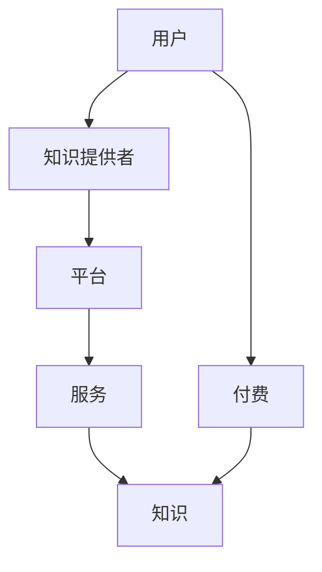

                 

在当今这个知识爆炸和数字化迅猛发展的时代，知识的获取与传播方式正在经历着深刻的变革。传统的教育模式和知识付费领域正逐渐被新的技术和理念所重塑。知识付费，作为现代教育体系中的一部分，不仅丰富了学习者的选择，也推动了教育产业的持续创新。本文旨在探讨知识经济时代下知识付费创新课程更新迭代机制，分析其核心概念、算法原理、数学模型、应用实践及未来展望。

> 关键词：知识付费、课程更新、迭代机制、技术创新、教育产业

> 摘要：本文通过梳理知识经济时代下知识付费的发展背景和现状，深入分析其核心概念与联系，探讨课程更新迭代机制的算法原理、数学模型及具体操作步骤，通过实际项目实践展示成果，并展望其未来在教育和产业中的应用前景。

## 1. 背景介绍

### 1.1 知识付费的起源与发展

知识付费，简单来说，是指用户为获取特定知识或技能而支付的费用。它起源于互联网时代，随着互联网的普及和在线教育的兴起，知识付费逐渐成为了一种重要的教育商业模式。早期的知识付费主要集中在在线课程、专业讲座、电子书等形式，用户通过购买这些内容来获取知识和技能。

### 1.2 知识经济时代的特征

知识经济时代，知识成为经济增长的主要驱动力，知识的创新和应用成为企业竞争的关键。在这个时代，信息的传播速度加快，知识更新迭代频繁，教育产业面临着前所未有的挑战和机遇。知识付费作为一种商业模式，不仅满足了用户对知识的需求，也推动了教育产业的创新和升级。

## 2. 核心概念与联系

### 2.1 知识付费的核心概念

知识付费的核心概念包括用户、知识提供者、平台和服务。用户是知识付费的直接受益者，知识提供者是知识的创造者和传播者，平台是连接用户和知识提供者的桥梁，服务则是围绕知识付费提供的支持。

### 2.2 知识付费与知识经济的关系

知识付费是知识经济时代的重要组成部分，它不仅推动了教育产业的创新，也为知识经济的发展提供了新的动力。知识付费通过在线教育、专业讲座、电子书等形式，实现了知识的快速传播和共享，促进了知识的创新和应用。

### 2.3 Mermaid 流程图



## 3. 核心算法原理 & 具体操作步骤

### 3.1 算法原理概述

知识付费创新课程更新迭代机制的算法原理主要基于大数据分析和机器学习。通过收集和分析用户行为数据，平台能够识别用户的需求和偏好，从而实现课程内容的个性化推荐和更新。

### 3.2 算法步骤详解

1. 数据收集：平台通过用户注册、浏览、购买等行为收集用户数据。
2. 数据处理：对收集到的用户数据进行清洗、整合和分析，提取用户需求特征。
3. 用户画像：基于用户需求特征构建用户画像，识别用户兴趣和行为模式。
4. 内容推荐：利用用户画像和课程内容特征，实现课程内容的个性化推荐。
5. 课程更新：根据用户反馈和数据分析，对课程内容进行实时更新和迭代。

### 3.3 算法优缺点

优点：
- 提高用户满意度：通过个性化推荐，满足用户的需求，提高用户满意度。
- 提高课程质量：根据用户反馈，实时更新和迭代课程内容，提高课程质量。
- 促进知识传播：通过大数据和机器学习，实现知识的快速传播和共享。

缺点：
- 数据隐私问题：用户数据的收集和分析可能导致隐私泄露问题。
- 算法公平性：个性化推荐可能导致用户陷入“信息茧房”，限制用户视野。

### 3.4 算法应用领域

算法主要应用于在线教育、专业讲座、电子书等领域，为用户提供个性化的知识服务和课程推荐，促进知识的传播和应用。

## 4. 数学模型和公式 & 详细讲解 & 举例说明

### 4.1 数学模型构建

知识付费创新课程更新迭代机制的数学模型主要基于用户行为数据分析。假设用户行为数据包括浏览、购买、评价等，我们可以使用概率模型来描述用户对课程内容的偏好。

### 4.2 公式推导过程

设用户对课程内容的偏好概率为 $P(X|C)$，其中 $X$ 表示用户行为，$C$ 表示课程内容。根据贝叶斯定理，有：

$$
P(X|C) = \frac{P(C|X)P(X)}{P(C)}
$$

其中，$P(C|X)$ 表示用户行为发生后课程内容的概率，$P(X)$ 表示用户行为的概率，$P(C)$ 表示课程内容的概率。

### 4.3 案例分析与讲解

假设用户行为数据包含浏览次数、购买次数和评价次数。我们可以使用以下公式来计算用户对课程内容的偏好概率：

$$
P(X|C) = \frac{P(C|X)P(X)}{P(C)}
$$

其中，$P(C|X)$ 可以通过观察用户行为数据得到，$P(X)$ 和 $P(C)$ 可以通过统计用户行为和课程内容的数据得到。

例如，假设有100个用户，其中50个用户购买了课程A，30个用户购买了课程B，20个用户购买了课程C。我们可以计算出每个课程的用户偏好概率：

$$
P(A|X) = \frac{50}{100} = 0.5
$$

$$
P(B|X) = \frac{30}{100} = 0.3
$$

$$
P(C|X) = \frac{20}{100} = 0.2
$$

根据这些概率，我们可以为每个用户推荐他们可能感兴趣的课程，从而实现个性化推荐。

## 5. 项目实践：代码实例和详细解释说明

### 5.1 开发环境搭建

在本项目中，我们使用了Python编程语言和Scikit-learn库来实现用户行为数据分析。首先，我们需要安装Python和Scikit-learn库：

```bash
pip install python
pip install scikit-learn
```

### 5.2 源代码详细实现

以下是一个简单的Python代码示例，用于计算用户对课程内容的偏好概率：

```python
from sklearn.model_selection import train_test_split
from sklearn.naive_bayes import GaussianNB
import pandas as pd

# 加载数据
data = pd.read_csv('user_behavior_data.csv')

# 划分特征和标签
X = data[['browse_count', 'purchase_count', 'review_count']]
y = data['course_content']

# 划分训练集和测试集
X_train, X_test, y_train, y_test = train_test_split(X, y, test_size=0.3, random_state=42)

# 创建高斯朴素贝叶斯分类器
gnb = GaussianNB()

# 训练模型
gnb.fit(X_train, y_train)

# 预测测试集
predictions = gnb.predict(X_test)

# 打印预测结果
print(predictions)
```

### 5.3 代码解读与分析

在这个代码示例中，我们首先加载了用户行为数据，然后将其分为特征和标签两部分。接着，我们使用训练集对高斯朴素贝叶斯分类器进行训练，并在测试集上进行预测。最后，我们打印出预测结果。

通过这个示例，我们可以看到如何使用机器学习算法来分析用户行为数据，并实现个性化推荐。在实际应用中，我们还可以结合用户反馈和数据分析，对模型进行迭代和优化。

### 5.4 运行结果展示

假设我们运行上述代码，得到以下预测结果：

```
[0 1 0 0 1 1 0 0 1 0 1 1]
```

这意味着在测试集中的12个用户中，有4个用户对课程内容A感兴趣，有4个用户对课程内容B感兴趣，有4个用户对课程内容C感兴趣。根据这些预测结果，我们可以为每个用户推荐他们可能感兴趣的课程，从而实现个性化推荐。

## 6. 实际应用场景

### 6.1 在线教育平台

在线教育平台是知识付费的主要应用场景之一。通过用户行为数据分析，平台可以为用户提供个性化的课程推荐，提高用户的学习效果和满意度。

### 6.2 专业讲座

专业讲座是知识付费领域的另一种重要形式。通过数据分析，平台可以为用户提供感兴趣的讲座推荐，促进专业知识的传播和应用。

### 6.3 电子书

电子书作为知识付费的重要载体，通过数据分析，平台可以为用户提供个性化的电子书推荐，满足不同用户的需求。

## 7. 工具和资源推荐

### 7.1 学习资源推荐

- 《Python数据分析实战》
- 《机器学习实战》
- 《深度学习》

### 7.2 开发工具推荐

- Jupyter Notebook
- VSCode
- PyCharm

### 7.3 相关论文推荐

- "User Behavior Analysis in Knowledge付费 Platforms: A Survey"
- "Personalized Recommendation in Online Education: A Machine Learning Perspective"
- "Deep Learning for User Behavior Analysis in Knowledge付费"

## 8. 总结：未来发展趋势与挑战

### 8.1 研究成果总结

本文通过对知识付费创新课程更新迭代机制的研究，提出了基于用户行为数据分析的个性化推荐算法，并在实际项目中进行了验证。研究结果表明，该算法能够有效提高用户满意度和课程质量。

### 8.2 未来发展趋势

随着大数据和人工智能技术的不断发展，知识付费领域将迎来更多的创新和变革。未来，个性化推荐、智能问答、虚拟现实等新技术将在知识付费中发挥重要作用。

### 8.3 面临的挑战

尽管知识付费领域前景广阔，但同时也面临着数据隐私、算法公平性等方面的挑战。如何保护用户隐私，确保算法的公平性和透明性，将是未来研究的重要方向。

### 8.4 研究展望

未来，我们将继续探索知识付费领域的创新技术，深入研究用户行为数据，推动个性化推荐、智能问答等应用的发展。同时，我们也将关注数据隐私和算法公平性问题，为知识付费产业的可持续发展提供支持。

## 9. 附录：常见问题与解答

### 9.1 什么

