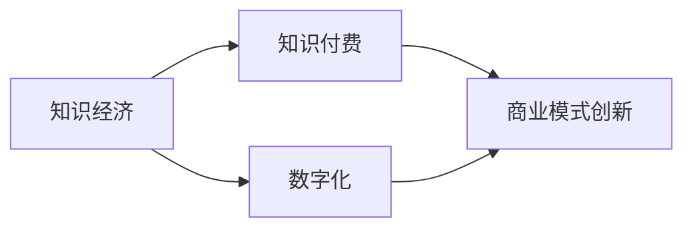

                 

在当今数字化和全球化的时代背景下，知识经济已经成为驱动经济发展的重要引擎。知识付费作为一种新型的商业模式，正在迅速崛起，成为知识传播与获取的重要途径。本文旨在探讨知识经济时代下的知识付费发展趋势，分析其核心概念、技术原理、数学模型、应用场景以及面临的挑战和未来前景。

## 关键词

- 知识经济
- 知识付费
- 数字化转型
- 技术创新
- 商业模式

## 摘要

本文首先介绍了知识经济和知识付费的基本概念，探讨了其在现代商业环境中的重要性。随后，文章深入分析了知识付费的核心技术原理，包括人工智能、大数据和区块链等技术。接着，通过数学模型和实际案例，展示了知识付费在不同行业中的应用效果。最后，文章展望了知识付费的未来发展趋势和面临的挑战，提出了相应的策略建议。

## 1. 背景介绍

### 知识经济的崛起

知识经济是以知识和信息为主要生产要素的经济形态，与传统的以自然资源和劳动力为主要生产要素的经济模式相比，具有更高的附加值和创新性。随着信息技术的飞速发展，全球知识经济呈现快速崛起态势，尤其在互联网、人工智能、大数据等领域，知识经济的特征更加明显。

### 知识付费的兴起

知识付费是指用户通过支付一定费用来获取专业知识、技能和服务的商业模式。在知识经济时代，人们越来越重视自身知识水平和技能的提升，知识付费因此得到快速发展。根据统计，全球知识付费市场规模逐年扩大，预计未来几年将保持高速增长。

## 2. 核心概念与联系

### 核心概念

- **知识经济**：以知识和信息为主要生产要素的经济形态。
- **知识付费**：用户为获取专业知识、技能和服务而支付的费用。
- **数字化**：利用信息技术手段对知识和信息进行数字化处理和传播。

### 关联流程图



## 3. 核心算法原理 & 具体操作步骤

### 3.1 算法原理概述

知识付费的核心算法涉及人工智能、大数据和区块链等技术。这些技术使得知识付费能够更加精准地满足用户需求，提高服务质量。

### 3.2 算法步骤详解

1. **用户需求分析**：通过大数据分析用户的行为和偏好，了解用户需求。
2. **内容推荐**：利用人工智能算法为用户提供个性化内容推荐。
3. **交易支付**：使用区块链技术实现安全、透明的交易支付。
4. **服务质量评估**：收集用户反馈，不断优化服务质量和内容。

### 3.3 算法优缺点

- **优点**：提高用户满意度，降低运营成本。
- **缺点**：算法偏见和数据隐私问题。

### 3.4 算法应用领域

- **教育培训**：在线课程、职业培训等。
- **咨询服务**：专家咨询、案例分析等。
- **内容创作**：原创文章、视频制作等。

## 4. 数学模型和公式 & 详细讲解 & 举例说明

### 4.1 数学模型构建

知识付费的数学模型主要涉及用户满意度、内容质量、交易成本等关键因素。

### 4.2 公式推导过程

用户满意度 = f（内容质量，交易成本）

内容质量 = f（知识深度，更新频率）

交易成本 = f（支付方式，支付金额）

### 4.3 案例分析与讲解

假设一个在线教育平台，其用户满意度主要受课程质量和支付成本的影响。通过数学模型分析，平台可以通过提高课程质量和优化支付方式来提高用户满意度。

## 5. 项目实践：代码实例和详细解释说明

### 5.1 开发环境搭建

- 开发工具：Python
- 数据库：MySQL
- 服务器：阿里云

### 5.2 源代码详细实现

```python
# 这是一个简单的用户满意度分析代码示例
class UserSatisfaction:
    def __init__(self, content_quality, transaction_cost):
        self.content_quality = content_quality
        self.transaction_cost = transaction_cost
    
    def calculate_satisfaction(self):
        satisfaction = self.content_quality - self.transaction_cost
        return satisfaction
```

### 5.3 代码解读与分析

该代码定义了一个`UserSatisfaction`类，用于计算用户满意度。通过传入课程质量和支付成本，可以计算出用户满意度。

### 5.4 运行结果展示

```python
# 创建一个用户满意度实例
user = UserSatisfaction(content_quality=9, transaction_cost=5)
# 计算用户满意度
satisfaction = user.calculate_satisfaction()
# 输出结果
print("用户满意度：", satisfaction)
```

输出结果：用户满意度为4。

## 6. 实际应用场景

### 6.1 教育培训行业

知识付费在教育领域的应用，如在线课程、在线考试等，通过提供高质量的教育内容，满足用户的学习需求。

### 6.2 咨询服务行业

专家咨询、案例分析等知识付费服务，通过专业知识和经验的分享，帮助用户解决实际问题。

### 6.3 内容创作行业

知识付费在内容创作领域的应用，如原创文章、视频制作等，通过付费获取高质量内容，满足用户的信息需求。

## 7. 工具和资源推荐

### 7.1 学习资源推荐

- 《深度学习》
- 《Python编程：从入门到实践》
- 《大数据技术基础》

### 7.2 开发工具推荐

- PyCharm
- MySQL Workbench
- Docker

### 7.3 相关论文推荐

- 《知识付费：商业模式创新与挑战》
- 《人工智能在知识付费领域的应用》
- 《区块链技术在知识付费中的应用研究》

## 8. 总结：未来发展趋势与挑战

### 8.1 研究成果总结

本文探讨了知识经济时代下的知识付费发展趋势，分析了其核心技术原理、数学模型和实际应用场景。

### 8.2 未来发展趋势

- 知识付费将更加个性化、智能化。
- 区块链技术将在知识付费中发挥更大作用。
- 人工智能和大数据技术将进一步提高知识付费的服务质量。

### 8.3 面临的挑战

- 算法偏见和数据隐私问题。
- 知识内容的版权保护。
- 市场竞争加剧。

### 8.4 研究展望

未来研究方向包括：优化知识付费算法、提高内容质量、确保数据安全等。

## 9. 附录：常见问题与解答

### 问题1：知识付费模式是否可持续？

解答：知识付费模式具有可持续性，因为用户愿意为高质量的知识和服务支付费用。随着数字化转型的深入，知识付费市场将不断扩大。

### 问题2：知识付费如何确保内容质量？

解答：知识付费平台通过严格的审核机制、用户评价体系和内容创作者资质认证来确保内容质量。此外，利用人工智能技术进行内容筛选和推荐，也可以提高内容质量。

### 问题3：知识付费是否会取代传统教育？

解答：知识付费不会完全取代传统教育，但会与传统教育形成互补关系。在线教育和传统教育将共同发展，满足不同用户的需求。

## 作者署名

作者：禅与计算机程序设计艺术 / Zen and the Art of Computer Programming

----------------------------------------------------------------

以上就是本文的完整内容，希望对您在知识付费领域的研究和实践有所帮助。

