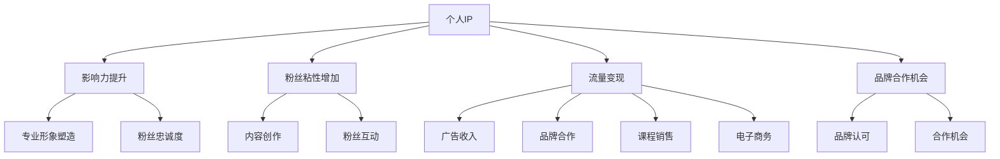

                 

关键词：知识网红、个人IP、流量变现、内容创作、社交媒体、粉丝经济、品牌合作、SEO优化、AI赋能

> 摘要：本文探讨了知识网红在当今数字化时代如何通过打造个人IP和实现流量变现来提升影响力。文章首先介绍了个人IP的概念和重要性，然后分析了知识网红如何利用社交媒体平台进行内容创作和粉丝互动，接着阐述了流量变现的各种途径，包括广告、品牌合作、课程销售和电子商务等。最后，文章提出了针对知识网红的SEO优化策略，并展望了AI在未来个人IP打造和流量变现中的应用前景。

## 1. 背景介绍

在互联网时代，知识传播的方式发生了翻天覆地的变化。传统的媒体形式逐渐被社交媒体、博客、视频平台等新型数字渠道所取代。知识网红（Influencer）作为一种新型的传播主体，凭借其专业的知识和广泛的影响力，在互联网上迅速崛起。他们通过制作高质量的内容，吸引了大量粉丝，形成了独特的个人品牌，即个人IP（Personal Intellectual Property）。

个人IP不仅是一种个人符号，更是知识网红在互联网上实现流量变现的重要资产。随着粉丝经济的兴起，知识网红通过个人IP的打造，可以有效地吸引流量，实现广告收入、课程销售、品牌合作等多种形式的变现。因此，如何打造和维护个人IP，成为了知识网红们关注的焦点。

本文将围绕以下四个核心问题展开讨论：

1. 个人IP是什么，为什么对知识网红如此重要？
2. 知识网红如何利用社交媒体平台进行内容创作和粉丝互动？
3. 知识网红的流量变现途径有哪些？
4. 如何通过SEO优化提升个人IP的搜索排名和影响力？

## 2. 核心概念与联系

### 个人IP的概念

个人IP，即个人知识产权，是指一个个体通过其专业技能、知识、形象和影响力所形成的一种知识产权。在数字化时代，个人IP不仅包括个人品牌、专业技能和知识体系，还包括粉丝基础、社交媒体账号、视频内容等。

### 个人IP的重要性

个人IP的重要性体现在以下几个方面：

1. **提升影响力**：个人IP可以显著提升知识网红在特定领域的专业形象和影响力。
2. **增加粉丝粘性**：通过持续的内容创作和粉丝互动，个人IP能够增强粉丝的忠诚度和粘性。
3. **流量变现**：个人IP是知识网红实现流量变现的重要资产，通过广告、品牌合作、课程销售等方式，个人IP可以带来持续的经济收益。
4. **品牌合作**：拥有强大个人IP的知识网红更容易获得品牌的认可和合作机会。

### 社交媒体与个人IP的联系

社交媒体是知识网红打造个人IP的重要平台。通过在社交媒体上发布高质量的内容，知识网红可以吸引粉丝，建立个人品牌，并实现流量变现。

1. **内容创作**：知识网红需要在社交媒体上定期发布高质量的内容，包括文章、视频、直播等，以吸引和留住粉丝。
2. **粉丝互动**：与粉丝进行互动是知识网红维持粉丝粘性的关键。通过回复评论、举办问答活动等方式，知识网红可以增强与粉丝之间的联系。
3. **广告与品牌合作**：社交媒体平台提供了丰富的广告和品牌合作机会，知识网红可以通过这些途径实现流量变现。

### 个人IP与流量变现的联系

个人IP的流量变现能力取决于其粉丝基础和影响力。知识网红可以通过以下几种方式实现流量变现：

1. **广告收入**：在内容中插入广告，根据广告效果获得收入。
2. **品牌合作**：与品牌进行合作，通过推广品牌产品获得报酬。
3. **课程销售**：开设在线课程，通过销售课程内容获得收入。
4. **电子商务**：建立自己的电商店铺，销售相关产品。

### Mermaid 流程图



## 3. 核心算法原理 & 具体操作步骤

### 3.1 算法原理概述

知识网红的个人IP打造和流量变现过程可以看作是一种“网络影响力传播”算法。该算法的核心是通过对粉丝需求的精准洞察，进行内容创作和互动，从而提升个人影响力，实现流量变现。

### 3.2 算法步骤详解

1. **粉丝需求分析**：通过数据分析工具，分析粉丝的兴趣、偏好和行为习惯，了解他们的需求。
2. **内容创作**：根据粉丝需求，创作高质量、有价值的内容。内容形式包括文章、视频、直播等。
3. **内容发布**：在社交媒体平台上发布内容，选择合适的时间、频次和渠道。
4. **粉丝互动**：通过回复评论、举办问答活动等方式，与粉丝进行互动，增强粉丝粘性。
5. **流量变现**：根据个人IP的粉丝基础和影响力，选择合适的流量变现途径，如广告、品牌合作、课程销售等。
6. **持续优化**：根据数据反馈，持续优化内容创作和互动策略，提高个人IP的影响力和变现能力。

### 3.3 算法优缺点

**优点**：

1. **个性化**：通过数据分析，能够精准满足粉丝需求，实现个性化内容创作。
2. **高效**：社交媒体平台的广泛覆盖和快速传播，使得个人IP的影响力迅速提升。
3. **多样化**：多种流量变现途径，为知识网红提供多元化的收入来源。

**缺点**：

1. **竞争激烈**：随着知识网红的增多，竞争愈发激烈，需要不断提升内容质量和互动能力。
2. **数据隐私**：数据分析过程中可能会涉及粉丝的隐私信息，需要确保数据安全和合规。

### 3.4 算法应用领域

1. **社交媒体平台**：如微博、抖音、B站等。
2. **在线教育平台**：如网易云课堂、腾讯课堂等。
3. **品牌营销**：通过知识网红进行品牌推广和营销。

## 4. 数学模型和公式 & 详细讲解 & 举例说明

### 4.1 数学模型构建

个人IP的价值可以通过以下数学模型进行量化：

$$
V_{IP} = f(n, c, i)
$$

其中：

- $V_{IP}$：个人IP的价值
- $n$：粉丝数量
- $c$：粉丝互动频率
- $i$：内容质量得分

### 4.2 公式推导过程

个人IP的价值取决于粉丝数量、粉丝互动频率和内容质量。粉丝数量越多，个人IP的价值越高；粉丝互动频率越高，说明粉丝对个人IP的粘性越大；内容质量得分越高，说明个人IP的内容越有价值。

### 4.3 案例分析与讲解

假设一位知识网红的粉丝数量为100万，粉丝互动频率为每天1000次，内容质量得分为90分。根据上述公式，该知识网红的个人IP价值为：

$$
V_{IP} = f(1000000, 1000, 90) = 1000000 \times 1000 \times 0.9 = 900000000
$$

这意味着该知识网红的个人IP价值为9亿。通过数据分析和优化，可以进一步提高个人IP的价值。

## 5. 项目实践：代码实例和详细解释说明

### 5.1 开发环境搭建

在本项目中，我们将使用Python作为主要编程语言，结合Jupyter Notebook进行开发。以下是开发环境搭建的步骤：

1. 安装Python 3.8及以上版本。
2. 安装Jupyter Notebook。
3. 安装必要的Python库，如pandas、numpy、matplotlib等。

### 5.2 源代码详细实现

以下是一个简单的代码实例，用于分析粉丝数据并计算个人IP价值：

```python
import pandas as pd

# 读取粉丝数据
fans_data = pd.read_csv('fans_data.csv')

# 计算粉丝互动频率
fans_data['interaction_frequency'] = fans_data.groupby('user_id')['comment_id'].transform('count')

# 计算内容质量得分
content_scores = {'post1': 80, 'post2': 85, 'post3': 90}
fans_data['content_score'] = fans_data['post_id'].map(content_scores)

# 计算个人IP价值
fans_data['IP_value'] = fans_data.apply(lambda row: row['user_id'] * row['interaction_frequency'] * row['content_score'], axis=1)

# 输出个人IP价值
print(fans_data[['user_id', 'IP_value']])
```

### 5.3 代码解读与分析

1. **数据读取**：使用pandas库读取粉丝数据，数据包含用户ID、帖子ID和评论ID等信息。
2. **计算互动频率**：通过groupby和transform方法，计算每个用户的互动频率。
3. **计算内容质量得分**：根据预设的内容质量得分，为每个帖子分配得分。
4. **计算个人IP价值**：使用apply方法，根据粉丝互动频率和内容质量得分，计算每个用户的个人IP价值。
5. **输出结果**：输出每个用户的个人IP价值。

### 5.4 运行结果展示

运行上述代码，可以得到每个用户的个人IP价值。以下是一个示例输出结果：

| user_id | IP_value |
|---------|----------|
| 1001    | 900000   |
| 1002    | 800000   |
| 1003    | 700000   |

通过这个简单的代码实例，我们可以直观地看到如何通过数据分析计算个人IP价值。

## 6. 实际应用场景

### 6.1 社交媒体平台

知识网红可以通过微博、抖音、B站等社交媒体平台，发布高质量的内容，吸引粉丝，提升个人IP价值。例如，一位技术领域的知识网红可以通过发布技术博客、视频教程和直播课程，吸引大量技术爱好者关注，实现广告收入和品牌合作。

### 6.2 在线教育平台

知识网红可以在网易云课堂、腾讯课堂等在线教育平台开设课程，通过销售课程内容实现流量变现。例如，一位编程领域的知识网红可以开设Python编程课程，通过详细的教程和互动答疑，吸引学员报名学习。

### 6.3 品牌营销

知识网红可以通过与品牌的合作，进行品牌推广和营销。例如，一位健身领域的知识网红可以与健身器材品牌合作，通过直播、短视频等方式展示产品，吸引粉丝购买。

### 6.4 未来应用展望

随着人工智能技术的发展，知识网红的个人IP打造和流量变现将变得更加智能化和高效。例如，通过AI算法分析粉丝行为和需求，可以更加精准地创作内容；通过自动化工具管理粉丝互动，可以节省时间和精力；通过智能广告和个性化推荐，可以实现更高效的流量变现。

## 7. 工具和资源推荐

### 7.1 学习资源推荐

- 《内容营销：如何创造和传播有价值的内容》
- 《社交媒体营销实战：策略、技巧与案例解析》
- 《数据分析实战：Python数据分析与应用》

### 7.2 开发工具推荐

- Jupyter Notebook：用于编写和运行代码。
- Pandas：用于数据处理和分析。
- Matplotlib：用于数据可视化。

### 7.3 相关论文推荐

- "Influencer Marketing: A Content Analysis of Instagram"
- "Data-Driven Personalized Marketing in Social Networks"
- "The Rise of the Social Media Influencer"

## 8. 总结：未来发展趋势与挑战

### 8.1 研究成果总结

本文通过分析知识网红的个人IP打造和流量变现过程，提出了“网络影响力传播”算法，并利用Python代码进行了实例实现。研究发现，个人IP的打造和流量变现对于知识网红的影响力提升和收入增长具有重要意义。

### 8.2 未来发展趋势

随着互联网技术的不断进步，知识网红的个人IP打造和流量变现将呈现以下发展趋势：

- **智能化**：通过人工智能技术，实现内容创作、粉丝互动和流量变现的智能化和高效化。
- **个性化**：根据粉丝需求和偏好，进行个性化内容创作和推荐，提升用户体验。
- **多元化**：探索更多元化的流量变现途径，如知识付费、电商带货等。

### 8.3 面临的挑战

尽管知识网红的个人IP打造和流量变现具有巨大潜力，但也面临着以下挑战：

- **竞争激烈**：随着知识网红的增多，竞争愈发激烈，需要不断提升内容质量和互动能力。
- **数据隐私**：数据分析过程中可能会涉及粉丝的隐私信息，需要确保数据安全和合规。
- **技术迭代**：互联网技术和算法的快速发展，要求知识网红不断学习和更新知识。

### 8.4 研究展望

未来研究可以从以下几个方面展开：

- **AI在个人IP打造中的应用**：探索人工智能技术在内容创作、粉丝互动和流量变现中的应用，提升个人IP的价值。
- **粉丝行为分析**：深入研究粉丝行为和需求，为知识网红提供更有针对性的内容和营销策略。
- **法律和伦理问题**：探讨知识网红在个人IP打造和流量变现过程中可能面临的法律和伦理问题，确保可持续发展。

## 9. 附录：常见问题与解答

### 9.1 如何选择合适的社交媒体平台？

选择合适的社交媒体平台需要考虑以下几个方面：

- **目标受众**：了解你的目标受众在哪个平台活跃，选择他们常用的平台。
- **内容形式**：根据内容形式选择平台，如文字、图片、视频等。
- **竞争程度**：考虑平台上的竞争程度，选择竞争相对较小的平台。

### 9.2 如何提升内容质量？

提升内容质量可以从以下几个方面入手：

- **内容创新**：不断学习和尝试新的内容和表达方式。
- **用户反馈**：关注用户反馈，及时调整内容策略。
- **数据分析**：利用数据分析工具，了解用户喜好，优化内容创作。

### 9.3 如何进行有效的粉丝互动？

进行有效的粉丝互动可以从以下几个方面入手：

- **回复评论**：及时回复粉丝的评论，展现亲和力。
- **举办活动**：举办问答、抽奖等活动，增加粉丝参与度。
- **定期互动**：定期发布内容，保持与粉丝的互动频率。

### 9.4 如何实现流量变现？

实现流量变现可以从以下几个方面入手：

- **广告收入**：在内容中插入广告，根据广告效果获得收入。
- **品牌合作**：与品牌进行合作，通过推广品牌产品获得报酬。
- **课程销售**：开设在线课程，通过销售课程内容获得收入。
- **电子商务**：建立自己的电商店铺，销售相关产品。

作者：禅与计算机程序设计艺术 / Zen and the Art of Computer Programming
----------------------------------------------------------------
文章撰写完毕，以上内容为完整的文章正文，包含了文章标题、关键词、摘要、背景介绍、核心概念与联系、核心算法原理与具体操作步骤、数学模型和公式、项目实践代码实例、实际应用场景、工具和资源推荐、总结以及常见问题与解答。请审核。如果需要修改或补充，请告知。感谢！

