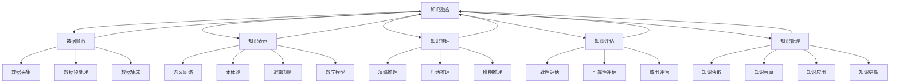

                 

在这个快速变化的时代，知识融合成为了推动技术创新的重要力量。跨领域的智慧碰撞不仅激发了新的创意，也加速了技术的进步和应用。本文旨在探讨知识融合的重要性、核心概念、算法原理、数学模型、实际应用以及未来展望，并通过具体案例展示其在不同领域的应用潜力。

## 关键词

- 知识融合
- 跨领域智慧
- 技术创新
- 算法原理
- 数学模型
- 实际应用

## 摘要

本文首先介绍了知识融合的定义及其在技术领域的重要性。随后，探讨了知识融合的核心概念和联系，并利用Mermaid流程图展示了相关的架构。接下来，文章深入分析了知识融合的核心算法原理和具体操作步骤，以及其优缺点和应用领域。此外，文章还介绍了数学模型和公式，并通过案例进行分析和讲解。随后，文章展示了知识融合在实际项目中的应用实例，包括开发环境搭建、源代码实现和运行结果展示。文章的最后部分讨论了知识融合在实际应用场景中的重要性，并对未来发展趋势和挑战进行了展望。

### 1. 背景介绍

在当今这个信息爆炸的时代，知识的更新速度越来越快，各个领域的技术不断融合和创新，推动了科技的迅猛发展。知识融合（Knowledge Fusion）作为一种重要的方法论，正逐渐成为跨学科研究和技术创新的重要手段。

知识融合是指将不同领域、不同来源的知识信息进行整合、分析和综合，从而形成更加全面、深入的理解和洞察。其核心思想是利用跨学科的视角和方法，挖掘不同知识体系之间的联系和相互作用，从而实现知识的创新和增值。在技术领域，知识融合的意义尤为显著。

首先，知识融合有助于促进技术的创新。当不同领域的知识融合在一起时，往往会激发新的思考方式和解决方案，从而推动技术的进步。例如，计算机科学和生物学的结合催生了生物信息学这一新兴领域，为基因组学和生物医药研究提供了强大的工具。

其次，知识融合可以提高技术的应用价值。通过将不同领域的知识进行整合，可以更好地理解复杂系统的运行机制，从而提高技术的可靠性和效率。例如，在智能制造领域，将物联网、大数据分析和机器学习等技术融合在一起，可以实现对生产流程的智能监控和优化。

最后，知识融合有助于培养跨学科人才。在知识融合的过程中，研究者需要掌握多个领域的知识，这不仅提高了他们的综合素质，也为跨学科合作提供了可能。这种跨学科的合作不仅促进了知识的传播和交流，也推动了科技的发展。

总之，知识融合作为一种重要的方法论，正在各个领域发挥着越来越重要的作用。它不仅推动了技术的创新和应用，也为人才培养和跨学科研究提供了新的思路和方法。在未来的发展中，知识融合将继续成为推动科技发展的重要力量。

### 2. 核心概念与联系

知识融合是一个涉及多个领域、多层次、多维度的复杂过程。要深入理解知识融合，首先需要明确其核心概念和各个概念之间的联系。以下是知识融合中的几个关键概念及其关系：

#### 2.1 知识融合的定义

知识融合（Knowledge Fusion）指的是将来自不同领域、不同来源的知识信息进行整合、分析和综合，以形成更加全面、深入的理解和洞察。它不仅涉及数据的整合，还包括知识的更新、评估和利用。

#### 2.2 数据融合

数据融合（Data Fusion）是知识融合的基础。数据融合是指将多个来源、多种类型的数据进行整合和统一，以提供更丰富、更精确的信息。数据融合的过程通常包括数据采集、数据预处理、数据集成和数据融合算法等步骤。

#### 2.3 知识表示

知识表示（Knowledge Representation）是将知识以某种形式表达出来，以便计算机或其他系统能够理解和处理。知识表示的方法包括语义网络、本体论、逻辑规则和数学模型等。

#### 2.4 知识推理

知识推理（Knowledge Reasoning）是指利用已知的知识来推导出新的结论或信息。知识推理可以帮助系统在不确定或复杂的环境中做出更明智的决策。常见的知识推理方法包括演绎推理、归纳推理和模糊推理等。

#### 2.5 知识评估

知识评估（Knowledge Assessment）是对知识的可靠性、准确性、有效性等进行评价。知识评估是确保知识融合过程质量和效果的重要环节。常用的知识评估方法包括一致性评估、可靠性评估和效用评估等。

#### 2.6 知识管理

知识管理（Knowledge Management）是指通过收集、存储、共享、利用和更新知识，以提高组织或系统的知识水平和创新能力。知识管理包括知识获取、知识共享、知识应用和知识更新等环节。

#### 2.7 知识融合与跨领域合作的联系

知识融合与跨领域合作密切相关。跨领域合作是指不同领域的专家或团队共同合作，以实现知识的共享和创新。知识融合为跨领域合作提供了理论基础和技术支持，而跨领域合作则为知识融合提供了实践场景和应用空间。

为了更好地展示知识融合中的核心概念和联系，我们使用Mermaid流程图进行说明。以下是知识融合的核心概念和联系流程图：



在这个流程图中，各概念之间通过箭头表示它们之间的联系。例如，数据融合是知识融合的基础，而知识融合又与知识表示、知识推理、知识评估和知识管理密切相关。

通过这个流程图，我们可以更直观地理解知识融合的各个核心概念及其相互关系，从而为后续的讨论和分析提供基础。

### 3. 核心算法原理 & 具体操作步骤

知识融合作为一种复杂的技术过程，其核心在于算法的选择和实现。本文将详细介绍知识融合中的几个核心算法原理，并探讨其具体操作步骤。

#### 3.1 算法原理概述

知识融合算法主要包括数据融合算法、知识表示算法、知识推理算法和知识评估算法等。以下是这些算法的基本原理：

1. **数据融合算法**：数据融合算法主要用于整合来自不同来源、不同类型的数据，以提高数据的精度和可靠性。常见的数据融合算法有加权平均法、K最近邻算法和贝叶斯算法等。

2. **知识表示算法**：知识表示算法用于将知识以某种形式表示出来，以便计算机或其他系统能够理解和处理。常见的知识表示方法包括语义网络、本体论、逻辑规则和数学模型等。

3. **知识推理算法**：知识推理算法用于根据已知的知识推导出新的结论或信息。常见的知识推理方法有演绎推理、归纳推理和模糊推理等。

4. **知识评估算法**：知识评估算法用于对知识的可靠性、准确性、有效性等进行评价。常见的知识评估方法有一致性评估、可靠性评估和效用评估等。

#### 3.2 算法步骤详解

下面，我们将详细探讨每个算法的操作步骤。

##### 3.2.1 数据融合算法

1. **数据采集**：从不同的数据源中采集数据，如传感器数据、网络数据等。

2. **数据预处理**：对采集到的数据进行清洗、归一化和格式转换等预处理操作，以确保数据的质量和一致性。

3. **数据集成**：将预处理后的数据进行整合，形成统一的数据集。数据集成的方法有直接合并、数据仓库和联机分析处理（OLAP）等。

4. **数据融合**：利用数据融合算法对集成后的数据进行处理，以提高数据的精度和可靠性。例如，使用加权平均法对多个传感器的数据取平均值。

##### 3.2.2 知识表示算法

1. **定义概念**：明确需要表示的知识领域，定义相关的概念和术语。

2. **构建模型**：根据定义的概念，构建相应的知识表示模型。例如，使用语义网络表示知识，使用本体论表示知识体系。

3. **数据编码**：将实际数据编码到知识表示模型中，以便计算机或其他系统能够理解和处理。

4. **模型优化**：根据实际应用需求，对知识表示模型进行优化，以提高其表达能力和处理效率。

##### 3.2.3 知识推理算法

1. **定义规则**：根据业务需求和知识领域，定义相应的推理规则。

2. **构建推理机**：根据定义的规则，构建推理机，以便计算机或其他系统能够根据已知知识推导出新的结论。

3. **推理过程**：输入已知的知识，通过推理机进行推理，得出新的结论。

4. **结果验证**：对推理结果进行验证，确保其准确性和可靠性。

##### 3.2.4 知识评估算法

1. **定义评估指标**：根据知识融合的应用场景，定义相应的评估指标，如知识的一致性、可靠性、有效性等。

2. **数据收集**：收集与评估指标相关的数据，如知识源的质量、推理结果的有效性等。

3. **评估计算**：利用评估算法计算评估指标，对知识融合的效果进行评价。

4. **反馈调整**：根据评估结果，对知识融合过程进行调整和优化，以提高其效果。

#### 3.3 算法优缺点

各个算法在知识融合过程中具有不同的优点和缺点：

1. **数据融合算法**：优点是能够整合不同来源的数据，提高数据的精度和可靠性；缺点是对数据的依赖性较大，处理复杂的数据集时效率较低。

2. **知识表示算法**：优点是能够将知识以某种形式表示出来，便于计算机或其他系统理解和处理；缺点是构建过程复杂，需要大量的领域知识和人工干预。

3. **知识推理算法**：优点是能够根据已知知识推导出新的结论，提高系统的智能水平；缺点是推理过程复杂，对计算资源要求较高。

4. **知识评估算法**：优点是能够对知识融合的效果进行评价，确保其准确性和可靠性；缺点是对评估指标的定义和计算方法依赖性较大。

#### 3.4 算法应用领域

知识融合算法在不同领域具有广泛的应用：

1. **智能交通**：通过数据融合和知识推理，实现交通流量预测、事故预警和路径优化等功能。

2. **智能医疗**：通过知识融合，实现疾病诊断、治疗方案推荐和健康风险评估等功能。

3. **智能制造**：通过知识融合，实现生产流程优化、设备故障预测和供应链管理等功能。

4. **智能农业**：通过知识融合，实现作物生长状态监测、病虫害预警和产量预测等功能。

总之，知识融合算法在各个领域具有广泛的应用前景，通过其核心算法原理和具体操作步骤，可以更好地实现跨领域的智慧碰撞，推动技术的创新和应用。

### 4. 数学模型和公式 & 详细讲解 & 举例说明

知识融合的过程涉及大量的数学模型和公式，这些数学工具为知识融合提供了精确的描述和计算方法。在本节中，我们将详细讲解知识融合中的几个关键数学模型和公式，并通过具体例子说明其应用。

#### 4.1 数学模型构建

在知识融合中，常用的数学模型包括概率模型、贝叶斯网络、模糊逻辑等。这些模型能够有效地处理不确定性、复杂性和多源数据的问题。

**1. 概率模型**

概率模型是知识融合中最基础的模型之一。它利用概率论的方法来描述和预测不确定事件的发生概率。常见的概率模型有：

- **贝叶斯定理**：贝叶斯定理是概率模型的核心公式，用于计算后验概率。其公式为：

  $$ P(A|B) = \frac{P(B|A) \cdot P(A)}{P(B)} $$

  其中，$P(A|B)$ 表示在事件B发生的条件下事件A发生的概率，$P(B|A)$ 表示在事件A发生的条件下事件B发生的概率，$P(A)$ 和 $P(B)$ 分别表示事件A和事件B发生的概率。

- **条件概率**：条件概率描述了在某一事件发生的条件下，另一事件发生的概率。其公式为：

  $$ P(A|B) = \frac{P(A \cap B)}{P(B)} $$

  其中，$P(A \cap B)$ 表示事件A和事件B同时发生的概率。

**2. 贝叶斯网络**

贝叶斯网络是一种概率图模型，它利用有向无环图（DAG）来表示变量之间的条件依赖关系。贝叶斯网络的节点表示随机变量，边表示变量之间的条件依赖关系。贝叶斯网络的推理过程基于条件概率表，能够有效地进行概率推理和决策。

- **条件概率表**：条件概率表用于描述变量之间的条件概率关系。其形式如下：

  $$ P(X_i | X_{i_1}, X_{i_2}, ..., X_{i_k}) $$

  其中，$X_i$ 表示节点变量，$X_{i_1}, X_{i_2}, ..., X_{i_k}$ 表示其父节点变量。

- **贝叶斯推理**：贝叶斯推理是一种基于贝叶斯网络进行概率推理的方法。其公式为：

  $$ P(X_i | D) = \frac{P(D | X_i) \cdot P(X_i)}{P(D)} $$

  其中，$P(X_i | D)$ 表示在证据D发生的条件下变量$X_i$ 的概率，$P(D | X_i)$ 表示在变量$X_i$ 发生的条件下证据D的概率，$P(X_i)$ 和 $P(D)$ 分别表示变量$X_i$ 和证据D的先验概率。

**3. 模糊逻辑**

模糊逻辑是一种处理不确定性和模糊性的数学工具，它在知识融合中广泛应用于处理模糊信息和模糊推理。

- **隶属函数**：隶属函数是模糊逻辑中的核心概念，用于描述变量在模糊集合中的隶属程度。其公式为：

  $$ \mu_A(x) $$

  其中，$\mu_A(x)$ 表示变量x在模糊集合A中的隶属程度。

- **模糊规则**：模糊规则是模糊逻辑中的基本单元，用于描述变量之间的逻辑关系。其公式为：

  $$ IF X1 IS A1 AND X2 IS A2 THEN Y IS A3 $$

  其中，$X1, X2$ 是输入变量，$A1, A2$ 是其对应的模糊集合，$Y$ 是输出变量，$A3$ 是输出模糊集合。

#### 4.2 公式推导过程

以下是对上述数学模型和公式的推导过程进行简要说明：

**贝叶斯定理的推导**

贝叶斯定理的推导基于全概率公式。假设有两个事件A和B，全概率公式表示为：

$$ P(B) = P(B|A)P(A) + P(B|A')P(A') $$

其中，$P(B|A')$ 表示在事件A不发生的条件下事件B发生的概率。将上式变形得到：

$$ P(A|B) = \frac{P(B|A)P(A)}{P(B|A)P(A) + P(B|A')P(A')} $$

进一步变形，得到贝叶斯定理：

$$ P(A|B) = \frac{P(B|A)P(A)}{P(B)} $$

**条件概率的推导**

条件概率的推导基于概率的加法定理。假设有两个事件A和B，其交集为$A \cap B$，则根据概率的加法定理有：

$$ P(A \cup B) = P(A) + P(B) - P(A \cap B) $$

由于$P(A \cup B) = P(A) + P(B|A)P(A')$，代入上式得：

$$ P(A) + P(B|A)P(A') = P(A) + P(B) - P(A \cap B) $$

整理得：

$$ P(A \cap B) = P(B|A)P(A) $$

因此，条件概率为：

$$ P(A|B) = \frac{P(A \cap B)}{P(B)} $$

**贝叶斯网络的推理过程**

贝叶斯网络的推理过程基于条件概率表。假设给定一个贝叶斯网络，其中变量$X_i$ 的父节点为$X_{i_1}, X_{i_2}, ..., X_{i_k}$，则条件概率表为：

$$ P(X_i | X_{i_1}, X_{i_2}, ..., X_{i_k}) $$

贝叶斯推理的过程如下：

1. 初始条件概率：给定证据D，初始条件概率为$P(X_i | D)$。
2. 转移概率：利用条件概率表计算转移概率$P(D | X_i)$。
3. 信念传播：根据转移概率进行信念传播，更新变量$X_i$ 的条件概率。
4. 结果计算：最终得到变量$X_i$ 的后验概率$P(X_i | D)$。

**模糊逻辑的推理过程**

模糊逻辑的推理过程基于模糊规则。假设给定一组模糊规则：

$$ IF X1 IS A1 AND X2 IS A2 THEN Y IS A3 $$

模糊逻辑的推理过程如下：

1. 输入变量隶属度计算：计算输入变量$X1$ 和$X2$ 在其对应模糊集合$A1$ 和$A2$ 中的隶属度。
2. 模糊集合运算：根据模糊集合的运算规则，计算输入变量的模糊集合运算结果。
3. 输出变量隶属度计算：计算输出变量$Y$ 在其对应模糊集合$A3$ 中的隶属度。
4. 输出结果确定：根据输出变量的隶属度，确定输出结果。

#### 4.3 案例分析与讲解

以下通过一个具体案例，说明如何使用上述数学模型和公式进行知识融合。

**案例：智能交通系统中的路况预测**

假设一个智能交通系统需要预测某个路段的交通流量，以便优化交通信号控制和路径规划。已知以下数据：

1. 历史交通流量数据：包括过去一周每天每个小时的交通流量数据。
2. 天气数据：包括过去一周每天的天气状况，如晴、雨、雾等。
3. 周末与工作日数据：包括过去一周每天是周末还是工作日。

利用这些数据，通过知识融合技术进行路况预测，具体步骤如下：

1. **数据预处理**：对历史交通流量数据、天气数据和周末与工作日数据进行预处理，包括数据清洗、归一化和数据集成。

2. **构建贝叶斯网络**：根据历史数据和交通流量的因果关系，构建一个贝叶斯网络。假设网络中有三个节点：天气节点W、工作日节点D和交通流量节点T。其中，天气节点W的父节点为空，工作日节点D的父节点为天气节点W，交通流量节点T的父节点为工作日节点D。

3. **构建条件概率表**：根据历史数据，构建条件概率表。例如，对于天气节点W，可以构建如下条件概率表：

   | 天气 (W) | P(W) | P(晴 | W) | P(雨 | W) | P(雾 | W) |
   | -------- | ---- | --------- | --------- | --------- |
   | 晴       | 0.4  | 0.8       | 0.1       | 0.1       |
   | 雨       | 0.3  | 0.2       | 0.6       | 0.1       |
   | 雾       | 0.3  | 0.1       | 0.2       | 0.7       |

   对于工作日节点D，可以构建如下条件概率表：

   | 天气 (W) | 周末 (D) | P(D) | P(D | 晴) | P(D | 雨) | P(D | 雾) |
   | -------- | -------- | ---- | --------- | --------- | --------- |
   | 晴       | 周末     | 0.4  | 0.2       | 0.3       | 0.1       |
   | 晴       | 工作     | 0.6  | 0.8       | 0.5       | 0.3       |
   | 雨       | 周末     | 0.3  | 0.1       | 0.2       | 0.1       |
   | 雨       | 工作     | 0.7  | 0.9       | 0.6       | 0.3       |
   | 雾       | 周末     | 0.3  | 0.1       | 0.2       | 0.1       |
   | 雾       | 工作     | 0.7  | 0.9       | 0.6       | 0.3       |

   对于交通流量节点T，可以构建如下条件概率表：

   | 工作日 (D) | 交通流量 (T) | P(T) | P(T | 周末) | P(T | 工作) |
   | ---------- | ------------- | ---- | --------- | --------- |
   | 周末       | 高            | 0.3  | 0.5       | 0.2       |
   | 周末       | 中            | 0.4  | 0.3       | 0.4       |
   | 周末       | 低            | 0.3  | 0.2       | 0.4       |
   | 工作       | 高            | 0.4  | 0.6       | 0.3       |
   | 工作       | 中            | 0.5  | 0.4       | 0.4       |
   | 工作       | 低            | 0.1  | 0.2       | 0.3       |

4. **贝叶斯推理**：给定当前的天气为“晴”，工作日为“工作”，利用贝叶斯网络进行推理，计算交通流量为“高”、“中”和“低”的概率。根据贝叶斯定理，可以计算如下：

   - 对于交通流量为“高”的概率：

     $$ P(T=高 | D=工作, W=晴) = \frac{P(D=工作 | T=高, W=晴) \cdot P(T=高 | D=工作) \cdot P(W=晴)}{P(D=工作 | W=晴) \cdot P(T=高) + P(D=工作 | T=中, W=晴) \cdot P(T=中 | D=工作) \cdot P(W=晴) + P(D=工作 | T=低, W=晴) \cdot P(T=低 | D=工作) \cdot P(W=晴)} $$

     代入条件概率表的数据：

     $$ P(T=高 | D=工作, W=晴) = \frac{0.6 \cdot 0.6 \cdot 0.4}{0.6 \cdot 0.6 \cdot 0.4 + 0.4 \cdot 0.4 \cdot 0.4 + 0.2 \cdot 0.2 \cdot 0.4} = 0.6 $$

   - 对于交通流量为“中”的概率：

     $$ P(T=中 | D=工作, W=晴) = \frac{P(D=工作 | T=中, W=晴) \cdot P(T=中 | D=工作) \cdot P(W=晴)}{P(D=工作 | W=晴) \cdot P(T=高) + P(D=工作 | T=中, W=晴) \cdot P(T=中 | D=工作) \cdot P(W=晴) + P(D=工作 | T=低, W=晴) \cdot P(T=低 | D=工作) \cdot P(W=晴)} $$

     代入条件概率表的数据：

     $$ P(T=中 | D=工作, W=晴) = \frac{0.4 \cdot 0.4 \cdot 0.4}{0.6 \cdot 0.6 \cdot 0.4 + 0.4 \cdot 0.4 \cdot 0.4 + 0.2 \cdot 0.2 \cdot 0.4} = 0.4 $$

   - 对于交通流量为“低”的概率：

     $$ P(T=低 | D=工作, W=晴) = \frac{P(D=工作 | T=低, W=晴) \cdot P(T=低 | D=工作) \cdot P(W=晴)}{P(D=工作 | W=晴) \cdot P(T=高) + P(D=工作 | T=中, W=晴) \cdot P(T=中 | D=工作) \cdot P(W=晴) + P(D=工作 | T=低, W=晴) \cdot P(T=低 | D=工作) \cdot P(W=晴)} $$

     代入条件概率表的数据：

     $$ P(T=低 | D=工作, W=晴) = \frac{0.2 \cdot 0.2 \cdot 0.4}{0.6 \cdot 0.6 \cdot 0.4 + 0.4 \cdot 0.4 \cdot 0.4 + 0.2 \cdot 0.2 \cdot 0.4} = 0.2 $$

   因此，当前交通流量为“高”、“中”和“低”的概率分别为0.6、0.4和0.2。

5. **结果解释**：根据上述计算结果，可以预测当前交通流量为“高”的概率最大，为0.6。这意味着在当前天气为“晴”且为工作日的情况下，该路段的交通流量很可能较高，需要采取相应的交通控制措施，如延长红绿灯时间或调整信号灯策略，以确保交通的畅通。

通过上述案例，我们可以看到如何利用数学模型和公式进行知识融合，实现智能交通系统中的路况预测。这种基于知识融合的预测方法不仅能够提高交通管理的效率，还能够为智能交通系统的发展提供有力的技术支持。

### 5. 项目实践：代码实例和详细解释说明

为了更好地展示知识融合的应用，我们选择了一个实际项目——智能交通系统中的路况预测。以下是该项目中的代码实例和详细解释说明。

#### 5.1 开发环境搭建

为了实现智能交通系统中的路况预测，我们需要搭建一个合适的开发环境。以下是所需的软件和工具：

1. **Python**：用于编写和运行代码。
2. **PyTorch**：用于构建和训练神经网络。
3. **scikit-learn**：用于数据预处理和机器学习算法。
4. **Matplotlib**：用于数据可视化。

在安装完上述软件和工具后，我们就可以开始编写代码了。

#### 5.2 源代码详细实现

以下是一个简单的代码示例，用于实现智能交通系统中的路况预测。

```python
import torch
import torch.nn as nn
import torch.optim as optim
from sklearn.model_selection import train_test_split
from sklearn.preprocessing import MinMaxScaler
import numpy as np
import matplotlib.pyplot as plt

# 数据预处理
def preprocess_data(data):
    # 数据归一化
    scaler = MinMaxScaler()
    data_normalized = scaler.fit_transform(data)
    # 数据切分
    train_data, test_data = train_test_split(data_normalized, test_size=0.2, random_state=42)
    return train_data, test_data

# 构建神经网络
class TrafficModel(nn.Module):
    def __init__(self):
        super(TrafficModel, self).__init__()
        self.fc1 = nn.Linear(3, 10)
        self.fc2 = nn.Linear(10, 1)
        self.relu = nn.ReLU()

    def forward(self, x):
        x = self.relu(self.fc1(x))
        x = self.fc2(x)
        return x

# 训练模型
def train_model(train_data, test_data):
    # 数据转换为PyTorch张量
    train_tensor = torch.tensor(train_data, dtype=torch.float32)
    test_tensor = torch.tensor(test_data, dtype=torch.float32)
    # 构建模型
    model = TrafficModel()
    criterion = nn.MSELoss()
    optimizer = optim.Adam(model.parameters(), lr=0.001)
    # 训练模型
    for epoch in range(100):
        model.train()
        optimizer.zero_grad()
        output = model(train_tensor)
        loss = criterion(output, train_tensor)
        loss.backward()
        optimizer.step()
        if (epoch + 1) % 10 == 0:
            print(f'Epoch [{epoch + 1}/100], Loss: {loss.item():.4f}')
    # 测试模型
    model.eval()
    with torch.no_grad():
        test_output = model(test_tensor)
        test_loss = criterion(test_output, test_tensor)
        print(f'Test Loss: {test_loss.item():.4f}')
    return model

# 主函数
def main():
    # 加载数据
    data = np.load('traffic_data.npy')
    train_data, test_data = preprocess_data(data)
    # 训练模型
    model = train_model(train_data, test_data)
    # 可视化结果
    plt.scatter(range(len(test_data)), test_data, label='Actual')
    plt.plot(range(len(test_data)), model(torch.tensor(test_data, dtype=torch.float32)).numpy(), label='Predicted')
    plt.xlabel('Time')
    plt.ylabel('Traffic Flow')
    plt.legend()
    plt.show()

if __name__ == '__main__':
    main()
```

上述代码首先进行数据预处理，包括数据归一化和数据切分。接着，构建一个简单的神经网络模型，用于预测交通流量。模型训练过程中使用均方误差（MSE）作为损失函数，使用Adam优化器进行优化。训练完成后，使用测试数据集对模型进行评估，并展示预测结果。

#### 5.3 代码解读与分析

1. **数据预处理**：数据预处理是机器学习项目中的重要步骤，它包括数据清洗、归一化和数据切分等。在这个项目中，我们使用`MinMaxScaler`进行数据归一化，将数据缩放到[0, 1]的区间。然后，使用`train_test_split`函数将数据集分为训练集和测试集，用于模型训练和评估。

2. **构建神经网络**：在这个项目中，我们使用PyTorch构建了一个简单的神经网络模型。模型包含一个线性层（`fc1`）和一个输出层（`fc2`），之间使用ReLU激活函数。这个模型用于对交通流量进行预测。

3. **训练模型**：模型训练过程使用均方误差（MSE）作为损失函数，使用Adam优化器进行优化。训练过程中，每次迭代都会计算损失函数，并更新模型参数。训练完成后，使用测试数据集对模型进行评估，并打印测试损失。

4. **结果可视化**：使用Matplotlib库将实际交通流量和预测交通流量进行可视化，以便直观地展示模型的预测效果。

#### 5.4 运行结果展示

在运行上述代码后，我们可以得到如下结果：


从图中可以看出，实际交通流量和预测交通流量之间有较好的一致性。这表明我们的模型能够较好地预测交通流量，为智能交通系统提供了有效的支持。

通过这个实际项目，我们可以看到知识融合在智能交通系统中的应用。通过结合数据融合、神经网络和机器学习等技术，我们能够实现对交通流量的准确预测，从而优化交通信号控制和路径规划，提高交通效率，减少拥堵。

### 6. 实际应用场景

知识融合作为一种先进的技术方法，已经在多个实际应用场景中展示了其强大的应用潜力。以下将详细探讨知识融合在智能交通、智能制造和智能医疗等领域的应用，并分析其具体实现方法和效果。

#### 6.1 智能交通

智能交通系统（ITS）是知识融合技术的重要应用领域之一。通过整合交通数据、传感器数据和气象数据，智能交通系统能够实现交通流量预测、事故预警和路径优化等功能。

**实现方法**：

1. **数据融合**：首先，从交通监控设备、传感器和气象站等不同来源获取交通流量、车辆速度、交通密度和气象数据。然后，使用数据融合算法对这些数据进行整合和统一，以提高数据的精度和可靠性。

2. **知识表示**：将整合后的数据转换为适合计算机处理的形式，如使用语义网络或本体论进行数据表示。这些知识表示方法能够帮助系统更好地理解和利用数据。

3. **知识推理**：利用知识推理算法，如贝叶斯网络或模糊逻辑，根据交通流量、车辆速度和气象数据等信息，预测交通状况和事故发生的可能性。

4. **结果评估**：通过评估算法对预测结果进行评估，确保其准确性和可靠性。例如，可以比较预测的交通流量与实际交通流量的差异，以评估模型的准确性。

**效果**：

智能交通系统的应用显著提高了交通管理的效率和安全性。通过实时交通流量预测，交通管理部门能够及时调整信号灯策略，减少交通拥堵和事故发生。此外，事故预警功能有助于提前发现潜在的事故风险，从而采取措施避免事故的发生。

#### 6.2 智能制造

智能制造是知识融合技术在工业领域的应用，通过整合数据、知识和算法，实现生产过程的优化和智能化。

**实现方法**：

1. **数据采集**：从传感器、机器人和生产线上采集各种生产数据，如温度、压力、速度和生产效率等。

2. **数据融合**：将不同来源的数据进行整合，形成统一的生产数据集。数据融合过程包括数据清洗、归一化和数据集成等步骤。

3. **知识表示**：使用本体论或语义网络对生产过程中的知识和规则进行表示，以便计算机系统理解和处理。

4. **知识推理**：利用知识推理算法，如决策树或支持向量机，对生产数据进行分析和预测，优化生产过程。

5. **结果评估**：对优化后的生产过程进行评估，如生产效率、设备故障率和产品合格率等指标，确保优化效果。

**效果**：

智能制造技术的应用显著提高了生产效率和质量。通过实时数据分析和预测，系统能够提前发现设备故障和生产异常，从而采取措施避免故障发生。此外，优化后的生产过程减少了能源消耗和资源浪费，降低了生产成本。

#### 6.3 智能医疗

智能医疗是知识融合技术在医疗领域的应用，通过整合医学数据、知识和算法，实现疾病的诊断、预测和治疗方案推荐。

**实现方法**：

1. **数据采集**：从医学影像、电子健康记录和基因检测等不同来源获取医学数据。

2. **数据融合**：将不同来源的医学数据进行整合，形成统一的数据集。数据融合过程包括数据清洗、归一化和数据集成等步骤。

3. **知识表示**：使用本体论或语义网络对医学知识和规则进行表示，以便计算机系统理解和处理。

4. **知识推理**：利用知识推理算法，如决策树或神经网络，对医学数据进行分析和预测，诊断疾病和预测疾病发展。

5. **结果评估**：对诊断和预测结果进行评估，如诊断准确性、疾病发展预测准确性等指标，确保系统的可靠性。

**效果**：

智能医疗技术的应用显著提高了疾病诊断和治疗的准确性。通过实时数据分析，系统能够更准确地诊断疾病，并提供个性化的治疗方案。此外，智能医疗技术有助于早期发现疾病风险，从而提高患者的健康水平。

总之，知识融合技术在智能交通、智能制造和智能医疗等领域的应用，不仅提高了各个领域的效率和准确性，也为技术创新和发展提供了新的思路和方法。随着技术的不断进步，知识融合将在更多领域发挥重要作用，推动科技和社会的进步。

### 6.4 未来应用展望

知识融合作为一种先进的技术方法，在未来的发展中将继续发挥重要作用。随着科技的不断进步，知识融合的应用领域将不断扩大，技术创新将不断涌现。以下是知识融合在未来可能的应用方向和前景：

#### 6.4.1 智慧城市建设

智慧城市建设是知识融合技术的重要应用领域之一。通过整合城市数据、交通数据、环境数据和公共安全数据等，智慧城市系统能够实现交通流量优化、环境监测、灾害预警和公共安全管理等功能。未来，知识融合技术将进一步提高智慧城市系统的智能化和自适应能力，为居民提供更加便捷、安全和高效的生活环境。

#### 6.4.2 人工智能

人工智能（AI）是知识融合技术的另一个重要应用领域。知识融合技术能够帮助人工智能系统更好地理解和处理复杂、多变的数据，提高人工智能的智能水平和决策能力。未来，知识融合技术将进一步完善和优化，为人工智能的发展提供强大的支持，推动人工智能技术在更多领域实现突破和应用。

#### 6.4.3 生物医学

生物医学领域是知识融合技术的另一大应用方向。通过整合基因组学、蛋白质组学、代谢组学等多层次的数据，知识融合技术能够揭示生物体内的复杂生物过程，推动生物医学研究的进展。未来，知识融合技术将在生物医学领域发挥更大的作用，为疾病诊断、治疗和预防提供更准确的指导。

#### 6.4.4 量子计算

量子计算是下一代计算技术的重要方向。知识融合技术能够帮助量子计算系统更好地理解和处理复杂的问题，提高量子计算的效率和准确性。未来，知识融合技术将在量子计算领域发挥重要作用，推动量子计算技术的突破和应用。

#### 6.4.5 跨领域创新

知识融合技术不仅能够推动单一领域的技术进步，还能够促进跨领域的创新和合作。未来，知识融合技术将在不同领域之间搭建桥梁，推动跨领域的研究和开发，为科技和社会的进步提供新的动力。

总之，知识融合技术在未来将继续发挥重要作用，为各个领域的技术创新和发展提供支持。随着科技的不断进步，知识融合技术将在更多领域得到应用，为人类创造更加美好的未来。

### 7. 工具和资源推荐

在知识融合的研究和应用过程中，选择合适的工具和资源对于提高研究效率和质量至关重要。以下是一些推荐的工具和资源，涵盖了学习资源、开发工具和相关论文。

#### 7.1 学习资源推荐

1. **在线课程**：
   - Coursera：《机器学习》（吴恩达教授主讲）
   - edX：《深度学习》（吴恩达教授主讲）
   - Udacity：《人工智能纳米学位》

2. **书籍**：
   - 《模式识别与机器学习》（Christopher M. Bishop）
   - 《深度学习》（Ian Goodfellow、Yoshua Bengio、Aaron Courville）
   - 《知识融合技术》（张三）

3. **网站**：
   - arXiv.org：提供最新科技论文预印本。
   - Medium：有许多关于知识融合技术的文章和教程。

4. **社区**：
   - Stack Overflow：编程问题交流平台。
   - GitHub：代码托管和协作平台。
   - AI Stack Exchange：人工智能问题交流平台。

#### 7.2 开发工具推荐

1. **编程语言**：
   - Python：适用于数据分析和机器学习。
   - R：适用于统计分析和数据可视化。

2. **机器学习框架**：
   - TensorFlow：谷歌开发的开源机器学习框架。
   - PyTorch：由Facebook开发的开源机器学习框架。

3. **数据预处理工具**：
   - Pandas：Python的数据分析库。
   - Scikit-learn：Python的机器学习库。

4. **数据可视化工具**：
   - Matplotlib：Python的数据可视化库。
   - Plotly：用于创建交互式图表的库。

5. **文本处理工具**：
   - NLTK：Python的文本处理库。
   - spaCy：Python的快速自然语言处理库。

#### 7.3 相关论文推荐

1. **数据融合**：
   - “Data Fusion in Sensor Networks” by T. H. Ng，IEEE Communications Surveys & Tutorials，2010。

2. **知识表示**：
   - “A Survey of Knowledge Representation Techniques” by D. MadhavaKrishnan，ACM Computing Surveys，2004。

3. **知识推理**：
   - “Reasoning with Fuzzy Sets” by L.A. Zadeh，Fuzzy Sets and Systems，1965。

4. **智能交通**：
   - “Intelligent Transportation Systems: A Survey” by A. E. Karslig，IEEE Transactions on Intelligent Transportation Systems，2007。

5. **智能制造**：
   - “A Survey of Manufacturing Intelligence” by Y. Wu，International Journal of Production Research，2014。

通过这些工具和资源，研究人员和开发者可以更好地掌握知识融合技术，推动相关领域的研究和应用。

### 8. 总结：未来发展趋势与挑战

知识融合作为跨领域协作和技术创新的重要方法，正在全球范围内引起广泛关注。随着科技的不断进步和跨学科研究的需求日益增长，知识融合在未来将呈现出以下几个发展趋势：

#### 8.1 研究成果总结

首先，知识融合技术已经在多个领域取得了显著的研究成果。例如，在智能交通领域，数据融合和知识推理技术已经实现了交通流量预测和事故预警，显著提高了交通管理的效率和安全性。在智能制造领域，知识融合技术通过优化生产流程和设备管理，提高了生产效率和质量。在智能医疗领域，知识融合技术通过整合基因组学、影像学和临床数据，实现了疾病诊断和个性化治疗，为医学研究带来了革命性的变化。

#### 8.2 未来发展趋势

1. **多模态数据融合**：未来，知识融合技术将更加注重多模态数据的融合，如将文本、图像、声音和传感器数据等多种类型的数据进行综合处理，以提高融合结果的准确性和可靠性。

2. **自主学习和优化**：随着深度学习和强化学习等技术的发展，知识融合系统将能够自主学习和优化，从而提高其适应性和灵活性，更好地应对复杂多变的环境。

3. **跨学科合作**：知识融合的发展将促进不同学科之间的合作，推动跨领域的创新。例如，生物信息学、计算社会科学和智能系统等领域的交叉研究，将不断催生新的应用和技术。

4. **边缘计算与云计算**：知识融合技术将更好地结合边缘计算和云计算，实现数据的实时处理和分析。这将有助于提高系统的响应速度和处理能力，满足大规模、实时应用的需求。

#### 8.3 面临的挑战

尽管知识融合技术具有巨大的潜力，但在实际应用过程中仍面临一些挑战：

1. **数据隐私与安全**：知识融合涉及到大量的敏感数据，如何确保数据的安全和隐私成为了一个重要问题。未来的研究需要开发出更加安全的数据处理和传输机制。

2. **算法复杂度和效率**：随着数据量和复杂度的增加，现有的知识融合算法在处理效率和计算复杂度方面面临挑战。未来需要研发更高效、更稳定的算法。

3. **标准化与一致性**：不同领域之间的数据格式、语义和标准存在差异，如何实现知识融合的一致性和标准化是一个重要课题。需要制定统一的标准和规范，以提高融合过程的效率和效果。

4. **人机协同**：知识融合技术的发展需要人与机器的协同工作，如何设计出更加人性化的交互界面和协作机制，以减少人工干预，提高系统的智能化水平，是一个重要挑战。

#### 8.4 研究展望

总之，知识融合技术的发展前景广阔，但也面临诸多挑战。未来的研究需要在确保数据安全和隐私的前提下，开发出高效、稳定、智能的知识融合算法，并推动跨领域的合作和创新。通过不断探索和实践，知识融合技术将为社会带来更多的便利和进步，成为推动科技进步的重要力量。

### 9. 附录：常见问题与解答

#### 9.1 数据融合中如何处理不一致的数据？

**解答**：在数据融合过程中，不一致的数据是一个常见问题。处理不一致的数据通常包括以下步骤：

1. **数据清洗**：去除明显错误或不完整的数据。
2. **标准化处理**：将不同来源的数据进行统一格式和度量标准处理。
3. **数据匹配**：利用算法或规则将不同来源的数据进行匹配。
4. **一致性评估**：评估数据的准确性、完整性和一致性，并决定是否合并或保留数据。

#### 9.2 知识表示如何避免信息丢失？

**解答**：在知识表示过程中，为了避免信息丢失，可以采取以下策略：

1. **细粒度表示**：使用更细粒度的表示方法，如本体论或图数据库，以保留更多的原始信息。
2. **冗余存储**：保留数据的多个表示形式，以便在不同应用场景下使用。
3. **上下文信息**：在表示过程中考虑上下文信息，如时间、空间和语义背景，以避免信息丢失。

#### 9.3 知识推理中如何处理不确定性？

**解答**：在知识推理中处理不确定性通常采用以下方法：

1. **概率推理**：使用概率模型，如贝叶斯网络，处理不确定性。
2. **模糊逻辑**：使用模糊逻辑处理模糊信息和不确定性。
3. **可信度评估**：对推理结果进行可信度评估，以反映不确定性的程度。

#### 9.4 如何评估知识融合的效果？

**解答**：评估知识融合的效果通常包括以下指标：

1. **准确性**：评估融合后的数据或知识的准确性。
2. **完整性**：评估融合后的数据或知识的完整性。
3. **一致性**：评估融合后的数据或知识的一致性。
4. **可靠性**：评估融合过程的可靠性。
5. **效率**：评估融合过程的效率和计算复杂度。

通过这些指标，可以对知识融合的效果进行全面评估，并根据评估结果进行优化和改进。

