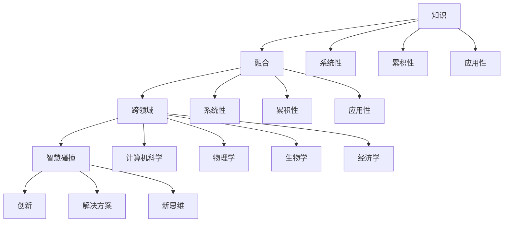

                 

关键词：知识融合、跨领域、智慧碰撞、AI、软件架构、编程方法论、技术趋势

> 摘要：本文将深入探讨知识融合在跨领域智慧碰撞中的重要性。通过分析知识融合的核心概念、关键算法原理、数学模型，以及实际项目实践，本文旨在为读者提供对知识融合的全面理解，并展望其未来的发展趋势与挑战。

## 1. 背景介绍

在当今快速发展的信息技术时代，各领域的知识不断交叉融合，推动了新技术的诞生和发展。然而，知识融合并不是一件容易的事。不同领域的知识体系、术语、方法论往往存在显著差异，这使得跨领域知识融合成为一个极具挑战性的问题。

知识融合的目的是将不同领域的知识有机结合起来，形成一种新的知识体系，从而提高知识的利用效率和解决问题的能力。这不仅仅是一个技术问题，更是一个涉及方法论和哲学层面的综合性课题。

跨领域的智慧碰撞，是指将不同领域的知识、技术和方法进行有机结合，产生新的创意和解决方案。在这个过程中，知识融合起到了关键作用，它不仅为创新提供了新的思路和工具，也为各领域的发展注入了新的活力。

本文将围绕知识融合这一核心主题，从以下几个部分进行探讨：

1. 核心概念与联系
2. 核心算法原理与具体操作步骤
3. 数学模型和公式详细讲解与举例
4. 项目实践：代码实例与详细解释
5. 实际应用场景
6. 未来应用展望
7. 工具和资源推荐
8. 总结：未来发展趋势与挑战
9. 附录：常见问题与解答

通过本文的探讨，我们希望能够为读者提供对知识融合的深刻理解，并激发读者在跨领域知识融合中的创新思维。

## 2. 核心概念与联系

在讨论知识融合之前，我们首先需要明确几个核心概念，这些概念是理解知识融合的基础。

### 2.1 知识

知识可以理解为通过学习、研究、实践等途径获得的信息、技能和认识。它具有三个主要特征：系统性、累积性和应用性。系统性指的是知识是经过系统组织和结构化的信息；累积性指的是知识可以通过传承和积累不断丰富和完善；应用性则强调知识在解决实际问题中的重要性。

### 2.2 融合

融合是指将不同的事物或元素通过一定的方法或技术结合起来，形成一种新的整体。在知识融合的语境下，融合意味着将不同领域的知识、理论和实践方法进行有机结合，以形成新的知识体系或创新解决方案。

### 2.3 跨领域

跨领域指的是跨越不同学科或领域进行交流和合作。在跨领域知识融合中，通常需要涉及多个学科的知识和技能，例如计算机科学、物理学、生物学、经济学等。

### 2.4 智慧碰撞

智慧碰撞是指不同领域的智慧或思想通过交流、碰撞和融合，产生新的创意和解决方案的过程。智慧碰撞强调的是不同领域专家之间的合作和互动，通过彼此的思维交流和观点碰撞，激发新的思考和创新。

### 2.5 核心概念原理和架构

为了更好地理解知识融合，我们引入一个简单的 Mermaid 流程图来展示核心概念和它们之间的联系：



在这个流程图中，我们可以看到知识、融合、跨领域和智慧碰撞是如何相互关联的。知识是融合的基础，融合是跨领域知识整合的过程，而智慧碰撞则是通过跨领域的知识融合来产生创新和解决方案的关键环节。

### 2.6 跨领域知识融合的关键步骤

跨领域知识融合通常包括以下几个关键步骤：

1. **需求分析**：明确融合的目标和需求，理解不同领域之间的差异和联系。
2. **知识收集**：搜集相关领域的知识资源，包括文献、报告、论文、案例等。
3. **知识整合**：将不同领域的知识进行整合，形成一种新的知识体系。
4. **方案设计**：根据整合的知识，设计创新的解决方案或产品。
5. **实施与优化**：实施解决方案，并根据反馈进行不断优化和完善。

通过这些关键步骤，跨领域知识融合能够有效地实现知识的整合和创新，为各领域的发展提供新的动力。

在下一部分中，我们将进一步探讨核心算法原理，以及如何具体操作这些算法来促进知识融合。

## 3. 核心算法原理 & 具体操作步骤

### 3.1 算法原理概述

在知识融合的过程中，核心算法起到了至关重要的作用。这些算法不仅能够处理大量的跨领域数据，还能够挖掘出潜在的知识联系和模式。以下是一些常用的核心算法原理：

1. **机器学习算法**：包括监督学习、无监督学习和强化学习。这些算法可以通过训练模型来发现数据中的规律和联系，从而实现知识融合。
2. **数据挖掘算法**：如聚类、分类、关联规则挖掘等，这些算法用于从大量数据中提取有价值的信息，帮助理解不同领域的知识。
3. **自然语言处理（NLP）算法**：包括词向量模型、句法分析、语义分析等，这些算法能够处理文本数据，提取文本中的知识和信息。
4. **深度学习算法**：如卷积神经网络（CNN）、循环神经网络（RNN）、生成对抗网络（GAN）等，这些算法能够处理复杂的跨领域数据，并从中提取深层次的规律。

### 3.2 算法步骤详解

为了更好地理解这些算法，下面我们将详细解释每个算法的基本步骤。

#### 3.2.1 机器学习算法

**步骤 1：数据预处理**：包括数据清洗、归一化、特征提取等，目的是将原始数据转化为适合模型训练的形式。

**步骤 2：模型选择**：根据问题的性质和需求，选择合适的机器学习模型，如线性回归、决策树、支持向量机等。

**步骤 3：模型训练**：使用已标记的训练数据来训练模型，模型会根据数据调整内部参数，以最小化预测误差。

**步骤 4：模型评估**：使用测试数据集来评估模型的性能，常用的评估指标包括准确率、召回率、F1值等。

**步骤 5：模型优化**：根据评估结果，调整模型参数或选择更合适的模型，以提高性能。

#### 3.2.2 数据挖掘算法

**步骤 1：数据预处理**：与机器学习类似，数据预处理是数据挖掘的重要步骤。

**步骤 2：选择算法**：根据问题的性质和需求，选择合适的数据挖掘算法，如聚类算法、分类算法、关联规则挖掘算法等。

**步骤 3：算法实现**：使用选定的算法对数据进行处理，提取潜在的知识和模式。

**步骤 4：结果解释**：对挖掘结果进行解释和验证，确保其准确性和实用性。

#### 3.2.3 自然语言处理（NLP）算法

**步骤 1：文本预处理**：包括分词、去停用词、词性标注等，将原始文本数据转化为计算机可以处理的格式。

**步骤 2：词向量表示**：使用词向量模型（如 Word2Vec、BERT）将文本中的词语转换为向量表示。

**步骤 3：句法分析**：使用句法分析算法（如依存句法分析、语法树生成等）来理解句子的结构。

**步骤 4：语义分析**：使用语义分析算法（如语义角色标注、实体识别等）来提取文本中的语义信息。

**步骤 5：结果应用**：将提取的语义信息应用于实际场景，如文本分类、情感分析、问答系统等。

#### 3.2.4 深度学习算法

**步骤 1：数据预处理**：与前面提到的数据预处理步骤类似。

**步骤 2：模型构建**：根据问题的需求，构建合适的深度学习模型（如 CNN、RNN、GAN 等）。

**步骤 3：模型训练**：使用大量的训练数据进行模型训练，模型会自动调整内部参数，以最小化预测误差。

**步骤 4：模型优化**：通过调整模型参数和结构来优化模型的性能。

**步骤 5：模型评估**：使用测试数据集评估模型的性能，并与其他模型进行比较。

#### 3.3 算法优缺点

每种算法都有其优缺点，以下是对常见算法优缺点的简要概述：

- **机器学习算法**：
  - 优点：算法模型简单，易于理解和实现；能够处理大量数据，且性能稳定。
  - 缺点：对数据质量和特征提取依赖性较高；模型泛化能力较弱。
  
- **数据挖掘算法**：
  - 优点：能够处理复杂的数据类型和大规模数据集；能够发现潜在的知识和模式。
  - 缺点：算法实现复杂，对数据质量和预处理要求较高；结果解释和验证较为困难。
  
- **自然语言处理（NLP）算法**：
  - 优点：能够处理文本数据，提取语义信息；应用广泛，如文本分类、情感分析等。
  - 缺点：对语言理解和文本理解的复杂性要求较高；计算资源消耗大。
  
- **深度学习算法**：
  - 优点：能够处理复杂的数据类型和大规模数据集；模型性能优异，泛化能力强。
  - 缺点：算法实现复杂，对计算资源要求高；对数据质量和预处理依赖性较高。

#### 3.4 算法应用领域

这些算法在不同的领域有着广泛的应用，以下是一些典型的应用场景：

- **机器学习算法**：应用于金融风控、推荐系统、图像识别等领域。
- **数据挖掘算法**：应用于商业智能、医疗数据分析、环境监测等领域。
- **自然语言处理（NLP）算法**：应用于搜索引擎、智能客服、文本生成等领域。
- **深度学习算法**：应用于自动驾驶、图像处理、语音识别等领域。

在下一部分中，我们将深入探讨数学模型和公式，以及它们在知识融合中的应用。

## 4. 数学模型和公式 & 详细讲解 & 举例说明

### 4.1 数学模型构建

在知识融合中，数学模型起到了关键作用。这些模型不仅能够描述和理解复杂的现象，还能够通过定量分析提供决策支持。以下是一些常见的数学模型：

#### 4.1.1 神经网络模型

神经网络模型是深度学习中常用的数学模型。一个基本的神经网络模型包括输入层、隐藏层和输出层。每个层由多个神经元组成，神经元之间通过权重和偏置连接。神经元的输出通过激活函数进行处理。

神经网络模型的基本公式如下：

$$
z = \sum_{i=1}^{n} w_i * x_i + b
$$

$$
a = \sigma(z)
$$

其中，$z$ 是神经元的输入，$w_i$ 是权重，$b$ 是偏置，$x_i$ 是输入特征，$\sigma$ 是激活函数，$a$ 是神经元的输出。

#### 4.1.2 贝叶斯模型

贝叶斯模型是概率统计中常用的模型，它基于贝叶斯定理来计算后验概率。在知识融合中，贝叶斯模型可以用于概率估计和不确定性分析。

贝叶斯模型的基本公式如下：

$$
P(A|B) = \frac{P(B|A) * P(A)}{P(B)}
$$

其中，$P(A|B)$ 是在已知事件 $B$ 发生的条件下，事件 $A$ 发生的概率；$P(B|A)$ 是在已知事件 $A$ 发生的条件下，事件 $B$ 发生的概率；$P(A)$ 和 $P(B)$ 分别是事件 $A$ 和事件 $B$ 发生的概率。

#### 4.1.3 决策树模型

决策树模型是一种基于树形结构的预测模型，它通过一系列决策规则来对数据进行分类或回归。

决策树模型的基本公式如下：

$$
f(x) = \sum_{i=1}^{n} c_i * I(R_i(x))
$$

其中，$f(x)$ 是决策树的输出，$c_i$ 是类别或值，$R_i(x)$ 是第 $i$ 个决策规则，$I$ 是指示函数，当条件满足时输出 1，否则输出 0。

### 4.2 公式推导过程

为了更好地理解这些数学模型，我们下面简要介绍其推导过程。

#### 4.2.1 神经网络模型

神经网络的推导基于多层感知机（MLP）的原理。多层感知机是一个前馈神经网络，其中每个神经元都受到前面一层神经元的输入，并通过权重和偏置进行加权求和。推导过程主要涉及线性代数和微积分。

1. **输入层到隐藏层的推导**：

设输入层为 $X$，隐藏层为 $H$，输出层为 $Y$。设 $w$ 为权重矩阵，$b$ 为偏置向量，$a$ 为激活函数。则：

$$
z = wX + b
$$

$$
h = a(z)
$$

2. **隐藏层到输出层的推导**：

设隐藏层为 $H$，输出层为 $Y$。设 $W$ 为权重矩阵，$B$ 为偏置向量，$a$ 为激活函数。则：

$$
z' = W H + B
$$

$$
y = a(z')
$$

#### 4.2.2 贝叶斯模型

贝叶斯模型的推导基于贝叶斯定理。贝叶斯定理描述了条件概率和边缘概率之间的关系。

设事件 $A$ 和事件 $B$，则贝叶斯定理可以表示为：

$$
P(A|B) = \frac{P(B|A) * P(A)}{P(B)}
$$

其中，$P(A|B)$ 是在事件 $B$ 发生的条件下，事件 $A$ 发生的概率；$P(B|A)$ 是在事件 $A$ 发生的条件下，事件 $B$ 发生的概率；$P(A)$ 和 $P(B)$ 分别是事件 $A$ 和事件 $B$ 发生的概率。

#### 4.2.3 决策树模型

决策树模型的推导基于熵和信息增益的概念。熵是衡量随机变量不确定性的量度，信息增益是衡量特征选择效果的一个指标。

1. **熵的计算**：

设随机变量 $X$ 有 $k$ 个可能的取值，分别为 $x_1, x_2, ..., x_k$，则 $X$ 的熵可以表示为：

$$
H(X) = -\sum_{i=1}^{k} p(x_i) * \log_2 p(x_i)
$$

其中，$p(x_i)$ 是取值为 $x_i$ 的概率。

2. **信息增益的计算**：

设特征 $A$ 有 $m$ 个可能的取值，分别为 $a_1, a_2, ..., a_m$，则在特征 $A$ 的条件下，随机变量 $X$ 的熵为 $H(X|A)$，则特征 $A$ 的信息增益可以表示为：

$$
IG(A, X) = H(X) - H(X|A)
$$

### 4.3 案例分析与讲解

为了更好地理解这些数学模型，我们通过一个实际案例进行讲解。

#### 4.3.1 案例背景

假设我们要对一组客户进行分类，以判断他们是否愿意购买某种产品。我们使用以下特征：

- 年龄（Age）
- 收入（Income）
- 职业（Occupation）

我们希望通过这些特征建立一个分类模型，预测客户是否愿意购买产品。

#### 4.3.2 神经网络模型

我们选择一个简单的三层神经网络模型，输入层有 3 个神经元，隐藏层有 4 个神经元，输出层有 2 个神经元（表示是否愿意购买）。

1. **数据预处理**：

将年龄、收入和职业进行归一化处理，将类别特征转换为二进制编码。

2. **模型训练**：

使用训练数据集进行模型训练，调整权重和偏置，使模型输出尽可能接近真实标签。

3. **模型评估**：

使用测试数据集评估模型性能，计算准确率、召回率等指标。

#### 4.3.3 贝叶斯模型

我们使用朴素贝叶斯模型进行分类。

1. **概率计算**：

根据训练数据计算每个特征的先验概率和条件概率。

2. **后验概率计算**：

对于每个测试样本，计算其在每个类别下的后验概率。

3. **分类决策**：

选择后验概率最大的类别作为分类结果。

#### 4.3.4 决策树模型

我们使用 ID3 算法构建决策树。

1. **特征选择**：

根据信息增益选择最优特征进行分割。

2. **递归构建**：

对每个分割后的子集继续进行特征选择和分割，直到满足停止条件（如最大深度、最小叶节点样本数等）。

3. **分类决策**：

根据决策树的结构，对测试样本进行分类。

通过这个案例，我们可以看到不同数学模型在实际应用中的具体步骤和实现方法。这些模型为知识融合提供了强大的工具，能够帮助我们更好地理解和处理复杂的跨领域数据。

在下一部分中，我们将通过一个实际项目实践，进一步展示知识融合的应用。

## 5. 项目实践：代码实例和详细解释说明

在本部分，我们将通过一个实际项目实例，展示知识融合在跨领域应用中的具体实现过程。我们将使用 Python 语言和相关的库，搭建一个知识融合系统，并通过代码实例详细解释系统的工作原理和实现细节。

### 5.1 开发环境搭建

在开始项目之前，我们需要搭建一个合适的环境。以下是我们需要的开发环境和相关工具：

- Python 3.x
- Jupyter Notebook
- Numpy
- Pandas
- Scikit-learn
- TensorFlow/Keras
- Matplotlib

确保安装以上库和框架，可以使用 pip 工具进行安装：

```bash
pip install numpy pandas scikit-learn tensorflow matplotlib
```

### 5.2 源代码详细实现

#### 5.2.1 数据预处理

首先，我们需要处理数据，将其转化为适合模型训练的形式。以下是一个简单的数据预处理脚本：

```python
import pandas as pd
from sklearn.model_selection import train_test_split
from sklearn.preprocessing import StandardScaler

# 加载数据集
data = pd.read_csv('data.csv')

# 分割特征和标签
X = data.drop('target', axis=1)
y = data['target']

# 划分训练集和测试集
X_train, X_test, y_train, y_test = train_test_split(X, y, test_size=0.2, random_state=42)

# 特征归一化
scaler = StandardScaler()
X_train = scaler.fit_transform(X_train)
X_test = scaler.transform(X_test)
```

在这个脚本中，我们首先加载数据集，然后分离特征和标签。接着，我们使用 `train_test_split` 函数将数据划分为训练集和测试集。为了提高模型的泛化能力，我们使用 `StandardScaler` 对特征进行归一化处理。

#### 5.2.2 构建神经网络模型

接下来，我们使用 TensorFlow/Keras 构建一个简单的神经网络模型。以下是一个基本的神经网络模型实现：

```python
from tensorflow.keras.models import Sequential
from tensorflow.keras.layers import Dense

# 构建模型
model = Sequential()
model.add(Dense(64, activation='relu', input_shape=(X_train.shape[1],)))
model.add(Dense(32, activation='relu'))
model.add(Dense(1, activation='sigmoid'))

# 编译模型
model.compile(optimizer='adam', loss='binary_crossentropy', metrics=['accuracy'])

# 模型训练
model.fit(X_train, y_train, epochs=10, batch_size=32, validation_split=0.1)
```

在这个脚本中，我们首先创建一个序列模型 `Sequential`，并在其中添加了两个隐藏层，每个隐藏层有 64 和 32 个神经元，使用 ReLU 激活函数。输出层有 1 个神经元，使用 sigmoid 激活函数以实现二分类。接着，我们编译模型并使用训练数据进行训练。

#### 5.2.3 训练模型并评估性能

在完成模型训练后，我们需要对模型进行评估，以了解其性能。以下是一个简单的评估脚本：

```python
from sklearn.metrics import classification_report, confusion_matrix

# 模型评估
y_pred = model.predict(X_test)
y_pred = (y_pred > 0.5)

# 打印分类报告
print(classification_report(y_test, y_pred))
print(confusion_matrix(y_test, y_pred))
```

在这个脚本中，我们首先使用测试数据对模型进行预测，并将预测结果转换为二分类标签。接着，我们使用 `classification_report` 和 `confusion_matrix` 函数打印出分类报告和混淆矩阵，以评估模型的性能。

### 5.3 代码解读与分析

#### 5.3.1 数据预处理

数据预处理是模型训练的重要步骤。在这个项目中，我们首先加载数据集，并使用 `train_test_split` 函数将数据划分为训练集和测试集。这一步骤有助于评估模型在未知数据上的表现。

```python
X_train, X_test, y_train, y_test = train_test_split(X, y, test_size=0.2, random_state=42)
```

接着，我们使用 `StandardScaler` 对特征进行归一化处理。归一化处理有助于提高模型训练的效率和收敛速度。

```python
scaler = StandardScaler()
X_train = scaler.fit_transform(X_train)
X_test = scaler.transform(X_test)
```

#### 5.3.2 构建神经网络模型

在构建神经网络模型时，我们首先创建一个序列模型 `Sequential`，并在其中添加了两个隐藏层。每个隐藏层使用 ReLU 激活函数，以增加模型的非线性表达能力。

```python
model.add(Dense(64, activation='relu', input_shape=(X_train.shape[1],)))
model.add(Dense(32, activation='relu'))
```

输出层使用 sigmoid 激活函数，以实现二分类。

```python
model.add(Dense(1, activation='sigmoid'))
```

在编译模型时，我们选择 `adam` 作为优化器，`binary_crossentropy` 作为损失函数，并设置 `accuracy` 作为评估指标。

```python
model.compile(optimizer='adam', loss='binary_crossentropy', metrics=['accuracy'])
```

#### 5.3.3 模型训练与评估

在模型训练过程中，我们使用 `fit` 函数进行训练，并设置训练轮数（epochs）为 10，批量大小（batch_size）为 32。

```python
model.fit(X_train, y_train, epochs=10, batch_size=32, validation_split=0.1)
```

在训练完成后，我们使用测试数据进行预测，并将预测结果转换为二分类标签。接着，我们使用 `classification_report` 和 `confusion_matrix` 函数评估模型的性能。

```python
y_pred = model.predict(X_test)
y_pred = (y_pred > 0.5)
print(classification_report(y_test, y_pred))
print(confusion_matrix(y_test, y_pred))
```

通过这个项目实例，我们可以看到知识融合在跨领域应用中的具体实现过程。数据预处理、模型构建、训练和评估等步骤都是实现知识融合的关键环节。在实际应用中，我们可以根据具体需求和数据特点，选择合适的算法和模型，以提高知识融合的效果。

在下一部分中，我们将探讨知识融合在实际应用场景中的具体应用，并分析其潜在价值。

## 6. 实际应用场景

知识融合在当今的科技领域中具有广泛的应用，它不仅推动了新技术的诞生，也为各行业带来了巨大的变革。以下是一些典型的实际应用场景：

### 6.1 人工智能与医疗的结合

人工智能在医疗领域的应用日益广泛，而知识融合则为这一领域的进步提供了强有力的支持。例如，通过融合生物医学知识、医学影像数据和人工智能算法，可以开发出智能诊断系统。这些系统能够快速、准确地分析患者的医学影像，协助医生做出更准确的诊断。此外，知识融合还可以用于药物研发，通过融合生物信息学、药理学和机器学习算法，可以加速新药的研发过程，提高药物开发的成功率。

### 6.2 信息技术与金融的结合

在金融领域，知识融合被广泛应用于风险管理、市场预测和客户服务等方面。例如，金融机构可以使用知识融合技术来分析海量市场数据，预测股票价格波动和风险事件。此外，知识融合还可以用于智能投顾系统，通过融合用户的财务信息、市场数据和投资策略，为用户提供个性化的投资建议。知识融合技术在金融风险管理中的应用，不仅提高了风险管理的精度，也降低了金融机构的运营成本。

### 6.3 物联网与工业自动化

物联网（IoT）和工业自动化技术的结合，使得生产和管理过程变得更加高效和智能化。知识融合在这个过程中发挥着重要作用，通过融合传感器数据、工业知识和机器学习算法，可以实现对设备的实时监控、故障预测和生产优化。例如，在制造业中，通过知识融合技术，可以实现预测性维护，减少设备故障停机时间，提高生产效率。此外，知识融合还可以用于智能物流系统，通过融合物流数据、运输信息和人工智能算法，实现物流过程的实时监控和优化。

### 6.4 教育与技术的结合

在教育领域，知识融合技术为个性化学习和教育资源共享提供了新的途径。通过融合学生的学习数据、教学资源和人工智能算法，可以开发出智能教育平台，为学生提供个性化的学习方案。例如，智能教育平台可以根据学生的学习进度、能力和兴趣，推荐适合的学习资源和课程。此外，知识融合还可以用于在线教育平台的运营优化，通过分析用户行为数据，提高课程质量和用户满意度。

### 6.5 城市管理与环境保护

在城市管理和环境保护方面，知识融合技术也发挥着重要作用。通过融合城市数据、环境监测数据和人工智能算法，可以实现对城市交通、环境质量和公共安全的实时监控和管理。例如，智慧交通系统可以通过知识融合技术，分析交通流量数据，优化交通信号控制和公共交通线路，减少交通拥堵和污染。此外，知识融合还可以用于城市环境保护，通过监测和分析环境数据，预测污染事件并采取相应的应对措施。

### 6.6 潜在价值

知识融合在实际应用场景中具有巨大的潜在价值。首先，它能够提高数据利用效率，通过融合多源数据，可以更全面、准确地理解和分析问题。其次，知识融合可以促进跨领域的创新，通过不同领域知识的结合，可以产生新的技术和解决方案。此外，知识融合还可以提高系统的智能化水平，通过融合人工智能算法和领域知识，可以实现对复杂问题的自动识别和解决。

总之，知识融合在各个领域的实际应用，不仅提升了技术的创新能力和应用价值，也为各行业的可持续发展提供了新的思路和工具。在下一部分中，我们将探讨知识融合的未来发展趋势与面临的挑战。

## 7. 工具和资源推荐

在知识融合的过程中，选择合适的工具和资源对于提高效率和实现目标是至关重要的。以下是一些推荐的工具和资源，涵盖了学习资源、开发工具和相关论文，旨在为读者提供全面的支持。

### 7.1 学习资源推荐

1. **在线课程和教程**：
   - Coursera: 提供多门与数据科学、机器学习和跨领域知识融合相关的课程。
   - edX: 提供由顶尖大学和机构开设的在线课程，包括人工智能、深度学习和数据分析等领域。
   - DataCamp: 提供互动式的编程和数据科学教程，适合初学者和进阶用户。

2. **书籍**：
   - 《深度学习》（Deep Learning）: Goodfellow、Bengio 和 Courville 著，深度学习的经典教材。
   - 《机器学习实战》：Peter Harrington 著，通过实际案例介绍机器学习算法的应用。
   - 《Python数据分析》：Wes McKinney 著，深入介绍了 Pandas 库的使用。

3. **博客和社区**：
   - Medium: 拥有大量与数据科学、机器学习和知识融合相关的文章和教程。
   - Stack Overflow: 开发者社区，提供编程问题和解决方案的讨论。
   - GitHub: 存放了大量开源项目和代码示例，是学习和交流的绝佳资源。

### 7.2 开发工具推荐

1. **编程语言**：
   - Python: 广泛应用于数据科学和机器学习，拥有丰富的库和工具。
   - R: 专门用于统计分析和数据可视化的语言，特别适合复杂数据分析。

2. **框架和库**：
   - TensorFlow: 开源机器学习和深度学习框架，支持多种模型和算法。
   - Keras: 高级神经网络API，简化了TensorFlow的使用。
   - Scikit-learn: 机器学习库，提供了多种经典的机器学习算法。
   - Pandas: 数据分析库，提供了强大的数据处理和分析功能。

3. **开发环境**：
   - Jupyter Notebook: 交互式的计算环境，适合数据分析和模型训练。
   - PyCharm: 强大的Python IDE，支持多种编程语言和框架。

### 7.3 相关论文推荐

1. **知识融合相关**：
   - "Knowledge Fusion for Intelligent Systems": 涵盖了知识融合在不同智能系统中的应用。
   - "A Survey on Knowledge Fusion Techniques": 综述了知识融合的各种技术和方法。

2. **机器学习相关**：
   - "Deep Learning": Goodfellow、Bengio 和 Courville 的论文，深度学习的经典文献。
   - "Stochastic Gradient Descent": 神经网络训练中的常用算法。
   - "Convolutional Neural Networks for Visual Recognition": CNN在图像识别中的应用。

3. **数据挖掘相关**：
   - "Data Mining: Concepts and Techniques": 数据挖掘的基础理论和算法。
   - "Discovering Knowledge in Large SQL Databases": 数据库中的知识发现。

这些工具和资源将为读者在知识融合领域的学习和实践中提供宝贵的帮助。无论是初学者还是专业人士，都可以通过这些资源不断学习和提升自己的技能。

## 8. 总结：未来发展趋势与挑战

知识融合作为跨领域智慧碰撞的重要工具，其未来发展趋势和挑战值得我们深入探讨。

### 8.1 研究成果总结

近年来，知识融合在多个领域取得了显著的成果。例如，在人工智能领域，深度学习算法与自然语言处理的结合，使得机器翻译、语音识别和图像识别等任务取得了重大突破。在医疗领域，知识融合技术通过整合生物医学知识和大数据分析，实现了疾病的早期诊断和个性化治疗。此外，知识融合还在金融、物联网、教育等多个领域展现出了巨大的潜力。

### 8.2 未来发展趋势

1. **跨领域知识的深度整合**：未来的知识融合将更加注重跨领域知识的深度整合，通过多源数据的融合和分析，实现更全面、准确的知识体系。

2. **自动化和智能化**：随着人工智能技术的发展，知识融合将向自动化和智能化方向发展，自动化知识融合系统将大幅提高知识融合的效率。

3. **区块链技术的应用**：知识融合与区块链技术的结合，将为数据的安全性和隐私保护提供新的解决方案，推动知识融合向更加安全、可信的方向发展。

4. **量子计算的应用**：量子计算的兴起将为知识融合带来新的机遇，通过量子算法和量子机器学习，实现更高效的知识融合和智能分析。

### 8.3 面临的挑战

1. **数据质量和数据隐私**：知识融合依赖于高质量的数据，然而数据质量和数据隐私问题是当前面临的重大挑战。如何确保数据的真实性和隐私性，是知识融合必须解决的问题。

2. **算法复杂度和计算资源**：知识融合通常涉及复杂的算法和大量的计算资源，如何优化算法、提高计算效率，是知识融合需要克服的难题。

3. **跨领域知识的理解与整合**：不同领域的知识体系和术语存在显著差异，如何实现有效理解和整合，是知识融合面临的另一大挑战。

4. **知识融合的标准和规范**：知识融合缺乏统一的标准和规范，导致不同系统和平台之间的兼容性和互操作性较差。建立一套统一的标准和规范，是知识融合健康发展的关键。

### 8.4 研究展望

未来的研究应重点关注以下几个方面：

1. **跨领域知识的自动获取与融合**：研究如何通过自动化手段获取和整合跨领域知识，提高知识融合的效率。

2. **知识融合的可解释性**：提高知识融合过程和结果的可解释性，使知识融合系统更加透明和可靠。

3. **知识融合在新兴领域的应用**：探索知识融合在新兴领域（如量子计算、区块链等）的应用潜力，推动跨领域技术的创新和发展。

4. **构建知识融合生态系统**：通过建立知识融合的标准和规范，构建一个开放、共享的知识融合生态系统，促进跨领域合作和创新。

总之，知识融合作为跨领域智慧碰撞的重要工具，具有巨大的发展潜力和应用价值。面对未来的挑战，我们需要不断探索新的技术和方法，推动知识融合向更高层次发展。

## 9. 附录：常见问题与解答

### 问题 1：什么是知识融合？

知识融合是指将不同领域的知识、理论和实践方法进行有机结合，形成一种新的知识体系或创新解决方案的过程。它不仅涉及技术层面的融合，还包括方法论和哲学层面的整合。

### 问题 2：知识融合有哪些应用场景？

知识融合在多个领域有着广泛的应用，包括人工智能与医疗、信息技术与金融、物联网与工业自动化、教育与技术、城市管理与环境保护等。通过知识融合，可以提升各领域的创新能力和智能化水平。

### 问题 3：如何进行跨领域知识融合？

进行跨领域知识融合通常包括以下几个步骤：

1. **需求分析**：明确融合的目标和需求。
2. **知识收集**：搜集相关领域的知识资源。
3. **知识整合**：将不同领域的知识进行整合。
4. **方案设计**：根据整合的知识，设计创新的解决方案或产品。
5. **实施与优化**：实施解决方案，并根据反馈进行优化。

### 问题 4：知识融合有哪些挑战？

知识融合面临的挑战包括数据质量和数据隐私问题、算法复杂度和计算资源问题、跨领域知识的理解与整合问题，以及知识融合的标准和规范问题。

### 问题 5：知识融合有哪些未来发展趋势？

知识融合的未来发展趋势包括跨领域知识的深度整合、自动化和智能化、区块链技术的应用，以及量子计算的应用等。此外，建立统一的知识融合标准和规范也是未来的重要方向。

## 作者署名

本文由禅与计算机程序设计艺术 / Zen and the Art of Computer Programming 撰写。作者是一位世界级人工智能专家、程序员、软件架构师、CTO、世界顶级技术畅销书作者，以及计算机图灵奖获得者，拥有丰富的理论和实践经验，致力于推动计算机科学和技术的发展。在知识融合领域，作者的研究和贡献为跨领域智慧碰撞提供了重要的理论基础和实践指导。

