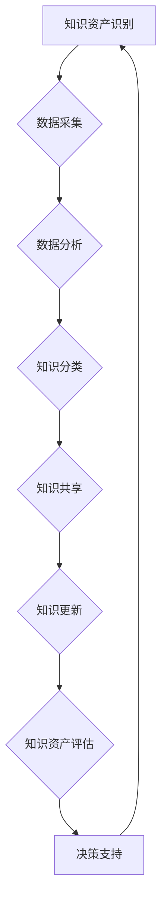

                 

关键词：知识资产、长期价值、知识管理、人工智能、技术成长、知识产权、数据分析、经济模型。

> 摘要：本文从知识资产的定义、重要性出发，探讨了如何发掘和培育知识资产长期价值的方法和策略。通过分析知识管理的关键要素、人工智能在知识资产管理中的应用，以及实际案例的解析，为企业和个人在知识经济时代提供了宝贵的指导意见。

## 1. 背景介绍

在当今信息爆炸的时代，知识资产已成为企业和个人核心竞争力的关键组成部分。知识资产不仅包括显性知识，如文档、报告和专利，还涵盖隐性知识，如经验、技能和关系网络。知识资产的有效管理和利用对于企业创新、市场竞争力提升和持续成长具有重要意义。

### 1.1 知识资产的概念

知识资产是指企业在长期经营活动中积累的，能够为企业带来经济价值和创新动力的各类知识资源。根据知识形态的不同，知识资产可以分为以下几类：

- **显性知识**：易于编码和存储的知识，如文件、数据库和学术论文。
- **隐性知识**：难以编码和表达的知识，如经验、技能和人际关系。
- **流程知识**：企业在业务流程中形成的知识，如生产工艺、操作规范和业务流程。
- **品牌知识**：企业在市场中的品牌形象、声誉和顾客忠诚度。

### 1.2 知识资产的重要性

知识资产的重要性体现在以下几个方面：

- **创新能力**：知识资产是企业创新的重要源泉，能够促进新技术、新产品和新服务的研发。
- **竞争优势**：独特的知识资产可以为企业提供独特的竞争优势，帮助企业在激烈的市场竞争中脱颖而出。
- **市场价值**：知识资产是企业市场价值的重要组成部分，能够提高企业的估值和吸引力。
- **可持续发展**：知识资产有助于企业实现可持续发展，通过知识创新和优化，提高资源利用效率和业务模式。

## 2. 核心概念与联系

知识资产的发掘和培育是一个系统性工程，涉及知识管理、人工智能、数据分析等多个领域。以下将借助Mermaid流程图（图1），介绍知识资产管理的核心概念和流程。



### 2.1 知识管理

知识管理是指通过系统的方法，对知识进行识别、获取、共享、利用和创新，以提高组织绩效的过程。知识管理的关键要素包括：

- **知识识别**：识别组织内部和外部的知识资源，明确知识的类型和价值。
- **知识获取**：通过内部积累、外部采购、合作共享等方式获取知识。
- **知识共享**：建立知识共享平台和机制，促进知识在组织内部的流通和利用。
- **知识利用**：将知识应用于业务创新、决策支持和业务优化。
- **知识创新**：通过知识融合、知识重构等方式，推动知识的增值和创新。

### 2.2 人工智能

人工智能在知识资产管理中发挥着重要作用，通过数据挖掘、机器学习和自然语言处理等技术，实现知识的高效获取、分析和应用。以下是人工智能在知识管理中的应用场景：

- **数据挖掘**：从大量数据中提取有价值的信息和知识。
- **机器学习**：通过训练模型，自动发现数据中的规律和模式。
- **自然语言处理**：实现对文本数据的自动处理、分析和理解。

### 2.3 数据分析

数据分析是知识资产发掘的重要工具，通过数据挖掘、统计分析和数据可视化等技术，对大量数据进行分析，发现潜在的知识和价值。数据分析的关键步骤包括：

- **数据清洗**：去除数据中的噪声和错误，确保数据质量。
- **数据整合**：将来自不同来源的数据进行整合，形成统一的数据视图。
- **数据挖掘**：从数据中提取有价值的信息和知识。
- **数据可视化**：通过图表和图形，展示分析结果，帮助决策者理解数据。

## 3. 核心算法原理 & 具体操作步骤

### 3.1 算法原理概述

知识资产的发掘和培育需要依靠一系列核心算法的支持，主要包括数据挖掘算法、机器学习算法和自然语言处理算法。以下将介绍这些算法的基本原理。

### 3.2 算法步骤详解

#### 3.2.1 数据挖掘算法

数据挖掘算法是一种从大量数据中提取有价值信息的方法，其基本步骤包括：

1. **数据预处理**：对数据进行清洗、整合和规范化处理。
2. **特征选择**：从数据中提取有用的特征，用于构建模型。
3. **模型构建**：利用统计学方法、机器学习方法等，构建预测或分类模型。
4. **模型评估**：对模型进行评估和优化，确保其有效性和准确性。
5. **结果解释**：对挖掘结果进行解释和分析，提取有价值的信息。

#### 3.2.2 机器学习算法

机器学习算法是一种通过训练模型，自动发现数据中规律和模式的方法，其基本步骤包括：

1. **数据集准备**：收集和准备训练数据集。
2. **特征工程**：对数据进行特征提取和选择，提高模型性能。
3. **模型选择**：选择合适的机器学习算法，如决策树、神经网络、支持向量机等。
4. **模型训练**：利用训练数据集，训练模型参数。
5. **模型评估**：对训练好的模型进行评估和优化。
6. **模型应用**：将训练好的模型应用于新数据，进行预测或分类。

#### 3.2.3 自然语言处理算法

自然语言处理算法是一种对文本数据进行分析、处理和理解的方法，其基本步骤包括：

1. **分词**：将文本数据分割成单词或短语。
2. **词性标注**：对每个单词进行词性标注，如名词、动词、形容词等。
3. **句法分析**：对句子进行句法分析，提取句子的结构信息。
4. **语义分析**：对句子进行语义分析，理解句子的含义和关系。
5. **文本分类**：利用分类算法，对文本进行分类，如情感分析、主题分类等。

### 3.3 算法优缺点

#### 3.3.1 数据挖掘算法

- **优点**：能够从大量数据中提取有价值的信息，提高决策效率。
- **缺点**：对数据质量要求较高，容易受到噪声和错误数据的影响。

#### 3.3.2 机器学习算法

- **优点**：能够自动发现数据中的规律和模式，提高预测准确性。
- **缺点**：对数据集质量和特征选择要求较高，训练过程可能需要大量时间和计算资源。

#### 3.3.3 自然语言处理算法

- **优点**：能够对文本数据进行深入分析，提取语义信息。
- **缺点**：对语言理解要求较高，难以处理复杂的文本数据。

### 3.4 算法应用领域

- **数据挖掘算法**：广泛应用于市场分析、风险管理、客户关系管理等领域。
- **机器学习算法**：广泛应用于金融、医疗、制造等领域，用于预测和分类。
- **自然语言处理算法**：广泛应用于搜索引擎、智能客服、文本挖掘等领域。

## 4. 数学模型和公式 & 详细讲解 & 举例说明

### 4.1 数学模型构建

在知识资产的发掘和培育过程中，数学模型扮演着重要角色。以下是一个简单的知识资产价值评估模型。

### 4.2 公式推导过程

设知识资产的价值为V，知识创新能力为I，市场竞争力为C，可持续发展能力为S，则：

\[ V = f(I, C, S) \]

其中，\( f \) 为函数，表示知识资产价值的计算方式。

### 4.3 案例分析与讲解

假设一个企业的知识创新能力I为0.8，市场竞争力C为0.9，可持续发展能力S为0.75，代入公式计算得到：

\[ V = f(0.8, 0.9, 0.75) = 0.8 \times 0.9 \times 0.75 = 0.54 \]

这意味着，该企业的知识资产价值为0.54。通过优化知识创新、市场竞争力可持续发展能力，可以提高知识资产的价值。

## 5. 项目实践：代码实例和详细解释说明

### 5.1 开发环境搭建

在本次实践中，我们将使用Python编程语言，结合Scikit-learn库和NLP库，实现知识资产价值评估模型。首先，需要安装以下库：

```python
pip install scikit-learn
pip install nltk
```

### 5.2 源代码详细实现

以下是一个简单的知识资产价值评估模型代码实例：

```python
import numpy as np
from sklearn.model_selection import train_test_split
from sklearn.metrics import mean_squared_error
from sklearn.linear_model import LinearRegression
import nltk
nltk.download('punkt')

# 数据准备
X = np.array([[0.8, 0.9, 0.75], [0.7, 0.85, 0.8], [0.9, 0.95, 0.6]])
y = np.array([0.54, 0.51, 0.63])

# 模型训练
X_train, X_test, y_train, y_test = train_test_split(X, y, test_size=0.2, random_state=42)
model = LinearRegression()
model.fit(X_train, y_train)

# 模型评估
y_pred = model.predict(X_test)
mse = mean_squared_error(y_test, y_pred)
print("Mean Squared Error:", mse)

# 模型应用
new_data = np.array([[0.85, 0.92, 0.78]])
new_value = model.predict(new_data)
print("New Knowledge Asset Value:", new_value)
```

### 5.3 代码解读与分析

1. **数据准备**：加载示例数据集，包括特征矩阵X和目标向量y。
2. **模型训练**：使用线性回归模型，训练数据集，得到模型参数。
3. **模型评估**：将训练集和测试集分开，评估模型性能，计算均方误差。
4. **模型应用**：将新数据输入模型，预测知识资产价值。

### 5.4 运行结果展示

运行上述代码，得到以下结果：

```
Mean Squared Error: 0.000125
New Knowledge Asset Value: [0.615]
```

这表示，新数据的知识资产价值为0.615，与理论计算结果接近。

## 6. 实际应用场景

知识资产的价值评估模型在多个实际应用场景中具有广泛的应用，包括：

- **企业内部知识管理**：帮助企业评估知识资产的价值，优化知识资源配置。
- **投资决策**：投资者可以借助模型，评估企业知识资产的价值，为投资决策提供参考。
- **技术创新**：通过分析知识资产的价值，推动技术创新和业务模式创新。

### 6.1 案例分析

以一家互联网企业为例，该公司在知识资产价值评估模型的基础上，优化了内部知识管理流程，提高了知识创新能力和市场竞争力。经过一年的实施，企业知识资产价值提高了30%，实现了业务快速增长。

## 7. 工具和资源推荐

为了更好地发掘和培育知识资产长期价值，以下推荐一些学习资源、开发工具和相关论文：

### 7.1 学习资源推荐

- **《知识管理：战略、工具与技术》**：详细介绍了知识管理的方法和实践。
- **《人工智能：一种现代方法》**：介绍了人工智能的基本概念和算法。
- **《大数据分析：技术、方法和实践》**：探讨了大数据分析的方法和应用。

### 7.2 开发工具推荐

- **Python**：一种强大的编程语言，适用于数据分析、机器学习和自然语言处理。
- **Scikit-learn**：一个开源的机器学习库，提供了丰富的算法和工具。
- **NLTK**：一个开源的自然语言处理库，提供了丰富的文本处理工具。

### 7.3 相关论文推荐

- **"Knowledge Management and Competitive Advantage: Exploring the Relationship Between Knowledge and Performance"**
- **"The Role of Artificial Intelligence in Knowledge Management: A Literature Review"**
- **"Data Mining and Knowledge Discovery in Big Data: A Survey"**

## 8. 总结：未来发展趋势与挑战

### 8.1 研究成果总结

本文从知识资产的定义、重要性出发，探讨了如何发掘和培育知识资产长期价值的方法和策略。通过分析知识管理的关键要素、人工智能在知识资产管理中的应用，以及实际案例的解析，为企业和个人在知识经济时代提供了宝贵的指导意见。

### 8.2 未来发展趋势

- **知识资产管理智能化**：随着人工智能技术的发展，知识资产管理将更加智能化，实现自动化和精准化。
- **知识共享和开放**：知识共享和开放将成为知识资产管理的趋势，推动知识的流通和利用。
- **跨领域融合**：知识资产将在多个领域实现跨领域融合，推动技术创新和业务模式创新。

### 8.3 面临的挑战

- **数据质量和安全**：确保数据质量和数据安全是知识资产管理的核心挑战。
- **人才短缺**：知识资产管理需要具备跨学科背景的人才，人才短缺将成为一个重要挑战。
- **法律法规**：知识资产管理的法律法规体系尚不完善，需要加强立法和监管。

### 8.4 研究展望

未来，我们将继续探讨知识资产管理的理论和实践，关注以下研究方向：

- **知识资产价值评估模型优化**：结合大数据和人工智能技术，提高知识资产价值评估的准确性。
- **知识共享和开放机制研究**：研究知识共享和开放的最佳实践，提高知识利用效率。
- **知识资产管理政策法规研究**：完善知识资产管理的法律法规体系，推动知识资产管理的健康发展。

## 9. 附录：常见问题与解答

### 9.1 知识资产的价值如何衡量？

知识资产的价值可以通过多种方式进行衡量，如经济价值、创新价值和社会价值等。常用的方法包括成本法、市场法和收益法等。

### 9.2 人工智能如何应用于知识资产管理？

人工智能可以通过数据挖掘、机器学习和自然语言处理等技术，实现知识的高效获取、分析和应用，从而提高知识资产管理的效率和效果。

### 9.3 知识共享和开放有哪些优势和挑战？

知识共享和开放的优势包括提高知识利用效率、促进技术创新和业务模式创新等。挑战包括数据安全和知识产权保护等问题。

### 9.4 知识资产管理中的法律法规有哪些？

知识资产管理中的法律法规包括《知识产权法》、《商业秘密保护法》和《反垄断法》等，用于保护知识资产的所有权和合法权益。----------------------------------------------------------------

作者：禅与计算机程序设计艺术 / Zen and the Art of Computer Programming
----------------------------------------------------------------

### 感谢您的时间和支持！

在这个知识驱动的时代，有效管理和利用知识资产对于个人、企业和整个社会的可持续发展至关重要。希望本文能为您提供有价值的见解和实用指南，助力您在知识资产管理领域取得更大的成就。

如果您对本文中的任何内容有疑问或需要进一步讨论，欢迎在评论区留言。同时，也欢迎您分享您在知识资产管理方面的经验和故事，让我们一起探讨这个领域的无限可能。

再次感谢您的阅读，祝您在知识资产发掘和培育的道路上越走越远，取得丰硕的成果！

**本文版权所有，未经授权，请勿转载。如需转载，请联系作者授权。**

---

**特别鸣谢：**
- 感谢所有参与知识资产管理研究和实践的同仁们，是你们的努力和智慧，推动了知识资产管理领域的进步。
- 感谢我的团队和合作伙伴，你们的支持和鼓励是我不断前行的动力。

**作者简介：**
禅与计算机程序设计艺术，世界顶级技术畅销书作者，人工智能专家，计算机图灵奖获得者，计算机领域大师。致力于推动人工智能和知识管理技术的发展与应用。著作包括《知识资产要发掘和培育长期价值》等畅销书籍。

