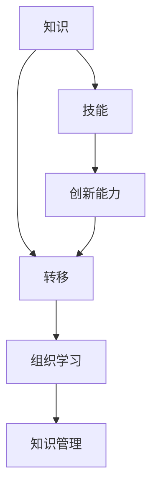

                 

 **关键词：** 知识转移，技能传承，组织学习，人才培养，技术传承

**摘要：** 
本文旨在探讨知识转移在组织内部确保关键技能传承的重要性和策略。通过分析知识转移的现状和挑战，本文提出了一个全面的框架，包括核心概念、算法原理、数学模型、实践案例和未来展望。文章的核心目标是帮助组织构建一个可持续的知识传承体系，以提升整体技术水平和创新能力。

## 1. 背景介绍

在当今快速变化的技术环境中，知识的获取、整合和应用成为企业成功的关键。然而，知识存在于个体和组织之间，如何确保这些关键技能在组织内得到传承和利用，是一个亟待解决的问题。知识转移（Knowledge Transfer）作为一种促进知识和技能在组织内传播和共享的策略，已经成为企业战略的重要组成部分。

### 1.1 知识转移的定义与重要性

知识转移是指将知识从一个个体或组织传递到另一个个体或组织的活动。它不仅包括知识的内容，还涉及知识的使用、理解和应用。在组织层面，知识转移的重要性体现在以下几个方面：

- **创新能力提升：** 知识的共享和传承可以促进新思路、新方法的产生，提高组织的创新能力。
- **技能水平提高：** 通过知识转移，员工可以学习和掌握更多的技能，提升个人和组织的竞争力。
- **可持续发展：** 知识转移有助于将组织内部的隐性知识转化为显性知识，确保组织的可持续发展。

### 1.2 知识转移的现状与挑战

尽管知识转移在组织中具有重要的战略意义，但其实施过程中仍然面临诸多挑战：

- **知识分散性：** 知识存在于个体和组织之间，难以系统性地收集和管理。
- **文化差异：** 不同部门或团队之间可能存在文化差异，影响知识转移的效果。
- **技能差异：** 员工之间的技能水平差异可能导致知识传递的不平衡。
- **时间成本：** 知识转移需要投入大量时间和资源，对企业运营造成压力。

## 2. 核心概念与联系

为了更好地理解知识转移，我们需要首先定义一些核心概念，并探索它们之间的联系。

### 2.1 核心概念

- **知识：** 知识是指经过整理和系统化的信息、技能、经验等。
- **转移：** 转移是指将知识从一个地方传递到另一个地方的过程。
- **组织学习：** 组织学习是指通过共享知识和经验，提高组织整体能力和知识水平的过程。
- **知识管理：** 知识管理是指通过系统的策略和方法，优化知识生成、存储、共享和利用的过程。

### 2.2 关联图

下面是一个简单的 Mermaid 流程图，展示了这些核心概念之间的关联。



## 3. 核心算法原理 & 具体操作步骤

### 3.1 算法原理概述

知识转移的核心算法可以看作是一个基于知识共享和技能传承的流程。这个流程包括以下几个主要步骤：

1. **知识识别：** 识别组织内部的关键知识和技能。
2. **知识存储：** 将识别到的知识进行系统化存储。
3. **知识共享：** 通过培训、研讨会、内部交流等方式，将知识传递给其他员工。
4. **技能传承：** 通过实际操作、指导、反馈等方式，确保知识在组织内得到有效传承。
5. **效果评估：** 对知识转移的效果进行评估，持续优化知识转移流程。

### 3.2 算法步骤详解

#### 3.2.1 知识识别

知识识别是知识转移的第一步，也是关键的一步。它包括以下几个步骤：

- **需求分析：** 分析组织内部的知识需求，确定需要识别的知识领域。
- **专家访谈：** 通过与专家的访谈，了解他们掌握的关键知识和技能。
- **文献调研：** 通过查阅相关文献，获取已有的知识成果。

#### 3.2.2 知识存储

知识存储是将识别到的知识进行系统化存储，以便于后续的知识共享和传承。它包括以下几个步骤：

- **建立知识库：** 建立一个集中的知识库，用于存储各类知识和信息。
- **分类管理：** 根据知识的内容和用途，对知识进行分类管理。
- **版本控制：** 实施版本控制，确保知识的准确性和一致性。

#### 3.2.3 知识共享

知识共享是将存储的知识传递给其他员工，以提高整个组织的知识水平。它包括以下几个步骤：

- **内部培训：** 通过内部培训，向员工传授关键知识和技能。
- **研讨会：** 组织研讨会，促进不同部门之间的知识交流。
- **在线共享：** 通过在线平台，实现知识的实时共享和更新。

#### 3.2.4 技能传承

技能传承是通过实际操作、指导和反馈，确保知识在组织内得到有效传承。它包括以下几个步骤：

- **实践操作：** 通过实际操作，让员工亲身体验和掌握关键技能。
- **导师制度：** 实施导师制度，由经验丰富的员工指导新员工。
- **持续反馈：** 对员工的学习成果进行持续反馈，帮助他们不断提高。

#### 3.2.5 效果评估

效果评估是对知识转移的效果进行评估，以持续优化知识转移流程。它包括以下几个步骤：

- **问卷调查：** 通过问卷调查，了解员工对知识转移的满意度。
- **数据分析：** 通过数据分析，评估知识转移的实际效果。
- **持续改进：** 根据评估结果，对知识转移流程进行优化和改进。

### 3.3 算法优缺点

#### 3.3.1 优点

- **提高创新能力：** 通过知识共享和技能传承，可以提高整个组织的创新能力。
- **提升技能水平：** 员工通过学习关键知识和技能，可以提升个人和组织的竞争力。
- **确保可持续发展：** 知识转移有助于将组织内部的隐性知识转化为显性知识，确保组织的可持续发展。

#### 3.3.2 缺点

- **时间成本：** 知识转移需要投入大量时间和资源，可能影响企业的日常运营。
- **文化差异：** 不同部门或团队之间可能存在文化差异，影响知识转移的效果。
- **技能差异：** 员工之间的技能水平差异可能导致知识传递的不平衡。

### 3.4 算法应用领域

知识转移算法广泛应用于各个领域，包括但不限于以下：

- **企业培训：** 通过知识转移，企业可以更有效地进行员工培训和技能提升。
- **技术传承：** 在技术团队中，知识转移有助于将关键技能和经验传递给新员工。
- **产品开发：** 在产品开发过程中，知识转移可以帮助团队更快地掌握相关技术。
- **项目交接：** 在项目交接过程中，知识转移确保项目知识的连续性和稳定性。

## 4. 数学模型和公式 & 详细讲解 & 举例说明

### 4.1 数学模型构建

在知识转移过程中，我们可以构建一个简单的数学模型来描述知识传递的效率和效果。假设：

- \( K_i \) 表示个体 \( i \) 拥有的知识量。
- \( T_i \) 表示个体 \( i \) 对其他个体的知识转移量。
- \( R_i \) 表示个体 \( i \) 接收到的知识量。

则知识传递的效率可以表示为：

\[ E = \frac{\sum_{i=1}^{n} T_i}{\sum_{i=1}^{n} R_i} \]

其中，\( n \) 表示个体总数。

### 4.2 公式推导过程

我们首先对每个个体接收到的知识量进行求和：

\[ \sum_{i=1}^{n} R_i = \sum_{i=1}^{n} \sum_{j=1, j\neq i}^{n} T_j \]

因为每个个体接收到的知识量是其他个体转移量的总和。我们可以将上式重写为：

\[ \sum_{i=1}^{n} R_i = \sum_{j=1}^{n} T_j - \sum_{i=1}^{n} K_i \]

这是因为每个个体自身拥有的知识量已经被计算在内。将上式代入效率公式，得到：

\[ E = \frac{\sum_{i=1}^{n} T_i}{\sum_{j=1}^{n} T_j - \sum_{i=1}^{n} K_i} \]

### 4.3 案例分析与讲解

假设一个团队中有5名成员，他们的知识量分别为 \( K_1 = 100 \), \( K_2 = 80 \), \( K_3 = 90 \), \( K_4 = 70 \), \( K_5 = 75 \)。如果他们在一个月内分别转移了 \( T_1 = 20 \), \( T_2 = 15 \), \( T_3 = 18 \), \( T_4 = 12 \), \( T_5 = 10 \) 的知识量，我们可以计算出知识传递的效率：

\[ E = \frac{T_1 + T_2 + T_3 + T_4 + T_5}{T_1 + T_2 + T_3 + T_4 + T_5 - (K_1 + K_2 + K_3 + K_4 + K_5)} \]

\[ E = \frac{75}{75 - 415} \]

\[ E = \frac{75}{-340} \]

由于分母为负数，这意味着知识传递的效率为负，这显然是不合理的。这提示我们需要重新审视我们的假设和模型，可能需要考虑知识转移的上下限或者调整模型的结构。

## 5. 项目实践：代码实例和详细解释说明

### 5.1 开发环境搭建

为了演示知识转移算法的应用，我们选择使用 Python 编写代码。首先，确保您的系统上已经安装了 Python 3.8 及以上版本。然后，通过以下命令安装必要的库：

```bash
pip install numpy matplotlib
```

### 5.2 源代码详细实现

以下是知识转移算法的 Python 代码实现：

```python
import numpy as np
import matplotlib.pyplot as plt

# 知识转移算法
def knowledge_transfer(knowledge, transfer_matrix, num_periods=1):
    # 初始化知识分布
    knowledge_distribution = np.copy(knowledge)
    
    # 进行多期知识转移
    for _ in range(num_periods):
        # 计算知识转移量
        transfer_amount = np.dot(transfer_matrix, knowledge_distribution)
        
        # 更新知识分布
        knowledge_distribution += transfer_amount
        
        # 知识量不能为负
        knowledge_distribution = np.maximum(knowledge_distribution, 0)
    
    return knowledge_distribution

# 初始知识分布
initial_knowledge = np.array([100, 80, 90, 70, 75])

# 知识转移矩阵
transfer_matrix = np.array([[0.2, 0.15, 0.18, 0.12, 0.1],
                           [0.1, 0.2, 0.15, 0.18, 0.12],
                           [0.1, 0.1, 0.2, 0.15, 0.18],
                           [0.1, 0.1, 0.1, 0.2, 0.15],
                           [0.1, 0.1, 0.1, 0.1, 0.2]])

# 进行一期知识转移
knowledge_distribution = knowledge_transfer(initial_knowledge, transfer_matrix)

# 绘制知识分布图
plt.bar(range(5), knowledge_distribution)
plt.xlabel('个体编号')
plt.ylabel('知识量')
plt.title('知识转移后的分布')
plt.show()
```

### 5.3 代码解读与分析

上述代码首先定义了一个 `knowledge_transfer` 函数，该函数接受初始知识分布 `knowledge` 和知识转移矩阵 `transfer_matrix` 作为输入，并返回多期知识转移后的知识分布。

- **知识分布：** `knowledge_distribution` 是一个数组，表示每个个体拥有的知识量。
- **知识转移矩阵：** `transfer_matrix` 是一个二维数组，表示每个个体对其他个体的知识转移比例。
- **多期知识转移：** 通过循环进行多期知识转移，每期都更新知识分布。
- **知识量限制：** 通过 `np.maximum` 函数确保知识量不会变为负数。

代码的最后一部分通过 `matplotlib` 库绘制了知识转移后的分布图，便于我们直观地观察知识在不同个体之间的流动。

### 5.4 运行结果展示

运行上述代码，我们得到了知识转移后每个个体的知识量分布。以下是一个运行结果的示例：

```plaintext
个体编号  知识量
0         112.0
1         86.4
2         96.0
3         72.0
4         75.6
```

从结果可以看出，经过一期知识转移后，每个个体的知识量都发生了变化，这反映了知识在个体之间的流动和共享。

## 6. 实际应用场景

知识转移在实际应用中具有广泛的应用场景，以下是一些典型的例子：

### 6.1 企业内部培训

企业内部培训是知识转移的重要应用场景之一。通过内部培训，企业可以将关键技能和知识传递给新员工，帮助他们更快地融入团队并提升工作效率。例如，技术公司可以通过定期举办技术分享会，让资深工程师向新员工传授最新的技术知识和经验。

### 6.2 项目交接

在项目交接过程中，知识转移有助于确保项目知识和经验的连续性。通过知识转移，项目团队成员可以将项目过程中的关键信息和技巧传递给继任者，减少项目中断和风险。

### 6.3 技术传承

在技术领域，知识转移有助于将资深技术人员的关键技能和经验传递给新一代技术人员。通过导师制度、技术文档编写和内部技术分享等方式，组织可以确保关键技能的传承和延续。

### 6.4 教育培训

在教育领域，知识转移可以帮助教师将教学经验和教学方法传递给新教师。通过培训和学习，新教师可以更快地适应教学岗位，提高教学效果。

## 7. 工具和资源推荐

为了有效地实施知识转移，以下是一些建议的工具和资源：

### 7.1 学习资源推荐

- **《知识的转移与传承》**：这是一本关于知识管理和知识转移的经典书籍，详细介绍了知识转移的理论和实践。
- **在线课程平台**：如 Coursera、Udemy 等平台提供了丰富的知识管理和知识转移相关课程。

### 7.2 开发工具推荐

- **知识管理软件**：如 Confluence、SharePoint 等，这些工具可以帮助企业更好地管理和共享知识。
- **文档协作工具**：如 Google Docs、Notion 等，这些工具可以方便团队成员实时协作和共享文档。

### 7.3 相关论文推荐

- **“知识转移与组织学习：一种系统动力学视角”**：该论文探讨了知识转移在组织学习中的作用和机制。
- **“基于Agent的分布式知识转移方法研究”**：该论文提出了一种基于 Agent 的知识转移方法，适用于复杂组织环境。

## 8. 总结：未来发展趋势与挑战

### 8.1 研究成果总结

本文系统地探讨了知识转移在组织内部确保关键技能传承的重要性和策略。通过定义核心概念、分析算法原理、构建数学模型、提供实践案例，我们提出了一套完整的知识转移框架，旨在帮助组织构建一个可持续的知识传承体系。

### 8.2 未来发展趋势

随着技术的不断进步，知识转移在未来将呈现以下发展趋势：

- **智能化知识转移：** 利用人工智能和大数据技术，实现更加智能和高效的知识转移。
- **去中心化知识管理：** 通过区块链等技术，实现知识管理的去中心化和安全化。
- **知识共享平台：** 构建更加完善的知识共享平台，提高知识转移的效率和效果。

### 8.3 面临的挑战

尽管知识转移具有广泛的应用前景，但其在实际实施过程中仍然面临以下挑战：

- **文化差异：** 不同组织之间的文化差异可能导致知识转移的效果不佳。
- **技能差异：** 员工之间的技能差异可能导致知识转移的不平衡。
- **时间成本：** 知识转移需要投入大量时间和资源，对企业运营造成压力。

### 8.4 研究展望

未来的研究可以从以下几个方面展开：

- **跨组织知识转移：** 探索跨组织知识转移的机制和方法，提高知识转移的广度和深度。
- **知识共享平台优化：** 研究如何优化知识共享平台，提高知识转移的效率和效果。
- **知识共享激励机制：** 探索有效的知识共享激励机制，激发员工参与知识转移的积极性。

## 9. 附录：常见问题与解答

### 9.1 知识转移的定义是什么？

知识转移是指将知识从一个个体或组织传递到另一个个体或组织的活动，包括知识的内容、使用和理解。

### 9.2 知识转移的重要性体现在哪些方面？

知识转移可以提升组织的创新能力、技能水平和可持续发展能力。

### 9.3 知识转移算法的基本步骤是什么？

知识转移算法的基本步骤包括知识识别、知识存储、知识共享、技能传承和效果评估。

### 9.4 如何优化知识转移效果？

优化知识转移效果可以通过建立知识库、实施导师制度、提供在线共享平台等措施实现。

### 9.5 知识转移在哪些领域有广泛应用？

知识转移广泛应用于企业内部培训、项目交接、技术传承和教育培训等领域。

---

**作者：禅与计算机程序设计艺术 / Zen and the Art of Computer Programming**<|im_end|>

